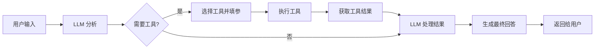

# 📘《Agent 开发学习与实战手册》

> 系统学习见下文各章；日常常用框架 API、Agent 模式与工具定义速查见同目录《常用API与使用场景》。

------

# 第1章：Agent 概念与典型架构

------

> **本章在整体中解决什么问题**：建立对 Agent 的「第一印象」——它是什么、与普通 LLM 对话的区别、核心组成与典型架构、为什么需要 Agent。学完本章再学**第二章**会看到工具定义与调用的具体实现；**第三章**会深入 LangChain/LangGraph 等框架的使用；**第四章**会展开多 Agent 编排与协作。

------

## 1.1 什么是 Agent

### 🧩 核心定义

**Agent** 是指能够根据目标**自主规划、调用工具、多步执行**的智能体，具备**感知-决策-执行-反馈**的闭环能力。

- **感知**：接收用户输入、环境信息、历史状态
- **决策**：基于 LLM 推理，选择下一步行动（调用工具或直接回答）
- **执行**：调用外部工具（API、数据库、检索等）获取信息
- **反馈**：将工具执行结果作为新的输入，继续决策循环

### 🚀 与普通 LLM 对话的区别

| 对比维度 | 普通 LLM 对话 | Agent |
| -------- | ------------- | ----- |
| 交互模式 | 单次问答，依赖模型知识 | 多轮交互，可调用外部工具 |
| 信息获取 | 仅限模型训练数据 | 实时获取外部信息（API、数据库等） |
| 能力边界 | 受模型知识和上下文窗口限制 | 可扩展工具集，能力边界更广 |
| 执行方式 | 直接生成回答 | 规划-执行-反馈循环 |
| 适用场景 | 简单问答、创意生成 | 复杂任务（信息检索、数据操作、多步推理） |

### 📜 典型应用场景

- **信息检索**：通过搜索 API 获取实时信息（天气、新闻、股票）
- **数据操作**：查询数据库、修改配置、执行脚本
- **工作流自动化**：订单处理、报告生成、客户服务
- **多步推理**：数学问题求解、代码调试、科研分析

### 🧠 面试扩展

**面试官：**
Agent 与普通 LLM 有什么本质区别？

**标准回答：**
> Agent 相比普通 LLM 具备自主规划和工具调用能力，通过「感知-决策-执行-反馈」的循环处理复杂任务。它不仅依赖模型的内部知识，还能实时调用外部工具获取信息，适用于需要多步操作和外部数据的场景。

------

## 1.2 Agent 的核心组成

### 🔍 五大核心组件

1. **LLM（大脑）**：负责推理、规划和决策，是 Agent 的核心
2. **工具集（四肢）**：外部能力的接口，如 API 调用、数据库查询、文件操作
3. **记忆（记忆）**：短期记忆（对话上下文）和长期记忆（知识库、用户画像）
4. **控制流（神经系统）**：决定何时停止、何时重试、如何处理异常
5. **输出模块（语言表达）**：将执行结果和推理过程转化为用户友好的回答

### ⚙️ 核心组件关系图

```
Agent
│
├── LLM（推理与规划）
│   └── 处理用户输入 + 历史上下文
├── 工具集（Tool/Function）
│   ├── API 调用
│   ├── 数据库查询
│   ├── 检索系统
│   └── 文件操作
├── 记忆
│   ├── 短期记忆（对话 messages）
│   └── 长期记忆（向量库、知识库）
├── 控制流
│   ├── 执行循环
│   ├── 超时处理
│   └── 错误重试
└── 输出模块
    └── 生成最终回答
```

### 🧩 实例说明：天气查询 Agent

1. **用户输入**：「北京今天的天气怎么样？」
2. **LLM 决策**：需要调用天气 API 获取实时信息
3. **工具调用**：调用天气 API（参数：城市=北京）
4. **执行结果**：返回北京的天气数据（温度、湿度、风力）
5. **LLM 处理**：将 API 结果总结为自然语言
6. **输出回答**：「北京今天晴，温度 25℃，风力 3 级，适合户外活动。」

------

## 1.3 主流 Agent 范式

### 🎯 ReAct 模式

**ReAct**（Reasoning + Acting）是一种让模型交替输出「思考-行动-观察」的模式：

1. **思考（Reasoning）**：模型分析问题，规划下一步行动
2. **行动（Acting）**：模型调用工具执行操作
3. **观察（Observation）**：获取工具执行结果
4. **循环**：根据观察结果继续思考和行动，直到完成任务

### 🚀 Tool Use / Function Calling 模式

**Tool Use** 是当前主流的实现方式，通过结构化的工具调用格式：

1. 模型输出结构化的工具调用（工具名称 + 参数）
2. 程序执行工具并将结果返回给模型
3. 模型基于工具执行结果生成最终回答

### 🔍 两种模式对比

| 模式 | 优势 | 劣势 | 适用场景 |
| ---- | ---- | ---- | -------- |
| ReAct | 推理过程透明，适合复杂逻辑 | 输出格式复杂，实现难度较高 | 数学推理、代码调试 |
| Tool Use | 实现简单，工具调用明确 | 推理过程不够透明 | 信息查询、数据操作 |

### 🧠 面试扩展

**面试官：**
ReAct 和 Tool Use 有什么区别？各自适用于什么场景？

**标准回答：**
> ReAct 强调模型的推理过程，通过「思考-行动-观察」的循环解决复杂问题，适合需要多步推理的场景（如数学题、代码调试）。Tool Use 则更注重工具调用的准确性和结构化，实现简单直接，适合信息查询、数据操作等场景。

------

## 1.4 Agent 与后端系统的集成

### 🏗️ 集成架构

Agent 通常作为**服务层**与后端系统集成：

1. **前端** → **Agent 服务** → **后端 API**
2. **Agent 服务**：负责接收用户请求、调用 LLM、执行工具调用
3. **后端 API**：提供业务逻辑、数据访问、外部系统集成

### 📍 集成方式

- **REST API**：Agent 通过 HTTP 请求调用后端服务
- **内部服务调用**：在同一系统内通过函数调用或 RPC 通信
- **消息队列**：通过消息队列实现异步通信和任务编排

### 🧩 示例：电商客服 Agent

```
用户 → Agent 服务 → 订单查询 API → 库存查询 API → 物流查询 API → Agent 服务 → 用户
```

1. 用户询问：「我的订单什么时候发货？」
2. Agent 调用订单查询 API 获取订单信息
3. Agent 调用库存查询 API 检查库存状态
4. Agent 调用物流查询 API 获取发货信息
5. Agent 汇总信息，生成友好回答

------

# ✅ 本章小结

| 知识点 | 面试关键词 | 实际应用 |
| ------ | ---------- | -------- |
| Agent 定义 | 自主规划、工具调用、多步执行 | 客服系统、智能助手、工作流自动化 |
| 核心组成 | LLM、工具集、记忆、控制流 | 构建完整 Agent 系统 |
| ReAct 模式 | 思考-行动-观察循环 | 复杂推理任务 |
| Tool Use 模式 | 结构化工具调用 | 信息查询、数据操作 |
| 与后端集成 | REST API、内部服务调用 | 企业级应用集成 |

------

## ⚠️ 常见坑与注意点

1. **现象**：Agent 调用工具失败。**原因**：工具描述不清、参数格式错误、权限不足。**正确做法**：提供清晰的工具描述、严格的参数校验、合理的权限控制。

2. **现象**：Agent 陷入循环调用。**原因**：控制流设计不当、停止条件不明确。**正确做法**：设置最大执行步数、明确停止条件、添加超时机制。

3. **现象**：Agent 产生幻觉。**原因**：LLM 知识过时、工具结果解析错误。**正确做法**：结合最新工具结果、添加结果校验、使用检索增强。

4. **现象**：性能和成本问题。**原因**：频繁调用 LLM、工具执行时间长。**正确做法**：缓存工具结果、优化 LLM 调用、合理设置超时。

5. **现象**：安全性问题。**原因**：工具权限过大、输入未校验。**正确做法**：最小权限原则、严格输入校验、敏感操作二次确认。

------

**学习要点**：
- 理解 Agent 的核心定义和与普通 LLM 的区别
- 掌握 Agent 的五大核心组件及其关系
- 熟悉 ReAct 和 Tool Use 两种主流模式
- 了解 Agent 与后端系统的集成方式
- 注意 Agent 开发中的常见坑和解决方案

------

## 🎯 面试常见追问

| 面试官提问 | 回答思路 |
| ---------- | -------- |
| Agent 是什么？与普通 LLM 有什么区别？ | 定义 + 核心能力 + 对比表格要点 |
| Agent 的核心组成有哪些？ | LLM、工具集、记忆、控制流、输出模块 |
| ReAct 和 Tool Use 模式的区别？ | 推理过程 vs 工具调用、适用场景 |
| Agent 如何与后端系统集成？ | REST API、内部服务调用、消息队列 |
| 开发 Agent 时需要注意哪些问题？ | 工具调用失败、循环调用、幻觉、性能、安全 |

------

# 第2章：工具定义与调用

------

> **本章在整体中解决什么问题**：第一章讲了 Agent 的概念和架构；本章**落实到具体实现**——如何定义工具、如何实现工具调用、如何处理工具执行结果。搞清这些后，**第三章**的框架使用、**第四章**的多 Agent 编排才能顺利进行；面试问「如何设计 Agent 工具」也能有具体方案。

------

## 2.1 工具定义规范

### 📍 工具描述结构

一个完整的工具定义应包含以下要素：

1. **工具名称**：简洁明了，便于模型理解和选择
2. **工具描述**：详细说明工具的功能、用途和适用场景
3. **参数 schema**：使用 JSON Schema 定义参数结构，包括参数名称、类型、是否必填、示例值
4. **返回值说明**：描述工具执行后的返回数据结构

### 🧩 示例：天气查询工具

```json
{
  "name": "get_weather",
  "description": "根据城市名称获取实时天气信息",
  "parameters": {
    "type": "object",
    "properties": {
      "city": {
        "type": "string",
        "description": "城市名称，如北京、上海"
      },
      "units": {
        "type": "string",
        "enum": ["celsius", "fahrenheit"],
        "description": "温度单位，默认为摄氏度"
      }
    },
    "required": ["city"]
  }
}
```

### 💡 工具描述最佳实践

- **描述清晰**：使用简洁明了的语言，避免歧义
- **参数明确**：详细说明每个参数的含义和格式
- **示例丰富**：提供参数示例，帮助模型理解
- **边界说明**：说明工具的使用限制和注意事项

------

## 2.2 工具实现方式

### 🔧 本地函数实现

**适用于**：简单逻辑、不需要外部依赖的工具

```python
def get_weather(city, units="celsius"):
    """获取指定城市的天气信息"""
    # 模拟天气 API 调用
    weather_data = {
        "北京": {"temperature": 25, "condition": "晴", "humidity": 45},
        "上海": {"temperature": 28, "condition": "多云", "humidity": 60}
    }
    
    if city not in weather_data:
        return {"error": f"未找到城市 {city} 的天气信息"}
    
    data = weather_data[city]
    if units == "fahrenheit":
        data["temperature"] = data["temperature"] * 9/5 + 32
    
    return data
```

### 🌐 HTTP API 实现

**适用于**：需要调用外部服务的工具

```python
import requests

def get_stock_price(symbol):
    """获取指定股票的实时价格"""
    url = f"https://api.example.com/stock/{symbol}"
    try:
        response = requests.get(url, timeout=5)
        response.raise_for_status()
        return response.json()
    except Exception as e:
        return {"error": str(e)}
```

### 🗄️ 数据库查询实现

**适用于**：需要访问数据库的工具

```python
import sqlite3

def query_user_info(user_id):
    """根据用户 ID 查询用户信息"""
    conn = sqlite3.connect("user.db")
    cursor = conn.cursor()
    
    try:
        cursor.execute("SELECT * FROM users WHERE id = ?", (user_id,))
        user = cursor.fetchone()
        if user:
            return {
                "id": user[0],
                "name": user[1],
                "email": user[2]
            }
        else:
            return {"error": "用户不存在"}
    except Exception as e:
        return {"error": str(e)}
    finally:
        conn.close()
```

------

## 2.3 工具调用流程

### 🔁 完整调用流程

1. **用户输入**：用户发送请求给 Agent
2. **LLM 分析**：LLM 分析请求，决定是否调用工具
3. **工具选择**：LLM 选择合适的工具并填充参数
4. **工具执行**：程序执行工具，获取结果
5. **结果处理**：将工具执行结果返回给 LLM
6. **生成回答**：LLM 基于工具结果生成最终回答

### 📍 流程图



### 🧠 面试扩展

**面试官：**
工具调用的完整流程是什么？

**标准回答：**
> 工具调用的完整流程包括：用户输入 → LLM 分析请求 → 选择合适工具并填充参数 → 执行工具获取结果 → 将结果返回给 LLM → LLM 基于结果生成最终回答。整个过程是一个闭环，确保 Agent 能够利用外部工具获取信息并解决问题。

------

## 2.4 工具调用的实现细节

### 📍 参数校验

**重要性**：确保工具接收到正确格式的参数，避免执行错误

**实现方式**：
- 使用 JSON Schema 验证参数格式
- 添加类型检查和边界值验证
- 提供默认值和错误处理

```python
def validate_parameters(params, schema):
    """验证参数是否符合 schema"""
    # 检查必填参数
    required = schema.get("required", [])
    for param in required:
        if param not in params:
            return False, f"缺少必填参数：{param}"
    
    # 检查参数类型
    properties = schema.get("properties", {})
    for param, config in properties.items():
        if param in params:
            expected_type = config.get("type")
            if expected_type and type(params[param]).__name__ != expected_type:
                return False, f"参数 {param} 类型错误，期望 {expected_type}"
    
    return True, "参数验证通过"
```

### 🔧 错误处理

**重要性**：确保工具调用失败时能够优雅处理，不影响整个 Agent 的运行

**实现方式**：
- 捕获异常并返回错误信息
- 设置超时机制，避免工具执行时间过长
- 提供重试机制，处理临时性失败

```python
def safe_execute_tool(tool_func, params, timeout=10):
    """安全执行工具，处理异常和超时"""
    try:
        import signal
        
        def timeout_handler(signum, frame):
            raise TimeoutError("工具执行超时")
        
        signal.signal(signal.SIGALRM, timeout_handler)
        signal.alarm(timeout)
        
        result = tool_func(**params)
        signal.alarm(0)
        return result
    except Exception as e:
        signal.alarm(0)
        return {"error": str(e)}
```

### 📊 工具调用监控

**重要性**：监控工具调用的频率、耗时和成功率，便于优化

**实现方式**：
- 记录工具调用的开始时间和结束时间
- 统计调用次数、成功次数和失败次数
- 分析工具执行的平均耗时和瓶颈

```python
import time

class ToolMonitor:
    def __init__(self):
        self.stats = {}
    
    def track(self, tool_name, func):
        def wrapper(*args, **kwargs):
            start_time = time.time()
            try:
                result = func(*args, **kwargs)
                success = "error" not in result
            except Exception as e:
                result = {"error": str(e)}
                success = False
            end_time = time.time()
            
            # 更新统计信息
            if tool_name not in self.stats:
                self.stats[tool_name] = {
                    "calls": 0,
                    "success": 0,
                    "failures": 0,
                    "total_time": 0
                }
            
            self.stats[tool_name]["calls"] += 1
            self.stats[tool_name]["total_time"] += end_time - start_time
            if success:
                self.stats[tool_name]["success"] += 1
            else:
                self.stats[tool_name]["failures"] += 1
            
            return result
        return wrapper
```

------

## 2.5 工具安全性

### 🔒 安全考虑

1. **权限控制**：限制工具的访问权限，避免越权操作
2. **输入校验**：严格验证输入参数，防止注入攻击
3. **敏感操作**：对敏感操作进行二次确认
4. **调用限制**：设置工具调用的频率和次数限制
5. **数据安全**：保护工具返回的敏感信息

### 🛡️ 安全实现示例

```python
def secure_tool(func):
    """安全工具装饰器"""
    def wrapper(*args, **kwargs):
        # 1. 权限检查
        if not check_permission(kwargs.get("user_id")):
            return {"error": "权限不足"}
        
        # 2. 输入校验
        if not validate_input(kwargs):
            return {"error": "输入参数无效"}
        
        # 3. 敏感操作确认
        if is_sensitive_operation(func.__name__, kwargs):
            if not confirm_operation(kwargs.get("user_id")):
                return {"error": "操作未确认"}
        
        # 4. 调用限制检查
        if check_rate_limit(func.__name__, kwargs.get("user_id")):
            return {"error": "调用频率过高，请稍后再试"}
        
        # 5. 执行工具
        result = func(*args, **kwargs)
        
        # 6. 数据脱敏
        result = mask_sensitive_data(result)
        
        return result
    return wrapper
```

------

## 2.6 实战：实现一个完整的工具调用

### 🧩 步骤 1：定义工具

```python
# 工具定义
tools = [
    {
        "name": "get_weather",
        "description": "根据城市名称获取实时天气信息",
        "parameters": {
            "type": "object",
            "properties": {
                "city": {
                    "type": "string",
                    "description": "城市名称，如北京、上海"
                }
            },
            "required": ["city"]
        }
    },
    {
        "name": "get_stock_price",
        "description": "获取指定股票的实时价格",
        "parameters": {
            "type": "object",
            "properties": {
                "symbol": {
                    "type": "string",
                    "description": "股票代码，如 AAPL、MSFT"
                }
            },
            "required": ["symbol"]
        }
    }
]
```

### 🔧 步骤 2：实现工具函数

```python
# 天气查询工具
def get_weather(city):
    weather_data = {
        "北京": {"temperature": 25, "condition": "晴", "humidity": 45},
        "上海": {"temperature": 28, "condition": "多云", "humidity": 60},
        "广州": {"temperature": 30, "condition": "雷阵雨", "humidity": 75}
    }
    return weather_data.get(city, {"error": f"未找到城市 {city} 的天气信息"})

# 股票查询工具
def get_stock_price(symbol):
    stock_data = {
        "AAPL": {"price": 180.5, "change": "+1.2%"},
        "MSFT": {"price": 420.8, "change": "-0.5%"},
        "GOOGL": {"price": 135.2, "change": "+0.8%"}
    }
    return stock_data.get(symbol, {"error": f"未找到股票 {symbol} 的价格信息"})

# 工具映射
tool_functions = {
    "get_weather": get_weather,
    "get_stock_price": get_stock_price
}
```

### 🚀 步骤 3：实现工具调用循环

```python
import openai
import json

# 配置 OpenAI API
openai.api_key = "your_api_key"

def run_agent(user_query):
    messages = [
        {"role": "system", "content": "你是一个智能助手，可以调用工具获取信息。根据用户的问题，选择合适的工具并填充参数。"},
        {"role": "user", "content": user_query}
    ]
    
    # 最大执行步数
    max_steps = 5
    step = 0
    
    while step < max_steps:
        step += 1
        
        # 调用 LLM
        response = openai.ChatCompletion.create(
            model="gpt-4",
            messages=messages,
            tools=tools,
            tool_choice="auto"
        )
        
        # 处理 LLM 响应
        assistant_message = response.choices[0].message
        messages.append(assistant_message)
        
        # 检查是否需要调用工具
        if hasattr(assistant_message, "tool_calls") and assistant_message.tool_calls:
            for tool_call in assistant_message.tool_calls:
                tool_name = tool_call.function.name
                tool_args = json.loads(tool_call.function.arguments)
                
                # 执行工具
                if tool_name in tool_functions:
                    tool_result = tool_functions[tool_name](**tool_args)
                else:
                    tool_result = {"error": f"工具 {tool_name} 不存在"}
                
                # 将工具结果添加到消息中
                messages.append({
                    "role": "tool",
                    "tool_call_id": tool_call.id,
                    "name": tool_name,
                    "content": json.dumps(tool_result)
                })
        else:
            # 没有工具调用，返回最终回答
            return assistant_message.content
    
    return "抱歉，处理超时，请稍后再试。"
```

### 🎯 步骤 4：测试

```python
# 测试天气查询
result = run_agent("北京今天的天气怎么样？")
print(result)

# 测试股票查询
result = run_agent("苹果股票现在的价格是多少？")
print(result)
```

------

# ✅ 本章小结

| 知识点 | 面试关键词 | 实际应用 |
| ------ | ---------- | -------- |
| 工具定义 | JSON Schema、参数校验、返回值说明 | 定义清晰的工具接口 |
| 工具实现 | 本地函数、HTTP API、数据库查询 | 实现各种类型的工具 |
| 工具调用流程 | LLM 分析、工具选择、执行、结果处理 | 构建完整的工具调用循环 |
| 错误处理 | 异常捕获、超时机制、重试策略 | 提高工具调用的可靠性 |
| 安全性 | 权限控制、输入校验、敏感操作确认 | 确保工具调用的安全性 |

------

## ⚠️ 常见坑与注意点

1. **现象**：工具描述不清导致模型调用错误。**原因**：工具描述过于简洁或模糊。**正确做法**：提供详细的工具描述，包括功能、参数含义和使用场景。

2. **现象**：参数格式错误导致工具执行失败。**原因**：参数 schema 定义不严格，模型填充参数时出错。**正确做法**：使用 JSON Schema 严格定义参数结构，提供参数示例。

3. **现象**：工具执行超时导致整个 Agent 卡住。**原因**：没有设置超时机制。**正确做法**：为工具执行设置合理的超时时间，避免无限等待。

4. **现象**：工具返回结果格式不一致导致 LLM 解析错误。**原因**：工具返回的数据结构不规范。**正确做法**：统一工具返回格式，使用 JSON 结构并包含明确的错误字段。

5. **现象**：工具权限过大导致安全风险。**原因**：没有实施权限控制。**正确做法**：采用最小权限原则，对敏感操作进行二次确认。

------

**学习要点**：
- 掌握工具定义的规范和最佳实践
- 熟悉不同类型工具的实现方式
- 理解工具调用的完整流程和实现细节
- 注意工具调用中的错误处理和安全性
- 能够独立实现一个完整的工具调用系统

------

## 🎯 面试常见追问

| 面试官提问 | 回答思路 |
| ---------- | -------- |
| 如何设计一个好的工具描述？ | 工具名称、详细描述、参数 schema、返回值说明 |
| 工具实现有哪些方式？ | 本地函数、HTTP API、数据库查询 |
| 工具调用的完整流程是什么？ | 用户输入 → LLM 分析 → 工具选择 → 执行 → 结果处理 → 生成回答 |
| 如何处理工具调用中的错误？ | 异常捕获、超时机制、重试策略 |
| 工具安全性需要考虑哪些方面？ | 权限控制、输入校验、敏感操作确认、调用限制 |

------

# 第3章：LangChain 与 LangGraph 概览

------

> **本章在整体中解决什么问题**：第二章讲了工具定义与调用的基础实现；本章**引入框架**——LangChain 和 LangGraph 的核心概念、使用方法和适用场景。学完本章再学**第四章**的多 Agent 编排会更得心应手；面试问「Agent 框架选型」也能有清晰的判断依据。

------

## 3.1 LangChain 核心概念

### 🧩 什么是 LangChain

**LangChain** 是一个用于构建 LLM 应用的框架，提供了一系列组件和工具，简化 Agent 的开发过程。它的核心价值在于：

- **模块化**：将 LLM、Prompt、工具、记忆等组件模块化
- **可组合**：通过链式调用组合不同组件
- **可扩展**：支持自定义组件和集成第三方服务

### 🔍 核心抽象

1. **LLM**：语言模型接口，支持各种模型（OpenAI、Anthropic、国产模型等）
2. **PromptTemplate**：提示词模板，用于构建结构化的提示词
3. **Chain**：组件的链式组合，如 LLMChain、SequentialChain
4. **Tool**：外部工具接口，用于调用外部服务
5. **Memory**：记忆组件，用于存储对话历史和状态
6. **Agent**：智能体，具备自主决策和工具调用能力
7. **Callback**：回调机制，用于监控和记录执行过程

### 🚀 典型使用场景

- **对话 Agent**：构建具有记忆能力的对话系统
- **RAG（检索增强生成）**：结合外部知识库进行问答
- **工作流自动化**：构建多步骤的自动化工作流
- **内容生成**：基于模板生成结构化内容

------

## 3.2 LangChain 的核心组件

### 📍 LLM 接口

**作用**：统一不同语言模型的调用接口，简化模型切换

**示例**：

```python
from langchain_openai import ChatOpenAI
from langchain_community.llms import Ollama

# 使用 OpenAI 模型
openai_llm = ChatOpenAI(
    model="gpt-4",
    api_key="your_api_key"
)

# 使用本地 Ollama 模型
ollama_llm = Ollama(
    model="llama3"
)
```

### 📍 PromptTemplate

**作用**：标准化提示词构建，支持变量替换

**示例**：

```python
from langchain.prompts import ChatPromptTemplate

# 构建提示词模板
prompt = ChatPromptTemplate.from_template(
    "你是一个专业的 {role}，请回答以下问题：\n{question}"
)

# 填充变量
formatted_prompt = prompt.format(
    role="金融顾问",
    question="如何制定个人理财计划？"
)
```

### 📍 Chain

**作用**：组合多个组件形成处理流程

**示例**：

```python
from langchain.chains import LLMChain

# 创建 LLM 链
chain = LLMChain(
    llm=openai_llm,
    prompt=prompt
)

# 执行链
result = chain.run(
    role="金融顾问",
    question="如何制定个人理财计划？"
)
```

### 📍 Tool 和 Toolkit

**作用**：定义和管理外部工具

**示例**：

```python
from langchain.tools import Tool
from langchain.utilities import SerpAPIWrapper

# 创建搜索工具
search = SerpAPIWrapper(
    serpapi_api_key="your_api_key"
)

# 定义工具
tools = [
    Tool(
        name="Search",
        func=search.run,
        description="用于搜索最新信息"
    )
]
```

### 📍 Memory

**作用**：存储对话历史，支持上下文感知

**示例**：

```python
from langchain.memory import ConversationBufferMemory

# 创建对话记忆
memory = ConversationBufferMemory(
    memory_key="chat_history",
    return_messages=True
)

# 在链中使用记忆
from langchain.chains import ConversationChain

conversation_chain = ConversationChain(
    llm=openai_llm,
    memory=memory
)
```

------

## 3.3 LangChain Expression Language (LCEL)

### 🎯 什么是 LCEL

**LCEL** 是 LangChain 提供的一种声明式语言，用于构建复杂的 LLM 应用流水线。它的特点是：

- **简洁**：使用链式语法表达复杂流程
- **可组合**：支持组件的灵活组合
- **可观察**：内置监控和调试能力

### 🧩 基本语法

```python
from langchain_core.prompts import ChatPromptTemplate
from langchain_core.output_parsers import StrOutputParser

# 构建简单流水线
pipeline = (
    ChatPromptTemplate.from_template("你是一个{role}，请{task}")
    | openai_llm
    | StrOutputParser()
)

# 执行流水线
result = pipeline.invoke({
    "role": "软件工程师",
    "task": "解释什么是面向对象编程"
})
```

### 🚀 高级用法

```python
from langchain_core.runnables import RunnableParallel, RunnableLambda

# 并行执行多个任务
parallel = RunnableParallel(
    summary=(
        ChatPromptTemplate.from_template("总结以下内容：{text}")
        | openai_llm
        | StrOutputParser()
    ),
    keywords=(
        ChatPromptTemplate.from_template("提取以下内容的关键词：{text}")
        | openai_llm
        | StrOutputParser()
    )
)

# 执行并行任务
result = parallel.invoke({
    "text": "LangChain 是一个用于构建 LLM 应用的框架，提供了模块化的组件和工具。"
})
```

------

## 3.4 LangGraph 核心概念

### 🧩 什么是 LangGraph

**LangGraph** 是 LangChain 生态中的一个基于图的 Agent 编排框架，专为复杂的多步骤、多 Agent 协作场景设计。它的核心价值在于：

- **显式状态管理**：通过图的节点和边管理状态
- **灵活的控制流**：支持分支、循环、条件执行
- **多 Agent 协作**：便于构建多 Agent 系统
- **人工介入**：支持在流程中插入人工审核节点

### 🔍 核心概念

1. **State**：状态对象，存储整个流程的状态
2. **Node**：图的节点，代表一个处理步骤
3. **Edge**：图的边，决定节点之间的流转
4. **Graph**：整个状态图，定义完整的处理流程

### 🚀 典型使用场景

- **复杂工作流**：需要多步骤、多分支的业务流程
- **多 Agent 协作**：多个 Agent 分工协作完成任务
- **需要人工审核**：流程中需要人工干预的场景
- **状态管理复杂**：需要显式管理状态的场景

------

## 3.5 LangGraph 的基本使用

### 📍 定义状态

```python
from typing import TypedDict, Optional

class AgentState(TypedDict):
    """Agent 状态"""
    user_query: str
    intermediate_steps: list
    final_answer: Optional[str]
    current_agent: str
```

### 📍 定义节点

```python
def planner_node(state):
    """规划节点"""
    # 处理逻辑
    return {
        "intermediate_steps": state["intermediate_steps"] + ["规划完成"],
        "current_agent": "executor"
    }

def executor_node(state):
    """执行节点"""
    # 处理逻辑
    return {
        "intermediate_steps": state["intermediate_steps"] + ["执行完成"],
        "final_answer": "任务完成",
        "current_agent": "planner"
    }
```

### 📍 构建图

```python
from langgraph.graph import StateGraph

# 创建状态图
graph_builder = StateGraph(AgentState)

# 添加节点
graph_builder.add_node("planner", planner_node)
graph_builder.add_node("executor", executor_node)

# 添加边
graph_builder.add_edge("planner", "executor")
graph_builder.add_edge("executor", "planner")

# 设置入口点
graph_builder.set_entry_point("planner")

# 编译图
graph = graph_builder.compile()
```

### 📍 执行图

```python
# 执行图
result = graph.invoke({
    "user_query": "完成项目规划",
    "intermediate_steps": [],
    "final_answer": None,
    "current_agent": "planner"
})
```

------

## 3.6 LangChain 与 LangGraph 的选择

### 🔍 对比分析

| 特性 | LangChain | LangGraph |
| ---- | -------- | --------- |
| 设计理念 | 链式组合 | 基于图的状态管理 |
| 适用场景 | 简单 Agent、RAG、内容生成 | 复杂工作流、多 Agent 协作 |
| 状态管理 | 隐式状态 | 显式状态 |
| 控制流 | 线性为主 | 支持分支、循环、条件 |
| 复杂度 | 相对简单 | 相对复杂 |
| 学习曲线 | 较平缓 | 较陡峭 |

### 💡 选择建议

- **选择 LangChain**：
  - 快速搭建简单的 Agent 系统
  - 实现 RAG 问答系统
  - 构建基于模板的内容生成
  - 对状态管理要求不高的场景

- **选择 LangGraph**：
  - 构建复杂的多步骤工作流
  - 实现多 Agent 协作系统
  - 需要显式状态管理的场景
  - 流程中需要人工介入的场景

### 🧠 面试扩展

**面试官：**
LangChain 和 LangGraph 有什么区别？如何选择？

**标准回答：**
> LangChain 是一个通用的 LLM 应用框架，通过链式组合实现简单的 Agent 和 RAG 系统，适合快速开发。LangGraph 是基于图的 Agent 编排框架，专为复杂的多步骤、多 Agent 协作场景设计，支持显式状态管理和灵活的控制流。选择时，简单场景用 LangChain，复杂工作流和多 Agent 协作用 LangGraph。

------

## 3.7 与国产模型的集成

### 📍 自定义 LLM 封装

**作用**：将国产模型适配到 LangChain 框架中

**示例**：

```python
from langchain_core.language_models import BaseChatModel
from langchain_core.messages import BaseMessage
from typing import List, Optional

class CustomLLM(BaseChatModel):
    """自定义 LLM 实现"""
    
    def _generate(self, messages: List[BaseMessage], **kwargs):
        # 调用国产模型 API
        # 处理响应
        pass
    
    @property
    def _llm_type(self) -> str:
        return "custom"

# 使用自定义 LLM
custom_llm = CustomLLM()
```

### 🚀 集成示例

```python
# 使用智谱 AI
from langchain_community.llms import ZhipuAI

zhipu_llm = ZhipuAI(
    api_key="your_api_key",
    model="glm-4"
)

# 使用百度文心一言
from langchain_community.llms import ErnieBot

ernie_llm = ErnieBot(
    api_key="your_api_key",
    model="ernie-bot"
)
```

------

# ✅ 本章小结

| 知识点 | 面试关键词 | 实际应用 |
| ------ | ---------- | -------- |
| LangChain 核心概念 | 模块化、可组合、可扩展 | 快速搭建 Agent 系统 |
| 核心组件 | LLM、PromptTemplate、Chain、Tool、Memory | 构建各种 LLM 应用 |
| LCEL | 声明式、链式语法、可组合 | 构建复杂流水线 |
| LangGraph | 基于图、显式状态、灵活控制流 | 复杂工作流和多 Agent 协作 |
| 框架选择 | 简单场景用 LangChain，复杂场景用 LangGraph | 根据需求选择合适的框架 |
| 国产模型集成 | 自定义 LLM 封装、第三方集成 | 支持国内模型生态 |

------

## ⚠️ 常见坑与注意点

1. **现象**：LangChain 版本兼容性问题。**原因**：不同版本的 LangChain API 变化较大。**正确做法**：锁定版本号，参考官方文档使用对应版本的 API。

2. **现象**：内存占用过高。**原因**：Memory 组件存储过多对话历史。**正确做法**：使用滑动窗口记忆，限制历史消息数量。

3. **现象**：工具调用失败。**原因**：工具描述不符合模型预期。**正确做法**：按照模型要求格式化工具描述，提供清晰的参数说明。

4. **现象**：LangGraph 状态管理复杂。**原因**：状态定义不合理，节点间数据传递混乱。**正确做法**：设计清晰的状态结构，明确节点间的数据传递方式。

5. **现象**：性能问题。**原因**：频繁调用 LLM，没有缓存机制。**正确做法**：实现结果缓存，优化 LLM 调用频率。

------

**学习要点**：
- 理解 LangChain 的核心概念和组件
- 掌握 LCEL 的使用方法
- 了解 LangGraph 的设计理念和使用场景
- 能够根据需求选择合适的框架
- 掌握与国产模型的集成方法

------

## 🎯 面试常见追问

| 面试官提问 | 回答思路 |
| ---------- | -------- |
| LangChain 的核心组件有哪些？ | LLM、PromptTemplate、Chain、Tool、Memory、Agent、Callback |
| LCEL 是什么？有什么优势？ | 声明式语言、链式语法、可组合、可观察 |
| LangGraph 与 LangChain 的区别？ | 基于图 vs 链式组合、显式状态 vs 隐式状态、复杂工作流 vs 简单场景 |
| 如何选择 LangChain 和 LangGraph？ | 根据场景复杂度、状态管理需求、控制流复杂度 |
| 如何集成国产模型到 LangChain？ | 自定义 LLM 封装、使用第三方集成 |

------

# 第4章：多 Agent 与编排

------

> **本章在整体中解决什么问题**：第三章讲了 LangChain 和 LangGraph 框架；本章**聚焦多 Agent 系统**——如何设计多 Agent 架构、如何实现 Agent 间的协作与编排、如何处理复杂的工作流。学完本章后，能够构建更强大的 Agent 系统，面试问「多 Agent 协作」也能有深入的见解。

------

## 4.1 多 Agent 架构设计

### 🧩 多 Agent 的优势

**多 Agent 系统**通过多个专业化的 Agent 协作，能够处理更复杂的任务。其优势包括：

- **分工明确**：每个 Agent 专注于特定领域，提高专业性
- **能力互补**：不同 Agent 具有不同的工具和知识，互补不足
- **并行处理**：多个 Agent 可以同时处理不同子任务，提高效率
- **容错性强**：单一 Agent 失败不会导致整个系统崩溃

### 🔍 常见多 Agent 模式

1. **主从模式**：一个主控 Agent 协调多个专业 Agent
2. **流水线模式**：多个 Agent 按顺序处理任务的不同阶段
3. **专家会诊模式**：多个专家 Agent 共同解决复杂问题
4. **竞争模式**：多个 Agent 竞争提供最佳解决方案

### 🚀 架构示例：主从模式

```
主控 Agent
│
├── 规划 Agent（负责任务分解）
├── 执行 Agent（负责工具调用）
├── 总结 Agent（负责结果汇总）
└── 监控 Agent（负责异常处理）
```

------

## 4.2 Agent 间的通信机制

### 📍 共享状态

**作用**：多个 Agent 通过共享状态进行通信，适合简单的协作场景

**实现方式**：
- 使用共享内存（如 Redis、内存数据库）
- 定义统一的状态结构
- 通过状态更新实现信息传递

**示例**：

```python
class SharedState:
    """共享状态"""
    def __init__(self):
        self.tasks = []
        self.results = {}
        self.current_agent = ""

# 共享状态实例
state = SharedState()

# Agent 1 更新状态
state.tasks.append("任务1")

# Agent 2 读取状态
task = state.tasks.pop(0)
```

### 📍 消息队列

**作用**：通过消息队列实现 Agent 间的异步通信，适合复杂的协作场景

**实现方式**：
- 使用 RabbitMQ、Kafka 等消息队列
- 定义消息格式和主题
- Agent 发布和订阅消息

**示例**：

```python
import pika

# 连接消息队列
connection = pika.BlockingConnection(pika.ConnectionParameters('localhost'))
channel = connection.channel()

# 声明队列
channel.queue_declare(queue='tasks')

# 发布消息
def send_task(task):
    channel.basic_publish(
        exchange='',
        routing_key='tasks',
        body=task
    )

# 消费消息
def receive_task(ch, method, properties, body):
    task = body.decode()
    print(f"接收到任务: {task}")

channel.basic_consume(
    queue='tasks',
    on_message_callback=receive_task,
    auto_ack=True
)
```

### 📍 直接调用

**作用**：一个 Agent 直接调用另一个 Agent 的方法，适合同步协作场景

**实现方式**：
- 将 Agent 封装为服务
- 提供 API 接口
- 其他 Agent 通过 API 调用

**示例**：

```python
class PlannerAgent:
    """规划 Agent"""
    def plan(self, task):
        # 规划逻辑
        return {"subtasks": ["子任务1", "子任务2"]}

class ExecutorAgent:
    """执行 Agent"""
    def execute(self, subtask):
        # 执行逻辑
        return {"result": f"执行结果: {subtask}"}

# 直接调用
planner = PlannerAgent()
executor = ExecutorAgent()

plan = planner.plan("主任务")
for subtask in plan["subtasks"]:
    result = executor.execute(subtask)
    print(result)
```

------

## 4.3 多 Agent 编排框架

### 🧩 LangGraph 实现多 Agent 协作

**优势**：
- 显式状态管理
- 灵活的控制流
- 支持条件分支和循环
- 便于可视化和调试

**示例**：

```python
from langgraph.graph import StateGraph
from typing import TypedDict, Optional

class MultiAgentState(TypedDict):
    """多 Agent 状态"""
    user_query: str
    plan: Optional[dict]
    subtasks: list
    results: dict
    current_agent: str
    final_answer: Optional[str]

# 定义节点
def planner_node(state):
    """规划节点"""
    # 规划逻辑
    return {
        "plan": {"subtasks": ["分析需求", "执行任务", "总结结果"]},
        "subtasks": ["分析需求", "执行任务", "总结结果"],
        "current_agent": "executor"
    }

def executor_node(state):
    """执行节点"""
    if not state["subtasks"]:
        return {
            "current_agent": "summarizer"
        }
    
    subtask = state["subtasks"].pop(0)
    # 执行逻辑
    result = f"执行 {subtask} 的结果"
    
    results = state.get("results", {})
    results[subtask] = result
    
    return {
        "subtasks": state["subtasks"],
        "results": results,
        "current_agent": "executor"
    }

def summarizer_node(state):
    """总结节点"""
    # 总结逻辑
    summary = "\n".join([f"{k}: {v}" for k, v in state["results"].items()])
    return {
        "final_answer": f"任务完成！\n{summary}",
        "current_agent": "planner"
    }

# 构建图
graph_builder = StateGraph(MultiAgentState)
graph_builder.add_node("planner", planner_node)
graph_builder.add_node("executor", executor_node)
graph_builder.add_node("summarizer", summarizer_node)

# 添加边
graph_builder.add_edge("planner", "executor")
graph_builder.add_edge("executor", "executor")  # 循环执行子任务
graph_builder.add_edge("executor", "summarizer")  # 子任务完成后总结
graph_builder.add_edge("summarizer", "planner")  # 回到规划节点

# 设置入口点
graph_builder.set_entry_point("planner")

# 编译图
graph = graph_builder.compile()

# 执行图
result = graph.invoke({
    "user_query": "完成项目分析",
    "plan": None,
    "subtasks": [],
    "results": {},
    "current_agent": "planner",
    "final_answer": None
})
```

### 🚀 自定义编排框架

**适用于**：需要高度定制化的场景

**实现方式**：
- 定义 Agent 接口
- 实现调度器
- 设计通信机制

**示例**：

```python
class Agent:
    """Agent 基类"""
    def run(self, input_data):
        raise NotImplementedError

class PlannerAgent(Agent):
    """规划 Agent"""
    def run(self, input_data):
        return {"subtasks": ["任务1", "任务2"]}

class ExecutorAgent(Agent):
    """执行 Agent"""
    def run(self, input_data):
        subtask = input_data["subtask"]
        return {"result": f"执行 {subtask} 的结果"}

class Orchestrator:
    """编排器"""
    def __init__(self):
        self.agents = {
            "planner": PlannerAgent(),
            "executor": ExecutorAgent()
        }
    
    def run(self, user_query):
        # 1. 规划
        plan = self.agents["planner"].run({"query": user_query})
        
        # 2. 执行
        results = []
        for subtask in plan["subtasks"]:
            result = self.agents["executor"].run({"subtask": subtask})
            results.append(result)
        
        # 3. 汇总
        return {"results": results}

# 使用编排器
orchestrator = Orchestrator()
result = orchestrator.run("完成项目任务")
```

------

## 4.4 多 Agent 协作的最佳实践

### 📍 职责划分

**原则**：
- **单一职责**：每个 Agent 只负责一个领域
- **边界清晰**：明确每个 Agent 的职责边界
- **接口稳定**：定义稳定的 Agent 间通信接口

**示例**：

| Agent 类型 | 职责 | 工具 |
| ---------- | ---- | ---- |
| 规划 Agent | 任务分解、制定计划 | 分析工具、规划工具 |
| 执行 Agent | 执行具体任务 | API 调用、数据库操作 |
| 总结 Agent | 汇总结果、生成报告 | 总结工具、格式化工具 |
| 监控 Agent | 监控执行状态、处理异常 | 监控工具、告警工具 |

### 📍 通信协议

**原则**：
- **标准化**：使用标准化的消息格式
- **容错性**：处理消息丢失和 Agent 失败
- **可追溯**：记录通信历史，便于调试

**示例消息格式**：

```json
{
  "message_id": "uuid",
  "sender": "planner",
  "receiver": "executor",
  "type": "task",
  "content": {
    "task_id": "task_1",
    "description": "分析用户需求",
    "deadline": "2024-12-31"
  },
  "timestamp": "2024-12-01T10:00:00Z"
}
```

### 📍 冲突解决

**原则**：
- **优先级机制**：为 Agent 设置优先级
- **仲裁机制**：当多个 Agent 意见冲突时的解决机制
- **回滚机制**：当协作失败时的回滚策略

**示例**：

```python
def resolve_conflict(agent_opinions):
    """解决 Agent 意见冲突"""
    # 1. 按优先级排序
    sorted_opinions = sorted(
        agent_opinions, 
        key=lambda x: x["priority"], 
        reverse=True
    )
    
    # 2. 返回优先级最高的意见
    return sorted_opinions[0]["opinion"]
```

------

## 4.5 多 Agent 系统的挑战与解决方案

### 🔍 挑战

1. **协调复杂性**：多个 Agent 之间的协调和同步
2. **状态一致性**：确保多个 Agent 看到一致的状态
3. **性能开销**：多个 Agent 带来的额外开销
4. **故障处理**：单个 Agent 故障对整个系统的影响
5. **安全性**：Agent 间通信的安全性

### 🛠️ 解决方案

1. **协调复杂性**：
   - 使用中心化的编排器
   - 定义明确的通信协议
   - 实现状态同步机制

2. **状态一致性**：
   - 使用分布式锁
   - 实现乐观并发控制
   - 定期状态同步

3. **性能开销**：
   - 实现 Agent 池，复用 Agent 实例
   - 优化通信方式，减少网络开销
   - 使用异步处理，提高并发效率

4. **故障处理**：
   - 实现 Agent 健康检查
   - 设计故障转移机制
   - 提供重试和回滚能力

5. **安全性**：
   - 加密 Agent 间通信
   - 实现访问控制
   - 审计 Agent 操作

------

## 4.6 实战：构建多 Agent 客服系统

### 🧩 系统架构

```
用户 → 主控 Agent → 意图识别 Agent → 专业 Agent（订单、物流、售后） → 总结 Agent → 用户
```

### 🔧 实现步骤

#### 步骤 1：定义 Agent

```python
class IntentAgent(Agent):
    """意图识别 Agent"""
    def run(self, user_query):
        # 识别用户意图
        if "订单" in user_query:
            return {"intent": "order", "confidence": 0.9}
        elif "物流" in user_query:
            return {"intent": "logistics", "confidence": 0.9}
        elif "售后" in user_query:
            return {"intent": "after_sales", "confidence": 0.9}
        else:
            return {"intent": "general", "confidence": 0.5}

class OrderAgent(Agent):
    """订单 Agent"""
    def run(self, user_query):
        # 处理订单相关问题
        return {"response": "您的订单信息如下..."}

class LogisticsAgent(Agent):
    """物流 Agent"""
    def run(self, user_query):
        # 处理物流相关问题
        return {"response": "您的物流信息如下..."}

class AfterSalesAgent(Agent):
    """售后 Agent"""
    def run(self, user_query):
        # 处理售后相关问题
        return {"response": "您的售后申请已处理..."}

class SummaryAgent(Agent):
    """总结 Agent"""
    def run(self, responses):
        # 汇总多个 Agent 的响应
        return {"final_response": "\n".join(responses)}
```

#### 步骤 2：实现编排器

```python
class CustomerServiceOrchestrator:
    """客服系统编排器"""
    def __init__(self):
        self.agents = {
            "intent": IntentAgent(),
            "order": OrderAgent(),
            "logistics": LogisticsAgent(),
            "after_sales": AfterSalesAgent(),
            "summary": SummaryAgent()
        }
    
    def run(self, user_query):
        # 1. 意图识别
        intent_result = self.agents["intent"].run(user_query)
        intent = intent_result["intent"]
        
        # 2. 调用对应专业 Agent
        responses = []
        if intent == "order":
            response = self.agents["order"].run(user_query)
            responses.append(response["response"])
        elif intent == "logistics":
            response = self.agents["logistics"].run(user_query)
            responses.append(response["response"])
        elif intent == "after_sales":
            response = self.agents["after_sales"].run(user_query)
            responses.append(response["response"])
        else:
            responses.append("请提供更多信息，以便我更好地帮助您。")
        
        # 3. 汇总结果
        summary_result = self.agents["summary"].run(responses)
        return summary_result["final_response"]
```

#### 步骤 3：测试

```python
# 测试客服系统
orchestrator = CustomerServiceOrchestrator()

# 测试订单查询
result = orchestrator.run("我的订单什么时候发货？")
print(result)

# 测试物流查询
result = orchestrator.run("我的包裹到哪里了？")
print(result)

# 测试售后问题
result = orchestrator.run("我想退货，怎么操作？")
print(result)
```

------

# ✅ 本章小结

| 知识点 | 面试关键词 | 实际应用 |
| ------ | ---------- | -------- |
| 多 Agent 优势 | 分工明确、能力互补、并行处理、容错性强 | 复杂任务处理、客服系统、工作流自动化 |
| 通信机制 | 共享状态、消息队列、直接调用 | Agent 间信息传递 |
| 编排框架 | LangGraph、自定义编排器 | 多 Agent 协作管理 |
| 最佳实践 | 职责划分、通信协议、冲突解决 | 构建高效的多 Agent 系统 |
| 挑战与解决方案 | 协调复杂性、状态一致性、性能开销、故障处理、安全性 | 系统稳定性和可靠性 |

------

## ⚠️ 常见坑与注意点

1. **现象**：Agent 间通信混乱。**原因**：通信协议不清晰，消息格式不一致。**正确做法**：定义标准化的消息格式和通信协议，确保 Agent 间能够正确理解彼此的消息。

2. **现象**：状态不一致。**原因**：多个 Agent 同时修改状态，导致数据冲突。**正确做法**：实现状态同步机制，使用分布式锁或乐观并发控制。

3. **现象**：性能下降。**原因**：多个 Agent 频繁通信，产生额外开销。**正确做法**：优化通信方式，实现 Agent 池，使用异步处理。

4. **现象**：系统崩溃。**原因**：单个 Agent 故障导致整个系统崩溃。**正确做法**：实现 Agent 健康检查和故障转移机制。

5. **现象**：职责重叠。**原因**：Agent 职责划分不清晰，导致重复工作。**正确做法**：明确每个 Agent 的职责边界，避免职责重叠。

------

**学习要点**：
- 理解多 Agent 系统的优势和架构模式
- 掌握 Agent 间的通信机制
- 熟悉多 Agent 编排框架的使用
- 了解多 Agent 协作的最佳实践
- 能够解决多 Agent 系统的常见挑战

------

## 🎯 面试常见追问

| 面试官提问 | 回答思路 |
| ---------- | -------- |
| 多 Agent 系统的优势是什么？ | 分工明确、能力互补、并行处理、容错性强 |
| Agent 间有哪些通信方式？ | 共享状态、消息队列、直接调用 |
| 如何设计多 Agent 架构？ | 明确职责划分、选择合适的通信机制、设计合理的编排流程 |
| 多 Agent 系统的挑战有哪些？ | 协调复杂性、状态一致性、性能开销、故障处理、安全性 |
| 如何解决 Agent 间的冲突？ | 优先级机制、仲裁机制、回滚机制 |

------

# 第5章：Agent 记忆与上下文管理

------

> **本章在整体中解决什么问题**：前几章讲了 Agent 的概念、工具调用、框架使用和多 Agent 编排；本章深入**记忆管理**——如何让 Agent 记住对话历史、用户偏好、任务状态等信息。掌握记忆管理后，Agent 才能处理多轮对话、个性化服务和复杂任务。学完本章，**第六章**将介绍如何评估和优化 Agent 的性能。

------

## 5.1 记忆的概念与分类

### 🧩 核心定义

**记忆** 是 Agent 存储和检索信息的能力，使其能够在多轮对话中保持上下文连贯性，并利用历史信息提升决策质量。

**为什么需要记忆**：
- LLM 的上下文窗口有限，无法记住所有历史对话
- 多轮对话需要保持上下文连贯性
- 个性化服务需要记住用户偏好和历史行为
- 复杂任务需要记住中间状态和执行结果

### 📜 记忆分类

| 类型 | 特点 | 存储位置 | 持续时间 | 典型应用 |
| ---- | ---- | -------- | -------- | -------- |
| **短期记忆** | 对话历史、当前任务状态 | 内存或临时存储 | 当前会话 | 多轮对话、任务执行 |
| **长期记忆** | 用户画像、知识库、历史数据 | 数据库、向量库 | 跨会话持久化 | 个性化推荐、知识检索 |
| **工作记忆** | 当前推理过程、中间结果 | 内存 | 当前推理步骤 | 复杂推理、多步规划 |

### 🧠 面试扩展

**面试官：**
Agent 为什么需要记忆？记忆有哪些类型？

**标准回答：**
> Agent 需要记忆是因为 LLM 的上下文窗口有限，无法记住所有历史对话，而多轮对话需要保持上下文连贯性。记忆分为短期记忆（对话历史、当前任务状态）、长期记忆（用户画像、知识库、历史数据）和工作记忆（当前推理过程、中间结果）。

------

## 5.2 短期记忆：对话上下文管理

### 🔍 对话历史管理

**核心概念**：维护对话历史，确保 Agent 能够理解上下文并生成连贯的回答。

**实现方式**：
- **消息队列**：按顺序存储用户和 Agent 的对话消息
- **滑动窗口**：限制保留的对话轮数，避免超出上下文窗口
- **摘要压缩**：对早期对话进行摘要，减少 token 消耗

### 🧩 消息结构

```python
class Message:
    def __init__(self, role, content, timestamp=None):
        self.role = role  # "user", "assistant", "system", "tool"
        self.content = content
        self.timestamp = timestamp or datetime.now()
    
    def to_dict(self):
        return {
            "role": self.role,
            "content": self.content
        }
```

### 🔧 对话历史管理实现

```python
from typing import List, Optional
from datetime import datetime, timedelta

class ConversationHistory:
    def __init__(self, max_messages: int = 20, max_hours: int = 24):
        self.messages: List[Message] = []
        self.max_messages = max_messages
        self.max_hours = max_hours
    
    def add_message(self, role: str, content: str):
        """添加消息到历史"""
        message = Message(role, content)
        self.messages.append(message)
        self._cleanup()
    
    def get_messages(self, last_n: Optional[int] = None) -> List[dict]:
        """获取最近的消息"""
        messages = self.messages
        if last_n:
            messages = messages[-last_n:]
        return [msg.to_dict() for msg in messages]
    
    def _cleanup(self):
        """清理过期或过多的消息"""
        # 按时间清理
        cutoff_time = datetime.now() - timedelta(hours=self.max_hours)
        self.messages = [msg for msg in self.messages if msg.timestamp > cutoff_time]
        
        # 按数量清理
        if len(self.messages) > self.max_messages:
            self.messages = self.messages[-self.max_messages:]
    
    def clear(self):
        """清空对话历史"""
        self.messages.clear()
```

### 📊 滑动窗口策略

```python
class SlidingWindowMemory:
    def __init__(self, window_size: int = 10):
        self.window_size = window_size
        self.messages = []
    
    def add_message(self, role: str, content: str):
        """添加消息，保持窗口大小"""
        self.messages.append({"role": role, "content": content})
        if len(self.messages) > self.window_size:
            self.messages = self.messages[-self.window_size:]
    
    def get_context(self) -> List[dict]:
        """获取当前窗口内的消息"""
        return self.messages.copy()
```

### 💡 对话摘要压缩

```python
class SummaryMemory:
    def __init__(self, summary_threshold: int = 5, max_messages: int = 15):
        self.summary_threshold = summary_threshold
        self.max_messages = max_messages
        self.messages = []
        self.summary = ""
    
    def add_message(self, role: str, content: str):
        """添加消息，必要时生成摘要"""
        self.messages.append({"role": role, "content": content})
        
        if len(self.messages) > self.max_messages:
            self._generate_summary()
    
    def _generate_summary(self):
        """生成对话摘要"""
        # 将早期消息转换为摘要
        early_messages = self.messages[:-self.summary_threshold]
        conversation_text = "\n".join([f"{msg['role']}: {msg['content']}" for msg in early_messages])
        
        # 调用 LLM 生成摘要
        self.summary = self._call_llm_for_summary(conversation_text)
        
        # 保留近期消息
        self.messages = self.messages[-self.summary_threshold:]
    
    def get_context(self) -> List[dict]:
        """获取上下文（摘要 + 近期消息）"""
        context = []
        if self.summary:
            context.append({"role": "system", "content": f"对话摘要：{self.summary}"})
        context.extend(self.messages)
        return context
    
    def _call_llm_for_summary(self, conversation: str) -> str:
        """调用 LLM 生成摘要"""
        # 实际实现中调用 LLM API
        return "用户询问了天气和股票信息，Agent 提供了相关数据。"
```

------

## 5.3 长期记忆：向量存储与检索

### 🔍 向量存储原理

**核心概念**：将文本转换为向量表示，存储在向量数据库中，通过相似度检索快速找到相关信息。

**为什么使用向量存储**：
- 支持语义搜索，能够找到含义相似的内容
- 检索速度快，适合大规模数据
- 支持增量更新，便于维护

### 🧩 向量存储实现

```python
from typing import List, Optional
import numpy as np
from sentence_transformers import SentenceTransformer

class VectorStore:
    def __init__(self, model_name: str = "all-MiniLM-L6-v2"):
        self.model = SentenceTransformer(model_name)
        self.documents = []
        self.embeddings = []
    
    def add_document(self, doc_id: str, text: str, metadata: dict = None):
        """添加文档到向量存储"""
        embedding = self.model.encode(text)
        self.documents.append({
            "id": doc_id,
            "text": text,
            "metadata": metadata or {}
        })
        self.embeddings.append(embedding)
    
    def search(self, query: str, top_k: int = 5, threshold: float = 0.7) -> List[dict]:
        """搜索相似文档"""
        query_embedding = self.model.encode(query)
        
        # 计算相似度
        similarities = []
        for idx, doc_embedding in enumerate(self.embeddings):
            similarity = np.dot(query_embedding, doc_embedding) / (
                np.linalg.norm(query_embedding) * np.linalg.norm(doc_embedding)
            )
            similarities.append((idx, similarity))
        
        # 排序并过滤
        similarities.sort(key=lambda x: x[1], reverse=True)
        results = []
        for idx, similarity in similarities[:top_k]:
            if similarity >= threshold:
                results.append({
                    **self.documents[idx],
                    "similarity": float(similarity)
                })
        
        return results
    
    def delete_document(self, doc_id: str):
        """删除文档"""
        for idx, doc in enumerate(self.documents):
            if doc["id"] == doc_id:
                self.documents.pop(idx)
                self.embeddings.pop(idx)
                break
```

### 🔧 用户画像管理

```python
class UserProfile:
    def __init__(self, user_id: str):
        self.user_id = user_id
        self.preferences = {}
        self.history = []
        self.tags = set()
    
    def update_preference(self, key: str, value: any):
        """更新用户偏好"""
        self.preferences[key] = value
    
    def add_history_item(self, action: str, context: dict):
        """添加历史记录"""
        self.history.append({
            "action": action,
            "context": context,
            "timestamp": datetime.now().isoformat()
        })
    
    def add_tag(self, tag: str):
        """添加用户标签"""
        self.tags.add(tag)
    
    def get_profile(self) -> dict:
        """获取用户画像"""
        return {
            "user_id": self.user_id,
            "preferences": self.preferences,
            "recent_history": self.history[-10:],
            "tags": list(self.tags)
        }
```

### 📊 知识库集成

```python
class KnowledgeBase:
    def __init__(self, vector_store: VectorStore):
        self.vector_store = vector_store
    
    def add_knowledge(self, knowledge_id: str, content: str, category: str):
        """添加知识到知识库"""
        self.vector_store.add_document(
            doc_id=knowledge_id,
            text=content,
            metadata={"category": category}
        )
    
    def retrieve_knowledge(self, query: str, category: Optional[str] = None) -> List[dict]:
        """检索相关知识"""
        results = self.vector_store.search(query)
        
        # 按类别过滤
        if category:
            results = [r for r in results if r.get("metadata", {}).get("category") == category]
        
        return results
```

------

## 5.4 记忆在 Agent 中的应用

### 🧩 完整的记忆管理 Agent

```python
import openai
from typing import List, Optional

class MemoryAgent:
    def __init__(self, api_key: str):
        openai.api_key = api_key
        self.conversation_history = ConversationHistory(max_messages=20)
        self.vector_store = VectorStore()
        self.user_profiles = {}
    
    def chat(self, user_id: str, message: str) -> str:
        """处理用户消息"""
        # 获取或创建用户画像
        if user_id not in self.user_profiles:
            self.user_profiles[user_id] = UserProfile(user_id)
        
        user_profile = self.user_profiles[user_id]
        
        # 添加用户消息到历史
        self.conversation_history.add_message("user", message)
        
        # 检索相关知识
        relevant_knowledge = self.vector_store.search(message, top_k=3)
        
        # 构建上下文
        context = self._build_context(user_profile, relevant_knowledge)
        
        # 调用 LLM 生成回答
        response = self._generate_response(context)
        
        # 添加助手回答到历史
        self.conversation_history.add_message("assistant", response)
        
        # 更新用户画像
        self._update_user_profile(user_profile, message, response)
        
        return response
    
    def _build_context(self, user_profile: UserProfile, knowledge: List[dict]) -> List[dict]:
        """构建上下文"""
        context = []
        
        # 系统提示
        context.append({
            "role": "system",
            "content": "你是一个智能助手，能够记住对话历史并提供个性化服务。"
        })
        
        # 用户画像
        profile_info = user_profile.get_profile()
        context.append({
            "role": "system",
            "content": f"用户画像：{profile_info}"
        })
        
        # 相关知识
        if knowledge:
            knowledge_text = "\n".join([f"- {k['text']}" for k in knowledge])
            context.append({
                "role": "system",
                "content": f"相关知识：\n{knowledge_text}"
            })
        
        # 对话历史
        context.extend(self.conversation_history.get_messages())
        
        return context
    
    def _generate_response(self, context: List[dict]) -> str:
        """生成回答"""
        response = openai.ChatCompletion.create(
            model="gpt-4",
            messages=context
        )
        return response.choices[0].message.content
    
    def _update_user_profile(self, user_profile: UserProfile, user_message: str, assistant_response: str):
        """更新用户画像"""
        # 添加历史记录
        user_profile.add_history_item("chat", {
            "user_message": user_message,
            "assistant_response": assistant_response
        })
        
        # 简单的标签提取（实际应用中可用更复杂的 NLP）
        if "天气" in user_message:
            user_profile.add_tag("weather_interested")
        if "股票" in user_message:
            user_profile.add_tag("finance_interested")
    
    def add_knowledge(self, knowledge_id: str, content: str, category: str):
        """添加知识到知识库"""
        self.vector_store.add_document(knowledge_id, content, {"category": category})
```

### 📊 记忆管理流程


------

## 5.5 记忆管理的最佳实践

### 💡 设计原则

1. **分层存储**：短期、长期、工作记忆分开管理
2. **定期清理**：避免记忆无限增长，影响性能
3. **隐私保护**：敏感信息加密存储，设置访问权限
4. **增量更新**：支持记忆的增量更新和删除
5. **性能优化**：使用缓存、索引等技术提升检索速度

### 🔧 性能优化

```python
class CachedVectorStore(VectorStore):
    def __init__(self, model_name: str = "all-MiniLM-L6-v2", cache_size: int = 100):
        super().__init__(model_name)
        self.cache = {}
        self.cache_size = cache_size
    
    def search(self, query: str, top_k: int = 5, threshold: float = 0.7) -> List[dict]:
        """带缓存的搜索"""
        # 检查缓存
        cache_key = f"{query}_{top_k}_{threshold}"
        if cache_key in self.cache:
            return self.cache[cache_key]
        
        # 执行搜索
        results = super().search(query, top_k, threshold)
        
        # 更新缓存
        if len(self.cache) >= self.cache_size:
            self.cache.pop(next(iter(self.cache)))
        self.cache[cache_key] = results
        
        return results
```

### 🛡️ 隐私保护

```python
import hashlib
from cryptography.fernet import Fernet

class SecureMemory:
    def __init__(self, encryption_key: bytes):
        self.cipher = Fernet(encryption_key)
        self.sensitive_fields = ["email", "phone", "id_card"]
    
    def encrypt_data(self, data: dict) -> dict:
        """加密敏感数据"""
        encrypted = data.copy()
        for field in self.sensitive_fields:
            if field in encrypted:
                encrypted[field] = self.cipher.encrypt(
                    encrypted[field].encode()
                ).decode()
        return encrypted
    
    def decrypt_data(self, data: dict) -> dict:
        """解密敏感数据"""
        decrypted = data.copy()
        for field in self.sensitive_fields:
            if field in decrypted:
                try:
                    decrypted[field] = self.cipher.decrypt(
                        decrypted[field].encode()
                    ).decode()
                except:
                    pass
        return decrypted
    
    def hash_user_id(self, user_id: str) -> str:
        """对用户 ID 进行哈希"""
        return hashlib.sha256(user_id.encode()).hexdigest()
```

------

# ✅ 本章小结

| 知识点 | 面试关键词 | 实际应用 |
| ------ | ---------- | -------- |
| 记忆分类 | 短期记忆、长期记忆、工作记忆 | 多轮对话、个性化服务、复杂任务 |
| 对话历史管理 | 消息队列、滑动窗口、摘要压缩 | 保持上下文连贯性 |
| 向量存储 | 语义搜索、相似度检索、向量数据库 | 知识库、文档检索 |
| 用户画像 | 偏好管理、历史记录、用户标签 | 个性化推荐 |
| 记忆管理最佳实践 | 分层存储、定期清理、隐私保护 | 高性能、安全的记忆系统 |

------

## ⚠️ 常见坑与注意点

1. **现象**：对话历史超出上下文窗口。**原因**：未限制消息数量或未实现摘要压缩。**正确做法**：使用滑动窗口或摘要压缩，确保对话历史在上下文窗口内。

2. **现象**：检索结果不相关。**原因**：向量模型选择不当或阈值设置不合理。**正确做法**：选择合适的向量模型，调整相似度阈值，优化文档质量。

3. **现象**：记忆占用过多内存。**原因**：未定期清理过期记忆或未实现增量更新。**正确做法**：定期清理过期记忆，使用增量更新，考虑持久化存储。

4. **现象**：用户隐私泄露。**原因**：敏感信息未加密存储或访问权限控制不当。**正确做法**：对敏感信息加密存储，设置访问权限，遵循隐私保护法规。

5. **现象**：检索性能差。**原因**：向量数据库未优化或缓存机制缺失。**正确做法**：使用缓存、索引等技术优化检索性能，考虑使用专业的向量数据库。

------

**学习要点**：
- 理解记忆的概念和分类，掌握不同类型记忆的应用场景
- 掌握对话历史管理的实现方法，包括滑动窗口和摘要压缩
- 了解向量存储的原理和实现，能够构建知识库检索系统
- 掌握用户画像管理的方法，实现个性化服务
- 遵循记忆管理的最佳实践，确保系统性能和安全性

------

## 🎯 面试常见追问

| 面试官提问 | 回答思路 |
| ---------- | -------- |
| Agent 为什么需要记忆？记忆有哪些类型？ | 上下文窗口限制 + 多轮对话需求；短期、长期、工作记忆 |
| 如何管理对话历史？ | 消息队列、滑动窗口、摘要压缩 |
| 向量存储的原理是什么？ | 文本向量化 + 相似度计算 + 快速检索 |
| 如何实现用户画像？ | 偏好管理、历史记录、用户标签 |
| 记忆管理有哪些最佳实践？ | 分层存储、定期清理、隐私保护、性能优化 |

------

# 第6章：Agent 评估与优化

------

> **本章在整体中解决什么问题**：前五章讲了 Agent 的概念、工具调用、框架使用、多 Agent 编排和记忆管理；本章介绍如何**评估 Agent 的性能**和**优化 Agent 的效果**。掌握评估和优化方法后，才能确保 Agent 在实际应用中达到预期效果。学完本章，读者将具备完整的 Agent 开发能力，能够构建高质量的 Agent 系统。

------

## 6.1 Agent 评估指标

### 🧩 核心评估维度

| 维度 | 指标 | 说明 | 评估方法 |
| ---- | ---- | ---- | -------- |
| **准确性** | 任务完成率、答案准确率 | Agent 是否正确完成任务或回答问题 | 人工评估、自动化测试 |
| **效率性** | 响应时间、工具调用次数 | Agent 的执行效率和资源消耗 | 性能监控、日志分析 |
| **可靠性** | 成功率、错误率 | Agent 的稳定性和容错能力 | 长期运行监控、异常统计 |
| **用户体验** | 满意度、对话轮数 | 用户对 Agent 的满意程度 | 用户调研、A/B 测试 |
| **成本** | Token 消耗、API 调用成本 | Agent 的运行成本 | 成本统计、优化分析 |

### 📊 准确性评估

```python
from typing import List, Dict, Tuple
import numpy as np

class AccuracyEvaluator:
    def __init__(self):
        self.results = []
    
    def evaluate(self, predictions: List[str], ground_truths: List[str]) -> Dict[str, float]:
        """评估预测准确性"""
        if len(predictions) != len(ground_truths):
            raise ValueError("预测和真实值数量不匹配")
        
        metrics = {
            "exact_match": 0,
            "partial_match": 0,
            "semantic_similarity": []
        }
        
        for pred, truth in zip(predictions, ground_truths):
            # 完全匹配
            if pred == truth:
                metrics["exact_match"] += 1
            
            # 部分匹配（包含关键词）
            if self._partial_match(pred, truth):
                metrics["partial_match"] += 1
            
            # 语义相似度
            similarity = self._semantic_similarity(pred, truth)
            metrics["semantic_similarity"].append(similarity)
        
        # 计算最终指标
        total = len(predictions)
        return {
            "exact_match_rate": metrics["exact_match"] / total,
            "partial_match_rate": metrics["partial_match"] / total,
            "avg_semantic_similarity": np.mean(metrics["semantic_similarity"])
        }
    
    def _partial_match(self, pred: str, truth: str) -> bool:
        """检查部分匹配"""
        pred_words = set(pred.lower().split())
        truth_words = set(truth.lower().split())
        intersection = pred_words & truth_words
        return len(intersection) / len(truth_words) > 0.5
    
    def _semantic_similarity(self, text1: str, text2: str) -> float:
        """计算语义相似度"""
        # 简化实现，实际应用中可使用更复杂的模型
        words1 = set(text1.lower().split())
        words2 = set(text2.lower().split())
        intersection = words1 & words2
        union = words1 | words2
        return len(intersection) / len(union) if union else 0
```

### 🔧 效率性评估

```python
import time
from typing import List, Callable

class EfficiencyEvaluator:
    def __init__(self):
        self.metrics = []
    
    def evaluate(self, agent_func: Callable, test_cases: List[dict]) -> Dict[str, float]:
        """评估 Agent 效率"""
        results = {
            "response_times": [],
            "tool_calls": [],
            "token_usage": []
        }
        
        for test_case in test_cases:
            # 记录开始时间
            start_time = time.time()
            
            # 执行 Agent
            result = agent_func(test_case["input"])
            
            # 记录结束时间
            end_time = time.time()
            response_time = end_time - start_time
            
            # 记录指标
            results["response_times"].append(response_time)
            results["tool_calls"].append(result.get("tool_calls", 0))
            results["token_usage"].append(result.get("token_usage", 0))
        
        # 计算统计指标
        return {
            "avg_response_time": np.mean(results["response_times"]),
            "max_response_time": np.max(results["response_times"]),
            "avg_tool_calls": np.mean(results["tool_calls"]),
            "avg_token_usage": np.mean(results["token_usage"]),
            "total_cost": self._calculate_cost(results["token_usage"])
        }
    
    def _calculate_cost(self, token_usage: List[int]) -> float:
        """计算成本（简化版）"""
        # 假设每 1000 token 成本为 0.01 元
        cost_per_1k_tokens = 0.01
        total_tokens = sum(token_usage)
        return (total_tokens / 1000) * cost_per_1k_tokens
```

### 🧠 面试扩展

**面试官：**
如何评估 Agent 的性能？有哪些关键指标？

**标准回答：**
> Agent 评估从准确性、效率性、可靠性、用户体验和成本五个维度进行。准确性包括任务完成率和答案准确率；效率性包括响应时间和工具调用次数；可靠性包括成功率和错误率；用户体验包括满意度和对话轮数；成本包括 Token 消耗和 API 调用成本。可以通过人工评估、自动化测试、性能监控等方式进行评估。

------

## 6.2 自动化测试框架

### 🔍 测试用例设计

**核心概念**：设计全面的测试用例，覆盖 Agent 的各种使用场景和边界情况。

**测试用例类型**：
- **功能测试**：验证 Agent 是否正确执行各项功能
- **边界测试**：测试 Agent 在极端情况下的表现
- **性能测试**：评估 Agent 的响应速度和资源消耗
- **安全测试**：检查 Agent 的安全性和隐私保护

### 🧩 测试框架实现

```python
from typing import List, Dict, Callable, Optional
import json
from dataclasses import dataclass

@dataclass
class TestCase:
    name: str
    input_data: dict
    expected_output: Optional[dict]
    expected_tools: Optional[List[str]]
    max_steps: int = 5
    timeout: int = 30

class AgentTestFramework:
    def __init__(self, agent_func: Callable):
        self.agent_func = agent_func
        self.test_results = []
    
    def run_test(self, test_case: TestCase) -> Dict[str, any]:
        """运行单个测试用例"""
        result = {
            "name": test_case.name,
            "passed": False,
            "output": None,
            "tools_used": [],
            "error": None,
            "execution_time": 0
        }
        
        try:
            import time
            start_time = time.time()
            
            # 执行 Agent
            output = self.agent_func(
                test_case.input_data,
                max_steps=test_case.max_steps,
                timeout=test_case.timeout
            )
            
            end_time = time.time()
            result["execution_time"] = end_time - start_time
            result["output"] = output
            result["tools_used"] = output.get("tools_used", [])
            
            # 验证结果
            if test_case.expected_output:
                result["passed"] = self._verify_output(
                    output, test_case.expected_output
                )
            
            if test_case.expected_tools:
                tools_match = set(result["tools_used"]) == set(test_case.expected_tools)
                result["passed"] = result["passed"] and tools_match
            
        except Exception as e:
            result["error"] = str(e)
            result["passed"] = False
        
        self.test_results.append(result)
        return result
    
    def _verify_output(self, output: dict, expected: dict) -> bool:
        """验证输出是否符合预期"""
        for key, value in expected.items():
            if key not in output:
                return False
            if output[key] != value:
                return False
        return True
    
    def run_test_suite(self, test_cases: List[TestCase]) -> Dict[str, any]:
        """运行测试套件"""
        results = {
            "total": len(test_cases),
            "passed": 0,
            "failed": 0,
            "details": []
        }
        
        for test_case in test_cases:
            result = self.run_test(test_case)
            results["details"].append(result)
            
            if result["passed"]:
                results["passed"] += 1
            else:
                results["failed"] += 1
        
        return results
    
    def generate_report(self) -> str:
        """生成测试报告"""
        passed = sum(1 for r in self.test_results if r["passed"])
        failed = len(self.test_results) - passed
        
        report = f"""
        Agent 测试报告
        ============
        总测试数: {len(self.test_results)}
        通过: {passed}
        失败: {failed}
        成功率: {passed / len(self.test_results) * 100:.2f}%
        
        失败用例:
        """
        
        for result in self.test_results:
            if not result["passed"]:
                report += f"\n- {result['name']}: {result.get('error', '输出不符合预期')}"
        
        return report
```

### 📊 测试用例示例

```python
# 定义测试用例
test_cases = [
    TestCase(
        name="天气查询",
        input_data={"query": "北京今天的天气怎么样？"},
        expected_output={"contains": "北京", "contains": "天气"},
        expected_tools=["get_weather"]
    ),
    TestCase(
        name="股票查询",
        input_data={"query": "苹果公司的股票价格是多少？"},
        expected_output={"contains": "AAPL", "contains": "价格"},
        expected_tools=["get_stock_price"]
    ),
    TestCase(
        name="多工具调用",
        input_data={"query": "北京天气和苹果股票价格"},
        expected_output={"contains": "北京", "contains": "AAPL"},
        expected_tools=["get_weather", "get_stock_price"]
    ),
    TestCase(
        name="边界测试-空输入",
        input_data={"query": ""},
        expected_output={"error": "输入不能为空"},
        expected_tools=[]
    )
]

# 运行测试
framework = AgentTestFramework(agent_func)
results = framework.run_test_suite(test_cases)
print(framework.generate_report())
```

------

## 6.3 Agent 优化策略

### 🔍 优化方向

| 优化方向 | 具体措施 | 预期效果 |
| -------- | -------- | -------- |
| **提示词优化** | 改进系统提示、优化工具描述、添加示例 | 提升准确性和一致性 |
| **工具优化** | 优化工具实现、添加缓存、并行调用 | 提升效率和响应速度 |
| **记忆优化** | 优化检索策略、压缩历史、增量更新 | 提升相关性和性能 |
| **模型选择** | 选择合适的模型、调整参数、使用微调 | 平衡成本和效果 |
| **架构优化**：优化 Agent 架构、简化流程、减少冗余 | 提升整体性能 |

### 🧩 提示词优化

```python
class PromptOptimizer:
    def __init__(self, base_prompt: str):
        self.base_prompt = base_prompt
        self.variations = []
    
    def add_example(self, user_input: str, tool_call: dict, expected_response: str):
        """添加示例到提示词"""
        example = f"""
        用户输入: {user_input}
        工具调用: {json.dumps(tool_call, ensure_ascii=False)}
        期望响应: {expected_response}
        """
        self.variations.append(example)
    
    def optimize_prompt(self) -> str:
        """优化提示词"""
        optimized = self.base_prompt + "\n\n示例:\n"
        for example in self.variations:
            optimized += example + "\n"
        
        optimized += "\n请根据以上示例，为用户输入选择合适的工具并生成响应。"
        return optimized
    
    def a_b_test(self, prompt_a: str, prompt_b: str, test_cases: List[dict]) -> Dict[str, float]:
        """A/B 测试不同提示词"""
        results_a = self._evaluate_prompt(prompt_a, test_cases)
        results_b = self._evaluate_prompt(prompt_b, test_cases)
        
        return {
            "prompt_a_accuracy": results_a["accuracy"],
            "prompt_b_accuracy": results_b["accuracy"],
            "improvement": results_b["accuracy"] - results_a["accuracy"]
        }
    
    def _evaluate_prompt(self, prompt: str, test_cases: List[dict]) -> Dict[str, float]:
        """评估提示词效果"""
        correct = 0
        total = len(test_cases)
        
        for test_case in test_cases:
            # 使用提示词执行 Agent
            result = self._run_with_prompt(prompt, test_case["input"])
            
            # 验证结果
            if self._verify_result(result, test_case["expected"]):
                correct += 1
        
        return {"accuracy": correct / total}
    
    def _run_with_prompt(self, prompt: str, input_data: dict) -> dict:
        """使用指定提示词运行 Agent"""
        # 实际实现中调用 Agent
        return {"response": "模拟响应"}
    
    def _verify_result(self, result: dict, expected: dict) -> bool:
        """验证结果"""
        # 简化实现
        return True
```

### 🔧 工具调用优化

```python
from functools import lru_cache
from concurrent.futures import ThreadPoolExecutor, as_completed

class OptimizedToolExecutor:
    def __init__(self, cache_size: int = 100, max_workers: int = 5):
        self.cache_size = cache_size
        self.max_workers = max_workers
        self.executor = ThreadPoolExecutor(max_workers=max_workers)
    
    @lru_cache(maxsize=100)
    def cached_tool_call(self, tool_name: str, params_str: str) -> dict:
        """带缓存的工具调用"""
        # 实际实现中调用工具
        return {"result": f"工具 {tool_name} 的结果"}
    
    def parallel_tool_calls(self, tool_calls: List[dict]) -> List[dict]:
        """并行执行多个工具调用"""
        futures = []
        for call in tool_calls:
            future = self.executor.submit(
                self._execute_tool,
                call["tool_name"],
                call["params"]
            )
            futures.append(future)
        
        results = []
        for future in as_completed(futures):
            results.append(future.result())
        
        return results
    
    def _execute_tool(self, tool_name: str, params: dict) -> dict:
        """执行单个工具"""
        # 检查缓存
        params_str = json.dumps(params, sort_keys=True)
        cached_result = self.cached_tool_call(tool_name, params_str)
        
        if cached_result:
            return cached_result
        
        # 执行工具
        result = self._call_tool(tool_name, params)
        return result
    
    def _call_tool(self, tool_name: str, params: dict) -> dict:
        """调用工具（实际实现）"""
        # 实际实现中调用具体的工具
        return {"result": f"工具 {tool_name} 的执行结果"}
```

### 📊 模型选择与调优

```python
class ModelOptimizer:
    def __init__(self, models: List[dict]):
        self.models = models
    
    def evaluate_models(self, test_cases: List[dict]) -> Dict[str, Dict[str, float]]:
        """评估不同模型的性能"""
        results = {}
        
        for model in self.models:
            model_name = model["name"]
            model_results = {
                "accuracy": 0,
                "avg_response_time": 0,
                "avg_cost": 0,
                "token_usage": 0
            }
            
            for test_case in test_cases:
                # 使用模型执行测试
                result = self._run_model(model, test_case)
                
                # 统计指标
                model_results["accuracy"] += result["accuracy"]
                model_results["avg_response_time"] += result["response_time"]
                model_results["avg_cost"] += result["cost"]
                model_results["token_usage"] += result["token_usage"]
            
            # 计算平均值
            total = len(test_cases)
            model_results["accuracy"] /= total
            model_results["avg_response_time"] /= total
            model_results["avg_cost"] /= total
            model_results["token_usage"] /= total
            
            results[model_name] = model_results
        
        return results
    
    def select_best_model(self, evaluation_results: Dict[str, Dict[str, float]], 
                          weights: Dict[str, float] = None) -> str:
        """选择最佳模型"""
        if weights is None:
            weights = {
                "accuracy": 0.5,
                "avg_response_time": -0.3,
                "avg_cost": -0.2
            }
        
        best_model = None
        best_score = float("-inf")
        
        for model_name, metrics in evaluation_results.items():
            score = 0
            for metric, weight in weights.items():
                score += metrics.get(metric, 0) * weight
            
            if score > best_score:
                best_score = score
                best_model = model_name
        
        return best_model
    
    def _run_model(self, model: dict, test_case: dict) -> dict:
        """使用指定模型运行测试"""
        # 实际实现中调用模型 API
        return {
            "accuracy": 0.9,
            "response_time": 1.5,
            "cost": 0.01,
            "token_usage": 100
        }
```

------

## 6.4 持续监控与改进

### 🔍 监控系统设计

**核心概念**：建立完善的监控系统，实时跟踪 Agent 的性能指标，及时发现和解决问题。

**监控指标**：
- **业务指标**：任务完成率、用户满意度、错误率
- **技术指标**：响应时间、工具调用次数、Token 消耗
- **资源指标**：CPU 使用率、内存占用、网络流量

### 🧩 监控系统实现

```python
from typing import Dict, List, Callable
from datetime import datetime, timedelta
import threading
import time

class AgentMonitor:
    def __init__(self):
        self.metrics = {
            "requests": [],
            "errors": [],
            "performance": []
        }
        self.alerts = []
        self.running = False
    
    def record_request(self, request_data: dict):
        """记录请求"""
        self.metrics["requests"].append({
            "timestamp": datetime.now(),
            "user_id": request_data.get("user_id"),
            "query": request_data.get("query"),
            "response_time": request_data.get("response_time"),
            "tool_calls": request_data.get("tool_calls", []),
            "token_usage": request_data.get("token_usage", 0),
            "success": request_data.get("success", True)
        })
    
    def record_error(self, error_data: dict):
        """记录错误"""
        self.metrics["errors"].append({
            "timestamp": datetime.now(),
            "error_type": error_data.get("error_type"),
            "error_message": error_data.get("error_message"),
            "context": error_data.get("context", {})
        })
    
    def get_metrics(self, time_range: timedelta = timedelta(hours=1)) -> Dict[str, any]:
        """获取指定时间范围内的指标"""
        cutoff_time = datetime.now() - time_range
        
        # 过滤指定时间范围内的数据
        recent_requests = [
            r for r in self.metrics["requests"] 
            if r["timestamp"] > cutoff_time
        ]
        recent_errors = [
            e for e in self.metrics["errors"] 
            if e["timestamp"] > cutoff_time
        ]
        
        # 计算指标
        total_requests = len(recent_requests)
        successful_requests = sum(1 for r in recent_requests if r["success"])
        avg_response_time = sum(r["response_time"] for r in recent_requests) / total_requests if total_requests else 0
        avg_token_usage = sum(r["token_usage"] for r in recent_requests) / total_requests if total_requests else 0
        
        return {
            "total_requests": total_requests,
            "successful_requests": successful_requests,
            "success_rate": successful_requests / total_requests if total_requests else 0,
            "avg_response_time": avg_response_time,
            "avg_token_usage": avg_token_usage,
            "error_count": len(recent_errors),
            "error_rate": len(recent_errors) / total_requests if total_requests else 0
        }
    
    def check_alerts(self, thresholds: Dict[str, float]) -> List[Dict[str, any]]:
        """检查是否触发告警"""
        metrics = self.get_metrics()
        alerts = []
        
        # 检查成功率
        if metrics["success_rate"] < thresholds.get("min_success_rate", 0.95):
            alerts.append({
                "type": "low_success_rate",
                "severity": "high",
                "message": f"成功率过低: {metrics['success_rate']:.2%}",
                "value": metrics["success_rate"]
            })
        
        # 检查响应时间
        if metrics["avg_response_time"] > thresholds.get("max_response_time", 5.0):
            alerts.append({
                "type": "high_response_time",
                "severity": "medium",
                "message": f"响应时间过长: {metrics['avg_response_time']:.2f}s",
                "value": metrics["avg_response_time"]
            })
        
        # 检查错误率
        if metrics["error_rate"] > thresholds.get("max_error_rate", 0.05):
            alerts.append({
                "type": "high_error_rate",
                "severity": "high",
                "message": f"错误率过高: {metrics['error_rate']:.2%}",
                "value": metrics["error_rate"]
            })
        
        return alerts
    
    def start_monitoring(self, check_interval: int = 60, 
                        alert_callback: Callable = None):
        """启动监控"""
        self.running = True
        
        def monitor_loop():
            while self.running:
                try:
                    # 检查告警
                    alerts = self.check_alerts({
                        "min_success_rate": 0.95,
                        "max_response_time": 5.0,
                        "max_error_rate": 0.05
                    })
                    
                    if alerts and alert_callback:
                        alert_callback(alerts)
                    
                    # 清理旧数据
                    self._cleanup_old_data()
                    
                except Exception as e:
                    print(f"监控错误: {e}")
                
                time.sleep(check_interval)
        
        self.monitor_thread = threading.Thread(target=monitor_loop)
        self.monitor_thread.start()
    
    def stop_monitoring(self):
        """停止监控"""
        self.running = False
        if hasattr(self, 'monitor_thread'):
            self.monitor_thread.join()
    
    def _cleanup_old_data(self, retention_days: int = 7):
        """清理旧数据"""
        cutoff_time = datetime.now() - timedelta(days=retention_days)
        
        self.metrics["requests"] = [
            r for r in self.metrics["requests"] 
            if r["timestamp"] > cutoff_time
        ]
        self.metrics["errors"] = [
            e for e in self.metrics["errors"] 
            if e["timestamp"] > cutoff_time
        ]
```

### 📊 性能分析与优化建议

```python
class PerformanceAnalyzer:
    def __init__(self, monitor: AgentMonitor):
        self.monitor = monitor
    
    def analyze_performance(self) -> Dict[str, any]:
        """分析性能数据"""
        metrics = self.monitor.get_metrics()
        
        analysis = {
            "overall_health": self._assess_health(metrics),
            "bottlenecks": self._identify_bottlenecks(metrics),
            "recommendations": self._generate_recommendations(metrics),
            "trends": self._analyze_trends()
        }
        
        return analysis
    
    def _assess_health(self, metrics: Dict[str, any]) -> str:
        """评估整体健康度"""
        if metrics["success_rate"] >= 0.95 and metrics["avg_response_time"] <= 3.0:
            return "healthy"
        elif metrics["success_rate"] >= 0.90 and metrics["avg_response_time"] <= 5.0:
            return "warning"
        else:
            return "critical"
    
    def _identify_bottlenecks(self, metrics: Dict[str, any]) -> List[str]:
        """识别性能瓶颈"""
        bottlenecks = []
        
        if metrics["avg_response_time"] > 5.0:
            bottlenecks.append("响应时间过长，可能需要优化工具调用或模型选择")
        
        if metrics["avg_token_usage"] > 1000:
            bottlenecks.append("Token 消耗过高，可能需要优化提示词或使用缓存")
        
        if metrics["error_rate"] > 0.05:
            bottlenecks.append("错误率过高，需要检查工具实现和错误处理")
        
        return bottlenecks
    
    def _generate_recommendations(self, metrics: Dict[str, any]) -> List[str]:
        """生成优化建议"""
        recommendations = []
        
        if metrics["avg_response_time"] > 3.0:
            recommendations.append("考虑使用工具调用缓存或并行执行")
        
        if metrics["avg_token_usage"] > 500:
            recommendations.append("优化提示词长度，使用对话摘要压缩")
        
        if metrics["success_rate"] < 0.95:
            recommendations.append("检查工具描述和参数定义，改进错误处理")
        
        return recommendations
    
    def _analyze_trends(self) -> Dict[str, str]:
        """分析趋势"""
        # 简化实现，实际应用中需要更复杂的趋势分析
        return {
            "success_rate": "stable",
            "response_time": "increasing",
            "token_usage": "stable"
        }
```

------

# ✅ 本章小结

| 知识点 | 面试关键词 | 实际应用 |
| ------ | ---------- | -------- |
| 评估指标 | 准确性、效率性、可靠性、用户体验、成本 | 全面评估 Agent 性能 |
| 自动化测试 | 测试用例、测试框架、A/B 测试 | 确保 Agent 质量稳定 |
| 优化策略 | 提示词优化、工具优化、记忆优化、模型选择 | 提升 Agent 性能和效果 |
| 监控系统 | 实时监控、告警机制、性能分析 | 持续改进 Agent 系统 |
| 持续改进 | 数据分析、瓶颈识别、优化建议 | 保持 Agent 系统高效运行 |

------

## ⚠️ 常见坑与注意点

1. **现象**：评估指标不全面。**原因**：只关注单一指标，忽略其他重要维度。**正确做法**：从准确性、效率性、可靠性、用户体验和成本多个维度综合评估。

2. **现象**：测试用例覆盖不足。**原因**：测试用例设计不全面，未覆盖边界情况。**正确做法**：设计全面的测试用例，包括功能测试、边界测试、性能测试和安全测试。

3. **现象**：优化效果不明显。**原因**：未找到真正的瓶颈，优化方向错误。**正确做法**：通过性能分析找到真正的瓶颈，针对性地进行优化。

4. **现象**：监控系统告警不及时。**原因**：告警阈值设置不合理或监控频率过低。**正确做法**：根据实际情况设置合理的告警阈值，提高监控频率。

5. **现象**：持续改进困难。**原因**：缺乏数据分析和趋势分析能力。**正确做法**：建立完善的数据分析体系，定期进行趋势分析和性能评估。

------

**学习要点**：
- 掌握 Agent 评估的关键指标和评估方法
- 能够设计和实现自动化测试框架
- 了解 Agent 优化的主要方向和具体策略
- 掌握监控系统的设计和实现方法
- 能够进行性能分析和持续改进

------

## 🎯 面试常见追问

| 面试官提问 | 回答思路 |
| ---------- | -------- |
| 如何评估 Agent 的性能？ | 准确性、效率性、可靠性、用户体验、成本五个维度 |
| 如何设计 Agent 的测试用例？ | 功能测试、边界测试、性能测试、安全测试 |
| Agent 优化有哪些方向？ | 提示词优化、工具优化、记忆优化、模型选择、架构优化 |
| 如何监控 Agent 的运行状态？ | 实时监控关键指标、设置告警阈值、定期分析性能数据 |
| 如何持续改进 Agent 系统？ | 数据分析、瓶颈识别、优化建议、迭代优化 |

------