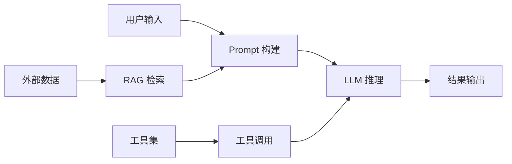
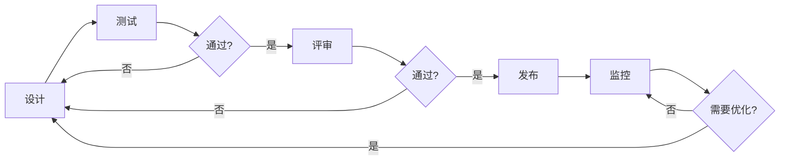
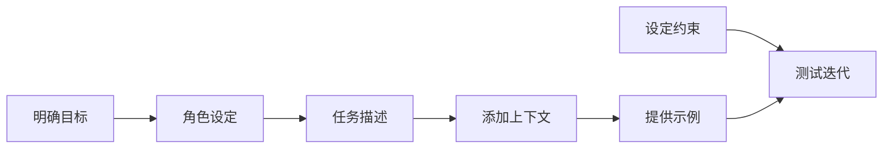

# 📘《LLM 与 Prompt 工程学习与实战手册》

> 系统学习见下文各章；日常常用 Prompt 模式与 API 速查见同目录《常用API与使用场景》。

------

# 第1章：大模型与 Prompt 工程概述

------

> **本章在整体中解决什么问题**：建立对大语言模型（LLM）和 Prompt 工程的基础认知，了解 LLM 的工作原理、分类和应用场景，以及 Prompt 工程的核心价值。学完本章后，**第二章**将深入 Prompt 设计的具体原则和结构；**第三章**将介绍常见的 Prompt 模式与技巧。

------

## 1.1 大语言模型（LLM）简介

### 🧩 核心定义

**大语言模型（LLM）** 是基于 Transformer 架构的预训练语言模型，通过学习海量文本数据，具备理解和生成人类语言的能力，可完成续写、问答、摘要、翻译、代码生成等多种任务。

**为什么 LLM 如此重要**：
- 打破了传统 NLP 任务的壁垒，实现了通用语言理解和生成能力
- 具备强大的上下文理解能力，能够处理复杂的多轮对话
- 可通过微调适应特定领域，实现个性化应用
- 为 RAG、Agent 等高级应用提供了基础能力支持

### 📜 LLM 分类

| 分类维度 | 类型 | 代表模型 | 特点 |
| -------- | ---- | -------- | ---- |
| **功能定位** | 通用基座模型 | GPT-3.5、LLaMA、BLOOM | 基础能力强，适用范围广 |
|  | 对话/指令微调模型 | GPT-4、Claude、通义千问 | 针对对话和指令优化，交互性强 |
|  | 领域专业模型 | CodeLlama、Med-PaLM | 在特定领域表现出色 |
| **开源状态** | 闭源模型 | GPT-4、Claude | API 访问，功能强大但成本高 |
|  | 开源模型 | LLaMA 系列、Mistral | 可本地部署，定制性强 |
| **部署方式** | API 服务 | OpenAI API、阿里云通义 API | 即开即用，无需维护 |
|  | 本地部署 | LLaMA 系列、ChatGLM | 隐私性好，成本低 |

### 🔍 技术原理

**Transformer 架构**：
- 自注意力机制：能够捕捉文本中的长距离依赖关系
- 多头注意力：从不同角度理解文本信息
- 位置编码：为模型提供位置信息，理解文本顺序
- 前馈神经网络：对注意力输出进行非线性变换

**预训练与微调**：
1. **预训练**：在海量文本数据上学习语言模式和知识
2. **监督微调（SFT）**：使用高质量对话数据调整模型行为
3. **人类反馈强化学习（RLHF）**：通过人类偏好优化模型输出

### 🧠 面试扩展

**面试官：**
什么是大语言模型？它与传统 NLP 模型有什么区别？

**标准回答：**
> 大语言模型是基于 Transformer 架构的预训练语言模型，通过学习海量文本数据，具备理解和生成人类语言的能力。与传统 NLP 模型相比，LLM 打破了任务壁垒，实现了通用语言理解和生成能力，具备更强的上下文理解能力，可通过微调适应特定领域，为 RAG、Agent 等高级应用提供基础支持。

------

## 1.2 什么是 Prompt 工程

### 🧩 核心定义

**Prompt** 是用户提供给大语言模型的输入提示，包含任务描述、上下文信息、示例等内容。**Prompt 工程** 是指通过设计和优化 Prompt，使模型能够更准确、稳定地输出符合预期的结果。

**为什么需要 Prompt 工程**：
- 同一模型，不同 Prompt 效果差异显著
- 好的 Prompt 可以减少模型幻觉，提高输出质量
- 结构化的 Prompt 可以约束输出格式，提升可解析性
- 合理的 Prompt 设计可以降低模型调用成本，提高效率

### 📊 Prompt 工程的价值

| 价值 | 具体表现 | 示例 |
| ---- | -------- | ---- |
| **提高准确性** | 明确任务要求，减少误解 | 要求模型按照特定格式回答问题 |
| **减少幻觉** | 提供上下文信息，限制模型臆测 | 要求模型基于提供的文档回答问题 |
| **结构化输出** | 约束输出格式，便于程序解析 | 要求模型以 JSON 格式输出结果 |
| **降低成本** | 优化 Prompt 长度，减少 Token 消耗 | 使用简洁明了的指令，避免冗余信息 |
| **提升一致性** | 统一模型行为，确保输出稳定 | 提供标准化的角色设定和任务描述 |

### 🔍 Prompt 工程的发展

1. **早期阶段**：简单的指令式 Prompt，依赖模型的零样本能力
2. **发展阶段**：引入少样本学习（Few-shot），提供示例引导模型
3. **成熟阶段**：结合思维链（Chain-of-Thought），提升复杂推理能力
4. **高级阶段**：模板化、自动化 Prompt 优化，结合工具使用

------

## 1.3 典型应用场景

### 📜 核心应用场景

| 场景 | 描述 | 示例 Prompt |
| ---- | ---- | ----------- |
| **问答与知识检索** | 基于模型知识或外部文档回答问题 | "请基于以下文档回答问题：..."
| **文本摘要与改写** | 对长文本进行总结或改写 | "请将以下文章总结为 300 字以内：..."
| **分类与抽取** | 对文本进行分类或提取关键信息 | "请从以下文本中提取人物、地点、时间：..."
| **代码生成与解释** | 生成代码或解释代码功能 | "请为我编写一个 Python 函数，实现快速排序：..."
| **多轮对话** | 进行连续的自然语言交互 | "你是一个客服助手，请问有什么可以帮助您的？"
| **RAG 增强** | 结合检索到的文档回答问题 | "请基于检索到的文档回答以下问题，并引用来源：..."
| **Agent 工具调用** | 指导模型调用外部工具 | "如果需要获取实时信息，请调用相应工具：..."

### 🔧 行业应用

1. **金融领域**：智能客服、风险评估、市场分析
2. **教育领域**：个性化学习、作业批改、知识问答
3. **医疗领域**：医疗咨询、病历分析、医学文献总结
4. **法律领域**：合同分析、法律咨询、案例检索
5. **内容创作**：文案生成、剧本创作、广告设计

### 📊 应用架构示例



------

# ✅ 本章小结

| 知识点 | 面试关键词 | 实际应用 |
| ------ | ---------- | -------- |
| LLM 定义与原理 | Transformer、预训练、微调、自注意力 | 通用语言理解和生成 |
| LLM 分类 | 通用基座、对话微调、开源/闭源、API/本地部署 | 选择适合场景的模型 |
| Prompt 工程 | 输入提示、优化设计、减少幻觉、结构化输出 | 提升模型输出质量 |
| 应用场景 | 问答、摘要、代码生成、RAG、Agent | 解决实际业务问题 |

------

## ⚠️ 常见坑与注意点

1. **现象**：对 LLM 能力期望过高。**原因**：不了解模型的局限性，如知识截止、逻辑推理能力有限。**正确做法**：了解模型的能力边界，合理设置预期，必要时结合外部工具。

2. **现象**：Prompt 设计过于复杂。**原因**：试图在一个 Prompt 中包含所有信息，导致模型混淆。**正确做法**：保持 Prompt 简洁明了，重点突出，必要时拆分为多个步骤。

3. **现象**：忽略模型的上下文窗口限制。**原因**：输入文本过长，超出模型的上下文窗口。**正确做法**：合理控制输入长度，使用摘要或检索技术处理长文本。

4. **现象**：未考虑模型的安全性。**原因**：Prompt 设计不当，可能导致模型生成有害内容。**正确做法**：添加安全约束，设置内容审核机制。

5. **现象**：Prompt 优化缺乏系统性。**原因**：没有科学的评估方法，仅凭主观感受优化。**正确做法**：建立评估指标，通过 A/B 测试系统优化 Prompt。

------

**学习要点**：
- 理解大语言模型的核心概念和技术原理
- 掌握 LLM 的分类方法和适用场景
- 理解 Prompt 工程的定义和价值
- 了解 Prompt 工程的发展历程和应用场景
- 注意 LLM 和 Prompt 工程中的常见问题和解决方案

------

## 🎯 面试常见追问

| 面试官提问 | 回答思路 |
| ---------- | -------- |
| 什么是大语言模型？它与传统 NLP 模型有什么区别？ | 定义 + 技术原理 + 与传统模型的对比 |
| LLM 有哪些分类？各有什么特点？ | 功能定位、开源状态、部署方式三个维度 |
| 什么是 Prompt 工程？为什么它很重要？ | 定义 + 价值 + 具体表现 |
| Prompt 工程的应用场景有哪些？ | 核心应用场景 + 行业应用 |
| 如何评估 Prompt 的效果？ | 评估指标 + A/B 测试 + 迭代优化 |

------

# 第2章：Prompt 设计原则与结构

------

> **本章在整体中解决什么问题**：第一章介绍了 LLM 和 Prompt 工程的基础概念；本章深入**Prompt 设计的具体原则和结构**，为后续章节的 Prompt 模式和技巧奠定基础。掌握 Prompt 设计的核心原则后，**第三章**将学习常见的 Prompt 模式与技巧。

------

## 2.1 Prompt 设计的核心原则

### 🧩 基本原则

1. **明确性**：任务描述清晰明确，避免模糊不清的表述
2. **简洁性**：保持 Prompt 简洁，避免冗余信息
3. **一致性**：统一指令风格和格式要求
4. **可重复性**：确保相同输入能产生一致的输出
5. **安全性**：避免生成有害或违规内容

### 📊 设计原则详解

| 原则 | 具体要求 | 示例 |
| ---- | -------- | ---- |
| **明确性** | 具体说明任务目标、输出格式、评估标准 | "请将以下文本总结为 200 字以内的段落，重点突出核心观点"
| **简洁性** | 使用简洁的语言，避免不必要的修饰 | "总结以下文本：..." 优于 "我希望你能帮我总结一下下面的这段文本，如果你能做到的话"
| **一致性** | 保持指令结构和语言风格一致 | 始终使用相同的格式要求和术语
| **可重复性** | 提供足够的上下文和约束 | "基于以下规则对文本进行分类：..."
| **安全性** | 添加安全约束和道德指导 | "不要生成有害内容，对于不确定的信息要明确说明"

### 💡 设计技巧

- **使用数字编号**：清晰列出要求，便于模型理解
- **使用分隔符**：用 ```、--- 等标记区分不同部分
- **使用加粗和强调**：突出重要信息
- **提供负面示例**：说明不希望的输出形式

------

## 2.2 Prompt 的基本结构

### 🧩 核心组成部分

1. **角色设定（Role）**：明确模型的身份和职责
2. **任务描述（Task）**：详细说明要完成的任务
3. **上下文信息（Context）**：提供相关背景信息
4. **约束条件（Constraints）**：设定输出的限制和要求
5. **示例（Examples）**：提供输入输出示例
6. **输出格式（Output Format）**：指定输出的结构和格式

### 🔍 结构详解

**1. 角色设定（Role）**
- **目的**：让模型代入特定身份，影响其输出风格和内容
- **示例**："你是一位专业的软件工程师"、"你是一位经验丰富的面试官"

**2. 任务描述（Task）**
- **目的**：明确模型需要完成的具体任务
- **示例**："请分析以下代码的功能和潜在问题"、"请为以下产品撰写营销文案"

**3. 上下文信息（Context）**
- **目的**：提供模型需要的背景信息，帮助其做出准确判断
- **示例**："以下是用户的购买历史：..."、"以下是公司的产品信息：..."

**4. 约束条件（Constraints）**
- **目的**：限制模型的输出范围，避免无关内容
- **示例**："不要超过 300 字"、"不要包含个人观点"、"只关注技术问题"

**5. 示例（Examples）**
- **目的**：通过示例引导模型的输出风格和格式
- **示例**："输入：... 输出：..."

**6. 输出格式（Output Format）**
- **目的**：指定输出的结构，便于后续处理
- **示例**："请以 JSON 格式输出"、"请以列表形式输出"

### 📊 完整 Prompt 结构示例

```
# 角色设定
你是一位专业的数据分析专家，擅长数据可视化和业务分析。

# 任务描述
请分析以下销售数据，总结关键趋势和洞察，并提出改进建议。

# 上下文信息
以下是某电商平台 2024 年第一季度的销售数据：
- 1 月：销售额 100 万元，订单量 5000 单
- 2 月：销售额 120 万元，订单量 6500 单
- 3 月：销售额 150 万元，订单量 8000 单

# 约束条件
- 分析要客观中立，基于数据说话
- 总结不超过 500 字
- 重点关注增长趋势和季节性因素

# 示例
输入：
- 1 月：销售额 80 万元，订单量 4000 单
- 2 月：销售额 90 万元，订单量 4500 单
- 3 月：销售额 100 万元，订单量 5000 单

输出：
## 销售趋势分析
1. 销售额持续增长，从 1 月的 80 万元增长到 3 月的 100 万元，增长率 25%
2. 订单量同步增长，从 1 月的 4000 单增长到 3 月的 5000 单，增长率 25%
3. 平均客单价保持稳定，约为 200 元/单

## 洞察
1. 季度销售呈稳步上升趋势，无明显季节性波动
2. 订单量与销售额同步增长，说明增长来自于更多的客户购买，而非客单价提升

## 建议
1. 考虑在 4 月推出促销活动，进一步刺激销售增长
2. 分析客户购买行为，优化产品推荐算法

# 输出格式
请按照示例格式输出，包含「销售趋势分析」、「洞察」和「建议」三个部分。
```

------

## 2.3 思维链（Chain-of-Thought）Prompt

### 🧩 核心概念

**思维链（Chain-of-Thought，CoT）** 是一种 Prompt 技术，通过要求模型逐步推理，展示其思考过程，从而提高复杂问题的解决能力。

**为什么需要思维链**：
- 复杂问题需要多步推理，直接回答容易出错
- 展示思考过程有助于发现和纠正错误
- 提高模型输出的可解释性

### 🔍 实现方法

**1. 显式要求逐步思考**
- 示例："请一步步思考，然后给出答案"
- 示例："Let's think step by step"

**2. 提供推理示例**
- 示例："输入：15 + 23 × 2 = ?
  思考：首先计算 23 × 2 = 46，然后计算 15 + 46 = 61
  输出：61"

**3. 引导式提问**
- 示例："要解决这个问题，我们需要先考虑什么？然后呢？最后呢？"

### 📊 思维链示例

**问题**：
一家商店以 80 元的价格出售一件商品，利润率为 25%，请问这件商品的成本是多少？

**思维链 Prompt**：
> 请一步步思考，然后给出答案。
> 
> 利润率的计算公式是：利润率 = (售价 - 成本) / 成本 × 100%
> 
> 已知售价为 80 元，利润率为 25%，设成本为 x 元。
> 
> 根据公式：25% = (80 - x) / x × 100%
> 
> 化简得：0.25 = (80 - x) / x
> 
> 0.25x = 80 - x
> 
> 0.25x + x = 80
> 
> 1.25x = 80
> 
> x = 80 / 1.25
> 
> x = 64
> 
> 所以这件商品的成本是 64 元。

------

## 2.4 结构化输出 Prompt

### 🧩 核心概念

**结构化输出** 是指要求模型按照特定的格式输出结果，如 JSON、XML、Markdown 表格等，便于程序后续处理。

**为什么需要结构化输出**：
- 便于程序解析和处理
- 提高输出的一致性和可靠性
- 减少后续处理的工作量

### 🔍 实现方法

**1. 明确指定格式**
- 示例："请以 JSON 格式输出"
- 示例："请以 Markdown 表格格式输出"

**2. 提供格式模板**
- 示例："请按照以下 JSON 格式输出：{"name": "", "age": "", "occupation": ""}"

**3. 提供示例**
- 示例："输入：张三，25 岁，工程师
  输出：{"name": "张三", "age": 25, "occupation": "工程师"}"

### 📊 结构化输出示例

**JSON 格式示例**：
```
请将以下用户信息转换为 JSON 格式：

用户：李四
年龄：30 岁
职业：教师
爱好：阅读、旅游

输出格式：
{
  "name": "",
  "age": ,
  "occupation": "",
  "hobbies": []
}
```

**Markdown 表格格式示例**：
```
请将以下课程信息整理为 Markdown 表格：

课程 1：数学，学分 4，教师 王老师
课程 2：英语，学分 3，教师 李老师
课程 3：物理，学分 4，教师 张老师

输出格式：
| 课程名称 | 学分 | 教师 |
| -------- | ---- | ---- |
| 数学     | 4    | 王老师 |
| ...      | ...  | ...  |
```

------

# ✅ 本章小结

| 知识点 | 面试关键词 | 实际应用 |
| ------ | ---------- | -------- |
| 设计原则 | 明确性、简洁性、一致性、可重复性、安全性 | 指导 Prompt 设计 |
| Prompt 结构 | 角色设定、任务描述、上下文信息、约束条件、示例、输出格式 | 构建完整的 Prompt |
| 思维链 | 逐步推理、思考过程、复杂问题解决 | 提高推理能力 |
| 结构化输出 | JSON、XML、Markdown 表格、格式模板 | 便于程序处理 |

------

## ⚠️ 常见坑与注意点

1. **现象**：Prompt 过于简洁，信息不足。**原因**：没有提供足够的上下文和约束条件，导致模型输出不符合预期。**正确做法**：提供详细的任务描述、上下文信息和约束条件。

2. **现象**：Prompt 过于复杂，信息过载。**原因**：包含过多无关信息，导致模型混淆。**正确做法**：保持 Prompt 简洁明了，重点突出，必要时拆分为多个步骤。

3. **现象**：没有提供示例，模型输出格式不一致。**原因**：模型对输出格式的理解存在偏差。**正确做法**：提供 1-3 个输入输出示例，引导模型的输出格式。

4. **现象**：没有指定输出格式，后续处理困难。**原因**：模型输出格式多样，难以统一处理。**正确做法**：明确指定输出格式，如 JSON、表格等。

5. **现象**：思维链使用不当，增加 Token 消耗。**原因**：在简单问题上使用思维链，增加了不必要的 Token 消耗。**正确做法**：只在复杂推理问题上使用思维链，简单问题直接要求答案。

------

**学习要点**：
- 掌握 Prompt 设计的核心原则
- 理解 Prompt 的基本结构和组成部分
- 学会使用思维链提高复杂问题的解决能力
- 掌握结构化输出的设计方法
- 注意 Prompt 设计中的常见问题和解决方案

------

## 🎯 面试常见追问

| 面试官提问 | 回答思路 |
| ---------- | -------- |
| Prompt 设计的核心原则有哪些？ | 明确性、简洁性、一致性、可重复性、安全性 |
| Prompt 的基本结构包括哪些部分？ | 角色设定、任务描述、上下文信息、约束条件、示例、输出格式 |
| 什么是思维链（Chain-of-Thought）？它有什么作用？ | 逐步推理过程、提高复杂问题解决能力、增强可解释性 |
| 如何设计结构化输出的 Prompt？ | 明确指定格式、提供格式模板、提供示例 |
| Prompt 设计中常见的问题有哪些？ | 信息不足、信息过载、格式不一致、输出格式不明确、思维链使用不当 |

------

# 第3章：常见 Prompt 模式与技巧

------

> **本章在整体中解决什么问题**：前两章介绍了 LLM 和 Prompt 工程的基础概念以及 Prompt 设计原则；本章深入**常见的 Prompt 模式与技巧**，帮助读者掌握更高级的 Prompt 设计方法。学完本章后，**第四章**将介绍如何与 API 配合使用，实现实际的 LLM 应用。

------

## 3.1 Zero-shot 与 Few-shot 学习

### 🧩 核心概念

**Zero-shot 学习** 是指模型在没有见过任何示例的情况下，直接根据指令完成任务的能力。

**Few-shot 学习** 是指在 Prompt 中提供少量示例（通常为 1-5 个），引导模型理解任务要求并产生符合预期的输出。

**为什么需要 Few-shot**：
- 复杂任务难以用简单的指令描述清楚
- 示例可以直观地展示期望的输出格式和风格
- 提高模型的准确性和一致性

### 📊 对比分析

| 模式 | 特点 | 适用场景 | 示例数量 | 优缺点 |
| ---- | ---- | -------- | -------- | ------ |
| **Zero-shot** | 直接指令，无示例 | 简单任务、通用能力 | 0 个 | 简洁但可能不够精确 |
| **One-shot** | 提供 1 个示例 | 格式明确的任务 | 1 个 | 平衡简洁性和指导性 |
| **Few-shot** | 提供 2-5 个示例 | 复杂任务、格式要求严格 | 2-5 个 | 精确但消耗更多 Token |

### 🔍 示例对比

**Zero-shot 示例**：
```
请将以下文本分类为正面、负面或中性：

文本：这家餐厅的服务非常好，食物也很美味。
```

**Few-shot 示例**：
```
请将以下文本分类为正面、负面或中性：

示例 1：
文本：这部电影太棒了，强烈推荐！
分类：正面

示例 2：
文本：服务态度很差，等了一个小时还没上菜。
分类：负面

示例 3：
文本：今天天气晴朗，适合外出。
分类：中性

待分类文本：这家餐厅的服务非常好，食物也很美味。
分类：
```

### 💡 Few-shot 设计技巧

1. **示例质量**：选择具有代表性、格式规范的示例
2. **示例多样性**：涵盖不同类型的输入，展示模型的适应能力
3. **示例顺序**：将最典型或最简单的示例放在前面
4. **示例数量**：一般 2-3 个即可，过多会增加 Token 消耗

------

## 3.2 角色 + 规则 + 输出格式模式

### 🧩 核心概念

这是一种将角色设定、规则约束和输出格式要求结合使用的 Prompt 模式，能够显著提升模型输出的质量和一致性。

**为什么有效**：
- 角色设定影响模型的语气和专业程度
- 规则约束明确任务边界和要求
- 输出格式要求确保结果的结构化和可用性

### 📊 模式结构

```
# 角色设定
你是一位[专业角色]，具备[相关能力]。

# 任务规则
1. [规则 1]
2. [规则 2]
3. [规则 3]

# 输出格式
请以[格式]输出，包含以下字段：
- [字段 1]
- [字段 2]
- [字段 3]
```

### 🔍 完整示例

**场景**：代码审查

```
# 角色设定
你是一位经验丰富的软件工程师，擅长代码审查和性能优化。

# 任务规则
1. 分析代码的功能、逻辑和潜在问题
2. 检查代码风格是否符合 Python PEP8 规范
3. 评估代码的性能和可维护性
4. 提供具体的改进建议

# 输出格式
请以 JSON 格式输出，包含以下字段：
- "functionality": 代码功能描述
- "issues": 发现的问题列表
- "style_violations": 代码风格违规项
- "performance_concerns": 性能关注点
- "recommendations": 改进建议列表

# 待审查代码
```python
def calculate_sum(numbers):
    result = 0
    for i in range(len(numbers)):
        result = result + numbers[i]
    return result
```

------

## 3.3 分步与拆任务技巧

### 🧩 核心概念

**分步与拆任务** 是将复杂任务分解为多个简单步骤或子任务的技术，通过逐步引导模型完成复杂任务。

**为什么需要分步**：
- 复杂任务一次性完成容易出错
- 分步执行便于检查和调试
- 每一步的输出可以作为下一步的输入

### 📊 分步策略

| 策略 | 描述 | 适用场景 |
| ---- | ---- | -------- |
| **顺序执行** | 按顺序完成多个步骤 | 有明确先后顺序的任务 |
| **并行分解** | 将任务拆分为多个独立的子任务 | 可以独立处理的子任务 |
| **迭代优化** | 多次迭代改进结果 | 需要逐步优化的任务 |
| **条件分支** | 根据中间结果选择不同路径 | 需要根据情况调整的任务 |

### 🔍 分步示例

**场景**：撰写技术文档

**步骤 1：确定文档结构**

请为以下主题设计技术文档的结构：
主题：Python 异步编程指南

要求：
1. 包含引言、核心概念、实践示例、最佳实践、总结等部分
2. 每个部分列出 2-3 个小节
3. 以大纲形式输出

**步骤 2：撰写各部分内容**

请根据以下大纲撰写「核心概念」部分的内容：

大纲：
2. 核心概念
   2.1 异步编程基础
   2.2 async/await 语法
   2.3 事件循环

要求：
1. 每个小节 200-300 字
2. 包含代码示例
3. 语言通俗易懂

**步骤 3：整合与优化**

请将以下内容整合为完整的技术文档，并进行优化：

[步骤 1 和步骤 2 的输出]

要求：
1. 确保各部分之间逻辑连贯
2. 统一术语和风格
3. 检查并修正错误

------

## 3.4 负面约束与边界设定

### 🧩 核心概念

**负面约束** 是指明确告诉模型不要做什么，通过设定边界来限制模型的输出范围，避免产生不符合要求的内容。

**为什么需要负面约束**：
- 防止模型产生幻觉或不实信息
- 避免输出无关或冗余内容
- 确保输出符合安全性和合规性要求

### 📊 常见负面约束类型

| 类型 | 示例 | 目的 |
| ---- | ---- | ---- |
| **内容限制** | "不要包含个人观点" | 保持客观中立 |
| **格式限制** | "不要使用 Markdown 格式" | 控制输出格式 |
| **长度限制** | "不要超过 500 字" | 控制输出长度 |
| **安全限制** | "不要生成有害内容" | 确保安全性 |
| **知识限制** | "如果不确定，请明确说明" | 防止幻觉 |

### 🔍 负面约束示例

**场景**：新闻摘要

请为以下新闻撰写摘要：

[新闻内容]

约束条件：
1. 不要包含个人观点和评论
2. 不要添加新闻中没有的信息
3. 不要使用夸张或情绪化的语言
4. 如果新闻涉及敏感内容，请客观描述，不要渲染
5. 摘要长度控制在 100-150 字之间

------

## 3.5 Prompt 优化技巧

### 🧩 迭代优化方法

**1. 从简单开始**
- 先设计一个基础的 Prompt
- 测试并观察模型的输出
- 根据问题逐步添加约束和示例

**2. A/B 测试**
- 设计多个版本的 Prompt
- 使用相同的测试用例进行评估
- 选择效果最好的版本

**3. Badcase 驱动**
- 收集模型输出不符合预期的案例
- 分析原因并调整 Prompt
- 验证改进效果

### 📊 优化检查清单

| 检查项 | 说明 | 优化建议 |
| ------ | ---- | -------- |
| **任务明确性** | 任务描述是否清晰 | 添加具体的任务说明和期望输出 |
| **上下文充分性** | 是否提供了足够的背景信息 | 补充相关上下文和约束条件 |
| **示例质量** | 示例是否具有代表性 | 选择典型示例，覆盖不同情况 |
| **格式规范性** | 输出格式是否明确 | 提供格式模板和示例 |
| **约束完整性** | 是否设定了必要的约束 | 添加负面约束和边界条件 |

### 🔧 优化示例

**初始版本**：

请总结以下文章。

[文章内容]
**问题**：输出过于简单，缺乏重点

**优化版本**：

请为以下文章撰写摘要，要求：
1. 摘要长度 200-300 字
2. 包含文章的核心观点和主要论据
3. 使用客观中立的语气
4. 不要包含细节描述，只保留关键信息

[文章内容]

------

# ✅ 本章小结

| 知识点 | 面试关键词 | 实际应用 |
| ------ | ---------- | -------- |
| Zero-shot/Few-shot | 零样本学习、少样本学习、示例引导 | 根据任务复杂度选择合适模式 |
| 角色+规则+格式 | 角色设定、规则约束、结构化输出 | 提升输出质量和一致性 |
| 分步与拆任务 | 任务分解、顺序执行、迭代优化 | 处理复杂任务 |
| 负面约束 | 边界设定、内容限制、安全约束 | 防止幻觉和不当输出 |
| Prompt 优化 | 迭代优化、A/B 测试、Badcase 驱动 | 持续改进 Prompt 效果 |

------

## ⚠️ 常见坑与注意点

1. **现象**：Few-shot 示例过多，Token 消耗过大。**原因**：提供了过多的示例，增加了 Prompt 长度。**正确做法**：一般 2-3 个示例即可，选择最具代表性的示例。

2. **现象**：角色设定过于复杂，模型难以代入。**原因**：角色描述过于详细或矛盾。**正确做法**：角色设定简洁明了，突出核心特征。

3. **现象**：分步执行时，步骤之间逻辑不连贯。**原因**：步骤设计不合理，中间结果传递不畅。**正确做法**：确保每一步的输出可以作为下一步的输入，逻辑连贯。

4. **现象**：负面约束过多，限制了模型的创造力。**原因**：约束条件过于严格。**正确做法**：平衡约束和自由度，只添加必要的约束。

5. **现象**：Prompt 优化缺乏系统性，效果不稳定。**原因**：没有建立评估体系，优化方向不明确。**正确做法**：建立评估指标，通过 A/B 测试系统优化。

------

**学习要点**：
- 掌握 Zero-shot 和 Few-shot 学习的适用场景和设计方法
- 理解角色+规则+格式模式的应用
- 学会使用分步与拆任务技巧处理复杂任务
- 掌握负面约束的设计方法
- 了解 Prompt 优化的系统方法

------

## 🎯 面试常见追问

| 面试官提问 | 回答思路 |
| ---------- | -------- |
| Zero-shot 和 Few-shot 有什么区别？ | 定义 + 适用场景 + 示例数量 |
| 如何设计有效的 Few-shot 示例？ | 示例质量、多样性、顺序、数量 |
| 什么是角色+规则+格式模式？ | 三个组成部分 + 作用 + 示例 |
| 如何处理复杂任务的 Prompt 设计？ | 分步与拆任务 + 迭代优化 |
| 如何防止模型产生幻觉？ | 负面约束 + 知识限制 + RAG 补充 |

------

# 第4章：与 API 的配合使用

------

> **本章在整体中解决什么问题**：前三章介绍了 Prompt 的设计原则和模式技巧；本章深入**如何与 LLM API 配合使用**，包括 API 调用方式、参数设置、流式输出等实际开发技能。学完本章后，读者将能够实际开发基于 LLM 的应用。

------

## 4.1 OpenAI 兼容 API 概述

### 🧩 核心概念

**OpenAI 兼容 API** 是指遵循 OpenAI API 规范的接口，包括请求格式、参数定义、响应结构等。目前大多数国产大模型都提供了 OpenAI 兼容的 API 接口。

**为什么需要了解 API**：
- 实际开发中需要通过 API 调用模型
- 理解 API 参数可以更好地控制模型行为
- 掌握 API 使用是开发 LLM 应用的基础技能

### 📊 API 核心参数

| 参数 | 类型 | 说明 | 常用值 |
| ---- | ---- | ---- | ------ |
| **model** | string | 模型名称 | gpt-4, gpt-3.5-turbo, qwen-turbo |
| **messages** | array | 对话消息列表 | [{"role": "user", "content": "..."}] |
| **temperature** | float | 创造性 vs 稳定性 | 0.0-2.0，默认 1.0 |
| **top_p** | float | 核采样概率 | 0.0-1.0，默认 1.0 |
| **max_tokens** | integer | 最大输出 Token 数 | 根据需求设置 |
| **stream** | boolean | 是否流式输出 | true/false |

### 🔍 基础调用示例

```python
import openai

# 配置 API 密钥
openai.api_key = "your-api-key"
openai.api_base = "https://api.openai.com/v1"  # 或其他兼容端点

# 基础调用
response = openai.ChatCompletion.create(
    model="gpt-4",
    messages=[
        {"role": "system", "content": "你是一个 helpful assistant。"},
        {"role": "user", "content": "你好，请介绍一下自己。"}
    ],
    temperature=0.7,
    max_tokens=500
)

print(response.choices[0].message.content)
```

------

## 4.2 Messages 结构与多轮对话

### 🧩 核心概念

**Messages** 是 OpenAI API 中用于传递对话上下文的数据结构，包含角色（role）和内容（content）两个字段。

**角色类型**：
- **system**：系统消息，设定模型的全局行为
- **user**：用户消息，用户的输入
- **assistant**：助手消息，模型的回复
- **tool**：工具消息，工具调用的结果（部分模型支持）

### 📊 Messages 结构示例

```python
messages = [
    # 系统消息：设定全局行为
    {"role": "system", "content": "你是一个专业的代码审查助手。"},
    
    # 用户消息：第一轮对话
    {"role": "user", "content": "请帮我检查这段代码。"},
    
    # 助手消息：第一轮回复
    {"role": "assistant", "content": "好的，请提供代码。"},
    
    # 用户消息：第二轮对话
    {"role": "user", "content": "```python\ndef hello():\n    print('Hello')\n```"},
    
    # 助手消息：第二轮回复
    {"role": "assistant", "content": "代码检查完成，发现以下问题：..."}
]
```

### 🔧 多轮对话实现

```python
class ChatSession:
    def __init__(self, api_key, model="gpt-4"):
        openai.api_key = api_key
        self.model = model
        self.messages = []
    
    def set_system_prompt(self, prompt):
        """设置系统提示"""
        # 如果已存在 system 消息，则替换
        if self.messages and self.messages[0]["role"] == "system":
            self.messages[0]["content"] = prompt
        else:
            self.messages.insert(0, {"role": "system", "content": prompt})
    
    def send_message(self, user_message, **kwargs):
        """发送消息并获取回复"""
        # 添加用户消息
        self.messages.append({"role": "user", "content": user_message})
        
        # 调用 API
        response = openai.ChatCompletion.create(
            model=self.model,
            messages=self.messages,
            **kwargs
        )
        
        # 获取助手回复
        assistant_message = response.choices[0].message.content
        
        # 添加助手消息到历史
        self.messages.append({"role": "assistant", "content": assistant_message})
        
        return assistant_message
    
    def get_history(self):
        """获取对话历史"""
        return self.messages.copy()
    
    def clear_history(self):
        """清空对话历史（保留 system 消息）"""
        system_message = None
        if self.messages and self.messages[0]["role"] == "system":
            system_message = self.messages[0]
        
        self.messages = []
        if system_message:
            self.messages.append(system_message)
```

------

## 4.3 API 参数详解

### 🧩 Temperature 与 Top_p

**Temperature**：控制模型输出的随机性
- **值范围**：0.0 - 2.0
- **低值（0.0-0.3）**：输出更确定、保守，适合事实性任务
- **中值（0.4-0.7）**：平衡创造性和确定性
- **高值（0.8-2.0）**：输出更随机、有创意，适合创意性任务

**Top_p（核采样）**：控制模型考虑的词汇范围
- **值范围**：0.0 - 1.0
- **低值**：只考虑概率最高的词汇，输出更确定
- **高值**：考虑更多词汇，输出更多样

**使用建议**：
- 通常只调整 temperature 或 top_p 中的一个，不要同时调整
- 事实性任务（如问答、摘要）：temperature=0.3
- 创意性任务（如写作、头脑风暴）：temperature=0.7-1.0

### 📊 参数选择指南

| 任务类型 | Temperature | Max Tokens | 其他建议 |
| -------- | ----------- | ---------- | -------- |
| **问答** | 0.3 | 500 | 提供清晰的上下文 |
| **摘要** | 0.3 | 300 | 指定摘要长度 |
| **翻译** | 0.3 | 1000 | 提供术语表 |
| **代码生成** | 0.2 | 2000 | 提供代码规范 |
| **创意写作** | 0.8 | 2000 | 提供风格示例 |
| **头脑风暴** | 1.0 | 1000 | 鼓励多样性 |

### 🔍 参数调优示例

```python
# 事实性任务：低 temperature
response = openai.ChatCompletion.create(
    model="gpt-4",
    messages=[{"role": "user", "content": "中国的首都是哪里？"}],
    temperature=0.1,  # 低随机性，确保准确性
    max_tokens=100
)

# 创意性任务：高 temperature
response = openai.ChatCompletion.create(
    model="gpt-4",
    messages=[{"role": "user", "content": "请写一首关于春天的诗。"}],
    temperature=0.8,  # 高随机性，增加创意
    max_tokens=500
)
```

------

## 4.4 流式输出（Streaming）

### 🧩 核心概念

**流式输出** 是指模型边生成边返回结果，而不是等待完整生成后再返回。这种方式可以提升用户体验，让用户更快地看到部分结果。

**为什么使用流式输出**：
- 减少用户等待时间
- 实现打字机效果，提升交互体验
- 适合长文本生成场景

### 🔧 流式输出实现

```python
import openai

def stream_chat_completion(messages, model="gpt-4"):
    """流式调用 API"""
    response = openai.ChatCompletion.create(
        model=model,
        messages=messages,
        stream=True  # 启用流式输出
    )
    
    full_response = ""
    for chunk in response:
        if chunk.choices[0].delta.get("content"):
            content = chunk.choices[0].delta.content
            full_response += content
            print(content, end="", flush=True)  # 实时输出
    
    return full_response

# 使用示例
messages = [
    {"role": "user", "content": "请写一篇关于人工智能的短文。"}
]

result = stream_chat_completion(messages)
```

### 📊 Web 应用中的流式输出

```python
from flask import Flask, Response, request
import openai
import json

app = Flask(__name__)

@app.route('/chat', methods=['POST'])
def chat():
    data = request.json
    messages = data.get('messages', [])
    
    def generate():
        response = openai.ChatCompletion.create(
            model="gpt-4",
            messages=messages,
            stream=True
        )
        
        for chunk in response:
            if chunk.choices[0].delta.get("content"):
                content = chunk.choices[0].delta.content
                yield f"data: {json.dumps({'content': content})}\n\n"
        
        yield f"data: {json.dumps({'done': True})}\n\n"
    
    return Response(generate(), mimetype='text/event-stream')
```

------

## 4.5 国产大模型 API 概览

### 🧩 主流国产模型

| 厂商 | 模型名称 | API 端点 | 特点 |
| ---- | -------- | -------- | ---- |
| **阿里云** | 通义千问 | dashscope.aliyuncs.com | 中文能力强，文档丰富 |
| **百度** | 文心一言 | aip.baidubce.com | 中文理解优秀 |
| **智谱 AI** | ChatGLM | open.bigmodel.cn | 开源友好，性价比高 |
| **月之暗面** | Kimi | api.moonshot.cn | 长上下文支持 |
| **DeepSeek** | DeepSeek | api.deepseek.com | 代码能力强 |

### 🔧 通义千问 API 示例

```python
import dashscope

dashscope.api_key = "your-api-key"

response = dashscope.Generation.call(
    model="qwen-turbo",
    messages=[
        {"role": "system", "content": "你是一个 helpful assistant。"},
        {"role": "user", "content": "你好，请介绍一下自己。"}
    ],
    temperature=0.7,
    max_tokens=500
)

print(response.output.choices[0].message.content)
```

### 🔧 智谱 AI API 示例

```python
from zhipuai import ZhipuAI

client = ZhipuAI(api_key="your-api-key")

response = client.chat.completions.create(
    model="glm-4",
    messages=[
        {"role": "system", "content": "你是一个 helpful assistant。"},
        {"role": "user", "content": "你好，请介绍一下自己。"}
    ],
    temperature=0.7,
    max_tokens=500
)

print(response.choices[0].message.content)
```

### 📊 国产模型选择建议

| 场景 | 推荐模型 | 理由 |
| ---- | -------- | ---- |
| **通用中文任务** | 通义千问、文心一言 | 中文理解和生成能力强 |
| **长文本处理** | Kimi | 支持超长上下文（200K+） |
| **代码相关** | DeepSeek | 代码理解和生成能力优秀 |
| **性价比优先** | ChatGLM | 价格相对较低 |
| **企业级应用** | 通义千问 | 文档完善，支持好 |

------

# ✅ 本章小结

| 知识点 | 面试关键词 | 实际应用 |
| ------ | ---------- | -------- |
| OpenAI 兼容 API | model、messages、temperature、max_tokens | 基础 API 调用 |
| Messages 结构 | system、user、assistant、多轮对话 | 管理对话上下文 |
| API 参数 | temperature、top_p、max_tokens、stream | 控制模型行为 |
| 流式输出 | stream=True、实时响应、打字机效果 | 提升用户体验 |
| 国产模型 API | 通义千问、文心一言、ChatGLM、Kimi | 国内应用开发 |

------

## ⚠️ 常见坑与注意点

1. **现象**：API 调用失败，返回错误。**原因**：API 密钥错误、网络问题、参数格式错误。**正确做法**：检查 API 密钥和网络连接，验证参数格式，查看错误信息。

2. **现象**：模型输出不符合预期。**原因**：temperature 设置不当、Prompt 设计问题。**正确做法**：根据任务类型调整 temperature，优化 Prompt 设计。

3. **现象**：多轮对话上下文丢失。**原因**：未正确维护 messages 列表。**正确做法**：确保每次调用都包含完整的对话历史。

4. **现象**：流式输出在 Web 应用中不工作。**原因**：未正确设置响应头或未使用 SSE 格式。**正确做法**：设置正确的 Content-Type，使用 SSE 格式发送数据。

5. **现象**：国产模型 API 与 OpenAI API 不兼容。**原因**：部分国产模型的 API 格式有差异。**正确做法**：查阅官方文档，使用对应的 SDK 或调整请求格式。

------

**学习要点**：
- 掌握 OpenAI 兼容 API 的基本调用方式
- 理解 Messages 结构和多轮对话的实现
- 学会调整 API 参数以控制模型行为
- 掌握流式输出的实现方法
- 了解主流国产模型 API 的特点和使用方法

------

## 🎯 面试常见追问

| 面试官提问 | 回答思路 |
| ---------- | -------- |
| 如何调用 LLM API？ | API 密钥配置 + 请求参数 + 响应处理 |
| Messages 结构中的 role 有哪些？ | system、user、assistant、tool |
| temperature 参数有什么作用？ | 控制随机性 + 不同任务的建议值 |
| 如何实现流式输出？ | stream=True + 逐块处理响应 |
| 国产大模型 API 有哪些？ | 通义千问、文心一言、ChatGLM、Kimi、DeepSeek |

------

# 第5章：幻觉、安全与评估

------

> **本章在整体中解决什么问题**：前四章介绍了 Prompt 的设计、API 的使用等基础技能；本章深入**幻觉问题、安全合规和效果评估**——这是 LLM 应用开发中必须面对的三个重要问题。掌握这些知识后，才能构建可靠、安全、高质量的 LLM 应用。

------

## 5.1 模型幻觉问题

### 🧩 核心概念

**幻觉（Hallucination）** 是指模型生成的内容看似合理，但实际上包含错误、虚构或不准确的信息。这是 LLM 的一个固有问题，严重影响应用的可靠性。

**幻觉的主要类型**：
- **事实性幻觉**：生成与事实不符的内容
- **逻辑性幻觉**：推理过程存在逻辑错误
- **引用性幻觉**：虚构不存在的引用或来源

### 📊 幻觉产生原因

| 原因 | 说明 | 示例 |
| ---- | ---- | ---- |
| **知识截止** | 模型的训练数据有时间限制，不了解最新信息 | 询问 2024 年的事件 |
| **训练数据偏差** | 训练数据中存在错误或偏见 | 历史事实的错误描述 |
| **过度泛化** | 模型将训练数据中的模式错误地应用到新场景 | 将特定案例推广为普遍规律 |
| **上下文理解不足** | 模型未能充分理解上下文，导致错误推理 | 误解问题的真正意图 |
| **生成压力** | 模型被要求必须给出答案，即使不确定 | 对未知问题强行回答 |

### 🔍 幻觉检测方法

**1. 事实核查**
- 对比权威来源（如维基百科、官方文档）
- 使用知识图谱验证实体关系
- 交叉验证多个信息源

**2. 逻辑一致性检查**
- 检查推理过程的逻辑性
- 验证前后文的一致性
- 识别矛盾或循环论证

**3. 引用验证**
- 验证引用的来源是否存在
- 检查引用内容的准确性
- 确认引用与论点的相关性

### 🛡️ 幻觉缓解策略

**1. Prompt 层面**
```
请在回答问题时遵循以下原则：
1. 只回答你确定知道的问题
2. 如果不确定，请明确说明"我不确定"或"我不知道"
3. 不要编造信息或引用不存在的来源
4. 对于事实性问题，请基于可靠的知识回答
```

**2. RAG 增强**
- 使用检索增强生成，基于检索到的文档回答问题
- 要求模型引用来源，便于验证
- 限制模型的知识范围，减少臆测

**3. 后处理验证**
- 使用专门的验证模型检查输出
- 人工审核关键信息
- 建立反馈机制，持续改进

### 📊 幻觉缓解效果对比

| 方法 | 实施难度 | 效果 | 适用场景 |
| ---- | -------- | ---- | -------- |
| Prompt 约束 | 低 | 中等 | 所有场景 |
| RAG 增强 | 中 | 高 | 知识密集型任务 |
| 事实核查 | 高 | 高 | 关键信息验证 |
| 人工审核 | 高 | 最高 | 高风险场景 |

------

## 5.2 安全与合规

### 🧩 核心概念

**LLM 安全** 涉及防止模型生成有害内容、保护用户隐私、确保合规使用等多个方面。随着 LLM 应用的普及，安全问题日益重要。

**主要安全威胁**：
- **有害内容生成**：暴力、仇恨、歧视等内容
- **隐私泄露**：泄露训练数据中的敏感信息
- **提示词注入**：恶意用户通过精心设计的输入绕过安全限制
- **滥用风险**：用于生成虚假信息、钓鱼邮件等

### 📊 安全防护体系

| 层级 | 措施 | 说明 |
| ---- | ---- | ---- |
| **输入层** | 输入过滤 | 检测并拦截恶意输入 |
| **模型层** | 安全微调 | 通过 RLHF 等方法增强安全性 |
| **输出层** | 内容审核 | 对模型输出进行安全检查 |
| **应用层** | 访问控制 | 限制使用权限和场景 |

### 🔧 输入安全防护

**1. 提示词注入检测**
```python
class PromptInjectionDetector:
    def __init__(self):
        self.suspicious_patterns = [
            r"ignore previous instructions",
            r"disregard.*prompt",
            r"you are now.*(hacker|attacker)",
            r"DAN.*(do anything now)",
        ]
    
    def detect(self, user_input: str) -> bool:
        """检测提示词注入攻击"""
        import re
        for pattern in self.suspicious_patterns:
            if re.search(pattern, user_input, re.IGNORECASE):
                return True
        return False
    
    def sanitize(self, user_input: str) -> str:
        """清理可疑输入"""
        if self.detect(user_input):
            # 记录日志并返回安全提示
            return "[输入包含可疑内容，已被拦截]"
        return user_input
```

**2. 敏感信息过滤**
```python
class SensitiveInfoFilter:
    def __init__(self):
        self.patterns = {
            "email": r"\b[A-Za-z0-9._%+-]+@[A-Za-z0-9.-]+\.[A-Z|a-z]{2,}\b",
            "phone": r"\b\d{3}[-.]?\d{3}[-.]?\d{4}\b",
            "id_card": r"\b\d{17}[\dXx]\b",
            "credit_card": r"\b\d{4}[-\s]?\d{4}[-\s]?\d{4}[-\s]?\d{4}\b"
        }
    
    def filter(self, text: str) -> str:
        """过滤敏感信息"""
        import re
        filtered = text
        for info_type, pattern in self.patterns.items():
            filtered = re.sub(pattern, f"[{info_type}_REDACTED]", filtered)
        return filtered
```

### 🔧 输出内容审核

**1. 关键词过滤**
```python
class ContentModerator:
    def __init__(self):
        self.forbidden_words = [
            "暴力", "仇恨", "歧视", "色情", "赌博",
            "毒品", "武器", "自杀", "自残"
        ]
    
    def moderate(self, content: str) -> tuple:
        """审核内容"""
        for word in self.forbidden_words:
            if word in content:
                return False, f"内容包含违禁词：{word}"
        return True, "内容通过审核"
```

**2. 基于模型的审核**
```python
class AIModerator:
    def __init__(self, api_key):
        self.api_key = api_key
    
    def moderate(self, content: str) -> dict:
        """使用 AI 模型审核内容"""
        moderation_prompt = f"""
        请审核以下内容是否包含违规信息：
        
        内容：{content}
        
        请从以下维度进行评估：
        1. 是否包含暴力内容
        2. 是否包含仇恨言论
        3. 是否包含歧视内容
        4. 是否包含色情内容
        5. 是否包含危险行为指导
        
        请以 JSON 格式输出：
        {{
            "is_safe": true/false,
            "violation_type": "违规类型或null",
            "confidence": 0-1,
            "reason": "判断理由"
        }}
        """
        
        # 调用审核模型
        response = openai.ChatCompletion.create(
            model="gpt-4",
            messages=[{"role": "user", "content": moderation_prompt}],
            temperature=0.1
        )
        
        import json
        result = json.loads(response.choices[0].message.content)
        return result
```

### 📊 合规使用指南

| 场景 | 合规要求 | 建议措施 |
| ---- | -------- | -------- |
| **用户数据** | 遵守数据保护法规（GDPR、个人信息保护法） | 数据加密、最小化收集、用户同意 |
| **内容生成** | 不生成违法、有害内容 | 内容审核、使用限制 |
| **知识产权** | 尊重版权，不生成侵权内容 | 版权检测、引用规范 |
| **透明度** | 告知用户正在与 AI 交互 | 明确标识、使用说明 |

------

## 5.3 Prompt 效果评估

### 🧩 核心概念

**Prompt 效果评估** 是指通过系统化的方法评估 Prompt 的质量和效果，为优化提供数据支持。科学的评估是持续改进的基础。

**为什么需要评估**：
- 客观衡量 Prompt 的效果
- 发现潜在问题和改进空间
- 支持 A/B 测试和版本管理
- 建立质量标准和验收流程

### 📊 评估指标体系

| 维度 | 指标 | 评估方法 |
| ---- | ---- | -------- |
| **准确性** | 事实正确率、任务完成率 | 人工标注、自动验证 |
| **相关性** | 回答与问题的相关度 | 语义相似度计算 |
| **完整性** | 信息覆盖度 | 检查清单法 |
| **一致性** | 多次输出的一致性 | 重复测试 |
| **可用性** | 格式规范性、可读性 | 规则检查 |
| **安全性** | 有害内容检出率 | 内容审核 |

### 🔧 评估实现

**1. 自动化评估**
```python
class PromptEvaluator:
    def __init__(self):
        self.test_cases = []
    
    def add_test_case(self, input_text, expected_output, evaluation_criteria):
        """添加测试用例"""
        self.test_cases.append({
            "input": input_text,
            "expected": expected_output,
            "criteria": evaluation_criteria
        })
    
    def evaluate(self, prompt_template, model="gpt-4"):
        """评估 Prompt 效果"""
        results = []
        
        for case in self.test_cases:
            # 构建完整 Prompt
            prompt = prompt_template.format(input=case["input"])
            
            # 调用模型
            response = openai.ChatCompletion.create(
                model=model,
                messages=[{"role": "user", "content": prompt}]
            )
            
            actual_output = response.choices[0].message.content
            
            # 评估结果
            evaluation = self._evaluate_output(
                actual_output, 
                case["expected"], 
                case["criteria"]
            )
            
            results.append({
                "input": case["input"],
                "expected": case["expected"],
                "actual": actual_output,
                "evaluation": evaluation
            })
        
        return self._summarize_results(results)
    
    def _evaluate_output(self, actual, expected, criteria):
        """评估单个输出"""
        scores = {}
        
        # 准确性评估
        if "accuracy" in criteria:
            scores["accuracy"] = self._check_accuracy(actual, expected)
        
        # 格式评估
        if "format" in criteria:
            scores["format"] = self._check_format(actual, criteria["format"])
        
        # 相关性评估
        if "relevance" in criteria:
            scores["relevance"] = self._check_relevance(actual, expected)
        
        return scores
    
    def _summarize_results(self, results):
        """汇总评估结果"""
        total = len(results)
        summary = {
            "total_cases": total,
            "passed_cases": 0,
            "failed_cases": 0,
            "average_scores": {}
        }
        
        # 统计通过/失败
        for result in results:
            if all(score >= 0.8 for score in result["evaluation"].values()):
                summary["passed_cases"] += 1
            else:
                summary["failed_cases"] += 1
        
        # 计算平均分
        for metric in results[0]["evaluation"].keys():
            scores = [r["evaluation"][metric] for r in results]
            summary["average_scores"][metric] = sum(scores) / len(scores)
        
        return summary
```

**2. A/B 测试**
```python
class ABTest:
    def __init__(self):
        self.variants = {}
    
    def add_variant(self, name, prompt_template):
        """添加测试变体"""
        self.variants[name] = prompt_template
    
    def run_test(self, test_cases, model="gpt-4"):
        """运行 A/B 测试"""
        results = {}
        
        for variant_name, prompt_template in self.variants.items():
            evaluator = PromptEvaluator()
            
            for case in test_cases:
                evaluator.add_test_case(
                    case["input"],
                    case["expected"],
                    case["criteria"]
                )
            
            results[variant_name] = evaluator.evaluate(prompt_template, model)
        
        return self._compare_results(results)
    
    def _compare_results(self, results):
        """对比测试结果"""
        comparison = {}
        
        for metric in results[list(results.keys())[0]]["average_scores"].keys():
            comparison[metric] = {
                variant: result["average_scores"][metric]
                for variant, result in results.items()
            }
        
        # 确定最佳变体
        best_variant = max(
            results.items(),
            key=lambda x: sum(x[1]["average_scores"].values()) / len(x[1]["average_scores"])
        )[0]
        
        return {
            "comparison": comparison,
            "best_variant": best_variant,
            "detailed_results": results
        }
```

### 📊 评估报告示例

```json
{
  "total_cases": 100,
  "passed_cases": 85,
  "failed_cases": 15,
  "pass_rate": "85%",
  "average_scores": {
    "accuracy": 0.87,
    "format": 0.92,
    "relevance": 0.89
  },
  "failed_cases_analysis": [
    {
      "case_id": 23,
      "input": "...",
      "issue": "事实性错误",
      "suggestion": "添加事实核查步骤"
    }
  ],
  "improvement_suggestions": [
    "增加 Few-shot 示例数量",
    "优化角色设定",
    "添加负面约束"
  ]
}
```

------

## 5.4 Prompt 版本管理

### 🧩 核心概念

**Prompt 版本管理** 是指对 Prompt 的设计、测试、发布进行系统化管理，确保 Prompt 的质量和可追溯性。

**为什么需要版本管理**：
- 追踪 Prompt 的变更历史
- 支持回滚和对比
- 便于团队协作
- 建立发布流程

### 📊 版本管理流程



### 🔧 版本管理实现

```python
import json
from datetime import datetime
from typing import List, Dict

class PromptVersionManager:
    def __init__(self, storage_path="prompt_versions.json"):
        self.storage_path = storage_path
        self.versions = self._load_versions()
    
    def _load_versions(self) -> Dict:
        """加载版本历史"""
        try:
            with open(self.storage_path, 'r', encoding='utf-8') as f:
                return json.load(f)
        except FileNotFoundError:
            return {}
    
    def _save_versions(self):
        """保存版本历史"""
        with open(self.storage_path, 'w', encoding='utf-8') as f:
            json.dump(self.versions, f, ensure_ascii=False, indent=2)
    
    def create_version(self, prompt_name: str, prompt_content: str, 
                      author: str, description: str, test_results: dict = None):
        """创建新版本"""
        if prompt_name not in self.versions:
            self.versions[prompt_name] = []
        
        version_number = len(self.versions[prompt_name]) + 1
        
        version = {
            "version": version_number,
            "content": prompt_content,
            "author": author,
            "description": description,
            "created_at": datetime.now().isoformat(),
            "test_results": test_results,
            "status": "draft"
        }
        
        self.versions[prompt_name].append(version)
        self._save_versions()
        
        return version_number
    
    def publish_version(self, prompt_name: str, version_number: int):
        """发布版本"""
        versions = self.versions.get(prompt_name, [])
        for v in versions:
            if v["version"] == version_number:
                v["status"] = "published"
                v["published_at"] = datetime.now().isoformat()
                self._save_versions()
                return True
        return False
    
    def get_version(self, prompt_name: str, version_number: int = None):
        """获取特定版本"""
        versions = self.versions.get(prompt_name, [])
        
        if version_number is None:
            # 返回最新版本
            return versions[-1] if versions else None
        
        for v in versions:
            if v["version"] == version_number:
                return v
        return None
    
    def compare_versions(self, prompt_name: str, version1: int, version2: int):
        """对比两个版本"""
        v1 = self.get_version(prompt_name, version1)
        v2 = self.get_version(prompt_name, version2)
        
        if not v1 or not v2:
            return None
        
        return {
            "version1": v1,
            "version2": v2,
            "differences": self._find_differences(v1["content"], v2["content"])
        }
    
    def _find_differences(self, content1: str, content2: str):
        """找出内容差异"""
        import difflib
        diff = difflib.unified_diff(
            content1.splitlines(),
            content2.splitlines(),
            lineterm=''
        )
        return '\n'.join(diff)
    
    def list_versions(self, prompt_name: str):
        """列出所有版本"""
        return self.versions.get(prompt_name, [])
```

------

# ✅ 本章小结

| 知识点 | 面试关键词 | 实际应用 |
| ------ | ---------- | -------- |
| 模型幻觉 | 事实性幻觉、知识截止、过度泛化 | 识别和缓解幻觉问题 |
| 安全防护 | 提示词注入、内容审核、敏感信息过滤 | 构建安全的 LLM 应用 |
| 效果评估 | 准确性、相关性、一致性、A/B 测试 | 系统优化 Prompt |
| 版本管理 | 版本控制、发布流程、变更追踪 | 规范 Prompt 开发 |

------

## ⚠️ 常见坑与注意点

1. **现象**：幻觉问题难以完全消除。**原因**：LLM 的固有特性决定了幻觉无法完全避免。**正确做法**：采用多层防护策略，结合 RAG、事实核查等方法降低幻觉影响。

2. **现象**：安全防护措施影响用户体验。**原因**：过于严格的过滤导致正常内容被拦截。**正确做法**：平衡安全性和可用性，建立分级审核机制。

3. **现象**：评估指标不全面，无法反映真实效果。**原因**：只关注单一指标，忽略其他重要维度。**正确做法**：建立多维度评估体系，综合考量准确性、相关性、安全性等。

4. **现象**：Prompt 版本混乱，难以追溯。**原因**：缺乏版本管理机制，多人协作时冲突。**正确做法**：建立规范的版本管理流程，使用版本管理工具。

5. **现象**：A/B 测试结果不可靠。**原因**：测试样本不足、分组不均衡。**正确做法**：确保足够的样本量，随机分组，控制变量。

------

**学习要点**：
- 理解模型幻觉的类型、原因和缓解策略
- 掌握 LLM 安全防护的多层体系
- 学会建立 Prompt 效果评估体系
- 了解 Prompt 版本管理的最佳实践
- 能够识别和解决安全与评估中的常见问题

------

## 🎯 面试常见追问

| 面试官提问 | 回答思路 |
| ---------- | -------- |
| 什么是模型幻觉？如何缓解？ | 定义 + 类型 + 原因 + 缓解策略 |
| 如何保证 LLM 应用的安全性？ | 多层防护 + 输入过滤 + 内容审核 + 访问控制 |
| 如何评估 Prompt 的效果？ | 评估指标 + 自动化测试 + A/B 测试 |
| 如何管理 Prompt 的版本？ | 版本控制 + 发布流程 + 变更追踪 |
| 如何防止提示词注入攻击？ | 检测方法 + 输入清理 + 安全设计 |

------

# 第6章：实战与最佳实践

------

> **本章在整体中解决什么问题**：前五章系统介绍了 LLM 和 Prompt 工程的理论知识；本章通过**实战案例和最佳实践**，帮助读者将所学知识应用到实际项目中。学完本章，读者将具备完整的 LLM 应用开发能力。

------

## 6.1 Prompt 设计完整流程

### 🧩 设计流程概览



### 📊 详细步骤

**步骤 1：明确目标**
- 确定任务的类型（问答、摘要、生成等）
- 明确期望的输出格式和质量标准
- 识别潜在的挑战和边界情况

**步骤 2：角色设定**
- 选择合适的角色身份
- 定义角色的专业领域和能力范围
- 设定角色的语气和风格

**步骤 3：任务描述**
- 使用清晰、具体的语言描述任务
- 说明输入数据的格式和来源
- 定义期望的输出内容和格式

**步骤 4：添加上下文**
- 提供必要的背景信息
- 说明任务的约束条件
- 添加相关的领域知识

**步骤 5：提供示例**
- 设计具有代表性的输入输出示例
- 覆盖不同的场景和边界情况
- 确保示例格式统一、质量高

**步骤 6：设定约束**
- 添加负面约束，明确不做什么
- 设定输出长度、格式等限制
- 添加安全和合规要求

**步骤 7：测试迭代**
- 使用多样化的测试用例验证
- 收集反馈并分析问题
- 迭代优化 Prompt

### 🔍 实战示例：智能客服 Prompt

**场景**：电商平台的智能客服系统

**Prompt 设计**：
```
# 角色设定
你是一位专业的电商客服助手，熟悉平台的产品、订单、物流和售后政策。
你以友好、耐心、专业的态度为客户解答问题。

# 任务描述
根据客户的问题，提供准确、有帮助的回答。
如果问题超出你的知识范围，请引导客户联系人工客服。

# 上下文信息
平台信息：
- 平台名称：优品商城
- 主营品类：服装、鞋帽、配饰
- 客服时间：9:00-22:00
- 退换货政策：7 天无理由退换

# 示例
客户：我的订单什么时候能到？
助手：您好！请提供您的订单号，我可以帮您查询物流信息。

客户：这件衣服可以退换吗？
助手：您好！我们支持 7 天无理由退换。只要商品保持原状，不影响二次销售，您可以在收到商品后 7 天内申请退换。

客户：你们有优惠活动吗？
助手：您好！我们目前有满 199 减 20、满 299 减 50 的活动，还有新用户首单 9 折优惠。您可以访问首页查看更多优惠信息。

# 约束条件
1. 回答要简洁明了，不超过 100 字
2. 使用礼貌用语，称呼客户为"您"
3. 不要编造产品信息或政策
4. 对于投诉类问题，表达理解和歉意
5. 不要推荐竞品或外部平台

# 待回答
客户：{user_question}

助手：
```

------

## 6.2 Prompt 模板化与变量替换

### 🧩 核心概念

**Prompt 模板化** 是指将 Prompt 中的可变部分提取为变量，通过运行时注入实现复用。这种方法可以提高开发效率，便于维护和管理。

**为什么需要模板化**：
- 提高 Prompt 的复用性
- 便于动态生成内容
- 支持多语言、多场景
- 简化版本管理

### 🔧 模板实现

**1. 基础模板**
```python
from string import Template

class PromptTemplate:
    def __init__(self, template_string):
        self.template = Template(template_string)
    
    def render(self, **kwargs):
        """渲染模板"""
        return self.template.safe_substitute(**kwargs)

# 使用示例
product_description_template = PromptTemplate("""
请为以下产品撰写营销文案：

产品名称：$product_name
产品类别：$category
产品特点：$features
目标用户：$target_audience
价格区间：$price_range

要求：
1. 突出产品的核心卖点
2. 语言简洁有力，不超过 200 字
3. 使用吸引人的标题
4. 包含行动号召
""")

# 渲染
content = product_description_template.render(
    product_name="智能手环 Pro",
    category="智能穿戴",
    features="心率监测、睡眠分析、运动追踪",
    target_audience="健身爱好者、上班族",
    price_range="299-399 元"
)
```

**2. 高级模板引擎**
```python
from jinja2 import Template

class JinjaPromptTemplate:
    def __init__(self, template_string):
        self.template = Template(template_string)
    
    def render(self, **kwargs):
        """渲染模板"""
        return self.template.render(**kwargs)

# 使用 Jinja2 模板
advanced_template = JinjaPromptTemplate("""
请为以下产品撰写营销文案：

产品信息：
- 名称：{{ product_name }}
- 类别：{{ category }}
- 特点：{{ feature }}、
- 价格：{{ price }} 元


促销信息：{{ promotion }}


要求：
1. 使用中文撰写使用英文撰写
2. 突出{{ highlight_feature }}核心卖点
3. 字数控制在 {{ max_length }} 字以内
""")

content = advanced_template.render(
    product_name="智能手环 Pro",
    category="智能穿戴",
    features=["心率监测", "睡眠分析", "运动追踪"],
    price=299,
    promotion="限时优惠，立减 50 元",
    language="zh",
    highlight_feature="24 小时健康监测",
    max_length=200
)
```

### 📊 模板管理

```python
class TemplateManager:
    def __init__(self):
        self.templates = {}
    
    def register_template(self, name, template_string, template_type="basic"):
        """注册模板"""
        if template_type == "basic":
            self.templates[name] = PromptTemplate(template_string)
        elif template_type == "jinja":
            self.templates[name] = JinjaPromptTemplate(template_string)
    
    def get_template(self, name):
        """获取模板"""
        return self.templates.get(name)
    
    def render(self, name, **kwargs):
        """渲染指定模板"""
        template = self.get_template(name)
        if template:
            return template.render(**kwargs)
        return None

# 使用示例
manager = TemplateManager()

# 注册模板
manager.register_template("product_desc", product_description_template.template.template, "basic")
manager.register_template("advanced_desc", advanced_template.template.template, "jinja")

# 渲染
content = manager.render("product_desc", 
    product_name="智能手表",
    category="智能穿戴",
    features="防水、长续航",
    target_audience="运动爱好者",
    price_range="500-800 元"
)
```

------

## 6.3 与 RAG 结合的 Prompt 设计

### 🧩 核心概念

**RAG（Retrieval-Augmented Generation）** 是指结合检索和生成的技术，通过检索相关文档来增强模型的回答能力，有效减少幻觉。

**RAG 的优势**：
- 基于真实文档回答，减少幻觉
- 可以处理最新信息
- 支持领域知识定制
- 提高回答的可追溯性

### 🔍 RAG Prompt 设计原则

**1. 上下文注入**
```
请基于以下检索到的文档回答问题：

[文档 1]
标题：{doc1_title}
内容：{doc1_content}
来源：{doc1_source}

[文档 2]
标题：{doc2_title}
内容：{doc2_content}
来源：{doc2_source}

[文档 3]
标题：{doc3_title}
内容：{doc3_content}
来源：{doc3_source}

问题：{question}

要求：
1. 基于以上文档回答问题
2. 如果文档中没有相关信息，请明确说明
3. 引用文档来源时使用 [文档 X] 格式
4. 不要添加文档中没有的信息
```

**2. 引用规范**
```
请基于以下文档回答问题，并规范引用：

{retrieved_documents}

问题：{question}

引用规范：
- 使用 [^1^]、[ ^2^] 等格式标注引用
- 在回答末尾列出所有引用的文档
- 确保每个引用都有对应的信息来源

示例：
根据文档 [^1^]，Python 3.10 引入了模式匹配语法。这一特性在 [^2^] 中有详细说明。

引用：
[^1^]: Python 3.10 发布说明
[^2^]: Python 模式匹配教程
```

### 🔧 RAG 系统实现

```python
class RAGSystem:
    def __init__(self, retriever, llm_client):
        self.retriever = retriever  # 检索器
        self.llm = llm_client       # LLM 客户端
        
        # RAG Prompt 模板
        self.rag_template = """
        请基于以下检索到的文档回答问题：
        
        {retrieved_context}
        
        问题：{question}
        
        要求：
        1. 基于以上文档回答问题
        2. 如果文档中没有相关信息，请明确说明"根据现有文档，无法回答该问题"
        3. 引用文档时使用 [文档 X] 格式
        4. 回答要简洁准确，不要添加文档外的信息
        """
    
    def query(self, question, top_k=3):
        """RAG 查询"""
        # 1. 检索相关文档
        retrieved_docs = self.retriever.search(question, top_k=top_k)
        
        # 2. 构建上下文
        context = self._build_context(retrieved_docs)
        
        # 3. 构建 Prompt
        prompt = self.rag_template.format(
            retrieved_context=context,
            question=question
        )
        
        # 4. 调用 LLM
        response = self.llm.chat(prompt)
        
        return {
            "answer": response,
            "retrieved_documents": retrieved_docs,
            "prompt": prompt
        }
    
    def _build_context(self, documents):
        """构建检索上下文"""
        context_parts = []
        for i, doc in enumerate(documents, 1):
            context_parts.append(f"""
[文档 {i}]
标题：{doc.get('title', '未知')}
内容：{doc.get('content', '')}
来源：{doc.get('source', '未知')}
""")
        return "\n".join(context_parts)

# 使用示例
# retriever = VectorStoreRetriever()  # 向量检索器
# llm = OpenAIClient()                # LLM 客户端
# rag = RAGSystem(retriever, llm)
# result = rag.query("Python 3.10 有什么新特性？")
```

------

## 6.4 面试核心要点总结

### 📊 核心知识点回顾

| 主题 | 关键概念 | 面试重点 |
| ---- | -------- | -------- |
| **Prompt 工程** | 定义、价值、发展历程 | 为什么需要 Prompt 工程 |
| **设计原则** | 明确性、简洁性、一致性 | 如何设计高质量的 Prompt |
| **常见模式** | Zero-shot、Few-shot、CoT | 不同模式的适用场景 |
| **API 使用** | 参数调优、流式输出 | 如何控制模型行为 |
| **幻觉与安全** | 幻觉类型、缓解策略 | 如何保证输出质量 |
| **RAG 结合** | 检索增强、上下文注入 | 如何减少幻觉 |

### 🎯 高频面试题

**1. 什么是 Prompt 工程？**
> Prompt 工程是指通过设计和优化 Prompt，使模型能够更准确、稳定地输出符合预期的结果。它包括角色设定、任务描述、示例提供、约束设定等多个方面。

**2. Few-shot 和 Zero-shot 有什么区别？**
> Zero-shot 是不提供示例直接让模型完成任务；Few-shot 是提供少量示例引导模型。Few-shot 适合复杂任务，Zero-shot 适合简单任务。

**3. 如何减少模型幻觉？**
> 可以通过以下方法：添加约束要求模型不确定时明确说明、使用 RAG 基于文档回答、添加事实核查步骤、限制模型的知识范围。

**4. temperature 参数有什么作用？**
> temperature 控制模型输出的随机性。低值（0.1-0.3）适合事实性任务，高值（0.7-1.0）适合创意性任务。

**5. 如何设计一个客服机器人的 Prompt？**
> 需要包含：角色设定（专业客服）、任务描述（解答客户问题）、上下文（平台信息、政策）、示例（典型问答）、约束（语气、长度、安全）。

### 📋 面试答题模板

**问题**：请介绍一个你设计的 Prompt 工程案例

**回答结构**：
1. **背景**：项目背景和目标
2. **挑战**：面临的主要问题
3. **方案**：Prompt 设计思路和关键要素
4. **效果**：评估指标和实际效果
5. **优化**：后续的优化方向

**示例回答**：
> 在我参与的智能客服项目中，我负责设计客服机器人的 Prompt。主要挑战是如何让模型准确理解客户意图并提供专业回答。
>
> 我的设计方案包括：
> 1. 角色设定：专业客服助手，熟悉产品和政策
> 2. 任务描述：明确回答客户问题，超出范围时引导人工
> 3. 上下文注入：平台信息、产品知识、售后政策
> 4. Few-shot 示例：提供典型问答示例
> 5. 约束条件：语气友好、回答简洁、不编造信息
>
> 通过 A/B 测试，优化后的 Prompt 将客户满意度从 75% 提升到 88%，问题解决率从 60% 提升到 78%。后续计划结合 RAG 技术，进一步提升回答的准确性。

------

# ✅ 本章小结

| 知识点 | 面试关键词 | 实际应用 |
| ------ | ---------- | -------- |
| Prompt 设计流程 | 目标明确、角色设定、任务描述、示例提供、约束设定、测试迭代 | 系统化设计 Prompt |
| 模板化 | 变量替换、Jinja2、模板管理 | 提高开发效率 |
| RAG 结合 | 检索增强、上下文注入、引用规范 | 减少幻觉，提高准确性 |
| 面试要点 | 核心概念、高频问题、答题模板 | 面试准备 |

------

## ⚠️ 常见坑与注意点

1. **现象**：Prompt 设计过于理想化，实际效果不佳。**原因**：没有充分考虑实际场景的复杂性。**正确做法**：在设计阶段就考虑边界情况和异常处理。

2. **现象**：模板化过度，导致 Prompt 难以调优。**原因**：过度抽象，失去了对 Prompt 的精细控制。**正确做法**：平衡复用性和可控性，关键部分保留手动调整空间。

3. **现象**：RAG 检索质量不高，影响最终效果。**原因**：检索系统没有优化，召回率低。**正确做法**：优化检索算法，使用更好的嵌入模型，调整相似度阈值。

4. **现象**：面试时无法清晰表达设计思路。**原因**：缺乏系统性的总结和练习。**正确做法**：准备典型案例，使用 STAR 法则组织回答。

5. **现象**：忽视了 Prompt 的持续优化。**原因**：认为设计完成就万事大吉。**正确做法**：建立监控和反馈机制，持续收集 badcase 并优化。

------

**学习要点**：
- 掌握 Prompt 设计的完整流程和最佳实践
- 学会使用模板化技术提高开发效率
- 理解 RAG 与 Prompt 结合的方法
- 准备面试核心知识点和答题模板
- 注意实战中的常见问题和解决方案

------

## 🎯 面试常见追问

| 面试官提问 | 回答思路 |
| ---------- | -------- |
| 如何设计一个高质量的 Prompt？ | 设计流程 + 关键要素 + 示例 |
| Prompt 模板化有什么好处？ | 复用性 + 维护性 + 多语言支持 |
| 如何将 RAG 与 Prompt 结合？ | 上下文注入 + 引用规范 + 实现方法 |
| 请介绍一个你的 Prompt 工程案例 | STAR 法则 + 具体数据 |
| 如何持续优化 Prompt 效果？ | 监控 + 反馈 + 迭代优化 |

------

## 附录

- 常用 Prompt 模板与 API 调用速查见同目录《常用API与使用场景》。
