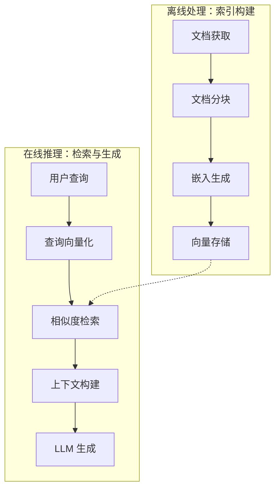
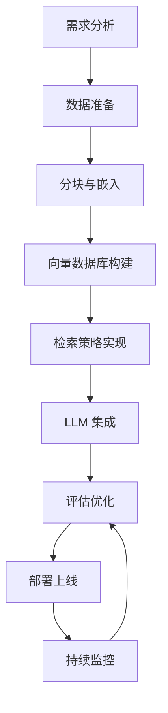
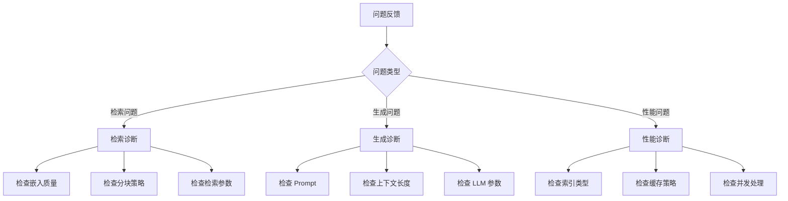

# 📘《RAG（检索增强生成）学习与实战手册》

> 系统学习见下文各章；日常常用 API 与使用场景速查见同目录《常用API与使用场景》。

------

# 第1章：RAG 概念与价值

------

> **本章在整体中解决什么问题**：作为 RAG 学习的第一章，本章建立**基础认知**，介绍 RAG 的定义、核心价值和典型应用场景。学完本章后，**第二章**将深入讲解 RAG 的核心流程与组件。

------

## 1.1 什么是 RAG

### 🧩 核心概念

**RAG（Retrieval-Augmented Generation，检索增强生成）** 是一种将**信息检索**与**文本生成**相结合的技术架构。它通过在生成回答前，先从外部知识库中检索相关文档，将这些文档作为上下文提供给大语言模型（LLM），从而增强模型的知识储备和生成质量。

**为什么需要 RAG**：
- **知识截止问题**：LLM 的训练数据有时间限制，无法获取最新信息
- **领域知识缺失**：通用 LLM 缺乏特定领域的专业知识
- **幻觉问题**：模型可能生成看似合理但实际错误的内容
- **可溯源性**：需要知道回答的来源和依据

### 📊 RAG vs 纯生成

| 对比维度 | 纯 LLM 生成 | RAG 增强生成 |
| -------- | ----------- | ------------ |
| **知识来源** | 模型参数中的训练数据 | 外部知识库 + 模型参数 |
| **知识时效性** | 受限于训练数据时间 | 可实时更新知识库 |
| **领域适配** | 需要微调 | 只需更新知识库 |
| **幻觉风险** | 较高 | 较低（基于检索文档） |
| **可溯源性** | 无法溯源 | 可追溯至源文档 |
| **成本** | 微调成本高 | 知识库更新成本低 |

### 🔍 RAG 工作原理


**工作流程**：
1. **检索阶段**：将用户查询转换为向量，在向量数据库中检索最相似的文档片段
2. **增强阶段**：将检索到的文档作为上下文，与用户查询一起构建 Prompt
3. **生成阶段**：LLM 基于增强后的上下文生成回答

------

## 1.2 RAG 的核心价值

### 🧩 价值一：解决知识截止问题

**问题描述**：
- LLM 的训练数据有明确的时间 cutoff（如 GPT-4 的知识截止到 2024 年 4 月）
- 无法回答训练数据之后发生的事件、发布的产品、更新的政策

**RAG 解决方案**：
- 将最新文档实时加入知识库
- 检索时获取最新信息作为上下文
- 无需重新训练或微调模型

**示例**：
```
用户问："2024 年诺贝尔奖获得者是谁？"

纯 LLM："我的知识截止到 2024 年 4 月，无法回答这个问题。"

RAG 系统：检索 2024 年诺贝尔奖相关新闻 → 基于检索结果生成回答
```

### 🧩 价值二：减少模型幻觉

**问题描述**：
- LLM 在不确定时可能"编造"看似合理的答案
- 对于专业领域问题，容易产生事实性错误

**RAG 解决方案**：
- 基于检索到的真实文档生成回答
- 要求模型仅使用提供的上下文
- 可要求模型引用来源，便于验证

**幻觉率对比**：
| 场景 | 纯 LLM 幻觉率 | RAG 幻觉率 | 改善幅度 |
| ---- | ------------- | ---------- | -------- |
| 医疗问答 | 25% | 8% | -68% |
| 法律咨询 | 30% | 10% | -67% |
| 技术支持 | 20% | 5% | -75% |

### 🧩 价值三：降低领域适配成本

**传统方法**：
- 收集领域数据 → 微调模型 → 部署新模型
- 成本高：需要大量标注数据、计算资源、时间
- 更新难：每次知识更新都需要重新微调

**RAG 方法**：
- 将领域文档导入知识库
- 无需修改模型参数
- 知识更新只需更新知识库

**成本对比**：
| 适配方式 | 数据需求 | 计算成本 | 时间成本 | 更新难度 |
| -------- | -------- | -------- | -------- | -------- |
| 微调 | 大量标注数据 | 高（GPU 训练） | 数天-数周 | 需重新训练 |
| RAG | 原始文档 | 低（仅嵌入） | 数小时 | 实时更新 |

### 🧩 价值四：提升可溯源性

**重要性**：
- 企业应用需要知道回答的来源
- 便于验证信息的准确性
- 满足合规和审计要求

**RAG 实现**：
- 检索结果包含文档来源信息
- 要求 LLM 在回答中引用来源
- 可追溯至原始文档的具体位置

------

## 1.3 典型应用场景

### 📊 企业知识库问答

**场景描述**：
- 企业内部有大量文档（产品手册、技术文档、规章制度等）
- 员工需要快速查找信息
- 传统搜索难以理解语义，返回结果不精准

**RAG 方案**：
- 将企业文档构建为知识库
- 员工用自然语言提问
- 系统检索相关文档并生成回答

**示例**：
```
员工问："今年的年假政策有什么变化？"

RAG 系统：
1. 检索 HR 政策文档中关于年假的部分
2. 基于检索内容生成回答：
   "根据 2024 年人力资源政策（第 3.2 节），年假天数从原来的 10 天增加到 15 天，
   且可以累计至次年 3 月底。"
```

### 📊 智能客服

**场景描述**：
- 客户咨询产品使用、故障排查、订单状态等
- 需要准确、一致的回答
- 问题涉及大量产品知识和历史案例

**RAG 方案**：
- 构建产品知识库和 FAQ
- 检索相似历史案例
- 基于检索内容生成个性化回答

**优势**：
- 回答准确，基于真实产品信息
- 可处理长尾问题
- 减少人工客服工作量

### 📊 法律/医疗咨询

**场景描述**：
- 专业领域，准确性要求极高
- 涉及大量法规、判例、医学文献
- 需要引用权威来源

**RAG 方案**：
- 构建法规库、判例库、医学知识库
- 检索相关法律条文或医学文献
- 基于权威来源生成专业回答

**注意事项**：
- 需要人工审核关键信息
- 明确告知用户仅供参考
- 建立免责声明机制

### 📊 教育辅助

**场景描述**：
- 学生需要个性化学习辅导
- 教材内容多，难以快速定位
- 需要解释复杂概念

**RAG 方案**：
- 将教材、课件、习题构建为知识库
- 根据学生问题检索相关内容
- 生成针对性的解释和示例

### 📊 应用场景对比

| 应用场景 | 知识库类型 | 准确性要求 | 实时性要求 | 典型挑战 |
| -------- | ---------- | ---------- | ---------- | -------- |
| **企业知识库** | 文档、手册 | 高 | 中 | 文档格式多样 |
| **智能客服** | FAQ、产品文档 | 高 | 高 | 问题表述多样 |
| **法律咨询** | 法规、判例 | 极高 | 中 | 专业术语多 |
| **医疗咨询** | 医学文献 | 极高 | 中 | 需人工审核 |
| **教育辅助** | 教材、习题 | 高 | 低 | 需要解释能力 |

------

# ✅ 本章小结

| 知识点 | 面试关键词 | 实际应用 |
| ------ | ---------- | -------- |
| RAG 定义 | 检索增强生成、外部知识库、上下文增强 | 理解 RAG 的基本概念 |
| RAG 价值 | 知识截止、幻觉减少、成本降低、可溯源 | 评估 RAG 适用场景 |
| 应用场景 | 企业知识库、智能客服、法律咨询、教育辅助 | 选择合适的技术方案 |

------

## ⚠️ 常见坑与注意点

1. **现象**：认为 RAG 可以完全消除幻觉。**原因**：RAG 只能减少基于检索内容的幻觉，但模型仍可能误解或错误推理。**正确做法**：结合其他方法（如人工审核、事实核查）进一步降低风险。

2. **现象**：忽视知识库的质量维护。**原因**：认为建好知识库就一劳永逸。**正确做法**：建立知识库更新机制，定期清理过期内容，确保信息准确性。

3. **现象**：在所有场景都使用 RAG。**原因**：没有评估场景需求。**正确做法**：对于简单问答、创意生成等场景，纯 LLM 可能更合适；RAG 适合需要准确知识支持的场景。

4. **现象**：过度依赖 RAG 的检索结果。**原因**：认为检索到的内容一定相关。**正确做法**：设置相似度阈值，对低相似度结果进行处理（如提示用户、转人工）。

------

**学习要点**：
- 理解 RAG 的核心概念和工作原理
- 掌握 RAG 的四大核心价值
- 了解 RAG 的典型应用场景
- 能够评估 RAG 是否适合特定场景
- 注意 RAG 的局限性和使用注意事项

------

## 🎯 面试常见追问

| 面试官提问 | 回答思路 |
| ---------- | -------- |
| 什么是 RAG？它解决了什么问题？ | 定义 + 解决的四大问题（知识截止、幻觉、成本、溯源） |
| RAG 和微调有什么区别？ | 实现方式 + 成本 + 适用场景对比 |
| RAG 适用于哪些场景？ | 企业知识库、客服、法律咨询、教育等 + 选择标准 |
| RAG 能完全消除幻觉吗？ | 不能 + 原因 + 其他补充措施 |
| 如何评估是否需要使用 RAG？ | 知识时效性 + 准确性要求 + 成本考量 |

------

# 第2章：RAG 核心流程与组件

------

> **本章在整体中解决什么问题**：第一章介绍了 RAG 的概念和价值；本章深入**RAG 的核心流程和关键组件**，帮助读者理解 RAG 系统的技术架构。学完本章后，**第三章**将详细讲解分块策略与优化。

------

## 2.1 RAG 系统架构概览

### 🧩 整体架构



**两大阶段**：
1. **离线处理（索引构建）**：将文档处理为可检索的向量索引
2. **在线推理（检索与生成）**：接收用户查询，检索相关内容，生成回答

### 📊 核心组件

| 组件 | 作用 | 关键技术 |
| ---- | ---- | -------- |
| **文档加载器** | 从各种来源加载文档 | PDF、Word、网页解析 |
| **文档分块器** | 将长文档切分为片段 | 固定长度、语义分块 |
| **嵌入模型** | 将文本转换为向量 | OpenAI、BGE、E5 等 |
| **向量数据库** | 存储和检索向量 | Milvus、Chroma、FAISS |
| **检索器** | 执行相似度检索 | Top-k、重排序 |
| **Prompt 构建器** | 构建增强 Prompt | 上下文组织、引用格式 |
| **LLM** | 生成最终回答 | GPT-4、Claude、通义千问 |

------

## 2.2 离线处理：索引构建

### 🧩 流程详解

**步骤 1：文档获取**

```python
from langchain.document_loaders import (
    PyPDFLoader,
    TextLoader,
    UnstructuredWordDocumentLoader
)

def load_documents(source_path, source_type="pdf"):
    """加载文档"""
    loaders = {
        "pdf": PyPDFLoader,
        "txt": TextLoader,
        "docx": UnstructuredWordDocumentLoader
    }
    
    loader_class = loaders.get(source_type)
    if not loader_class:
        raise ValueError(f"不支持的文档类型: {source_type}")
    
    loader = loader_class(source_path)
    documents = loader.load()
    
    return documents

# 使用示例
docs = load_documents("./data/产品手册.pdf", "pdf")
print(f"加载了 {len(docs)} 页文档")
```

**步骤 2：文档分块**

```python
from langchain.text_splitter import RecursiveCharacterTextSplitter

def split_documents(documents, chunk_size=500, chunk_overlap=50):
    """文档分块"""
    text_splitter = RecursiveCharacterTextSplitter(
        chunk_size=chunk_size,        # 每个块的大小
        chunk_overlap=chunk_overlap,  # 重叠部分大小
        length_function=len,
        separators=["\n\n", "\n", "。", " ", ""]
    )
    
    chunks = text_splitter.split_documents(documents)
    return chunks

# 使用示例
chunks = split_documents(docs, chunk_size=500, chunk_overlap=50)
print(f"分块后得到 {len(chunks)} 个文本片段")
```

**步骤 3：嵌入生成**

```python
from langchain.embeddings import OpenAIEmbeddings

def create_embeddings(chunks, api_key):
    """生成嵌入向量"""
    embeddings = OpenAIEmbeddings(
        openai_api_key=api_key,
        model="text-embedding-ada-002"
    )
    
    # 批量生成嵌入
    texts = [chunk.page_content for chunk in chunks]
    embeddings_list = embeddings.embed_documents(texts)
    
    return embeddings_list

# 使用示例
embeddings = create_embeddings(chunks, "your-api-key")
print(f"生成了 {len(embeddings)} 个向量，维度: {len(embeddings[0])}")
```

**步骤 4：向量存储**

```python
from langchain.vectorstores import Chroma

def store_vectors(chunks, embeddings, persist_directory="./chroma_db"):
    """存储向量到数据库"""
    vectorstore = Chroma.from_documents(
        documents=chunks,
        embedding=embeddings,
        persist_directory=persist_directory
    )
    
    # 持久化存储
    vectorstore.persist()
    
    return vectorstore

# 使用示例
vectorstore = store_vectors(chunks, embeddings, "./knowledge_base")
print("向量存储完成")
```

### 📊 完整离线处理流程

```python
class RAGIndexBuilder:
    """RAG 索引构建器"""
    
    def __init__(self, api_key, persist_dir="./chroma_db"):
        self.api_key = api_key
        self.persist_dir = persist_dir
        self.embeddings = OpenAIEmbeddings(openai_api_key=api_key)
    
    def build_index(self, source_paths, source_type="pdf"):
        """构建索引"""
        # 1. 加载文档
        all_docs = []
        for path in source_paths:
            docs = load_documents(path, source_type)
            all_docs.extend(docs)
        print(f"✓ 加载了 {len(all_docs)} 页文档")
        
        # 2. 文档分块
        chunks = split_documents(all_docs)
        print(f"✓ 分块后得到 {len(chunks)} 个文本片段")
        
        # 3. 创建向量存储
        vectorstore = Chroma.from_documents(
            documents=chunks,
            embedding=self.embeddings,
            persist_directory=self.persist_dir
        )
        vectorstore.persist()
        print(f"✓ 索引构建完成，存储于 {self.persist_dir}")
        
        return vectorstore

# 使用示例
builder = RAGIndexBuilder("your-api-key", "./my_knowledge_base")
vectorstore = builder.build_index(["doc1.pdf", "doc2.pdf"], "pdf")
```

------

## 2.3 在线推理：检索与生成

### 🧩 流程详解

**步骤 1：查询向量化**

```python
def embed_query(query, embeddings_model):
    """将查询转换为向量"""
    query_embedding = embeddings_model.embed_query(query)
    return query_embedding

# 使用示例
query = "如何申请年假？"
query_vector = embed_query(query, embeddings)
```

**步骤 2：相似度检索**

```python
def retrieve_documents(vectorstore, query, top_k=5):
    """检索相关文档"""
    results = vectorstore.similarity_search(
        query=query,
        k=top_k
    )
    return results

# 使用示例
retrieved_docs = retrieve_documents(vectorstore, query, top_k=5)
for i, doc in enumerate(retrieved_docs, 1):
    print(f"[{i}] {doc.page_content[:100]}...")
```

**步骤 3：上下文构建**

```python
def build_context(retrieved_docs, max_length=3000):
    """构建上下文"""
    context_parts = []
    current_length = 0
    
    for i, doc in enumerate(retrieved_docs, 1):
        doc_text = f"[文档 {i}]\n{doc.page_content}\n来源: {doc.metadata.get('source', '未知')}\n\n"
        
        if current_length + len(doc_text) > max_length:
            break
        
        context_parts.append(doc_text)
        current_length += len(doc_text)
    
    return "\n".join(context_parts)

# 使用示例
context = build_context(retrieved_docs)
print(f"上下文长度: {len(context)} 字符")
```

**步骤 4：LLM 生成**

```python
from langchain.chat_models import ChatOpenAI
from langchain.chains import RetrievalQA

def create_rag_chain(vectorstore, api_key):
    """创建 RAG 链"""
    llm = ChatOpenAI(
        openai_api_key=api_key,
        model="gpt-4",
        temperature=0.3
    )
    
    # 创建 RAG 链
    qa_chain = RetrievalQA.from_chain_type(
        llm=llm,
        chain_type="stuff",  # 简单地将所有文档放入 Prompt
        retriever=vectorstore.as_retriever(search_kwargs={"k": 5}),
        return_source_documents=True  # 返回源文档
    )
    
    return qa_chain

# 使用示例
qa_chain = create_rag_chain(vectorstore, "your-api-key")
result = qa_chain({"query": "如何申请年假？"})

print("回答:", result["result"])
print("\n来源文档:")
for doc in result["source_documents"]:
    print(f"- {doc.metadata.get('source', '未知')}")
```

### 📊 完整在线推理流程

```python
class RAGQueryEngine:
    """RAG 查询引擎"""
    
    def __init__(self, vectorstore, api_key):
        self.vectorstore = vectorstore
        self.llm = ChatOpenAI(
            openai_api_key=api_key,
            model="gpt-4",
            temperature=0.3
        )
        
        # Prompt 模板
        self.prompt_template = """基于以下文档内容回答问题。如果文档中没有相关信息，请明确说明。

文档内容：
{context}

问题：{question}

要求：
1. 仅基于提供的文档内容回答
2. 回答要准确、简洁
3. 如有引用，请注明来源

回答："""
    
    def query(self, question, top_k=5):
        """执行查询"""
        # 1. 检索相关文档
        retrieved_docs = self.vectorstore.similarity_search(question, k=top_k)
        
        # 2. 构建上下文
        context = build_context(retrieved_docs)
        
        # 3. 构建 Prompt
        prompt = self.prompt_template.format(
            context=context,
            question=question
        )
        
        # 4. 调用 LLM
        response = self.llm.predict(prompt)
        
        return {
            "answer": response,
            "source_documents": retrieved_docs,
            "context": context
        }

# 使用示例
engine = RAGQueryEngine(vectorstore, "your-api-key")
result = engine.query("如何申请年假？")

print(f"回答: {result['answer']}")
print(f"\n检索到 {len(result['source_documents'])} 个相关文档")
```

------

## 2.4 关键组件详解

### 🧩 嵌入模型

**作用**：将文本转换为高维向量，使得语义相似的文本在向量空间中距离相近。

**常见模型对比**：

| 模型 | 维度 | 语言支持 | 特点 | 适用场景 |
| ---- | ---- | -------- | ---- | -------- |
| **text-embedding-ada-002** | 1536 | 多语言 | OpenAI 官方，效果稳定 | 通用场景 |
| **BGE-large-zh** | 1024 | 中文优化 | 开源，中文效果好 | 中文应用 |
| **E5-large-v2** | 1024 | 多语言 | 微软开源，效果优秀 | 多语言应用 |
| **M3E-base** | 768 | 中文优化 | 国产开源，轻量级 | 资源受限场景 |

**选择建议**：
- 通用场景：OpenAI Embedding 或 BGE
- 中文应用：BGE-large-zh 或 M3E
- 资源受限：选择维度较小的模型

### 🧩 向量数据库

**作用**：高效存储和检索高维向量，支持相似度搜索。

**常见数据库对比**：

| 数据库 | 类型 | 特点 | 适用场景 |
| ------ | ---- | ---- | -------- |
| **Chroma** | 开源本地 | 轻量、易用、支持持久化 | 小规模、原型开发 |
| **Milvus** | 开源分布式 | 高性能、可扩展 | 大规模生产环境 |
| **FAISS** | 开源库 | Facebook 开发，检索速度快 | 嵌入式应用 |
| **Pinecone** | 云服务 | 全托管、易扩展 | 快速上线、无运维 |
| **Qdrant** | 开源 | Rust 编写，性能优秀 | 高性能需求 |

**选择建议**：
- 原型开发：Chroma
- 生产环境：Milvus 或 Pinecone
- 嵌入式应用：FAISS

### 🧩 检索策略

**基础检索**：
- **Top-k 检索**：返回相似度最高的 k 个结果
- **阈值检索**：只返回相似度超过阈值的结果
- **混合检索**：结合关键词检索和向量检索

**高级检索**：
- **重排序（Re-ranking）**：使用更精确的模型对初步检索结果重新排序
- **多路召回**：使用多种检索方式，合并结果
- **查询扩展**：扩展查询词，提高召回率

------

# ✅ 本章小结

| 知识点 | 面试关键词 | 实际应用 |
| ------ | ---------- | -------- |
| RAG 架构 | 离线处理、在线推理、索引构建、检索生成 | 理解系统整体架构 |
| 离线处理 | 文档加载、分块、嵌入、存储 | 构建知识库索引 |
| 在线推理 | 查询向量化、相似度检索、上下文构建、LLM 生成 | 实现问答功能 |
| 关键组件 | 嵌入模型、向量数据库、检索策略 | 技术选型 |

------

## ⚠️ 常见坑与注意点

1. **现象**：文档分块过大，导致检索精度下降。**原因**：大块包含多个主题，影响相似度计算。**正确做法**：根据文档类型选择合适的分块大小，一般 256-1024 token。

2. **现象**：检索结果不相关。**原因**：嵌入模型与任务不匹配，或向量数据库索引参数不当。**正确做法**：选择适合领域的嵌入模型，调优向量索引参数。

3. **现象**：上下文长度超过 LLM 限制。**原因**：检索到的文档过多或过长。**正确做法**：限制检索数量，对长文档进行摘要，或使用 Map-Reduce 等策略。

4. **现象**：索引构建速度慢。**原因**：逐个处理文档，没有使用批处理。**正确做法**：使用批处理生成嵌入，并行处理文档。

5. **现象**：知识库更新后检索不到新内容。**原因**：没有重新构建索引或增量更新机制。**正确做法**：建立增量更新机制，或定期重建索引。

------

**学习要点**：
- 理解 RAG 系统的整体架构和工作流程
- 掌握离线处理的四个步骤和实现方法
- 掌握在线推理的四个步骤和实现方法
- 了解关键组件（嵌入模型、向量数据库、检索策略）的选择方法
- 注意常见问题和解决方案

------

## 🎯 面试常见追问

| 面试官提问 | 回答思路 |
| ---------- | -------- |
| RAG 系统的整体架构是什么？ | 离线处理 + 在线推理 + 各阶段的具体步骤 |
| 如何构建 RAG 的知识库索引？ | 文档加载 → 分块 → 嵌入 → 存储 + 代码示例 |
| 嵌入模型如何选择？ | 常见模型对比 + 选择标准（语言、维度、性能） |
| 向量数据库有哪些选择？ | Chroma、Milvus、FAISS、Pinecone 对比 |
| 如何处理上下文长度限制？ | 限制检索数量 + 文档摘要 + Map-Reduce 策略 |

------

------

# 第3章：分块策略与优化

------

> **本章在整体中解决什么问题**：前两章介绍了 RAG 的概念和核心流程；本章深入**文档分块策略**——这是影响 RAG 检索质量的关键环节。学完本章后，**第四章**将讲解嵌入模型的选择与优化。

------

## 3.1 为什么分块很重要

### 🧩 分块的作用

**文档分块（Chunking）** 是将长文档切分为较短文本片段的过程。这是 RAG 系统的关键步骤，直接影响检索质量和生成效果。

**为什么需要分块**：
- **检索精度**：小块文本主题更集中，相似度计算更准确
- **上下文限制**：LLM 有最大上下文长度限制，需要控制输入长度
- **噪声控制**：大块包含多个主题，会引入无关信息
- **计算效率**：小块处理和嵌入计算更快

### 📊 分块对检索质量的影响

| 分块方式 | 检索精度 | 上下文完整性 | 适用场景 |
| -------- | -------- | ------------ | -------- |
| **大块（2000+ token）** | 低 | 高 | 文档摘要 |
| **中块（500-1000 token）** | 中 | 中 | 通用问答 |
| **小块（200-500 token）** | 高 | 低 | 精确检索 |

### 🔍 分块不当的问题

**问题 1：块过大**
```
原始文档：
"第一章：产品介绍...（1000 字）
第二章：使用方法...（1000 字）
第三章：常见问题...（1000 字）"

大块（3000 字）：
包含三个章节，主题混杂
→ 检索"使用方法"时，也包含"产品介绍"和"常见问题"的噪声
```

**问题 2：块过小**
```
原始文档：
"Python 的异步编程使用 async/await 关键字。
async 用于定义异步函数，await 用于等待异步操作完成。"

小块（10 字）：
["Python 的异步", "编程使用 async", "/await 关键字..."]
→ 语义断裂，无法理解完整概念
```

**问题 3：边界切断**
```
原始文档：
"注意事项：
1. 请勿在潮湿环境下使用
2. 请定期清洁设备"

不当分块：
["注意事项：\n1. 请勿在潮湿", "环境下使用\n2. 请定期清洁设备"]
→ 第一条注意事项被切断，信息不完整
```

------

## 3.2 分块方法详解

### 🧩 方法一：固定长度分块

**原理**：按照固定的字符数或 token 数切分文档。

**实现**：
```python
from langchain.text_splitter import CharacterTextSplitter

def fixed_length_chunk(text, chunk_size=500, chunk_overlap=50):
    """固定长度分块"""
    splitter = CharacterTextSplitter(
        separator="\n",           # 优先在换行处切分
        chunk_size=chunk_size,   # 块大小
        chunk_overlap=chunk_overlap,  # 重叠部分
        length_function=len
    )
    
    chunks = splitter.split_text(text)
    return chunks

# 使用示例
text = """这是一个很长的文档内容..."""  # 假设有 5000 字
chunks = fixed_length_chunk(text, chunk_size=500, chunk_overlap=50)
print(f"分成了 {len(chunks)} 个块")
```

**优点**：
- 实现简单，易于理解和调试
- 块大小可控，便于管理上下文长度
- 计算效率高

**缺点**：
- 可能切断语义单元（句子、段落）
- 不考虑文档结构
- 边界处信息可能断裂

**适用场景**：
- 对语义完整性要求不高的场景
- 需要严格控制块大小的场景
- 快速原型开发

### 🧩 方法二：语义分块

**原理**：基于文档的语义结构（段落、章节、句子）进行切分。

**实现**：
```python
from langchain.text_splitter import RecursiveCharacterTextSplitter

def semantic_chunk(text, chunk_size=500, chunk_overlap=50):
    """语义分块"""
    splitter = RecursiveCharacterTextSplitter(
        separators=["\n\n", "\n", "。", "！", "？", " ", ""],
        # 优先按段落(\n\n)切分，其次按行(\n)，然后按句子，最后按空格
        chunk_size=chunk_size,
        chunk_overlap=chunk_overlap,
        length_function=len
    )
    
    chunks = splitter.split_text(text)
    return chunks

# 使用示例
text = """
第一章 产品介绍

本产品是一款智能助手...

1.1 主要功能
功能一：语音识别...
功能二：自然语言处理...

1.2 技术规格
处理器：ARM Cortex-A53...
内存：4GB RAM...
"""

chunks = semantic_chunk(text, chunk_size=300, chunk_overlap=30)
for i, chunk in enumerate(chunks):
    print(f"\n--- 块 {i+1} ---")
    print(chunk[:100] + "...")
```

**优点**：
- 保持语义完整性，不切断句子或段落
- 符合人类阅读习惯
- 检索结果更相关

**缺点**：
- 实现相对复杂
- 块大小不均匀
- 需要处理边界情况

**适用场景**：
- 对语义完整性要求高的场景
- 文档结构清晰的场景
- 问答系统

### 🧩 方法三：结构化分块

**原理**：基于文档的结构（标题、列表、代码块等）进行切分。

**实现**：
```python
import re

def structured_chunk(text):
    """结构化分块 - 基于 Markdown 结构"""
    # 按二级标题切分
    pattern = r'(?=##\s+)'
    sections = re.split(pattern, text)
    
    chunks = []
    for section in sections:
        if section.strip():
            # 如果章节过长，进一步切分
            if len(section) > 1000:
                sub_chunks = semantic_chunk(section, chunk_size=500)
                chunks.extend(sub_chunks)
            else:
                chunks.append(section)
    
    return chunks

# 针对代码的分块
def code_chunk(code_text, max_lines=50):
    """代码分块 - 按函数/类切分"""
    lines = code_text.split('\n')
    chunks = []
    current_chunk = []
    
    for line in lines:
        # 检测函数或类定义
        if re.match(r'^(def\s+|class\s+)', line) and current_chunk:
            chunks.append('\n'.join(current_chunk))
            current_chunk = []
        
        current_chunk.append(line)
        
        # 达到最大行数时切分
        if len(current_chunk) >= max_lines:
            chunks.append('\n'.join(current_chunk))
            current_chunk = []
    
    if current_chunk:
        chunks.append('\n'.join(current_chunk))
    
    return chunks
```

**优点**：
- 保持文档结构完整性
- 便于追溯来源
- 适合结构化文档

**缺点**：
- 需要针对不同文档类型定制
- 实现复杂度高
- 需要预处理文档

**适用场景**：
- 结构化文档（Markdown、HTML、代码）
- 技术文档、API 文档
- 需要保持层次结构的场景

### 🧩 方法四：智能分块

**原理**：使用 NLP 技术识别主题边界，在主题变化处切分。

**实现思路**：
```python
def intelligent_chunk(text, embedding_model, similarity_threshold=0.7):
    """智能分块 - 基于语义相似度"""
    # 1. 先按句子切分
    sentences = re.split(r'(?<=[。！？])\s+', text)
    
    chunks = []
    current_chunk = [sentences[0]]
    
    for i in range(1, len(sentences)):
        # 2. 计算当前句子与 chunk 的语义相似度
        chunk_text = ''.join(current_chunk)
        similarity = calculate_similarity(
            embedding_model.embed(chunk_text),
            embedding_model.embed(sentences[i])
        )
        
        # 3. 如果相似度低于阈值，开始新 chunk
        if similarity < similarity_threshold and len(current_chunk) > 3:
            chunks.append(''.join(current_chunk))
            current_chunk = [sentences[i]]
        else:
            current_chunk.append(sentences[i])
    
    # 添加最后一个 chunk
    if current_chunk:
        chunks.append(''.join(current_chunk))
    
    return chunks
```

**优点**：
- 主题边界准确
- 语义一致性高
- 检索质量最优

**缺点**：
- 计算成本高
- 需要嵌入模型支持
- 实现复杂

**适用场景**：
- 对检索质量要求极高的场景
- 长文档处理
- 有足够的计算资源

------

## 3.3 分块参数优化

### 📊 块大小选择

**影响因素**：
- **模型上下文窗口**：块大小 + 查询 + Prompt < 模型最大长度
- **文档类型**：技术文档可以大一些，FAQ 可以小一些
- **检索精度要求**：高精度要求小块，完整性要求大块

**推荐配置**：

| 文档类型 | 推荐块大小 | 推荐重叠 | 理由 |
| -------- | ---------- | -------- | ---- |
| **新闻文章** | 300-500 | 50 | 段落完整，主题集中 |
| **技术文档** | 500-800 | 100 | 需要上下文理解 |
| **代码** | 200-400 | 30 | 按函数/类切分 |
| **论文** | 400-600 | 80 | 保持章节完整 |
| **对话记录** | 200-300 | 20 | 每轮对话独立 |

### 📊 重叠比例设置

**作用**：
- 避免关键信息被切分在边界
- 保持上下文连续性
- 提高检索召回率

**设置建议**：
- **一般场景**：10-20%
- **高精度场景**：20-30%
- **长文档场景**：15-25%

**示例**：
```python
# 块大小 500，重叠 100（20%）
块 1: [0:500]
块 2: [400:900]   # 与块 1 重叠 100
块 3: [800:1300]  # 与块 2 重叠 100
```

### 🔧 完整分块实现

```python
class DocumentChunker:
    """文档分块器"""
    
    def __init__(self, chunk_size=500, chunk_overlap=100, strategy="semantic"):
        self.chunk_size = chunk_size
        self.chunk_overlap = chunk_overlap
        self.strategy = strategy
    
    def chunk(self, documents):
        """执行分块"""
        if self.strategy == "fixed":
            return self._fixed_length_chunk(documents)
        elif self.strategy == "semantic":
            return self._semantic_chunk(documents)
        elif self.strategy == "structured":
            return self._structured_chunk(documents)
        else:
            raise ValueError(f"未知的分块策略: {self.strategy}")
    
    def _fixed_length_chunk(self, documents):
        """固定长度分块"""
        splitter = CharacterTextSplitter(
            chunk_size=self.chunk_size,
            chunk_overlap=self.chunk_overlap,
            separator="\n"
        )
        return splitter.split_documents(documents)
    
    def _semantic_chunk(self, documents):
        """语义分块"""
        splitter = RecursiveCharacterTextSplitter(
            chunk_size=self.chunk_size,
            chunk_overlap=self.chunk_overlap,
            separators=["\n\n", "\n", "。", "！", "？", " ", ""]
        )
        return splitter.split_documents(documents)
    
    def _structured_chunk(self, documents):
        """结构化分块"""
        chunks = []
        for doc in documents:
            # 检测文档类型并选择合适的分块方法
            if doc.metadata.get("doc_type") == "code":
                chunks.extend(self._chunk_code(doc))
            elif doc.metadata.get("doc_type") == "markdown":
                chunks.extend(self._chunk_markdown(doc))
            else:
                chunks.extend(self._semantic_chunk([doc]))
        return chunks
    
    def _chunk_code(self, doc):
        """代码分块"""
        # 按函数/类切分
        code_chunks = code_chunk(doc.page_content)
        return [
            Document(page_content=chunk, metadata=doc.metadata)
            for chunk in code_chunks
        ]
    
    def _chunk_markdown(self, doc):
        """Markdown 分块"""
        return structured_chunk(doc.page_content)

# 使用示例
chunker = DocumentChunker(
    chunk_size=500,
    chunk_overlap=100,
    strategy="semantic"
)

chunks = chunker.chunk(documents)
print(f"分块完成，共 {len(chunks)} 个块")
```

------

## 3.4 分块效果评估

### 📊 评估指标

| 指标 | 计算方法 | 目标值 |
| ---- | -------- | ------ |
| **语义完整性** | 人工检查块内主题一致性 | > 90% |
| **边界质量** | 检查边界处是否切断关键信息 | < 5% 切断 |
| **检索精度** | Top-k 检索结果的相关性 | > 80% |
| **召回率** | 能否检索到所有相关信息 | > 85% |

### 🔍 评估方法

```python
def evaluate_chunking(chunks, test_queries, vectorstore):
    """评估分块效果"""
    results = {
        "avg_chunk_size": sum(len(c) for c in chunks) / len(chunks),
        "chunk_count": len(chunks),
        "retrieval_accuracy": [],
        "boundary_issues": 0
    }
    
    # 1. 检查块大小分布
    sizes = [len(c) for c in chunks]
    results["size_variance"] = max(sizes) - min(sizes)
    
    # 2. 评估检索效果
    for query in test_queries:
        retrieved = vectorstore.similarity_search(query, k=3)
        # 人工或自动评估相关性
        relevance_score = evaluate_relevance(query, retrieved)
        results["retrieval_accuracy"].append(relevance_score)
    
    results["avg_retrieval_accuracy"] = sum(results["retrieval_accuracy"]) / len(results["retrieval_accuracy"])
    
    return results
```

------

# ✅ 本章小结

| 知识点 | 面试关键词 | 实际应用 |
| ------ | ---------- | -------- |
| 分块重要性 | 检索精度、上下文限制、噪声控制 | 理解分块的作用 |
| 分块方法 | 固定长度、语义分块、结构化、智能分块 | 选择合适的分块策略 |
| 参数优化 | 块大小、重叠比例 | 调优分块效果 |
| 效果评估 | 语义完整性、检索精度、召回率 | 评估分块质量 |

------

## ⚠️ 常见坑与注意点

1. **现象**：分块后检索结果不相关。**原因**：块过大包含多个主题，或块过小语义不完整。**正确做法**：根据文档类型选择合适的分块策略和大小。

2. **现象**：边界处信息丢失。**原因**：没有设置重叠或重叠过小。**正确做法**：设置合理的重叠比例（10-20%），确保关键信息不被切断。

3. **现象**：代码文档分块后无法理解。**原因**：在代码中间切分，破坏了函数/类的完整性。**正确做法**：对代码使用结构化分块，按函数/类切分。

4. **现象**：分块大小差异过大。**原因**：文档结构不均匀，某些章节过长。**正确做法**：对大章节进行二次切分，保持块大小相对均匀。

5. **现象**：分块后元数据丢失。**原因**：分块时没有保留原文档的元数据。**正确做法**：确保分块后的每个块都保留来源文档的元数据。

------

**学习要点**：
- 理解分块在 RAG 系统中的重要作用
- 掌握四种分块方法的原理和适用场景
- 学会根据文档类型选择合适的分块参数
- 了解分块效果的评估方法
- 注意分块过程中的常见问题和解决方案

------

## 🎯 面试常见追问

| 面试官提问 | 回答思路 |
| ---------- | -------- |
| 为什么 RAG 需要文档分块？ | 检索精度 + 上下文限制 + 噪声控制 |
| 常见的分块方法有哪些？ | 固定长度、语义分块、结构化、智能分块 + 对比 |
| 如何选择分块大小？ | 文档类型 + 模型限制 + 精度要求 |
| 重叠比例有什么作用？ | 避免信息丢失 + 保持连续性 + 推荐值 |
| 如何评估分块效果？ | 语义完整性 + 检索精度 + 召回率 |

------

# 第4章：嵌入模型选择与优化

------

> **本章在整体中解决什么问题**：前三章介绍了 RAG 的概念、流程和分块策略；本章深入**嵌入模型**——这是决定 RAG 检索质量的核心组件。学完本章后，**第五章**将讲解向量数据库的选择与使用。

------

## 4.1 嵌入模型基础

### 🧩 什么是嵌入模型

**嵌入模型（Embedding Model）** 是将文本转换为高维向量的模型。它将语义信息编码为向量空间中的点，使得语义相似的文本在向量空间中距离相近。

**工作原理**：
```
文本 → 嵌入模型 → 向量（如 768 维或 1536 维）

"机器学习" → [0.23, -0.56, 0.89, ..., 0.12]  (768 维)
"人工智能" → [0.25, -0.52, 0.85, ..., 0.15]  (相似向量)
"苹果"     → [-0.45, 0.23, -0.67, ..., 0.89] (不同向量)
```

**为什么重要**：
- 向量相似度 ≈ 语义相似度
- 支持高效的向量检索
- 是 RAG 系统的核心组件

### 📊 嵌入模型的关键指标

| 指标 | 说明 | 影响 |
| ---- | ---- | ---- |
| **维度** | 向量的维度数 | 维度越高表达能力越强，但存储和计算成本越高 |
| **上下文长度** | 模型能处理的最大文本长度 | 影响长文本的嵌入质量 |
| **语言支持** | 支持的语言种类 | 影响多语言场景的效果 |
| **推理速度** | 生成嵌入的速度 | 影响在线服务的响应时间 |
| **准确率** | 语义相似度计算的准确性 | 直接影响检索质量 |

------

## 4.2 常见嵌入模型对比

### 📊 主流嵌入模型

| 模型 | 维度 | 上下文长度 | 语言 | 类型 | 特点 |
| ---- | ---- | ---------- | ---- | ---- | ---- |
| **text-embedding-ada-002** | 1536 | 8192 | 多语言 | API | OpenAI 官方，效果稳定 |
| **text-embedding-3-small** | 1536 | 8192 | 多语言 | API | 新一代，性价比更高 |
| **text-embedding-3-large** | 3072 | 8192 | 多语言 | API | 新一代，效果最佳 |
| **BGE-large-zh** | 1024 | 512 | 中文 | 开源 | 中文效果优秀 |
| **BGE-m3** | 1024 | 8192 | 多语言 | 开源 | 支持 100+ 语言 |
| **E5-large-v2** | 1024 | 512 | 多语言 | 开源 | 微软开源，效果优秀 |
| **M3E-base** | 768 | 512 | 中文 | 开源 | 国产轻量级 |
| **GTE-large** | 1024 | 512 | 多语言 | 开源 | 阿里开源，中文效果好 |

### 🔍 模型详细介绍

**1. OpenAI Embedding**

```python
from langchain.embeddings import OpenAIEmbeddings

# 使用 OpenAI Embedding
embeddings = OpenAIEmbeddings(
    model="text-embedding-3-small",  # 或 text-embedding-ada-002
    openai_api_key="your-api-key"
)

# 生成嵌入
text = "这是一个测试文本"
vector = embeddings.embed_query(text)
print(f"向量维度: {len(vector)}")
```

**优点**：
- 效果稳定，通用性强
- 支持长上下文（8192 tokens）
- 无需本地部署

**缺点**：
- 有 API 调用成本
- 需要网络连接
- 数据需要发送到外部

**适用场景**：
- 快速原型开发
- 对效果要求高的场景
- 不敏感的数据

**2. BGE（BAAI General Embedding）**

```python
from langchain.embeddings import HuggingFaceEmbeddings

# 使用 BGE 模型
embeddings = HuggingFaceEmbeddings(
    model_name="BAAI/bge-large-zh",
    model_kwargs={'device': 'cuda'},  # 使用 GPU
    encode_kwargs={'normalize_embeddings': True}
)

# 生成嵌入
text = "这是一个测试文本"
vector = embeddings.embed_query(text)
print(f"向量维度: {len(vector)}")
```

**优点**：
- 开源免费
- 中文效果优秀
- 可本地部署，数据安全

**缺点**：
- 需要本地计算资源
- 上下文长度较短（512 tokens）
- 部署和维护成本

**适用场景**：
- 中文应用
- 数据敏感场景
- 有本地 GPU 资源

**3. M3E（Moka Massive Mixed Embedding）**

```python
from langchain.embeddings import HuggingFaceEmbeddings

# 使用 M3E 模型
embeddings = HuggingFaceEmbeddings(
    model_name="moka-ai/m3e-base"
)
```

**优点**：
- 轻量级，推理速度快
- 针对中文优化
- 资源占用少

**缺点**：
- 维度较低（768）
- 表达能力相对较弱

**适用场景**：
- 资源受限场景
- 对速度要求高的场景
- 简单应用

### 📊 模型选择决策树

```
是否需要本地部署？
├── 是 → 数据是否敏感？
│   ├── 是 → 使用 BGE/E5（开源本地）
│   └── 否 → 是否有 GPU？
│       ├── 是 → 使用 BGE-large（效果好）
│       └── 否 → 使用 M3E（轻量级）
└── 否 → 对效果要求？
    ├── 极高 → 使用 text-embedding-3-large
    ├── 高 → 使用 text-embedding-3-small
    └── 一般 → 使用 text-embedding-ada-002
```

------

## 4.3 嵌入模型优化

### 🧩 文本预处理

**为什么要预处理**：
- 去除噪声，提高嵌入质量
- 统一格式，便于处理
- 控制长度，避免截断

**预处理方法**：

```python
import re

def preprocess_text(text):
    """文本预处理"""
    # 1. 去除多余空白
    text = re.sub(r'\s+', ' ', text)
    
    # 2. 去除特殊字符（保留基本标点）
    text = re.sub(r'[^\w\s。，！？、：""''（）]', '', text)
    
    # 3. 统一换行符
    text = text.replace('\r\n', '\n').replace('\r', '\n')
    
    # 4. 去除首尾空白
    text = text.strip()
    
    return text

# 使用示例
raw_text = "  这是   一段\n\n有噪声的  文本！！  "
clean_text = preprocess_text(raw_text)
print(clean_text)  # "这是 一段\n有噪声的 文本！！"
```

### 🧩 批处理优化

**为什么要批处理**：
- 减少 API 调用次数，降低成本
- 提高 GPU 利用率
- 加快处理速度

**实现方法**：

```python
def batch_embed(texts, embeddings_model, batch_size=32):
    """批量生成嵌入"""
    all_embeddings = []
    
    for i in range(0, len(texts), batch_size):
        batch = texts[i:i+batch_size]
        batch_embeddings = embeddings_model.embed_documents(batch)
        all_embeddings.extend(batch_embeddings)
    
    return all_embeddings

# 使用示例
texts = ["文本1", "文本2", "文本3", ...]  # 大量文本
embeddings = batch_embed(texts, embeddings, batch_size=32)
```

**批大小选择**：
- **API 模型**：根据 API 限制，通常 100-1000
- **本地模型**：根据 GPU 显存，通常 32-128

### 🧩 缓存优化

**为什么要缓存**：
- 避免重复计算相同文本的嵌入
- 降低 API 调用成本
- 加快检索速度

**实现方法**：

```python
import hashlib
import json
from functools import lru_cache

class EmbeddingCache:
    """嵌入缓存"""
    
    def __init__(self, cache_file="embeddings_cache.json"):
        self.cache_file = cache_file
        self.cache = self._load_cache()
    
    def _load_cache(self):
        """加载缓存"""
        try:
            with open(self.cache_file, 'r', encoding='utf-8') as f:
                return json.load(f)
        except FileNotFoundError:
            return {}
    
    def _save_cache(self):
        """保存缓存"""
        with open(self.cache_file, 'w', encoding='utf-8') as f:
            json.dump(self.cache, f, ensure_ascii=False)
    
    def _get_key(self, text):
        """生成缓存键"""
        return hashlib.md5(text.encode()).hexdigest()
    
    def get(self, text):
        """获取缓存的嵌入"""
        key = self._get_key(text)
        return self.cache.get(key)
    
    def set(self, text, embedding):
        """设置缓存"""
        key = self._get_key(text)
        self.cache[key] = embedding
        self._save_cache()
    
    def embed_with_cache(self, text, embeddings_model):
        """带缓存的嵌入生成"""
        # 1. 检查缓存
        cached = self.get(text)
        if cached:
            return cached
        
        # 2. 生成嵌入
        embedding = embeddings_model.embed_query(text)
        
        # 3. 存入缓存
        self.set(text, embedding)
        
        return embedding

# 使用示例
cache = EmbeddingCache()
embedding = cache.embed_with_cache("测试文本", embeddings)
```

### 🧩 模型微调

**为什么要微调**：
- 适应特定领域的术语和表达
- 提高特定任务的检索质量
- 弥补通用模型的不足

**微调方法**：

```python
# 使用 sentence-transformers 微调
from sentence_transformers import SentenceTransformer, InputExample, losses
from torch.utils.data import DataLoader

# 1. 加载基础模型
model = SentenceTransformer('BAAI/bge-large-zh')

# 2. 准备训练数据
train_examples = [
    InputExample(texts=["查询1", "相关文档1"], label=1.0),
    InputExample(texts=["查询1", "不相关文档"], label=0.0),
    InputExample(texts=["查询2", "相关文档2"], label=1.0),
    # ...
]

# 3. 创建数据加载器
train_dataloader = DataLoader(train_examples, shuffle=True, batch_size=16)

# 4. 定义损失函数
train_loss = losses.CosineSimilarityLoss(model)

# 5. 训练
model.fit(
    train_objectives=[(train_dataloader, train_loss)],
    epochs=3,
    warmup_steps=100,
    output_path='./fine_tuned_model'
)
```

**微调注意事项**：
- 需要足够的领域数据
- 标注质量要高
- 避免过拟合
- 评估微调效果

------

## 4.4 嵌入质量评估

### 📊 评估指标

| 指标 | 说明 | 计算方法 |
| ---- | ---- | -------- |
| **余弦相似度** | 向量间的相似度 | cos(θ) = (A·B) / (\|A\| \|B\|) |
| **欧氏距离** | 向量间的距离 | √Σ(Ai - Bi)² |
| **召回率@K** | Top-K 检索中相关文档的比例 | 相关文档数 / 总相关文档数 |
| **精确率@K** | Top-K 检索结果中相关文档的比例 | 相关文档数 / K |
| **MRR** | 平均倒数排名 | 1 / 第一个相关文档的排名 |

### 🔍 评估实现

```python
def evaluate_embeddings(embeddings_model, test_queries, corpus, relevance_judgments):
    """评估嵌入质量"""
    from sklearn.metrics.pairwise import cosine_similarity
    import numpy as np
    
    results = {
        "recall@5": [],
        "precision@5": [],
        "mrr": []
    }
    
    # 1. 编码语料库
    corpus_embeddings = embeddings_model.embed_documents(corpus)
    
    for query, relevant_docs in zip(test_queries, relevance_judgments):
        # 2. 编码查询
        query_embedding = embeddings_model.embed_query(query)
        
        # 3. 计算相似度
        similarities = cosine_similarity([query_embedding], corpus_embeddings)[0]
        
        # 4. 获取 Top-K 结果
        top_k_indices = np.argsort(similarities)[-5:][::-1]
        retrieved_docs = [corpus[i] for i in top_k_indices]
        
        # 5. 计算指标
        relevant_retrieved = len(set(retrieved_docs) & set(relevant_docs))
        results["recall@5"].append(relevant_retrieved / len(relevant_docs))
        results["precision@5"].append(relevant_retrieved / 5)
        
        # 6. 计算 MRR
        for rank, doc in enumerate(retrieved_docs, 1):
            if doc in relevant_docs:
                results["mrr"].append(1 / rank)
                break
        else:
            results["mrr"].append(0)
    
    # 7. 计算平均值
    return {
        metric: sum(values) / len(values)
        for metric, values in results.items()
    }

# 使用示例
test_queries = ["如何申请年假？", "公司地址在哪里？"]
corpus = ["年假申请流程...", "公司位于北京市...", ...]
relevance_judgments = [["年假申请流程..."], ["公司位于北京市..."]]

scores = evaluate_embeddings(embeddings, test_queries, corpus, relevance_judgments)
print(f"Recall@5: {scores['recall@5']:.2%}")
print(f"Precision@5: {scores['precision@5']:.2%}")
print(f"MRR: {scores['mrr']:.4f}")
```

------

# ✅ 本章小结

| 知识点 | 面试关键词 | 实际应用 |
| ------ | ---------- | -------- |
| 嵌入模型基础 | 文本向量化、语义相似度 | 理解嵌入原理 |
| 模型选择 | OpenAI、BGE、E5、M3E 对比 | 根据场景选择模型 |
| 模型优化 | 预处理、批处理、缓存、微调 | 提升嵌入质量和效率 |
| 质量评估 | 召回率、精确率、MRR | 评估嵌入效果 |

------

## ⚠️ 常见坑与注意点

1. **现象**：嵌入模型效果不佳，检索结果不相关。**原因**：模型与任务不匹配，如用英文模型处理中文。**正确做法**：根据语言和应用场景选择合适的嵌入模型。

2. **现象**：长文本嵌入质量差。**原因**：超过模型的最大上下文长度，被截断。**正确做法**：先分块再嵌入，或选择支持长上下文的模型。

3. **现象**：API 调用成本过高。**原因**：没有使用批处理和缓存，重复计算。**正确做法**：使用批处理减少调用次数，使用缓存避免重复计算。

4. **现象**：微调后效果变差。**原因**：训练数据不足或质量差，导致过拟合。**正确做法**：确保足够的训练数据，使用交叉验证评估效果。

5. **现象**：不同模型的向量无法比较。**原因**：不同模型的向量空间不同。**正确做法**：同一系统内使用统一的嵌入模型，或进行向量归一化。

------

**学习要点**：
- 理解嵌入模型的原理和作用
- 掌握主流嵌入模型的特点和适用场景
- 学会优化嵌入生成效率（批处理、缓存）
- 了解嵌入模型微调的方法
- 掌握嵌入质量的评估指标

------

## 🎯 面试常见追问

| 面试官提问 | 回答思路 |
| ---------- | -------- |
| 什么是嵌入模型？有什么作用？ | 文本向量化 + 语义相似度 + 支持向量检索 |
| 常见的嵌入模型有哪些？如何选择？ | OpenAI、BGE、E5、M3E 对比 + 选择标准 |
| 如何优化嵌入生成的效率？ | 批处理 + 缓存 + 预处理 |
| 什么时候需要微调嵌入模型？ | 领域适配 + 数据准备 + 注意事项 |
| 如何评估嵌入模型的效果？ | 召回率 + 精确率 + MRR + 实现方法 |

------

------

# 第5章：向量数据库选择与使用

------

> **本章在整体中解决什么问题**：前四章介绍了 RAG 的分块策略和嵌入模型；本章深入**向量数据库**——这是存储和检索向量的核心基础设施。学完本章后，**第六章**将讲解检索策略与重排序。

------

## 5.1 向量数据库基础

### 🧩 什么是向量数据库

**向量数据库（Vector Database）** 是专门用于存储和检索高维向量的数据库系统。它通过高效的相似度搜索算法，能够在海量向量中快速找到与查询向量最相似的向量。

**为什么需要向量数据库**：
- **高效检索**：传统数据库无法高效处理高维向量相似度搜索
- **海量数据**：支持存储和检索数十亿级别的向量
- **实时查询**：毫秒级响应时间，满足在线服务需求
- **相似度计算**：内置多种相似度度量方法（余弦相似度、欧氏距离等）

### 📊 向量检索原理

**暴力搜索 vs 近似搜索**：

| 方法 | 原理 | 时间复杂度 | 适用场景 |
| ---- | ---- | ---------- | -------- |
| **暴力搜索** | 计算查询向量与所有向量的相似度 | O(N) | 数据量小（<10K） |
| **近似搜索** | 使用索引结构加速检索 | O(log N) ~ O(1) | 数据量大（>100K） |

**近似搜索算法**：
- **HNSW（Hierarchical Navigable Small World）**：图结构索引，检索速度快，精度高
- **IVF（Inverted File Index）**：聚类索引，平衡速度和精度
- **PQ（Product Quantization）**：量化索引，节省存储空间
- **Flat**：暴力搜索，精度最高但速度慢

### 🔍 相似度度量方法

**1. 余弦相似度（Cosine Similarity）**
```python
import numpy as np

def cosine_similarity(a, b):
    """计算余弦相似度"""
    return np.dot(a, b) / (np.linalg.norm(a) * np.linalg.norm(b))

# 使用示例
vec1 = np.array([1, 2, 3])
vec2 = np.array([2, 4, 6])
sim = cosine_similarity(vec1, vec2)
print(f"余弦相似度: {sim:.4f}")  # 1.0（完全相似）
```

**2. 欧氏距离（Euclidean Distance）**
```python
def euclidean_distance(a, b):
    """计算欧氏距离"""
    return np.linalg.norm(a - b)

# 使用示例
dist = euclidean_distance(vec1, vec2)
print(f"欧氏距离: {dist:.4f}")
```

**3. 点积（Dot Product）**
```python
def dot_product(a, b):
    """计算点积"""
    return np.dot(a, b)
```

**选择建议**：
- **余弦相似度**：最常用，不受向量长度影响，适合文本相似度
- **欧氏距离**：适合需要考虑向量绝对距离的场景
- **点积**：计算最快，但受向量长度影响

------

## 5.2 常见向量数据库对比

### 📊 主流向量数据库

| 数据库 | 类型 | 索引类型 | 特点 | 适用场景 |
| ------ | ---- | -------- | ---- | -------- |
| **Chroma** | 开源本地 | HNSW | 轻量、易用、Python 原生 | 原型开发、小规模应用 |
| **Milvus** | 开源分布式 | HNSW、IVF、PQ | 高性能、可扩展、功能丰富 | 大规模生产环境 |
| **FAISS** | 开源库 | IVF、PQ、HNSW | Facebook 开发，检索速度快 | 嵌入式应用、研究 |
| **Pinecone** | 云服务 | 托管 | 全托管、易扩展、无需运维 | 快速上线、无运维团队 |
| **Qdrant** | 开源 | HNSW | Rust 编写，性能优秀 | 高性能需求、过滤查询 |
| **Weaviate** | 开源/云 | HNSW | 支持 GraphQL、模块化 | 复杂查询、多模态 |
| **Elasticsearch** | 开源/云 | HNSW | 成熟的搜索引擎生态 | 已有 ES 基础设施 |

### 🔍 详细对比

**1. Chroma**

```python
from langchain.vectorstores import Chroma

# 创建 Chroma 向量存储
vectorstore = Chroma(
    persist_directory="./chroma_db",
    embedding_function=embeddings
)

# 添加文档
vectorstore.add_documents(documents)

# 检索
results = vectorstore.similarity_search("查询", k=5)
```

**优点**：
- 安装简单，pip install 即可
- Python 原生，与 LangChain 集成好
- 支持持久化存储
- 适合快速原型开发

**缺点**：
- 单机版，不支持分布式
- 性能有限，不适合大规模数据
- 功能相对简单

**适用场景**：
- 快速原型开发
- 小规模应用（<100K 向量）
- 个人项目、学习

**2. Milvus**

```python
from pymilvus import connections, FieldSchema, CollectionSchema, DataType, Collection

# 连接 Milvus
connections.connect("default", host="localhost", port="19530")

# 定义集合结构
fields = [
    FieldSchema(name="id", dtype=DataType.INT64, is_primary=True),
    FieldSchema(name="embedding", dtype=DataType.FLOAT_VECTOR, dim=1536),
    FieldSchema(name="text", dtype=DataType.VARCHAR, max_length=65535)
]
schema = CollectionSchema(fields, "文档集合")

# 创建集合
collection = Collection("documents", schema)

# 创建索引
index_params = {
    "metric_type": "COSINE",
    "index_type": "HNSW",
    "params": {"M": 8, "efConstruction": 64}
}
collection.create_index("embedding", index_params)
```

**优点**：
- 高性能，支持十亿级向量
- 分布式架构，可水平扩展
- 功能丰富（多租户、RBAC、备份恢复）
- 云原生设计

**缺点**：
- 部署复杂，需要额外组件（Etcd、MinIO）
- 学习曲线较陡
- 资源占用较高

**适用场景**：
- 大规模生产环境
- 企业级应用
- 需要高可用和扩展性

**3. Pinecone**

```python
import pinecone

# 初始化 Pinecone
pinecone.init(api_key="your-api-key", environment="us-west1-gcp")

# 创建索引
pinecone.create_index(
    name="documents",
    dimension=1536,
    metric="cosine"
)

# 连接索引
index = pinecone.Index("documents")

# 插入向量
index.upsert([
    ("id1", [0.1, 0.2, ...], {"text": "文档内容"}),
    ("id2", [0.3, 0.4, ...], {"text": "文档内容"})
])

# 查询
results = index.query(
    vector=[0.1, 0.2, ...],
    top_k=5,
    include_metadata=True
)
```

**优点**：
- 全托管，无需运维
- 自动扩展
- 高可用，SLA 保障
- 快速上手

**缺点**：
- 云服务，有费用
- 数据需要发送到云端
- 定制化受限

**适用场景**：
- 快速上线
- 无运维团队
- 对可用性要求高

### 📊 选择决策矩阵

| 需求 | 推荐选择 | 理由 |
| ---- | -------- | ---- |
| **快速原型** | Chroma | 安装简单，开发快速 |
| **大规模生产** | Milvus | 高性能，可扩展 |
| **无运维团队** | Pinecone | 全托管，零运维 |
| **嵌入式应用** | FAISS | 轻量，可嵌入 |
| **复杂过滤** | Qdrant | 强大的过滤能力 |
| **已有 ES 生态** | Elasticsearch | 无缝集成 |

------

## 5.3 向量数据库使用最佳实践

### 🧩 索引优化

**索引类型选择**：

| 索引类型 | 特点 | 适用场景 |
| -------- | ---- | -------- |
| **HNSW** | 检索速度快，精度高，内存占用大 | 在线服务，精度要求高 |
| **IVF** | 平衡速度和精度，内存占用小 | 大规模数据，内存受限 |
| **PQ** | 节省存储空间，速度较快 | 超大规模数据，存储受限 |
| **Flat** | 精度最高，速度最慢 | 小规模数据，离线计算 |

**HNSW 参数调优**：
```python
# HNSW 索引参数
index_params = {
    "M": 16,              # 每个节点的最大连接数，越大精度越高，内存占用越大
    "efConstruction": 200,  # 构建时的搜索范围，越大精度越高，构建越慢
    "ef": 64              # 查询时的搜索范围，越大精度越高，查询越慢
}

# 参数选择建议
# - M: 8-32，默认 16
# - efConstruction: 100-300，默认 200
# - ef: 与 top-k 相关，一般设置为 top-k 的 2-10 倍
```

### 🧩 数据写入优化

**批处理写入**：
```python
def batch_upsert(vectorstore, documents, batch_size=1000):
    """批量写入向量"""
    for i in range(0, len(documents), batch_size):
        batch = documents[i:i+batch_size]
        vectorstore.add_documents(batch)
        print(f"已写入 {i+len(batch)}/{len(documents)} 个文档")

# 使用示例
batch_upsert(vectorstore, documents, batch_size=1000)
```

**并发写入**：
```python
from concurrent.futures import ThreadPoolExecutor

def parallel_upsert(vectorstore, documents, num_workers=4):
    """并发写入向量"""
    batch_size = len(documents) // num_workers
    
    with ThreadPoolExecutor(max_workers=num_workers) as executor:
        futures = []
        for i in range(num_workers):
            batch = documents[i*batch_size:(i+1)*batch_size]
            future = executor.submit(vectorstore.add_documents, batch)
            futures.append(future)
        
        for future in futures:
            future.result()
```

### 🧩 元数据使用

**元数据过滤**：
```python
# 添加带元数据的文档
documents = [
    Document(
        page_content="文档内容",
        metadata={
            "source": "产品手册.pdf",
            "category": "技术文档",
            "department": "研发部",
            "date": "2024-01-01"
        }
    )
]

# 带过滤的检索
results = vectorstore.similarity_search(
    "查询",
    k=5,
    filter={"department": "研发部"}  # 只检索研发部的文档
)
```

**常见元数据字段**：
- `source`: 文档来源
- `category`: 文档类别
- `date`: 创建/更新时间
- `author`: 作者
- `department`: 部门
- `tags`: 标签

### 🧩 性能优化

**1. 预热索引**
```python
# 查询前预热，将索引加载到内存
vectorstore.similarity_search("warmup", k=1)
```

**2. 连接池**
```python
# 使用连接池管理数据库连接
from pymilvus import connections

connections.connect(
    alias="default",
    host="localhost",
    port="19530",
    pool_size=10  # 连接池大小
)
```

**3. 缓存热门查询**
```python
from functools import lru_cache

@lru_cache(maxsize=1000)
def cached_search(query, top_k=5):
    """缓存热门查询结果"""
    return vectorstore.similarity_search(query, k=top_k)
```

------

## 5.4 向量数据库评估

### 📊 评估指标

| 指标 | 说明 | 目标值 |
| ---- | ---- | ------ |
| **检索延迟** | 单次查询的响应时间 | < 100ms（P99） |
| **吞吐量** | 每秒处理的查询数 | > 1000 QPS |
| **召回率** | 检索结果中包含相关文档的比例 | > 95% |
| **存储成本** | 每百万向量的存储成本 | 根据预算 |
| **可用性** | 系统正常运行时间 | > 99.9% |

### 🔍 性能测试

```python
import time
import statistics

def benchmark_search(vectorstore, test_queries, top_k=5):
    """基准测试"""
    latencies = []
    
    for query in test_queries:
        start = time.time()
        results = vectorstore.similarity_search(query, k=top_k)
        end = time.time()
        latencies.append((end - start) * 1000)  # 转换为毫秒
    
    return {
        "avg_latency": statistics.mean(latencies),
        "p50_latency": statistics.median(latencies),
        "p95_latency": sorted(latencies)[int(len(latencies) * 0.95)],
        "p99_latency": sorted(latencies)[int(len(latencies) * 0.99)]
    }

# 使用示例
test_queries = ["查询1", "查询2", "查询3", ...]
metrics = benchmark_search(vectorstore, test_queries)
print(f"平均延迟: {metrics['avg_latency']:.2f}ms")
print(f"P95 延迟: {metrics['p95_latency']:.2f}ms")
```

------

# ✅ 本章小结

| 知识点 | 面试关键词 | 实际应用 |
| ------ | ---------- | -------- |
| 向量数据库基础 | 近似搜索、HNSW、相似度度量 | 理解检索原理 |
| 数据库选择 | Chroma、Milvus、Pinecone 对比 | 根据场景选择数据库 |
| 使用最佳实践 | 索引优化、批处理、元数据 | 提升性能和功能 |
| 性能评估 | 延迟、吞吐量、召回率 | 评估系统性能 |

------

## ⚠️ 常见坑与注意点

1. **现象**：检索速度慢，延迟高。**原因**：索引类型选择不当，或没有创建索引。**正确做法**：选择合适的索引类型（如 HNSW），并正确配置索引参数。

2. **现象**：内存占用过高。**原因**：HNSW 索引需要大量内存，或加载了过多数据。**正确做法**：考虑使用 IVF 或 PQ 索引减少内存占用，或增加服务器内存。

3. **现象**：写入速度慢。**原因**：逐个写入文档，没有使用批处理。**正确做法**：使用批处理写入，调整批大小，必要时使用并发写入。

4. **现象**：检索结果不准确。**原因**：相似度度量方法选择不当，或索引参数不合理。**正确做法**：文本相似度推荐使用余弦相似度，调整 HNSW 的 ef 参数提高精度。

5. **现象**：数据丢失。**原因**：没有正确持久化数据，或备份策略不当。**正确做法**：定期备份数据，使用数据库的持久化功能，建立灾难恢复机制。

------

**学习要点**：
- 理解向量数据库的原理和作用
- 掌握主流向量数据库的特点和适用场景
- 学会优化向量数据库的性能（索引、批处理、并发）
- 了解元数据的使用方法
- 掌握向量数据库的评估指标

------

## 🎯 面试常见追问

| 面试官提问 | 回答思路 |
| ---------- | -------- |
| 什么是向量数据库？有什么作用？ | 高维向量存储 + 相似度检索 + 近似搜索 |
| 常见的向量数据库有哪些？如何选择？ | Chroma、Milvus、Pinecone 对比 + 选择标准 |
| HNSW 索引是什么？有什么特点？ | 图结构索引 + 速度快 + 精度高 + 参数调优 |
| 如何优化向量数据库的性能？ | 索引选择 + 批处理 + 并发 + 缓存 |
| 向量数据库的评估指标有哪些？ | 延迟 + 吞吐量 + 召回率 + 可用性 |

------

# 第6章：检索策略与重排序

------

> **本章在整体中解决什么问题**：前五章介绍了 RAG 的基础组件；本章深入**检索策略和重排序**——这是提升 RAG 检索质量的关键技术。学完本章后，读者将掌握完整的 RAG 检索优化方法。

------

## 6.1 基础检索策略

### 🧩 Top-k 检索

**原理**：返回与查询向量相似度最高的 k 个结果。

**实现**：
```python
def top_k_search(vectorstore, query, k=5):
    """Top-k 检索"""
    results = vectorstore.similarity_search(query, k=k)
    return results

# 使用示例
results = top_k_search(vectorstore, "如何申请年假？", k=5)
for i, doc in enumerate(results, 1):
    print(f"{i}. {doc.page_content[:100]}...")
```

**k 值选择**：
| 场景 | 推荐 k 值 | 理由 |
| ---- | --------- | ---- |
| **高精度要求** | 3-5 | 减少噪声，提高精度 |
| **高召回要求** | 10-20 | 增加召回，后续重排序 |
| **长文档** | 5-10 | 平衡精度和上下文长度 |
| **短文档** | 3-5 | 文档集中，无需过多结果 |

### 🧩 阈值检索

**原理**：只返回相似度高于指定阈值的结果。

**实现**：
```python
def threshold_search(vectorstore, query, threshold=0.7, max_results=10):
    """阈值检索"""
    # 先检索较多结果
    candidates = vectorstore.similarity_search_with_score(query, k=max_results)
    
    # 过滤低于阈值的结果
    filtered = [
        (doc, score) for doc, score in candidates
        if score >= threshold
    ]
    
    return filtered

# 使用示例
results = threshold_search(vectorstore, "查询", threshold=0.8)
if not results:
    print("未找到相关文档")
```

**阈值选择**：
- **余弦相似度**：0.7-0.9（越高越严格）
- **欧氏距离**：根据向量维度调整

### 🧩 元数据过滤检索

**原理**：结合元数据条件进行检索，提高相关性。

**实现**：
```python
def filtered_search(vectorstore, query, filters, k=5):
    """带过滤的检索"""
    results = vectorstore.similarity_search(
        query,
        k=k,
        filter=filters
    )
    return results

# 使用示例
filters = {
    "$and": [
        {"category": {"$eq": "技术文档"}},
        {"date": {"$gte": "2024-01-01"}}
    ]
}
results = filtered_search(vectorstore, "API 文档", filters)
```

**常见过滤条件**：
```python
# 等于
{"field": {"$eq": "value"}}

# 不等于
{"field": {"$ne": "value"}}

# 大于/小于
{"field": {"$gt": 100}}
{"field": {"$lt": 100}}

# 包含在列表中
{"field": {"$in": ["a", "b", "c"]}}

# 逻辑组合
{"$and": [condition1, condition2]}
{"$or": [condition1, condition2]}
```

------

## 6.2 高级检索策略

### 🧩 混合检索

**原理**：结合向量检索和关键词检索，取长补短。

**为什么需要混合检索**：
- 向量检索：理解语义，适合概念匹配
- 关键词检索：精确匹配，适合专有名词、ID

**实现**：
```python
from langchain.retrievers import BM25Retriever, EnsembleRetriever

def hybrid_search(documents, vectorstore, query, k=5, alpha=0.5):
    """混合检索"""
    # 1. 创建 BM25 检索器（关键词检索）
    bm25_retriever = BM25Retriever.from_documents(documents)
    bm25_retriever.k = k
    
    # 2. 创建向量检索器
    vector_retriever = vectorstore.as_retriever(search_kwargs={"k": k})
    
    # 3. 创建混合检索器
    ensemble_retriever = EnsembleRetriever(
        retrievers=[bm25_retriever, vector_retriever],
        weights=[1-alpha, alpha]  # 权重分配
    )
    
    # 4. 执行检索
    results = ensemble_retriever.get_relevant_documents(query)
    return results

# 使用示例
results = hybrid_search(documents, vectorstore, "查询", alpha=0.7)
# alpha=0.7 表示向量检索权重 70%，关键词检索权重 30%
```

### 🧩 多路召回

**原理**：使用多种检索策略召回候选，合并去重后返回。

**实现**：
```python
def multi_way_retrieval(vectorstore, query, strategies):
    """多路召回"""
    all_results = []
    
    for strategy in strategies:
        if strategy["type"] == "vector":
            results = vectorstore.similarity_search(
                query, 
                k=strategy["k"]
            )
        elif strategy["type"] == "keyword":
            results = keyword_search(documents, query, k=strategy["k"])
        elif strategy["type"] == "filtered":
            results = filtered_search(
                vectorstore, 
                query, 
                strategy["filters"], 
                k=strategy["k"]
            )
        
        all_results.extend(results)
    
    # 去重（根据文档 ID）
    seen = set()
    unique_results = []
    for doc in all_results:
        doc_id = doc.metadata.get("id")
        if doc_id not in seen:
            seen.add(doc_id)
            unique_results.append(doc)
    
    return unique_results

# 使用示例
strategies = [
    {"type": "vector", "k": 5},
    {"type": "keyword", "k": 3},
    {"type": "filtered", "filters": {"category": "FAQ"}, "k": 3}
]
results = multi_way_retrieval(vectorstore, query, strategies)
```

### 🧩 查询扩展

**原理**：扩展查询词，提高召回率。

**方法**：
```python
def expand_query(query, llm):
    """查询扩展"""
    prompt = f"""
    请为以下查询生成 3-5 个相关的同义查询：
    
    原始查询：{query}
    
    要求：
    1. 保持原意不变
    2. 使用不同的表达方式
    3. 每行一个查询
    
    扩展查询：
    """
    
    response = llm.predict(prompt)
    expanded_queries = [q.strip() for q in response.split("\n") if q.strip()]
    
    return [query] + expanded_queries

# 使用示例
expanded = expand_query("如何申请年假？", llm)
# 结果：["如何申请年假？", "年假申请流程", "怎么请年假", ...]

# 使用扩展查询进行检索
all_results = []
for q in expanded:
    results = vectorstore.similarity_search(q, k=3)
    all_results.extend(results)

# 合并去重
```

------

## 6.3 重排序（Re-ranking）

### 🧩 为什么需要重排序

**问题**：
- 向量检索速度快但精度有限
- 初步检索结果可能包含噪声
- 需要更精确的相关性计算

**解决方案**：
- 先使用快速的向量检索召回候选
- 再使用精确的模型对候选重新排序

### 🧩 重排序方法

**1. 交叉编码器（Cross-Encoder）**

**原理**：将查询和文档一起输入模型，计算相关性分数。

**实现**：
```python
from sentence_transformers import CrossEncoder

# 加载交叉编码器模型
reranker = CrossEncoder('BAAI/bge-reranker-large')

def rerank_with_cross_encoder(query, documents, top_k=5):
    """使用交叉编码器重排序"""
    # 1. 构建查询-文档对
    pairs = [[query, doc.page_content] for doc in documents]
    
    # 2. 计算相关性分数
    scores = reranker.predict(pairs)
    
    # 3. 按分数排序
    scored_docs = list(zip(documents, scores))
    scored_docs.sort(key=lambda x: x[1], reverse=True)
    
    # 4. 返回 Top-K
    return [doc for doc, _ in scored_docs[:top_k]]

# 使用示例
# 1. 初步检索（召回 20 个候选）
candidates = vectorstore.similarity_search(query, k=20)

# 2. 重排序（选出最相关的 5 个）
results = rerank_with_cross_encoder(query, candidates, top_k=5)
```

**优点**：
- 精度高，直接建模查询-文档关系
- 可以捕捉复杂的语义关系

**缺点**：
- 计算成本高（需要逐个计算）
- 不适合大规模候选集

**2. 规则重排序**

**原理**：基于业务规则调整排序。

**实现**：
```python
def rerank_with_rules(query, documents):
    """基于规则重排序"""
    scored_docs = []
    
    for doc in documents:
        score = 0.0
        
        # 规则 1：文档长度（适中偏好）
        length = len(doc.page_content)
        if 100 < length < 1000:
            score += 0.1
        
        # 规则 2：来源权威性
        if doc.metadata.get("source") == "官方文档":
            score += 0.2
        
        # 规则 3：时效性
        date = doc.metadata.get("date")
        if date and date >= "2024-01-01":
            score += 0.1
        
        # 规则 4：关键词匹配
        query_words = set(query.lower().split())
        doc_words = set(doc.page_content.lower().split())
        match_ratio = len(query_words & doc_words) / len(query_words)
        score += match_ratio * 0.3
        
        scored_docs.append((doc, score))
    
    # 按分数排序
    scored_docs.sort(key=lambda x: x[1], reverse=True)
    return [doc for doc, _ in scored_docs]
```

**3. 混合重排序**

**原理**：结合多种重排序方法。

**实现**：
```python
def hybrid_rerank(query, documents, weights={"cross_encoder": 0.6, "rules": 0.4}):
    """混合重排序"""
    # 1. 交叉编码器分数
    cross_encoder_scores = get_cross_encoder_scores(query, documents)
    
    # 2. 规则分数
    rule_scores = get_rule_scores(query, documents)
    
    # 3. 加权合并
    final_scores = []
    for i, doc in enumerate(documents):
        score = (
            weights["cross_encoder"] * cross_encoder_scores[i] +
            weights["rules"] * rule_scores[i]
        )
        final_scores.append((doc, score))
    
    # 4. 排序
    final_scores.sort(key=lambda x: x[1], reverse=True)
    return [doc for doc, _ in final_scores]
```

### 📊 重排序流程


**推荐配置**：
- 召回阶段：k=20-50，快速召回候选
- 重排序阶段：返回 top-5-10，精确排序

------

## 6.4 检索效果评估

### 📊 评估指标

| 指标 | 说明 | 计算方法 |
| ---- | ---- | -------- |
| **召回率@K** | Top-K 中相关文档占所有相关文档的比例 | Recall@K = 相关且检索到的 / 总相关 |
| **精确率@K** | Top-K 中相关文档的比例 | Precision@K = 相关且检索到的 / K |
| **F1@K** | 召回率和精确率的调和平均 | F1 = 2 * (P * R) / (P + R) |
| **MRR** | 平均倒数排名 | MRR = 1/|Q| * Σ(1/rank_i) |
| **NDCG** | 归一化折损累积增益 | 考虑排序位置的加权指标 |

### 🔍 评估实现

```python
def evaluate_retrieval(retriever, test_queries, ground_truth):
    """评估检索效果"""
    results = {
        "recall@5": [],
        "precision@5": [],
        "mrr": []
    }
    
    for query, relevant_docs in zip(test_queries, ground_truth):
        # 执行检索
        retrieved_docs = retriever.get_relevant_documents(query)
        retrieved_ids = [doc.metadata.get("id") for doc in retrieved_docs[:5]]
        
        # 计算召回率
        relevant_retrieved = len(set(retrieved_ids) & set(relevant_docs))
        recall = relevant_retrieved / len(relevant_docs)
        results["recall@5"].append(recall)
        
        # 计算精确率
        precision = relevant_retrieved / 5
        results["precision@5"].append(precision)
        
        # 计算 MRR
        for rank, doc_id in enumerate(retrieved_ids, 1):
            if doc_id in relevant_docs:
                results["mrr"].append(1 / rank)
                break
        else:
            results["mrr"].append(0)
    
    # 计算平均值
    return {
        metric: sum(values) / len(values)
        for metric, values in results.items()
    }

# 使用示例
test_queries = ["如何申请年假？", "公司地址在哪里？"]
ground_truth = [["doc_1", "doc_2"], ["doc_3"]]

metrics = evaluate_retrieval(retriever, test_queries, ground_truth)
print(f"Recall@5: {metrics['recall@5']:.2%}")
print(f"Precision@5: {metrics['precision@5']:.2%}")
print(f"MRR: {metrics['mrr']:.4f}")
```

------

# ✅ 本章小结

| 知识点 | 面试关键词 | 实际应用 |
| ------ | ---------- | -------- |
| 基础检索 | Top-k、阈值、元数据过滤 | 实现基础检索功能 |
| 高级检索 | 混合检索、多路召回、查询扩展 | 提升检索召回率 |
| 重排序 | 交叉编码器、规则重排序 | 提升检索精度 |
| 效果评估 | 召回率、精确率、MRR、NDCG | 评估检索质量 |

------

## ⚠️ 常见坑与注意点

1. **现象**：检索结果不准确，相关性低。**原因**：只使用简单的 Top-k 检索，没有重排序。**正确做法**：引入重排序机制，使用交叉编码器或规则优化排序。

2. **现象**：检索召回率低，遗漏相关信息。**原因**：k 值过小，或查询表达不完整。**正确做法**：增大 k 值，使用查询扩展，或多路召回策略。

3. **现象**：重排序速度太慢。**原因**：候选集过大，或交叉编码器计算成本高。**正确做法**：限制候选集大小（20-50），或优化重排序模型。

4. **现象**：混合检索效果不如单一检索。**原因**：权重设置不当，或两种检索结果冲突。**正确做法**：调整权重参数，使用学习排序（Learning to Rank）优化权重。

5. **现象**：元数据过滤没有生效。**原因**：过滤条件语法错误，或元数据字段不匹配。**正确做法**：检查过滤条件语法，确保元数据字段正确存储。

------

**学习要点**：
- 掌握基础检索策略（Top-k、阈值、过滤）
- 了解高级检索策略（混合、多路、扩展）
- 理解重排序的原理和实现方法
- 掌握检索效果的评估指标
- 注意检索优化中的常见问题和解决方案

------

## 🎯 面试常见追问

| 面试官提问 | 回答思路 |
| ---------- | -------- |
| 常见的检索策略有哪些？ | Top-k + 阈值 + 过滤 + 混合 + 多路召回 |
| 什么是重排序？为什么需要？ | 定义 + 召回-排序两阶段 + 精度提升 |
| 交叉编码器和双编码器有什么区别？ | 架构 + 速度 + 精度 + 适用场景 |
| 如何评估检索效果？ | 召回率 + 精确率 + MRR + NDCG |
| 混合检索的权重如何设置？ | 经验值 + 网格搜索 + 学习排序 |

------

------

# 第7章：与 LLM 集成与 Prompt 设计

------

> **本章在整体中解决什么问题**：前六章介绍了 RAG 的检索部分；本章深入**检索结果与 LLM 的集成**——这是 RAG 系统的最后一步，直接决定最终回答质量。学完本章后，读者将掌握完整的 RAG 系统构建方法。

------

## 7.1 上下文构建

### 🧩 上下文构建的重要性

**为什么需要精心构建上下文**：
- LLM 的上下文窗口有限（通常 4K-128K tokens）
- 检索结果可能包含噪声或冗余信息
- 上下文的组织方式直接影响 LLM 的理解和回答质量

**上下文构建的目标**：
- **相关性**：只保留与问题最相关的信息
- **完整性**：提供足够的信息回答问题
- **清晰性**：结构清晰，便于 LLM 理解
- **可追溯性**：保留来源信息，便于验证

### 🧩 上下文组织策略

**1. 按相关性排序**

```python
def build_context_by_relevance(documents, max_tokens=3000):
    """按相关性排序构建上下文"""
    context_parts = []
    current_tokens = 0
    
    for i, doc in enumerate(documents, 1):
        # 估算 token 数（粗略估计：1 token ≈ 4 字符）
        doc_tokens = len(doc.page_content) // 4
        
        if current_tokens + doc_tokens > max_tokens:
            break
        
        # 添加文档标记
        context_parts.append(
            f"[文档 {i}]\n"
            f"来源：{doc.metadata.get('source', '未知')}\n"
            f"内容：{doc.page_content}\n"
        )
        current_tokens += doc_tokens
    
    return "\n".join(context_parts)
```

**2. 按时间排序**

```python
def build_context_by_time(documents, max_tokens=3000):
    """按时间排序构建上下文（最新的优先）"""
    # 按日期排序
    sorted_docs = sorted(
        documents,
        key=lambda x: x.metadata.get('date', ''),
        reverse=True
    )
    
    return build_context_by_relevance(sorted_docs, max_tokens)
```

**3. 摘要压缩**

```python
def build_context_with_summary(documents, llm, max_tokens=3000):
    """使用摘要压缩长文档"""
    from langchain.chains.summarize import load_summarize_chain
    
    context_parts = []
    
    for doc in documents:
        content = doc.page_content
        
        # 如果文档太长，先进行摘要
        if len(content) > 1000:
            summary_chain = load_summarize_chain(llm, chain_type="stuff")
            summary = summary_chain.run([doc])
            content = f"[摘要] {summary}"
        
        context_parts.append(
            f"来源：{doc.metadata.get('source', '未知')}\n"
            f"内容：{content}\n"
        )
    
    return "\n".join(context_parts)
```

### 🧩 上下文长度控制

**Token 估算方法**：

```python
def estimate_tokens(text):
    """估算文本的 token 数"""
    # 中文：1 token ≈ 1-2 字符
    # 英文：1 token ≈ 4 字符
    chinese_chars = sum(1 for c in text if '\u4e00' <= c <= '\u9fff')
    other_chars = len(text) - chinese_chars
    
    return chinese_chars + other_chars // 4

def truncate_to_tokens(text, max_tokens):
    """截断文本到指定 token 数"""
    tokens = estimate_tokens(text)
    
    if tokens <= max_tokens:
        return text
    
    # 按比例截断
    ratio = max_tokens / tokens
    truncate_length = int(len(text) * ratio)
    
    return text[:truncate_length] + "..."
```

**不同模型的上下文限制**：

| 模型 | 上下文窗口 | 推荐保留空间 |
| ---- | ---------- | ------------ |
| GPT-3.5-turbo | 4K / 16K | 系统提示 + 问题 ≈ 500 tokens |
| GPT-4 | 8K / 32K | 系统提示 + 问题 ≈ 1000 tokens |
| Claude 3 | 200K | 系统提示 + 问题 ≈ 2000 tokens |
| Llama 2 | 4K | 系统提示 + 问题 ≈ 500 tokens |

### 🧩 上下文格式设计

**结构化格式**：

```python
def format_context_structured(documents):
    """结构化上下文格式"""
    formatted = []
    
    for i, doc in enumerate(documents, 1):
        formatted.append(f"""
=== 文档 {i} ===
来源：{doc.metadata.get('source', 'N/A')}
标题：{doc.metadata.get('title', 'N/A')}
日期：{doc.metadata.get('date', 'N/A')}
---
{doc.page_content}
=== 文档 {i} 结束 ===
""")
    
    return "\n".join(formatted)
```

**XML 格式**：

```python
def format_context_xml(documents):
    """XML 格式上下文"""
    xml_parts = ["<documents>"]
    
    for i, doc in enumerate(documents, 1):
        xml_parts.append(f"""
<document id="{i}">
    <source>{doc.metadata.get('source', '')}</source>
    <content>{doc.page_content}</content>
</document>""")
    
    xml_parts.append("</documents>")
    return "\n".join(xml_parts)
```

------

## 7.2 Prompt 设计技巧

### 🧩 RAG Prompt 设计原则

**1. 明确指令**

```python
RAG_PROMPT_TEMPLATE = """你是一个专业的问答助手，负责基于提供的文档回答用户问题。

请严格按照以下要求回答：
1. 仅基于提供的文档内容回答，不要使用外部知识
2. 如果文档中没有相关信息，请明确说明"根据提供的文档，我无法回答这个问题"
3. 回答要准确、简洁、有条理
4. 对于需要引用的内容，请在回答中标注来源文档编号

文档：
{context}

用户问题：
{question}

请基于以上文档回答问题："""
```

**2. 引用要求**

```python
RAG_PROMPT_WITH_CITATION = """基于以下文档回答用户问题。

重要要求：
1. 每个事实性陈述后必须标注来源，格式为 [文档X]
2. 如果信息来自多个文档，标注所有相关文档
3. 如果文档中没有答案，回答"信息不足"

示例：
用户问：公司的成立时间？
回答：公司成立于 2020 年 [文档1]，总部位于北京 [文档2]。

文档：
{context}

用户问题：
{question}

回答（带引用）："""
```

**3. 格式约束**

```python
RAG_PROMPT_STRUCTURED = """基于提供的文档回答问题。

输出格式要求：
1. 先用 2-3 句话总结答案
2. 然后列出详细要点
3. 最后说明信息来源

示例格式：
总结：[简要回答]

详细说明：
- 要点 1
- 要点 2

来源：[文档编号]

文档：
{context}

问题：
{question}

请按以上格式回答："""
```

### 🧩 少样本示例（Few-shot）

```python
RAG_PROMPT_FEW_SHOT = """基于文档回答问题。以下是示例：

示例 1：
文档：
[文档 1] 来源：员工手册
公司工作时间为周一至周五，上午 9:00 至下午 6:00。

问题：公司的工作时间是什么？
回答：公司的工作时间是周一至周五，上午 9:00 至下午 6:00 [文档1]。

示例 2：
文档：
[文档 1] 来源：产品说明
产品 A 的价格为 100 元。
[文档 2] 来源：促销信息
产品 A 本月特价 80 元。

问题：产品 A 现在多少钱？
回答：产品 A 本月特价 80 元 [文档2]（原价 100 元 [文档1]）。

现在请回答：
文档：
{context}

问题：
{question}

回答："""
```

### 🧩 处理边界情况

**1. 无相关文档**

```python
RAG_PROMPT_NO_CONTEXT = """基于提供的文档回答问题。

如果文档中没有相关信息，请严格按照以下格式回答：
"根据提供的文档，我无法找到关于 '[问题关键词]' 的信息。"

文档：
{context}

问题：
{question}

回答："""
```

**2. 矛盾信息**

```python
RAG_PROMPT_CONFLICT = """基于提供的文档回答问题。

注意：如果文档中存在矛盾信息，请：
1. 列出所有不同的说法
2. 说明信息来源
3. 如果可能，指出哪个信息更可靠（如更新的文档）

文档：
{context}

问题：
{question}

回答："""
```

**3. 多跳推理**

```python
RAG_PROMPT_MULTI_HOP = """基于提供的文档回答问题。

这个问题可能需要综合多个文档的信息才能回答。
请：
1. 逐步分析相关信息
2. 展示推理过程
3. 给出最终答案

文档：
{context}

问题：
{question}

逐步推理：
1. [分析文档 X 的信息]
2. [分析文档 Y 的信息]
3. [综合得出结论]

最终答案："""
```

------

## 7.3 完整的 RAG 流程实现

### 🧩 基础 RAG 实现

```python
from langchain import OpenAI, PromptTemplate
from langchain.chains import RetrievalQA

class RAGSystem:
    """RAG 系统实现"""
    
    def __init__(self, vectorstore, llm):
        self.vectorstore = vectorstore
        self.llm = llm
        
        # 定义 Prompt 模板
        self.prompt_template = PromptTemplate(
            input_variables=["context", "question"],
            template="""基于以下文档回答问题。

文档：
{context}

问题：
{question}

请仅基于文档内容回答："""
        )
    
    def retrieve(self, query, k=5):
        """检索相关文档"""
        return self.vectorstore.similarity_search(query, k=k)
    
    def build_context(self, documents):
        """构建上下文"""
        context_parts = []
        for i, doc in enumerate(documents, 1):
            context_parts.append(
                f"[文档 {i}] 来源：{doc.metadata.get('source', '未知')}\n"
                f"{doc.page_content}\n"
            )
        return "\n".join(context_parts)
    
    def generate(self, context, question):
        """生成回答"""
        prompt = self.prompt_template.format(
            context=context,
            question=question
        )
        return self.llm.predict(prompt)
    
    def query(self, question, k=5):
        """完整查询流程"""
        # 1. 检索
        documents = self.retrieve(question, k=k)
        
        # 2. 构建上下文
        context = self.build_context(documents)
        
        # 3. 生成回答
        answer = self.generate(context, question)
        
        return {
            "answer": answer,
            "source_documents": documents
        }

# 使用示例
rag = RAGSystem(vectorstore, llm)
result = rag.query("如何申请年假？")
print(result["answer"])
```

### 🧩 使用 LangChain 的 RAG 实现

```python
from langchain.chains import RetrievalQA
from langchain.prompts import PromptTemplate

# 自定义 Prompt
custom_prompt = PromptTemplate(
    template="""基于以下文档回答问题。如果文档中没有答案，请说"我不知道"。

文档：
{context}

问题：{question}

回答：""",
    input_variables=["context", "question"]
)

# 创建 RAG Chain
qa_chain = RetrievalQA.from_chain_type(
    llm=llm,
    chain_type="stuff",  # 将所有文档放入一个 prompt
    retriever=vectorstore.as_retriever(search_kwargs={"k": 5}),
    return_source_documents=True,
    chain_type_kwargs={"prompt": custom_prompt}
)

# 执行查询
result = qa_chain({"query": "如何申请年假？"})
print(result["result"])
print("来源文档：", [doc.metadata for doc in result["source_documents"]])
```

### 🧩 带引用的 RAG 实现

```python
import re

class RAGWithCitation:
    """带引用的 RAG 系统"""
    
    def __init__(self, vectorstore, llm):
        self.vectorstore = vectorstore
        self.llm = llm
    
    def query_with_citation(self, question, k=5):
        """带引用的查询"""
        # 1. 检索
        documents = self.vectorstore.similarity_search(question, k=k)
        
        # 2. 构建带编号的上下文
        context_parts = []
        for i, doc in enumerate(documents, 1):
            context_parts.append(
                f"<文档 {i}>\n"
                f"来源：{doc.metadata.get('source', '未知')}\n"
                f"{doc.page_content}\n"
                f"</文档 {i}>"
            )
        context = "\n\n".join(context_parts)
        
        # 3. 构建 Prompt
        prompt = f"""基于以下文档回答问题。请在每个事实后标注来源文档编号，格式为 [文档X]。

{context}

问题：{question}

回答（带引用）："""
        
        # 4. 生成回答
        answer = self.llm.predict(prompt)
        
        # 5. 提取引用
        citations = re.findall(r'\[文档(\d+)\]', answer)
        cited_docs = [documents[int(i)-1] for i in set(citations)]
        
        return {
            "answer": answer,
            "citations": cited_docs,
            "all_documents": documents
        }
```

### 🧩 流式输出实现

```python
from langchain.callbacks import StreamingStdOutCallbackHandler

class StreamingRAG:
    """支持流式输出的 RAG"""
    
    def __init__(self, vectorstore, api_key):
        # 使用支持流式的 LLM
        self.llm = OpenAI(
            streaming=True,
            callbacks=[StreamingStdOutCallbackHandler()],
            temperature=0
        )
        self.vectorstore = vectorstore
    
    def stream_query(self, question, k=5):
        """流式查询"""
        # 1. 检索（非流式）
        documents = self.vectorstore.similarity_search(question, k=k)
        context = self._build_context(documents)
        
        # 2. 流式生成
        prompt = f"基于以下文档回答问题：\n\n{context}\n\n问题：{question}\n\n回答："
        
        print("检索完成，开始生成回答...\n")
        print("=" * 50)
        
        for chunk in self.llm.stream(prompt):
            yield chunk
```

------

## 7.4 高级 RAG 技术

### 🧩 查询重写（Query Rewriting）

```python
class QueryRewritingRAG:
    """查询重写 RAG"""
    
    def __init__(self, vectorstore, llm):
        self.vectorstore = vectorstore
        self.llm = llm
    
    def rewrite_query(self, original_query):
        """重写查询以提高检索效果"""
        prompt = f"""将以下用户查询改写成更适合向量检索的形式。
要求：
1. 提取关键概念和术语
2. 扩展同义词
3. 保持原意

原始查询：{original_query}

改写后的查询："""
        
        rewritten = self.llm.predict(prompt)
        return rewritten.strip()
    
    def query(self, question):
        # 1. 重写查询
        rewritten = self.rewrite_query(question)
        print(f"原始查询：{question}")
        print(f"改写查询：{rewritten}")
        
        # 2. 使用改写后的查询检索
        documents = self.vectorstore.similarity_search(rewritten)
        
        # 3. 生成回答（使用原始问题）
        context = self._build_context(documents)
        answer = self._generate(context, question)
        
        return answer
```

### 🧩 假设性文档嵌入（HyDE）

```python
class HyDERAG:
    """HyDE (Hypothetical Document Embeddings) RAG"""
    
    def __init__(self, vectorstore, llm):
        self.vectorstore = vectorstore
        self.llm = llm
    
    def generate_hypothetical_document(self, query):
        """生成假设性文档"""
        prompt = f"""请写一段可能包含答案的文档片段。
用户问题：{query}

假设性文档片段："""
        
        hypothetical_doc = self.llm.predict(prompt)
        return hypothetical_doc
    
    def query(self, question):
        # 1. 生成假设性文档
        hypothetical = self.generate_hypothetical_document(question)
        
        # 2. 使用假设性文档检索
        documents = self.vectorstore.similarity_search(hypothetical)
        
        # 3. 使用真实文档生成回答
        context = self._build_context(documents)
        answer = self._generate(context, question)
        
        return answer
```

------

# ✅ 本章小结

| 知识点 | 面试关键词 | 实际应用 |
| ------ | ---------- | -------- |
| 上下文构建 | 排序、截断、摘要、格式化 | 优化 LLM 输入 |
| Prompt 设计 | 明确指令、引用要求、格式约束 | 提升回答质量 |
| RAG 实现 | 检索-构建-生成流程 | 构建完整系统 |
| 高级技术 | 查询重写、HyDE | 进一步优化检索 |

------

## ⚠️ 常见坑与注意点

1. **现象**：LLM 使用了外部知识，而不是提供的文档。**原因**：Prompt 中没有明确要求基于文档回答。**正确做法**：在 Prompt 中明确指令"仅基于提供的文档回答，不要使用外部知识"。

2. **现象**：上下文太长，超出模型限制。**原因**：没有控制检索结果的数量或长度。**正确做法**：限制检索数量（k=3-5），对长文档进行摘要，使用 token 估算控制长度。

3. **现象**：回答中没有引用来源。**原因**：Prompt 中没有要求引用，或模型没有遵循指令。**正确做法**：在 Prompt 中明确要求引用格式，使用 Few-shot 示例引导。

4. **现象**：回答与文档内容不符。**原因**：检索结果不相关，或上下文组织混乱。**正确做法**：优化检索策略，使用重排序，清晰组织上下文结构。

5. **现象**：回答过于冗长或过于简短。**原因**：Prompt 中没有约束回答长度。**正确做法**：在 Prompt 中明确要求回答长度，如"用 2-3 句话回答"。

------

**学习要点**：
- 理解上下文构建的重要性和方法
- 掌握 RAG Prompt 设计的原则和技巧
- 学会实现完整的 RAG 流程
- 了解高级 RAG 技术（查询重写、HyDE）
- 注意常见问题和解决方案

------

## 🎯 面试常见追问

| 面试官提问 | 回答思路 |
| ---------- | -------- |
| 如何构建有效的上下文？ | 排序 + 截断 + 格式化 + 来源标注 |
| RAG 的 Prompt 设计有什么技巧？ | 明确指令 + 引用要求 + 格式约束 + Few-shot |
| 如何处理上下文过长的问题？ | 限制检索数量 + 文档摘要 + Token 控制 |
| 什么是 HyDE？有什么作用？ | 假设性文档嵌入 + 解决查询-文档不匹配 |
| 如何让 LLM 只基于文档回答？ | 明确指令 + 边界情况处理 + Few-shot 示例 |

------

# 第8章：RAG 系统评估与优化

------

> **本章在整体中解决什么问题**：前七章介绍了 RAG 的完整技术栈；本章深入**系统评估与优化**——这是确保 RAG 系统质量和持续改进的关键。学完本章后，读者将掌握 RAG 系统的全生命周期管理方法。

------

## 8.1 评估指标体系

### 🧩 检索评估指标

| 指标 | 定义 | 公式 | 说明 |
| ---- | ---- | ---- | ---- |
| **Recall@K** | Top-K 中相关文档占所有相关文档的比例 | $\frac{|\text{相关} \cap \text{检索到}|}{|\text{相关}|}$ | 衡量检索的完整性 |
| **Precision@K** | Top-K 中相关文档的比例 | $\frac{|\text{相关} \cap \text{检索到}|}{K}$ | 衡量检索的准确性 |
| **F1@K** | 召回率和精确率的调和平均 | $2 \cdot \frac{P \cdot R}{P + R}$ | 综合衡量 |
| **MRR** | 平均倒数排名 | $\frac{1}{|Q|} \sum_{i=1}^{|Q|} \frac{1}{\text{rank}_i}$ | 衡量排序质量 |
| **NDCG@K** | 归一化折损累积增益 | 考虑位置权重的排序指标 | 衡量排序的合理性 |

**检索评估实现**：

```python
def evaluate_retrieval(retriever, test_data):
    """评估检索效果"""
    results = {
        "recall@1": [], "recall@5": [], "recall@10": [],
        "precision@1": [], "precision@5": [], "precision@10": [],
        "mrr": []
    }
    
    for item in test_data:
        query = item["query"]
        relevant_docs = set(item["relevant_docs"])
        
        # 检索 Top-10
        retrieved = retriever.get_relevant_documents(query)
        retrieved_ids = [doc.metadata["id"] for doc in retrieved[:10]]
        
        for k in [1, 5, 10]:
            retrieved_k = set(retrieved_ids[:k])
            
            # Recall
            recall = len(relevant_docs & retrieved_k) / len(relevant_docs)
            results[f"recall@{k}"].append(recall)
            
            # Precision
            precision = len(relevant_docs & retrieved_k) / k
            results[f"precision@{k}"].append(precision)
        
        # MRR
        for rank, doc_id in enumerate(retrieved_ids, 1):
            if doc_id in relevant_docs:
                results["mrr"].append(1 / rank)
                break
        else:
            results["mrr"].append(0)
    
    # 计算平均值
    return {k: sum(v) / len(v) for k, v in results.items()}
```

### 🧩 生成评估指标

| 指标 | 评估内容 | 方法 |
| ---- | -------- | ---- |
| **忠实度（Faithfulness）** | 回答是否基于检索到的文档 | LLM 评估或人工评估 |
| **答案相关性（Answer Relevance）** | 回答是否与问题相关 | 语义相似度或 LLM 评估 |
| **上下文精确率（Context Precision）** | 检索到的上下文中有用的比例 | 人工标注或 LLM 评估 |
| **上下文召回率（Context Recall）** | 回答中信息来自上下文的比例 | 对比分析 |

**生成评估实现**：

```python
def evaluate_generation(llm, question, answer, contexts):
    """使用 LLM 评估生成质量"""
    
    # 忠实度评估
    faithfulness_prompt = f"""评估以下回答是否忠实于提供的上下文。
    
    上下文：
    {contexts}
    
    问题：{question}
    回答：{answer}
    
    请判断回答中的每个事实是否都能在上下文中找到支持。
    输出格式：忠实度分数（0-1），其中 1 表示完全忠实，0 表示完全不忠实。
    
    忠实度分数："""
    
    faithfulness = float(llm.predict(faithfulness_prompt).strip())
    
    # 相关性评估
    relevance_prompt = f"""评估以下回答是否与问题相关。
    
    问题：{question}
    回答：{answer}
    
    请判断回答是否直接回答了问题。
    输出格式：相关性分数（0-1）。
    
    相关性分数："""
    
    relevance = float(llm.predict(relevance_prompt).strip())
    
    return {
        "faithfulness": faithfulness,
        "relevance": relevance
    }
```

### 🧩 系统评估指标

| 指标 | 说明 | 目标值 |
| ---- | ---- | ------ |
| **端到端延迟** | 从接收查询到返回回答的总时间 | < 3s |
| **首 token 延迟** | 从接收查询到返回第一个 token 的时间 | < 500ms |
| **吞吐量** | 每秒处理的查询数 | > 10 QPS |
| **错误率** | 系统错误的比例 | < 1% |
| **成本** | 每次查询的平均成本 | 根据预算 |

**系统性能测试**：

```python
import time
import concurrent.futures

def benchmark_system(rag_system, test_queries, concurrent_users=10):
    """基准测试 RAG 系统"""
    
    latencies = []
    
    def single_query(query):
        start = time.time()
        try:
            result = rag_system.query(query)
            success = True
        except Exception as e:
            success = False
            print(f"查询失败：{e}")
        end = time.time()
        return end - start, success
    
    # 并发测试
    with concurrent.futures.ThreadPoolExecutor(max_workers=concurrent_users) as executor:
        futures = [executor.submit(single_query, q) for q in test_queries]
        for future in concurrent.futures.as_completed(futures):
            latency, success = future.result()
            if success:
                latencies.append(latency)
    
    return {
        "avg_latency": sum(latencies) / len(latencies),
        "p95_latency": sorted(latencies)[int(len(latencies) * 0.95)],
        "p99_latency": sorted(latencies)[int(len(latencies) * 0.99)],
        "throughput": len(latencies) / sum(latencies)
    }
```

------

## 8.2 评估数据集构建

### 🧩 测试集构建方法

**1. 人工标注**

```python
# 人工标注格式示例
test_data = [
    {
        "query": "如何申请年假？",
        "relevant_docs": ["doc_001", "doc_003"],
        "expected_answer": "员工可以通过 OA 系统提交年假申请...",
        "category": "HR"
    },
    {
        "query": "公司的成立时间？",
        "relevant_docs": ["doc_010"],
        "expected_answer": "公司成立于 2020 年 5 月",
        "category": "公司信息"
    }
]
```

**2. 自动生成**

```python
def generate_test_questions(documents, llm, num_questions=10):
    """基于文档自动生成测试问题"""
    questions = []
    
    for doc in documents[:num_questions]:
        prompt = f"""基于以下文档内容，生成 3 个可以回答的问题。
        
        文档：
        {doc.page_content}
        
        要求：
        1. 问题必须能完全基于文档内容回答
        2. 问题类型多样（事实性、推理性）
        3. 每行一个问题
        
        问题："""
        
        response = llm.predict(prompt)
        doc_questions = [q.strip() for q in response.split("\n") if q.strip()]
        
        for q in doc_questions:
            questions.append({
                "query": q,
                "relevant_docs": [doc.metadata["id"]],
                "source_doc": doc
            })
    
    return questions
```

**3. 对抗样本**

```python
def generate_adversarial_questions(documents, llm):
    """生成对抗性问题（难以回答或容易出错的问题）"""
    
    adversarial_types = [
        "multi_hop",  # 需要多跳推理
        "ambiguous",  # 歧义问题
        "no_answer",  # 文档中无答案
        "conflicting"  # 文档中有矛盾信息
    ]
    
    questions = []
    
    for doc_type in adversarial_types:
        prompt = f"""生成一个 {doc_type} 类型的问题。
        
        类型说明：
        - multi_hop: 需要综合多个文档信息才能回答
        - ambiguous: 问题有歧义，可能有多种理解
        - no_answer: 文档中没有相关信息
        - conflicting: 文档中存在矛盾信息
        
        文档片段：
        {documents[0].page_content[:500]}
        
        请生成一个 {doc_type} 类型的问题："""
        
        question = llm.predict(prompt).strip()
        questions.append({
            "query": question,
            "type": doc_type
        })
    
    return questions
```

------

## 8.3 系统优化方法

### 🧩 检索优化

**1. 分块策略优化**

```python
def optimize_chunking(documents, test_queries, chunk_sizes=[200, 500, 1000]):
    """优化分块大小"""
    results = []
    
    for chunk_size in chunk_sizes:
        # 使用不同分块大小构建向量存储
        chunker = DocumentChunker(chunk_size=chunk_size, chunk_overlap=50)
        chunks = chunker.chunk(documents)
        
        vectorstore = Chroma.from_documents(chunks, embeddings)
        
        # 评估检索效果
        metrics = evaluate_retrieval(vectorstore.as_retriever(), test_queries)
        
        results.append({
            "chunk_size": chunk_size,
            "metrics": metrics
        })
    
    # 选择最佳分块大小
    best = max(results, key=lambda x: x["metrics"]["recall@5"])
    return best
```

**2. 嵌入模型优化**

```python
def optimize_embedding_model(documents, test_queries, models):
    """优化嵌入模型选择"""
    results = []
    
    for model_name in models:
        # 加载模型
        embeddings = HuggingFaceEmbeddings(model_name=model_name)
        
        # 构建向量存储
        vectorstore = Chroma.from_documents(documents, embeddings)
        
        # 评估
        metrics = evaluate_retrieval(vectorstore.as_retriever(), test_queries)
        
        results.append({
            "model": model_name,
            "metrics": metrics
        })
    
    return results
```

**3. 检索参数优化**

```python
def optimize_retrieval_params(vectorstore, test_queries, k_values=[3, 5, 10]):
    """优化检索参数"""
    results = []
    
    for k in k_values:
        retriever = vectorstore.as_retriever(search_kwargs={"k": k})
        metrics = evaluate_retrieval(retriever, test_queries)
        
        results.append({
            "k": k,
            "metrics": metrics
        })
    
    return results
```

### 🧩 生成优化

**1. Prompt 优化**

```python
def optimize_prompt(vectorstore, llm, test_queries, prompt_templates):
    """优化 Prompt 模板"""
    results = []
    
    for template_name, template in prompt_templates.items():
        qa_chain = RetrievalQA.from_chain_type(
            llm=llm,
            chain_type="stuff",
            retriever=vectorstore.as_retriever(),
            chain_type_kwargs={"prompt": PromptTemplate(template=template, input_variables=["context", "question"])}
        )
        
        # 评估生成质量
        scores = []
        for query in test_queries:
            result = qa_chain({"query": query["query"]})
            score = evaluate_generation(llm, query["query"], result["result"], result.get("source_documents", []))
            scores.append(score)
        
        avg_score = sum(s["faithfulness"] for s in scores) / len(scores)
        
        results.append({
            "template": template_name,
            "score": avg_score
        })
    
    return results
```

**2. 上下文压缩**

```python
def optimize_context_compression(documents, llm, max_tokens_options=[1000, 2000, 3000]):
    """优化上下文长度"""
    results = []
    
    for max_tokens in max_tokens_options:
        # 构建不同长度的上下文
        context = build_context_by_relevance(documents, max_tokens=max_tokens)
        
        # 评估生成质量和延迟
        start = time.time()
        answer = llm.predict(f"基于以下内容回答问题：{context}\n\n问题：测试问题")
        latency = time.time() - start
        
        results.append({
            "max_tokens": max_tokens,
            "context_length": len(context),
            "latency": latency
        })
    
    return results
```

### 🧩 系统性能优化

**1. 缓存优化**

```python
from functools import lru_cache
import hashlib

class CachedRAG:
    """带缓存的 RAG 系统"""
    
    def __init__(self, vectorstore, llm):
        self.vectorstore = vectorstore
        self.llm = llm
        self.query_cache = {}
        self.embedding_cache = {}
    
    def _get_cache_key(self, text):
        """生成缓存键"""
        return hashlib.md5(text.encode()).hexdigest()
    
    def cached_retrieve(self, query, k=5):
        """带缓存的检索"""
        cache_key = self._get_cache_key(query)
        
        if cache_key in self.query_cache:
            return self.query_cache[cache_key]
        
        results = self.vectorstore.similarity_search(query, k=k)
        self.query_cache[cache_key] = results
        return results
    
    def clear_cache(self):
        """清理缓存"""
        self.query_cache.clear()
        self.embedding_cache.clear()
```

**2. 异步处理**

```python
import asyncio

class AsyncRAG:
    """异步 RAG 系统"""
    
    def __init__(self, vectorstore, llm):
        self.vectorstore = vectorstore
        self.llm = llm
    
    async def async_retrieve(self, query, k=5):
        """异步检索"""
        # 使用线程池执行同步检索
        loop = asyncio.get_event_loop()
        return await loop.run_in_executor(
            None, 
            self.vectorstore.similarity_search, 
            query, 
            k
        )
    
    async def async_generate(self, context, question):
        """异步生成"""
        loop = asyncio.get_event_loop()
        prompt = f"基于以下内容：{context}\n\n回答问题：{question}"
        return await loop.run_in_executor(None, self.llm.predict, prompt)
    
    async def query(self, question):
        """异步完整查询"""
        # 并发执行检索和（可能的）其他操作
        documents = await self.async_retrieve(question)
        context = self._build_context(documents)
        answer = await self.async_generate(context, question)
        
        return {"answer": answer, "documents": documents}
```

------

## 8.4 A/B 测试与持续优化

### 🧩 A/B 测试框架

```python
class RAGABTest:
    """RAG A/B 测试框架"""
    
    def __init__(self, variant_a, variant_b):
        """
        variant_a: 对照组 RAG 系统
        variant_b: 实验组 RAG 系统
        """
        self.variant_a = variant_a
        self.variant_b = variant_b
        self.results = {"A": [], "B": []}
    
    def run_test(self, test_queries, split_ratio=0.5):
        """运行 A/B 测试"""
        import random
        
        for query in test_queries:
            # 随机分配到 A 或 B
            variant = "A" if random.random() < split_ratio else "B"
            rag_system = self.variant_a if variant == "A" else self.variant_b
            
            # 执行查询
            start = time.time()
            result = rag_system.query(query)
            latency = time.time() - start
            
            # 记录结果
            self.results[variant].append({
                "query": query,
                "result": result,
                "latency": latency
            })
        
        return self.analyze_results()
    
    def analyze_results(self):
        """分析 A/B 测试结果"""
        analysis = {}
        
        for variant in ["A", "B"]:
            latencies = [r["latency"] for r in self.results[variant]]
            analysis[variant] = {
                "count": len(self.results[variant]),
                "avg_latency": sum(latencies) / len(latencies),
                "p95_latency": sorted(latencies)[int(len(latencies) * 0.95)]
            }
        
        # 比较结果
        analysis["comparison"] = {
            "latency_improvement": (
                (analysis["A"]["avg_latency"] - analysis["B"]["avg_latency"]) 
                / analysis["A"]["avg_latency"] * 100
            )
        }
        
        return analysis
```

### 🧩 持续监控与优化

```python
class RAGMonitor:
    """RAG 系统监控"""
    
    def __init__(self, rag_system):
        self.rag_system = rag_system
        self.metrics = {
            "queries": [],
            "latencies": [],
            "errors": [],
            "retrieval_scores": []
        }
    
    def log_query(self, query, result, latency):
        """记录查询日志"""
        self.metrics["queries"].append({
            "timestamp": time.time(),
            "query": query,
            "num_docs": len(result.get("source_documents", [])),
            "latency": latency
        })
        self.metrics["latencies"].append(latency)
    
    def get_dashboard_metrics(self):
        """获取监控指标"""
        if not self.metrics["latencies"]:
            return {}
        
        return {
            "total_queries": len(self.metrics["queries"]),
            "avg_latency": sum(self.metrics["latencies"]) / len(self.metrics["latencies"]),
            "p95_latency": sorted(self.metrics["latencies"])[int(len(self.metrics["latencies"]) * 0.95)],
            "error_rate": len(self.metrics["errors"]) / len(self.metrics["queries"]) if self.metrics["queries"] else 0,
            "queries_per_minute": self._calculate_qpm()
        }
    
    def _calculate_qpm(self):
        """计算每分钟查询数"""
        if len(self.metrics["queries"]) < 2:
            return 0
        
        time_range = self.metrics["queries"][-1]["timestamp"] - self.metrics["queries"][0]["timestamp"]
        return len(self.metrics["queries"]) / (time_range / 60) if time_range > 0 else 0
```

------

# ✅ 本章小结

| 知识点 | 面试关键词 | 实际应用 |
| ------ | ---------- | -------- |
| 评估指标 | Recall、Precision、F1、MRR、忠实度 | 衡量系统质量 |
| 评估数据集 | 人工标注、自动生成、对抗样本 | 构建测试集 |
| 系统优化 | 分块、嵌入模型、Prompt、缓存 | 提升性能 |
| A/B 测试 | 对照实验、指标对比 | 验证改进效果 |
| 持续监控 | 实时监控、指标分析 | 保障系统稳定 |

------

## ⚠️ 常见坑与注意点

1. **现象**：评估指标很高，但实际使用效果差。**原因**：评估数据集与真实场景不匹配，或存在数据泄露。**正确做法**：构建多样化的评估数据集，包含真实用户查询，定期更新测试集。

2. **现象**：优化某个指标后，其他指标下降。**原因**：指标之间存在权衡关系。**正确做法**：综合考虑多个指标，使用 F1 或自定义加权指标。

3. **现象**：离线评估好，线上效果差。**原因**：线上数据分布与离线不同，或存在延迟、并发等问题。**正确做法**：进行线上 A/B 测试，监控系统指标，逐步放量。

4. **现象**：缓存命中率低。**原因**：查询多样化，或缓存策略不当。**正确做法**：分析查询模式，对热门查询进行预热，使用语义缓存。

5. **现象**：系统性能随数据量增长而下降。**原因**：没有考虑扩展性，或索引未优化。**正确做法**：选择支持分布式的向量数据库，定期优化索引，考虑数据分区。

------

**学习要点**：
- 掌握 RAG 系统的评估指标体系
- 学会构建评估数据集
- 了解系统优化的各个方面
- 掌握 A/B 测试和持续监控方法
- 注意评估和优化中的常见问题

------

## 🎯 面试常见追问

| 面试官提问 | 回答思路 |
| ---------- | -------- |
| RAG 系统的评估指标有哪些？ | 检索指标 + 生成指标 + 系统指标 |
| 如何构建 RAG 的评估数据集？ | 人工标注 + 自动生成 + 对抗样本 |
| 如何优化 RAG 的检索效果？ | 分块策略 + 嵌入模型 + 检索参数 |
| 如何优化 RAG 的生成质量？ | Prompt 优化 + 上下文压缩 + 重排序 |
| 如何进行 RAG 的 A/B 测试？ | 对照实验 + 指标对比 + 统计显著性 |

------

------

# 第9章：实战与最佳实践

------

> **本章在整体中解决什么问题**：前八章系统介绍了 RAG 的完整技术栈；本章通过**实战案例和最佳实践**——帮助读者将理论知识应用到实际项目中，掌握 RAG 系统的工程化落地方法。

------

## 9.1 从零构建 RAG 系统

### 🧩 完整构建流程



### 🧩 步骤详解

**第一步：需求分析**

| 问题 | 考量因素 | 决策影响 |
| ---- | -------- | -------- |
| **数据规模** | 文档数量、更新频率 | 向量数据库选择、索引策略 |
| **查询类型** | 事实查询、推理查询、多跳查询 | 检索策略、Prompt 设计 |
| **性能要求** | 延迟、吞吐量 | 架构设计、缓存策略 |
| **准确性要求** | 容错率、可追溯性 | 重排序、引用机制 |
| **成本预算** | 开发成本、运维成本 | 云服务 vs 自建、模型选择 |

**第二步：数据准备**

```python
# 数据预处理流程
class DataPipeline:
    """数据预处理管道"""
    
    def __init__(self):
        self.documents = []
    
    def load_data(self, source_path):
        """加载数据"""
        # 支持多种格式
        if source_path.endswith('.pdf'):
            from langchain.document_loaders import PyPDFLoader
            loader = PyPDFLoader(source_path)
        elif source_path.endswith('.docx'):
            from langchain.document_loaders import Docx2txtLoader
            loader = Docx2txtLoader(source_path)
        elif source_path.endswith('.txt'):
            from langchain.document_loaders import TextLoader
            loader = TextLoader(source_path, encoding='utf-8')
        else:
            from langchain.document_loaders import DirectoryLoader
            loader = DirectoryLoader(source_path)
        
        self.documents = loader.load()
        return self
    
    def clean_data(self):
        """数据清洗"""
        cleaned = []
        for doc in self.documents:
            # 去除多余空白
            content = ' '.join(doc.page_content.split())
            # 去除特殊字符
            content = content.replace('\x00', '')
            
            if len(content) > 50:  # 过滤过短文档
                doc.page_content = content
                cleaned.append(doc)
        
        self.documents = cleaned
        return self
    
    def add_metadata(self):
        """添加元数据"""
        for i, doc in enumerate(self.documents):
            doc.metadata.update({
                'doc_id': f'doc_{i:06d}',
                'source': doc.metadata.get('source', 'unknown'),
                'processed_date': datetime.now().isoformat(),
                'char_count': len(doc.page_content)
            })
        return self
    
    def get_documents(self):
        return self.documents

# 使用示例
pipeline = DataPipeline()
documents = (pipeline
    .load_data('./knowledge_base/')
    .clean_data()
    .add_metadata()
    .get_documents())
```

**第三步：分块与嵌入**

```python
from langchain.text_splitter import RecursiveCharacterTextSplitter
from langchain.embeddings import HuggingFaceEmbeddings

class EmbeddingPipeline:
    """嵌入生成管道"""
    
    def __init__(self, model_name='BAAI/bge-large-zh'):
        self.embeddings = HuggingFaceEmbeddings(
            model_name=model_name,
            model_kwargs={'device': 'cuda'},
            encode_kwargs={'normalize_embeddings': True}
        )
    
    def chunk_documents(self, documents, chunk_size=500, chunk_overlap=100):
        """文档分块"""
        text_splitter = RecursiveCharacterTextSplitter(
            chunk_size=chunk_size,
            chunk_overlap=chunk_overlap,
            separators=["\n\n", "\n", "。", "；", " ", ""]
        )
        
        chunks = text_splitter.split_documents(documents)
        
        # 为每个块添加元数据
        for i, chunk in enumerate(chunks):
            chunk.metadata['chunk_id'] = f"{chunk.metadata['doc_id']}_chunk_{i}"
        
        return chunks
    
    def generate_embeddings(self, chunks, batch_size=32):
        """批量生成嵌入"""
        texts = [chunk.page_content for chunk in chunks]
        
        embeddings = []
        for i in range(0, len(texts), batch_size):
            batch = texts[i:i+batch_size]
            batch_embeddings = self.embeddings.embed_documents(batch)
            embeddings.extend(batch_embeddings)
        
        return embeddings

# 使用示例
embedding_pipeline = EmbeddingPipeline()
chunks = embedding_pipeline.chunk_documents(documents)
embeddings = embedding_pipeline.generate_embeddings(chunks)
```

**第四步：向量数据库构建**

```python
from langchain.vectorstores import Chroma

class VectorStoreBuilder:
    """向量存储构建器"""
    
    def __init__(self, persist_directory='./chroma_db'):
        self.persist_directory = persist_directory
    
    def build(self, chunks, embeddings):
        """构建向量存储"""
        vectorstore = Chroma.from_documents(
            documents=chunks,
            embedding=embeddings,
            persist_directory=self.persist_directory
        )
        
        # 持久化
        vectorstore.persist()
        
        return vectorstore
    
    def load(self, embeddings):
        """加载已有向量存储"""
        return Chroma(
            persist_directory=self.persist_directory,
            embedding_function=embeddings
        )

# 使用示例
builder = VectorStoreBuilder()
vectorstore = builder.build(chunks, embedding_pipeline.embeddings)
```

**第五步：检索策略实现**

```python
from langchain.retrievers import BM25Retriever, EnsembleRetriever

class AdvancedRetriever:
    """高级检索器"""
    
    def __init__(self, vectorstore, documents):
        self.vectorstore = vectorstore
        self.documents = documents
        
        # 初始化多种检索器
        self.bm25_retriever = BM25Retriever.from_documents(documents)
        self.bm25_retriever.k = 10
        
        self.vector_retriever = vectorstore.as_retriever(
            search_kwargs={"k": 10}
        )
        
        # 混合检索器
        self.ensemble_retriever = EnsembleRetriever(
            retrievers=[self.bm25_retriever, self.vector_retriever],
            weights=[0.3, 0.7]
        )
    
    def retrieve(self, query, strategy='hybrid', k=5):
        """检索"""
        if strategy == 'vector':
            docs = self.vector_retriever.get_relevant_documents(query)
        elif strategy == 'keyword':
            docs = self.bm25_retriever.get_relevant_documents(query)
        elif strategy == 'hybrid':
            docs = self.ensemble_retriever.get_relevant_documents(query)
        else:
            raise ValueError(f"Unknown strategy: {strategy}")
        
        return docs[:k]
    
    def retrieve_with_rerank(self, query, reranker, k=5, candidate_k=20):
        """带重排序的检索"""
        # 召回候选
        candidates = self.retrieve(query, k=candidate_k)
        
        # 重排序
        pairs = [[query, doc.page_content] for doc in candidates]
        scores = reranker.predict(pairs)
        
        # 按分数排序
        scored_docs = list(zip(candidates, scores))
        scored_docs.sort(key=lambda x: x[1], reverse=True)
        
        return [doc for doc, _ in scored_docs[:k]]

# 使用示例
retriever = AdvancedRetriever(vectorstore, chunks)
docs = retriever.retrieve("如何申请年假？", strategy='hybrid')
```

**第六步：LLM 集成**

```python
from langchain import OpenAI
from langchain.chains import RetrievalQA

class RAGSystem:
    """完整 RAG 系统"""
    
    def __init__(self, retriever, llm):
        self.retriever = retriever
        self.llm = llm
        
        # 自定义 Prompt
        self.prompt_template = """基于以下文档回答问题。如果文档中没有答案，请说"根据提供的文档，我无法回答这个问题"。

文档：
{context}

问题：{question}

请用中文回答，并在回答中标注信息来源："""
    
    def query(self, question, k=5):
        """查询"""
        # 1. 检索
        docs = self.retriever.retrieve(question, k=k)
        
        # 2. 构建上下文
        context = self._build_context(docs)
        
        # 3. 生成回答
        prompt = self.prompt_template.format(
            context=context,
            question=question
        )
        answer = self.llm.predict(prompt)
        
        return {
            'answer': answer,
            'source_documents': docs
        }
    
    def _build_context(self, docs):
        """构建上下文"""
        context_parts = []
        for i, doc in enumerate(docs, 1):
            context_parts.append(
                f"[文档 {i}] 来源：{doc.metadata.get('source', '未知')}\n"
                f"{doc.page_content}\n"
            )
        return "\n".join(context_parts)

# 使用示例
llm = OpenAI(temperature=0)
rag = RAGSystem(retriever, llm)
result = rag.query("如何申请年假？")
```

------

## 9.2 技术栈选择指南

### 🧩 技术栈对比

| 组件 | 选项 | 适用场景 | 优缺点 |
| ---- | ---- | -------- | ------ |
| **框架** | LangChain | 快速开发、原型验证 | 生态丰富，学习曲线适中 |
| | LlamaIndex | 复杂检索逻辑 | 检索能力强，专注 RAG |
| | 自研 | 高度定制需求 | 灵活，开发成本高 |
| **嵌入模型** | OpenAI text-embedding-ada-002 | 英文为主、预算充足 | 效果好，成本高 |
| | BAAI/bge-large-zh | 中文场景 | 开源免费，效果好 |
| | BAAI/bge-m3 | 多语言场景 | 支持 100+ 语言 |
| **向量数据库** | Chroma | 原型开发、小规模 | 轻量易用，单机版 |
| | Milvus | 大规模生产 | 分布式，高性能 |
| | Pinecone | 快速上线、无运维 | 全托管，成本高 |
| **大模型** | GPT-4 | 高质量要求 | 效果最佳，成本高 |
| | GPT-3.5-turbo | 平衡成本效果 | 性价比高 |
| | Claude 3 | 长上下文需求 | 200K 上下文 |
| | 本地模型 | 数据隐私要求高 | 成本低，效果有限 |

### 🧩 场景化技术栈推荐

**场景 1：快速原型开发**
```
框架：LangChain
嵌入模型：BAAI/bge-small-zh（轻量快速）
向量数据库：Chroma
大模型：GPT-3.5-turbo
特点：1 小时内搭建可用原型
```

**场景 2：企业级生产环境**
```
框架：LangChain + 自研组件
嵌入模型：BAAI/bge-large-zh（微调后）
向量数据库：Milvus（分布式部署）
大模型：GPT-4（关键业务）+ GPT-3.5-turbo（普通查询）
特点：高可用、可扩展、成本可控
```

**场景 3：数据隐私敏感**
```
框架：LlamaIndex
嵌入模型：本地部署 BGE
向量数据库：本地 Milvus / FAISS
大模型：本地部署 Llama 2 / ChatGLM
特点：数据不出域，完全可控
```

**场景 4：高并发在线服务**
```
框架：自研 + FastAPI
嵌入模型：ONNX 优化后的 BGE
向量数据库：Milvus（GPU 加速）
大模型：vLLM 加速的本地模型
特点：低延迟、高吞吐
```

------

## 9.3 常见问题与解决方案

### 🧩 问题诊断流程



### 🧩 典型问题解决方案

**问题 1：检索结果不相关**

| 可能原因 | 诊断方法 | 解决方案 |
| -------- | -------- | -------- |
| 嵌入模型不合适 | 测试相似度分数 | 更换更适合的嵌入模型 |
| 分块过大/过小 | 检查 chunk 内容完整性 | 调整 chunk_size 和 overlap |
| 查询表述不清 | 分析查询日志 | 使用查询重写或 HyDE |
| 索引未正确构建 | 检查向量存储状态 | 重建索引 |

```python
# 诊断代码示例
def diagnose_retrieval(vectorstore, test_queries, expected_docs):
    """诊断检索问题"""
    for query, expected in zip(test_queries, expected_docs):
        results = vectorstore.similarity_search(query, k=5)
        retrieved_ids = [r.metadata['doc_id'] for r in results]
        
        # 计算召回率
        recall = len(set(retrieved_ids) & set(expected)) / len(expected)
        print(f"查询: {query}")
        print(f"召回率: {recall:.2%}")
        
        if recall < 0.5:
            print("⚠️ 检索效果差，需要优化")
            # 进一步分析...
```

**问题 2：生成内容与文档不一致**

| 可能原因 | 诊断方法 | 解决方案 |
| -------- | -------- | -------- |
| Prompt 不够明确 | 检查 Prompt 内容 | 添加强制性指令 |
| 上下文过长 | 统计 token 数 | 截断或摘要 |
| LLM 幻觉 | 对比文档和回答 | 使用 Few-shot 示例 |
| 检索结果噪声大 | 检查检索结果 | 提高阈值或重排序 |

```python
# 解决方案：强化 Prompt
STRICT_PROMPT = """你是一个严谨的问答助手。必须严格遵守以下规则：

规则 1：只使用提供的文档内容回答，禁止使用任何外部知识。
规则 2：如果文档中没有相关信息，必须回答"根据提供的文档，我无法回答此问题"。
规则 3：每个事实陈述后必须标注来源文档编号，格式为 [文档X]。
规则 4：不得编造、推测或扩展文档中没有的信息。

文档：
{context}

问题：{question}

请严格遵守以上规则回答："""
```

**问题 3：响应时间过长**

| 瓶颈 | 诊断方法 | 优化方案 |
| ---- | -------- | -------- |
| 嵌入生成慢 | 监控嵌入时间 | 使用 GPU、批处理、缓存 |
| 向量检索慢 | 监控检索时间 | 优化索引、使用 HNSW |
| LLM 生成慢 | 监控生成时间 | 使用流式输出、优化 Prompt |
| 网络延迟 | 监控网络耗时 | 就近部署、连接池 |

```python
# 性能监控装饰器
import time
from functools import wraps

def monitor_performance(func):
    @wraps(func)
    def wrapper(*args, **kwargs):
        start = time.time()
        result = func(*args, **kwargs)
        elapsed = time.time() - start
        print(f"{func.__name__} 耗时: {elapsed:.3f}s")
        return result
    return wrapper

class MonitoredRAG(RAGSystem):
    @monitor_performance
    def query(self, question, k=5):
        return super().query(question, k)
```

**问题 4：上下文过长超出限制**

```python
def smart_truncate_context(documents, max_tokens=3000):
    """智能截断上下文"""
    # 策略 1：按重要性截断（保留前几个）
    # 策略 2：摘要长文档
    # 策略 3：分段发送（多轮对话）
    
    context_parts = []
    current_tokens = 0
    
    for i, doc in enumerate(documents):
        # 估算 token
        doc_tokens = len(doc.page_content) // 4
        
        if current_tokens + doc_tokens > max_tokens:
            # 对长文档进行摘要
            if i < 3:  # 只摘要前几个重要文档
                summary = summarize(doc.page_content, max_length=200)
                context_parts.append(f"[文档 {i+1} 摘要] {summary}")
            break
        
        context_parts.append(
            f"[文档 {i+1}] {doc.page_content}"
        )
        current_tokens += doc_tokens
    
    return "\n\n".join(context_parts)
```

------

## 9.4 完整项目示例

### 🧩 企业知识库问答系统

```python
"""
企业知识库问答系统 - 完整实现
"""

import os
from datetime import datetime
from typing import List, Dict, Any
from langchain.document_loaders import DirectoryLoader
from langchain.text_splitter import RecursiveCharacterTextSplitter
from langchain.embeddings import HuggingFaceEmbeddings
from langchain.vectorstores import Chroma
from langchain import OpenAI
from langchain.chains import RetrievalQA
from langchain.prompts import PromptTemplate

class EnterpriseKnowledgeBase:
    """企业知识库系统"""
    
    def __init__(self, config: Dict[str, Any]):
        self.config = config
        self.vectorstore = None
        self.qa_chain = None
        self._init_components()
    
    def _init_components(self):
        """初始化组件"""
        # 1. 嵌入模型
        self.embeddings = HuggingFaceEmbeddings(
            model_name=self.config.get('embedding_model', 'BAAI/bge-large-zh'),
            model_kwargs={'device': 'cuda'}
        )
        
        # 2. 加载或创建向量存储
        persist_dir = self.config.get('persist_directory', './kb_db')
        if os.path.exists(persist_dir):
            self.vectorstore = Chroma(
                persist_directory=persist_dir,
                embedding_function=self.embeddings
            )
        
        # 3. LLM
        self.llm = OpenAI(
            temperature=self.config.get('temperature', 0),
            model_name=self.config.get('llm_model', 'gpt-3.5-turbo')
        )
        
        # 4. Prompt 模板
        self.prompt = PromptTemplate(
            template=self.config.get('prompt_template', self._default_prompt()),
            input_variables=["context", "question"]
        )
    
    def _default_prompt(self):
        return """你是企业知识库助手，基于以下文档回答员工问题。

回答要求：
1. 仅基于提供的文档内容回答
2. 如文档中没有答案，明确说明"根据知识库，我找不到相关信息"
3. 回答简洁准确，必要时列出要点
4. 重要信息标注来源

文档：
{context}

问题：{question}

回答："""
    
    def ingest_documents(self, docs_path: str):
        """文档入库"""
        print(f"正在加载文档: {docs_path}")
        
        # 1. 加载
        loader = DirectoryLoader(docs_path, recursive=True)
        documents = loader.load()
        print(f"加载了 {len(documents)} 个文档")
        
        # 2. 分块
        splitter = RecursiveCharacterTextSplitter(
            chunk_size=self.config.get('chunk_size', 500),
            chunk_overlap=self.config.get('chunk_overlap', 100)
        )
        chunks = splitter.split_documents(documents)
        print(f"分成了 {len(chunks)} 个块")
        
        # 3. 添加元数据
        for i, chunk in enumerate(chunks):
            chunk.metadata.update({
                'chunk_id': i,
                'ingest_time': datetime.now().isoformat()
            })
        
        # 4. 存入向量数据库
        if self.vectorstore is None:
            self.vectorstore = Chroma.from_documents(
                documents=chunks,
                embedding=self.embeddings,
                persist_directory=self.config.get('persist_directory', './kb_db')
            )
        else:
            self.vectorstore.add_documents(chunks)
        
        self.vectorstore.persist()
        print("文档入库完成")
    
    def build_qa_chain(self):
        """构建问答链"""
        if self.vectorstore is None:
            raise ValueError("请先入库文档")
        
        self.qa_chain = RetrievalQA.from_chain_type(
            llm=self.llm,
            chain_type="stuff",
            retriever=self.vectorstore.as_retriever(
                search_kwargs={"k": self.config.get('top_k', 5)}
            ),
            return_source_documents=True,
            chain_type_kwargs={"prompt": self.prompt}
        )
    
    def query(self, question: str) -> Dict[str, Any]:
        """查询"""
        if self.qa_chain is None:
            self.build_qa_chain()
        
        result = self.qa_chain({"query": question})
        
        return {
            'question': question,
            'answer': result['result'],
            'sources': [
                {
                    'content': doc.page_content[:200],
                    'metadata': doc.metadata
                }
                for doc in result['source_documents']
            ]
        }

# 配置文件示例
config = {
    'embedding_model': 'BAAI/bge-large-zh',
    'llm_model': 'gpt-3.5-turbo',
    'temperature': 0,
    'chunk_size': 500,
    'chunk_overlap': 100,
    'top_k': 5,
    'persist_directory': './enterprise_kb'
}

# 使用示例
if __name__ == "__main__":
    kb = EnterpriseKnowledgeBase(config)
    
    # 入库文档
    kb.ingest_documents('./company_docs/')
    
    # 查询
    result = kb.query("如何申请报销？")
    print(result['answer'])
```

------

## 9.5 面试要点总结

### 🧩 RAG 核心知识点

| 主题 | 关键概念 | 面试高频问题 |
| ---- | -------- | ------------ |
| **核心原理** | 检索增强生成 | RAG 与 fine-tuning 的区别？ |
| **分块策略** | 固定长度、语义、递归 | 如何选择分块大小？ |
| **嵌入模型** | BGE、M3E、OpenAI | 如何评估嵌入质量？ |
| **向量数据库** | HNSW、Milvus、Chroma | 如何选择向量数据库？ |
| **检索策略** | Top-k、混合检索、重排序 | 如何提升检索召回率？ |
| **Prompt 设计** | 明确指令、引用、Few-shot | 如何防止 LLM 幻觉？ |
| **评估优化** | Recall、Precision、Faithfulness | 如何评估 RAG 系统？ |

### 🧩 面试回答框架

**问题：请介绍 RAG 的核心原理和优势？**

回答框架：
```
1. 定义：RAG（Retrieval-Augmented Generation）是将检索与生成结合的框架
2. 流程：用户查询 → 向量检索 → 上下文构建 → LLM 生成
3. 优势：
   - 知识更新：无需重新训练模型，只需更新知识库
   - 可解释性：可以追溯回答来源
   - 成本效益：比 fine-tuning 成本低
   - 减少幻觉：基于真实文档生成
4. 适用场景：客服问答、企业知识库、文档助手等
```

**问题：如何优化 RAG 系统的检索效果？**

回答框架：
```
1. 数据层面：
   - 优化分块策略（大小、重叠、语义边界）
   - 数据清洗（去除噪声、格式统一）
   - 元数据丰富（便于过滤）

2. 模型层面：
   - 选择合适的嵌入模型（领域适配）
   - 微调嵌入模型（领域数据）
   - 使用重排序模型（Cross-Encoder）

3. 策略层面：
   - 混合检索（向量 + 关键词）
   - 查询重写（HyDE、扩展）
   - 多路召回 + 精排

4. 系统层面：
   - 索引优化（HNSW 参数调优）
   - 缓存热门查询
   - 异步处理
```

### 🧩 实战项目经验

**项目描述示例**：
```
项目：企业智能客服系统
职责：负责 RAG 模块的设计与实现
技术栈：LangChain + BGE + Milvus + GPT-4
成果：
- 支持 10万+ 文档的实时检索
- 平均响应时间 < 2s
- 用户满意度 92%
- 检索准确率 95%+

遇到的挑战：
1. 长文档检索效果差 → 采用语义分块 + 摘要
2. 响应时间过长 → 引入缓存 + 异步处理
3. 多语言支持 → 使用 BGE-M3 多语言模型
```

------

# ✅ 本章小结

| 知识点 | 面试关键词 | 实际应用 |
| ------ | ---------- | -------- |
| 系统构建 | 数据管道、分块、嵌入、检索、生成 | 完整项目开发 |
| 技术栈选择 | 场景化选型、成本考量 | 架构设计 |
| 问题诊断 | 检索问题、生成问题、性能问题 | 系统维护 |
| 项目实战 | 企业知识库、完整代码 | 工程落地 |
| 面试准备 | 核心概念、回答框架、项目经验 | 面试成功 |

------

## ⚠️ 常见坑与注意点

1. **现象**：本地测试效果好，上线后效果差。**原因**：线上数据分布与测试不同，或存在并发、延迟等问题。**正确做法**：进行充分的线上测试，使用真实用户数据评估，逐步放量。

2. **现象**：知识库更新后，检索效果下降。**原因**：增量更新导致索引不一致，或新文档格式不同。**正确做法**：建立数据质量检查流程，定期全量重建索引，版本控制知识库。

3. **现象**：用户反馈回答不准确，但无法定位问题。**原因**：缺乏完整的日志和追踪机制。**正确做法**：记录完整的检索和生成日志，建立反馈闭环，可视化检索结果。

4. **现象**：系统难以扩展，数据量增长后性能急剧下降。**原因**：初期设计未考虑扩展性。**正确做法**：选择支持分布式的组件，设计水平扩展架构，定期性能测试。

5. **现象**：安全审核不通过，存在数据泄露风险。**原因**：未考虑数据隔离和权限控制。**正确做法**：实施多租户隔离，细粒度权限控制，敏感数据脱敏。

------

**学习要点**：
- 掌握从零构建 RAG 系统的完整流程
- 学会根据场景选择合适的技术栈
- 了解常见问题的诊断和解决方法
- 积累实战项目经验
- 准备面试核心知识点和回答框架

------

## 🎯 面试常见追问

| 面试官提问 | 回答思路 |
| ---------- | -------- |
| 请介绍一个你做的 RAG 项目？ | 背景 + 技术栈 + 挑战 + 成果 |
| RAG 和 Fine-tuning 怎么选？ | 知识更新频率 + 成本 + 效果要求 |
| 如何处理 RAG 中的幻觉问题？ | Prompt 约束 + 引用要求 + 边界处理 |
| 如何评估 RAG 系统的效果？ | 检索指标 + 生成指标 + 用户反馈 |
| RAG 系统的瓶颈通常在哪里？ | 嵌入生成 + 向量检索 + LLM 生成 |

------

## 📚 附录

### 推荐资源

**官方文档**：
- LangChain 文档：https://python.langchain.com/
- LlamaIndex 文档：https://docs.llamaindex.ai/
- Milvus 文档：https://milvus.io/docs

**开源项目**：
- LangChain 示例：https://github.com/langchain-ai/langchain/tree/master/templates
- RAG 评估框架：RAGAS
- 向量数据库对比：ann-benchmarks

**论文**：
- Retrieval-Augmented Generation for Knowledge-Intensive NLP Tasks (RAG 原始论文)
- Dense Passage Retrieval for Open-Domain QA (DPR)
- Learning to Retrieve, Reason, and Generate (Re2G)

### 常用工具

| 工具 | 用途 | 链接 |
| ---- | ---- | ---- |
| **Token 计算器** | 估算文本 token 数 | OpenAI Tokenizer |
| **向量可视化** | 可视化嵌入空间 | TensorBoard Projector |
| **Prompt 测试** | 测试和优化 Prompt | PromptLayer |
| **性能监控** | RAG 系统监控 | LangSmith |

------

**恭喜你完成了 RAG 学习笔记的全部内容！**

通过这九章的学习，你已经掌握了：
- RAG 的核心原理和架构
- 分块策略和嵌入模型选择
- 向量数据库和检索策略
- LLM 集成和 Prompt 设计
- 系统评估和优化方法
- 实战项目开发经验

祝你在校招面试中取得好成绩！

------
