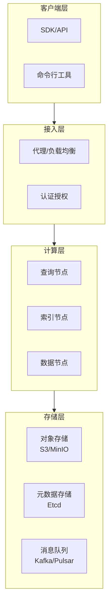
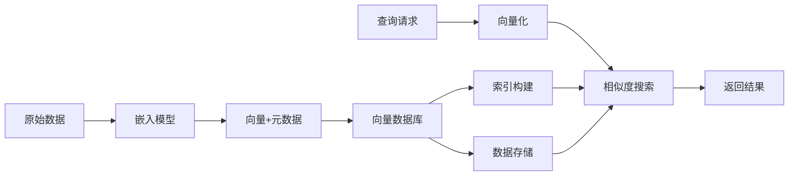
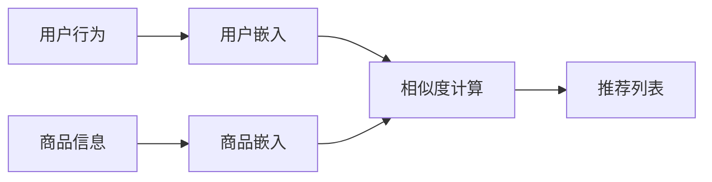
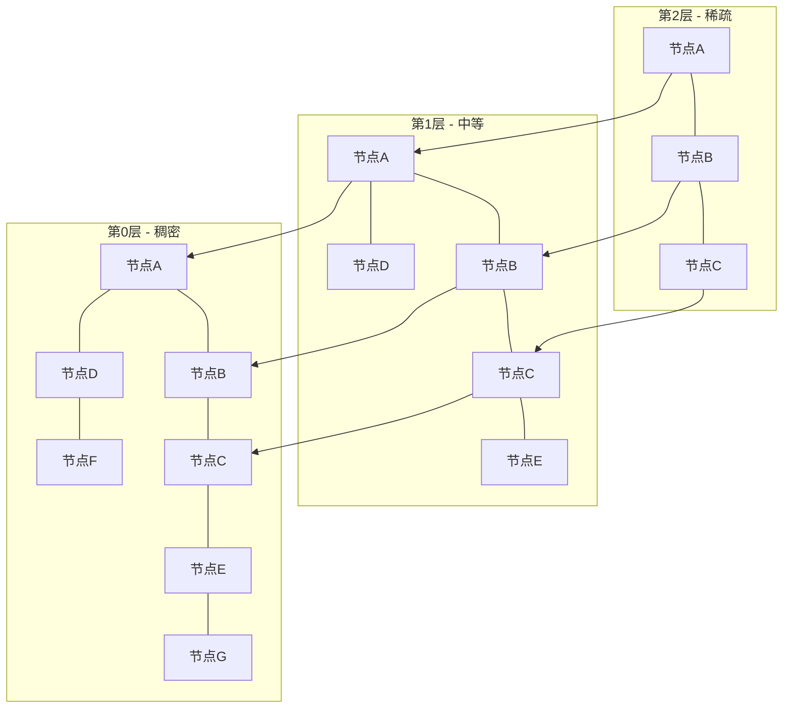
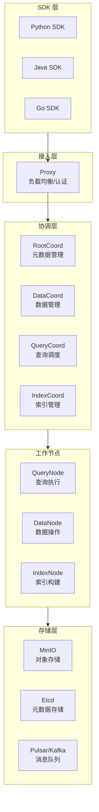
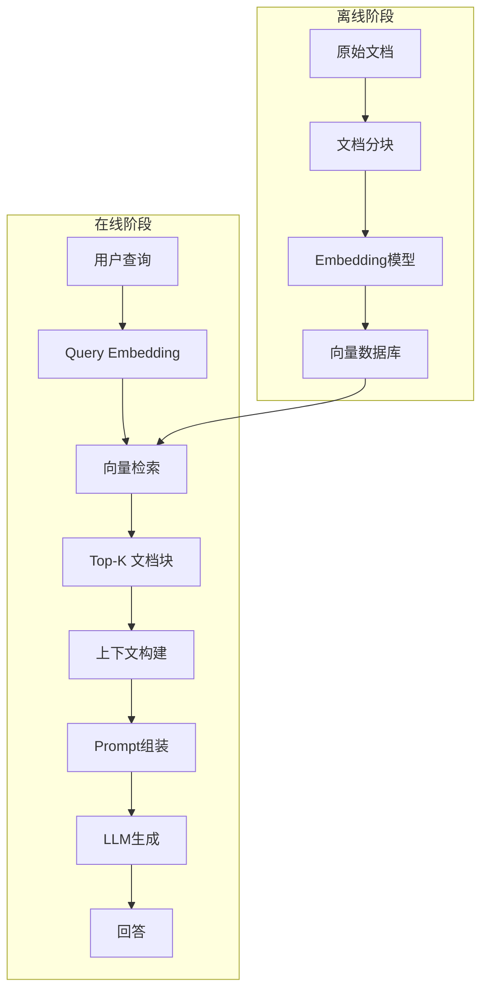
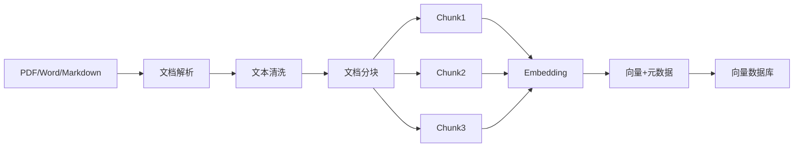
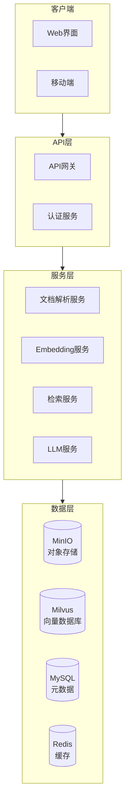

# 📘《向量数据库学习与实战手册》

> 系统学习见下文各章；日常常用 API 与使用场景速查见同目录《常用API与使用场景》。

------

# 第1章：向量数据库基础

------

> **本章在整体中解决什么问题**：向量数据库是 AI 应用的核心基础设施之一。本章介绍**向量数据库的基础概念和原理**，帮助读者理解为什么需要向量数据库以及它的核心价值。学完本章后，**第二章**将深入讲解向量相似度计算方法。

------

## 1.1 什么是向量数据库

### 🧩 核心概念

**向量数据库（Vector Database）** 是专门用于存储、索引和检索高维向量数据的数据库系统。与传统关系型数据库不同，它通过**相似度搜索**而非精确匹配来查询数据。

**为什么需要向量数据库**：

```
传统数据库查询：SELECT * FROM products WHERE id = '123'
向量数据库查询：找到与查询向量最相似的 Top-K 个向量
```

**向量的来源**：
- **文本**：通过 BERT、GPT 等模型转换为向量（如 768 维或 1536 维）
- **图像**：通过 ResNet、ViT 等模型转换为向量
- **音频**：通过 wav2vec 等模型转换为向量
- **多模态**：通过 CLIP 等模型统一表示

### 🧩 向量数据库 vs 传统数据库

| 特性 | 传统数据库（MySQL/PostgreSQL） | 向量数据库（Milvus/Pinecone） |
| ---- | ------------------------------ | ------------------------------ |
| **查询方式** | 精确匹配、范围查询 | 相似度搜索（ANN） |
| **数据类型** | 结构化数据（数字、字符串） | 高维向量（数百至数千维） |
| **索引类型** | B+树、哈希索引 | HNSW、IVF、PQ 等近似索引 |
| **适用场景** | 事务处理、CRUD 操作 | 语义搜索、推荐、RAG |
| **查询语言** | SQL | 专用 API 或类 SQL |

### 🧩 向量数据库的核心能力


**核心能力**：
1. **高维向量存储**：支持 100-10000+ 维的向量存储
2. **近似最近邻搜索（ANN）**：毫秒级返回最相似的 K 个向量
3. **混合查询**：向量相似度 + 元数据过滤
4. **可扩展性**：支持十亿级向量的分布式存储

------

## 1.2 向量数据库的架构

### 🧩 系统架构



**各层职责**：

| 层级 | 组件 | 职责 |
| ---- | ---- | ---- |
| **客户端层** | SDK、CLI、GUI | 提供多语言接口和工具 |
| **接入层** | 代理、网关 | 负载均衡、认证、限流 |
| **计算层** | 查询/索引/数据节点 | 执行查询、构建索引、数据处理 |
| **存储层** | 对象存储、元数据库 | 持久化存储、元数据管理 |

### 🧩 数据流



------

## 1.3 向量数据库的应用场景

### 🧩 场景一：RAG（检索增强生成）


**价值**：
- 解决 LLM 知识时效性问题
- 减少幻觉（Hallucination）
- 提供可追溯的信息来源

**典型应用**：企业知识库、智能客服、文档助手

### 🧩 场景二：语义搜索

**传统搜索 vs 语义搜索**：

| 搜索方式 | 原理 | 示例 |
| -------- | ---- | ---- |
| **关键词搜索** | 精确匹配关键词 | 搜索"苹果"只返回包含"苹果"的文档 |
| **语义搜索** | 理解语义相似性 | 搜索"苹果"返回"iPhone"、"水果"等相关内容 |

**代码示例**：
```python
# 语义搜索流程
query = "如何学习机器学习？"
query_vector = embedding_model.encode(query)

# 在向量数据库中搜索
results = vector_db.search(
    vector=query_vector,
    top_k=10,
    filter={"category": "tutorial"}  # 元数据过滤
)
```

### 🧩 场景三：推荐系统



**应用类型**：
- **内容推荐**：基于用户历史行为推荐相似内容
- **商品推荐**：基于商品属性推荐相似商品
- **音乐/视频推荐**：基于音频/视频特征推荐

### 🧩 场景四：图像/视频检索

**以图搜图流程**：
```python
# 1. 图像向量化
image_vector = resnet_model.encode(image)

# 2. 向量数据库搜索
similar_images = vector_db.search(
    vector=image_vector,
    top_k=10
)

# 3. 返回相似图像
return similar_images
```

**应用场景**：
- 电商：以图搜商品
- 安防：人脸检索
- 医疗：相似病例检索

### 🧩 场景五：异常检测

**原理**：正常数据的向量聚集在一起，异常数据的向量远离聚集中心。

```python
def detect_anomaly(vector, threshold=0.8):
    """异常检测"""
    # 搜索最近的 K 个邻居
    neighbors = vector_db.search(vector, k=5)
    
    # 计算平均相似度
    avg_similarity = sum(n.score for n in neighbors) / len(neighbors)
    
    # 如果相似度低于阈值，判定为异常
    return avg_similarity < threshold
```

------

## 1.4 主流向量数据库概览

### 🧩 分类对比

| 数据库 | 类型 | 特点 | 适用场景 |
| ------ | ---- | ---- | -------- |
| **Milvus** | 开源分布式 | 高性能、云原生、功能丰富 | 大规模生产环境 |
| **Pinecone** | 云服务 | 全托管、易用、自动扩缩容 | 快速上线、无运维团队 |
| **Weaviate** | 开源/云 | 支持 GraphQL、模块化 | 复杂查询、知识图谱 |
| **Chroma** | 开源本地 | 轻量、Python 原生 | 原型开发、小规模应用 |
| **FAISS** | 开源库 | Facebook 开发、高性能 | 嵌入式应用、研究 |
| **Qdrant** | 开源 | Rust 编写、高性能 | 过滤查询、地理位置 |
| **Elasticsearch** | 开源/云 | 成熟生态、全文+向量搜索 | 已有 ES 基础设施 |

### 🧩 选择决策树

```
需要云服务还是本地部署？
├── 云服务
│   ├── 预算充足 → Pinecone
│   └── 需要复杂查询 → Weaviate Cloud
└── 本地部署
    ├── 大规模数据（>100M）→ Milvus
    ├── 中等规模（1M-100M）→ Qdrant / Weaviate
    ├── 小规模（<1M）→ Chroma
    └── 嵌入式/研究 → FAISS
```

------

# ✅ 本章小结

| 知识点 | 面试关键词 | 实际应用 |
| ------ | ---------- | -------- |
| 向量数据库定义 | 高维向量、相似度搜索、ANN | 理解核心概念 |
| 架构设计 | 分层架构、数据流 | 系统选型 |
| 应用场景 | RAG、语义搜索、推荐 | 技术方案设计 |
| 产品选型 | Milvus、Pinecone、Chroma | 根据场景选择 |

------

## ⚠️ 常见坑与注意点

1. **现象**：向量数据库查询结果不准确。**原因**：混淆了精确搜索和近似搜索的区别。**正确做法**：理解 ANN（近似最近邻）的本质，调整索引参数平衡精度和速度。

2. **现象**：向量维度选择困惑。**原因**：不同嵌入模型输出维度不同。**正确做法**：根据嵌入模型确定维度（如 OpenAI text-embedding-ada-002 是 1536 维，BGE 是 1024 维）。

3. **现象**：向量数据库和传统数据库混用困惑。**原因**：不清楚各自适用场景。**正确做法**：结构化数据用传统数据库，语义相似性搜索用向量数据库，两者可以结合使用。

4. **现象**：选型时只关注性能，忽略运维成本。**原因**：未综合考虑总拥有成本。**正确做法**：云服务好维护但成本高，开源方案免费但需要运维投入。

------

**学习要点**：
- 理解向量数据库与传统数据库的本质区别
- 掌握向量数据库的核心能力和应用场景
- 了解主流向量数据库的特点和选型方法
- 理解向量数据库在 AI 应用中的关键作用

------

## 🎯 面试常见追问

| 面试官提问 | 回答思路 |
| ---------- | -------- |
| 什么是向量数据库？有什么特点？ | 高维向量存储 + 相似度搜索 + ANN |
| 向量数据库和传统数据库有什么区别？ | 查询方式 + 数据类型 + 索引类型 + 适用场景 |
| 向量数据库有哪些应用场景？ | RAG + 语义搜索 + 推荐 + 图像检索 |
| 常见的向量数据库有哪些？如何选择？ | Milvus、Pinecone、Chroma 对比 + 选择标准 |
| 向量数据库在 RAG 中起什么作用？ | 存储文档嵌入 + 语义检索 + 上下文构建 |

------

# 第2章：向量相似度计算与索引原理

------

> **本章在整体中解决什么问题**：第一章介绍了向量数据库的概念；本章深入**向量相似度计算方法和索引原理**——这是理解向量数据库工作机制的核心。学完本章后，读者将掌握向量检索的数学基础和算法原理。

------

## 2.1 向量相似度度量方法

### 🧩 为什么需要相似度度量

向量数据库的核心是**找到与查询向量最相似的向量**。相似度度量就是量化这种"相似性"的数学方法。

### 🧩 欧几里得距离（Euclidean Distance）

**定义**：向量空间中两点之间的直线距离。

**公式**：
$$d(x,y) = \sqrt{\sum_{i=1}^{n} (x_i - y_i)^2}$$

**Python 实现**：
```python
import numpy as np

def euclidean_distance(a, b):
    """计算欧几里得距离"""
    return np.sqrt(np.sum((a - b) ** 2))

# 或使用 numpy 内置函数
def euclidean_distance_v2(a, b):
    return np.linalg.norm(a - b)

# 使用示例
vec1 = np.array([1, 2, 3])
vec2 = np.array([4, 5, 6])
dist = euclidean_distance(vec1, vec2)
print(f"欧几里得距离: {dist:.4f}")  # 5.1962
```

**特点**：
- ✅ 计算简单，直观易懂
- ✅ 适合需要考虑向量绝对距离的场景
- ❌ 对向量长度敏感（长向量距离通常更大）
- ❌ 高维空间中区分度下降（维度灾难）

**适用场景**：图像相似度、聚类分析

### 🧩 余弦相似度（Cosine Similarity）

**定义**：两个向量夹角的余弦值，范围 [-1, 1]。

**公式**：
$$cos(x,y) = \frac{x \cdot y}{||x|| \cdot ||y||} = \frac{\sum_{i=1}^{n} x_i y_i}{\sqrt{\sum_{i=1}^{n} x_i^2} \cdot \sqrt{\sum_{i=1}^{n} y_i^2}}$$

**Python 实现**：
```python
def cosine_similarity(a, b):
    """计算余弦相似度"""
    dot_product = np.dot(a, b)
    norm_a = np.linalg.norm(a)
    norm_b = np.linalg.norm(b)
    return dot_product / (norm_a * norm_b)

# 使用示例
vec1 = np.array([1, 2, 3])
vec2 = np.array([2, 4, 6])  # vec1 的 2 倍
sim = cosine_similarity(vec1, vec2)
print(f"余弦相似度: {sim:.4f}")  # 1.0（完全相似）
```

**特点**：
- ✅ 不受向量长度影响，只关注方向
- ✅ 适合文本相似度（文本长度差异大）
- ✅ 计算效率高（可预先计算归一化向量）
- ❌ 不考虑向量绝对大小

**适用场景**：文本语义相似度、文档检索（最常用）

### 🧩 点积（Dot Product）

**定义**：两个向量对应元素相乘后求和。

**公式**：
$$x \cdot y = \sum_{i=1}^{n} x_i y_i$$

**Python 实现**：
```python
def dot_product(a, b):
    """计算点积"""
    return np.dot(a, b)

# 使用示例
vec1 = np.array([1, 2, 3])
vec2 = np.array([4, 5, 6])
dot = dot_product(vec1, vec2)
print(f"点积: {dot}")  # 32
```

**特点**：
- ✅ 计算最快（无需开方、除法）
- ❌ 受向量长度影响（长向量点积通常更大）
- ❌ 值范围无界，难以解释

**适用场景**：需要极致性能的场景（配合归一化向量使用）

### 🧩 曼哈顿距离（Manhattan Distance）

**定义**：向量空间中两点之间的城市街区距离（L1 范数）。

**公式**：
$$d(x,y) = \sum_{i=1}^{n} |x_i - y_i|$$

**Python 实现**：
```python
def manhattan_distance(a, b):
    """计算曼哈顿距离"""
    return np.sum(np.abs(a - b))

# 使用示例
vec1 = np.array([1, 2, 3])
vec2 = np.array([4, 5, 6])
dist = manhattan_distance(vec1, vec2)
print(f"曼哈顿距离: {dist}")  # 9
```

**特点**：
- ✅ 对异常值不敏感
- ✅ 计算速度快
- ❌ 高维空间中区分度有限

**适用场景**：稀疏向量、异常检测

### 🧩 相似度度量对比总结

| 度量方法 | 公式 | 值域 | 特点 | 最常用场景 |
| -------- | ---- | ---- | ---- | ---------- |
| **欧几里得距离** | $\sqrt{\sum (x_i - y_i)^2}$ | $[0, +\infty)$ | 直观，对长度敏感 | 图像相似度 |
| **余弦相似度** | $\frac{x \cdot y}{\|x\| \|y\|}$ | $[-1, 1]$ | 不受长度影响 | **文本语义搜索** |
| **点积** | $\sum x_i y_i$ | $(-\infty, +\infty)$ | 计算最快 | 性能优先场景 |
| **曼哈顿距离** | $\sum \|x_i - y_i\|$ | $[0, +\infty)$ | 对异常值鲁棒 | 稀疏向量 |

### 🧩 选择建议

```python
# 文本语义搜索 → 余弦相似度
# 图像相似度 → 欧几里得距离或余弦相似度
# 性能优先 → 点积（配合归一化）
# 稀疏向量 → 曼哈顿距离
```

------

## 2.2 向量索引原理

### 🧩 为什么需要索引

**问题**：在 1000 万个 768 维向量中查找最相似的 10 个，暴力搜索需要多长时间？

```
计算量 = 10,000,000 × 768 ≈ 76.8 亿次运算
在 CPU 上可能需要数秒到数十秒
```

**解决方案**：使用近似最近邻（ANN）索引，将时间复杂度从 O(N) 降低到 O(log N) 或 O(1)。

### 🧩 暴力搜索（Flat/Exact Search）

**原理**：计算查询向量与所有向量的相似度，返回最相似的 K 个。

```python
def brute_force_search(query, vectors, k=10):
    """暴力搜索"""
    scores = []
    for i, vec in enumerate(vectors):
        sim = cosine_similarity(query, vec)
        scores.append((i, sim))
    
    # 按相似度排序，返回 Top-K
    scores.sort(key=lambda x: x[1], reverse=True)
    return scores[:k]
```

**特点**：
- ✅ 结果 100% 准确
- ❌ 时间复杂度 O(N)，数据量大时无法接受

**适用场景**：
- 数据量小（< 10,000）
- 对精度要求极高的场景
- 作为基准评估其他索引的召回率

### 🧩 基于树的索引

#### KD-Tree（K-Dimensional Tree）

**原理**：递归地将向量空间划分为超矩形区域。

```
构建过程（以 2D 为例）：
1. 选择 x 轴，按中位数划分
2. 左子树选择 y 轴，按中位数划分
3. 右子树选择 y 轴，按中位数划分
4. 递归直到节点包含的向量数少于阈值
```

**特点**：
- ✅ 构建简单
- ✅ 低维数据查询快
- ❌ 高维数据性能急剧下降（维度灾难）

**适用场景**：低维数据（< 20 维）

#### Ball Tree

**原理**：将向量空间划分为嵌套的超球体。

**特点**：
- ✅ 在高维空间中性能优于 KD-Tree
- ❌ 构建复杂，仍受维度影响

**适用场景**：中低维数据

### 🧩 基于图的索引（HNSW）

#### HNSW（Hierarchical Navigable Small World）

**原理**：构建多层图结构，每层都是 Navigable Small World 图。



**搜索过程**：
1. 从顶层稀疏图开始，找到最近邻的入口点
2. 逐层下降，在当前层找到最近邻
3. 在最底层（稠密图）进行精确搜索

**关键参数**：

| 参数 | 说明 | 推荐值 |
| ---- | ---- | ------ |
| **M** | 每个节点的最大连接数 | 8-32（默认 16） |
| **efConstruction** | 构建时的搜索范围 | 100-300（默认 200） |
| **ef** | 查询时的搜索范围 | 与 top-k 相关，通常是 2-10 倍 |

**Python 示例**：
```python
import hnswlib

# 创建 HNSW 索引
dim = 768  # 向量维度
num_elements = 1000000  # 向量数量

# 初始化索引
index = hnswlib.Index(space='cosine', dim=dim)
index.init_index(
    max_elements=num_elements,
    ef_construction=200,  # 构建参数
    M=16                  # 连接数
)

# 添加向量
index.add_items(vectors, ids)

# 设置查询参数
index.set_ef(50)  # 查询时的搜索范围

# 搜索
labels, distances = index.knn_query(query_vector, k=10)
```

**特点**：
- ✅ 高维数据性能优异
- ✅ 搜索速度快，准确率高
- ❌ 内存消耗大（需要存储图结构）
- ❌ 构建时间较长

**适用场景**：大规模高维数据（最常用）

### 🧩 基于量化的索引

#### PQ（Product Quantization）

**原理**：将高维向量分解为多个子向量，对每个子向量进行量化（聚类）。

```
原始向量（768维）→ 分解为 8 个子向量（每个96维）
                    ↓
                  每个子向量用聚类中心 ID 表示（如 8 位）
                    ↓
                  压缩后的表示：8 个字节
```

**压缩比**：
- 原始：768 维 × 4 字节 = 3072 字节
- 压缩后：8 字节
- 压缩比：384:1

**特点**：
- ✅ 内存占用极小
- ✅ 适合超大规模数据
- ❌ 准确率低于 HNSW
- ❌ 查询速度较慢

**适用场景**：内存受限、超大规模数据（十亿级）

#### IVF（Inverted File Index）

**原理**：将向量空间划分为多个聚类（Voronoi 单元），查询时只在最近的几个聚类中搜索。

```
构建过程：
1. 使用 K-Means 将向量聚为 K 个中心
2. 每个向量归属于最近的中心
3. 建立倒排索引：中心 → 向量列表

查询过程：
1. 找到查询向量最近的 nprobe 个中心
2. 只在这些中心对应的向量中搜索
```

**关键参数**：

| 参数 | 说明 | 推荐值 |
| ---- | ---- | ------ |
| **nlist** | 聚类中心数 | 4×sqrt(N) |
| **nprobe** | 查询时搜索的聚类数 | 10-100 |

**特点**：
- ✅ 内存占用适中
- ✅ 构建速度快
- ❌ 准确率受聚类质量影响

**适用场景**：大规模数据，需要平衡内存和性能

### 🧩 混合索引

#### IVF-HNSW

**原理**：使用 IVF 进行粗粒度过滤，使用 HNSW 在候选集中精确搜索。

**优势**：
- IVF 快速过滤大部分不相关向量
- HNSW 在候选集中提供高精度搜索
- 平衡了速度和准确率

#### IVF-PQ

**原理**：IVF 进行粗粒度过滤，PQ 压缩向量减少内存占用。

**优势**：
- 内存占用最小
- 适合超大规模数据

### 🧩 索引类型选择决策

| 数据规模 | 内存限制 | 推荐索引 | 理由 |
| -------- | -------- | -------- | ---- |
| < 10K | 无限制 | Flat | 精确搜索，简单 |
| 10K - 100K | 无限制 | HNSW | 速度快，精度高 |
| 100K - 1M | 无限制 | HNSW | 性能优异 |
| 100K - 1M | 有限 | IVF | 平衡内存和性能 |
| 1M - 100M | 有限 | IVF-HNSW | 平衡速度和精度 |
| > 100M | 严格 | IVF-PQ | 内存占用最小 |

------

# ✅ 本章小结

| 知识点 | 面试关键词 | 实际应用 |
| ------ | ---------- | -------- |
| 相似度度量 | 欧几里得、余弦、点积、曼哈顿 | 选择合适的度量方法 |
| 索引原理 | Flat、HNSW、IVF、PQ | 根据场景选择索引 |
| HNSW 参数 | M、efConstruction、ef | 调优索引性能 |
| 索引选择 | 数据规模、内存、精度要求 | 索引选型 |

------

## ⚠️ 常见坑与注意点

1. **现象**：余弦相似度和欧几里得距离结果不一致。**原因**：两者衡量的是不同的相似性概念。**正确做法**：文本搜索用余弦相似度，需要考虑绝对距离的用欧几里得距离。

2. **现象**：HNSW 索引查询速度慢。**原因**：ef 参数设置过小，搜索范围不够。**正确做法**：ef 应该设置为 top-k 的 2-10 倍，根据精度要求调整。

3. **现象**：IVF 索引召回率低。**原因**：nprobe 参数过小，只搜索了少数聚类。**正确做法**：增大 nprobe，搜索更多聚类，平衡速度和召回率。

4. **现象**：向量数据库内存占用过大。**原因**：使用了 HNSW 索引且数据量大。**正确做法**：考虑使用 PQ 或 IVF-PQ 索引减少内存占用。

5. **现象**：索引构建时间过长。**原因**：HNSW 的 efConstruction 设置过大。**正确做法**：根据数据规模和精度要求调整 efConstruction，不必一味追求大值。

------

**学习要点**：
- 掌握常见的向量相似度度量方法及其适用场景
- 理解不同索引类型的原理和特点
- 学会根据数据规模和性能要求选择合适的索引
- 掌握 HNSW、IVF、PQ 等主流索引的参数调优

------

## 🎯 面试常见追问

| 面试官提问 | 回答思路 |
| ---------- | -------- |
| 常见的向量相似度度量有哪些？ | 欧几里得 + 余弦 + 点积 + 曼哈顿 + 适用场景 |
| 余弦相似度和欧几里得距离有什么区别？ | 是否受向量长度影响 + 适用场景 |
| 什么是 HNSW？有什么特点？ | 分层图索引 + 速度快 + 精度高 + 内存大 |
| 如何选择向量索引类型？ | 数据规模 + 内存限制 + 精度要求 |
| IVF 和 HNSW 有什么区别？ | 聚类 vs 图 + 内存 vs 速度 + 适用场景 |

------

------

# 第3章：Milvus 向量数据库实战

------

> **本章在整体中解决什么问题**：前两章介绍了向量数据库的基础理论和相似度计算；本章深入**Milvus——最流行的开源分布式向量数据库**，帮助读者掌握企业级向量数据库的实战技能。学完本章后，读者将能够独立部署和使用 Milvus 构建生产级应用。

------

## 3.1 Milvus 概述

### 🧩 什么是 Milvus

**Milvus** 是一款开源的分布式向量数据库，专为大规模向量相似度搜索而设计。由 Zilliz 公司开发并开源，是 LF AI & Data 基金会的孵化项目。

**核心特性**：
- **高性能**：十亿级向量的毫秒级搜索
- **分布式**：支持水平扩展，可处理海量数据
- **云原生**：基于 Kubernetes 的容器化部署
- **多索引类型**：支持 HNSW、IVF、PQ 等多种索引
- **多语言 SDK**：Python、Java、Go、Node.js 等

### 🧩 Milvus 架构



**组件职责**：

| 组件 | 职责 | 说明 |
| ---- | ---- | ---- |
| **Proxy** | 接入层 | 接收请求、负载均衡、鉴权 |
| **RootCoord** | 元数据管理 | 管理 Collection、Partition 等元数据 |
| **DataCoord** | 数据管理 | 管理数据分布、数据清理 |
| **QueryCoord** | 查询调度 | 调度查询请求到 QueryNode |
| **IndexCoord** | 索引管理 | 管理索引构建任务 |
| **QueryNode** | 查询执行 | 执行向量搜索 |
| **DataNode** | 数据操作 | 处理数据插入、删除 |
| **IndexNode** | 索引构建 | 异步构建索引 |

------

## 3.2 Milvus 部署

### 🧩 部署方式选择

| 部署方式 | 适用场景 | 复杂度 | 资源需求 |
| -------- | -------- | ------ | -------- |
| **Milvus Lite** | 本地开发、测试 | 低 | 单机 |
| **Docker Compose** | 小规模生产、POC | 中 | 单机/多机 |
| **Kubernetes** | 大规模生产 | 高 | K8s 集群 |
| **Zilliz Cloud** | 无运维团队 | 极低 | 云服务 |

### 🧩 Docker Compose 部署（推荐）

**步骤 1：下载配置文件**
```bash
# 下载 docker-compose 配置文件
wget https://github.com/milvus-io/milvus/releases/download/v2.3.3/milvus-standalone-docker-compose.yml -O docker-compose.yml

# 或者使用 curl
curl -L https://github.com/milvus-io/milvus/releases/download/v2.3.3/milvus-standalone-docker-compose.yml -o docker-compose.yml
```

**步骤 2：启动服务**
```bash
# 启动 Milvus
docker-compose up -d

# 查看服务状态
docker-compose ps

# 查看日志
docker-compose logs -f milvus-standalone
```

**步骤 3：验证部署**
```bash
# 检查端口
netstat -tunlp | grep 19530

# Milvus 默认端口：19530（gRPC）、9091（HTTP）
```

### 🧩 Kubernetes 部署（生产环境）

**使用 Milvus Operator**：
```bash
# 安装 Milvus Operator
kubectl apply -f https://raw.githubusercontent.com/zilliztech/milvus-operator/main/deploy/manifests/deployment.yaml

# 创建 Milvus 集群
cat <<EOF | kubectl apply -f -
apiVersion: milvus.io/v1beta1
kind: Milvus
metadata:
  name: my-milvus
spec:
  mode: cluster
  components:
    proxy:
      replicas: 2
    queryNode:
      replicas: 3
    dataNode:
      replicas: 2
    indexNode:
      replicas: 2
  dependencies:
    etcd:
      inCluster:
        values:
          replicaCount: 3
    minio:
      inCluster:
        values:
          mode: distributed
          replicas: 4
    pulsar:
      inCluster:
        values:
          components:
            zookeeper:
              replicaCount: 3
            bookkeeper:
              replicaCount: 3
            broker:
              replicaCount: 3
EOF
```

------

## 3.3 Milvus 核心概念

### 🧩 数据模型

```mermaid
flowchart TB
    Database[(Database)] --> Collection1[Collection: articles]
    Database --> Collection2[Collection: images]
    
    Collection1 --> Partition1[Partition: _default]
    Collection1 --> Partition2[Partition: 2024]
    Collection1 --> Partition3[Partition: 2023]
    
    Partition1 --> Entity1[Entity: id=1, vector=[...], title=...]
    Partition1 --> Entity2[Entity: id=2, vector=[...], title=...]
```

**概念层级**：

| 概念 | 类比（关系型数据库） | 说明 |
| ---- | -------------------- | ---- |
| **Database** | Database | 逻辑数据库，用于权限隔离 |
| **Collection** | Table | 表，包含一组向量数据 |
| **Partition** | Partition | 分区，用于数据管理和查询优化 |
| **Entity** | Row | 一条记录，包含向量和标量字段 |
| **Field** | Column | 字段，可以是向量或标量 |

### 🧩 字段类型

**向量字段**：
- `FLOAT_VECTOR`：浮点向量（最常用）
- `BINARY_VECTOR`：二进制向量

**标量字段**：
- `INT8/INT16/INT32/INT64`：整数
- `FLOAT/DOUBLE`：浮点数
- `VARCHAR`：字符串
- `BOOL`：布尔值
- `JSON`：JSON 数据

------

## 3.4 Milvus Python SDK 实战

### 🧩 环境准备

```bash
# 安装 pymilvus
pip install pymilvus

# 验证安装
python -c "from pymilvus import connections; print('安装成功')"
```

### 🧩 完整 CRUD 示例

```python
from pymilvus import connections, FieldSchema, CollectionSchema, DataType, Collection, utility
import numpy as np

class MilvusClient:
    """Milvus 客户端封装"""
    
    def __init__(self, host='localhost', port='19530'):
        """初始化连接"""
        connections.connect(
            alias="default",
            host=host,
            port=port
        )
        print(f"✅ 已连接到 Milvus: {host}:{port}")
    
    def create_collection(self, collection_name, dim=768):
        """创建 Collection"""
        # 1. 定义字段
        fields = [
            FieldSchema(
                name="id",
                dtype=DataType.INT64,
                is_primary=True,
                auto_id=True
            ),
            FieldSchema(
                name="vector",
                dtype=DataType.FLOAT_VECTOR,
                dim=dim
            ),
            FieldSchema(
                name="title",
                dtype=DataType.VARCHAR,
                max_length=512
            ),
            FieldSchema(
                name="category",
                dtype=DataType.VARCHAR,
                max_length=64
            ),
            FieldSchema(
                name="timestamp",
                dtype=DataType.INT64
            )
        ]
        
        # 2. 创建 Schema
        schema = CollectionSchema(
            fields=fields,
            description="文档向量库"
        )
        
        # 3. 创建 Collection
        collection = Collection(
            name=collection_name,
            schema=schema
        )
        
        print(f"✅ 创建 Collection: {collection_name}")
        return collection
    
    def create_index(self, collection_name, index_type="HNSW"):
        """创建索引"""
        collection = Collection(collection_name)
        
        # 索引参数配置
        index_params = {
            "index_type": index_type,
            "metric_type": "COSINE",  # 或 L2、IP
            "params": {}
        }
        
        if index_type == "HNSW":
            index_params["params"] = {
                "M": 16,              # 连接数
                "efConstruction": 200  # 构建搜索范围
            }
        elif index_type == "IVF_FLAT":
            index_params["params"] = {
                "nlist": 128  # 聚类中心数
            }
        
        # 创建索引
        collection.create_index(
            field_name="vector",
            index_params=index_params
        )
        
        print(f"✅ 创建 {index_type} 索引")
    
    def insert_data(self, collection_name, data):
        """插入数据"""
        collection = Collection(collection_name)
        
        # 准备数据
        entities = [
            data["vectors"],      # vector 字段
            data["titles"],       # title 字段
            data["categories"],   # category 字段
            data["timestamps"]    # timestamp 字段
        ]
        
        # 插入
        insert_result = collection.insert(entities)
        
        print(f"✅ 插入 {len(data['vectors'])} 条数据")
        return insert_result.primary_keys
    
    def search(self, collection_name, query_vector, top_k=10, filters=None):
        """向量搜索"""
        collection = Collection(collection_name)
        collection.load()
        
        # 搜索参数
        search_params = {
            "metric_type": "COSINE",
            "params": {"ef": 64}  # HNSW 查询参数
        }
        
        # 执行搜索
        results = collection.search(
            data=[query_vector],
            anns_field="vector",
            param=search_params,
            limit=top_k,
            expr=filters,  # 过滤条件
            output_fields=["title", "category", "timestamp"]
        )
        
        # 格式化结果
        formatted_results = []
        for hits in results:
            for hit in hits:
                formatted_results.append({
                    "id": hit.id,
                    "distance": hit.distance,
                    "title": hit.entity.get("title"),
                    "category": hit.entity.get("category"),
                    "timestamp": hit.entity.get("timestamp")
                })
        
        return formatted_results
    
    def hybrid_search(self, collection_name, query_vector, filter_expr, top_k=10):
        """混合搜索（向量 + 标量过滤）"""
        return self.search(
            collection_name=collection_name,
            query_vector=query_vector,
            top_k=top_k,
            filters=filter_expr
        )
    
    def delete_entities(self, collection_name, expr):
        """删除数据"""
        collection = Collection(collection_name)
        collection.delete(expr)
        print(f"✅ 删除满足条件的数据: {expr}")
    
    def drop_collection(self, collection_name):
        """删除 Collection"""
        utility.drop_collection(collection_name)
        print(f"✅ 删除 Collection: {collection_name}")
    
    def get_collection_stats(self, collection_name):
        """获取统计信息"""
        collection = Collection(collection_name)
        return {
            "row_count": collection.num_entities,
            "partitions": [p.name for p in collection.partitions]
        }


# ==================== 使用示例 ====================

if __name__ == "__main__":
    # 1. 初始化客户端
    client = MilvusClient()
    
    collection_name = "documents"
    
    # 2. 创建 Collection（如果不存在）
    if not utility.has_collection(collection_name):
        client.create_collection(collection_name, dim=768)
        client.create_index(collection_name, index_type="HNSW")
    
    # 3. 准备测试数据
    num_entities = 1000
    np.random.seed(42)
    
    data = {
        "vectors": np.random.random((num_entities, 768)).tolist(),
        "titles": [f"文档_{i}" for i in range(num_entities)],
        "categories": ["tech" if i % 2 == 0 else "business" for i in range(num_entities)],
        "timestamps": [1700000000 + i for i in range(num_entities)]
    }
    
    # 4. 插入数据
    client.insert_data(collection_name, data)
    
    # 5. 执行搜索
    query_vector = np.random.random(768).tolist()
    results = client.search(
        collection_name=collection_name,
        query_vector=query_vector,
        top_k=5,
        filters='category == "tech"'  # 只搜索 tech 类别
    )
    
    print("\n🔍 搜索结果:")
    for r in results:
        print(f"  ID: {r['id']}, 距离: {r['distance']:.4f}, 标题: {r['title']}")
    
    # 6. 获取统计信息
    stats = client.get_collection_stats(collection_name)
    print(f"\n📊 Collection 统计: {stats}")
```

### 🧩 高级功能

**1. 分区管理**
```python
def create_partition(self, collection_name, partition_name):
    """创建分区"""
    collection = Collection(collection_name)
    collection.create_partition(partition_name)
    print(f"✅ 创建分区: {partition_name}")

def search_in_partition(self, collection_name, partition_name, query_vector, top_k=10):
    """在指定分区中搜索"""
    collection = Collection(collection_name)
    partition = collection.partition(partition_name)
    
    results = partition.search(
        data=[query_vector],
        anns_field="vector",
        param={"metric_type": "COSINE", "params": {"ef": 64}},
        limit=top_k
    )
    return results
```

**2. 批量操作**
```python
def batch_insert(self, collection_name, data_list, batch_size=1000):
    """批量插入"""
    for i in range(0, len(data_list), batch_size):
        batch = data_list[i:i+batch_size]
        self.insert_data(collection_name, batch)
        print(f"✅ 已插入批次 {i//batch_size + 1}")
```

**3. 数据导入导出**
```python
def export_data(self, collection_name, output_file):
    """导出数据"""
    collection = Collection(collection_name)
    collection.load()
    
    # 查询所有数据
    results = collection.query(
        expr="id >= 0",
        output_fields=["id", "vector", "title", "category"]
    )
    
    # 保存到文件
    import json
    with open(output_file, 'w') as f:
        json.dump(results, f)
    
    print(f"✅ 导出 {len(results)} 条数据到 {output_file}")
```

------

## 3.5 Milvus 性能优化

### 🧩 索引优化

| 索引类型 | 适用场景 | 内存占用 | 查询速度 | 召回率 |
| -------- | -------- | -------- | -------- | ------ |
| **FLAT** | < 10K 数据 | 低 | 慢 | 100% |
| **IVF_FLAT** | 中等规模 | 中 | 快 | 高 |
| **IVF_SQ8** | 内存受限 | 低 | 快 | 中 |
| **IVF_PQ** | 超大规模 | 极低 | 较快 | 中 |
| **HNSW** | 高性能需求 | 高 | 最快 | 高 |
| **ANNOY** | 低维数据 | 中 | 快 | 中 |

### 🧩 参数调优建议

**HNSW 调优**：
```python
# 高精度场景
index_params = {
    "M": 32,                # 增大连接数
    "efConstruction": 400   # 增大构建搜索范围
}
search_params = {
    "ef": 128               # 增大查询搜索范围
}

# 高速度场景
index_params = {
    "M": 8,                 # 减小连接数
    "efConstruction": 100   # 减小构建搜索范围
}
search_params = {
    "ef": 32               # 减小查询搜索范围
}
```

**IVF 调优**：
```python
# nlist 选择（聚类中心数）
# 经验公式：nlist = 4 * sqrt(N)
# N = 100万 → nlist ≈ 4000

index_params = {
    "nlist": 4096
}

# nprobe 选择（查询时搜索的聚类数）
# 经验值：nprobe = nlist / 10 ~ nlist / 100
search_params = {
    "nprobe": 128  # 平衡速度和召回率
}
```

### 🧩 系统级优化

**1. 数据分区**
```python
# 按时间分区，提高查询效率
collection.create_partition("2024_q1")
collection.create_partition("2024_q2")
# 查询时指定分区
partition = collection.partition("2024_q1")
```

**2. 预加载**
```python
# 将 Collection 加载到内存
collection.load()

# 查询完成后可以释放
collection.release()
```

**3. 批量查询**
```python
# 单次查询多个向量
results = collection.search(
    data=[vector1, vector2, vector3],  # 批量查询
    anns_field="vector",
    param=search_params,
    limit=top_k
)
```

------

# ✅ 本章小结

| 知识点 | 面试关键词 | 实际应用 |
| ------ | ---------- | -------- |
| Milvus 架构 | Proxy、Coord、Node、Storage | 理解系统组件 |
| 部署方式 | Docker、K8s、Milvus Lite | 根据场景选择 |
| 核心概念 | Collection、Partition、Entity | 数据建模 |
| Python SDK | CRUD、搜索、索引 | 开发实战 |
| 性能优化 | 索引选择、参数调优 | 系统优化 |

------

## ⚠️ 常见坑与注意点

1. **现象**：Milvus 启动失败。**原因**：依赖服务（Etcd、MinIO）未启动或配置错误。**正确做法**：使用 docker-compose 确保所有依赖服务正确启动，检查端口冲突。

2. **现象**：搜索返回空结果。**原因**：Collection 未加载到内存，或未创建索引。**正确做法**：搜索前调用 `collection.load()`，确保已创建索引。

3. **现象**：插入数据后查询不到。**原因**：Milvus 是异步写入，数据可能还在缓冲区。**正确做法**：调用 `collection.flush()` 强制刷新，或等待自动刷新。

4. **现象**：内存占用过高。**原因**：加载了过多 Collection 或数据量过大。**正确做法**：及时释放不需要的 Collection，使用分区管理数据，考虑使用 IVF_PQ 索引。

5. **现象**：索引构建时间过长。**原因**：数据量大且 efConstruction 设置过大。**正确做法**：根据数据量调整参数，考虑使用 IndexNode 集群并行构建。

------

**学习要点**：
- 理解 Milvus 的架构和组件职责
- 掌握 Docker 和 K8s 部署方法
- 熟练使用 Python SDK 进行 CRUD 操作
- 学会根据场景选择合适的索引类型
- 掌握性能优化的方法和参数调优技巧

------

## 🎯 面试常见追问

| 面试官提问 | 回答思路 |
| ---------- | -------- |
| Milvus 的架构是什么样的？ | Proxy + Coord + Node + Storage 分层架构 |
| 如何选择 Milvus 的索引类型？ | 数据规模 + 内存限制 + 精度要求 |
| Milvus 和 Pinecone 有什么区别？ | 开源 vs 云服务 + 部署方式 + 运维成本 |
| 如何优化 Milvus 的查询性能？ | 索引选择 + 参数调优 + 分区 + 批量查询 |
| Milvus 的数据模型是怎样的？ | Database → Collection → Partition → Entity |

------

# 第4章：其他主流向量数据库

------

> **本章在整体中解决什么问题**：第三章详细介绍了 Milvus；本章介绍**其他主流向量数据库**——包括云服务和开源方案，帮助读者根据场景选择合适的产品。学完本章后，读者将具备全面对比和选型能力。

------

## 4.1 云服务平台

### 🧩 Pinecone

**产品定位**：全托管的向量数据库云服务

**核心特点**：
- ✅ 零运维，自动扩缩容
- ✅ 高可用性（99.9% SLA）
- ✅ 多区域部署
- ✅ 支持元数据过滤和混合搜索

**使用示例**：
```python
import pinecone

# 初始化
pinecone.init(api_key="your-api-key", environment="us-west1-gcp")

# 创建索引
pinecone.create_index(
    name="my-index",
    dimension=1536,
    metric="cosine"
)

# 连接索引
index = pinecone.Index("my-index")

# 插入数据
index.upsert([
    ("id1", [0.1, 0.2, ...], {"category": "tech"}),
    ("id2", [0.3, 0.4, ...], {"category": "business"})
])

# 查询
results = index.query(
    vector=[0.1, 0.2, ...],
    top_k=10,
    filter={"category": {"$eq": "tech"}}
)
```

**定价模式**：
- 按存储的向量数量和查询次数收费
- 免费版：支持 10 万向量
- 付费版：$0.10/千次查询

**适用场景**：
- 无运维团队
- 快速上线
- 对可用性要求高的生产环境

### 🧩 Weaviate

**产品定位**：开源向量搜索引擎，支持模块化 AI 集成

**核心特点**：
- ✅ 支持 GraphQL 查询
- ✅ 内置向量化模块（可选）
- ✅ 多模态支持（文本、图像）
- ✅ 支持向量 + BM25 混合搜索

**部署方式**：
```bash
# Docker 部署
docker-compose up -d weaviate
```

**使用示例**：
```python
import weaviate

# 连接
client = weaviate.Client("http://localhost:8080")

# 定义 Schema
schema = {
    "class": "Article",
    "vectorizer": "text2vec-transformers",
    "properties": [
        {"name": "title", "dataType": ["text"]},
        {"name": "content", "dataType": ["text"]}
    ]
}
client.schema.create_class(schema)

# 插入数据（自动向量化）
client.data_object.create({
    "title": "Hello World",
    "content": "This is a test article"
}, "Article")

# GraphQL 查询
query = """
{
  Get {
    Article(
      nearText: {concepts: ["machine learning"]}
      limit: 5
    ) {
      title
      content
    }
  }
}"""
results = client.query.raw(query)
```

**适用场景**：
- 需要 GraphQL 接口
- 希望自动向量化
- 知识图谱应用

### 🧩 其他云服务

| 服务 | 提供商 | 特点 | 适用场景 |
| ---- | ------ | ---- | -------- |
| **Azure AI Search** | Microsoft | 与 Azure 生态集成 | 已有 Azure 基础设施 |
| **Vertex AI Vector Search** | Google Cloud | 与 GCP ML 服务集成 | GCP 用户 |
| **Amazon Kendra** | AWS | 企业级搜索服务 | AWS 用户 |
| **Alibaba Cloud Vector Search** | 阿里云 | 国内服务 | 国内用户 |

------

## 4.2 开源本地方案

### 🧩 Chroma

**产品定位**：轻量级、开发者友好的向量数据库

**核心特点**：
- ✅ 纯 Python，安装简单
- ✅ 支持内存和持久化存储
- ✅ 与 LangChain 深度集成
- ✅ 适合快速原型开发

**使用示例**：
```python
import chromadb
from chromadb.config import Settings

# 创建客户端
client = chromadb.Client(Settings(
    chroma_db_impl="duckdb+parquet",
    persist_directory="./chroma_db"
))

# 创建 Collection
collection = client.create_collection(name="my_collection")

# 添加文档
collection.add(
    documents=["This is a document", "This is another document"],
    metadatas=[{"source": "my_source"}, {"source": "my_source"}],
    ids=["id1", "id2"]
)

# 查询
results = collection.query(
    query_texts=["This is a query document"],
    n_results=2
)
```

**适用场景**：
- 快速原型开发
- 小型应用（< 100K 向量）
- 与 LangChain 配合使用

### 🧩 Qdrant

**产品定位**：高性能开源向量数据库，Rust 编写

**核心特点**：
- ✅ 高性能（Rust 实现）
- ✅ 丰富的过滤能力
- ✅ 支持地理位置搜索
- ✅ 支持向量量化

**部署方式**：
```bash
docker run -p 6333:6333 qdrant/qdrant
```

**使用示例**：
```python
from qdrant_client import QdrantClient
from qdrant_client.models import Distance, VectorParams

# 连接
client = QdrantClient(host="localhost", port=6333)

# 创建 Collection
client.create_collection(
    collection_name="my_collection",
    vectors_config=VectorParams(size=768, distance=Distance.COSINE)
)

# 插入数据
client.upsert(
    collection_name="my_collection",
    points=[
        PointStruct(
            id=1,
            vector=[0.1, 0.2, ...],
            payload={"category": "tech"}
        )
    ]
)

# 搜索
results = client.search(
    collection_name="my_collection",
    query_vector=[0.1, 0.2, ...],
    query_filter=Filter(
        must=[FieldCondition(key="category", match=MatchValue(value="tech"))]
    ),
    limit=10
)
```

**适用场景**：
- 需要高性能过滤查询
- 地理位置搜索需求
- 对 Rust 生态有偏好

### 🧩 FAISS

**产品定位**：Facebook 开发的向量搜索库

**核心特点**：
- ✅ C++ 实现，性能极高
- ✅ 支持 GPU 加速
- ✅ 多种索引算法
- ✅ 适合嵌入式应用

**使用示例**：
```python
import faiss
import numpy as np

# 创建索引
dimension = 768
index = faiss.IndexFlatIP(dimension)  # 内积（余弦相似度）

# 或使用 HNSW
# index = faiss.IndexHNSWFlat(dimension, 32)

# 添加向量
vectors = np.random.random((10000, dimension)).astype('float32')
index.add(vectors)

# 搜索
query = np.random.random((1, dimension)).astype('float32')
distances, indices = index.search(query, k=10)

print(f"最近邻索引: {indices[0]}")
print(f"距离: {distances[0]}")
```

**适用场景**：
- 研究实验
- 嵌入式应用
- 需要极致性能
- 离线批量搜索

### 🧩 Elasticsearch

**产品定位**：分布式搜索引擎，8.0+ 支持向量搜索

**核心特点**：
- ✅ 成熟的搜索生态
- ✅ 同时支持全文和向量搜索
- ✅ 强大的聚合分析能力
- ✅ 企业级功能丰富

**使用示例**：
```python
from elasticsearch import Elasticsearch

# 连接
es = Elasticsearch(["http://localhost:9200"])

# 创建索引（含向量字段）
es.indices.create(index="my_index", body={
    "mappings": {
        "properties": {
            "title": {"type": "text"},
            "vector": {
                "type": "dense_vector",
                "dims": 768,
                "index": True,
                "similarity": "cosine"
            }
        }
    }
})

# 插入文档
es.index(index="my_index", body={
    "title": "Test document",
    "vector": [0.1, 0.2, ...]
})

# 向量搜索
response = es.search(index="my_index", body={
    "query": {
        "script_score": {
            "query": {"match_all": {}},
            "script": {
                "source": "cosineSimilarity(params.query_vector, 'vector') + 1.0",
                "params": {"query_vector": [0.1, 0.2, ...]}
            }
        }
    }
})
```

**适用场景**：
- 已有 ES 基础设施
- 需要全文 + 向量混合搜索
- 复杂的聚合分析需求

------

## 4.3 向量数据库选型对比

### 🧩 综合对比表

| 数据库 | 类型 | 性能 | 扩展性 | 易用性 | 生态 | 成本 |
| ------ | ---- | ---- | ------ | ------ | ---- | ---- |
| **Milvus** | 开源分布式 | ⭐⭐⭐⭐⭐ | ⭐⭐⭐⭐⭐ | ⭐⭐⭐ | ⭐⭐⭐⭐ | 低 |
| **Pinecone** | 云服务 | ⭐⭐⭐⭐⭐ | ⭐⭐⭐⭐⭐ | ⭐⭐⭐⭐⭐ | ⭐⭐⭐⭐ | 高 |
| **Weaviate** | 开源/云 | ⭐⭐⭐⭐ | ⭐⭐⭐⭐ | ⭐⭐⭐⭐ | ⭐⭐⭐⭐ | 中 |
| **Chroma** | 开源本地 | ⭐⭐⭐ | ⭐⭐ | ⭐⭐⭐⭐⭐ | ⭐⭐⭐⭐ | 低 |
| **Qdrant** | 开源 | ⭐⭐⭐⭐⭐ | ⭐⭐⭐⭐ | ⭐⭐⭐⭐ | ⭐⭐⭐ | 低 |
| **FAISS** | 开源库 | ⭐⭐⭐⭐⭐ | ⭐⭐ | ⭐⭐⭐ | ⭐⭐⭐ | 低 |
| **Elasticsearch** | 开源/商业 | ⭐⭐⭐⭐ | ⭐⭐⭐⭐⭐ | ⭐⭐⭐⭐ | ⭐⭐⭐⭐⭐ | 中 |

### 🧩 场景化选型建议

```
场景决策树：

1. 是否有运维团队？
   ├── 无 → Pinecone / Zilliz Cloud（全托管）
   └── 有 → 继续判断

2. 数据规模？
   ├── < 10万 → Chroma（快速开发）
   ├── 10万 - 1000万 → Qdrant / Weaviate
   └── > 1000万 → Milvus（分布式）

3. 是否需要全文搜索？
   ├── 是 → Elasticsearch
   └── 否 → 继续判断

4. 性能要求？
   ├── 极致性能 → FAISS（嵌入式）
   └── 平衡 → Milvus / Qdrant

5. 技术栈偏好？
   ├── Python 生态 → Chroma / Milvus
   ├── Rust 生态 → Qdrant
   └── GraphQL → Weaviate
```

### 🧩 面试常考对比

| 对比维度 | Milvus | Pinecone | Chroma |
| -------- | -------- | ---------- | ------ |
| **部署方式** | 自建/云服务 | 纯云服务 | 本地/嵌入式 |
| **扩展性** | 水平扩展 | 自动扩展 | 单机 |
| **性能** | 极高 | 高 | 中等 |
| **运维成本** | 中 | 低 | 低 |
| **适用规模** | 大规模 | 中大规模 | 小规模 |
| **最佳场景** | 企业生产 | 快速上线 | 原型开发 |

------

# ✅ 本章小结

| 知识点 | 面试关键词 | 实际应用 |
| ------ | ---------- | -------- |
| 云服务 | Pinecone、Weaviate、托管 | 无运维团队 |
| 开源方案 | Chroma、Qdrant、FAISS | 自建系统 |
| ES 向量 | dense_vector、script_score | 已有 ES 基础设施 |
| 选型对比 | 性能、扩展性、成本 | 技术方案设计 |
| 场景匹配 | 数据规模、团队能力 | 产品选型 |

------

## ⚠️ 常见坑与注意点

1. **现象**：选型时只看性能，忽略运维成本。**原因**：未综合考虑总拥有成本。**正确做法**：云服务省心但贵，开源免费但需要投入运维人力。

2. **现象**：小规模使用 Milvus，部署复杂。**原因**：过度设计。**正确做法**：< 10万向量用 Chroma，简单高效。

3. **现象**：Pinecone 成本超出预算。**原因**：未预估查询量。**正确做法**：仔细评估查询频率，考虑混合方案（热门数据用 Pinecone，冷数据用自建）。

4. **现象**：ES 向量搜索性能差。**原因**：ES 不是专门的向量数据库。**正确做法**：ES 适合全文+向量混合场景，纯向量场景用专用数据库。

5. **现象**：FAISS 难以集成到生产系统。**原因**：FAISS 是库不是服务。**正确做法**：需要自行封装服务，或选择 Milvus/Qdrant 等完整系统。

------

**学习要点**：
- 了解主流向量数据库的特点和适用场景
- 掌握根据场景选择合适产品的能力
- 理解云服务和自建方案的权衡
- 熟悉各产品的基本使用方法

------

## 🎯 面试常见追问

| 面试官提问 | 回答思路 |
| ---------- | -------- |
| 常见的向量数据库有哪些？ | Milvus、Pinecone、Chroma、Qdrant、FAISS |
| Milvus 和 Pinecone 怎么选？ | 运维能力 + 数据规模 + 成本预算 |
| 小规模应用选什么向量数据库？ | Chroma（简单）或 Pinecone（省心） |
| 已有 ES 还需要向量数据库吗？ | 看场景：全文+向量用 ES，纯向量用专用数据库 |
| 向量数据库选型要考虑哪些因素？ | 数据规模 + 性能要求 + 运维成本 + 团队能力 |

------

------

# 第5章：向量数据库与 RAG 深度集成

------

> **本章在整体中解决什么问题**：前四章介绍了向量数据库的原理、产品和选型；本章深入**向量数据库在 RAG（检索增强生成）中的核心作用**，这是向量数据库最主流的应用场景。学完本章后，读者将能够设计和实现完整的 RAG 系统。

------

## 5.1 RAG 架构中的向量数据库

### 🧩 RAG 完整流程



**向量数据库的核心作用**：
1. **存储**：持久化存储文档的向量表示
2. **索引**：构建高效的近似最近邻索引
3. **检索**：毫秒级返回最相关的文档块
4. **过滤**：支持元数据过滤，实现精确控制

### 🧩 为什么 RAG 需要向量数据库

| 方案 | 优点 | 缺点 | 适用场景 |
| ---- | ---- | ---- | -------- |
| **向量数据库** | 高效检索、可扩展、持久化 | 需要额外部署 | 生产环境、大规模数据 |
| **内存存储** | 简单、快速 | 内存限制、数据易失 | 原型开发、小规模 |
| **传统数据库** | 已有基础设施 | 向量检索效率低 | 混合场景 |

**关键原因**：
- 文档数量通常很大（百万级甚至亿级）
- 需要毫秒级的检索响应
- 需要支持高并发查询
- 需要持久化存储和备份

------

## 5.2 RAG 数据流设计

### 🧩 离线数据流：文档入库



**代码实现**：
```python
from langchain.document_loaders import PyPDFLoader
from langchain.text_splitter import RecursiveCharacterTextSplitter
from langchain.embeddings import OpenAIEmbeddings
from pymilvus import Collection, FieldSchema, CollectionSchema, DataType

class RAGDataPipeline:
    """RAG 数据流水线"""
    
    def __init__(self, collection_name="rag_documents"):
        self.embeddings = OpenAIEmbeddings()
        self.collection_name = collection_name
        self._init_collection()
    
    def _init_collection(self):
        """初始化向量数据库 Collection"""
        fields = [
            FieldSchema(name="id", dtype=DataType.INT64, is_primary=True, auto_id=True),
            FieldSchema(name="vector", dtype=DataType.FLOAT_VECTOR, dim=1536),
            FieldSchema(name="content", dtype=DataType.VARCHAR, max_length=65535),
            FieldSchema(name="source", dtype=DataType.VARCHAR, max_length=512),
            FieldSchema(name="chunk_index", dtype=DataType.INT64),
        ]
        
        schema = CollectionSchema(fields, "RAG 文档库")
        self.collection = Collection(self.collection_name, schema)
        
        # 创建索引
        index_params = {
            "index_type": "HNSW",
            "metric_type": "COSINE",
            "params": {"M": 16, "efConstruction": 200}
        }
        self.collection.create_index("vector", index_params)
    
    def process_document(self, file_path: str):
        """处理单个文档"""
        # 1. 加载文档
        loader = PyPDFLoader(file_path)
        documents = loader.load()
        
        # 2. 文档分块
        text_splitter = RecursiveCharacterTextSplitter(
            chunk_size=500,
            chunk_overlap=50,
            separators=["\n\n", "\n", "。", " "]
        )
        chunks = text_splitter.split_documents(documents)
        
        print(f"✅ 文档分块完成: {len(chunks)} 个块")
        
        # 3. 生成嵌入并入库
        self._ingest_chunks(chunks, file_path)
    
    def _ingest_chunks(self, chunks, source_path):
        """将分块数据入库"""
        vectors = []
        contents = []
        sources = []
        chunk_indices = []
        
        for i, chunk in enumerate(chunks):
            # 生成向量
            vector = self.embeddings.embed_query(chunk.page_content)
            
            vectors.append(vector)
            contents.append(chunk.page_content)
            sources.append(source_path)
            chunk_indices.append(i)
        
        # 批量插入
        entities = [vectors, contents, sources, chunk_indices]
        self.collection.insert(entities)
        
        print(f"✅ 入库完成: {len(chunks)} 个向量")
    
    def batch_process(self, file_paths: list):
        """批量处理文档"""
        for path in file_paths:
            print(f"\n📄 处理: {path}")
            self.process_document(path)
```

### 🧩 在线数据流：查询检索

```python
class RAGRetriever:
    """RAG 检索器"""
    
    def __init__(self, collection_name="rag_documents"):
        self.embeddings = OpenAIEmbeddings()
        self.collection = Collection(collection_name)
        self.collection.load()
    
    def retrieve(self, query: str, top_k: int = 5, filters: str = None):
        """
        检索相关文档
        
        Args:
            query: 用户查询
            top_k: 返回文档数
            filters: 元数据过滤条件
        
        Returns:
            List[Dict]: 检索结果列表
        """
        # 1. 查询向量化
        query_vector = self.embeddings.embed_query(query)
        
        # 2. 向量检索
        search_params = {
            "metric_type": "COSINE",
            "params": {"ef": 64}
        }
        
        results = self.collection.search(
            data=[query_vector],
            anns_field="vector",
            param=search_params,
            limit=top_k,
            expr=filters,
            output_fields=["content", "source", "chunk_index"]
        )
        
        # 3. 格式化结果
        retrieved_docs = []
        for hits in results:
            for hit in hits:
                retrieved_docs.append({
                    "content": hit.entity.get("content"),
                    "source": hit.entity.get("source"),
                    "chunk_index": hit.entity.get("chunk_index"),
                    "score": hit.distance
                })
        
        return retrieved_docs
    
    def retrieve_with_rerank(self, query: str, top_k: int = 5, rerank_top: int = 10):
        """带重排序的检索"""
        # 1. 先检索更多候选
        candidates = self.retrieve(query, top_k=rerank_top)
        
        # 2. 重排序（使用更精确的模型）
        reranked = self._rerank(query, candidates)
        
        # 3. 返回 Top-K
        return reranked[:top_k]
    
    def _rerank(self, query, candidates):
        """重排序实现"""
        # 使用 cross-encoder 进行重排序
        from sentence_transformers import CrossEncoder
        
        reranker = CrossEncoder('cross-encoder/ms-marco-MiniLM-L-6-v2')
        
        pairs = [[query, doc["content"]] for doc in candidates]
        scores = reranker.predict(pairs)
        
        # 按分数排序
        for doc, score in zip(candidates, scores):
            doc["rerank_score"] = score
        
        return sorted(candidates, key=lambda x: x["rerank_score"], reverse=True)
```

### 🧩 完整的 RAG 系统

```python
from langchain.llms import OpenAI
from langchain.chains import RetrievalQA
from langchain.prompts import PromptTemplate

class RAGSystem:
    """完整的 RAG 系统"""
    
    def __init__(self):
        self.retriever = RAGRetriever()
        self.llm = OpenAI(temperature=0)
        
        # 自定义 Prompt
        self.prompt_template = """基于以下检索到的文档，回答用户的问题。
如果文档中没有相关信息，请说明无法回答。

检索到的文档：
{context}

用户问题：{question}

请提供详细且准确的回答："""
        
        self.prompt = PromptTemplate(
            template=self.prompt_template,
            input_variables=["context", "question"]
        )
    
    def answer(self, question: str) -> dict:
        """
        回答问题
        
        Returns:
            {
                "answer": str,
                "sources": List[str],
                "retrieved_docs": List[dict]
            }
        """
        # 1. 检索相关文档
        docs = self.retriever.retrieve(question, top_k=5)
        
        # 2. 构建上下文
        context = "\n\n".join([
            f"[文档 {i+1}] {doc['content'][:500]}..."
            for i, doc in enumerate(docs)
        ])
        
        # 3. 生成回答
        prompt = self.prompt.format(context=context, question=question)
        answer = self.llm.predict(prompt)
        
        return {
            "answer": answer,
            "sources": list(set([doc["source"] for doc in docs])),
            "retrieved_docs": docs
        }

# 使用示例
if __name__ == "__main__":
    # 初始化 RAG 系统
    rag = RAGSystem()
    
    # 回答问题
    question = "什么是向量数据库？"
    result = rag.answer(question)
    
    print(f"\n🤖 回答：{result['answer']}")
    print(f"\n📚 参考来源：{result['sources']}")
```

------

## 5.3 RAG 优化策略

### 🧩 分块策略优化

| 分块策略 | 优点 | 缺点 | 适用场景 |
| -------- | ---- | ---- | -------- |
| **固定长度** | 简单、均匀 | 可能切断语义 | 通用场景 |
| **递归字符** | 保持段落完整 | 块大小不均 | 文档处理 |
| **语义分块** | 语义完整 | 计算复杂 | 高质量要求 |
| **智能分块** | 自适应内容 | 实现复杂 | 复杂文档 |

**最佳实践**：
```python
# 推荐：递归字符分块 + 重叠
from langchain.text_splitter import RecursiveCharacterTextSplitter

text_splitter = RecursiveCharacterTextSplitter(
    chunk_size=500,        # 每块约 500 字符
    chunk_overlap=50,      # 重叠 50 字符，保持上下文
    length_function=len,
    separators=["\n\n", "\n", "。", " ", ""]  # 优先按段落分割
)
```

### 🧩 检索优化

**1. 混合检索（向量 + 关键词）**
```python
def hybrid_retrieve(self, query: str, top_k: int = 5):
    """混合检索：向量相似度 + BM25"""
    # 向量检索
    vector_results = self.vector_search(query, top_k=top_k*2)
    
    # 关键词检索（使用 Elasticsearch）
    keyword_results = self.keyword_search(query, top_k=top_k*2)
    
    # 融合排序（RRF - Reciprocal Rank Fusion）
    combined = self._rrf_fusion(vector_results, keyword_results)
    
    return combined[:top_k]

def _rrf_fusion(self, vector_results, keyword_results, k=60):
    """RRF 融合算法"""
    scores = {}
    
    for rank, doc in enumerate(vector_results):
        doc_id = doc["id"]
        scores[doc_id] = scores.get(doc_id, 0) + 1 / (k + rank + 1)
        scores[doc_id + "_doc"] = doc
    
    for rank, doc in enumerate(keyword_results):
        doc_id = doc["id"]
        scores[doc_id] = scores.get(doc_id, 0) + 1 / (k + rank + 1)
        scores[doc_id + "_doc"] = doc
    
    # 按分数排序
    sorted_ids = sorted(scores.keys(), key=lambda x: scores[x], reverse=True)
    return [scores[doc_id + "_doc"] for doc_id in sorted_ids if "_doc" not in doc_id]
```

**2. 查询重写（Query Rewriting）**
```python
def rewrite_query(self, original_query: str) -> list:
    """查询重写，生成多个相关查询"""
    prompt = f"""请基于以下查询，生成 3 个语义相似但表达方式不同的查询，
用于提高文档检索的召回率。

原始查询：{original_query}

请生成 3 个变体查询（每行一个）："""
    
    rewritten = self.llm.predict(prompt).strip().split("\n")
    return [original_query] + rewritten

# 使用：多查询检索
queries = self.rewrite_query(user_query)
all_results = []
for query in queries:
    results = self.retrieve(query, top_k=3)
    all_results.extend(results)

# 去重并返回
return self._deduplicate(all_results)[:top_k]
```

**3. 重排序（Reranking）**
```python
# 两阶段检索：粗排 + 精排
def two_stage_retrieve(self, query: str, top_k: int = 5):
    # 第一阶段：向量检索，召回更多候选
    candidates = self.vector_search(query, top_k=top_k*10)
    
    # 第二阶段：Cross-Encoder 精排
    reranked = self.cross_encoder_rerank(query, candidates)
    
    return reranked[:top_k]
```

### 🧩 上下文优化

**1. 上下文压缩**
```python
def compress_context(self, docs: list, max_tokens: int = 3000):
    """压缩上下文，保留最相关信息"""
    # 按相关性分数排序
    sorted_docs = sorted(docs, key=lambda x: x["score"], reverse=True)
    
    context = []
    current_tokens = 0
    
    for doc in sorted_docs:
        doc_tokens = len(doc["content"]) // 4  # 粗略估计
        if current_tokens + doc_tokens > max_tokens:
            break
        context.append(doc["content"])
        current_tokens += doc_tokens
    
    return "\n\n".join(context)
```

**2. 上下文排序**
```python
def order_context(self, docs: list, query: str):
    """按与查询的相关性排序上下文"""
    # 使用 embedding 相似度排序
    query_vec = self.embeddings.embed_query(query)
    
    for doc in docs:
        doc_vec = self.embeddings.embed_query(doc["content"])
        doc["similarity"] = cosine_similarity(query_vec, doc_vec)
    
    return sorted(docs, key=lambda x: x["similarity"], reverse=True)
```

------

## 5.4 RAG 评估指标

### 🧩 检索评估

| 指标 | 说明 | 公式/计算 |
| ---- | ---- | ---------- |
| **Recall@K** | Top-K 中相关文档比例 | 相关文档数 / 总相关文档数 |
| **Precision@K** | Top-K 中相关文档占比 | 相关文档数 / K |
| **MRR** | 平均倒数排名 | $\frac{1}{|Q|} \sum_{i=1}^{|Q|} \frac{1}{rank_i}$ |
| **NDCG** | 归一化折损累积增益 | 考虑相关度等级的排序质量 |

**代码实现**：
```python
def evaluate_retrieval(self, test_queries: list, ground_truth: list):
    """评估检索质量"""
    results = {
        "recall@5": [],
        "precision@5": [],
        "mrr": []
    }
    
    for query, relevant_docs in zip(test_queries, ground_truth):
        retrieved = self.retrieve(query, top_k=5)
        retrieved_ids = set([doc["id"] for doc in retrieved])
        relevant_ids = set(relevant_docs)
        
        # Recall@5
        recall = len(retrieved_ids & relevant_ids) / len(relevant_ids)
        results["recall@5"].append(recall)
        
        # Precision@5
        precision = len(retrieved_ids & relevant_ids) / len(retrieved_ids)
        results["precision@5"].append(precision)
        
        # MRR
        for rank, doc in enumerate(retrieved, 1):
            if doc["id"] in relevant_ids:
                results["mrr"].append(1 / rank)
                break
        else:
            results["mrr"].append(0)
    
    return {
        "avg_recall@5": sum(results["recall@5"]) / len(test_queries),
        "avg_precision@5": sum(results["precision@5"]) / len(test_queries),
        "mrr": sum(results["mrr"]) / len(test_queries)
    }
```

### 🧩 端到端评估

| 指标 | 说明 | 评估方法 |
| ---- | ---- | -------- |
| **Answer Relevance** | 回答与问题的相关性 | 人工评分或模型评估 |
| **Faithfulness** | 回答是否忠实于检索内容 | 对比回答与文档 |
| **Context Precision** | 上下文包含答案的程度 | 人工检查 |
| **Latency** | 端到端响应时间 | 时间测量 |

------

# ✅ 本章小结

| 知识点 | 面试关键词 | 实际应用 |
| ------ | ---------- | -------- |
| RAG 架构 | 离线入库、在线检索、上下文构建 | 系统设计 |
| 数据流 | 文档解析、分块、Embedding、检索 | 工程实现 |
| 优化策略 | 混合检索、查询重写、重排序 | 性能提升 |
| 评估指标 | Recall、Precision、MRR、NDCG | 效果评估 |

------

## ⚠️ 常见坑与注意点

1. **现象**：RAG 回答质量差，与文档不相关。**原因**：分块过大或过小，导致语义丢失或上下文碎片化。**正确做法**：使用递归分块，chunk_size 500-1000，chunk_overlap 10-20%。

2. **现象**：检索召回率低，找不到相关文档。**原因**：查询与文档的表达方式差异大。**正确做法**：使用查询重写、混合检索（向量+关键词）、多查询检索。

3. **现象**：上下文超出 LLM 的 token 限制。**原因**：检索到的文档块过多。**正确做法**：限制 top_k（5-10），使用上下文压缩，或采用 Map-Reduce 策略。

4. **现象**：RAG 响应时间过长。**原因**：向量检索 + LLM 生成串行执行。**正确做法**：使用缓存、异步检索、流式输出、优化索引参数。

5. **现象**：不同来源的文档重复或冲突。**原因**：未进行去重和冲突处理。**正确做法**：入库前去重，检索后按来源和时间排序，冲突时优先使用权威来源。

------

**学习要点**：
- 理解 RAG 的完整架构和数据流
- 掌握文档分块、Embedding、检索的核心技术
- 学会使用混合检索、查询重写、重排序等优化手段
- 掌握 RAG 系统的评估方法和指标

------

## 🎯 面试常见追问

| 面试官提问 | 回答思路 |
| ---------- | -------- |
| 向量数据库在 RAG 中起什么作用？ | 存储 + 索引 + 检索 + 过滤 |
| RAG 的完整流程是什么？ | 离线入库 + 在线检索 + 上下文构建 + LLM生成 |
| 如何提高 RAG 的检索质量？ | 分块优化 + 混合检索 + 查询重写 + 重排序 |
| RAG 有哪些评估指标？ | Recall、Precision、MRR、Faithfulness |
| 如何处理上下文超出 token 限制？ | 限制 top_k + 压缩 + Map-Reduce |

------

# 第6章：向量数据库性能优化与最佳实践

------

> **本章在整体中解决什么问题**：前五章介绍了向量数据库的原理、产品和 RAG 集成；本章聚焦**性能优化和最佳实践**，帮助读者构建高性能、高可用的向量数据库系统。学完本章后，读者将具备生产环境的优化和运维能力。

------

## 6.1 数据建模最佳实践

### 🧩 字段设计

**向量字段**：
```python
# 推荐：根据 Embedding 模型确定维度
# OpenAI text-embedding-ada-002: 1536 维
# BGE-large: 1024 维
# M3E: 768 维

FieldSchema(
    name="vector",
    dtype=DataType.FLOAT_VECTOR,
    dim=1536  # 与 Embedding 模型一致
)
```

**标量字段设计原则**：
| 字段类型 | 用途 | 示例 |
| -------- | ---- | ---- |
| **INT64** | ID、时间戳 | `id`, `created_at` |
| **VARCHAR** | 分类、标签 | `category`, `source` |
| **JSON** | 复杂元数据 | `metadata`, `attributes` |
| **ARRAY** | 多值属性 | `tags`, `keywords` |

**示例**：
```python
fields = [
    # 主键
    FieldSchema(name="doc_id", dtype=DataType.INT64, is_primary=True),
    
    # 向量字段
    FieldSchema(name="embedding", dtype=DataType.FLOAT_VECTOR, dim=1536),
    
    # 内容字段
    FieldSchema(name="content", dtype=DataType.VARCHAR, max_length=65535),
    FieldSchema(name="title", dtype=DataType.VARCHAR, max_length=512),
    
    # 元数据字段
    FieldSchema(name="category", dtype=DataType.VARCHAR, max_length=64),
    FieldSchema(name="source", dtype=DataType.VARCHAR, max_length=256),
    FieldSchema(name="created_at", dtype=DataType.INT64),
    FieldSchema(name="tags", dtype=DataType.ARRAY, element_type=DataType.VARCHAR, max_length=32),
    
    # 业务字段
    FieldSchema(name="author_id", dtype=DataType.INT64),
    FieldSchema(name="status", dtype=DataType.INT8),  # 0:草稿, 1:发布
]
```

### 🧩 分区策略

**按时间分区**：
```python
# 创建按年分区
collection.create_partition("2024")
collection.create_partition("2023")
collection.create_partition("2022")

# 查询时指定分区
results = collection.search(
    data=[query_vector],
    partition_names=["2024"],  # 只搜索 2024 年数据
    limit=10
)
```

**按类别分区**：
```python
# 按业务类别分区
collection.create_partition("tech")
collection.create_partition("business")
collection.create_partition("science")

# 优势：查询时自动过滤，减少搜索空间
```

**分区 vs 过滤**：

| 方式 | 适用场景 | 性能 |
| ---- | -------- | ---- |
| **分区** | 数据可明确分类，查询通常只涉及特定类别 | 高（物理隔离） |
| **过滤** | 数据交叉，查询条件多变 | 中（索引过滤） |

------

## 6.2 索引优化

### 🧩 索引选择决策树

```
数据规模？
├── < 10K → FLAT（精确搜索）
├── 10K - 1M → HNSW（高性能）
├── 1M - 100M → IVF_HNSW（平衡）
└── > 100M → IVF_PQ（内存优化）

内存限制？
├── 充足 → HNSW
├── 有限 → IVF_FLAT
└── 紧张 → IVF_PQ
```

### 🧩 参数调优指南

**HNSW 参数**：
```python
# 高精度场景（召回率优先）
index_params = {
    "index_type": "HNSW",
    "metric_type": "COSINE",
    "params": {
        "M": 32,                # 增大连接数，提高图密度
        "efConstruction": 400   # 增大构建搜索范围
    }
}
search_params = {
    "params": {"ef": 128}      # 增大查询搜索范围
}

# 高速度场景（性能优先）
index_params = {
    "index_type": "HNSW",
    "metric_type": "COSINE",
    "params": {
        "M": 8,                 # 减小连接数
        "efConstruction": 100   # 减小构建搜索范围
    }
}
search_params = {
    "params": {"ef": 32}       # 减小查询搜索范围
}
```

**IVF 参数**：
```python
# nlist 选择（聚类中心数）
# 经验公式：nlist = 4 * sqrt(N)，N 为数据量
# 100万数据 → nlist ≈ 4000

index_params = {
    "index_type": "IVF_FLAT",
    "metric_type": "COSINE",
    "params": {
        "nlist": 4096  # 聚类中心数
    }
}

# nprobe 选择（查询时搜索的聚类数）
# 经验值：nprobe = nlist / 10 ~ nlist / 100
# 平衡速度和召回率
search_params = {
    "params": {"nprobe": 128}
}
```

### 🧩 索引监控

```python
def monitor_index_performance(self, collection_name):
    """监控索引性能"""
    collection = Collection(collection_name)
    
    # 获取索引信息
    index_info = collection.indexes
    print(f"索引信息: {index_info}")
    
    # 测试查询延迟
    import time
    query_vector = np.random.random(1536).tolist()
    
    latencies = []
    for _ in range(100):
        start = time.time()
        collection.search(
            data=[query_vector],
            anns_field="vector",
            param={"metric_type": "COSINE", "params": {"ef": 64}},
            limit=10
        )
        latencies.append((time.time() - start) * 1000)  # ms
    
    print(f"平均延迟: {sum(latencies)/len(latencies):.2f}ms")
    print(f"P99 延迟: {sorted(latencies)[int(len(latencies)*0.99)]:.2f}ms")
```

------

## 6.3 写入优化

### 🧩 批量写入

```python
def batch_insert_optimized(self, collection_name, data, batch_size=1000):
    """优化的批量插入"""
    collection = Collection(collection_name)
    
    total = len(data["vectors"])
    for i in range(0, total, batch_size):
        batch = {
            "vectors": data["vectors"][i:i+batch_size],
            "contents": data["contents"][i:i+batch_size],
            "sources": data["sources"][i:i+batch_size],
        }
        
        entities = [
            batch["vectors"],
            batch["contents"],
            batch["sources"],
        ]
        
        collection.insert(entities)
        
        if (i // batch_size + 1) % 10 == 0:
            print(f"已插入 {i+batch_size}/{total}")
    
    # 刷新数据（确保写入磁盘）
    collection.flush()
    print(f"✅ 完成插入 {total} 条数据")
```

### 🧩 异步写入

```python
import asyncio
from concurrent.futures import ThreadPoolExecutor

class AsyncVectorDB:
    """异步向量数据库操作"""
    
    def __init__(self):
        self.executor = ThreadPoolExecutor(max_workers=10)
    
    async def async_insert(self, collection_name, data):
        """异步插入"""
        loop = asyncio.get_event_loop()
        return await loop.run_in_executor(
            self.executor,
            self._sync_insert,
            collection_name,
            data
        )
    
    def _sync_insert(self, collection_name, data):
        """同步插入（在线程池中执行）"""
        collection = Collection(collection_name)
        return collection.insert(data)
    
    async def batch_insert_async(self, collection_name, data_list):
        """批量异步插入"""
        tasks = [
            self.async_insert(collection_name, data)
            for data in data_list
        ]
        return await asyncio.gather(*tasks)
```

### 🧩 写入性能对比

| 写入方式 | 吞吐量 | 延迟 | 适用场景 |
| -------- | ------ | ---- | -------- |
| **单条写入** | 低 | 低 | 实时性要求极高 |
| **批量写入（1K）** | 中 | 中 | 平衡场景 |
| **批量写入（10K）** | 高 | 高 | 离线导入 |
| **异步写入** | 高 | 低 | 高并发写入 |

------

## 6.4 查询优化

### 🧩 预加载

```python
# 预加载 Collection 到内存
collection = Collection("my_collection")
collection.load()

# 执行多次查询...
for query in queries:
    results = collection.search(...)

# 查询完成后释放
collection.release()
```

### 🧩 批量查询

```python
# 单次查询多个向量（更高效）
query_vectors = [vec1, vec2, vec3, vec4, vec5]  # 批量查询

results = collection.search(
    data=query_vectors,  # 批量查询
    anns_field="vector",
    param=search_params,
    limit=top_k
)

# 结果按查询分组返回
for i, hits in enumerate(results):
    print(f"查询 {i+1} 的结果:")
    for hit in hits:
        print(f"  ID: {hit.id}, Score: {hit.distance}")
```

### 🧩 查询缓存

```python
import hashlib
import functools

class VectorDBCache:
    """向量查询缓存"""
    
    def __init__(self, redis_client):
        self.redis = redis_client
        self.ttl = 3600  # 缓存 1 小时
    
    def _get_cache_key(self, vector, top_k, filters):
        """生成缓存键"""
        key_data = f"{str(vector)}:{top_k}:{filters}"
        return f"vec_search:{hashlib.md5(key_data.encode()).hexdigest()}"
    
    def cached_search(self, func):
        """查询缓存装饰器"""
        @functools.wraps(func)
        def wrapper(collection, query_vector, top_k=10, filters=None):
            cache_key = self._get_cache_key(query_vector, top_k, filters)
            
            # 尝试从缓存获取
            cached = self.redis.get(cache_key)
            if cached:
                return json.loads(cached)
            
            # 执行查询
            results = func(collection, query_vector, top_k, filters)
            
            # 写入缓存
            self.redis.setex(
                cache_key,
                self.ttl,
                json.dumps(results)
            )
            
            return results
        return wrapper
```

------

## 6.5 系统级优化

### 🧩 硬件配置建议

| 数据规模 | CPU | 内存 | 存储 | 网络 |
| -------- | --- | ---- | ---- | ---- |
| < 100万 | 4核 | 16GB | SSD | 1Gbps |
| 100万-1000万 | 8核 | 64GB | NVMe SSD | 10Gbps |
| > 1000万 | 16核+ | 128GB+ | NVMe SSD | 10Gbps+ |

### 🧩 集群部署

```yaml
# Milvus Cluster 配置示例
apiVersion: milvus.io/v1beta1
kind: Milvus
metadata:
  name: production-milvus
spec:
  mode: cluster
  components:
    proxy:
      replicas: 3
      resources:
        limits:
          cpu: "2"
          memory: 4Gi
    queryNode:
      replicas: 6
      resources:
        limits:
          cpu: "4"
          memory: 16Gi
    dataNode:
      replicas: 3
      resources:
        limits:
          cpu: "2"
          memory: 8Gi
    indexNode:
      replicas: 4
      resources:
        limits:
          cpu: "8"
          memory: 32Gi
```

### 🧩 监控与告警

**关键指标**：

| 指标 | 说明 | 告警阈值 |
| ---- | ---- | -------- |
| **Search Latency P99** | 查询延迟 | > 100ms |
| **Insert Rate** | 写入速率 | < 预期值 50% |
| **Memory Usage** | 内存使用率 | > 80% |
| **CPU Usage** | CPU 使用率 | > 80% |
| **Index Build Time** | 索引构建时间 | > 1 小时 |
| **Recall Rate** | 召回率 | < 95% |

**Prometheus + Grafana 监控**：
```python
# 暴露指标
from prometheus_client import Counter, Histogram, start_http_server

search_latency = Histogram('milvus_search_latency_seconds', 'Search latency')
search_requests = Counter('milvus_search_requests_total', 'Total search requests')

@search_latency.time()
def monitored_search(collection, query_vector, top_k):
    search_requests.inc()
    return collection.search(
        data=[query_vector],
        anns_field="vector",
        limit=top_k
    )
```

------

## 6.6 运维最佳实践

### 🧩 数据备份

```python
def backup_collection(self, collection_name, backup_path):
    """备份 Collection"""
    collection = Collection(collection_name)
    collection.load()
    
    # 导出数据
    results = collection.query(
        expr="id >= 0",
        output_fields=["*"]
    )
    
    # 保存到文件
    import json
    with open(f"{backup_path}/{collection_name}.json", 'w') as f:
        json.dump(results, f)
    
    print(f"✅ 备份完成: {len(results)} 条数据")

def restore_collection(self, collection_name, backup_file):
    """恢复 Collection"""
    import json
    
    with open(backup_file, 'r') as f:
        data = json.load(f)
    
    # 重新插入数据
    # ... 插入逻辑
    
    print(f"✅ 恢复完成: {len(data)} 条数据")
```

### 🧩 数据清理

```python
def cleanup_old_data(self, collection_name, days=30):
    """清理过期数据"""
    import time
    
    cutoff_time = int(time.time()) - days * 24 * 3600
    
    collection = Collection(collection_name)
    collection.delete(f"created_at < {cutoff_time}")
    
    print(f"✅ 清理 {days} 天前的数据")
```

### 🧩 索引重建

```python
def rebuild_index(self, collection_name):
    """重建索引（优化性能）"""
    collection = Collection(collection_name)
    
    # 释放旧索引
    collection.release()
    collection.drop_index()
    
    # 创建新索引
    index_params = {
        "index_type": "HNSW",
        "metric_type": "COSINE",
        "params": {"M": 16, "efConstruction": 200}
    }
    collection.create_index("vector", index_params)
    
    print(f"✅ 索引重建完成")
```

------

# ✅ 本章小结

| 知识点 | 面试关键词 | 实际应用 |
| ------ | ---------- | -------- |
| 数据建模 | 字段设计、分区策略 | 系统架构 |
| 索引优化 | HNSW、IVF、参数调优 | 性能调优 |
| 写入优化 | 批量、异步、并发 | 高吞吐写入 |
| 查询优化 | 预加载、批量、缓存 | 低延迟查询 |
| 运维实践 | 监控、备份、清理 | 生产运维 |

------

## ⚠️ 常见坑与注意点

1. **现象**：向量数据库查询越来越慢。**原因**：数据量增加但未优化索引参数。**正确做法**：定期监控性能，根据数据量调整索引参数，必要时重建索引。

2. **现象**：内存溢出导致服务崩溃。**原因**：加载了过多 Collection 或索引参数不当。**正确做法**：合理设置资源限制，使用 IVF_PQ 减少内存占用，及时释放不用的 Collection。

3. **现象**：索引构建时间过长影响服务。**原因**：在业务高峰期构建索引。**正确做法**：在低峰期执行索引构建，使用独立的 IndexNode，或采用增量索引策略。

4. **现象**：数据丢失无法恢复。**原因**：未定期备份。**正确做法**：建立定期备份机制，测试恢复流程，异地备份关键数据。

5. **现象**：查询结果不稳定。**原因**：使用了近似索引，参数设置不当。**正确做法**：理解 ANN 的本质，调整 ef/nprobe 参数平衡精度和速度，必要时使用 FLAT 索引验证。

------

**学习要点**：
- 掌握数据建模和分区策略
- 学会根据场景选择合适的索引和参数
- 掌握批量写入和异步写入技巧
- 学会使用预加载、批量查询和缓存优化查询性能
- 了解监控、备份、清理等运维最佳实践

------

## 🎯 面试常见追问

| 面试官提问 | 回答思路 |
| ---------- | -------- |
| 如何优化向量数据库的查询性能？ | 索引选择 + 参数调优 + 预加载 + 批量查询 + 缓存 |
| HNSW 和 IVF 索引怎么选？ | 数据规模 + 内存限制 + 精度要求 |
| 如何处理大规模数据写入？ | 批量写入 + 异步 + 并发控制 |
| 向量数据库需要监控哪些指标？ | 延迟 + 吞吐量 + 内存 + CPU + 召回率 |
| 如何保证向量数据库的数据安全？ | 定期备份 + 异地备份 + 测试恢复 |

------

------

# 第7章：实战案例——企业知识库问答系统

------

> **本章在整体中解决什么问题**：前六章介绍了向量数据库的理论和实践；本章通过一个**完整的企业知识库问答系统实战案例**，将所学知识融会贯通。学完本章后，读者将具备独立设计和实现生产级向量数据库应用的能力。

------

## 7.1 项目概述

### 🧩 项目背景

**场景**：某企业需要构建内部知识库问答系统，帮助员工快速查找技术文档、产品手册、规章制度等信息。

**需求**：
- 支持 PDF、Word、Markdown 等多种文档格式
- 支持语义搜索，理解用户意图
- 问答准确率高，可追溯信息来源
- 响应时间 < 2 秒
- 支持 10 万+ 文档，并发 100+

### 🧩 技术架构



**技术栈**：

| 层级 | 技术选型 | 说明 |
| ---- | -------- | ---- |
| **向量数据库** | Milvus | 分布式、高性能 |
| **Embedding** | BGE-large | 开源、中文效果好 |
| **LLM** | GPT-4 / 文心一言 | 根据场景选择 |
| **框架** | LangChain | 流程编排 |
| **缓存** | Redis | 热点查询缓存 |
| **消息队列** | RabbitMQ | 异步处理 |

------

## 7.2 核心模块实现

### 🧩 模块一：文档处理服务

```python
"""
document_processor.py
文档处理服务：解析、分块、清洗
"""

from langchain.document_loaders import (
    PyPDFLoader, 
    UnstructuredWordDocumentLoader,
    TextLoader
)
from langchain.text_splitter import RecursiveCharacterTextSplitter
from typing import List, Dict
import hashlib

class DocumentProcessor:
    """文档处理器"""
    
    def __init__(self):
        self.text_splitter = RecursiveCharacterTextSplitter(
            chunk_size=500,
            chunk_overlap=50,
            separators=["\n\n", "\n", "。", "；", " ", ""],
            length_function=len
        )
    
    def load_document(self, file_path: str) -> List[Dict]:
        """加载文档"""
        if file_path.endswith('.pdf'):
            loader = PyPDFLoader(file_path)
        elif file_path.endswith('.docx'):
            loader = UnstructuredWordDocumentLoader(file_path)
        elif file_path.endswith('.md') or file_path.endswith('.txt'):
            loader = TextLoader(file_path, encoding='utf-8')
        else:
            raise ValueError(f"不支持的文件格式: {file_path}")
        
        documents = loader.load()
        
        # 添加元数据
        for doc in documents:
            doc.metadata['source'] = file_path
            doc.metadata['doc_id'] = self._generate_doc_id(file_path)
        
        return documents
    
    def split_documents(self, documents: List) -> List[Dict]:
        """文档分块"""
        chunks = self.text_splitter.split_documents(documents)
        
        # 为每个块添加索引
        for i, chunk in enumerate(chunks):
            chunk.metadata['chunk_index'] = i
            chunk.metadata['chunk_id'] = f"{chunk.metadata['doc_id']}_{i}"
        
        return chunks
    
    def clean_text(self, text: str) -> str:
        """文本清洗"""
        # 去除多余空白
        text = ' '.join(text.split())
        # 去除特殊字符
        text = text.replace('\x00', '')
        # 限制长度
        text = text[:10000]
        return text
    
    def _generate_doc_id(self, file_path: str) -> str:
        """生成文档唯一ID"""
        return hashlib.md5(file_path.encode()).hexdigest()[:16]
    
    def process(self, file_path: str) -> List[Dict]:
        """完整处理流程"""
        print(f"📄 处理文档: {file_path}")
        
        # 1. 加载
        documents = self.load_document(file_path)
        print(f"  ✓ 加载完成: {len(documents)} 页")
        
        # 2. 分块
        chunks = self.split_documents(documents)
        print(f"  ✓ 分块完成: {len(chunks)} 块")
        
        # 3. 清洗
        for chunk in chunks:
            chunk.page_content = self.clean_text(chunk.page_content)
        
        return chunks


# 使用示例
if __name__ == "__main__":
    processor = DocumentProcessor()
    
    # 处理单个文档
    chunks = processor.process("./docs/产品手册.pdf")
    
    # 查看结果
    for chunk in chunks[:3]:
        print(f"\nChunk ID: {chunk.metadata['chunk_id']}")
        print(f"Content: {chunk.page_content[:100]}...")
```

### 🧩 模块二：向量存储服务

```python
"""
vector_store.py
向量存储服务：Embedding生成、向量入库
"""

from pymilvus import connections, FieldSchema, CollectionSchema, DataType, Collection, utility
from sentence_transformers import SentenceTransformer
from typing import List, Dict
import numpy as np

class VectorStore:
    """向量存储服务"""
    
    def __init__(self, 
                 host='localhost', 
                 port='19530',
                 collection_name='knowledge_base',
                 embedding_model='BAAI/bge-large-zh'):
        
        # 连接 Milvus
        connections.connect(alias="default", host=host, port=port)
        
        # 加载 Embedding 模型
        self.embedding_model = SentenceTransformer(embedding_model)
        self.vector_dim = self.embedding_model.get_sentence_embedding_dimension()
        
        self.collection_name = collection_name
        self._init_collection()
    
    def _init_collection(self):
        """初始化 Collection"""
        if utility.has_collection(self.collection_name):
            self.collection = Collection(self.collection_name)
            print(f"✅ 连接到现有 Collection: {self.collection_name}")
        else:
            self._create_collection()
    
    def _create_collection(self):
        """创建 Collection"""
        fields = [
            FieldSchema(name="id", dtype=DataType.INT64, is_primary=True, auto_id=True),
            FieldSchema(name="vector", dtype=DataType.FLOAT_VECTOR, dim=self.vector_dim),
            FieldSchema(name="content", dtype=DataType.VARCHAR, max_length=65535),
            FieldSchema(name="doc_id", dtype=DataType.VARCHAR, max_length=32),
            FieldSchema(name="chunk_id", dtype=DataType.VARCHAR, max_length=64),
            FieldSchema(name="source", dtype=DataType.VARCHAR, max_length=512),
            FieldSchema(name="category", dtype=DataType.VARCHAR, max_length=64),
            FieldSchema(name="created_at", dtype=DataType.INT64),
        ]
        
        schema = CollectionSchema(fields, "企业知识库")
        self.collection = Collection(self.collection_name, schema)
        
        # 创建索引
        index_params = {
            "index_type": "HNSW",
            "metric_type": "COSINE",
            "params": {"M": 16, "efConstruction": 200}
        }
        self.collection.create_index("vector", index_params)
        
        print(f"✅ 创建 Collection: {self.collection_name}")
    
    def generate_embeddings(self, texts: List[str]) -> np.ndarray:
        """生成 Embedding"""
        # BGE 模型需要在文本前添加指令
        instruction = "为这个句子生成表示以用于检索相关文章："
        texts = [instruction + text for text in texts]
        
        embeddings = self.embedding_model.encode(
            texts, 
            normalize_embeddings=True,
            show_progress_bar=True
        )
        return embeddings
    
    def insert_chunks(self, chunks: List[Dict], category: str = "general"):
        """插入文档块"""
        import time
        
        if not chunks:
            return
        
        # 提取文本
        texts = [chunk.page_content for chunk in chunks]
        
        # 生成向量
        print("🔢 生成 Embedding...")
        vectors = self.generate_embeddings(texts)
        
        # 准备数据
        contents = []
        doc_ids = []
        chunk_ids = []
        sources = []
        categories = []
        created_ats = []
        
        timestamp = int(time.time())
        
        for chunk in chunks:
            contents.append(chunk.page_content)
            doc_ids.append(chunk.metadata['doc_id'])
            chunk_ids.append(chunk.metadata['chunk_id'])
            sources.append(chunk.metadata['source'])
            categories.append(category)
            created_ats.append(timestamp)
        
        # 批量插入
        entities = [
            vectors.tolist(),
            contents,
            doc_ids,
            chunk_ids,
            sources,
            categories,
            created_ats
        ]
        
        self.collection.insert(entities)
        self.collection.flush()
        
        print(f"✅ 插入完成: {len(chunks)} 个向量")
    
    def search(self, query: str, top_k: int = 5, filters: str = None) -> List[Dict]:
        """语义搜索"""
        # 生成查询向量
        query_vector = self.embedding_model.encode(
            [query],
            normalize_embeddings=True
        )[0]
        
        # 加载 Collection
        self.collection.load()
        
        # 搜索参数
        search_params = {
            "metric_type": "COSINE",
            "params": {"ef": 64}
        }
        
        # 执行搜索
        results = self.collection.search(
            data=[query_vector.tolist()],
            anns_field="vector",
            param=search_params,
            limit=top_k,
            expr=filters,
            output_fields=["content", "source", "chunk_id", "category"]
        )
        
        # 格式化结果
        formatted_results = []
        for hits in results:
            for hit in hits:
                formatted_results.append({
                    "content": hit.entity.get("content"),
                    "source": hit.entity.get("source"),
                    "chunk_id": hit.entity.get("chunk_id"),
                    "category": hit.entity.get("category"),
                    "score": hit.distance,
                    "id": hit.id
                })
        
        return formatted_results


# 使用示例
if __name__ == "__main__":
    store = VectorStore()
    
    # 假设已有 chunks
    # store.insert_chunks(chunks, category="tech")
    
    # 搜索
    results = store.search("如何部署 Milvus？", top_k=3)
    for r in results:
        print(f"\nScore: {r['score']:.4f}")
        print(f"Content: {r['content'][:200]}...")
```

### 🧩 模块三：问答服务

```python
"""
qa_service.py
问答服务：检索 + LLM 生成
"""

from vector_store import VectorStore
from langchain.llms import OpenAI
from langchain.prompts import PromptTemplate
from langchain.chains import LLMChain
import time

class QAService:
    """知识库问答服务"""
    
    def __init__(self):
        self.vector_store = VectorStore()
        self.llm = OpenAI(temperature=0, model_name="gpt-3.5-turbo")
        
        # Prompt 模板
        self.prompt_template = """你是一个专业的企业知识库助手。请基于以下检索到的参考资料回答用户问题。

参考资料：
{context}

用户问题：{question}

要求：
1. 如果参考资料中包含答案，请基于资料回答
2. 如果参考资料中不包含答案，请明确说明"根据现有资料无法回答"
3. 回答要简洁、准确
4. 在回答末尾列出参考来源

回答："""
        
        self.prompt = PromptTemplate(
            template=self.prompt_template,
            input_variables=["context", "question"]
        )
        
        self.chain = LLMChain(llm=self.llm, prompt=self.prompt)
    
    def answer(self, question: str, category: str = None) -> Dict:
        """
        回答问题
        
        Returns:
            {
                "answer": str,
                "sources": List[str],
                "retrieved_chunks": List[Dict],
                "latency_ms": float
            }
        """
        start_time = time.time()
        
        # 1. 构建过滤条件
        filters = f'category == "{category}"' if category else None
        
        # 2. 检索相关文档
        retrieved_chunks = self.vector_store.search(
            question, 
            top_k=5,
            filters=filters
        )
        
        # 3. 构建上下文
        context = self._build_context(retrieved_chunks)
        
        # 4. 生成回答
        answer = self.chain.predict(context=context, question=question)
        
        # 5. 提取来源
        sources = list(set([chunk['source'] for chunk in retrieved_chunks]))
        
        latency = (time.time() - start_time) * 1000
        
        return {
            "answer": answer.strip(),
            "sources": sources,
            "retrieved_chunks": retrieved_chunks,
            "latency_ms": latency
        }
    
    def _build_context(self, chunks: List[Dict], max_length: int = 3000) -> str:
        """构建上下文"""
        context_parts = []
        current_length = 0
        
        for i, chunk in enumerate(chunks, 1):
            part = f"[{i}] {chunk['content']}\n来源: {chunk['source']}\n\n"
            
            if current_length + len(part) > max_length:
                break
            
            context_parts.append(part)
            current_length += len(part)
        
        return "".join(context_parts)
    
    def stream_answer(self, question: str):
        """流式回答（用于实时显示）"""
        # 检索
        retrieved_chunks = self.vector_store.search(question, top_k=5)
        context = self._build_context(retrieved_chunks)
        
        # 流式生成
        for token in self.llm.stream(self.prompt.format(
            context=context, 
            question=question
        )):
            yield token


# 使用示例
if __name__ == "__main__":
    qa = QAService()
    
    # 提问
    result = qa.answer("如何申请服务器资源？")
    
    print(f"\n🤖 回答：\n{result['answer']}")
    print(f"\n📚 参考来源：{result['sources']}")
    print(f"\n⏱️ 响应时间：{result['latency_ms']:.2f}ms")
```

### 🧩 模块四：API 服务

```python
"""
api.py
FastAPI 接口服务
"""

from fastapi import FastAPI, HTTPException, Depends
from fastapi.security import HTTPBearer, HTTPAuthorizationCredentials
from pydantic import BaseModel
from typing import List, Optional
from qa_service import QAService
from document_processor import DocumentProcessor
from vector_store import VectorStore
import uvicorn

app = FastAPI(title="企业知识库问答系统", version="1.0.0")
security = HTTPBearer()

# 初始化服务
qa_service = QAService()
doc_processor = DocumentProcessor()
vector_store = VectorStore()

# 数据模型
class QuestionRequest(BaseModel):
    question: str
    category: Optional[str] = None

class QuestionResponse(BaseModel):
    answer: str
    sources: List[str]
    latency_ms: float

class DocumentUploadResponse(BaseModel):
    doc_id: str
    chunks_count: int
    status: str

# 认证（简化版，实际应使用 JWT 等）
def verify_token(credentials: HTTPAuthorizationCredentials = Depends(security)):
    if credentials.credentials != "your-secret-token":
        raise HTTPException(status_code=401, detail="Invalid token")
    return credentials.credentials

# API 端点
@app.post("/api/ask", response_model=QuestionResponse)
async def ask_question(
    request: QuestionRequest,
    token: str = Depends(verify_token)
):
    """问答接口"""
    try:
        result = qa_service.answer(
            question=request.question,
            category=request.category
        )
        
        return QuestionResponse(
            answer=result["answer"],
            sources=result["sources"],
            latency_ms=result["latency_ms"]
        )
    except Exception as e:
        raise HTTPException(status_code=500, detail=str(e))

@app.post("/api/upload", response_model=DocumentUploadResponse)
async def upload_document(
    file_path: str,
    category: str = "general",
    token: str = Depends(verify_token)
):
    """文档上传接口"""
    try:
        # 处理文档
        chunks = doc_processor.process(file_path)
        
        # 存入向量库
        vector_store.insert_chunks(chunks, category=category)
        
        return DocumentUploadResponse(
            doc_id=chunks[0].metadata['doc_id'] if chunks else "",
            chunks_count=len(chunks),
            status="success"
        )
    except Exception as e:
        raise HTTPException(status_code=500, detail=str(e))

@app.get("/api/health")
async def health_check():
    """健康检查"""
    return {"status": "healthy", "service": "knowledge-base-qa"}

if __name__ == "__main__":
    uvicorn.run(app, host="0.0.0.0", port=8000)
```

------

## 7.3 部署与运维

### 🧩 Docker Compose 部署

```yaml
# docker-compose.yml
version: '3.8'

services:
  # Milvus 依赖
  etcd:
    image: quay.io/coreos/etcd:v3.5.5
    environment:
      - ETCD_AUTO_COMPACTION_MODE=revision
      - ETCD_AUTO_COMPACTION_RETENTION=1000
    volumes:
      - etcd_data:/etcd

  minio:
    image: minio/minio:RELEASE.2023-03-20T20-16-18Z
    environment:
      MINIO_ACCESS_KEY: minioadmin
      MINIO_SECRET_KEY: minioadmin
    volumes:
      - minio_data:/minio_data
    command: minio server /minio_data

  # Milvus
  milvus-standalone:
    image: milvusdb/milvus:v2.3.3
    environment:
      ETCD_ENDPOINTS: etcd:2379
      MINIO_ADDRESS: minio:9000
    ports:
      - "19530:19530"
    depends_on:
      - etcd
      - minio

  # Redis
  redis:
    image: redis:7-alpine
    ports:
      - "6379:6379"

  # MySQL
  mysql:
    image: mysql:8.0
    environment:
      MYSQL_ROOT_PASSWORD: rootpass
      MYSQL_DATABASE: knowledge_base
    volumes:
      - mysql_data:/var/lib/mysql

  # 应用服务
  api:
    build: .
    ports:
      - "8000:8000"
    environment:
      MILVUS_HOST: milvus-standalone
      REDIS_HOST: redis
      MYSQL_HOST: mysql
    depends_on:
      - milvus-standalone
      - redis
      - mysql

volumes:
  etcd_data:
  minio_data:
  mysql_data:
```

### 🧩 性能测试

```python
"""
benchmark.py
性能测试脚本
"""

import time
import statistics
from concurrent.futures import ThreadPoolExecutor
from qa_service import QAService

class PerformanceBenchmark:
    """性能测试"""
    
    def __init__(self):
        self.qa_service = QAService()
    
    def test_latency(self, queries: list, iterations: int = 10):
        """测试延迟"""
        latencies = []
        
        for query in queries:
            for _ in range(iterations):
                start = time.time()
                result = self.qa_service.answer(query)
                latency = (time.time() - start) * 1000
                latencies.append(latency)
        
        return {
            "avg_latency_ms": statistics.mean(latencies),
            "p50_latency_ms": statistics.median(latencies),
            "p99_latency_ms": sorted(latencies)[int(len(latencies)*0.99)],
            "min_latency_ms": min(latencies),
            "max_latency_ms": max(latencies)
        }
    
    def test_throughput(self, queries: list, concurrency: int = 10):
        """测试吞吐量"""
        start_time = time.time()
        
        with ThreadPoolExecutor(max_workers=concurrency) as executor:
            futures = [
                executor.submit(self.qa_service.answer, query)
                for query in queries
            ]
            # 等待所有完成
            for future in futures:
                future.result()
        
        duration = time.time() - start_time
        throughput = len(queries) / duration
        
        return {
            "total_queries": len(queries),
            "duration_seconds": duration,
            "throughput_qps": throughput
        }

# 运行测试
if __name__ == "__main__":
    benchmark = PerformanceBenchmark()
    
    test_queries = [
        "如何申请服务器资源？",
        "公司的请假流程是什么？",
        "技术文档在哪里查看？",
    ]
    
    print("🔍 延迟测试...")
    latency_results = benchmark.test_latency(test_queries)
    print(f"结果: {latency_results}")
    
    print("\n🚀 吞吐量测试...")
    throughput_results = benchmark.test_throughput(test_queries * 10)
    print(f"结果: {throughput_results}")
```

------

## 7.4 项目总结

### 🧩 关键设计决策

| 决策点 | 选择 | 理由 |
| ------ | ---- | ---- |
| **向量数据库** | Milvus | 分布式、高性能、企业级 |
| **Embedding模型** | BGE-large | 中文效果好、开源免费 |
| **分块策略** | 递归字符 + 重叠 | 保持语义完整、上下文连贯 |
| **索引类型** | HNSW | 高性能、适合动态数据 |
| **检索策略** | 向量搜索 + 元数据过滤 | 精准控制、灵活查询 |

### 🧩 遇到的问题与解决方案

| 问题 | 原因 | 解决方案 |
| ---- | ---- | -------- |
| 检索结果不相关 | 分块过大 | 调整 chunk_size 500-1000 |
| 响应时间慢 | 未预加载 | Collection.load() |
| 内存占用高 | HNSW 索引 | 使用 IVF_PQ 或增加内存 |
| 并发性能差 | 单线程 | 使用线程池 + 连接池 |

------

# ✅ 本章小结

| 知识点 | 面试关键词 | 实际应用 |
| ------ | ---------- | -------- |
| 架构设计 | 分层架构、服务拆分 | 系统设计 |
| 文档处理 | 解析、分块、清洗 | 数据预处理 |
| 向量存储 | Embedding、索引、检索 | 核心功能 |
| 问答服务 | Prompt工程、LLM集成 | 应用层开发 |
| 性能优化 | 延迟、吞吐量、并发 | 系统优化 |

------

## ⚠️ 常见坑与注意点

1. **现象**：文档解析出现乱码。**原因**：编码问题或 PDF 格式复杂。**正确做法**：使用专业的文档解析库（如 PyPDF2、pdfplumber），处理前检测编码。

2. **现象**：相似问题检索不到答案。**原因**：Embedding 模型与问题领域不匹配。**正确做法**：选择领域相关的 Embedding 模型，或使用微调模型。

3. **现象**：系统响应时间不稳定。**原因**：未做限流和缓存。**正确做法**：热点查询使用 Redis 缓存，API 层做限流保护。

4. **现象**：文档更新后搜索结果混乱。**原因**：未处理文档版本。**正确做法**：文档更新时先删除旧向量，再插入新向量，或使用时间戳过滤。

------

**学习要点**：
- 掌握企业级知识库系统的完整架构
- 学会文档解析、分块、Embedding 的完整流程
- 理解向量数据库在 RAG 中的核心作用
- 掌握性能测试和优化方法

------

## 🎯 面试常见追问

| 面试官提问 | 回答思路 |
| ---------- | -------- |
| 如何设计一个企业知识库问答系统？ | 架构设计 + 技术选型 + 核心模块 |
| 文档分块有哪些策略？怎么选？ | 固定长度 + 递归字符 + 语义分块 + 场景匹配 |
| 如何提高检索准确率？ | Embedding模型 + 分块策略 + 重排序 |
| 系统性能怎么优化？ | 索引优化 + 缓存 + 并发 + 预加载 |
| 如何处理文档更新？ | 版本控制 + 增量更新 + 定期重建 |

------

# 第8章：面试要点与知识体系总结

------

> **本章在整体中解决什么问题**：作为全书的总结章节，本章**系统梳理向量数据库的核心知识点和面试高频考点**，帮助读者建立完整的知识体系，应对校招面试。

------

## 8.1 核心知识点图谱

### 🧩 知识体系结构

```
向量数据库
├── 基础概念
│   ├── 什么是向量数据库
│   ├── 与传统数据库的区别
│   ├── 核心能力与应用场景
│   └── 主流产品概览
├── 核心原理
│   ├── 向量相似度计算
│   │   ├── 欧几里得距离
│   │   ├── 余弦相似度
│   │   ├── 点积
│   │   └── 曼哈顿距离
│   └── 索引技术
│       ├── 暴力搜索
│       ├── 树索引（KD-Tree、Ball Tree）
│       ├── 图索引（HNSW）
│       ├── 量化索引（PQ、IVF）
│       └── 混合索引
├── 产品实战
│   ├── Milvus 详解
│   │   ├── 架构与组件
│   │   ├── 部署方式
│   │   ├── Python SDK
│   │   └── 性能优化
│   ├── 其他产品
│   │   ├── Pinecone（云服务）
│   │   ├── Chroma（轻量）
│   │   ├── Qdrant（高性能）
│   │   └── FAISS（嵌入式）
│   └── 选型对比
├── RAG 集成
│   ├── RAG 架构与流程
│   ├── 文档处理与分块
│   ├── 检索优化策略
│   └── 评估指标
└── 最佳实践
    ├── 数据建模
    ├── 索引优化
    ├── 写入优化
    ├── 查询优化
    └── 运维监控
```

------

## 8.2 面试高频考点

### 🧩 考点一：基础概念

**Q1：什么是向量数据库？与传统数据库有什么区别？**

**回答要点**：
- 向量数据库是专门存储和检索高维向量的数据库系统
- 核心能力是相似度搜索（ANN），而非精确匹配
- 与传统数据库的区别：
  - 查询方式：相似度搜索 vs 精确匹配
  - 数据类型：高维向量 vs 结构化数据
  - 索引类型：HNSW/IVF vs B+树/哈希
  - 适用场景：语义搜索 vs 事务处理

**Q2：向量数据库有哪些应用场景？**

**回答要点**：
- RAG（检索增强生成）：存储文档嵌入，支持语义检索
- 语义搜索：理解查询意图，返回相关内容
- 推荐系统：基于用户/物品嵌入进行相似匹配
- 图像/视频检索：以图搜图、内容识别
- 异常检测：基于向量距离识别异常

### 🧩 考点二：相似度计算

**Q3：常见的向量相似度度量有哪些？各自的适用场景？**

**回答要点**：

| 度量方法 | 特点 | 适用场景 |
| -------- | ---- | -------- |
| **欧几里得距离** | 直观，对长度敏感 | 图像相似度、聚类 |
| **余弦相似度** | 不受长度影响，关注方向 | **文本语义搜索（最常用）** |
| **点积** | 计算最快，受长度影响 | 性能优先场景 |
| **曼哈顿距离** | 对异常值鲁棒 | 稀疏向量 |

**Q4：余弦相似度和欧几里得距离有什么区别？**

**回答要点**：
- 余弦相似度衡量向量方向的相似性，不受长度影响
- 欧几里得距离衡量向量空间中的绝对距离
- 文本搜索用余弦相似度（文本长度差异大）
- 需要考虑绝对距离的用欧几里得距离

### 🧩 考点三：索引技术

**Q5：常见的向量索引有哪些？各自的优缺点？**

**回答要点**：

| 索引类型 | 优点 | 缺点 | 适用场景 |
| -------- | ---- | ---- | -------- |
| **FLAT** | 100% 准确 | 速度慢 O(N) | < 10K 数据 |
| **HNSW** | 速度快、精度高 | 内存大 | 大规模高维数据 |
| **IVF** | 内存适中、构建快 | 精度受聚类影响 | 大规模数据 |
| **PQ** | 内存极小 | 精度较低 | 超大规模、内存受限 |

**Q6：HNSW 的原理是什么？关键参数有哪些？**

**回答要点**：
- 原理：构建多层图结构，每层都是 Navigable Small World 图
- 搜索：从顶层稀疏图开始，逐层下降，在底层精确搜索
- 关键参数：
  - M：每个节点的最大连接数（默认 16）
  - efConstruction：构建时的搜索范围（默认 200）
  - ef：查询时的搜索范围（通常是 top-k 的 2-10 倍）

**Q7：如何选择向量索引类型？**

**回答要点**：
```
数据规模？
├── < 10K → FLAT
├── 10K - 1M → HNSW
├── 1M - 100M → IVF_HNSW
└── > 100M → IVF_PQ

内存限制？
├── 充足 → HNSW
├── 有限 → IVF_FLAT
└── 紧张 → IVF_PQ
```

### 🧩 考点四：产品实战

**Q8：Milvus 的架构是什么样的？**

**回答要点**：
- 分层架构：SDK → Proxy → Coord → Node → Storage
- 核心组件：
  - Proxy：接入层，负载均衡
  - RootCoord：元数据管理
  - QueryNode：查询执行
  - IndexNode：索引构建
  - DataNode：数据处理
- 存储层：MinIO（对象存储）、Etcd（元数据）

**Q9：Milvus 和 Pinecone 有什么区别？如何选择？**

**回答要点**：

| 对比维度 | Milvus | Pinecone |
| -------- | -------- | ---------- |
| 部署方式 | 开源/自建/云服务 | 纯云服务 |
| 运维成本 | 中（自建）/低（云） | 低 |
| 扩展性 | 水平扩展 | 自动扩展 |
| 成本 | 低（开源） | 高（按量付费） |
| 适用场景 | 大规模生产 | 快速上线、无运维团队 |

**选择建议**：
- 有运维团队 + 大规模数据 → Milvus
- 无运维团队 + 快速上线 → Pinecone

### 🧩 考点五：RAG 集成

**Q10：向量数据库在 RAG 中起什么作用？**

**回答要点**：
- 存储：持久化存储文档的向量表示
- 索引：构建高效的近似最近邻索引
- 检索：毫秒级返回最相关的文档块
- 过滤：支持元数据过滤，实现精确控制

**Q11：RAG 的完整流程是什么？**

**回答要点**：
```
离线阶段：
原始文档 → 文档解析 → 分块 → Embedding → 向量数据库

在线阶段：
用户查询 → Query Embedding → 向量检索 → Top-K 文档 → 
上下文构建 → Prompt 组装 → LLM 生成 → 回答
```

**Q12：如何提高 RAG 的检索质量？**

**回答要点**：
- 分块优化：使用递归分块，chunk_size 500-1000，chunk_overlap 10-20%
- 混合检索：向量相似度 + 关键词检索（BM25）
- 查询重写：生成多个查询变体，提高召回率
- 重排序：使用 Cross-Encoder 精排
- 嵌入模型优化：选择领域相关的模型

### 🧩 考点六：性能优化

**Q13：如何优化向量数据库的查询性能？**

**回答要点**：
1. 索引优化：选择合适的索引类型和参数
2. 预加载：查询前调用 collection.load()
3. 批量查询：单次查询多个向量
4. 查询缓存：热点查询使用 Redis 缓存
5. 分区策略：按时间/类别分区，减少搜索空间

**Q14：如何处理大规模数据写入？**

**回答要点**：
- 批量写入：每批 1000-10000 条
- 异步写入：使用线程池或消息队列
- 并发控制：根据系统资源调整并发数
- 索引延迟构建：先写入数据，后统一构建索引

------

## 8.3 面试准备建议

### 🧩 知识储备

**必须掌握**：
- ✅ 向量数据库的基本概念和核心能力
- ✅ 常见的相似度度量方法及适用场景
- ✅ HNSW、IVF 等主流索引的原理
- ✅ Milvus 的基本使用和架构
- ✅ RAG 的完整流程和优化策略

**加分项**：
- ⭐ 阅读过 Milvus 源码或论文
- ⭐ 实际部署过向量数据库项目
- ⭐ 了解向量数据库的最新发展趋势
- ⭐ 掌握多种向量数据库的对比

### 🧩 项目经验准备

**建议准备的项目**：
1. **企业知识库问答系统**（本章案例）
2. **语义搜索引擎**
3. **推荐系统**
4. **以图搜图系统**

**项目描述框架（STAR）**：
- **S**ituation：项目背景和需求
- **T**ask：你的职责和任务
- **A**ction：具体的技术方案和实施
- **R**esult：项目成果和量化指标

**示例**：
> "我在实习期间负责开发企业知识库问答系统（S）。
> 主要任务是设计并实现文档处理和向量检索模块（T）。
> 我使用 Milvus 作为向量数据库，BGE 作为 Embedding 模型，
> 实现了文档解析、分块、检索的完整流程，
> 并优化了索引参数使查询延迟从 200ms 降到 50ms（A）。
> 系统上线后支持 10 万+ 文档，日均查询 1 万次（R）。"

### 🧩 常见面试题清单

**基础题**：
1. 什么是向量数据库？有什么特点？
2. 向量数据库和传统数据库有什么区别？
3. 常见的向量相似度度量有哪些？
4. 什么是 ANN（近似最近邻）搜索？

**进阶题**：
5. HNSW 的原理是什么？关键参数如何调优？
6. IVF 和 HNSW 有什么区别？如何选择？
7. Milvus 的架构是什么样的？各组件职责？
8. 常见的向量数据库有哪些？如何选择？

**实战题**：
9. 如何设计一个企业知识库问答系统？
10. 向量数据库在 RAG 中起什么作用？
11. 如何提高 RAG 的检索质量？
12. 如何优化向量数据库的性能？

**开放题**：
13. 向量数据库的未来发展趋势是什么？
14. 如何处理向量数据库的冷启动问题？
15. 如何评估向量数据库的召回率？

------

## 8.4 学习资源推荐

### 🧩 官方文档

| 资源 | 链接 | 说明 |
| ---- | ---- | ---- |
| Milvus 官方文档 | https://milvus.io/docs | 最权威的学习资料 |
| Pinecone 文档 | https://docs.pinecone.io | 云服务最佳实践 |
| FAISS Wiki | https://github.com/facebookresearch/faiss/wiki | 算法原理详解 |

### 🧩 论文阅读

| 论文 | 说明 |
| ---- | ---- |
| **HNSW** | Efficient and robust approximate nearest neighbor search using Hierarchical Navigable Small World graphs |
| **Product Quantization** | Product quantization for nearest neighbor search |
| **IVF** | Inverted multi-index |

### 🧩 开源项目

| 项目 | 说明 |
| ---- | ---- |
| **Milvus** | https://github.com/milvus-io/milvus |
| **LangChain** | https://github.com/langchain-ai/langchain |
| **LlamaIndex** | https://github.com/run-llama/llama_index |

------

# ✅ 全书总结

## 核心知识点回顾

| 章节 | 核心内容 | 面试重点 |
| ---- | -------- | -------- |
| **第1章** | 向量数据库基础概念 | 定义、特点、应用场景 |
| **第2章** | 相似度计算与索引原理 | 度量方法、索引类型、选择策略 |
| **第3章** | Milvus 实战 | 架构、部署、SDK、优化 |
| **第4章** | 其他向量数据库 | 产品对比、选型决策 |
| **第5章** | RAG 集成 | 架构、数据流、优化策略 |
| **第6章** | 性能优化 | 建模、索引、写入、查询优化 |
| **第7章** | 实战案例 | 系统设计、实现、部署 |
| **第8章** | 面试要点 | 高频考点、知识体系 |

## 面试成功关键

1. **理解原理**：不仅要知道怎么用，还要知道为什么
2. **实践经验**：有实际项目经验会大大加分
3. **对比分析**：能够对比不同方案的优缺点
4. **问题解决**：能够分析和解决实际问题
5. **持续学习**：关注领域最新发展

------

**祝面试顺利！**

------

## 附录

- 常用 API 与使用场景速查见同目录《常用API与使用场景》。
