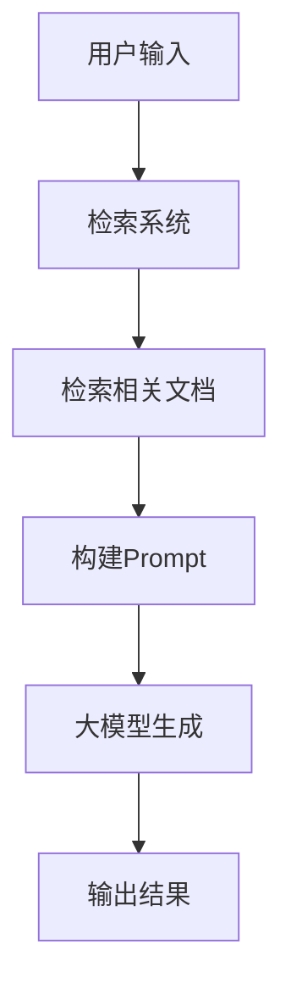

# 📘《大模型基础学习与实战手册》

> 系统学习见下文各章；日常常用 API 与使用场景速查见同目录《常用API与使用场景》。

---

# 第1章：大模型概述

> **本章定位**：建立大模型的基础概念体系，了解大模型的定义、发展历程、分类和应用场景，为后续深入学习奠定基础。

## 1.1 大模型的定义与特点

### 1.1.1 核心概念

```
┌─────────────────────────────────────────────────────────────────────┐
│                    大模型定义与特点                                  │
├─────────────────────────────────────────────────────────────────────┤
│                                                                      │
│   ┌─────────────────┐  ┌─────────────────┐  ┌─────────────────┐    │
│   │  模型规模      │  │  训练数据      │  │  核心能力      │    │
│   ├─────────────────┤  ├─────────────────┤  ├─────────────────┤    │
│   │ • 参数量大     │  │ • 数据量大     │  │ • 泛化能力强   │    │
│   │ • 层数深       │  │ • 多样性高     │  │ • 涌现能力     │    │
│   │ • 计算需求高   │  │ • 质量高       │  │ • 迁移能力强   │    │
│   └─────────────────┘  └─────────────────┘  └─────────────────┘    │
│                                                                      │
└─────────────────────────────────────────────────────────────────────┘
```

**大模型（Large Language Model, LLM）**：
- 定义：参数量巨大、训练数据丰富的人工智能模型，主要用于自然语言处理（NLP）任务
- 参数量：通常数十亿到数千亿参数
- 训练数据：大规模文本语料，涵盖互联网、书籍、论文等多种来源
- 核心特点：
  - **泛化能力**：能够处理多种不同类型的任务
  - **涌现能力**：随着模型规模增大，出现的新能力
  - **少样本/零样本学习**：仅需少量或无需示例即可完成任务
  - **上下文理解**：能够理解长上下文的语义

### 1.1.2 大模型的发展历程

**发展阶段**：

| 阶段 | 时间 | 标志性事件 | 特点 |
|------|------|------------|------|
| **早期阶段** | 2010年前 | 统计语言模型、RNN | 序列建模能力有限 |
| **神经网络时代** | 2010-2017 | LSTM、GRU | 捕获长距离依赖 |
| **预训练时代** | 2018-2019 | BERT、GPT-1/2 | 预训练+微调范式 |
| **大模型时代** | 2020-2021 | GPT-3、T5 | 参数量剧增，涌现能力显现 |
| **对话模型时代** | 2022-2023 | ChatGPT、LLaMA | 对话能力显著提升 |
| **多模态时代** | 2023至今 | GPT-4V、Gemini | 支持多模态输入输出 |

**关键里程碑**：
- 2017：Transformer架构提出（Attention Is All You Need）
- 2018：BERT发布，开启预训练时代
- 2020：GPT-3发布，参数量达1750亿
- 2022：ChatGPT发布，推动大模型商业化
- 2023：GPT-4发布，多模态能力显著

### 1.2 大模型的分类

### 1.2.1 按参数量分类

| 类别 | 参数量 | 特点 | 适用场景 |
|------|--------|------|----------|
| **小型模型** | <10亿 | 轻量、速度快 | 边缘设备、实时推理 |
| **中型模型** | 10-100亿 | 平衡性能和速度 | 一般应用场景 |
| **大型模型** | 100-1000亿 | 能力强 | 复杂任务、专业领域 |
| **超大型模型** | >1000亿 | 能力全面 | 通用人工智能 |

### 1.2.2 按架构分类

- **Transformer-based**：基于Transformer架构的模型
- **GPT-like**：自回归生成模型，如GPT系列
- **BERT-like**：双向编码器模型，如BERT、RoBERTa
- **混合架构**：结合多种架构优点的模型

### 1.2.3 按训练方式分类

- **预训练模型**：仅经过预训练的基础模型
- **指令微调模型**：经过指令格式数据微调的模型
- **对话微调模型**：针对对话场景优化的模型
- **领域微调模型**：针对特定领域优化的模型

### 1.2.4 按访问方式分类

- **闭源模型**：如GPT-4、Claude 3、Gemini
- **开源模型**：如LLaMA 2、Mistral、Falcon
- **半开源模型**：部分权重或代码开源的模型

### 1.3 大模型的应用场景

### 1.3.1 自然语言理解

- **文本分类**：情感分析、垃圾邮件检测、新闻分类
- **命名实体识别**：识别人名、地名、组织名等实体
- **关系抽取**：提取实体间的关系
- **语义理解**：意图识别、语义相似度计算

### 1.3.2 自然语言生成

- **文本生成**：文章写作、故事创作、广告文案
- **摘要生成**：自动生成文本摘要
- **机器翻译**：多语言翻译
- **代码生成**：根据描述生成代码
- **邮件生成**：自动生成邮件内容

### 1.3.3 对话系统

- **聊天机器人**：通用对话、情感陪伴
- **客户服务**：智能客服、问题解答
- **个人助手**：日程管理、信息查询
- **教育助手**：答疑解惑、学习辅导

### 1.3.4 多模态任务

- **图像描述**：生成图像的文字描述
- **视觉问答**：根据图像回答问题
- **图文生成**：根据文本生成图像
- **视频理解**：视频内容分析、摘要生成

### 1.3.5 知识推理

- **问答系统**：常识问答、专业领域问答
- **推理任务**：数学推理、逻辑推理
- **知识图谱构建**：自动构建和更新知识图谱
- **决策支持**：基于知识的决策建议

---

## 1.4 本章小结

| 知识点 | 面试关键词 | 实际应用 |
|--------|------------|----------|
| 大模型定义 | 参数量、训练数据、涌现能力 | 理解大模型的本质 |
| 发展历程 | Transformer、GPT、BERT | 把握技术发展脉络 |
| 分类方式 | 参数量、架构、训练方式 | 选择合适的模型 |
| 应用场景 | NLP、对话系统、多模态 | 设计应用解决方案 |

### 常见坑与注意点

| 现象 | 原因 | 正确做法 |
|------|------|----------|
| 模型选择不当 | 不了解不同模型的特点 | 根据任务需求和资源限制选择合适模型 |
| 对涌现能力期望过高 | 不了解涌现能力的边界 | 合理设定任务目标，理解模型局限性 |
| 忽视模型部署成本 | 只关注模型能力 | 考虑推理速度、内存需求等部署因素 |

### 面试常见问题

**Q1: 什么是大模型？它的核心特点是什么？**

> **回答要点**：
> 1. **定义**：参数量巨大、训练数据丰富的AI模型，主要用于NLP任务
> 2. **核心特点**：参数量大、泛化能力强、涌现能力、少样本/零样本学习
> 3. **应用价值**：能够处理多种任务，减少特定任务的标注数据需求

**Q2: 大模型的发展历程中有哪些关键里程碑？**

> **回答要点**：
> 1. **2017**：Transformer架构提出
> 2. **2018**：BERT发布，开启预训练时代
> 3. **2020**：GPT-3发布，参数量达1750亿
> 4. **2022**：ChatGPT发布，推动商业化
> 5. **2023**：GPT-4发布，多模态能力显著

**Q3: 大模型有哪些分类方式？各有什么特点？**

> **回答要点**：
> 1. **按参数量**：小型、中型、大型、超大型
> 2. **按架构**：Transformer-based、GPT-like、BERT-like
> 3. **按训练方式**：预训练、指令微调、对话微调
> 4. **按访问方式**：闭源、开源、半开源
> 5. **按部署方式**：API服务、本地部署、边缘部署

---

# 第2章：大模型基础原理

> **本章定位**：深入理解大模型的技术原理，包括Transformer架构、预训练与微调、训练与推理过程，为后续的模型应用和优化提供理论基础。

## 2.1 Transformer架构

### 2.1.1 基本结构

```
┌─────────────────────────────────────────────────────────────────────┐
│                      Transformer架构                                │
├─────────────────────────────────────────────────────────────────────┤
│                                                                      │
│   ┌──────────────────────────────────────────────────────────────┐  │
│   │                        Encoder                               │  │
│   │  ┌────────────┐  ┌────────────┐  ┌────────────┐  ┌────────┐  │  │
│   │  │ 多头注意力  │→ │ 层归一化  │→ │ 前馈网络   │→ │ 层归一化│  │  │
│   │  └────────────┘  └────────────┘  └────────────┘  └────────┘  │  │
│   └──────────────────────────────────────────────────────────────┘  │  │
│                              ↑                                      │
│                              │                                      │
│                              ↓                                      │
│   ┌──────────────────────────────────────────────────────────────┐  │
│   │                        Decoder                               │  │
│   │  ┌────────────┐  ┌────────────┐  ┌────────────┐  ┌────────┐  │  │
│   │  │ 掩码注意力  │→ │ 多头注意力  │→ │ 层归一化  │→ │ 前馈网络│  │  │
│   │  └────────────┘  └────────────┘  └────────────┘  └────────┘  │  │
│   └──────────────────────────────────────────────────────────────┘  │  │
│                                                                      │
└─────────────────────────────────────────────────────────────────────┘
```

**Transformer架构组成**：
- **编码器（Encoder）**：处理输入序列，捕获双向上下文信息
- **解码器（Decoder）**：生成输出序列，结合编码器的输出和已生成的内容
- **多头注意力机制**：并行计算多个注意力头，捕获不同方面的语义信息
- **前馈神经网络**：对注意力输出进行非线性变换
- **层归一化**：稳定训练过程，加速收敛
- **残差连接**：缓解梯度消失问题

### 2.1.2 自注意力机制

**核心公式**：

```python
# 自注意力计算
Q = X @ W_q  # 查询矩阵
K = X @ W_k  # 键矩阵
V = X @ W_v  # 值矩阵

# 注意力分数
scores = Q @ K.T / sqrt(d_k)

# 注意力权重
weights = softmax(scores, dim=-1)

# 注意力输出
output = weights @ V
```

**多头注意力**：
- 将输入投影到多个子空间
- 每个子空间计算独立的注意力
-  concatenate结果作为最终输出

**掩码注意力**：
- 在解码器中使用
- 防止模型关注未来的token
- 确保自回归生成的正确性

### 2.1.3 位置编码

**绝对位置编码**：
- 使用正弦和余弦函数生成位置嵌入
- 不同频率的正弦余弦函数对应不同的位置
- 公式：
  ```python
  pos_enc[:, 2i] = sin(pos / 10000^(2i/d_model))
  pos_enc[:, 2i+1] = cos(pos / 10000^(2i/d_model))
  ```

**相对位置编码**：
- 在注意力计算中考虑位置之间的相对距离
- 捕获序列中的相对位置信息
- 更灵活地处理不同长度的序列

**旋转位置编码（RoPE）**：
- 通过旋转矩阵实现位置编码
- 保持注意力分数的相对位置关系
- 广泛应用于LLaMA等模型

### 2.2 预训练与微调

### 2.2.1 预训练

**自监督学习**：
- **掩码语言模型（MLM）**：BERT采用，随机掩码部分token并预测
- **自回归语言模型（LM）**：GPT采用，预测下一个token
- **对比学习**：通过对比正样本和负样本学习表示

**预训练目标**：
- 学习语言的统计规律
- 捕获世界知识
- 建立通用的语言表示

**预训练数据**：
- 互联网文本
- 书籍、论文
- 百科全书
- 代码库

### 2.2.2 微调

**监督微调（SFT）**：
- 在标注数据上微调模型
- 适应特定任务
- 提高任务性能

**指令微调**：
- 使用指令格式的数据
- 使模型理解和执行指令
- 提高零样本和少样本能力

**对话微调**：
- 针对对话场景优化
- 处理多轮对话
- 提高对话质量和连贯性

### 2.2.3 强化学习与人类反馈

**人类反馈的强化学习（RLHF）**：
1. **收集人类偏好数据**：让人类标注者对模型输出进行排序
2. **训练奖励模型（RM）**：预测人类偏好
3. **使用PPO算法**：基于奖励模型优化策略

**优点**：
- 对齐模型输出与人类价值观
- 减少有害输出
- 提高输出质量

### 2.3 大模型的训练过程

### 2.3.1 数据准备

**数据收集**：
- 爬取互联网文本
- 清洗和去重
- 过滤有害内容

**数据预处理**：
- 分词（Tokenization）
- 构建词汇表
- 数据格式化

**数据划分**：
- 训练集：90-95%
- 验证集：2-5%
- 测试集：2-5%

### 2.3.2 模型训练

**训练配置**：
- **学习率**：通常使用余弦退火调度
- **批量大小**：根据GPU内存调整
- **训练轮数**：1-3轮
- **优化器**：AdamW

**分布式训练**：
- **数据并行**：不同设备处理不同批次的数据
- **模型并行**：不同设备处理模型的不同部分
- **流水线并行**：不同设备处理模型的不同层

**训练监控**：
- 损失函数值
- 验证集性能
- 学习率变化
- GPU利用率

### 2.3.3 模型评估

**评估指标**：
- **困惑度（Perplexity）**：衡量模型对文本的预测能力
- **BLEU**：衡量生成文本与参考文本的相似度
- **ROUGE**：衡量摘要质量
- **准确率**：衡量分类任务性能
- **人类评估**：评估模型输出的质量和安全性

**评估数据集**：
- **通用基准**：MMLU、GSM8K、HumanEval
- **领域特定**：法律、医疗、金融等领域数据集
- **多语言评估**：不同语言的性能

### 2.4 大模型的推理过程

### 2.4.1 输入处理

**分词**：
- 将文本转换为token序列
- 使用模型特定的分词器
- 处理特殊token（如[CLS]、[SEP]）

**输入编码**：
- 将token转换为嵌入向量
- 添加位置编码
- 处理批次维度

### 2.4.2 前向传播

**自注意力计算**：
- 计算注意力权重
- 加权聚合值向量
- 多头注意力融合

**前馈网络**：
- 线性变换
- 激活函数（GELU）
- 线性变换

**层归一化**：
- 对每个样本进行归一化
- 稳定模型输出

### 2.4.3 采样策略

**贪婪采样**：
- 选择概率最高的token
- 生成速度快
- 可能导致重复和单调

**Beam Search**：
- 维护多个候选序列
- 选择整体概率最高的序列
- 生成质量高，但速度慢

**Top-k采样**：
- 从概率最高的k个token中采样
- 增加随机性
- k通常设置为50-100

**Top-p采样（Nucleus Sampling）**：
- 从累积概率超过p的token中采样
- 动态调整候选token数量
- 平衡随机性和质量

### 2.4.4 输出处理

**Token解码**：
- 将模型输出的token ID转换为文本
- 处理特殊token
- 拼接成完整文本

**后处理**：
- 移除重复内容
- 修正语法错误
- 格式化输出

---

## 2.5 本章小结

| 知识点 | 面试关键词 | 实际应用 |
|--------|------------|----------|
| Transformer架构 | 自注意力、多头注意力、位置编码 | 理解模型内部工作原理 |
| 预训练与微调 | 自监督学习、指令微调、RLHF | 模型优化和定制 |
| 训练过程 | 分布式训练、学习率调度、数据并行 | 模型训练和部署 |
| 推理过程 | 采样策略、前向传播、输出处理 | 优化推理性能 |

### 常见坑与注意点

| 现象 | 原因 | 正确做法 |
|------|------|----------|
| 训练不稳定 | 学习率设置不当 | 使用余弦退火调度，适当的学习率预热 |
| 推理速度慢 | 采样策略选择不当 | 根据场景选择合适的采样策略 |
| 生成质量差 | 温度参数设置不当 | 调整temperature参数，平衡随机性和质量 |
| 内存不足 | 模型参数量过大 | 使用模型并行、量化等技术 |

### 面试常见问题

**Q1: 请解释Transformer架构的核心组件和工作原理**

> **回答要点**：
> 1. **核心组件**：编码器、解码器、多头注意力、前馈神经网络、层归一化、残差连接
> 2. **自注意力机制**：计算Q、K、V之间的相似度，得到注意力权重
> 3. **位置编码**：为模型提供位置信息，使模型理解序列顺序
> 4. **工作流程**：输入→编码→解码→输出

**Q2: 什么是预训练和微调？它们的作用是什么？**

> **回答要点**：
> 1. **预训练**：在大规模无标注数据上学习语言表示和知识
> 2. **微调**：在特定任务的标注数据上调整模型参数
> 3. **指令微调**：使模型理解和执行指令
> 4. **RLHF**：对齐模型输出与人类偏好

**Q3: 大模型的训练过程包括哪些步骤？**

> **回答要点**：
> 1. **数据准备**：收集、清洗、预处理数据
> 2. **模型初始化**：初始化模型参数
> 3. **训练配置**：设置学习率、批量大小等参数
> 4. **分布式训练**：使用数据并行、模型并行等技术
> 5. **模型评估**：在验证集上评估性能
> 6. **模型保存**：保存训练好的权重

**Q4: 大模型的推理过程包括哪些步骤？**

> **回答要点**：
> 1. **输入处理**：分词、编码
> 2. **前向传播**：自注意力计算、前馈网络
> 3. **采样策略**：贪婪采样、beam search、top-k/top-p采样
> 4. **输出处理**：token解码、后处理

---

# 第3章：大模型的关键技术

> **本章定位**：深入理解大模型的核心技术，包括注意力机制、位置编码、模型架构优化、训练技术和推理优化，为模型调优和应用开发提供技术支持。

## 3.1 注意力机制

### 3.1.1 缩放点积注意力

**核心原理**：
- 计算查询（Query）与键（Key）的点积，衡量它们的相似度
- 除以维度的平方根，防止点积值过大导致softmax饱和
- 经过softmax得到注意力权重
- 使用权重对值（Value）进行加权求和

**计算公式**：

```python
def scaled_dot_product_attention(Q, K, V, mask=None):
    d_k = Q.shape[-1]
    scores = torch.matmul(Q, K.transpose(-2, -1)) / math.sqrt(d_k)
    
    if mask is not None:
        scores = scores.masked_fill(mask == 0, -1e9)
    
    weights = torch.softmax(scores, dim=-1)
    output = torch.matmul(weights, V)
    
    return output, weights
```

**特点**：
- 计算效率高，复杂度为O(n²)
- 能够捕获序列中的长距离依赖
- 并行计算能力强

### 3.1.2 多头注意力

**核心原理**：
- 将输入投影到多个子空间（注意力头）
- 每个注意力头独立计算注意力
- concatenate所有注意力头的输出
- 线性变换得到最终结果

**计算公式**：

```python
def multi_head_attention(Q, K, V, d_model, num_heads, mask=None):
    d_k = d_model // num_heads
    
    # 线性投影
    Q = linear_projection(Q, d_model)
    K = linear_projection(K, d_model)
    V = linear_projection(V, d_model)
    
    # 分割注意力头
    Q = Q.view(batch_size, seq_len, num_heads, d_k).transpose(1, 2)
    K = K.view(batch_size, seq_len, num_heads, d_k).transpose(1, 2)
    V = V.view(batch_size, seq_len, num_heads, d_k).transpose(1, 2)
    
    # 计算注意力
    output, weights = scaled_dot_product_attention(Q, K, V, mask)
    
    # 合并注意力头
    output = output.transpose(1, 2).contiguous().view(batch_size, seq_len, d_model)
    output = linear_projection(output, d_model)
    
    return output, weights
```

**优势**：
- 捕获不同方面的语义信息
- 提高模型的表达能力
- 增强模型的泛化能力

### 3.1.3 交叉注意力

**核心原理**：
- 在编码器-解码器架构中使用
- 解码器的查询（Query）关注编码器的键（Key）和值（Value）
- 实现源语言和目标语言之间的对齐

**应用场景**：
- 机器翻译
- 文本摘要
- 问答系统

## 3.2 位置编码

### 3.2.1 绝对位置编码

**核心原理**：
- 使用正弦和余弦函数生成位置嵌入
- 不同频率的函数对应不同的位置
- 位置嵌入与词嵌入相加

**计算公式**：

```python
def positional_encoding(max_seq_len, d_model):
    position = torch.arange(0, max_seq_len, dtype=torch.float).unsqueeze(1)
    div_term = torch.exp(torch.arange(0, d_model, 2).float() * (-math.log(10000.0) / d_model))
    
    pe = torch.zeros(max_seq_len, d_model)
    pe[:, 0::2] = torch.sin(position * div_term)
    pe[:, 1::2] = torch.cos(position * div_term)
    
    return pe
```

**特点**：
- 计算简单，易于实现
- 能够表示任意长度的序列
- 位置信息编码在固定的嵌入中

### 3.2.2 相对位置编码

**核心原理**：
- 在注意力计算中直接建模位置之间的相对距离
- 使用相对位置偏置项
- 捕获序列中的相对位置关系

**优势**：
- 更灵活地处理不同长度的序列
- 更好地捕获局部依赖关系
- 减少位置编码的参数量

### 3.2.3 旋转位置编码（RoPE）

**核心原理**：
- 通过旋转矩阵实现位置编码
- 保持注意力分数的相对位置关系
- 支持线性注意力

**计算公式**：

```python
def rope_embedding(x, dim, max_seq_len):
    position = torch.arange(0, x.size(1), dtype=torch.float).unsqueeze(1)
    div_term = torch.exp(torch.arange(0, dim, 2).float() * (-math.log(10000.0) / dim))
    theta = position * div_term
    
    cos_theta = torch.cos(theta)
    sin_theta = torch.sin(theta)
    
    x1 = x[..., ::2]
    x2 = x[..., 1::2]
    
    rotated = torch.stack([-x2, x1], dim=-1).reshape_as(x)
    
    rope = torch.stack([cos_theta, sin_theta], dim=-1).repeat_interleave(2, dim=-2)
    
    return x * rope[..., 0] + rotated * rope[..., 1]
```

**优势**：
- 计算效率高
- 支持长上下文
- 广泛应用于LLaMA、ChatGLM等模型

## 3.3 模型架构优化

### 3.3.1 层归一化位置

**前置层归一化**：
- 将层归一化放在多头注意力和前馈神经网络之前
- 稳定模型训练，加速收敛
- 减少梯度消失问题

**实现方式**：

```python
def transformer_layer(x, mask):
    # 前置层归一化
    x_norm = layer_norm(x)
    # 多头注意力
    attn_output = multi_head_attention(x_norm, x_norm, x_norm, mask)
    # 残差连接
    x = x + attn_output
    
    # 前置层归一化
    x_norm = layer_norm(x)
    # 前馈网络
    ff_output = feed_forward(x_norm)
    # 残差连接
    x = x + ff_output
    
    return x
```

### 3.3.2 残差连接

**核心原理**：
- 将输入直接添加到层的输出
- 帮助梯度流动，缓解梯度消失问题
- 允许模型学习残差函数，简化优化目标

**优势**：
- 加速模型收敛
- 提高模型稳定性
- 支持更深的网络架构

### 3.3.3 激活函数

**GELU**（Gaussian Error Linear Unit）：
- 高斯误差线性单元
- 比ReLU更平滑
- 提高模型性能

**计算公式**：
```python
def gelu(x):
    return 0.5 * x * (1 + torch.tanh(math.sqrt(2 / math.pi) * (x + 0.044715 * torch.pow(x, 3))))
```

**其他激活函数**：
- **ReLU**：简单高效，但可能导致神经元死亡
- **Swish**：自门控激活函数
- **SiLU**：与GELU类似，计算更简单

### 3.3.4 Dropout

**核心原理**：
- 随机失活部分神经元
- 防止过拟合
- 提高模型泛化能力

**应用场景**：
- 训练过程中使用
- 推理过程中关闭
- 通常设置为0.1-0.3

## 3.4 训练技术

### 3.4.1 混合精度训练

**核心原理**：
- 使用FP16和FP32混合精度
- 加速训练过程
- 减少内存使用

**实现方式**：

```python
# 使用PyTorch的混合精度训练
from torch.cuda.amp import autocast, GradScaler

scaler = GradScaler()

for batch in dataloader:
    with autocast():
        outputs = model(batch)
        loss = loss_fn(outputs, targets)
    
    scaler.scale(loss).backward()
    scaler.step(optimizer)
    scaler.update()
    optimizer.zero_grad()
```

**优势**：
- 训练速度提升2-3倍
- 内存使用减少约50%
- 支持更大的批量大小和模型

### 3.4.2 梯度累积

**核心原理**：
- 累积多个小批量的梯度
- 模拟更大的批量大小
- 在有限GPU内存下训练更大的模型

**实现方式**：

```python
accumulation_steps = 4

for i, batch in enumerate(dataloader):
    outputs = model(batch)
    loss = loss_fn(outputs, targets)
    loss = loss / accumulation_steps
    loss.backward()
    
    if (i + 1) % accumulation_steps == 0:
        optimizer.step()
        optimizer.zero_grad()
```

**优势**：
- 无需增加GPU内存
- 模拟更大的批量大小
- 提高模型性能

### 3.4.3 梯度裁剪

**核心原理**：
- 限制梯度的范数
- 防止梯度爆炸
- 稳定训练过程

**实现方式**：

```python
optimizer.zero_grad()
outputs = model(batch)
loss = loss_fn(outputs, targets)
loss.backward()

# 梯度裁剪
torch.nn.utils.clip_grad_norm_(model.parameters(), max_norm=1.0)

optimizer.step()
```

**优势**：
- 稳定训练过程
- 允许使用更大的学习率
- 防止模型发散

### 3.4.4 学习率调度

**余弦退火调度**：
- 学习率从初始值逐渐降低到最小值
- 模拟余弦函数的形状
- 提高模型性能

**实现方式**：

```python
from torch.optim.lr_scheduler import CosineAnnealingLR

optimizer = torch.optim.AdamW(model.parameters(), lr=1e-4)
scheduler = CosineAnnealingLR(optimizer, T_max=1000, eta_min=1e-6)

for epoch in range(num_epochs):
    # 训练代码
    scheduler.step()
```

**其他调度策略**：
- **线性预热**：学习率从0逐渐增加到初始值
- **指数衰减**：学习率按指数规律衰减
- **阶跃衰减**：在特定epoch降低学习率

## 3.5 推理优化

### 3.5.1 模型量化

**核心原理**：
- 减少模型权重的精度
- 降低内存使用和推理时间
- 支持在边缘设备上部署

**量化类型**：
- **INT8量化**：将32位浮点数量化为8位整数
- **INT4量化**：将32位浮点数量化为4位整数
- **混合精度量化**：部分层使用高精度，部分层使用低精度

**实现方式**：

```python
# 使用PyTorch的量化工具
import torch.quantization

# 准备模型
model = torchvision.models.resnet18(pretrained=True)
model.eval()

# 量化模型
quantized_model = torch.quantization.quantize_dynamic(
    model,
    {torch.nn.Linear, torch.nn.Conv2d},
    dtype=torch.qint8
)

# 保存量化模型
torch.jit.save(torch.jit.script(quantized_model), 'quantized_model.pt')
```

**优势**：
- 模型大小减少75%（INT8）
- 推理速度提升2-4倍
- 内存使用显著减少

### 3.5.2 模型压缩

**知识蒸馏**：
- 将大模型（教师模型）的知识迁移到小模型（学生模型）
- 提高小模型的性能
- 保持模型结构简单

**实现方式**：

```python
def distillation_loss(student_outputs, teacher_outputs, labels, temperature=2.0, alpha=0.5):
    # 软标签损失
    soft_loss = F.kl_div(
        F.log_softmax(student_outputs / temperature, dim=1),
        F.softmax(teacher_outputs / temperature, dim=1),
        reduction='batchmean'
    ) * (temperature ** 2)
    
    # 硬标签损失
    hard_loss = F.cross_entropy(student_outputs, labels)
    
    # 组合损失
    return alpha * soft_loss + (1 - alpha) * hard_loss
```

**剪枝**：
- 移除冗余的神经元和连接
- 减小模型大小
- 提高推理速度

**优势**：
- 模型大小显著减小
- 推理速度提升
- 保持模型性能

### 3.5.3 批量推理

**核心原理**：
- 批量处理多个输入
- 提高GPU利用率
- 减少推理时间

**实现方式**：

```python
def batch_inference(model, inputs, batch_size=32):
    outputs = []
    for i in range(0, len(inputs), batch_size):
        batch = inputs[i:i+batch_size]
        batch_outputs = model(batch)
        outputs.extend(batch_outputs)
    return outputs
```

**优势**：
- 提高GPU利用率
- 减少推理时间
- 适合处理大量请求

### 3.5.4 缓存机制

**KV缓存**：
- 缓存自注意力计算中的键（Key）和值（Value）
- 加速自回归生成
- 减少重复计算

**实现方式**：

```python
def generate_with_cache(model, input_ids, max_length=100):
    past_key_values = None
    output_ids = input_ids.tolist()
    
    for _ in range(max_length):
        outputs = model(
            input_ids=torch.tensor([output_ids[-1:]]),
            past_key_values=past_key_values,
            use_cache=True
        )
        
        next_token = outputs.logits.argmax(dim=-1).item()
        output_ids.append(next_token)
        past_key_values = outputs.past_key_values
        
        if next_token == tokenizer.eos_token_id:
            break
    
    return output_ids
```

**优势**：
- 自回归生成速度提升3-5倍
- 减少内存使用
- 支持更长的生成序列

---

## 3.6 本章小结

| 知识点 | 面试关键词 | 实际应用 |
|--------|------------|----------|
| 注意力机制 | 缩放点积注意力、多头注意力、交叉注意力 | 理解模型内部工作原理 |
| 位置编码 | 绝对位置编码、相对位置编码、RoPE | 模型架构设计 |
| 模型架构优化 | 层归一化位置、残差连接、GELU | 提高模型性能 |
| 训练技术 | 混合精度训练、梯度累积、学习率调度 | 加速模型训练 |
| 推理优化 | 模型量化、知识蒸馏、KV缓存 | 提高推理速度 |

### 常见坑与注意点

| 现象 | 原因 | 正确做法 |
|------|------|----------|
| 训练不稳定 | 学习率过大或梯度爆炸 | 使用梯度裁剪和适当的学习率调度 |
| 内存不足 | 模型参数量过大 | 使用混合精度训练、梯度累积、模型并行 |
| 推理速度慢 | 未使用推理优化技术 | 应用模型量化、批量推理、KV缓存 |
| 模型过拟合 | 训练数据不足或正则化不够 | 增加Dropout、使用数据增强、早停 |

### 面试常见问题

**Q1: 请解释自注意力机制的工作原理**

> **回答要点**：
> 1. **核心概念**：计算查询与键的相似度，得到注意力权重
> 2. **计算过程**：Q、K、V矩阵计算，缩放点积，softmax归一化，加权求和
> 3. **优势**：捕获长距离依赖，并行计算能力强
> 4. **应用**：Transformer架构的核心组件

**Q2: 什么是多头注意力？它的优势是什么？**

> **回答要点**：
> 1. **定义**：将输入投影到多个子空间，每个子空间独立计算注意力
> 2. **计算过程**：线性投影、分割注意力头、计算注意力、合并结果
> 3. **优势**：捕获不同方面的语义信息，提高模型表达能力
> 4. **应用**：增强模型对复杂语义的理解

**Q3: 大模型的推理优化有哪些方法？**

> **回答要点**：
> 1. **模型量化**：减少权重精度，降低内存使用
> 2. **模型压缩**：知识蒸馏、剪枝等方法减小模型大小
> 3. **批量推理**：批量处理多个输入，提高GPU利用率
> 4. **缓存机制**：KV缓存加速自回归生成
> 5. **硬件优化**：使用GPU、TPU等加速推理

---

# 第4章：大模型的评估

> **本章定位**：掌握大模型的评估方法，包括评估指标、评估数据集和评估流程，为模型选择和优化提供客观依据。

## 4.1 评估指标

### 4.1.1 困惑度（Perplexity）

**核心概念**：
- 衡量模型对文本的预测能力
- 越低越好，表示模型预测越准确
- 计算模型对测试集的平均负对数似然

**计算公式**：

```python
def perplexity(model, test_data):
    total_loss = 0
    total_tokens = 0
    
    model.eval()
    with torch.no_grad():
        for batch in test_data:
            inputs, targets = batch
            outputs = model(inputs)
            loss = F.cross_entropy(outputs.view(-1, outputs.size(-1)), targets.view(-1))
            total_loss += loss.item() * targets.numel()
            total_tokens += targets.numel()
    
    return math.exp(total_loss / total_tokens)
```

**应用场景**：
- 语言模型预训练评估
- 模型选择和比较
- 训练过程监控

### 4.1.2 BLEU（Bilingual Evaluation Understudy）

**核心概念**：
- 衡量生成文本与参考文本的相似度
- 基于n-gram匹配
- 适用于机器翻译、文本生成等任务

**计算公式**：

```python
def bleu_score(candidate, references, n=4):
    # 计算n-gram precision
    precisions = []
    for i in range(1, n+1):
        candidate_ngrams = get_ngrams(candidate, i)
        reference_ngrams = get_ngrams(references, i)
        
        if not candidate_ngrams:
            precision = 0
        else:
            overlap = len(set(candidate_ngrams) & set(reference_ngrams))
            precision = overlap / len(candidate_ngrams)
        
        precisions.append(precision)
    
    # 计算BLEU score
    if any(p == 0 for p in precisions):
        return 0
    
    geometric_mean = math.exp(sum(math.log(p) for p in precisions) / n)
    brevity_penalty = min(1, math.exp(1 - len(references) / len(candidate)))
    
    return geometric_mean * brevity_penalty
```

**优势**：
- 计算简单，易于实现
- 广泛用于机器翻译评估
- 提供客观的评估标准

### 4.1.3 ROUGE（Recall-Oriented Understudy for Gisting Evaluation）

**核心概念**：
- 衡量生成摘要与参考摘要的相似度
- 基于召回率的评估指标
- 适用于文本摘要任务

**主要指标**：
- **ROUGE-N**：n-gram召回率
- **ROUGE-L**：最长公共子序列召回率
- **ROUGE-W**：加权最长公共子序列召回率

**应用场景**：
- 文本摘要评估
- 长文本生成评估
- 对话系统评估

### 4.1.4 F1分数

**核心概念**：
- 精确率和召回率的调和平均值
- 衡量分类任务的性能
- 适用于命名实体识别、文本分类等任务

**计算公式**：

```python
def f1_score(predictions, ground_truths):
    true_positives = sum(p == g for p, g in zip(predictions, ground_truths) if g == 1)
    false_positives = sum(p != g for p, g in zip(predictions, ground_truths) if p == 1)
    false_negatives = sum(p != g for p, g in zip(predictions, ground_truths) if g == 1)
    
    precision = true_positives / (true_positives + false_positives) if true_positives + false_positives > 0 else 0
    recall = true_positives / (true_positives + false_negatives) if true_positives + false_negatives > 0 else 0
    
    f1 = 2 * (precision * recall) / (precision + recall) if precision + recall > 0 else 0
    
    return f1
```

**应用场景**：
- 命名实体识别
- 文本分类
- 关系抽取

### 4.1.5 人类评估

**核心概念**：
- 由人类标注者评估模型输出的质量
- 最直接、最全面的评估方式
- 适用于所有任务类型

**评估维度**：
- **相关性**：输出与输入的相关程度
- **准确性**：输出内容的正确程度
- **流畅性**：输出语言的自然程度
- **有用性**：输出对用户的帮助程度

**实现方式**：
- **评分法**：使用1-5分评分
- **排序法**：对多个模型输出进行排序
- **对比法**：两两比较模型输出

## 4.2 评估数据集

### 4.2.1 通用基准

**MMLU（Massive Multitask Language Understanding）**：
- 涵盖57个学科领域的问答数据集
- 测试模型的知识和推理能力
- 包括自然科学、人文社科、专业领域等

**GSM8K**：
- 小学数学问题数据集
- 测试模型的数学推理能力
- 包含8000个问题，分为训练集和测试集

**HumanEval**：
- 代码生成评估数据集
- 测试模型生成正确代码的能力
- 包含164个编程问题

**HellaSwag**：
- 常识推理数据集
- 测试模型的常识理解能力
- 包含多项选择题

### 4.2.2 领域特定数据集

**法律领域**：
- **LEGAL-BERT**：法律文本分类
- **COLIEE**：法律案例推理
- **SQuAD-Legal**：法律问答

**医疗领域**：
- **MedQA**：医疗问答
- **PubMedQA**：医学文献问答
- **MIMIC-III**：医疗记录分析

**金融领域**：
- **FinBERT**：金融文本分类
- **FiQA**：金融情感分析
- **FinancialPhraseBank**：金融短语情感分析

### 4.2.3 多语言评估

**XGLUE**：
- 跨语言基准数据集
- 涵盖19种语言
- 包括文本分类、问答、机器翻译等任务

**MLQA**：
- 多语言问答数据集
- 涵盖7种语言
- 测试模型的跨语言理解能力

**PAWS-X**：
- 跨语言复述识别数据集
- 涵盖7种语言
- 测试模型的跨语言语义理解能力

### 4.2.4 多模态评估

**VQA v2.0**：
- 视觉问答数据集
- 包含约120万个问题
- 测试模型的视觉理解和推理能力

**COCO Captions**：
- 图像描述数据集
- 包含约33万个图像描述
- 测试模型的图像理解和文本生成能力

**Flickr30k**：
- 图像描述和视觉问答数据集
- 包含31000个图像
- 测试模型的多模态理解能力

## 4.3 评估方法

### 4.3.1 自动评估

**核心流程**：
1. **数据准备**：选择合适的评估数据集
2. **模型推理**：使用模型生成预测结果
3. **指标计算**：计算评估指标
4. **结果分析**：分析模型性能

**优势**：
- 客观、可重复
- 计算效率高
- 适合大规模评估

**局限性**：
- 可能无法捕捉模型的全部能力
- 某些任务难以用自动指标衡量

### 4.3.2 人工评估

**核心流程**：
1. **任务设计**：设计评估任务和评分标准
2. **数据采样**：选择代表性的模型输出
3. **标注执行**：由人类标注者进行评估
4. **结果汇总**：统计评估结果

**优势**：
- 全面评估模型能力
- 捕捉自动指标无法衡量的维度
- 更符合用户实际需求

**局限性**：
- 成本高，耗时长
- 主观性强，可能存在标注偏差
- 难以大规模评估

### 4.3.3 对比评估

**核心流程**：
1. **模型选择**：选择多个模型进行对比
2. **统一测试**：在相同数据集上测试所有模型
3. **指标计算**：计算各模型的评估指标
4. **结果比较**：分析模型之间的性能差异

**优势**：
- 直接比较模型性能
- 识别模型的相对优势和劣势
- 为模型选择提供依据

**应用场景**：
- 模型选型
- 模型优化效果评估
- 技术路线对比

### 4.3.4 鲁棒性评估

**核心流程**：
1. **攻击设计**：设计对抗样本或噪声输入
2. **模型测试**：使用攻击样本测试模型
3. **结果分析**：分析模型在攻击下的表现
4. **防御优化**：根据评估结果优化模型

**评估维度**：
- **对抗鲁棒性**：抵抗对抗样本的能力
- **噪声鲁棒性**：处理噪声输入的能力
- **分布外鲁棒性**：处理分布外数据的能力

**应用场景**：
- 模型安全性评估
- 生产环境部署前的测试
- 模型可靠性评估

## 4.4 评估流程

### 4.4.1 评估准备

**确定评估目标**：
- 模型选择
- 模型优化
- 性能监控
- 学术研究

**选择评估指标**：
- 根据任务类型选择合适的指标
- 考虑自动指标和人工评估
- 建立多维度评估体系

**准备评估数据**：
- 选择代表性的数据集
- 确保数据质量和多样性
- 划分训练集、验证集和测试集

### 4.4.2 评估执行

**模型推理**：
- 批量处理评估数据
- 记录模型输出和推理时间
- 处理异常情况

**指标计算**：
- 计算自动评估指标
- 组织人工评估
- 记录评估结果

**结果分析**：
- 分析模型在不同任务上的表现
- 识别模型的优势和劣势
- 提出改进建议

### 4.4.3 评估报告

**报告结构**：
- 评估背景和目标
- 评估方法和指标
- 评估结果和分析
- 结论和建议

**关键内容**：
- 模型性能对比
- 错误分析
- 性能瓶颈
- 改进方向

**应用价值**：
- 为模型选择提供依据
- 指导模型优化
- 评估部署风险
- 支持业务决策

---

## 4.5 本章小结

| 知识点 | 面试关键词 | 实际应用 |
|--------|------------|----------|
| 评估指标 | 困惑度、BLEU、ROUGE、F1分数 | 客观衡量模型性能 |
| 评估数据集 | MMLU、GSM8K、HumanEval | 标准测试模型能力 |
| 评估方法 | 自动评估、人工评估、对比评估 | 全面评估模型表现 |
| 鲁棒性评估 | 对抗样本、噪声输入、分布外数据 | 评估模型可靠性 |
| 评估流程 | 评估准备、执行、报告 | 规范评估过程 |

### 常见坑与注意点

| 现象 | 原因 | 正确做法 |
|------|------|----------|
| 评估指标选择不当 | 未根据任务类型选择合适的指标 | 根据任务特点选择针对性指标 |
| 评估数据不足 | 测试数据量小或不具代表性 | 使用多样化、大规模的评估数据 |
| 过度依赖自动评估 | 自动指标无法完全反映模型能力 | 结合人工评估进行综合判断 |
| 鲁棒性评估缺失 | 只评估正常情况下的性能 | 加入鲁棒性测试，评估模型可靠性 |

### 面试常见问题

**Q1: 大模型的评估指标有哪些？各自适用于什么场景？**

> **回答要点**：
> 1. **困惑度**：衡量语言模型的预测能力，适用于预训练评估
> 2. **BLEU**：衡量生成文本与参考文本的相似度，适用于机器翻译
> 3. **ROUGE**：衡量摘要质量，适用于文本摘要任务
> 4. **F1分数**：衡量分类任务性能，适用于命名实体识别等
> 5. **人类评估**：最全面的评估方式，适用于所有任务

**Q2: 如何评估大模型的鲁棒性？**

> **回答要点**：
> 1. **对抗样本测试**：使用对抗样本评估模型的防御能力
> 2. **噪声输入测试**：添加噪声评估模型的稳定性
> 3. **分布外数据测试**：使用未见过的数据评估泛化能力
> 4. **极端情况测试**：测试模型在极端输入下的表现
> 5. **多维度评估**：从多个角度评估模型的鲁棒性

**Q3: 大模型评估的完整流程是什么？**

> **回答要点**：
> 1. **评估准备**：确定目标、选择指标、准备数据
> 2. **模型推理**：批量处理评估数据，记录输出
> 3. **指标计算**：计算自动指标，组织人工评估
> 4. **结果分析**：分析模型表现，识别优势和劣势
> 5. **报告生成**：总结评估结果，提出改进建议

---

# 第5章：大模型的局限性与挑战

> **本章定位**：深入理解大模型的局限性、面临的挑战以及相应的解决方案，为实际应用中的风险控制和问题解决提供指导。

## 5.1 局限性

### 5.1.1 幻觉

**核心概念**：
- 模型生成的内容可能与事实不符
- 表现为编造信息、错误引用、逻辑矛盾
- 是大模型最常见的问题之一

**幻觉类型**：

| 类型 | 描述 | 示例 |
|------|------|------|
| 事实幻觉 | 编造不存在的事实 | "Python是在1995年由Guido van Rossum创建的"（正确）vs "Python是在2005年创建的"（错误）|
| 引用幻觉 | 错误引用来源或数据 | "根据2024年的研究，..."（实际不存在该研究）|
| 逻辑幻觉 | 推理过程出现逻辑错误 | 在数学问题中得出错误的中间步骤 |
| 细节幻觉 | 在正确框架下添加错误细节 | 在正确的历史事件中添加错误的时间或地点 |

**产生原因**：
- 训练数据中的噪声和错误信息
- 模型过度拟合训练数据
- 缺乏外部知识验证机制
- 生成过程中的随机性

**缓解方法**：

```python
# 使用RAG减少幻觉
RAG = Retrieval-Augmented Generation
中文：检索增强生成

from langchain.vectorstores import FAISS
from langchain.embeddings import OpenAIEmbeddings
from langchain.chat_models import ChatOpenAI
from langchain.chains import RetrievalQA

# 创建向量数据库
embeddings = OpenAIEmbeddings()
vectorstore = FAISS.from_texts(texts, embeddings)

# 创建RAG链
llm = ChatOpenAI(model="gpt-4")
qa_chain = RetrievalQA.from_chain_type(
    llm=llm,
    chain_type="stuff",
    retriever=vectorstore.as_retriever(search_kwargs={"k": 3})
)

# 使用RAG回答问题
answer = qa_chain.run("什么是Python？")
```

### 5.1.2 偏见

**核心概念**：
- 模型可能反映训练数据中的偏见
- 包括性别、种族、地域、文化等方面的偏见
- 可能导致不公平的输出

**偏见类型**：

| 偏见类型 | 表现 | 影响 |
|----------|------|------|
| 性别偏见 | 在职业描述中强化性别刻板印象 | 影响招聘、推荐等应用 |
| 种族偏见 | 对不同种族的描述存在差异 | 影响公平性评估 |
| 文化偏见 | 偏向特定文化背景 | 影响跨文化应用 |
| 语言偏见 | 对某些语言或方言的偏见 | 影响多语言应用 |

**缓解方法**：

```python
# 使用去偏数据微调模型
from transformers import AutoTokenizer, AutoModelForCausalLM
from datasets import load_dataset

# 加载去偏数据集
dataset = load_dataset("allenai/natural-instructions")

# 微调模型
tokenizer = AutoTokenizer.from_pretrained("gpt2")
model = AutoModelForCausalLM.from_pretrained("gpt2")

def tokenize_function(examples):
    return tokenizer(examples["text"], padding="max_length", truncation=True)

tokenized_datasets = dataset.map(tokenize_function, batched=True)

# 使用去偏数据训练
from transformers import Trainer, TrainingArguments

training_args = TrainingArguments(
    output_dir="./results",
    num_train_epochs=3,
    per_device_train_batch_size=16,
    learning_rate=2e-5,
)

trainer = Trainer(
    model=model,
    args=training_args,
    train_dataset=tokenized_datasets["train"],
)

trainer.train()
```

### 5.1.3 知识截止

**核心概念**：
- 模型的知识限于训练数据的时间范围
- 无法获取训练之后的新信息
- 影响时效性要求高的应用

**解决方案**：

| 方法 | 描述 | 优缺点 |
|------|------|--------|
| 定期重新训练 | 定期更新训练数据并重新训练模型 | 优点：彻底更新知识<br>缺点：成本高，耗时长 |
| 外部知识库 | 使用实时更新的外部知识源 | 优点：实时更新<br>缺点：依赖外部系统 |
| RAG技术 | 检索增强生成，结合最新信息 | 优点：灵活高效<br>缺点：需要构建检索系统 |
| 搜索增强 | 结合搜索引擎获取最新信息 | 优点：信息全面<br>缺点：可能引入噪声 |

### 5.1.4 计算资源需求

**核心概念**：
- 训练和推理需要大量计算资源
- 包括GPU、内存、存储等
- 限制了大模型的普及和应用

**资源需求对比**：

| 模型 | 参数量 | 训练资源 | 推理资源 |
|------|--------|----------|----------|
| GPT-3 | 175B | 数千GPU，数周 | 8-16 A100 GPU |
| Llama 2 70B | 70B | 数百GPU，数周 | 4-8 A100 GPU |
| ChatGLM-6B | 6B | 数十GPU，数天 | 1-2 A100 GPU |
| Mistral 7B | 7B | 数十GPU，数天 | 1-2 A100 GPU |

**优化方法**：

```python
# 使用模型量化减少资源需求
from transformers import AutoModelForCausalLM, AutoTokenizer
import torch

# 加载模型
model = AutoModelForCausalLM.from_pretrained("mistralai/Mistral-7B-v0.1")
tokenizer = AutoTokenizer.from_pretrained("mistralai/Mistral-7B-v0.1")

# 量化模型
from optimum.bettertransformer import BetterTransformer

model = BetterTransformer.transform(model)

# 使用量化模型进行推理
input_text = "Hello, how are you?"
input_ids = tokenizer(input_text, return_tensors="pt").input_ids

outputs = model.generate(input_ids, max_length=50)
print(tokenizer.decode(outputs[0]))
```

### 5.1.5 可解释性

**核心概念**：
- 模型的决策过程难以解释
- 内部工作机制复杂
- 影响用户信任和监管合规

**可解释性方法**：

| 方法 | 描述 | 应用场景 |
|------|------|----------|
| 注意力可视化 | 可视化注意力权重，了解模型关注点 | 文本分类、情感分析 |
| 梯度分析 | 分析输入对输出的影响 | 错误分析、模型调试 |
| 特征重要性 | 评估特征对预测的贡献 | 决策支持、风险分析 |
| 反事实解释 | 生成反事实示例说明决策 | 信用评估、医疗诊断 |

## 5.2 挑战

### 5.2.1 训练成本

**核心概念**：
- 大模型训练成本高昂
- 包括计算资源、人力、时间等成本
- 限制了模型的开发和更新

**成本构成**：

| 成本类型 | 占比 | 优化方法 |
|----------|------|----------|
| 计算资源 | 60-70% | 使用云服务、混合精度训练 |
| 人力成本 | 20-30% | 自动化工具、开源社区 |
| 数据成本 | 5-10% | 使用公开数据集、数据增强 |
| 其他成本 | 5-10% | 优化流程、提高效率 |

**优化策略**：

```python
# 使用分布式训练降低成本
import torch
import torch.distributed as dist
from torch.nn.parallel import DistributedDataParallel as DDP

# 初始化分布式环境
dist.init_process_group(backend='nccl')

# 创建模型并包装
model = MyModel()
model = DDP(model)

# 使用混合精度训练
from torch.cuda.amp import autocast, GradScaler
scaler = GradScaler()

for batch in dataloader:
    with autocast():
        outputs = model(batch)
        loss = loss_fn(outputs, targets)
    
    scaler.scale(loss).backward()
    scaler.step(optimizer)
    scaler.update()
```

### 5.2.2 部署困难

**核心概念**：
- 模型体积大，部署难度高
- 需要考虑硬件兼容性、性能优化等
- 影响模型的实际应用

**部署挑战**：

| 挑战 | 描述 | 解决方案 |
|------|------|----------|
| 模型体积大 | 需要大量存储和内存 | 模型量化、剪枝、蒸馏 |
| 推理速度慢 | 响应时间长，影响用户体验 | 批量推理、缓存机制、硬件加速 |
| 硬件兼容性 | 不同硬件环境适配困难 | 容器化、多平台支持 |
| 扩展性差 | 难以应对高并发请求 | 分布式部署、负载均衡 |

**部署方案**：

```python
# 使用FastAPI部署大模型
from fastapi import FastAPI
from transformers import AutoModelForCausalLM, AutoTokenizer
import torch

app = FastAPI()

# 加载模型
model = AutoModelForCausalLM.from_pretrained("gpt2")
tokenizer = AutoTokenizer.from_pretrained("gpt2")

@app.post("/generate")
async def generate(text: str, max_length: int = 50):
    # 分词
    inputs = tokenizer(text, return_tensors="pt")
    
    # 生成
    with torch.no_grad():
        outputs = model.generate(
            inputs.input_ids,
            max_length=max_length,
            num_return_sequences=1
        )
    
    # 解码
    result = tokenizer.decode(outputs[0], skip_special_tokens=True)
    
    return {"result": result}
```

### 5.2.3 安全风险

**核心概念**：
- 模型可能被用于生成有害内容
- 包括虚假信息、仇恨言论、恶意代码等
- 需要建立安全防护机制

**安全风险类型**：

| 风险类型 | 描述 | 防护措施 |
|----------|------|----------|
| 虚假信息 | 生成误导性或虚假内容 | 事实核查、内容审核 |
| 仇恨言论 | 生成歧视性或仇恨性内容 | 内容过滤、敏感词检测 |
| 恶意代码 | 生成恶意软件或漏洞利用代码 | 代码审计、沙箱执行 |
| 隐私泄露 | 泄露个人或敏感信息 | 数据脱敏、访问控制 |

**防护机制**：

```python
# 内容安全检查
from transformers import pipeline

# 加载安全分类器
safety_classifier = pipeline("text-classification", model="unitary/toxic-bert")

def check_safety(text):
    result = safety_classifier(text)
    if result[0]["label"] == "TOXIC" and result[0]["score"] > 0.5:
        return False
    return True

# 在生成前检查
def safe_generate(model, tokenizer, prompt, max_length=100):
    if not check_safety(prompt):
        return "输入内容不安全"
    
    outputs = model.generate(
        tokenizer.encode(prompt, return_tensors="pt"),
        max_length=max_length
    )
    
    result = tokenizer.decode(outputs[0])
    
    # 检查输出
    if not check_safety(result):
        return "生成内容不安全"
    
    return result
```

### 5.2.4 伦理问题

**核心概念**：
- 涉及隐私、版权、公平性等伦理问题
- 需要建立伦理审查机制
- 确保模型的负责任使用

**伦理问题类型**：

| 问题类型 | 描述 | 应对措施 |
|----------|------|----------|
| 隐私问题 | 训练数据可能包含隐私信息 | 数据脱敏、差分隐私 |
| 版权问题 | 生成内容可能侵犯版权 | 版权检测、原创性验证 |
| 公平性问题 | 模型输出可能存在偏见 | 公平性评估、去偏处理 |
| 透明度问题 | 模型决策过程不透明 | 可解释性研究、决策记录 |

### 5.2.5 环境影响

**核心概念**：
- 训练过程消耗大量能源
- 对环境有影响
- 需要考虑可持续发展

**环境影响数据**：

| 模型 | 训练能耗 | 碳排放 |
|------|----------|--------|
| GPT-3 | ~1.3 MWh | ~500吨CO2 |
| Llama 2 70B | ~0.5 MWh | ~200吨CO2 |
| BERT | ~0.001 MWh | ~0.4吨CO2 |

**优化方法**：
- 使用绿色能源
- 优化训练算法
- 模型共享和复用
- 碳足迹追踪和补偿

## 5.3 解决方案

### 5.3.1 RAG（检索增强生成）

**核心原理**：
- 结合检索系统和生成模型
- 从外部知识库中检索相关信息
- 使用检索到的信息辅助生成

**实现流程**：



**代码实现**：

```python
from langchain.vectorstores import Chroma
from langchain.embeddings import OpenAIEmbeddings
from langchain.chat_models import ChatOpenAI
from langchain.chains import RetrievalQA
from langchain.document_loaders import TextLoader
from langchain.text_splitter import CharacterTextSplitter

# 加载文档
loader = TextLoader("documents.txt")
documents = loader.load()

# 分割文档
text_splitter = CharacterTextSplitter(chunk_size=1000, chunk_overlap=0)
texts = text_splitter.split_documents(documents)

# 创建向量数据库
embeddings = OpenAIEmbeddings()
vectorstore = Chroma.from_documents(texts, embeddings)

# 创建RAG链
llm = ChatOpenAI(model="gpt-4")
qa_chain = RetrievalQA.from_chain_type(
    llm=llm,
    chain_type="stuff",
    retriever=vectorstore.as_retriever(search_kwargs={"k": 3})
)

# 使用RAG回答问题
query = "什么是人工智能？"
answer = qa_chain.run(query)
print(answer)
```

**优势**：
- 减少幻觉
- 提供最新信息
- 可追溯性
- 可解释性

### 5.3.2 微调

**核心原理**：
- 使用高质量数据微调模型
- 减少偏见，提高特定任务性能
- 适应特定领域或应用场景

**微调类型**：

| 类型 | 描述 | 应用场景 |
|------|------|----------|
| 全量微调 | 更新所有模型参数 | 领域适配、任务定制 |
| 部分微调 | 只更新部分参数 | 快速适配、资源受限 |
| LoRA微调 | 使用低秩适应 | 高效微调、多任务学习 |
| Prompt微调 | 只优化Prompt | 轻量级适配 |

**代码实现**：

```python
from transformers import AutoModelForCausalLM, AutoTokenizer, TrainingArguments, Trainer
from datasets import load_dataset

# 加载模型和分词器
model = AutoModelForCausalLM.from_pretrained("gpt2")
tokenizer = AutoTokenizer.from_pretrained("gpt2")

# 准备数据集
dataset = load_dataset("text", data_files={"train": "train.txt"})

def tokenize_function(examples):
    return tokenizer(examples["text"], padding="max_length", truncation=True)

tokenized_datasets = dataset.map(tokenize_function, batched=True)

# 设置训练参数
training_args = TrainingArguments(
    output_dir="./results",
    num_train_epochs=3,
    per_device_train_batch_size=16,
    learning_rate=2e-5,
    warmup_steps=500,
    weight_decay=0.01,
    logging_dir="./logs",
)

# 创建Trainer
trainer = Trainer(
    model=model,
    args=training_args,
    train_dataset=tokenized_datasets["train"],
)

# 开始训练
trainer.train()

# 保存模型
model.save_pretrained("./fine_tuned_model")
tokenizer.save_pretrained("./fine_tuned_model")
```

### 5.3.3 知识更新

**核心原理**：
- 定期更新模型或使用外部知识源
- 保持模型知识的时效性
- 适应快速变化的信息环境

**更新策略**：

| 策略 | 描述 | 优缺点 |
|------|------|--------|
| 定期重新训练 | 定期用新数据重新训练模型 | 优点：彻底更新<br>缺点：成本高 |
| 增量训练 | 在现有模型基础上继续训练 | 优点：成本较低<br>缺点：可能遗忘旧知识 |
| 外部知识库 | 使用实时更新的外部知识 | 优点：实时更新<br>缺点：依赖外部系统 |
| 混合方法 | 结合多种更新策略 | 优点：平衡成本和效果<br>缺点：实现复杂 |

### 5.3.4 模型压缩

**核心原理**：
- 通过量化、剪枝等方法，减少模型体积
- 提高推理速度
- 降低部署成本

**压缩方法**：

| 方法 | 压缩比 | 性能损失 | 实现难度 |
|------|--------|----------|----------|
| 量化 | 2-4x | 小 | 简单 |
| 剪枝 | 2-10x | 中等 | 中等 |
| 蒸馏 | 2-5x | 小 | 中等 |
| 知识蒸馏 | 2-10x | 小 | 复杂 |

**代码实现**：

```python
# 模型量化
from transformers import AutoModelForCausalLM, AutoTokenizer
import torch

# 加载模型
model = AutoModelForCausalLM.from_pretrained("gpt2")
tokenizer = AutoTokenizer.from_pretrained("gpt2")

# 动态量化
quantized_model = torch.quantization.quantize_dynamic(
    model,
    {torch.nn.Linear},
    dtype=torch.qint8
)

# 保存量化模型
torch.save(quantized_model.state_dict(), "quantized_model.pt")

# 模型剪枝
import torch.nn.utils.prune as prune

# 对线性层进行剪枝
for name, module in model.named_modules():
    if isinstance(module, torch.nn.Linear):
        prune.l1_unstructured(module, name='weight', amount=0.2)

# 移除剪枝掩码
for name, module in model.named_modules():
    if isinstance(module, torch.nn.Linear):
        prune.remove(module, 'weight')

# 保存剪枝模型
model.save_pretrained("pruned_model")
```

### 5.3.5 安全对齐

**核心原理**：
- 使用RLHF等方法，对齐模型输出与人类价值观
- 确保模型输出符合安全和伦理标准
- 提高模型的可靠性和可信度

**对齐方法**：

| 方法 | 描述 | 应用场景 |
|------|------|----------|
| RLHF | 基于人类反馈的强化学习 | 安全对齐、价值观对齐 |
| Constitutional AI | 基于宪法原则的AI对齐 | 伦理约束、行为规范 |
| Red Teaming | 红队测试，发现安全漏洞 | 安全评估、漏洞挖掘 |
| 内容过滤 | 过滤不安全内容 | 实时防护、内容审核 |

**代码实现**：

```python
# 使用RLHF进行安全对齐
from transformers import AutoModelForCausalLM, AutoTokenizer, Trainer, TrainingArguments
from datasets import load_dataset

# 加载模型
model = AutoModelForCausalLM.from_pretrained("gpt2")
tokenizer = AutoTokenizer.from_pretrained("gpt2")

# 加载人类反馈数据集
dataset = load_dataset("Anthropic/hh-rlhf")

def preprocess_function(examples):
    inputs = tokenizer(examples["prompt"], truncation=True, padding="max_length")
    labels = tokenizer(examples["response"], truncation=True, padding="max_length")
    return {"input_ids": inputs["input_ids"], "labels": labels["input_ids"]}

tokenized_dataset = dataset.map(preprocess_function, batched=True)

# 训练奖励模型
reward_model = AutoModelForSequenceClassification.from_pretrained("gpt2", num_labels=1)

# 使用PPO进行强化学习
from trl import PPOTrainer, PPOConfig, AutoModelForCausalLMWithValueHead

config = PPOConfig(
    model_name="gpt2",
    learning_rate=1.41e-5,
    batch_size=128,
    mini_batch_size=32,
)

ppo_trainer = PPOTrainer(
    config=config,
    model=model,
    ref_model=None,
    tokenizer=tokenizer,
    dataset=tokenized_dataset["train"],
)

# 训练
ppo_trainer.train()
```

---

## 5.4 本章小结

| 知识点 | 面试关键词 | 实际应用 |
|--------|------------|----------|
| 幻觉 | 事实幻觉、引用幻觉、逻辑幻觉 | 内容生成、问答系统 |
| 偏见 | 性别偏见、种族偏见、文化偏见 | 公平性评估、去偏处理 |
| 知识截止 | 训练数据时间限制、知识更新 | 时效性应用、RAG技术 |
| 计算资源 | GPU、内存、存储 | 资源优化、成本控制 |
| 可解释性 | 注意力可视化、梯度分析 | 模型调试、决策支持 |
| 安全风险 | 虚假信息、仇恨言论、恶意代码 | 内容安全、风险防护 |
| 解决方案 | RAG、微调、模型压缩、安全对齐 | 问题解决、风险控制 |

### 常见坑与注意点

| 现象 | 原因 | 正确做法 |
|------|------|----------|
| 模型产生幻觉 | 缺乏外部知识验证 | 使用RAG技术，结合外部知识源 |
| 输出存在偏见 | 训练数据存在偏见 | 使用去偏数据微调，建立公平性评估 |
| 知识过时 | 训练数据时间限制 | 定期更新模型或使用外部知识库 |
| 资源不足 | 模型参数量大 | 使用模型量化、剪枝等优化技术 |
| 安全风险 | 缺乏安全防护机制 | 建立内容审核、安全检查机制 |

### 面试常见问题

**Q1: 大模型存在哪些局限性？如何解决？**

> **回答要点**：
> 1. **幻觉**：使用RAG技术，结合外部知识验证
> 2. **偏见**：使用去偏数据微调，建立公平性评估
> 3. **知识截止**：定期更新模型或使用外部知识库
> 4. **计算资源需求**：使用模型量化、剪枝等优化技术
> 5. **可解释性差**：使用注意力可视化、梯度分析等方法

**Q2: 如何减少大模型的幻觉问题？**

> **回答要点**：
> 1. **RAG技术**：检索增强生成，结合外部知识
> 2. **事实核查**：建立事实验证机制
> 3. **Prompt工程**：设计更精确的提示词
> 4. **微调**：使用高质量数据微调模型
> 5. **多模型验证**：使用多个模型交叉验证

**Q3: 大模型部署面临哪些挑战？如何解决？**

> **回答要点**：
> 1. **模型体积大**：使用模型量化、剪枝、蒸馏
> 2. **推理速度慢**：使用批量推理、缓存机制、硬件加速
> 3. **硬件兼容性**：使用容器化、多平台支持
> 4. **扩展性差**：使用分布式部署、负载均衡
> 5. **安全风险**：建立内容审核、安全检查机制

---

# 第6章：大模型生态系统

> **本章定位**：了解大模型生态系统的构成，包括主要模型、开发框架、部署平台和工具链，为实际开发和应用提供技术支持。

## 6.1 主要模型

### 6.1.1 闭源模型

**GPT系列**：

| 模型 | 参数量 | 发布时间 | 特点 |
|------|--------|----------|------|
| GPT-3 | 175B | 2020 | 强大的生成能力，支持少样本学习 |
| GPT-3.5 | 未知 | 2022 | 支持对话，性能优于GPT-3 |
| GPT-4 | 未知 | 2023 | 多模态能力，推理能力强 |
| GPT-4 Turbo | 未知 | 2023 | 更长的上下文，更快的响应 |

**Claude系列**：

| 模型 | 参数量 | 发布时间 | 特点 |
|------|--------|----------|------|
| Claude 1 | 未知 | 2023 | 安全性好，长上下文支持 |
| Claude 2 | 未知 | 2023 | 更强的推理能力，支持100K上下文 |
| Claude 3 | 未知 | 2024 | 多模态能力，性能超越GPT-4 |

**Gemini系列**：

| 模型 | 参数量 | 发布时间 | 特点 |
|------|--------|----------|------|
| Gemini Pro | 未知 | 2023 | 多模态，支持长上下文 |
| Gemini Ultra | 未知 | 2023 | 最强性能，多模态能力强 |

### 6.1.2 开源模型

**Llama系列**：

| 模型 | 参数量 | 发布时间 | 特点 |
|------|--------|----------|------|
| Llama | 7B/13B/33B/65B | 2023 | 开源，性能优秀 |
| Llama 2 | 7B/13B/70B | 2023 | 商业友好，性能提升 |
| Llama 3 | 8B/70B | 2024 | 性能更强，支持更长上下文 |

**Mistral系列**：

| 模型 | 参数量 | 发布时间 | 特点 |
|------|--------|----------|------|
| Mistral 7B | 7B | 2023 | 性能优秀，体积小 |
| Mixtral 8x7B | 47B | 2023 | MoE架构，性能强 |
| Mixtral 8x22B | 141B | 2024 | 最强开源模型之一 |

**其他开源模型**：

| 模型 | 参数量 | 特点 |
|------|--------|------|
| Falcon | 7B/40B/180B | 训练数据质量高 |
| Yi | 6B/34B | 中文能力强 |
| Qwen | 7B/14B/72B | 阿里开源，性能优秀 |
| Baichuan | 7B/13B | 中文能力强 |

### 6.1.3 国产模型

**通义千问**：

| 模型 | 参数量 | 特点 |
|------|--------|------|
| Qwen-7B | 7B | 开源，中文能力强 |
| Qwen-14B | 14B | 开源，性能优秀 |
| Qwen-72B | 72B | 开源，性能强劲 |
| Qwen-Turbo | 未知 | 商用，响应快 |

**文心一言**：

| 模型 | 参数量 | 特点 |
|------|--------|------|
| ERNIE-Bot | 未知 | 商用，中文能力强 |
| ERNIE-Bot-turbo | 未知 | 商用，响应快 |
| ERNIE-Speed | 未知 | 商用，轻量级 |

**其他国产模型**：

| 模型 | 公司 | 特点 |
|------|------|------|
| 讯飞星火 | 科大讯飞 | 中文能力强，语音交互好 |
| 智谱GLM | 智谱AI | 开源，性能优秀 |
| 百川智能 | 百川智能 | 开源，中文能力强 |
| 月之暗面 | 月之暗面 | 长上下文支持 |

## 6.2 开发框架

### 6.2.1 Hugging Face Transformers

**核心功能**：
- 提供预训练模型和分词器
- 支持多种模型架构
- 提供训练和推理工具
- 丰富的模型库

**代码示例**：

```python
from transformers import AutoModelForCausalLM, AutoTokenizer

# 加载模型和分词器
model = AutoModelForCausalLM.from_pretrained("gpt2")
tokenizer = AutoTokenizer.from_pretrained("gpt2")

# 生成文本
input_text = "Hello, how are you?"
inputs = tokenizer(input_text, return_tensors="pt")

outputs = model.generate(
    inputs.input_ids,
    max_length=50,
    num_return_sequences=1,
    temperature=0.7
)

result = tokenizer.decode(outputs[0], skip_special_tokens=True)
print(result)
```

**优势**：
- 易于使用
- 社区活跃
- 文档完善
- 支持多种框架

### 6.2.2 LangChain

**核心功能**：
- 构建基于大模型的应用
- 提供链式调用机制
- 支持多种模型和工具
- 丰富的组件库

**代码示例**：

```python
from langchain.llms import OpenAI
from langchain.chains import ConversationChain
from langchain.memory import ConversationBufferMemory

# 创建LLM
llm = OpenAI(temperature=0.7)

# 创建记忆
memory = ConversationBufferMemory()

# 创建对话链
conversation = ConversationChain(
    llm=llm,
    memory=memory,
    verbose=True
)

# 进行对话
response = conversation.predict(input="你好！")
print(response)

response = conversation.predict(input="你能做什么？")
print(response)
```

**核心组件**：

| 组件 | 功能 | 应用场景 |
|------|------|----------|
| Chains | 链式调用多个组件 | 复杂任务处理 |
| Agents | 自主决策和执行 | 自动化任务 |
| Memory | 管理对话历史 | 对话系统 |
| Tools | 外部工具集成 | 功能扩展 |
| Prompts | Prompt模板管理 | Prompt工程 |

### 6.2.3 LlamaIndex

**核心功能**：
- 构建检索增强生成系统
- 提供数据索引和检索
- 支持多种数据源
- 优化查询性能

**代码示例**：

```python
from llama_index import VectorStoreIndex, SimpleDirectoryReader, ServiceContext
from llama_index.llms import OpenAI

# 加载文档
documents = SimpleDirectoryReader('data').load_data()

# 创建服务上下文
service_context = ServiceContext.from_defaults(
    llm=OpenAI(model="gpt-4"),
    embed_model="local:BAAI/bge-small-en-v1.5"
)

# 创建索引
index = VectorStoreIndex.from_documents(
    documents,
    service_context=service_context
)

# 创建查询引擎
query_engine = index.as_query_engine()

# 查询
response = query_engine.query("什么是人工智能？")
print(response)
```

**优势**：
- 易于构建RAG系统
- 支持多种数据源
- 性能优化
- 灵活的查询接口

### 6.2.4 vLLM

**核心功能**：
- 高效的大模型推理框架
- PagedAttention技术
- 高吞吐量
- 低延迟

**代码示例**：

```python
from vllm import LLM, SamplingParams

# 创建LLM
llm = LLM(model="meta-llama/Llama-2-7b-hf")

# 设置采样参数
sampling_params = SamplingParams(
    temperature=0.8,
    top_p=0.95,
    max_tokens=100
)

# 生成文本
prompts = ["Hello, how are you?", "What is AI?"]
outputs = llm.generate(prompts, sampling_params)

# 打印结果
for output in outputs:
    print(f"Prompt: {output.prompt}")
    print(f"Generated text: {output.outputs[0].text}\n")
```

**优势**：
- 高吞吐量
- 低延迟
- 内存效率高
- 支持多种模型

### 6.2.5 TGI（Text Generation Inference）

**核心功能**：
- 大模型推理服务
- 支持多种模型
- 高性能
- 易于部署

**部署示例**：

```bash
# 使用Docker部署TGI
docker run --gpus all --shm-size 1g -p 8080:80 \
  -v $PWD/data:/data \
  ghcr.io/huggingface/text-generation-inference:latest \
  --model-id meta-llama/Llama-2-7b-hf \
  --max-total-tokens 4096 \
  --max-batch-size 32
```

**API调用**：

```python
import requests

# API端点
url = "http://localhost:8080/generate"

# 请求参数
params = {
    "inputs": "Hello, how are you?",
    "parameters": {
        "max_new_tokens": 100,
        "temperature": 0.7,
        "top_p": 0.95
    }
}

# 发送请求
response = requests.post(url, json=params)

# 解析结果
result = response.json()
print(result[0]["generated_text"])
```

## 6.3 部署平台

### 6.3.1 云服务

**AWS SageMaker**：

| 功能 | 描述 |
|------|------|
| 模型训练 | 分布式训练、自动调优 |
| 模型部署 | 实时推理、批量推理 |
| 模型监控 | 性能监控、漂移检测 |
| MLOps | 端到端机器学习流水线 |

**部署示例**：

```python
from sagemaker.huggingface import HuggingFaceModel

# 创建模型
huggingface_model = HuggingFaceModel(
    model_data="s3://my-bucket/model.tar.gz",
    role="arn:aws:iam::123456789012:role/SageMakerRole",
    transformers_version="4.26",
    pytorch_version="1.13",
    py_version="py39"
)

# 部署模型
predictor = huggingface_model.deploy(
    initial_instance_count=1,
    instance_type="ml.p3.2xlarge"
)

# 推理
response = predictor.predict({"inputs": "Hello, how are you?"})
print(response)
```

**Azure ML**：

| 功能 | 描述 |
|------|------|
| 模型训练 | 分布式训练、超参数调优 |
| 模型部署 | 实时推理、批量推理 |
| 模型监控 | 性能监控、数据漂移 |
| MLOps | 端到端机器学习流水线 |

**GCP Vertex AI**：

| 功能 | 描述 |
|------|------|
| 模型训练 | 分布式训练、超参数调优 |
| 模型部署 | 实时推理、批量推理 |
| 模型监控 | 性能监控、异常检测 |
| MLOps | 端到端机器学习流水线 |

### 6.3.2 本地部署

**Docker部署**：

```dockerfile
# Dockerfile
FROM python:3.9-slim

# 安装依赖
RUN pip install torch transformers fastapi uvicorn

# 复制模型
COPY model/ /app/model/

# 复制应用代码
COPY app.py /app/

# 暴露端口
EXPOSE 8000

# 启动应用
CMD ["uvicorn", "app:app", "--host", "0.0.0.0", "--port", "8000"]
```

**Kubernetes部署**：

```yaml
# deployment.yaml
apiVersion: apps/v1
kind: Deployment
metadata:
  name: llm-deployment
spec:
  replicas: 3
  selector:
    matchLabels:
      app: llm
  template:
    metadata:
      labels:
        app: llm
    spec:
      containers:
      - name: llm
        image: llm-service:latest
        ports:
        - containerPort: 8000
        resources:
          limits:
            nvidia.com/gpu: 1
```

### 6.3.3 边缘部署

**轻量级模型**：

| 模型 | 参数量 | 适用场景 |
|------|--------|----------|
| DistilGPT2 | 82M | 移动设备 |
| TinyLlama | 1.1B | 边缘设备 |
| Phi-2 | 2.7B | 边缘设备 |

**部署方案**：

```python
# 使用ONNX Runtime部署
import onnxruntime as ort
from transformers import AutoTokenizer

# 加载ONNX模型
session = ort.InferenceSession("model.onnx")

# 加载分词器
tokenizer = AutoTokenizer.from_pretrained("gpt2")

# 推理
input_text = "Hello, how are you?"
inputs = tokenizer(input_text, return_tensors="np")

outputs = session.run(None, {
    "input_ids": inputs["input_ids"],
    "attention_mask": inputs["attention_mask"]
})

# 解码
result = tokenizer.decode(outputs[0][0], skip_special_tokens=True)
print(result)
```

## 6.4 工具链

### 6.4.1 数据处理

**Datasets**：

```python
from datasets import load_dataset, Dataset

# 加载数据集
dataset = load_dataset("imdb")

# 数据处理
def preprocess_function(examples):
    return tokenizer(examples["text"], truncation=True, padding="max_length")

tokenized_datasets = dataset.map(preprocess_function, batched=True)

# 保存数据集
tokenized_datasets.save_to_disk("processed_dataset")
```

**Dask**：

```python
import dask.dataframe as dd

# 加载大数据
df = dd.read_csv("large_data.csv")

# 数据处理
df = df[df["column"] > 0]
result = df.groupby("category").mean().compute()

print(result)
```

### 6.4.2 模型训练

**PyTorch**：

```python
import torch
import torch.nn as nn
import torch.optim as optim

# 定义模型
class MyModel(nn.Module):
    def __init__(self):
        super().__init__()
        self.fc1 = nn.Linear(768, 256)
        self.fc2 = nn.Linear(256, 10)
    
    def forward(self, x):
        x = torch.relu(self.fc1(x))
        x = self.fc2(x)
        return x

# 创建模型
model = MyModel()
optimizer = optim.Adam(model.parameters(), lr=0.001)
criterion = nn.CrossEntropyLoss()

# 训练循环
for epoch in range(10):
    for batch in dataloader:
        optimizer.zero_grad()
        outputs = model(batch)
        loss = criterion(outputs, targets)
        loss.backward()
        optimizer.step()
```

**TensorFlow**：

```python
import tensorflow as tf

# 定义模型
model = tf.keras.Sequential([
    tf.keras.layers.Dense(256, activation='relu', input_shape=(768,)),
    tf.keras.layers.Dense(10)
])

# 编译模型
model.compile(
    optimizer='adam',
    loss='sparse_categorical_crossentropy',
    metrics=['accuracy']
)

# 训练模型
model.fit(train_dataset, epochs=10, validation_data=val_dataset)
```

### 6.4.3 模型评估

**Evaluate**：

```python
from evaluate import load

# 加载评估指标
bleu = load("bleu")
rouge = load("rouge")

# 评估
predictions = ["hello world", "good morning"]
references = [["hello world"], ["good morning"]]

bleu_score = bleu.compute(predictions=predictions, references=references)
rouge_score = rouge.compute(predictions=predictions, references=references)

print(f"BLEU: {bleu_score}")
print(f"ROUGE: {rouge_score}")
```

**MLflow**：

```python
import mlflow

# 开始实验
with mlflow.start_run():
    # 记录参数
    mlflow.log_param("learning_rate", 0.001)
    mlflow.log_param("batch_size", 32)
    
    # 训练模型
    train_model()
    
    # 记录指标
    mlflow.log_metric("accuracy", 0.95)
    mlflow.log_metric("loss", 0.05)
    
    # 记录模型
    mlflow.pytorch.log_model(model, "model")
```

### 6.4.4 监控工具

**Prometheus + Grafana**：

```yaml
# prometheus.yml
global:
  scrape_interval: 15s

scrape_configs:
  - job_name: 'llm_service'
    static_configs:
      - targets: ['localhost:8000']
```

```python
# 应用中添加监控
from prometheus_client import Counter, Histogram, start_http_server

# 定义指标
request_count = Counter('llm_requests_total', 'Total requests')
request_duration = Histogram('llm_request_duration_seconds', 'Request duration')

# 记录指标
@app.post("/generate")
async def generate(text: str):
    request_count.inc()
    with request_duration.time():
        result = model.generate(text)
    return {"result": result}

# 启动监控服务
start_http_server(8001)
```

---

## 6.5 本章小结

| 知识点 | 面试关键词 | 实际应用 |
|--------|------------|----------|
| 主要模型 | GPT、Claude、Llama、通义千问 | 模型选择、应用开发 |
| 开发框架 | Transformers、LangChain、LlamaIndex | 应用开发、系统集成 |
| 推理框架 | vLLM、TGI | 高性能推理、服务部署 |
| 部署平台 | AWS、Azure、GCP、Kubernetes | 模型部署、生产环境 |
| 工具链 | Datasets、PyTorch、MLflow、Prometheus | 数据处理、模型训练、监控 |

### 常见坑与注意点

| 现象 | 原因 | 正确做法 |
|------|------|----------|
| 模型选择困难 | 不了解模型特点 | 根据应用场景和资源限制选择 |
| 开发效率低 | 不熟悉开发框架 | 学习并使用成熟的开发框架 |
| 推理性能差 | 未使用推理优化技术 | 使用vLLM、TGI等推理框架 |
| 部署复杂 | 不了解部署方案 | 选择合适的部署平台和工具 |
| 监控缺失 | 未建立监控体系 | 使用Prometheus、Grafana等工具 |

### 面试常见问题

**Q1: 常见的大模型有哪些？各自有什么特点？**

> **回答要点**：
> 1. **闭源模型**：GPT-4（多模态，性能强）、Claude 3（安全性好，长上下文）、Gemini（多模态能力强）
> 2. **开源模型**：Llama 3（性能优秀，商业友好）、Mistral（体积小，性能强）、Falcon（训练数据质量高）
> 3. **国产模型**：通义千问（中文能力强）、文心一言（商业应用）、讯飞星火（语音交互好）

**Q2: 大模型开发常用的框架有哪些？**

> **回答要点**：
> 1. **Transformers**：Hugging Face提供，支持多种模型，易于使用
> 2. **LangChain**：构建基于大模型的应用，提供链式调用机制
> 3. **LlamaIndex**：构建RAG系统，支持多种数据源
> 4. **vLLM**：高效推理框架，PagedAttention技术
> 5. **TGI**：大模型推理服务，易于部署

**Q3: 大模型部署有哪些方案？如何选择？**

> **回答要点**：
> 1. **云服务**：AWS SageMaker、Azure ML、GCP Vertex AI，适合快速部署
> 2. **本地部署**：Docker、Kubernetes，适合数据敏感场景
> 3. **边缘部署**：轻量级模型，适合移动设备和边缘设备
> 4. **选择依据**：根据数据安全、性能要求、成本等因素选择

---

# 第7章：大模型应用开发

> **本章定位**：掌握大模型应用开发的流程、常见应用类型和开发最佳实践，为实际项目开发提供指导。

## 7.1 应用开发流程

### 7.1.1 需求分析

**核心步骤**：
- **明确应用场景**：确定应用的具体领域和使用场景
- **定义功能需求**：详细列出应用需要实现的功能
- **分析技术要求**：评估模型性能、响应时间、准确率等指标
- **识别约束条件**：考虑资源限制、成本预算、合规要求等

**需求分析模板**：

| 维度 | 内容 | 示例 |
|------|------|------|
| 应用场景 | 应用的具体使用环境 | 企业内部知识助手、客服对话系统 |
| 功能需求 | 需要实现的具体功能 | 问答、内容生成、智能搜索 |
| 技术要求 | 性能和质量指标 | 响应时间<1秒，准确率>90% |
| 约束条件 | 限制和要求 | 预算10万元，合规GDPR |

### 7.1.2 模型选择

**选择依据**：
- **任务类型**：根据应用任务选择合适的模型类型
- **性能要求**：平衡模型性能和资源消耗
- **部署环境**：考虑部署环境的硬件限制
- **成本预算**：评估模型使用成本
- **生态支持**：考虑模型的工具链和社区支持

**模型选择对比**：

| 模型类型 | 适用场景 | 优势 | 劣势 |
|----------|----------|------|------|
| 闭源模型（GPT-4） | 通用任务，对性能要求高 | 性能强大，功能丰富 | 成本高，API限制 |
| 开源大模型（Llama 3） | 定制化需求，数据敏感 | 可本地化部署，可定制 | 需自行部署和维护 |
| 开源小模型（Mistral 7B） | 边缘设备，实时应用 | 部署成本低，推理快 | 性能相对较弱 |
| 国产模型（通义千问） | 中文场景，国内部署 | 中文能力强，符合法规 | 国际化支持有限 |

### 7.1.3 数据准备

**数据类型**：
- **训练数据**：用于模型微调的标注数据
- **检索数据**：用于RAG系统的知识库数据
- **测试数据**：用于评估模型性能的数据集
- **用户反馈数据**：用于持续优化模型

**数据处理流程**：

1. **数据收集**：从公开数据集、企业内部数据等来源收集数据
2. **数据清洗**：去除噪声、重复和无效数据
3. **数据标注**：对数据进行标注（如需）
4. **数据格式转换**：将数据转换为模型可接受的格式
5. **数据验证**：验证数据质量和完整性

**代码示例**：

```python
# 数据处理示例
import pandas as pd
from datasets import load_dataset

# 加载数据集
dataset = load_dataset("imdb")

# 数据清洗
def clean_data(example):
    text = example["text"].strip()
    # 去除特殊字符
    text = ''.join([c for c in text if c.isprintable()])
    return {"text": text, "label": example["label"]}

# 应用清洗函数
cleaned_dataset = dataset.map(clean_data)

# 保存处理后的数据
cleaned_dataset.save_to_disk("cleaned_imdb")
```

### 7.1.4 模型微调

**微调类型**：
- **全量微调**：更新模型所有参数，适用于深度定制
- **LoRA微调**：使用低秩适应，高效微调
- **P-tuning**：仅微调部分参数，适用于资源受限场景
- **Prompt微调**：优化Prompt模板，轻量级适配

**微调流程**：

1. **准备微调数据**：创建高质量的微调数据集
2. **配置微调参数**：设置学习率、批量大小、训练轮数等
3. **执行微调**：使用合适的框架进行模型微调
4. **评估微调效果**：在验证集上评估模型性能
5. **模型保存**：保存微调后的模型

**代码示例**：

```python
# 使用LoRA微调模型
from transformers import AutoModelForCausalLM, AutoTokenizer, Trainer, TrainingArguments
from peft import LoraConfig, get_peft_model

# 加载模型和分词器
model = AutoModelForCausalLM.from_pretrained("mistralai/Mistral-7B-v0.1")
tokenizer = AutoTokenizer.from_pretrained("mistralai/Mistral-7B-v0.1")

# 配置LoRA
lora_config = LoraConfig(
    r=8,
    lora_alpha=16,
    target_modules=["q_proj", "v_proj"],
    lora_dropout=0.05,
    bias="none"
)

# 创建PEFT模型
peft_model = get_peft_model(model, lora_config)

# 准备数据集
dataset = load_dataset("text", data_files={"train": "train.txt"})

def tokenize_function(examples):
    return tokenizer(examples["text"], padding="max_length", truncation=True)

tokenized_datasets = dataset.map(tokenize_function, batched=True)

# 设置训练参数
training_args = TrainingArguments(
    output_dir="./results",
    num_train_epochs=3,
    per_device_train_batch_size=16,
    learning_rate=2e-5,
    warmup_steps=500,
    weight_decay=0.01,
    logging_dir="./logs",
)

# 创建Trainer
trainer = Trainer(
    model=peft_model,
    args=training_args,
    train_dataset=tokenized_datasets["train"],
)

# 开始训练
trainer.train()

# 保存模型
peft_model.save_pretrained("./fine_tuned_model")
```

### 7.1.5 应用开发

**技术栈选择**：
- **后端**：Python (FastAPI, Flask)、Node.js (Express)
- **前端**：React、Vue、Angular
- **数据库**：PostgreSQL、MongoDB、Redis
- **部署**：Docker、Kubernetes、云服务

**核心组件**：
- **模型服务**：封装模型推理逻辑
- **API接口**：提供模型访问接口
- **业务逻辑**：处理应用特定的业务逻辑
- **用户界面**：提供用户交互界面
- **数据存储**：存储用户数据和模型输出

**代码示例**：

```python
# FastAPI应用示例
from fastapi import FastAPI, HTTPException
from pydantic import BaseModel
from transformers import AutoModelForCausalLM, AutoTokenizer
import torch

app = FastAPI()

# 加载模型
model = AutoModelForCausalLM.from_pretrained("gpt2")
tokenizer = AutoTokenizer.from_pretrained("gpt2")

# 定义请求和响应模型
class GenerateRequest(BaseModel):
    prompt: str
    max_length: int = 100
    temperature: float = 0.7

class GenerateResponse(BaseModel):
    generated_text: str

@app.post("/generate", response_model=GenerateResponse)
async def generate(request: GenerateRequest):
    try:
        # 分词
        inputs = tokenizer(request.prompt, return_tensors="pt")
        
        # 生成
        with torch.no_grad():
            outputs = model.generate(
                inputs.input_ids,
                max_length=request.max_length,
                temperature=request.temperature,
                num_return_sequences=1
            )
        
        # 解码
        generated_text = tokenizer.decode(outputs[0], skip_special_tokens=True)
        
        return GenerateResponse(generated_text=generated_text)
    except Exception as e:
        raise HTTPException(status_code=500, detail=str(e))

if __name__ == "__main__":
    import uvicorn
    uvicorn.run(app, host="0.0.0.0", port=8000)
```

### 7.1.6 测试与评估

**测试类型**：
- **功能测试**：验证应用功能是否正常
- **性能测试**：评估应用响应时间和吞吐量
- **准确性测试**：评估模型输出的准确性
- **用户体验测试**：评估用户界面和交互体验
- **安全性测试**：评估应用的安全性

**评估指标**：

| 指标 | 描述 | 测量方法 |
|------|------|----------|
| 响应时间 | 从请求到响应的时间 | 性能测试工具 |
| 准确率 | 模型输出的正确程度 | 人工评估或自动指标 |
| 吞吐量 | 单位时间处理的请求数 | 负载测试工具 |
| 用户满意度 | 用户对应用的满意程度 | 用户调查 |
| 错误率 | 应用出错的比例 | 日志分析 |

**代码示例**：

```python
# 模型评估示例
from evaluate import load

# 加载评估指标
bleu = load("bleu")
rouge = load("rouge")

# 准备测试数据
predictions = ["hello world", "good morning"]
references = [["hello world"], ["good morning"]]

# 计算评估指标
bleu_score = bleu.compute(predictions=predictions, references=references)
rouge_score = rouge.compute(predictions=predictions, references=references)

print(f"BLEU score: {bleu_score}")
print(f"ROUGE score: {rouge_score}")
```

### 7.1.7 部署与监控

**部署方式**：
- **云服务**：AWS SageMaker、Azure ML、GCP Vertex AI
- **容器化**：Docker、Kubernetes
- **边缘部署**：在边缘设备上部署轻量级模型

**监控指标**：
- **性能指标**：响应时间、吞吐量、资源使用率
- **业务指标**：用户数量、请求量、成功率
- **错误指标**：错误率、异常数量、失败请求
- **模型指标**：准确率、召回率、F1分数

**监控工具**：
- **Prometheus**：监控系统和时间序列数据库
- **Grafana**：数据可视化和监控仪表板
- **ELK Stack**：日志收集、分析和可视化
- **New Relic**：应用性能监控

**代码示例**：

```python
# 使用Prometheus监控
from prometheus_client import Counter, Histogram, start_http_server

# 定义指标
request_count = Counter('llm_requests_total', 'Total requests')
request_duration = Histogram('llm_request_duration_seconds', 'Request duration')

# 记录指标
@app.post("/generate")
async def generate(request: GenerateRequest):
    request_count.inc()
    with request_duration.time():
        # 生成逻辑
        pass
    return GenerateResponse(generated_text=generated_text)

# 启动监控服务
start_http_server(8001)
```

## 7.2 常见应用类型

### 7.2.1 聊天机器人

**核心功能**：
- 自然语言对话
- 意图识别
- 多轮对话管理
- 知识库集成
- 个性化回复

**应用场景**：
- 客服支持
- 个人助手
- 教育辅导
- 娱乐互动
- 企业内部助手

**技术实现**：

```python
# 聊天机器人实现示例
from langchain.llms import OpenAI
from langchain.chains import ConversationChain
from langchain.memory import ConversationBufferMemory

# 创建LLM
llm = OpenAI(temperature=0.7)

# 创建记忆
memory = ConversationBufferMemory()

# 创建对话链
conversation = ConversationChain(
    llm=llm,
    memory=memory,
    verbose=True
)

# 进行对话
def chat_with_bot(user_input):
    response = conversation.predict(input=user_input)
    return response

# 示例对话
print(chat_with_bot("你好！"))
print(chat_with_bot("你能做什么？"))
print(chat_with_bot("帮我写一首关于春天的诗"))
```

### 7.2.2 内容生成

**核心功能**：
- 文本生成（文章、故事、邮件等）
- 代码生成
- 图像生成
- 视频生成
- 音频生成

**应用场景**：
- 内容创作
- 营销文案
- 代码开发
- 创意设计
- 教育材料

**技术实现**：

```python
# 内容生成示例
from transformers import AutoModelForCausalLM, AutoTokenizer

# 加载模型
model = AutoModelForCausalLM.from_pretrained("gpt2")
tokenizer = AutoTokenizer.from_pretrained("gpt2")

# 生成文本
def generate_content(prompt, max_length=500, temperature=0.7):
    inputs = tokenizer(prompt, return_tensors="pt")
    outputs = model.generate(
        inputs.input_ids,
        max_length=max_length,
        temperature=temperature,
        num_return_sequences=1
    )
    return tokenizer.decode(outputs[0], skip_special_tokens=True)

# 示例：生成营销文案
prompt = "写一篇关于智能手表的营销文案，突出其健康监测和续航能力"
print(generate_content(prompt))

# 示例：生成代码
prompt = "写一个Python函数，计算斐波那契数列的第n项"
print(generate_content(prompt))
```

### 7.2.3 智能搜索

**核心功能**：
- 语义搜索
- 多模态搜索
- 个性化搜索
- 搜索结果排序
- 相关推荐

**应用场景**：
- 企业知识库搜索
- 电商产品搜索
- 学术文献搜索
- 新闻资讯搜索
- 法律文档搜索

**技术实现**：

```python
# 智能搜索实现示例
from langchain.vectorstores import Chroma
from langchain.embeddings import OpenAIEmbeddings
from langchain.chat_models import ChatOpenAI
from langchain.chains import RetrievalQA
from langchain.document_loaders import TextLoader
from langchain.text_splitter import CharacterTextSplitter

# 加载文档
loader = TextLoader("documents.txt")
documents = loader.load()

# 分割文档
text_splitter = CharacterTextSplitter(chunk_size=1000, chunk_overlap=0)
texts = text_splitter.split_documents(documents)

# 创建向量数据库
embeddings = OpenAIEmbeddings()
vectorstore = Chroma.from_documents(texts, embeddings)

# 创建检索QA链
llm = ChatOpenAI(model="gpt-4")
qa_chain = RetrievalQA.from_chain_type(
    llm=llm,
    chain_type="stuff",
    retriever=vectorstore.as_retriever(search_kwargs={"k": 3})
)

# 执行搜索
def search(query):
    return qa_chain.run(query)

# 示例搜索
print(search("什么是人工智能？"))
print(search("机器学习和深度学习的区别"))
```

### 7.2.4 知识助手

**核心功能**：
- 知识库问答
- 知识图谱集成
- 多源信息整合
- 知识更新
- 个性化知识推荐

**应用场景**：
- 企业知识管理
- 教育辅助
- 医疗咨询
- 法律助手
- 科研辅助

**技术实现**：

```python
# 知识助手实现示例
from llama_index import VectorStoreIndex, SimpleDirectoryReader, ServiceContext
from llama_index.llms import OpenAI

# 加载文档
documents = SimpleDirectoryReader('data').load_data()

# 创建服务上下文
service_context = ServiceContext.from_defaults(
    llm=OpenAI(model="gpt-4"),
    embed_model="local:BAAI/bge-small-en-v1.5"
)

# 创建索引
index = VectorStoreIndex.from_documents(
    documents,
    service_context=service_context
)

# 创建查询引擎
query_engine = index.as_query_engine()

# 执行查询
def ask_question(question):
    response = query_engine.query(question)
    return str(response)

# 示例问答
print(ask_question("什么是大语言模型？"))
print(ask_question("大模型的局限性有哪些？"))
```

### 7.2.5 自动化工具

**核心功能**：
- 自动化办公
- 代码辅助
- 数据处理
- 报告生成
- 任务调度

**应用场景**：
- 办公自动化
- 软件开发
- 数据分析
- 市场营销
- 客户服务

**技术实现**：

```python
# 自动化工具示例
import os
import pandas as pd
from transformers import AutoModelForCausalLM, AutoTokenizer

# 加载模型
model = AutoModelForCausalLM.from_pretrained("gpt2")
tokenizer = AutoTokenizer.from_pretrained("gpt2")

# 自动生成报告
def generate_report(data_path, output_path):
    # 读取数据
    df = pd.read_csv(data_path)
    
    # 生成数据摘要
    summary = df.describe().to_string()
    
    # 生成报告提示
    prompt = f"基于以下数据摘要，生成一份详细的数据分析报告：\n{summary}"
    
    # 生成报告
    inputs = tokenizer(prompt, return_tensors="pt")
    outputs = model.generate(
        inputs.input_ids,
        max_length=1000,
        temperature=0.7
    )
    
    report = tokenizer.decode(outputs[0], skip_special_tokens=True)
    
    # 保存报告
    with open(output_path, "w", encoding="utf-8") as f:
        f.write(report)
    
    return report

# 示例：生成销售报告
generate_report("sales_data.csv", "sales_report.txt")
```

## 7.3 开发最佳实践

### 7.3.1 模型选择

**选择策略**：
- **明确需求**：根据应用场景和性能要求选择模型
- **评估资源**：考虑部署环境的硬件限制
- **测试验证**：在实际数据上测试不同模型的性能
- **考虑成本**：评估模型使用的计算和API成本
- **未来扩展性**：考虑模型的更新和维护

**推荐模型**：

| 应用场景 | 推荐模型 | 原因 |
|----------|----------|------|
| 通用对话 | GPT-4, Claude 3 | 性能强大，支持多轮对话 |
| 中文场景 | 通义千问, 文心一言 | 中文能力强，符合国内法规 |
| 资源受限 | Mistral 7B, Llama 3 8B | 体积小，推理快 |
| 专业领域 | 领域微调模型 | 针对特定领域优化 |
| 边缘设备 | DistilGPT2, TinyLlama | 轻量级，适合边缘部署 |

### 7.3.2 Prompt设计

**设计原则**：
- **明确任务**：清晰描述期望的输出
- **提供示例**：包含少量示例帮助模型理解
- **设置约束**：指定输出格式和长度
- **使用角色**：为模型设定特定角色
- **迭代优化**：通过反馈不断优化Prompt

**Prompt示例**：

```
# 角色设定
你是一位专业的数据分析专家，擅长解读销售数据并提供业务洞察。

# 任务
基于以下销售数据，生成一份详细的数据分析报告，包括：
1. 销售趋势分析
2. 产品表现分析
3. 地区销售分析
4. 业务建议

# 数据
月份,销售额,产品类别,地区
1月,10000,电子产品,北京
2月,12000,电子产品,北京
3月,9000,电子产品,北京
1月,8000,服装,上海
2月,9500,服装,上海
3月,11000,服装,上海

# 输出格式
请以Markdown格式输出，包含标题、小标题和详细分析。
```

**优化技巧**：
- 使用明确的分隔符
- 提供详细的上下文
- 设定具体的输出格式
- 使用少样本学习
- 迭代测试和改进

### 7.3.3 错误处理

**常见错误**：
- **幻觉**：模型生成的内容与事实不符
- **超时**：模型推理时间过长
- **格式错误**：输出格式不符合要求
- **安全问题**：生成有害或不当内容
- **API错误**：API调用失败或限制

**处理策略**：
- **输入验证**：验证用户输入的合法性
- **错误检测**：检测模型输出的错误
- **重试机制**：对临时性错误进行重试
- **降级策略**：当模型失败时使用备用方案
- **用户反馈**：收集用户反馈以改进系统

**代码示例**：

```python
# 错误处理示例
def safe_generate(model, tokenizer, prompt, max_retries=3):
    for attempt in range(max_retries):
        try:
            inputs = tokenizer(prompt, return_tensors="pt")
            outputs = model.generate(
                inputs.input_ids,
                max_length=1000,
                temperature=0.7
            )
            result = tokenizer.decode(outputs[0], skip_special_tokens=True)
            
            # 检测幻觉
            if "幻觉" in result:
                raise ValueError("模型输出可能包含幻觉")
            
            return result
        except Exception as e:
            print(f"尝试 {attempt+1} 失败: {str(e)}")
            if attempt == max_retries - 1:
                return "抱歉，生成失败，请稍后重试"
            continue
```

### 7.3.4 性能优化

**优化策略**：
- **模型优化**：使用量化、剪枝等技术
- **批处理**：批量处理多个请求
- **缓存**：缓存常见查询的结果
- **异步处理**：使用异步IO提高并发能力
- **硬件加速**：使用GPU、TPU等加速推理

**代码示例**：

```python
# 性能优化示例
from transformers import AutoModelForCausalLM, AutoTokenizer
import torch

# 加载模型并量化
model = AutoModelForCausalLM.from_pretrained("gpt2")
tokenizer = AutoTokenizer.from_pretrained("gpt2")

# 量化模型
model = torch.quantization.quantize_dynamic(
    model,
    {torch.nn.Linear},
    dtype=torch.qint8
)

# 批量推理
def batch_generate(prompts, max_length=100):
    inputs = tokenizer(prompts, return_tensors="pt", padding=True, truncation=True)
    with torch.no_grad():
        outputs = model.generate(
            inputs.input_ids,
            max_length=max_length,
            batch_size=len(prompts)
        )
    return [tokenizer.decode(output, skip_special_tokens=True) for output in outputs]

# 示例：批量生成
prompts = ["写一首关于春天的诗", "写一个关于友谊的故事", "解释什么是人工智能"]
results = batch_generate(prompts)
for prompt, result in zip(prompts, results):
    print(f"Prompt: {prompt}")
    print(f"Result: {result}\n")
```

### 7.3.5 用户体验

**设计原则**：
- **简洁明了**：界面简洁，操作简单
- **实时反馈**：提供生成过程的实时反馈
- **错误处理**：友好地处理错误情况
- **个性化**：根据用户偏好定制体验
- **可访问性**：确保所有用户都能使用

**实现技巧**：
- 使用加载动画显示生成过程
- 提供进度条或百分比指示
- 允许用户中断或修改生成
- 保存用户历史和偏好
- 提供清晰的错误提示

**前端示例**：

```javascript
// 前端实时生成示例
async function generateText(prompt) {
  const response = await fetch('/generate', {
    method: 'POST',
    headers: {
      'Content-Type': 'application/json'
    },
    body: JSON.stringify({ prompt, max_length: 500 })
  });
  
  const reader = response.body.getReader();
  const decoder = new TextDecoder();
  let result = '';
  
  while (true) {
    const { done, value } = await reader.read();
    if (done) break;
    
    const chunk = decoder.decode(value, { stream: true });
    result += chunk;
    document.getElementById('output').textContent = result;
  }
  
  return result;
}
```

---

## 7.4 本章小结

| 知识点 | 面试关键词 | 实际应用 |
|--------|------------|----------|
| 开发流程 | 需求分析、模型选择、数据准备、微调、部署 | 项目管理、开发流程设计 |
| 应用类型 | 聊天机器人、内容生成、智能搜索、知识助手 | 应用场景选择、功能设计 |
| 最佳实践 | 模型选择、Prompt设计、错误处理、性能优化 | 开发效率、系统质量 |
| 技术实现 | FastAPI、LangChain、Hugging Face | 代码实现、系统集成 |
| 测试评估 | 功能测试、性能测试、准确性测试 | 质量保证、系统优化 |

### 常见坑与注意点

| 现象 | 原因 | 正确做法 |
|------|------|----------|
| 模型选择不当 | 未考虑应用场景和资源限制 | 基于需求和资源选择合适的模型 |
| Prompt设计不佳 | 提示词不够明确或详细 | 遵循Prompt设计原则，迭代优化 |
| 性能问题 | 未优化模型和推理过程 | 使用量化、批处理、缓存等技术 |
| 错误处理不足 | 未处理模型可能的错误 | 实现完善的错误处理机制 |
| 用户体验差 | 界面设计不合理，反馈不及时 | 关注用户体验，提供实时反馈 |

### 面试常见问题

**Q1: 大模型应用开发的主要步骤是什么？**

> **回答要点**：
> 1. **需求分析**：明确应用场景和功能需求
> 2. **模型选择**：根据需求选择合适的模型
> 3. **数据准备**：收集和处理相关数据
> 4. **模型微调**：根据需要对模型进行微调
> 5. **应用开发**：构建应用逻辑和用户界面
> 6. **测试评估**：测试应用性能和用户体验
> 7. **部署监控**：部署应用并监控运行状态

**Q2: 如何选择合适的大模型？**

> **回答要点**：
> 1. **任务类型**：根据应用任务选择模型类型
> 2. **性能要求**：平衡模型性能和资源消耗
> 3. **部署环境**：考虑硬件限制和部署方式
> 4. **成本预算**：评估模型使用成本
> 5. **生态支持**：考虑工具链和社区支持
> 6. **测试验证**：在实际数据上测试模型性能

**Q3: 大模型应用开发中常见的问题有哪些？如何解决？**

> **回答要点**：
> 1. **幻觉问题**：使用RAG技术，结合外部知识验证
> 2. **性能问题**：使用模型量化、批处理、缓存等技术
> 3. **错误处理**：实现完善的错误检测和处理机制
> 4. **用户体验**：提供实时反馈，优化界面设计
> 5. **安全问题**：建立内容审核和安全检查机制

---

# 第8章：大模型的未来发展

> **本章定位**：了解大模型的技术趋势、应用趋势以及面临的挑战与机遇，为未来的学习和职业发展提供指导。

## 8.1 技术趋势

### 8.1.1 多模态能力

**核心概念**：
- 支持文本、图像、音频、视频等多种模态的输入和输出
- 实现不同模态之间的转换和理解
- 提供更丰富的交互方式和应用场景

**技术进展**：

| 模型 | 多模态能力 | 特点 |
|------|------------|------|
| GPT-4V | 文本+图像 | 理解图像内容，生成描述和分析 |
| Gemini | 文本+图像+音频+视频 | 多模态理解和生成 |
| Claude 3 | 文本+图像 | 图像理解和分析能力强 |
| DALL-E 3 | 文本→图像 | 高质量图像生成 |
| Sora | 文本→视频 | 生成真实的视频内容 |

**应用场景**：
- 多模态内容创作
- 视觉问答系统
- 视频内容分析
- 跨模态搜索
- 增强现实应用

**代码示例**：

```python
# 多模态模型示例（使用GPT-4V）
import requests

# API端点
url = "https://api.openai.com/v1/chat/completions"

# 请求参数
headers = {
    "Content-Type": "application/json",
    "Authorization": f"Bearer {api_key}"
}

# 构建消息
messages = [
    {
        "role": "user",
        "content": [
            {"type": "text", "text": "描述这张图片中的内容"},
            {
                "type": "image_url",
                "image_url": {
                    "url": "https://example.com/image.jpg"
                }
            }
        ]
    }
]

# 发送请求
response = requests.post(url, headers=headers, json={
    "model": "gpt-4-vision-preview",
    "messages": messages,
    "max_tokens": 500
})

# 解析结果
result = response.json()
print(result["choices"][0]["message"]["content"])
```

### 8.1.2 知识增强

**核心概念**：
- 更好地整合外部知识，减少幻觉
- 实现知识的动态更新
- 提高模型的事实准确性和可靠性

**技术方案**：

| 方案 | 描述 | 优势 |
|------|------|------|
| RAG | 检索增强生成，结合外部知识库 | 实时更新，减少幻觉 |
| 知识图谱 | 结构化知识表示和推理 | 知识结构化，推理能力强 |
| 实时搜索 | 结合搜索引擎获取最新信息 | 信息实时性强 |
| 多源知识融合 | 整合多个知识源 | 知识覆盖全面 |

**应用场景**：
- 实时问答系统
- 知识密集型任务
- 教育和培训
- 科研辅助
- 企业知识管理

**代码示例**：

```python
# 知识增强RAG示例
from langchain.vectorstores import Chroma
from langchain.embeddings import OpenAIEmbeddings
from langchain.chat_models import ChatOpenAI
from langchain.chains import RetrievalQA
from langchain.document_loaders import WebBaseLoader

# 加载网页内容
loader = WebBaseLoader(["https://en.wikipedia.org/wiki/Artificial_intelligence"])
documents = loader.load()

# 创建向量数据库
embeddings = OpenAIEmbeddings()
vectorstore = Chroma.from_documents(documents, embeddings)

# 创建RAG链
llm = ChatOpenAI(model="gpt-4")
qa_chain = RetrievalQA.from_chain_type(
    llm=llm,
    chain_type="stuff",
    retriever=vectorstore.as_retriever(search_kwargs={"k": 3})
)

# 提问
print(qa_chain.run("什么是人工智能？"))
print(qa_chain.run("人工智能的发展历史？"))
```

### 8.1.3 效率提升

**核心概念**：
- 模型更小、更快、更节能
- 提高推理速度和内存效率
- 降低部署成本和资源消耗

**技术进展**：

| 技术 | 描述 | 效果 |
|------|------|------|
| 模型量化 | 减少模型权重的精度 | 模型大小减少75%，速度提升2-4倍 |
| 模型剪枝 | 移除冗余的神经元和连接 | 模型大小减少50-90% |
| 知识蒸馏 | 将大模型知识迁移到小模型 | 小模型性能接近大模型 |
| 稀疏激活 | 仅激活部分神经元 | 计算量减少，速度提升 |
| 硬件优化 | 专用AI芯片和加速卡 | 推理速度显著提升 |

**应用场景**：
- 边缘设备部署
- 实时应用
- 移动应用
- 资源受限环境
- 大规模服务

**代码示例**：

```python
# 模型量化示例
from transformers import AutoModelForCausalLM, AutoTokenizer
import torch

# 加载模型
model = AutoModelForCausalLM.from_pretrained("mistralai/Mistral-7B-v0.1")
tokenizer = AutoTokenizer.from_pretrained("mistralai/Mistral-7B-v0.1")

# 量化模型
quantized_model = torch.quantization.quantize_dynamic(
    model,
    {torch.nn.Linear},
    dtype=torch.qint8
)

# 比较大小
import os
import tempfile

# 保存原始模型
with tempfile.NamedTemporaryFile(suffix=".pt", delete=False) as f:
    torch.save(model.state_dict(), f.name)
    original_size = os.path.getsize(f.name) / (1024 * 1024)

# 保存量化模型
with tempfile.NamedTemporaryFile(suffix=".pt", delete=False) as f:
    torch.save(quantized_model.state_dict(), f.name)
    quantized_size = os.path.getsize(f.name) / (1024 * 1024)

print(f"原始模型大小: {original_size:.2f} MB")
print(f"量化模型大小: {quantized_size:.2f} MB")
print(f"压缩比例: {100 * (1 - quantized_size / original_size):.2f}%")
```

### 8.1.4 个性化

**核心概念**：
- 根据用户需求和偏好提供个性化服务
- 学习用户的行为和偏好
- 提供定制化的内容和建议

**技术方案**：

| 方案 | 描述 | 优势 |
|------|------|------|
| 用户画像 | 构建用户兴趣和偏好模型 | 精准理解用户需求 |
| 个性化微调 | 根据用户数据微调模型 | 定制化模型行为 |
| 上下文学习 | 基于对话历史理解用户意图 | 实时适应用户需求 |
| 推荐系统 | 结合用户历史推荐内容 | 提高内容相关性 |

**应用场景**：
- 个性化助手
- 定制化教育
- 个性化营销
- 个人健康管理
- 娱乐内容推荐

**代码示例**：

```python
# 个性化助手示例
from langchain.llms import OpenAI
from langchain.chains import ConversationChain
from langchain.memory import ConversationBufferMemory

# 创建LLM
llm = OpenAI(temperature=0.7)

# 创建记忆
memory = ConversationBufferMemory()

# 创建对话链
conversation = ConversationChain(
    llm=llm,
    memory=memory,
    verbose=True
)

# 个性化设置
def setup_personalization(user_info):
    # 添加用户信息到对话历史
    conversation.memory.add_user_message(f"我的名字是{user_info['name']}，我是一名{user_info['occupation']}，我对{user_info['interests']}感兴趣")
    conversation.memory.add_ai_message(f"你好{user_info['name']}，很高兴认识你！作为一名{user_info['occupation']}，你对{user_info['interests']}的兴趣很棒。")

# 示例：设置个性化
user_info = {
    "name": "张三",
    "occupation": "软件工程师",
    "interests": "人工智能和机器学习"
}

setup_personalization(user_info)

# 对话示例
print(conversation.predict(input="你能推荐一些学习人工智能的资源吗？"))
print(conversation.predict(input="最近有什么新的AI技术吗？"))
```

### 8.1.5 自主学习

**核心概念**：
- 模型能够自主学习和适应新任务
- 从用户反馈中学习
- 持续改进和更新知识

**技术方案**：

| 方案 | 描述 | 优势 |
|------|------|------|
| 在线学习 | 模型在部署后继续学习 | 适应新数据和任务 |
| 元学习 | 快速适应新任务 | 减少样本需求 |
| 强化学习 | 从环境反馈中学习 | 优化模型行为 |
| 主动学习 | 主动选择最有价值的数据学习 | 提高学习效率 |

**应用场景**：
- 自适应助手
- 个性化教育
- 动态环境适应
- 持续知识更新
- 自主决策系统

**代码示例**：

```python
# 在线学习示例
from transformers import AutoModelForCausalLM, AutoTokenizer, Trainer, TrainingArguments
from datasets import Dataset

# 加载模型
model = AutoModelForCausalLM.from_pretrained("gpt2")
tokenizer = AutoTokenizer.from_pretrained("gpt2")

# 在线学习函数
def online_learn(model, tokenizer, new_data):
    # 创建数据集
    dataset = Dataset.from_dict({"text": new_data})
    
    # 分词
    def tokenize_function(examples):
        return tokenizer(examples["text"], padding="max_length", truncation=True)
    
    tokenized_dataset = dataset.map(tokenize_function, batched=True)
    
    # 设置训练参数
    training_args = TrainingArguments(
        output_dir="./online_learning",
        num_train_epochs=1,
        per_device_train_batch_size=8,
        learning_rate=1e-5,
        warmup_steps=10,
        weight_decay=0.01,
    )
    
    # 创建Trainer
    trainer = Trainer(
        model=model,
        args=training_args,
        train_dataset=tokenized_dataset,
    )
    
    # 训练
    trainer.train()
    
    return model

# 示例：在线学习
new_data = [
    "大语言模型是人工智能的重要发展方向",
    "Transformer架构是大语言模型的核心",
    "预训练和微调是大语言模型的关键技术"
]

updated_model = online_learn(model, tokenizer, new_data)

# 测试学习效果
inputs = tokenizer("大语言模型的核心技术是", return_tensors="pt")
outputs = updated_model.generate(inputs.input_ids, max_length=50)
print(tokenizer.decode(outputs[0], skip_special_tokens=True))
```

## 8.2 应用趋势

### 8.2.1 垂直领域

**核心概念**：
- 在特定领域的深度应用
- 针对领域特点进行优化
- 提供专业的解决方案

**重点领域**：

| 领域 | 应用场景 | 技术特点 |
|------|----------|----------|
| 医疗 | 诊断辅助、医学影像分析、药物研发 | 高精度、专业知识整合 |
| 法律 | 合同分析、案例检索、法律咨询 | 法律知识图谱、文本分析 |
| 教育 | 个性化学习、智能辅导、内容生成 | 自适应学习、知识追踪 |
| 金融 | 风险评估、欺诈检测、投资分析 | 数据分析、预测模型 |
| 制造业 | 故障诊断、质量控制、生产优化 | 传感器数据、工业知识 |

**成功案例**：
- **医疗**：IBM Watson Health用于医疗诊断
- **法律**：LegalZoom使用AI辅助法律文档生成
- **教育**：Khan Academy使用AI提供个性化学习路径
- **金融**：摩根大通使用AI进行风险评估
- **制造业**：西门子使用AI优化生产流程

### 8.2.2 边缘计算

**核心概念**：
- 在边缘设备上部署大模型
- 实现本地推理，减少延迟
- 保护数据隐私，减少网络依赖

**技术挑战**：
- 模型压缩和优化
- 硬件资源限制
- 实时推理要求
- 能耗管理

**应用场景**：
- 智能设备
- 自动驾驶
- 工业物联网
- 医疗设备
- 智能家居

**代码示例**：

```python
# 边缘设备部署示例（使用ONNX）
import onnxruntime as ort
from transformers import AutoTokenizer

# 加载ONNX模型
session = ort.InferenceSession("model.onnx")

# 加载分词器
tokenizer = AutoTokenizer.from_pretrained("gpt2")

# 推理函数
def generate_text(prompt, max_length=50):
    inputs = tokenizer(prompt, return_tensors="np")
    
    # 准备输入
    input_ids = inputs["input_ids"]
    attention_mask = inputs["attention_mask"]
    
    # 推理
    outputs = session.run(None, {
        "input_ids": input_ids,
        "attention_mask": attention_mask
    })
    
    # 解码
    generated_ids = outputs[0][0]
    result = tokenizer.decode(generated_ids, skip_special_tokens=True)
    
    return result

# 示例
print(generate_text("你好，我是"))
```

### 8.2.3 行业解决方案

**核心概念**：
- 为特定行业提供完整的AI解决方案
- 整合行业知识和最佳实践
- 提供端到端的服务

**解决方案类型**：

| 行业 | 解决方案 | 价值 |
|------|----------|------|
| 零售 | 智能推荐、库存管理、客户服务 | 提高销售额，优化库存 |
| 物流 | 路线优化、需求预测、货物追踪 | 降低成本，提高效率 |
| 媒体 | 内容创作、个性化推荐、内容分析 | 提升内容质量，增加用户粘性 |
| 能源 | 需求预测、设备监控、节能优化 | 降低能耗，提高可靠性 |
| 政府 | 政策分析、公共服务、安全监控 | 提高服务质量，增强安全性 |

**实施步骤**：
1. **需求分析**：了解行业痛点和需求
2. **方案设计**：设计定制化的AI解决方案
3. **模型开发**：开发和训练行业特定模型
4. **系统集成**：与现有系统集成
5. **部署上线**：部署和监控系统运行
6. **持续优化**：根据反馈持续改进

### 8.2.4 人机协作

**核心概念**：
- 大模型与人类协作，提高工作效率
- 互补人类和AI的优势
- 创造新的工作方式和流程

**协作模式**：

| 模式 | 描述 | 应用场景 |
|------|------|----------|
| 辅助型 | AI辅助人类完成任务 | 写作、设计、编程 |
| 增强型 | AI增强人类能力 | 决策支持、数据分析 |
| 协作型 | AI和人类共同完成任务 | 创意工作、问题解决 |
| 监督型 | 人类监督AI工作 | 内容审核、质量控制 |

**优势**：
- 提高工作效率
- 减少人为错误
- 增强创造力
- 拓展人类能力边界
- 改善工作体验

**案例**：
- **编程**：GitHub Copilot辅助代码编写
- **设计**：MidJourney辅助创意设计
- **医疗**：AI辅助医生诊断
- **教育**：AI辅助教师个性化教学
- **科研**：AI辅助科学家数据分析

## 8.3 挑战与机遇

### 8.3.1 技术挑战

**主要挑战**：

| 挑战 | 描述 | 应对策略 |
|------|------|----------|
| 模型效率 | 大模型计算和内存需求高 | 模型压缩、硬件优化、算法改进 |
| 可解释性 | 模型决策过程不透明 | 可解释AI技术、注意力可视化 |
| 安全性 | 模型可能被用于有害目的 | 安全对齐、内容审核、访问控制 |
| 鲁棒性 | 模型对噪声和对抗样本敏感 | 鲁棒性训练、输入验证 |
| 知识更新 | 模型知识过时 | 实时知识整合、定期更新 |

**研究方向**：
- 高效模型架构设计
- 可解释AI技术
- AI安全和对齐
- 鲁棒性增强
- 持续学习方法

### 8.3.2 伦理挑战

**主要挑战**：

| 挑战 | 描述 | 应对策略 |
|------|------|----------|
| 隐私问题 | 模型可能泄露个人信息 | 数据脱敏、差分隐私、联邦学习 |
| 公平性 | 模型可能存在偏见 | 去偏训练、公平性评估 |
| 责任问题 | AI决策的责任归属 | 透明化决策过程、建立责任机制 |
| 版权问题 | 生成内容可能侵犯版权 | 原创性检测、合理使用政策 |
| 社会影响 | AI对就业和社会结构的影响 | 教育和培训、政策调整 |

**伦理框架**：
- **负责任AI**：确保AI系统对社会有益
- **透明性**：公开AI系统的工作原理和限制
- **公平性**：确保AI系统公平对待所有人
- **隐私保护**：保护用户数据和隐私
- **问责制**：明确AI决策的责任归属

### 8.3.3 市场机遇

**市场趋势**：
- **AI市场快速增长**：预计2024年全球AI市场规模超过1500亿美元
- **大模型应用爆发**：企业和消费者应用场景不断扩展
- **技术投资增加**：风投和企业对AI技术的投资持续增长
- **产业融合加速**：AI与传统产业深度融合
- **创业机会增多**：基于大模型的创业公司快速涌现

**投资热点**：
- **AI基础设施**：模型训练和推理平台
- **垂直领域应用**：行业特定的AI解决方案
- **AI工具链**：开发和部署工具
- **AI安全**：安全和隐私保护技术
- **边缘AI**：边缘设备上的AI应用

### 8.3.4 社会影响

**积极影响**：
- **提高生产力**：自动化重复性工作，提高效率
- **改善服务**：提供个性化、高质量的服务
- **促进创新**：辅助创意和创新过程
- **教育普及**：提供个性化学习机会
- **医疗进步**：辅助诊断和治疗

**挑战与应对**：
- **就业影响**：部分工作可能被自动化，需要技能转型
- **数字鸿沟**：技术获取和使用的不平等
- **信息过载**：大量生成内容可能导致信息过载
- **社会偏见**：模型可能强化现有偏见
- **文化影响**：AI对文化和社会规范的影响

**应对策略**：
- **教育和培训**：培养适应AI时代的技能
- **政策制定**：制定合理的AI政策和法规
- **技术治理**：建立AI技术的治理机制
- **公众参与**：鼓励公众参与AI决策
- **国际合作**：加强AI领域的国际合作

---

## 8.4 本章小结

| 知识点 | 面试关键词 | 实际应用 |
|--------|------------|----------|
| 技术趋势 | 多模态能力、知识增强、效率提升、个性化、自主学习 | 技术选型、产品规划 |
| 应用趋势 | 垂直领域、边缘计算、行业解决方案、人机协作 | 应用场景设计、市场定位 |
| 技术挑战 | 模型效率、可解释性、安全性、鲁棒性 | 技术研发、问题解决 |
| 伦理挑战 | 隐私、公平性、责任、版权 | 合规性、风险管理 |
| 市场机遇 | AI市场增长、投资热点、创业机会 | 商业策略、投资决策 |
| 社会影响 | 生产力提升、就业影响、数字鸿沟 | 政策制定、社会适应 |

### 常见坑与注意点

| 现象 | 原因 | 正确做法 |
|------|------|----------|
| 技术盲目追新 | 过度关注新技术而忽略实际需求 | 基于需求选择合适的技术 |
| 忽视伦理问题 | 只关注技术性能而忽略伦理影响 | 建立伦理审查机制 |
| 市场定位不清 | 未明确目标市场和用户需求 | 深入市场调研，明确定位 |
| 技术依赖风险 | 过度依赖单一技术或供应商 | 技术多元化，降低依赖 |
| 忽视社会影响 | 未考虑技术对社会的长期影响 | 前瞻性思考，主动应对 |

### 面试常见问题

**Q1: 大模型的未来技术趋势有哪些？**

> **回答要点**：
> 1. **多模态能力**：支持文本、图像、音频、视频等多种模态
> 2. **知识增强**：更好地整合外部知识，减少幻觉
> 3. **效率提升**：模型更小、更快、更节能
> 4. **个性化**：根据用户需求和偏好提供个性化服务
> 5. **自主学习**：模型能够自主学习和适应新任务

**Q2: 大模型在垂直领域的应用有哪些？**

> **回答要点**：
> 1. **医疗**：诊断辅助、医学影像分析、药物研发
> 2. **法律**：合同分析、案例检索、法律咨询
> 3. **教育**：个性化学习、智能辅导、内容生成
> 4. **金融**：风险评估、欺诈检测、投资分析
> 5. **制造业**：故障诊断、质量控制、生产优化

**Q3: 大模型发展面临哪些挑战？如何应对？**

> **回答要点**：
> 1. **技术挑战**：模型效率、可解释性、安全性、鲁棒性
>    - 应对：模型压缩、可解释AI技术、安全对齐
> 2. **伦理挑战**：隐私、公平性、责任、版权
>    - 应对：数据脱敏、去偏训练、建立责任机制
> 3. **市场挑战**：竞争激烈、技术迭代快
>    - 应对：差异化定位、持续创新
> 4. **社会挑战**：就业影响、数字鸿沟
>    - 应对：教育和培训、政策调整

------

## 第9章：实战与面试要点

### 9.1 实战项目

- **聊天机器人**：构建一个基于大模型的聊天机器人。
- **RAG系统**：构建一个检索增强生成系统。
- **内容生成工具**：构建一个文本、图像等内容生成工具。
- **智能助手**：构建一个个人或企业智能助手。

### 9.2 面试要点

- **大模型基础**：Transformer架构、自注意力机制、预训练与微调等。
- **模型选择**：不同模型的特点和适用场景。
- **Prompt工程**：Prompt设计技巧和最佳实践。
- **RAG技术**：检索增强生成的原理和实现。
- **模型部署**：模型部署的方法和优化策略。
- **评估方法**：大模型评估的指标和方法。
- **局限性与挑战**：大模型的局限性和应对策略。
- **伦理与安全**：大模型的伦理和安全问题。

### 9.3 学习资源

- **论文**：Attention Is All You Need、GPT-3、InstructGPT等。
- **课程**：Hugging Face课程、DeepLearning.AI课程等。
- **文档**：Hugging Face文档、OpenAI文档等。
- **开源项目**：LangChain、LlamaIndex等。
- **社区**：Hugging Face社区、GitHub等。

------

## 附录

- 常用 API 与使用场景速查见同目录《常用API与使用场景》。
