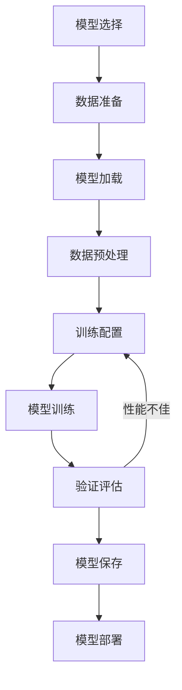

# 📘《大模型微调学习与实战手册》

> 系统学习见下文各章；日常常用 API 与使用场景速查见同目录《常用API与使用场景》。

------

# 🌱 第1章：大模型微调概述

本章在整体中解决大模型微调的基础认知问题，为后续章节的具体微调方法和实战应用打基础。通过本章学习，你将理解微调的核心概念、价值和主要类型，建立对大模型微调的整体认知框架。

------

## 1️⃣ 什么是大模型微调

### （1）基本概念

- **微调**（Fine-tuning）是指在预训练模型的基础上，使用特定领域或任务的数据进行进一步训练，以适应特定需求的过程。
- **核心思想**：利用预训练模型已学习的通用知识，通过少量特定数据的训练，使模型在目标任务上表现更优。

> 💬 **一句话总结**：微调是让预训练模型通过特定数据的学习，从"通用"走向"专用"的过程。

### （2）微调的必要性

| 场景 | 预训练模型表现 | 微调后效果 |
|------|----------------|------------|
| 专业领域问答 | 可能缺乏领域知识，产生幻觉 | 准确回答领域问题，减少幻觉 |
| 特定格式生成 | 输出格式不稳定，不符合要求 | 稳定输出指定格式，如JSON、XML等 |
| 多语言翻译 | 小语种翻译质量差 | 提升小语种翻译准确性 |
| 代码生成 | 代码风格不统一，可能存在错误 | 生成符合项目风格的高质量代码 |

------

## 2️⃣ 微调的价值

### （1）核心价值

- **性能提升**：针对特定任务，微调后的模型性能通常显著优于零样本（zero-shot）或少样本（few-shot）能力。
- **知识注入**：将领域专业知识注入模型，减少模型幻觉，提高输出的准确性和可靠性。
- **风格定制**：定制模型输出风格，如专业、口语化、正式、幽默等，满足不同场景需求。
- **格式约束**：使模型输出符合特定格式要求，如JSON、XML、代码、表格等，提高输出的标准化程度。
- **效率提升**：相比从零训练模型，微调大大减少了训练时间和计算资源消耗。

### （2）商业价值

| 价值维度 | 具体表现 | 商业影响 |
|----------|----------|----------|
| 成本节约 | 减少计算资源和时间消耗 | 降低AI应用开发成本 |
| 效果提升 | 提高模型在特定任务上的表现 | 提升产品竞争力 |
| 定制化 | 满足特定业务场景需求 | 增强解决方案的针对性 |
| 快速迭代 | 快速适应业务变化和新需求 | 加速产品更新迭代 |

------

## 3️⃣ 微调类型

### （1）按参数更新范围分类

| 微调类型 | 原理 | 优点 | 缺点 | 适用场景 |
|----------|------|------|------|----------|
| **全参数微调** | 更新模型所有参数 | 效果最佳 | 计算成本高，内存需求大 | 有充足计算资源，追求最佳效果 |
| **参数高效微调（PEFT）** | 仅更新部分参数 | 计算成本低，内存需求小 | 效果略逊于全参数微调 | 计算资源有限，快速适应特定任务 |

### （2）按微调目标分类

| 微调类型 | 目标 | 数据要求 | 典型方法 |
|----------|------|----------|----------|
| **指令微调** | 提升模型理解和执行指令的能力 | 指令格式数据 | Alpaca、Stanford Alpaca |
| **领域微调** | 提升模型在特定领域的性能 | 领域相关数据 | 法律、医疗、金融等专业领域 |
| **对话微调** | 提升模型的对话能力 | 对话数据 | ChatGPT、Bard |
| **任务特定微调** | 针对特定任务优化 | 任务相关数据 | 机器翻译、摘要生成 |

### （3）常见PEFT方法对比

| PEFT方法 | 原理 | 内存节省 | 适用模型 |
|----------|------|----------|----------|
| **LoRA** | 低秩分解矩阵 | 约70-80% | 各类Transformer模型 |
| **QLoRA** | 4位量化+LoRA | 约90% | 7B-13B模型（消费级GPU） |
| **Prefix Tuning** | 可训练前缀嵌入 | 约60-70% | 自回归模型 |
| **P-Tuning v2** | 可训练prompt嵌入 | 约80-90% | 各类模型架构 |

------

# ✅ 本章小结

| 知识点 | 面试关键词 | 实际应用 |
|--------|------------|----------|
| 微调概念 | 预训练基础、特定数据、性能提升 | 定制化AI应用开发 |
| 微调价值 | 知识注入、风格定制、格式约束 | 专业领域问答系统 |
| 全参数微调 | 效果最佳、计算成本高 | 追求极致性能的场景 |
| PEFT方法 | 参数高效、内存节省 | 资源有限环境下的微调 |
| 指令微调 | 指令理解、泛化能力 | 通用对话助手 |
| 领域微调 | 领域知识、专业性能 | 法律、医疗等垂直领域 |

------

## ⚠️ 常见坑与注意点

1. **现象**：微调后模型性能反而下降。**原因**：数据质量差或数据量不足，导致模型过拟合或学习了错误模式。**正确做法**：确保数据质量，增加数据多样性，使用适当的正则化方法。

2. **现象**：微调过程中内存不足。**原因**：模型参数量大，全参数微调内存需求高。**正确做法**：使用PEFT方法（如LoRA、QLoRA），或采用混合精度训练、梯度累积等技术。

3. **现象**：微调后模型泛化能力差。**原因**：训练数据分布与真实场景差异大，或过拟合训练数据。**正确做法**：增加数据多样性，使用验证集监控，采用早停策略。

4. **现象**：微调后的模型在某些输入上表现不稳定。**原因**：训练数据覆盖不全，边缘情况处理不当。**正确做法**：增加边缘情况数据，增强数据多样性。

5. **现象**：微调速度过慢。**原因**：硬件资源不足，或训练参数配置不当。**正确做法**：使用更强大的硬件，优化训练参数，或使用PEFT方法。

------

**学习要点**：
- 理解微调的核心概念和价值，明确微调与预训练的关系。
- 掌握不同微调类型的适用场景，根据实际需求选择合适的微调方法。
- 了解PEFT方法的原理和优势，在资源有限的情况下优先考虑。
- 注意数据质量对微调效果的影响，确保数据准备工作的充分性。
- 本章为后续章节的具体微调方法和实战应用奠定基础，后续将学习全参数微调和PEFT的具体实现。

------

## 🎯 面试常见追问

| 面试官提问 | 回答思路 |
|------------|----------|
| 什么是大模型微调？为什么需要微调？ | 定义：在预训练基础上用特定数据进一步训练；原因：提升特定任务性能、注入领域知识、定制输出风格等 |
| 全参数微调和PEFT有什么区别？ | 全参数：更新所有参数，效果好但成本高；PEFT：仅更新部分参数，成本低但效果略逊 |
| LoRA的原理是什么？有什么优势？ | 原理：低秩分解矩阵；优势：内存节省、训练速度快、可与其他方法结合 |
| 如何选择合适的微调方法？ | 根据计算资源、任务需求、模型大小综合考虑 |
| 微调过程中常见的问题有哪些？ | 内存不足、过拟合、泛化能力差、性能下降等 |

------

------

# 🌱 第2章：微调准备工作

本章解决大模型微调前的准备工作，包括数据、硬件和软件三个核心方面。充分的准备工作是微调成功的基础，直接影响微调效果和效率。通过本章学习，你将掌握微调前的各项准备工作要点，为后续的微调实践做好充分准备。

------

## 1️⃣ 数据准备

### （1）数据类型

| 数据类型 | 格式 | 用途 | 示例 |
|----------|------|------|------|
| **监督微调数据** | 输入-输出对 | 直接指导模型学习特定任务 | 问题-答案、指令-响应、翻译对 |
| **偏好对齐数据** | 偏好排序/对比 | 用于RLHF，引导模型输出符合人类偏好 | 多个回答的排序、对比数据 |
| **无监督微调数据** | 领域文本 | 领域适应，让模型学习领域语言 | 法律文本、医学文献、代码库 |
| **指令格式数据** | 指令+输入+输出 | 提升模型理解和执行指令的能力 | Alpaca、Stanford Alpaca格式 |

### （2）数据质量要求

> 💡 **重点**：数据质量是微调成功的关键，低质量数据可能导致模型性能下降甚至学习错误模式。

| 质量维度 | 要求 | 具体措施 |
|----------|------|----------|
| **准确性** | 数据正确，无错误或误导性内容 | 人工审核、自动校验、交叉验证 |
| **多样性** | 覆盖不同场景、格式和边缘情况 | 数据采样策略、多源数据整合 |
| **代表性** | 数据能代表目标任务或领域 | 领域专家参与、数据分布分析 |
| **一致性** | 数据格式和标注标准一致 | 统一标注规范、格式校验 |
| **充足性** | 数据量满足微调需求 | 根据模型大小和任务复杂度确定 |

### （3）数据处理流程

1. **数据收集**：
   - 公开数据集：Hugging Face Datasets、GitHub等
   - 内部数据：企业文档、对话记录等
   - 网络爬取：遵守法律法规，合理爬取

2. **数据清洗**：
   - 去除噪声：过滤无关内容、特殊字符
   - 去重：删除重复数据
   - 格式统一：标准化数据格式
   - 错误修正：修正数据中的错误

3. **数据格式化**：
   - 转换为模型所需格式：如JSON、CSV等
   - 指令微调格式：指令+输入+输出
   - Tokenization：根据模型tokenizer进行处理

4. **数据分割**：
   - 训练集：70-80%
   - 验证集：10-15%
   - 测试集：10-15%
   - 确保分布一致：各集合数据分布相似

5. **数据增强**：
   - 文本增强：同义词替换、语序调整、回译等
   - 任务特定增强：如问答数据的paraphrasing
   - 边缘情况生成：针对特殊场景生成数据

### （4）数据准备示例

```python
# 示例：准备指令微调数据
import json
import pandas as pd

# 1. 读取原始数据
data = pd.read_csv('raw_data.csv')

# 2. 数据清洗
data = data.dropna()  # 去除空值
data = data.drop_duplicates()  # 去重

# 3. 格式化为指令格式
instructions = []
for _, row in data.iterrows():
    instruction = {
        "instruction": row['instruction'],
        "input": row['input'],
        "output": row['output']
    }
    instructions.append(instruction)

# 4. 数据分割
train_size = int(len(instructions) * 0.8)
val_size = int(len(instructions) * 0.1)
train_data = instructions[:train_size]
val_data = instructions[train_size:train_size+val_size]
test_data = instructions[train_size+val_size:]

# 5. 保存数据
with open('train_data.json', 'w', encoding='utf-8') as f:
    json.dump(train_data, f, ensure_ascii=False, indent=2)

with open('val_data.json', 'w', encoding='utf-8') as f:
    json.dump(val_data, f, ensure_ascii=False, indent=2)

with open('test_data.json', 'w', encoding='utf-8') as f:
    json.dump(test_data, f, ensure_ascii=False, indent=2)

print(f"数据准备完成：训练集{len(train_data)}条，验证集{len(val_data)}条，测试集{len(test_data)}条")
```

------

## 2️⃣ 硬件准备

### （1）硬件需求

| 模型大小 | 全参数微调内存需求 | PEFT微调内存需求 | 推荐GPU |
|----------|-------------------|------------------|----------|
| 7B | 至少40GB | 至少8GB | A100 (80GB)、H100 (80GB) |
| 13B | 至少80GB | 至少12GB | A100 (80GB)、H100 (80GB) |
| 34B | 至少200GB | 至少24GB | H100 (80GB) x 3、A100 (80GB) x 3 |
| 70B | 至少400GB | 至少48GB | H100 (80GB) x 5、A100 (80GB) x 5 |

> ⚠️ **注意**：实际内存需求会因batch size、序列长度等参数而变化，上述为最低要求。

### （2）硬件选择建议

| 场景 | 推荐配置 | 理由 |
|------|----------|------|
| 个人实验 | RTX 3090 (24GB)、RTX 4090 (24GB) | 适合7B模型的PEFT微调 |
| 小型团队 | A100 (40GB)、A100 (80GB) | 支持13B模型的全参数微调 |
| 企业级 | H100 (80GB)、A100 (80GB)集群 | 支持大型模型的全参数微调 |

### （3）硬件优化策略

- **混合精度训练**：使用FP16或BF16减少内存使用
- **梯度累积**：模拟更大的batch size，减少内存需求
- **模型并行**：对于超大模型，使用模型并行技术
- **CPU内存**：确保有足够的CPU内存用于数据加载和预处理
- **存储**：使用高速存储（如NVMe SSD）存放模型和数据

------

## 3️⃣ 软件准备

### （1）核心框架与库

| 软件 | 版本要求 | 用途 | 安装命令 |
|------|----------|------|----------|
| **Python** | 3.8+ | 基础编程语言 | `python --version` |
| **PyTorch** | 2.0+ | 深度学习框架 | `pip install torch torchvision torchaudio` |
| **Transformers** | 4.30+ | 预训练模型加载与微调 | `pip install transformers` |
| **PEFT** | 0.5+ | 参数高效微调方法 | `pip install peft` |
| **Accelerate** | 0.20+ | 训练加速与分布式训练 | `pip install accelerate` |
| **bitsandbytes** | 0.40+ | 模型量化 | `pip install bitsandbytes` |
| ** datasets** | 2.10+ | 数据集加载与处理 | `pip install datasets` |
| **tokenizers** | 0.13+ | 文本分词 | `pip install tokenizers` |
| **sentencepiece** | 0.1.99+ | 分词模型 | `pip install sentencepiece` |

### （2）环境配置示例

```bash
# 创建虚拟环境
python -m venv venv

# 激活环境
# Windows
venv\Scripts\activate
# Linux/Mac
source venv/bin/activate

# 安装依赖
pip install --upgrade pip
pip install torch torchvision torchaudio --index-url https://download.pytorch.org/whl/cu118
pip install transformers peft accelerate bitsandbytes datasets tokenizers sentencepiece

# 验证安装
python -c "import torch, transformers, peft; print('PyTorch version:', torch.__version__); print('Transformers version:', transformers.__version__); print('PEFT version:', peft.__version__); print('CUDA available:', torch.cuda.is_available())"
```

### （3）配置文件示例

```yaml
# training_config.yaml
model:
  name: "meta-llama/Llama-2-7b-hf"
  use_peft: true
  peft_method: "lora"
  lora_rank: 8
  lora_alpha: 16
  lora_dropout: 0.1

training:
  batch_size: 8
  gradient_accumulation_steps: 4
  learning_rate: 2e-5
  num_train_epochs: 3
  warmup_ratio: 0.05
  weight_decay: 0.01
  max_seq_length: 1024
  logging_steps: 100
  save_steps: 500
  evaluation_strategy: "steps"
  eval_steps: 500
  fp16: true

data:
  train_file: "train_data.json"
  validation_file: "val_data.json"
  test_file: "test_data.json"
  text_column: "input"
  label_column: "output"

output:
  output_dir: "./output"
  save_total_limit: 3
```

------

# ✅ 本章小结

| 知识点 | 面试关键词 | 实际应用 |
|--------|------------|----------|
| 数据准备 | 数据质量、数据处理、数据增强 | 指令微调数据构建 |
| 硬件需求 | GPU内存、混合精度、梯度累积 | 根据模型大小选择硬件 |
| 软件配置 | PyTorch、Transformers、PEFT | 搭建微调环境 |
| 数据格式 | 指令格式、监督数据、偏好数据 | 不同微调方法的数据准备 |
| 硬件优化 | 模型并行、存储优化、CPU内存 | 提升微调效率 |

------

## ⚠️ 常见坑与注意点

1. **现象**：数据质量差导致微调效果不佳。**原因**：数据中包含错误、噪声或不一致内容。**正确做法**：严格数据清洗，确保数据准确性和一致性。

2. **现象**：内存不足导致微调失败。**原因**：模型过大或batch size设置不当。**正确做法**：使用PEFT方法，启用混合精度训练，调整batch size和梯度累积步数。

3. **现象**：环境配置错误导致依赖冲突。**原因**：库版本不兼容或安装顺序不当。**正确做法**：使用虚拟环境，指定兼容的版本，按正确顺序安装依赖。

4. **现象**：数据量不足导致过拟合。**原因**：训练数据太少，模型记住了训练数据。**正确做法**：增加数据量，使用数据增强技术，添加正则化方法。

5. **现象**：数据分布不均导致模型偏见。**原因**：训练数据中某些类别或场景占比过高。**正确做法**：平衡数据分布，确保各类别数据量相对均衡。

------

**学习要点**：
- 数据准备是微调成功的基础，要重视数据质量和多样性。
- 根据模型大小和硬件条件选择合适的微调方法，优先考虑PEFT方法以节省资源。
- 正确配置软件环境，确保各库版本兼容。
- 硬件优化策略（如混合精度训练、梯度累积）可以显著提升微调效率。
- 本章为后续的具体微调实践提供了必要的准备工作，是微调成功的前提。

------

## 🎯 面试常见追问

| 面试官提问 | 回答思路 |
|------------|----------|
| 微调前需要做哪些准备工作？ | 数据准备（收集、清洗、格式化）、硬件准备（GPU内存）、软件准备（框架和库） |
| 如何评估数据质量？ | 准确性、多样性、代表性、一致性、充足性五个维度 |
| 7B模型微调需要什么样的硬件？ | 全参数微调至少40GB GPU内存，PEFT微调至少8GB GPU内存 |
| 数据增强有哪些方法？ | 文本增强（同义词替换、语序调整、回译）、任务特定增强 |
| 如何解决微调过程中的内存不足问题？ | 使用PEFT方法、混合精度训练、梯度累积、调整batch size |
| 指令微调的数据格式是什么样的？ | 指令+输入+输出的三元组格式 |

------

------

# 🌱 第3章：全参数微调节略

本章详细介绍全参数微调的策略和实践，包括基本流程、关键参数配置和实践建议。全参数微调虽然计算成本较高，但能获得最佳的微调效果，是追求极致性能场景的首选方法。通过本章学习，你将掌握全参数微调的核心技术和最佳实践。

------

## 1️⃣ 基本流程

### （1）流程概述

1. **模型选择**：选择合适的预训练模型，如Llama、GPT-J、BLOOM等。
2. **数据准备**：收集、清洗、格式化训练数据。
3. **模型加载**：加载预训练模型和tokenizer。
4. **数据预处理**：对数据进行tokenization和格式转换。
5. **训练配置**：设置学习率、batch size、训练轮数等参数。
6. **模型训练**：使用训练数据训练模型。
7. **验证评估**：使用验证集评估模型性能。
8. **模型保存**：保存微调后的模型权重。

### （2）流程图



### （3）代码示例

```python
# 示例：全参数微调代码
import torch
from transformers import AutoModelForCausalLM, AutoTokenizer, TrainingArguments, Trainer
from datasets import load_dataset

# 1. 加载模型和tokenizer
model_name = "meta-llama/Llama-2-7b-hf"
tokenizer = AutoTokenizer.from_pretrained(model_name)
model = AutoModelForCausalLM.from_pretrained(model_name, torch_dtype=torch.float16, device_map="auto")

# 2. 加载和预处理数据
dataset = load_dataset("json", data_files={"train": "train_data.json", "validation": "val_data.json"})

def preprocess_function(examples):
    inputs = [f"### Instruction:\n{instruction}\n### Input:\n{input}\n### Output:\n" for instruction, input in zip(examples["instruction"], examples["input"])]
    targets = [output for output in examples["output"]]
    model_inputs = tokenizer(inputs, max_length=1024, truncation=True, padding="max_length")
    labels = tokenizer(targets, max_length=512, truncation=True, padding="max_length")
    model_inputs["labels"] = labels["input_ids"]
    return model_inputs

processed_dataset = dataset.map(preprocess_function, batched=True)

# 3. 配置训练参数
training_args = TrainingArguments(
    output_dir="./output",
    num_train_epochs=3,
    per_device_train_batch_size=8,
    per_device_eval_batch_size=8,
    gradient_accumulation_steps=4,
    learning_rate=2e-5,
    warmup_ratio=0.05,
    weight_decay=0.01,
    logging_dir="./logs",
    logging_steps=100,
    evaluation_strategy="steps",
    eval_steps=500,
    save_strategy="steps",
    save_steps=500,
    save_total_limit=3,
    fp16=True,
    gradient_checkpointing=True,
)

# 4. 创建Trainer
trainer = Trainer(
    model=model,
    args=training_args,
    train_dataset=processed_dataset["train"],
    eval_dataset=processed_dataset["validation"],
    tokenizer=tokenizer,
)

# 5. 开始训练
trainer.train()

# 6. 保存模型
trainer.save_model("./final_model")
```

------

## 2️⃣ 关键参数

### （1）参数配置表

| 参数 | 推荐值 | 说明 | 调整策略 |
|------|--------|------|----------|
| **学习率** | 1e-5 ~ 1e-4 | 控制参数更新幅度 | 小模型用较大学习率，大模型用较小学习率 |
| **Batch Size** | 8 ~ 32 | 每次训练的样本数 | 根据GPU内存调整，内存不足时减小 |
| **训练轮数** | 3 ~ 10 | 训练数据的迭代次数 | 数据量小时增加轮数，防止过拟合 |
| **权重衰减** | 0.01 | 防止过拟合 | 数据量小时增大，数据量大时减小 |
| **梯度裁剪** | 1.0 | 防止梯度爆炸 | 训练不稳定时增大，稳定时减小 |
| **学习率调度** | cosine | 学习率变化策略 | 大多数场景使用cosine衰减 |
| **预热比例** | 0.05 ~ 0.1 | 学习率预热阶段比例 | 大模型建议使用预热 |
| **混合精度** | fp16 | 训练精度 | 内存不足时使用，可加速训练 |
| **梯度累积** | 4 ~ 8 | 模拟更大batch size | GPU内存不足时使用 |

### （2）参数调优建议

> 💡 **重点**：参数调优是一个迭代过程，需要根据训练过程中的表现不断调整。

1. **学习率选择**：
   - 初始学习率可设置为1e-5，观察训练过程
   - 如果损失下降缓慢，可适当增大学习率
   - 如果损失波动较大，可适当减小学习率

2. **Batch Size调整**：
   - 尽可能使用大的batch size，以获得更好的泛化能力
   - 内存不足时，使用梯度累积来模拟更大的batch size

3. **训练轮数确定**：
   - 使用验证集监控模型性能
   - 当验证集性能不再提升时，停止训练（早停策略）
   - 通常3-5轮即可获得较好效果

------

## 3️⃣ 实践建议

### （1）硬件优化

- **使用混合精度训练**：启用FP16或BF16，减少内存使用，加速训练
- **启用梯度检查点**：通过牺牲计算速度来减少内存使用
- **使用分布式训练**：多GPU并行训练，加速大模型微调
- **选择合适的GPU**：优先使用A100、H100等高性能GPU

### （2）训练监控

- **使用TensorBoard**：监控损失、学习率、准确率等指标
- **设置合理的日志频率**：及时发现训练中的问题
- **保存检查点**：定期保存模型，防止训练中断导致进度丢失
- **分析验证结果**：根据验证集性能调整训练策略

### （3）常见问题处理

| 问题 | 原因 | 解决方案 |
|------|------|----------|
| 内存不足 | 模型过大或batch size设置不当 | 减小batch size，使用梯度累积，启用混合精度 |
| 训练不稳定 | 学习率过大或梯度爆炸 | 减小学习率，启用梯度裁剪 |
| 过拟合 | 训练轮数过多或数据量不足 | 增加数据量，使用早停策略，增大权重衰减 |
| 损失不下降 | 学习率过小或数据质量差 | 增大学习率，检查数据质量 |
| 验证性能差 | 模型过拟合或验证集分布与训练集不同 | 增加数据多样性，调整正则化参数 |

------

# ✅ 本章小结

| 知识点 | 面试关键词 | 实际应用 |
|--------|------------|----------|
| 全参数微调流程 | 模型加载、数据预处理、训练配置 | 追求极致性能的场景 |
| 关键参数配置 | 学习率、batch size、权重衰减 | 根据硬件和数据调整 |
| 硬件优化 | 混合精度、梯度累积、分布式训练 | 提升训练效率 |
| 训练监控 | TensorBoard、检查点、早停策略 | 确保训练稳定性 |
| 问题处理 | 内存不足、训练不稳定、过拟合 | 快速定位和解决问题 |

------

## ⚠️ 常见坑与注意点

1. **现象**：训练过程中内存不足。**原因**：模型过大或batch size设置不当。**正确做法**：减小batch size，使用梯度累积，启用混合精度训练。

2. **现象**：训练 loss 波动较大。**原因**：学习率过大或数据质量差。**正确做法**：减小学习率，检查数据质量，使用学习率调度器。

3. **现象**：模型过拟合。**原因**：训练轮数过多或数据量不足。**正确做法**：使用早停策略，增加数据量，增大权重衰减。

4. **现象**：验证集性能与训练集性能差距大。**原因**：训练集和验证集分布不一致。**正确做法**：确保验证集与训练集分布相似，增加数据多样性。

5. **现象**：训练速度过慢。**原因**：硬件配置不足或训练参数设置不当。**正确做法**：使用更强大的GPU，启用混合精度训练，优化batch size。

------

**学习要点**：
- 全参数微调能获得最佳效果，但计算成本较高，需要充足的硬件资源。
- 合理配置训练参数是微调成功的关键，需要根据模型和数据特点进行调整。
- 硬件优化策略（如混合精度训练、梯度累积）可以显著提升训练效率。
- 训练监控和问题处理能力是确保微调成功的重要因素。
- 本章为全参数微调提供了完整的实践指南，下一章将介绍参数高效微调方法。

------

## 🎯 面试常见追问

| 面试官提问 | 回答思路 |
|------------|----------|
| 全参数微调的优缺点是什么？ | 优点：效果最佳；缺点：计算成本高，内存需求大 |
| 如何选择合适的学习率？ | 小模型用较大学习率（1e-4），大模型用较小学习率（1e-5），观察训练过程调整 |
| 梯度累积的原理是什么？ | 通过多次前向和反向传播，累积梯度后再更新参数，模拟更大的batch size |
| 如何防止过拟合？ | 使用早停策略、增大权重衰减、增加数据量、使用数据增强 |
| 混合精度训练的优势是什么？ | 减少内存使用，加速训练，对模型性能影响小 |
| 如何监控训练过程？ | 使用TensorBoard监控损失、学习率等指标，定期评估验证集性能 |

------

------

# 🌱 第4章：参数高效微调（PEFT）

本章介绍参数高效微调（PEFT）方法，这是一类仅更新部分模型参数的微调技术，旨在显著降低计算和存储成本。PEFT方法使大模型微调变得更加普及，可在消费级GPU上实现。通过本章学习，你将掌握PEFT的核心原理、常见方法和实践技巧。

------

## 1️⃣ PEFT 概述

### （1）基本概念

- **PEFT**（Parameter-Efficient Fine-Tuning）是一系列仅更新部分模型参数的微调方法，旨在降低计算和存储成本。
- **核心思想**：通过仅训练少量参数来适应特定任务，而不是更新模型的所有参数。
- **优势**：
  - 内存需求低，可在消费级GPU上微调大模型
  - 训练速度快，减少训练时间
  - 存储成本低，仅需保存少量参数
  - 可迁移性强，便于模型部署

> 💬 **一句话总结**：PEFT是通过训练少量参数来实现大模型高效微调的技术集合。

### （2）PEFT与全参数微调对比

| 对比维度 | 全参数微调 | PEFT |
|----------|------------|------|
| 参数更新 | 所有参数 | 部分参数 |
| 内存需求 | 高（40GB+） | 低（8GB+） |
| 训练速度 | 慢 | 快 |
| 存储成本 | 高 | 低 |
| 效果 | 最佳 | 接近全参数微调 |
| 硬件要求 | 高性能GPU | 消费级GPU |

------

## 2️⃣ 常见 PEFT 方法

### （1）LoRA（Low-Rank Adaptation）

#### 原理
- **核心思想**：在模型的每一层注入低秩分解矩阵，仅训练这些低秩矩阵。
- **数学原理**：对于预训练权重矩阵  W n athbb{R}^{d 	imes k} ，LoRA 引入两个低秩矩阵  A n athbb{R}^{d 	imes r}  和  B n athbb{R}^{r 	imes k} ，其中  r l d, k 。微调时，仅更新  A  和  B ，原始权重  W  保持不变。
- **前向传播**： h = xW + xAB = x(W + AB) 

#### 关键参数
- **秩（rank）**：通常为4-64，值越大效果越好但内存消耗也越大
- **alpha**：控制缩放因子，通常设置为rank的2-4倍
- **dropout**：防止过拟合，通常为0.05-0.1

#### 代码示例

```python
# 示例：使用LoRA微调模型
from transformers import AutoModelForCausalLM, AutoTokenizer
from peft import LoraConfig, get_peft_model

# 加载模型和tokenizer
model_name = "meta-llama/Llama-2-7b-hf"
tokenizer = AutoTokenizer.from_pretrained(model_name)
model = AutoModelForCausalLM.from_pretrained(model_name, torch_dtype=torch.float16, device_map="auto")

# 配置LoRA
lora_config = LoraConfig(
    r=8,  # 秩
    lora_alpha=16,  # 缩放因子
    target_modules=["q_proj", "k_proj", "v_proj", "o_proj"],  # 目标模块
    lora_dropout=0.1,  # dropout
    bias="none"  # 偏置处理
)

# 创建PEFT模型
peft_model = get_peft_model(model, lora_config)

# 查看可训练参数
print(f"可训练参数: {sum(p.numel() for p in peft_model.parameters() if p.requires_grad)}")
print(f"总参数: {sum(p.numel() for p in peft_model.parameters())}")
```

### （2）QLoRA（Quantized LoRA）

#### 原理
- **核心思想**：在LoRA基础上，对预训练模型进行4位量化，进一步减少内存使用。
- **量化技术**：使用NF4（Normalized Float 4）量化，保持模型性能的同时减少内存占用。
- **内存节省**：相比全参数微调，可节省约90%的内存。

#### 关键参数
- **量化类型**：通常为nf4（Normalized Float 4）
- **秩（rank）**：同LoRA，通常为4-64
- **alpha**：同LoRA，控制缩放因子
- **double_quant**：是否使用双量化，进一步减少内存

#### 代码示例

```python
# 示例：使用QLoRA微调模型
from transformers import AutoModelForCausalLM, AutoTokenizer
from peft import LoraConfig, get_peft_model
import torch

# 加载模型（4位量化）
model_name = "meta-llama/Llama-2-7b-hf"
tokenizer = AutoTokenizer.from_pretrained(model_name)
model = AutoModelForCausalLM.from_pretrained(
    model_name,
    torch_dtype=torch.float16,
    device_map="auto",
    load_in_4bit=True,  # 启用4位量化
    bnb_4bit_quant_type="nf4",  # 量化类型
    bnb_4bit_use_double_quant=True,  # 双量化
    bnb_4bit_compute_dtype=torch.float16  # 计算 dtype
)

# 配置LoRA
lora_config = LoraConfig(
    r=8,
    lora_alpha=16,
    target_modules=["q_proj", "k_proj", "v_proj", "o_proj"],
    lora_dropout=0.1,
    bias="none"
)

# 创建PEFT模型
peft_model = get_peft_model(model, lora_config)
```

### （3）Prefix Tuning

#### 原理
- **核心思想**：在输入序列前添加可训练的前缀嵌入，仅训练这些前缀。
- **适用场景**：主要适用于自回归模型，如GPT系列。
- **优势**：可控制生成风格，适用于文本生成任务。

#### 关键参数
- **prefix_length**：前缀长度，通常为10-100
- **prefix_hidden_size**：前缀隐藏层维度，通常为模型隐藏层维度的1/2
- **num_virtual_tokens**：虚拟token数量，同prefix_length

### （4）P-Tuning v2

#### 原理
- **核心思想**：使用可训练的prompt嵌入，适用于各种模型架构。
- **优势**：参数效率高，性能好，适用于多种模型类型。
- **适用场景**：分类、问答、摘要等多种任务。

#### 关键参数
- **num_virtual_tokens**：虚拟token数量，通常为10-20
- **prompt_tuning_init**：prompt初始化方式，如"random"或"text"
- **token_dim**：token维度，通常与模型隐藏层维度相同

------

## 3️⃣ PEFT 实践

### （1）方法选择

| 场景 | 推荐方法 | 理由 |
|------|----------|------|
| 消费级GPU（8GB内存） | QLoRA | 内存需求最低，可微调7B模型 |
| 中等GPU（16GB内存） | LoRA | 平衡效果和内存使用 |
| 自回归模型 | Prefix Tuning | 专为自回归模型设计 |
| 多种模型架构 | P-Tuning v2 | 通用性强，适用于多种模型 |

### （2）训练流程

1. **模型加载**：加载预训练模型和tokenizer
2. **PEFT配置**：选择合适的PEFT方法并配置参数
3. **模型包装**：使用get_peft_model包装模型
4. **数据处理**：同全参数微调
5. **训练配置**：设置训练参数
6. **模型训练**：执行训练过程
7. **模型保存**：保存PEFT权重

### （3）模型合并与部署

```python
# 示例：合并PEFT权重到原始模型
from transformers import AutoModelForCausalLM, AutoTokenizer
from peft import PeftModel

# 加载原始模型
base_model_name = "meta-llama/Llama-2-7b-hf"
base_model = AutoModelForCausalLM.from_pretrained(
    base_model_name,
    torch_dtype=torch.float16,
    device_map="auto"
)
tokenizer = AutoTokenizer.from_pretrained(base_model_name)

# 加载PEFT权重
peft_model_id = "./output"
merged_model = PeftModel.from_pretrained(base_model, peft_model_id)

# 合并权重
merged_model = merged_model.merge_and_unload()

# 保存合并后的模型
merged_model.save_pretrained("./merged_model")
tokenizer.save_pretrained("./merged_model")
```

### （4）性能评估

| PEFT方法 | 内存节省 | 性能损失 | 适用场景 |
|----------|----------|----------|----------|
| LoRA | 约70-80% | 轻微 | 有中等GPU资源 |
| QLoRA | 约90% | 轻微 | 消费级GPU |
| Prefix Tuning | 约60-70% | 中等 | 自回归模型 |
| P-Tuning v2 | 约80-90% | 轻微 | 多种模型架构 |

------

# ✅ 本章小结

| 知识点 | 面试关键词 | 实际应用 |
|--------|------------|----------|
| PEFT概述 | 参数高效、内存节省、训练速度快 | 资源有限环境下的微调 |
| LoRA | 低秩分解、r值、alpha参数 | 平衡效果和内存使用 |
| QLoRA | 4位量化、NF4、双量化 | 消费级GPU微调大模型 |
| Prefix Tuning | 前缀嵌入、自回归模型 | 文本生成任务 |
| P-Tuning v2 | 虚拟token、通用性强 | 多种模型架构和任务 |
| 模型合并 | 权重合并、部署优化 | 模型部署和推理 |

------

## ⚠️ 常见坑与注意点

1. **现象**：PEFT模型效果不如全参数微调。**原因**：秩设置过小或训练数据不足。**正确做法**：适当增大秩值，增加训练数据量，延长训练时间。

2. **现象**：QLoRA训练速度过慢。**原因**：量化和反量化操作增加了计算开销。**正确做法**：使用更大的batch size，启用混合精度训练。

3. **现象**：模型合并失败。**原因**：PEFT版本不兼容或模型路径错误。**正确做法**：确保PEFT版本与训练时一致，检查模型路径是否正确。

4. **现象**：PEFT模型部署后性能下降。**原因**：推理环境与训练环境不一致。**正确做法**：确保推理环境与训练环境使用相同的库版本和配置。

5. **现象**：训练过程中出现NaN或梯度爆炸。**原因**：学习率过大或数据质量差。**正确做法**：减小学习率，检查数据质量，启用梯度裁剪。

------

**学习要点**：
- PEFT方法通过仅训练少量参数，显著降低了微调的计算和存储成本。
- LoRA和QLoRA是目前最常用的PEFT方法，适用于大多数场景。
- QLoRA使消费级GPU微调大模型成为可能，大大降低了微调的硬件门槛。
- 模型合并是PEFT部署的重要步骤，确保模型在推理时的性能。
- 选择合适的PEFT方法和参数配置是微调成功的关键。

------

## 🎯 面试常见追问

| 面试官提问 | 回答思路 |
|------------|----------|
| PEFT是什么？有什么优势？ | 定义：参数高效微调；优势：内存需求低、训练速度快、存储成本低、可在消费级GPU上运行 |
| LoRA的原理是什么？ | 在模型层注入低秩分解矩阵，仅训练这些矩阵，保持原始权重不变 |
| QLoRA如何进一步减少内存使用？ | 在LoRA基础上使用4位量化（NF4），进一步减少内存需求 |
| 如何选择合适的PEFT方法？ | 根据硬件条件、模型类型和任务需求选择，如消费级GPU选择QLoRA |
| PEFT模型如何部署？ | 需要将PEFT权重合并到原始模型中，然后保存为完整模型 |
| PEFT与全参数微调的效果差异有多大？ | 效果接近全参数微调，内存和计算成本显著降低 |

------

------

# 🌱 第5章：指令微调

本章详细介绍指令微调的原理和实践，这是一种通过指令格式数据提升模型泛化能力的重要微调方法。指令微调使模型能够更好地理解和执行各种任务指令，是现代大语言模型能力提升的关键技术之一。通过本章学习，你将掌握指令微调的核心概念、数据格式、实践方法和评估策略。

------

## 1️⃣ 指令微调概述

### （1）基本概念

- **指令微调**（Instruction Tuning）是使用指令格式的数据对模型进行微调，使模型更好地理解和执行各种指令。
- **核心思想**：通过让模型学习遵循指令的模式，提升其泛化能力，使其能够处理未见过的任务。
- **目的**：
  - 提升模型的指令理解能力
  - 增强模型的泛化能力
  - 使模型能够处理多样化的任务
  - 减少模型的偏见和错误

> 💬 **一句话总结**：指令微调是通过让模型学习遵循指令的模式，提升其处理多样化任务能力的微调方法。

### （2）指令微调的价值

| 价值维度 | 具体表现 | 应用场景 |
|----------|----------|----------|
| **泛化能力** | 能够处理未见过的任务 | 通用AI助手 |
| **指令理解** | 更好地理解用户意图 | 对话系统 |
| **任务多样性** | 支持多种任务类型 | 多功能AI工具 |
| **输出一致性** | 输出更加符合用户期望 | 专业领域应用 |

------

## 2️⃣ 指令数据格式

### （1）标准格式

- **基本结构**：指令 + 输入（可选） + 输出
- **格式示例**：
  ```
  指令：总结以下文本
  输入：大模型是指参数量巨大、训练数据丰富的人工智能模型，具有强大的语言理解和生成能力，在自然语言处理、计算机视觉等领域有广泛应用。
  输出：大模型是参数量巨大、数据丰富的AI模型，具有强大的语言理解和生成能力，应用广泛。
  ```

### （2）数据格式变体

| 格式类型 | 结构 | 适用场景 |
|----------|------|----------|
| **标准格式** | 指令 + 输入 + 输出 | 大多数任务 |
| **无输入格式** | 指令 + 输出 | 不需要额外输入的任务 |
| **多轮对话格式** | 指令 + 多轮对话 | 对话系统 |
| **领域特定格式** | 领域指令 + 输入 + 输出 | 专业领域任务 |

### （3）数据格式示例

```json
// 标准格式
{
  "instruction": "解释什么是机器学习",
  "input": "请用简单易懂的语言解释机器学习的基本概念",
  "output": "机器学习是一种让计算机从数据中学习规律，而不需要明确编程的人工智能技术。它通过算法分析数据，识别模式，并利用这些模式来预测未来或做出决策。"
}

// 无输入格式
{
  "instruction": "生成一个关于友谊的名言",
  "input": "",
  "output": "真正的友谊是一株缓慢生长的植物，需要时间的滋养和考验。"
}

// 多轮对话格式
{
  "instruction": "作为客服代表回答用户问题",
  "input": "用户：我的订单什么时候能发货？\n客服：您好，请问您的订单号是多少？\n用户：123456789",
  "output": "您好，我查询到您的订单123456789将在24小时内发货，预计3-5个工作日送达。"
}
```

------

## 3️⃣ 指令数据集

### （1）开源数据集

| 数据集 | 规模 | 特点 | 适用场景 |
|--------|------|------|----------|
| **Alpaca** | 52K | 由GPT-3.5生成的指令数据 | 通用指令微调 |
| **Stanford Alpaca** | 52K | Alpaca的改进版本 | 通用指令微调 |
| **GPT-4-LLM** | 100K | 由GPT-4生成的指令数据 | 高质量指令微调 |
| **SuperNI** | 300K | 多样化的指令数据 | 增强泛化能力 |
| **InstructGPT** | 人工标注 | 高质量人工标注数据 | 专业场景 |

### （2）自定义数据集构建

#### 构建步骤
1. **确定任务类型**：明确需要支持的任务类型
2. **收集基础数据**：收集相关领域的文本数据
3. **生成指令**：为每个任务生成清晰的指令
4. **标注输出**：为每个指令-输入对标注高质量输出
5. **数据清洗**：去除噪声和错误数据
6. **数据增强**：通过数据增强技术扩充数据集

#### 数据质量要求
- **指令清晰**：指令应明确、具体，避免歧义
- **输入多样**：输入应覆盖不同场景和边缘情况
- **输出高质量**：输出应准确、完整、符合要求
- **格式一致**：数据格式应统一，便于模型学习

------

## 4️⃣ 指令微调实践

### （1）微调流程

1. **数据准备**：
   - 选择或构建指令数据集
   - 数据清洗和格式化
   - 数据分割（训练集、验证集、测试集）

2. **模型选择**：
   - 选择合适的预训练模型（如Llama、GPT-J等）
   - 确定微调方法（全参数或PEFT）

3. **训练配置**：
   - 设置学习率、batch size等参数
   - 配置训练环境

4. **模型训练**：
   - 执行微调过程
   - 监控训练进度和性能

5. **模型评估**：
   - 使用未见指令任务评估模型性能
   - 分析模型的泛化能力

6. **模型部署**：
   - 保存微调后的模型
   - 部署模型服务

### （2）代码示例

```python
# 示例：指令微调代码
import torch
from transformers import AutoModelForCausalLM, AutoTokenizer, TrainingArguments, Trainer
from datasets import load_dataset

# 1. 加载模型和tokenizer
model_name = "meta-llama/Llama-2-7b-hf"
tokenizer = AutoTokenizer.from_pretrained(model_name)
model = AutoModelForCausalLM.from_pretrained(model_name, torch_dtype=torch.float16, device_map="auto")

# 2. 加载数据集
dataset = load_dataset("json", data_files={"train": "instruction_data.json"})

# 3. 数据预处理
def preprocess_function(examples):
    # 构建输入格式
    inputs = []
    for instruction, input_text in zip(examples["instruction"], examples["input"]):
        if input_text:
            prompt = f"### Instruction:\n{instruction}\n### Input:\n{input_text}\n### Output:\n"
        else:
            prompt = f"### Instruction:\n{instruction}\n### Output:\n"
        inputs.append(prompt)
    
    # 分词
    model_inputs = tokenizer(inputs, max_length=1024, truncation=True, padding="max_length")
    labels = tokenizer(examples["output"], max_length=512, truncation=True, padding="max_length")
    model_inputs["labels"] = labels["input_ids"]
    return model_inputs

processed_dataset = dataset.map(preprocess_function, batched=True)

# 4. 配置训练参数
training_args = TrainingArguments(
    output_dir="./instruction_tuned_model",
    num_train_epochs=3,
    per_device_train_batch_size=8,
    gradient_accumulation_steps=4,
    learning_rate=2e-5,
    warmup_ratio=0.05,
    weight_decay=0.01,
    logging_dir="./logs",
    logging_steps=100,
    save_strategy="steps",
    save_steps=500,
    save_total_limit=3,
    fp16=True,
)

# 5. 创建Trainer
trainer = Trainer(
    model=model,
    args=training_args,
    train_dataset=processed_dataset["train"],
    tokenizer=tokenizer,
)

# 6. 开始训练
trainer.train()

# 7. 保存模型
trainer.save_model("./instruction_tuned_model")
```

### （3）最佳实践

- **数据多样性**：确保指令数据覆盖多种任务类型和场景
- **数据质量**：保证指令清晰、输入多样、输出高质量
- **模型选择**：根据硬件条件选择合适的模型和微调方法
- **训练参数**：合理设置学习率、batch size等参数
- **评估全面**：使用多种未见任务评估模型的泛化能力

------

# ✅ 本章小结

| 知识点 | 面试关键词 | 实际应用 |
|--------|------------|----------|
| 指令微调概念 | 指令格式、泛化能力、任务多样性 | 通用AI助手 |
| 数据格式 | 指令+输入+输出、多轮对话格式 | 对话系统 |
| 开源数据集 | Alpaca、GPT-4-LLM、SuperNI | 快速构建指令数据 |
| 自定义数据集 | 任务类型、数据质量、数据增强 | 领域特定应用 |
| 微调流程 | 数据准备、模型选择、训练配置 | 实际微调项目 |
| 评估策略 | 未见任务、泛化能力、性能分析 | 模型质量保证 |

------

## ⚠️ 常见坑与注意点

1. **现象**：模型对复杂指令理解能力差。**原因**：训练数据中复杂指令占比不足。**正确做法**：增加复杂指令的比例，提高数据多样性。

2. **现象**：模型输出与指令要求不符。**原因**：指令描述不清晰或输出标注质量差。**正确做法**：优化指令描述，提高标注质量。

3. **现象**：模型泛化能力不足。**原因**：训练数据覆盖的任务类型不够多样。**正确做法**：增加任务类型，扩充数据集规模。

4. **现象**：训练过程中loss下降缓慢。**原因**：学习率设置不当或数据质量差。**正确做法**：调整学习率，检查并优化数据质量。

5. **现象**：模型在某些领域表现差。**原因**：训练数据中领域相关指令不足。**正确做法**：增加领域特定的指令数据。

------

**学习要点**：
- 指令微调是提升模型泛化能力的重要方法，通过学习遵循指令的模式，使模型能够处理多样化的任务。
- 数据质量是指令微调成功的关键，需要确保指令清晰、输入多样、输出高质量。
- 选择合适的模型和微调方法，根据硬件条件和任务需求进行调整。
- 全面评估模型性能，使用未见任务测试模型的泛化能力。
- 指令微调是构建通用AI助手的核心技术，掌握其原理和实践方法对于大模型应用开发至关重要。

------

## 🎯 面试常见追问

| 面试官提问 | 回答思路 |
|------------|----------|
| 什么是指令微调？它的目的是什么？ | 定义：使用指令格式数据微调模型；目的：提升模型的指令理解能力和泛化能力 |
| 指令数据的标准格式是什么？ | 指令+输入（可选）+输出的三元组格式 |
| 常用的指令数据集有哪些？ | Alpaca、Stanford Alpaca、GPT-4-LLM、SuperNI等 |
| 如何构建高质量的指令数据集？ | 确定任务类型、收集基础数据、生成清晰指令、标注高质量输出、数据清洗和增强 |
| 指令微调和普通微调有什么区别？ | 指令微调专注于提升模型理解和执行指令的能力，泛化能力更强 |
| 如何评估指令微调模型的性能？ | 使用未见指令任务评估模型的泛化能力，分析模型在不同任务类型上的表现 |

------

------

# 🌱 第6章：领域微调

本章详细介绍领域微调的原理和实践，这是一种针对特定领域优化模型性能的微调方法。领域微调使模型能够更好地理解和处理特定领域的知识和任务，是构建专业AI应用的关键技术。通过本章学习，你将掌握领域微调的核心概念、数据收集方法、微调策略和实践技巧。

------

## 1️⃣ 领域微调概述

### （1）基本概念

- **领域微调**：使用特定领域的数据对模型进行微调，提升模型在该领域的性能。
- **核心思想**：让模型学习领域特定的语言、知识和任务模式，使其在该领域的表现更加专业和准确。
- **适用场景**：
  - 法律领域：法律文书分析、法律咨询
  - 医疗领域：医学文献理解、诊断辅助
  - 金融领域：金融分析、风险评估
  - 技术领域：代码生成、技术文档理解
  - 教育领域：教育内容生成、个性化辅导

> 💬 **一句话总结**：领域微调是通过特定领域数据的学习，使模型在该领域表现更加专业和准确的微调方法。

### （2）领域微调的价值

| 价值维度 | 具体表现 | 应用场景 |
|----------|----------|----------|
| **领域知识** | 掌握领域专业知识，减少幻觉 | 专业咨询服务 |
| **语言风格** | 适应领域特定的语言风格和术语 | 专业文档生成 |
| **任务性能** | 提升领域特定任务的性能 | 领域专用工具 |
| **用户体验** | 提供更符合领域期望的输出 | 专业应用产品 |

------

## 2️⃣ 领域数据收集

### （1）数据来源

| 数据来源 | 特点 | 适用场景 | 注意事项 |
|----------|------|----------|----------|
| **公开数据集** | 易于获取，覆盖范围广 | 通用领域 | 可能存在质量问题 |
| **内部数据** | 针对性强，质量高 | 企业内部应用 | 需要数据脱敏处理 |
| **网络爬取** | 数据量大，更新及时 | 公开领域信息 | 需遵守法律法规 |
| **专业数据库** | 质量高，结构化好 | 学术、医疗等领域 | 可能需要付费获取 |
| **人工标注** | 质量最高，针对性强 | 特定任务 | 成本较高 |

### （2）数据类型

- **文本数据**：领域相关的文档、论文、报告等
- **对话数据**：领域相关的对话记录、客服日志等
- **结构化数据**：领域相关的表格、数据库等
- **多模态数据**：领域相关的图像、音频等（如医疗影像）

### （3）数据收集策略

1. **确定数据需求**：明确需要的数据类型和规模
2. **制定收集计划**：确定数据来源和收集方法
3. **执行数据收集**：按照计划收集数据
4. **数据清洗**：去除噪声、重复和无关内容
5. **数据标注**：对需要标注的数据进行专业标注
6. **数据验证**：确保数据质量和准确性

### （4）数据质量评估

| 评估维度 | 评估方法 | 改进措施 |
|----------|----------|----------|
| **准确性** | 专家审核、自动校验 | 人工修正、增加验证步骤 |
| **完整性** | 覆盖率分析、缺失值检查 | 补充缺失数据、扩大数据源 |
| **一致性** | 格式检查、逻辑验证 | 统一格式、建立数据标准 |
| **代表性** | 分布分析、覆盖度评估 | 增加样本多样性、平衡数据分布 |
| **时效性** | 时间戳分析、更新频率 | 定期更新数据、使用最新资料 |

------

## 3️⃣ 领域微调策略

### （1）微调方法

| 微调方法 | 原理 | 适用场景 | 优点 |
|----------|------|----------|------|
| **无监督微调** | 使用领域文本进行自监督学习 | 领域语言适应 | 数据需求低，易于实现 |
| **监督微调** | 使用领域特定的任务数据进行监督学习 | 特定任务优化 | 效果明显，针对性强 |
| **混合微调** | 结合无监督和监督数据进行微调 | 综合性能提升 | 兼顾语言适应和任务性能 |
| **多阶段微调** | 先无监督适应，再监督优化 | 复杂领域任务 | 效果最佳，步骤清晰 |

### （2）多阶段微调流程

1. **预训练模型选择**：选择适合领域的预训练模型
2. **无监督领域适应**：使用领域文本进行无监督微调
3. **监督任务微调**：使用标注数据进行任务特定微调
4. **模型评估**：使用领域特定指标评估模型性能
5. **模型优化**：根据评估结果调整微调策略

### （3）代码示例

```python
# 示例：领域微调代码
import torch
from transformers import AutoModelForCausalLM, AutoTokenizer, TrainingArguments, Trainer
from datasets import load_dataset

# 1. 加载模型和tokenizer
model_name = "meta-llama/Llama-2-7b-hf"
tokenizer = AutoTokenizer.from_pretrained(model_name)
model = AutoModelForCausalLM.from_pretrained(model_name, torch_dtype=torch.float16, device_map="auto")

# 2. 加载领域数据
# 无监督领域适应数据
unsupervised_dataset = load_dataset("text", data_files={"train": "domain_texts.txt"})
# 监督任务数据
supervised_dataset = load_dataset("json", data_files={"train": "domain_tasks.json"})

# 3. 无监督领域适应
def unsupervised_preprocess(examples):
    inputs = tokenizer(examples["text"], max_length=512, truncation=True, padding="max_length")
    inputs["labels"] = inputs["input_ids"].copy()
    return inputs

processed_unsupervised = unsupervised_dataset.map(unsupervised_preprocess, batched=True)

# 4. 监督任务微调
def supervised_preprocess(examples):
    inputs = [f"### Instruction:\n{instruction}\n### Input:\n{input}\n### Output:\n" for instruction, input in zip(examples["instruction"], examples["input"])]
    model_inputs = tokenizer(inputs, max_length=1024, truncation=True, padding="max_length")
    labels = tokenizer(examples["output"], max_length=512, truncation=True, padding="max_length")
    model_inputs["labels"] = labels["input_ids"]
    return model_inputs

processed_supervised = supervised_dataset.map(supervised_preprocess, batched=True)

# 5. 第一阶段：无监督领域适应
unsupervised_args = TrainingArguments(
    output_dir="./domain_adaptation",
    num_train_epochs=1,
    per_device_train_batch_size=8,
    gradient_accumulation_steps=4,
    learning_rate=1e-5,
    warmup_ratio=0.05,
    weight_decay=0.01,
    logging_dir="./logs",
    logging_steps=100,
    save_strategy="epoch",
    fp16=True,
)

unsupervised_trainer = Trainer(
    model=model,
    args=unsupervised_args,
    train_dataset=processed_unsupervised["train"],
    tokenizer=tokenizer,
)

unsupervised_trainer.train()

# 6. 第二阶段：监督任务微调
supervised_args = TrainingArguments(
    output_dir="./domain_task_tuning",
    num_train_epochs=3,
    per_device_train_batch_size=8,
    gradient_accumulation_steps=4,
    learning_rate=2e-5,
    warmup_ratio=0.05,
    weight_decay=0.01,
    logging_dir="./logs",
    logging_steps=100,
    save_strategy="steps",
    save_steps=500,
    save_total_limit=3,
    fp16=True,
)

supervised_trainer = Trainer(
    model=model,
    args=supervised_args,
    train_dataset=processed_supervised["train"],
    tokenizer=tokenizer,
)

supervised_trainer.train()

# 7. 保存模型
supervised_trainer.save_model("./domain_tuned_model")
```

------

## 4️⃣ 实践建议

### （1）数据准备

- **数据质量**：确保领域数据质量高，符合领域规范
- **数据量**：根据模型大小和任务复杂度，通常需要几千到几万条数据
- **数据多样性**：覆盖领域内的不同场景和边缘情况
- **数据标注**：对于监督微调，确保标注质量高、一致性好

### （2）模型选择

- **预训练模型**：选择与领域相关的预训练模型，如技术领域可选择CodeLlama
- **微调方法**：根据硬件条件和任务需求选择合适的微调方法
- **参数配置**：根据领域特点调整训练参数

### （3）评估策略

- **领域特定指标**：使用领域相关的评估指标，如医疗领域的诊断准确率
- **专家评估**：邀请领域专家对模型输出进行评估
- **对比评估**：与通用模型和其他领域模型进行对比
- **A/B测试**：在实际应用中进行A/B测试，评估用户体验

### （4）部署建议

- **模型量化**：使用模型量化减少推理内存和计算需求
- **服务优化**：针对领域特点优化服务部署
- **监控机制**：建立模型性能监控机制，及时发现问题
- **持续更新**：定期使用新的领域数据更新模型

------

# ✅ 本章小结

| 知识点 | 面试关键词 | 实际应用 |
|--------|------------|----------|
| 领域微调概念 | 特定领域、专业知识、语言适应 | 专业AI应用 |
| 数据收集 | 公开数据集、内部数据、网络爬取 | 领域数据构建 |
| 微调策略 | 无监督微调、监督微调、混合微调 | 领域性能优化 |
| 多阶段微调 | 领域适应、任务微调、性能评估 | 复杂领域任务 |
| 评估方法 | 领域特定指标、专家评估、A/B测试 | 模型质量保证 |
| 部署优化 | 模型量化、服务优化、持续更新 | 实际应用部署 |

------

## ⚠️ 常见坑与注意点

1. **现象**：领域微调后模型在通用任务上性能下降。**原因**：过度拟合领域数据，失去了通用能力。**正确做法**：平衡领域数据和通用数据的比例，避免过度拟合。

2. **现象**：模型在领域内的边缘情况表现差。**原因**：训练数据未覆盖边缘情况。**正确做法**：增加边缘情况数据，提高数据多样性。

3. **现象**：领域微调效果不明显。**原因**：数据质量差或数据量不足。**正确做法**：提高数据质量，增加数据量，优化微调策略。

4. **现象**：模型输出不符合领域规范。**原因**：训练数据中领域规范的示例不足。**正确做法**：增加符合领域规范的示例，邀请领域专家审核数据。

5. **现象**：微调后模型推理速度变慢。**原因**：模型参数增加或计算复杂度提高。**正确做法**：使用模型量化、知识蒸馏等技术优化推理速度。

------

**学习要点**：
- 领域微调是提升模型在特定领域性能的重要方法，通过学习领域特定的知识和语言模式，使模型表现更加专业。
- 数据质量和多样性是领域微调成功的关键，需要确保数据符合领域规范且覆盖各种场景。
- 多阶段微调策略（先无监督领域适应，再监督任务微调）通常能获得最佳效果。
- 领域特定的评估指标和专家评估是确保模型质量的重要手段。
- 持续更新和优化是保持领域模型性能的关键，需要定期使用新的领域数据更新模型。

------

## 🎯 面试常见追问

| 面试官提问 | 回答思路 |
|------------|----------|
| 什么是领域微调？它的目的是什么？ | 定义：使用特定领域数据微调模型；目的：提升模型在该领域的性能和专业性 |
| 领域微调与通用微调有什么区别？ | 领域微调专注于特定领域的知识和任务，通用微调注重泛化能力 |
| 如何收集和处理领域数据？ | 数据来源：公开数据集、内部数据、网络爬取；处理：清洗、标注、验证 |
| 领域微调的常见策略有哪些？ | 无监督微调、监督微调、混合微调、多阶段微调 |
| 如何评估领域微调模型的性能？ | 使用领域特定指标、专家评估、对比评估、A/B测试 |
| 领域微调可能面临哪些挑战？ | 数据质量问题、过度拟合、边缘情况处理、推理速度下降等 |

------

------

# 🌱 第7章：评估与验证

本章详细介绍大模型微调后的评估与验证方法，这是确保模型质量和性能的关键环节。评估与验证不仅可以衡量微调效果，还可以指导模型优化和改进。通过本章学习，你将掌握大模型评估的核心指标、方法和策略，确保微调后的模型能够满足实际应用需求。

------

## 1️⃣ 评估指标

### （1）通用指标

| 指标 | 描述 | 计算方法 | 适用场景 |
|------|------|----------|----------|
| **困惑度（Perplexity）** | 衡量模型预测的不确定性 | 模型对测试数据的对数似然的负平均值 | 语言建模任务 |
| **BLEU** | 评估生成文本与参考文本的相似度 | 计算n-gram匹配率 | 机器翻译、文本生成 |
| **ROUGE** | 评估摘要质量 | 计算召回率（ROUGE-1, ROUGE-2, ROUGE-L） | 文本摘要 |
| **BERTScore** | 使用BERT嵌入计算文本相似度 | 计算生成文本与参考文本的嵌入相似度 | 多种生成任务 |
| **F1分数** | 综合准确率和召回率 | 2 * (精确率 * 召回率) / (精确率 + 召回率) | 分类任务 |

### （2）任务特定指标

| 任务类型 | 评估指标 | 计算方法 | 示例 |
|----------|----------|----------|------|
| **问答任务** | 准确率（Exact Match） | 生成答案与标准答案完全匹配的比例 | SQuAD数据集评估 |
| **问答任务** | F1分数 | 计算答案的词级匹配度 | SQuAD数据集评估 |
| **文本分类** | 准确率、精确率、召回率 | 分类模型的性能指标 | 情感分析、主题分类 |
| **代码生成** | 代码可执行性 | 生成代码能够成功运行的比例 | CodeXGLUE数据集评估 |
| **代码生成** | 功能正确性 | 生成代码实现指定功能的比例 | CodeXGLUE数据集评估 |
| **对话系统** | 对话质量 | 人工评估对话的连贯性、相关性等 | 对话系统评估 |

### （3）人工评估指标

| 评估维度 | 描述 | 评分标准 | 适用场景 |
|----------|------|----------|----------|
| **相关性** | 输出与输入的相关程度 | 1-5分，5分表示完全相关 | 所有生成任务 |
| **准确性** | 输出内容的正确程度 | 1-5分，5分表示完全正确 | 知识密集型任务 |
| **流畅度** | 输出语言的自然程度 | 1-5分，5分表示非常流畅 | 文本生成任务 |
| **风格一致性** | 输出风格与要求的一致程度 | 1-5分，5分表示完全一致 | 风格定制任务 |
| **有用性** | 输出对用户的帮助程度 | 1-5分，5分表示非常有用 | 实际应用场景 |

------

## 2️⃣ 评估方法

### （1）自动评估

- **优势**：快速、客观、可重复
- **劣势**：可能无法捕捉生成内容的质量和相关性
- **实施步骤**：
  1. 准备测试数据集
  2. 运行模型生成输出
  3. 使用评估指标计算性能
  4. 分析评估结果

### （2）人工评估

- **优势**：能够评估自动指标无法捕捉的质量维度
- **劣势**：耗时、成本高、主观
- **实施步骤**：
  1. 设计评估问卷
  2. 选择评估人员（领域专家或目标用户）
  3. 准备测试样本
  4. 进行评估并收集反馈
  5. 分析评估结果

### （3）对比评估

- **优势**：直观展示模型性能差异
- **劣势**：需要基准模型
- **实施步骤**：
  1. 选择基准模型（如原始预训练模型、其他微调模型）
  2. 在相同测试集上评估所有模型
  3. 对比各模型的性能指标
  4. 分析性能差异的原因

### （4）代码示例

```python
# 示例：使用BLEU和ROUGE评估文本生成模型
from datasets import load_metric
from transformers import AutoModelForCausalLM, AutoTokenizer

# 加载模型和tokenizer
model_name = "./fine_tuned_model"
tokenizer = AutoTokenizer.from_pretrained(model_name)
model = AutoModelForCausalLM.from_pretrained(model_name)

# 加载评估指标
bleu = load_metric("bleu")
rouge = load_metric("rouge")

# 测试数据
test_data = [
    {"input": "总结以下文本：大模型是指参数量巨大、训练数据丰富的人工智能模型，具有强大的语言理解和生成能力。", "reference": "大模型是参数量巨大、数据丰富的AI模型，具有强大的语言理解和生成能力。"},
    {"input": "解释什么是机器学习：", "reference": "机器学习是一种让计算机从数据中学习规律，而不需要明确编程的人工智能技术。"}
]

# 生成输出
predictions = []
references = []

for item in test_data:
    input_text = item["input"]
    reference = item["reference"]
    
    # 生成输出
    inputs = tokenizer(input_text, return_tensors="pt")
    outputs = model.generate(**inputs, max_length=100, num_return_sequences=1)
    prediction = tokenizer.decode(outputs[0], skip_special_tokens=True)
    
    predictions.append(prediction)
    references.append([reference])
    
    print(f"输入: {input_text}")
    print(f"参考: {reference}")
    print(f"生成: {prediction}")
    print("---")

# 计算BLEU分数
bleu_results = bleu.compute(predictions=predictions, references=references)
print(f"BLEU分数: {bleu_results['bleu']:.4f}")

# 计算ROUGE分数
rouge_results = rouge.compute(predictions=predictions, references=references)
print(f"ROUGE-1: {rouge_results['rouge1'].mid.fmeasure:.4f}")
print(f"ROUGE-2: {rouge_results['rouge2'].mid.fmeasure:.4f}")
print(f"ROUGE-L: {rouge_results['rougeL'].mid.fmeasure:.4f}")
```

------

## 3️⃣ 验证策略

### （1）交叉验证

- **原理**：将数据集分为k个折叠，使用k-1个折叠进行训练，1个折叠进行验证
- **优势**：充分利用数据，评估模型稳定性
- **实施步骤**：
  1. 将数据集分为k个折叠
  2. 对每个折叠，训练模型并在该折叠上验证
  3. 计算k次验证的平均性能
  4. 分析模型的稳定性

### （2）测试集评估

- **原理**：使用独立的测试集评估模型泛化能力
- **优势**：客观评估模型在未见数据上的表现
- **实施步骤**：
  1. 准备独立的测试集（与训练集和验证集无重叠）
  2. 在训练和验证完成后，使用测试集评估模型
  3. 分析模型在测试集上的性能
  4. 评估模型的泛化能力

### （3）A/B测试

- **原理**：在实际应用中比较不同模型的性能
- **优势**：评估模型在真实场景中的表现
- **实施步骤**：
  1. 选择对比模型（如原始模型和微调模型）
  2. 在实际应用中部署两个模型
  3. 收集用户反馈和性能数据
  4. 分析两个模型的表现差异
  5. 做出模型选择决策

### （4）在线评估

- **原理**：在生产环境中实时评估模型性能
- **优势**：捕捉真实用户行为和反馈
- **实施步骤**：
  1. 部署模型到生产环境
  2. 收集用户交互数据和反馈
  3. 定期分析模型性能
  4. 根据反馈持续优化模型

------

# ✅ 本章小结

| 知识点 | 面试关键词 | 实际应用 |
|--------|------------|----------|
| 评估指标 | 困惑度、BLEU、ROUGE、F1分数 | 模型性能衡量 |
| 任务特定指标 | 准确率、精确率、召回率、代码可执行性 | 特定任务评估 |
| 人工评估 | 相关性、准确性、流畅度、风格一致性 | 质量维度评估 |
| 自动评估 | 快速、客观、可重复 | 批量评估 |
| 对比评估 | 基准模型、性能差异分析 | 模型选择 |
| 验证策略 | 交叉验证、测试集评估、A/B测试 | 模型稳定性和泛化能力 |

------

## ⚠️ 常见坑与注意点

1. **现象**：自动评估指标与人工评估结果不一致。**原因**：自动指标无法捕捉某些质量维度。**正确做法**：结合自动指标和人工评估，全面评估模型性能。

2. **现象**：测试集性能与实际应用性能差异大。**原因**：测试集与真实场景数据分布不同。**正确做法**：确保测试集能代表真实场景，使用A/B测试验证实际性能。

3. **现象**：模型在某些评估指标上表现好，但在其他指标上表现差。**原因**：不同指标衡量模型的不同方面。**正确做法**：根据任务需求选择合适的评估指标，综合考虑多个指标。

4. **现象**：人工评估结果主观性强，不同评估者意见不一致。**原因**：评估标准不明确或评估者背景不同。**正确做法**：制定详细的评估标准，选择合适的评估者，计算评估一致性。

5. **现象**：模型在验证集上性能好，但在测试集上性能差。**原因**：模型过拟合验证集。**正确做法**：使用交叉验证，避免过度调参，确保模型泛化能力。

------

**学习要点**：
- 评估与验证是确保模型质量的关键环节，需要选择合适的评估指标和方法。
- 不同任务需要使用不同的评估指标，如问答任务使用准确率和F1分数，文本生成任务使用BLEU和ROUGE。
- 自动评估和人工评估各有优势，应结合使用以获得全面的评估结果。
- 验证策略如交叉验证、测试集评估和A/B测试可以帮助评估模型的稳定性和泛化能力。
- 持续监控和评估模型性能，根据反馈进行优化，是确保模型长期保持良好表现的关键。

------

## 🎯 面试常见追问

| 面试官提问 | 回答思路 |
|------------|----------|----------|
| 如何评估大模型的性能？ | 结合自动评估指标（如BLEU、ROUGE）和人工评估，根据任务类型选择合适的指标 |
| 什么是困惑度（Perplexity）？它如何衡量模型性能？ | 困惑度衡量模型预测的不确定性，值越低表示模型预测越准确 |
| 自动评估和人工评估各有什么优缺点？ | 自动评估：快速、客观、可重复，但可能无法捕捉质量维度；人工评估：能评估质量维度，但耗时、主观 |
| 如何确保模型在真实场景中的表现？ | 使用A/B测试和在线评估，收集真实用户反馈，持续优化模型 |
| 什么是交叉验证？它的作用是什么？ | 将数据集分为k个折叠，使用k-1个训练，1个验证，评估模型稳定性和泛化能力 |
| 如何处理评估指标之间的冲突？ | 根据任务需求确定关键指标，综合考虑多个指标，进行权衡 |

------

------

# 🌱 第8章：微调工具与框架

本章详细介绍大模型微调中常用的工具与框架，这些工具和框架极大地简化了微调过程，提高了训练效率。通过本章学习，你将掌握主流微调工具的使用方法和最佳实践，为实际微调项目选择合适的工具。

------

## 1️⃣ Hugging Face Transformers

### （1）核心功能

- **模型加载**：支持加载各种预训练模型，如Llama、GPT、BLOOM等
- **Tokenization**：提供专业的文本分词功能，支持多种分词器
- **微调支持**：内置多种微调方法和训练器
- **模型部署**：支持模型导出和部署
- **生态系统**：丰富的模型库和数据集

### （2）优势

- **广泛的模型支持**：支持几乎所有主流大语言模型
- **易用性**：提供简洁的API，降低使用门槛
- **灵活性**：支持自定义训练流程和模型架构
- **社区活跃**：持续更新和改进
- **集成PEFT**：无缝集成参数高效微调方法

### （3）使用示例

```python
# 示例：使用Transformers进行模型微调
from transformers import AutoModelForCausalLM, AutoTokenizer, TrainingArguments, Trainer
from datasets import load_dataset

# 加载模型和tokenizer
model_name = "meta-llama/Llama-2-7b-hf"
tokenizer = AutoTokenizer.from_pretrained(model_name)
model = AutoModelForCausalLM.from_pretrained(model_name, torch_dtype=torch.float16, device_map="auto")

# 加载数据集
dataset = load_dataset("json", data_files={"train": "train_data.json"})

# 数据预处理
def preprocess_function(examples):
    inputs = [f"### Instruction:\n{instruction}\n### Input:\n{input}\n### Output:\n" for instruction, input in zip(examples["instruction"], examples["input"])]
    model_inputs = tokenizer(inputs, max_length=1024, truncation=True, padding="max_length")
    labels = tokenizer(examples["output"], max_length=512, truncation=True, padding="max_length")
    model_inputs["labels"] = labels["input_ids"]
    return model_inputs

processed_dataset = dataset.map(preprocess_function, batched=True)

# 配置训练参数
training_args = TrainingArguments(
    output_dir="./output",
    num_train_epochs=3,
    per_device_train_batch_size=8,
    gradient_accumulation_steps=4,
    learning_rate=2e-5,
    warmup_ratio=0.05,
    weight_decay=0.01,
    logging_dir="./logs",
    logging_steps=100,
    save_strategy="steps",
    save_steps=500,
    save_total_limit=3,
    fp16=True,
)

# 创建Trainer
trainer = Trainer(
    model=model,
    args=training_args,
    train_dataset=processed_dataset["train"],
    tokenizer=tokenizer,
)

# 开始训练
trainer.train()

# 保存模型
trainer.save_model("./fine_tuned_model")
```

------

## 2️⃣ PEFT 库

### （1）核心功能

- **LoRA**：低秩适应方法，减少可训练参数
- **QLoRA**：量化LoRA，进一步减少内存使用
- **Prefix Tuning**：前缀调优方法
- **P-Tuning v2**：可训练prompt嵌入
- **Adapter**：适配器方法

### （2）优势

- **与Transformers无缝集成**：直接使用Transformers的模型和训练流程
- **内存高效**：显著减少内存需求
- **易于使用**：简洁的API设计
- **支持多种方法**：覆盖主流PEFT技术
- **灵活配置**：支持各种参数调整

### （3）使用示例

```python
# 示例：使用PEFT进行LoRA微调
from transformers import AutoModelForCausalLM, AutoTokenizer
from peft import LoraConfig, get_peft_model
import torch

# 加载模型和tokenizer
model_name = "meta-llama/Llama-2-7b-hf"
tokenizer = AutoTokenizer.from_pretrained(model_name)
model = AutoModelForCausalLM.from_pretrained(model_name, torch_dtype=torch.float16, device_map="auto")

# 配置LoRA
lora_config = LoraConfig(
    r=8,  # 秩
    lora_alpha=16,  # 缩放因子
    target_modules=["q_proj", "k_proj", "v_proj", "o_proj"],  # 目标模块
    lora_dropout=0.1,  # dropout
    bias="none"  # 偏置处理
)

# 创建PEFT模型
peft_model = get_peft_model(model, lora_config)

# 查看可训练参数
print(f"可训练参数: {sum(p.numel() for p in peft_model.parameters() if p.requires_grad)}")
print(f"总参数: {sum(p.numel() for p in peft_model.parameters())}")

# 训练过程与普通Transformers训练相同
# ...

# 保存PEFT模型
peft_model.save_pretrained("./peft_model")
```

------

## 3️⃣ Accelerate

### （1）核心功能

- **分布式训练**：支持多GPU、多节点训练
- **混合精度训练**：自动处理FP16/BF16训练
- **梯度累积**：简化梯度累积配置
- **内存优化**：自动内存优化策略
- **硬件适配**：自动检测和适配硬件环境

### （2）优势

- **简化分布式训练**：无需手动配置分布式环境
- **提高训练效率**：自动优化训练流程
- **降低内存使用**：通过混合精度和内存优化减少内存需求
- **灵活性**：支持自定义训练循环
- **与Transformers兼容**：无缝集成Transformers

### （3）使用示例

```python
# 示例：使用Accelerate进行分布式训练
from accelerate import Accelerator
from transformers import AutoModelForCausalLM, AutoTokenizer, TrainingArguments, Trainer
from datasets import load_dataset

# 加载模型和tokenizer
model_name = "meta-llama/Llama-2-7b-hf"
tokenizer = AutoTokenizer.from_pretrained(model_name)
model = AutoModelForCausalLM.from_pretrained(model_name, torch_dtype=torch.float16)

# 加载数据集
dataset = load_dataset("json", data_files={"train": "train_data.json"})

# 数据预处理
def preprocess_function(examples):
    inputs = [f"### Instruction:\n{instruction}\n### Input:\n{input}\n### Output:\n" for instruction, input in zip(examples["instruction"], examples["input"])]
    model_inputs = tokenizer(inputs, max_length=1024, truncation=True, padding="max_length")
    labels = tokenizer(examples["output"], max_length=512, truncation=True, padding="max_length")
    model_inputs["labels"] = labels["input_ids"]
    return model_inputs

processed_dataset = dataset.map(preprocess_function, batched=True)

# 配置训练参数
training_args = TrainingArguments(
    output_dir="./output",
    num_train_epochs=3,
    per_device_train_batch_size=8,
    gradient_accumulation_steps=4,
    learning_rate=2e-5,
    warmup_ratio=0.05,
    weight_decay=0.01,
    logging_dir="./logs",
    logging_steps=100,
    save_strategy="steps",
    save_steps=500,
    save_total_limit=3,
    fp16=True,
)

# 创建Accelerator
accelerator = Accelerator()

# 准备模型、数据集和优化器
model, optimizer, train_dataset = accelerator.prepare(
    model, 
    torch.optim.AdamW(model.parameters(), lr=training_args.learning_rate),
    processed_dataset["train"]
)

# 训练循环
for epoch in range(training_args.num_train_epochs):
    model.train()
    for batch in train_dataset:
        outputs = model(**batch)
        loss = outputs.loss
        accelerator.backward(loss)
        optimizer.step()
        optimizer.zero_grad()

# 保存模型
accelerator.save_model(model, "./accelerate_model")
```

------

## 4️⃣ 其他工具

### （1）DeepSpeed

- **核心功能**：
  - ZeRO优化器：减少内存使用
  - 流水线并行：支持超大模型训练
  - 混合精度训练：提高训练速度
  - 内存优化：自动内存管理
- **优势**：
  - 支持超大模型训练
  - 显著减少内存使用
  - 提高训练速度
  - 与PyTorch无缝集成
- **使用场景**：大规模模型训练，如70B+参数模型

### （2）bitsandbytes

- **核心功能**：
  - 4位量化：将模型量化到4位精度
  - NF4量化：Normalized Float 4量化
  - 双量化：进一步减少内存使用
  - 与Transformers集成：无缝使用量化模型
- **优势**：
  - 显著减少内存使用（约90%）
  - 保持模型性能
  - 易于集成到现有代码
  - 支持主流模型架构
- **使用场景**：在消费级GPU上微调大模型

### （3）trlX

- **核心功能**：
  - 偏好对齐：支持基于人类反馈的强化学习
  - 对比学习：通过对比数据优化模型
  - 与Transformers集成：无缝使用
- **优势**：
  - 简化RLHF流程
  - 提供预训练的偏好模型
  - 支持多种模型架构
  - 易于扩展和定制
- **使用场景**：需要对齐人类偏好的模型微调

### （4）工具对比

| 工具 | 主要功能 | 优势 | 适用场景 |
|------|----------|------|----------|
| **Transformers** | 模型加载、微调、部署 | 支持多种模型，易用性高 | 大多数微调场景 |
| **PEFT** | 参数高效微调 | 内存节省，训练速度快 | 资源有限环境 |
| **Accelerate** | 分布式训练、混合精度 | 简化分布式配置，提高效率 | 大规模训练 |
| **DeepSpeed** | 内存优化、并行训练 | 支持超大模型，内存效率高 | 70B+参数模型 |
| **bitsandbytes** | 模型量化 | 显著减少内存使用 | 消费级GPU微调 |
| **trlX** | 偏好对齐、RLHF | 简化RLHF流程 | 人类偏好对齐 |

------

# ✅ 本章小结

| 知识点 | 面试关键词 | 实际应用 |
|--------|------------|----------|
| Transformers | 模型加载、tokenization、微调 | 大多数微调场景 |
| PEFT | LoRA、QLoRA、参数高效 | 资源有限环境 |
| Accelerate | 分布式训练、混合精度 | 大规模训练 |
| DeepSpeed | ZeRO、内存优化、并行训练 | 超大模型训练 |
| bitsandbytes | 4位量化、NF4、双量化 | 消费级GPU微调 |
| trlX | 偏好对齐、RLHF | 人类偏好对齐 |

------

## ⚠️ 常见坑与注意点

1. **现象**：Transformers模型加载失败。**原因**：模型路径错误或网络连接问题。**正确做法**：检查模型路径，确保网络连接正常，使用本地模型或正确的Hugging Face模型ID。

2. **现象**：PEFT模型合并失败。**原因**：PEFT版本不兼容或模型路径错误。**正确做法**：确保PEFT版本与训练时一致，检查模型路径是否正确。

3. **现象**：Accelerate分布式训练报错。**原因**：硬件配置不匹配或环境变量设置错误。**正确做法**：检查硬件配置，确保环境变量正确设置，使用合适的分布式策略。

4. **现象**：bitsandbytes量化后模型性能下降。**原因**：量化参数设置不当或模型不适合量化。**正确做法**：调整量化参数，选择合适的量化方法，评估量化对性能的影响。

5. **现象**：DeepSpeed训练速度慢。**原因**：配置不当或硬件资源不足。**正确做法**：优化DeepSpeed配置，确保硬件资源充足，使用合适的并行策略。

------

**学习要点**：
- 选择合适的工具和框架是微调成功的关键，需要根据硬件条件和任务需求进行选择。
- Transformers是基础工具，提供了完整的模型加载和微调功能。
- PEFT方法（如LoRA、QLoRA）是资源有限环境下的最佳选择。
- Accelerate和DeepSpeed适用于大规模模型训练，提高训练效率。
- bitsandbytes的量化功能使消费级GPU微调大模型成为可能。
- 工具的正确配置和使用是发挥其性能的关键，需要根据具体情况进行调整。

------

## 🎯 面试常见追问

| 面试官提问 | 回答思路 |
|------------|----------|----------|
| Hugging Face Transformers库的主要功能是什么？ | 模型加载、tokenization、微调支持、模型部署、丰富的生态系统 |
| PEFT库的作用是什么？它支持哪些方法？ | 提供参数高效微调方法，支持LoRA、QLoRA、Prefix Tuning、P-Tuning v2等 |
| Accelerate库的主要优势是什么？ | 简化分布式训练、自动处理混合精度、优化内存使用、与Transformers兼容 |
| DeepSpeed是什么？它适用于什么场景？ | 微软开发的深度学习优化库，支持ZeRO等技术，适用于超大模型训练 |
| bitsandbytes的主要功能是什么？ | 提供模型量化功能，支持4位量化，显著减少内存使用 |
| 如何选择合适的微调工具？ | 根据硬件条件、模型大小、任务需求选择，如资源有限使用PEFT，大规模训练使用Accelerate或DeepSpeed |

------

------

# 🌱 第9章：实战与最佳实践

本章详细介绍大模型微调的实战流程和最佳实践，通过实际案例和经验总结，帮助你掌握微调的完整流程和常见问题的解决方案。通过本章学习，你将能够独立完成大模型微调项目，并在实际应用中取得良好的效果。

------

## 1️⃣ 从零微调大模型

### （1）完整流程

1. **任务定义与目标设定**：
   - 明确微调的目标和任务类型
   - 确定评估指标和成功标准
   - 制定项目计划和时间线

2. **数据准备**：
   - 收集相关数据
   - 数据清洗和预处理
   - 数据格式化和分割
   - 数据质量评估

3. **模型选择**：
   - 根据任务和硬件条件选择预训练模型
   - 评估模型的适配性
   - 准备模型和tokenizer

4. **微调方法选择**：
   - 根据硬件条件选择微调方法（全参数或PEFT）
   - 配置微调参数
   - 准备训练环境

5. **模型训练**：
   - 执行训练过程
   - 监控训练进度和性能
   - 调整训练参数
   - 保存检查点

6. **评估与优化**：
   - 使用验证集评估模型性能
   - 分析模型的优势和不足
   - 优化模型和训练策略
   - 进行最终测试

7. **模型部署**：
   - 模型格式转换和优化
   - 部署模型服务
   - 监控和维护

### （2）实战案例：使用QLoRA微调Llama 2 7B模型

#### 案例背景
- **任务**：指令遵循能力提升
- **数据**：Alpaca格式的指令数据（52K条）
- **硬件**：RTX 3090（24GB内存）
- **目标**：提升模型的指令理解和执行能力

#### 实施步骤

1. **环境准备**：
   ```bash
   # 创建虚拟环境
   python -m venv venv
   venv\Scripts\activate
   
   # 安装依赖
   pip install --upgrade pip
   pip install torch torchvision torchaudio --index-url https://download.pytorch.org/whl/cu118
   pip install transformers peft accelerate bitsandbytes datasets tokenizers sentencepiece
   ```

2. **数据准备**：
   ```python
   # 下载并处理Alpaca数据集
   from datasets import load_dataset
   
   # 加载数据集
   dataset = load_dataset("tatsu-lab/alpaca")
   
   # 数据预处理
   def preprocess_function(examples):
       inputs = []
       for instruction, input_text, output in zip(examples["instruction"], examples["input"], examples["output"]):
           if input_text:
               prompt = f"### Instruction:\n{instruction}\n### Input:\n{input_text}\n### Output:\n"
           else:
               prompt = f"### Instruction:\n{instruction}\n### Output:\n"
           inputs.append(prompt)
       return {"input_text": inputs, "output": examples["output"]}
   
   processed_dataset = dataset.map(preprocess_function, batched=True)
   
   # 数据分割
   train_test_split = processed_dataset["train"].train_test_split(test_size=0.1)
   train_dataset = train_test_split["train"]
   val_dataset = train_test_split["test"]
   ```

3. **模型配置**：
   ```python
   from transformers import AutoModelForCausalLM, AutoTokenizer
   from peft import LoraConfig, get_peft_model
   import torch
   
   # 加载模型和tokenizer
   model_name = "meta-llama/Llama-2-7b-hf"
   tokenizer = AutoTokenizer.from_pretrained(model_name)
   model = AutoModelForCausalLM.from_pretrained(
       model_name,
       torch_dtype=torch.float16,
       device_map="auto",
       load_in_4bit=True,
       bnb_4bit_quant_type="nf4",
       bnb_4bit_use_double_quant=True,
       bnb_4bit_compute_dtype=torch.float16
   )
   
   # 配置LoRA
   lora_config = LoraConfig(
       r=8,
       lora_alpha=16,
       target_modules=["q_proj", "k_proj", "v_proj", "o_proj"],
       lora_dropout=0.1,
       bias="none"
   )
   
   # 创建PEFT模型
   peft_model = get_peft_model(model, lora_config)
   print(f"可训练参数: {sum(p.numel() for p in peft_model.parameters() if p.requires_grad)}")
   ```

4. **训练配置**：
   ```python
   from transformers import TrainingArguments, Trainer
   
   training_args = TrainingArguments(
       output_dir="./llama2_finetuned",
       num_train_epochs=3,
       per_device_train_batch_size=4,
       per_device_eval_batch_size=4,
       gradient_accumulation_steps=4,
       learning_rate=2e-5,
       warmup_ratio=0.05,
       weight_decay=0.01,
       logging_dir="./logs",
       logging_steps=100,
       evaluation_strategy="steps",
       eval_steps=500,
       save_strategy="steps",
       save_steps=500,
       save_total_limit=3,
       fp16=True,
   )
   
   # 数据分词
   def tokenize_function(examples):
       model_inputs = tokenizer(examples["input_text"], max_length=1024, truncation=True, padding="max_length")
       labels = tokenizer(examples["output"], max_length=512, truncation=True, padding="max_length")
       model_inputs["labels"] = labels["input_ids"]
       return model_inputs
   
   tokenized_train = train_dataset.map(tokenize_function, batched=True)
   tokenized_val = val_dataset.map(tokenize_function, batched=True)
   
   # 创建Trainer
   trainer = Trainer(
       model=peft_model,
       args=training_args,
       train_dataset=tokenized_train,
       eval_dataset=tokenized_val,
       tokenizer=tokenizer,
   )
   ```

5. **模型训练**：
   ```python
   # 开始训练
   trainer.train()
   
   # 保存模型
   trainer.save_model("./llama2_finetuned")
   ```

6. **模型评估**：
   ```python
   # 评估模型
   eval_result = trainer.evaluate()
   print(f"评估结果: {eval_result}")
   
   # 测试模型
   def test_model(prompt):
       inputs = tokenizer(prompt, return_tensors="pt").to(model.device)
       outputs = model.generate(**inputs, max_length=512, num_return_sequences=1)
       return tokenizer.decode(outputs[0], skip_special_tokens=True)
   
   # 测试示例
   test_prompt = "### Instruction:\n解释什么是机器学习\n### Output:\n"
   print(test_model(test_prompt))
   ```

7. **模型部署**：
   ```python
   # 合并模型权重
   from peft import PeftModel
   
   base_model = AutoModelForCausalLM.from_pretrained(
       model_name,
       torch_dtype=torch.float16,
       device_map="auto"
   )
   
   merged_model = PeftModel.from_pretrained(base_model, "./llama2_finetuned")
   merged_model = merged_model.merge_and_unload()
   
   # 保存合并后的模型
   merged_model.save_pretrained("./llama2_merged")
   tokenizer.save_pretrained("./llama2_merged")
   ```

------

## 2️⃣ 常见问题与解决方案

### （1）训练问题

| 问题 | 现象 | 原因 | 解决方案 |
|------|------|------|----------|
| **过拟合** | 训练集损失低，验证集损失高 | 训练数据量不足或模型过于复杂 | 增加数据量、使用正则化、早停策略、数据增强 |
| **训练不稳定** | 损失波动大或出现NaN | 学习率过大、梯度爆炸、数据质量差 | 减小学习率、使用梯度裁剪、检查数据质量 |
| **内存不足** | CUDA out of memory错误 | 模型过大、batch size设置不当 | 使用PEFT方法、混合精度训练、梯度累积、减小batch size |
| **训练速度慢** | 训练时间过长 | 硬件配置不足、参数设置不当 | 使用更强大的GPU、优化训练参数、启用混合精度 |
| **损失不下降** | 损失保持不变或上升 | 学习率过小、数据质量差、模型选择不当 | 调整学习率、检查数据质量、更换模型 |

### （2）模型性能问题

| 问题 | 现象 | 原因 | 解决方案 |
|------|------|------|----------|
| **输出质量差** | 生成内容不符合要求 | 数据质量差、训练不充分 | 提高数据质量、增加训练轮数、优化微调策略 |
| **泛化能力不足** | 在未见数据上表现差 | 训练数据覆盖不全、过拟合 | 增加数据多样性、使用正则化、减小模型复杂度 |
| **领域知识缺乏** | 领域相关问题回答错误 | 领域数据不足 | 增加领域数据、进行领域微调 |
| **指令理解能力差** | 无法正确执行指令 | 指令数据不足或质量差 | 增加指令数据、优化指令格式 |
| **生成不稳定** | 输出质量波动大 | 模型训练不稳定、数据不一致 | 优化训练参数、提高数据一致性 |

### （3）部署问题

| 问题 | 现象 | 原因 | 解决方案 |
|------|------|------|----------|
| **推理速度慢** | 响应时间长 | 模型过大、硬件不足 | 使用模型量化、知识蒸馏、优化服务配置 |
| **内存使用高** | 部署环境内存不足 | 模型未优化 | 使用模型量化、ONNX格式转换、合理配置服务 |
| **服务不稳定** | 服务崩溃或响应异常 | 资源配置不当、代码错误 | 优化资源配置、增加错误处理、监控服务状态 |
| **模型文件大** | 模型部署困难 | 模型未压缩 | 使用模型量化、知识蒸馏、模型剪枝 |
| **兼容性问题** | 不同环境下表现不一致 | 依赖版本不兼容 | 固定依赖版本、使用容器化部署 |

------

## 3️⃣ 最佳实践

### （1）数据准备

- **数据质量**：确保数据准确、多样、一致
- **数据量**：根据模型大小和任务复杂度，准备足够的数据
- **数据格式**：使用标准格式，如指令格式的三元组
- **数据增强**：通过数据增强技术扩充数据集
- **数据分割**：合理分割训练集、验证集和测试集

### （2）模型选择

- **预训练模型**：根据任务和硬件条件选择合适的预训练模型
- **微调方法**：资源有限时选择PEFT方法，追求最佳效果时使用全参数微调
- **模型大小**：根据硬件条件和推理速度要求选择合适的模型大小

### （3）训练配置

- **学习率**：根据模型大小和数据量选择合适的学习率
- **Batch Size**：根据GPU内存调整，使用梯度累积模拟更大的batch size
- **训练轮数**：根据数据量和模型复杂度确定，使用早停策略防止过拟合
- **混合精度**：启用FP16或BF16训练，减少内存使用
- **梯度裁剪**：防止梯度爆炸，提高训练稳定性

### （4）评估与优化

- **多维度评估**：使用自动指标和人工评估相结合的方式
- **对比评估**：与基准模型进行对比，评估改进效果
- **A/B测试**：在实际应用中进行A/B测试，评估用户体验
- **持续优化**：根据评估结果持续优化模型和训练策略

### （5）部署与监控

- **模型优化**：使用量化、蒸馏等技术优化模型
- **服务配置**：根据硬件条件和访问量优化服务配置
- **监控体系**：建立模型性能和服务状态的监控体系
- **持续更新**：定期使用新数据更新模型，保持模型性能

------

## 4️⃣ 面试要点

### （1）核心概念

- **微调原理**：预训练模型 + 特定数据 → 适应特定任务
- **PEFT方法**：LoRA、QLoRA等参数高效微调方法的原理和应用
- **数据准备**：数据收集、清洗、格式化的重要性
- **评估指标**：不同任务的评估指标和方法
- **部署优化**：模型量化、知识蒸馏等部署优化技术

### （2）技术细节

- **学习率调度**：不同学习率调度策略的适用场景
- **Batch Size选择**：如何根据硬件条件选择合适的batch size
- **梯度累积**：原理和使用方法
- **混合精度训练**：FP16/BF16的区别和应用
- **模型量化**：不同量化方法的原理和效果

### （3）问题解决

- **过拟合处理**：数据增强、正则化、早停策略等
- **内存不足解决**：PEFT方法、混合精度、梯度累积等
- **训练不稳定处理**：学习率调整、梯度裁剪、数据质量检查等
- **模型性能优化**：数据质量提升、微调策略调整、模型选择等

### （4）实战经验

- **端到端流程**：从数据准备到模型部署的完整流程
- **工具使用**：Transformers、PEFT、Accelerate等工具的使用经验
- **调参技巧**：根据实际情况调整训练参数的经验
- **性能评估**：模型性能评估的方法和指标

------

# ✅ 本章小结

| 知识点 | 面试关键词 | 实际应用 |
|--------|------------|----------|
| 微调流程 | 任务定义、数据准备、模型选择、训练、评估、部署 | 完整微调项目 |
| 实战案例 | QLoRA、Llama 2、指令微调 | 实际微调项目 |
| 常见问题 | 过拟合、内存不足、训练不稳定 | 问题定位和解决 |
| 最佳实践 | 数据质量、模型选择、训练配置、部署优化 | 项目优化 |
| 面试要点 | 核心概念、技术细节、问题解决、实战经验 | 面试准备 |

------

## ⚠️ 常见坑与注意点

1. **现象**：微调后模型性能不如预期。**原因**：数据质量差、训练不充分、参数配置不当。**正确做法**：提高数据质量、增加训练轮数、优化参数配置。

2. **现象**：训练过程中内存不足。**原因**：模型过大、batch size设置不当。**正确做法**：使用PEFT方法、混合精度训练、梯度累积、减小batch size。

3. **现象**：模型部署后推理速度慢。**原因**：模型未优化、服务配置不当。**正确做法**：使用模型量化、知识蒸馏、优化服务配置。

4. **现象**：模型在真实场景中表现差。**原因**：训练数据与真实场景数据分布不同。**正确做法**：确保训练数据能代表真实场景，使用A/B测试验证实际性能。

5. **现象**：微调过程中出现NaN或梯度爆炸。**原因**：学习率过大、数据质量差。**正确做法**：减小学习率、使用梯度裁剪、检查数据质量。

------

**学习要点**：
- 掌握大模型微调的完整流程，从任务定义到模型部署。
- 熟悉常见问题的识别和解决方案，提高微调成功率。
- 遵循最佳实践，优化微调过程和模型性能。
- 积累实战经验，为面试和实际项目做好准备。
- 持续学习和探索新的微调技术和方法，保持技术先进性。

------

## 🎯 面试常见追问

| 面试官提问 | 回答思路 |
|------------|----------|----------|
| 大模型微调的完整流程是什么？ | 任务定义→数据准备→模型选择→训练→评估→部署 |
| 如何解决微调过程中的内存不足问题？ | 使用PEFT方法（如LoRA、QLoRA）、混合精度训练、梯度累积、减小batch size |
| 如何防止模型过拟合？ | 增加数据量、使用数据增强、正则化、早停策略 |
| 如何评估微调模型的性能？ | 结合自动评估指标（如BLEU、ROUGE）和人工评估，根据任务类型选择合适的指标 |
| 部署大模型时需要注意什么？ | 模型优化（量化、蒸馏）、服务配置、监控体系、持续更新 |
| QLoRA的原理是什么？它有什么优势？ | 在LoRA基础上使用4位量化，进一步减少内存使用，使消费级GPU微调大模型成为可能 |

------

------

## 附录

- 常用 API 与使用场景速查见同目录《常用API与使用场景》。
