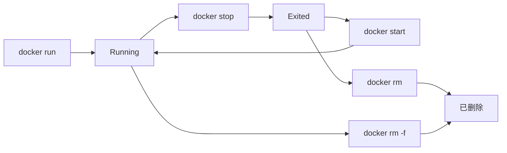

# 📗 Docker 学习与实战手册

> 系统学习见下文各章；日常常用命令与场景速查见同目录《常用命令与使用场景》。

------

## 第一章：Docker 概述与基础认知

------

> **本章在整体中解决什么问题**：建立对 **Docker** 的整体认知——诞生背景、与**虚拟机**的区别、核心理念（**一次构建到处运行**）、三大核心组件（**镜像、容器、仓库**）及在 DevOps、微服务中的价值。学完本章后**第二章**会讲**安装与环境配置**（daemon、镜像加速、常见问题）；**第三章**会讲**镜像**的分层、命令与优化；**第四章**会讲**容器**的生命周期、Namespace/CGroup、持久化，为后续 Dockerfile、Compose 打基础。

------

### 1.1 Docker 的诞生与发展背景

#### （1）传统部署痛点

| 痛点 | 说明 |
|------|------|
| **环境差异** | 开发、测试、生产环境不一致，「在我机器上能跑」问题频发。 |
| **依赖复杂** | 不同服务依赖不同版本 JDK、Redis、Nginx 等，部署困难。 |
| **部署周期长** | 每次上线重新配置环境，易出错、效率低。 |
| **资源浪费** | 虚拟机动辄数 GB，占用大量资源。 |

#### （2）容器化与 Docker

- **容器** ≈ 轻量级虚拟化：不虚拟完整操作系统，只隔离进程与资源，共享宿主机内核。
- **2008** 年 Google 公开 **Borg** 思想；**2013** 年 **Docker** 将容器技术标准化、开源化，极大降低使用门槛。
- 发展历程：2013 开源（基于 LXC）→ 2014 Docker Hub → 2015 Docker Compose → 2016 Swarm → 2017+ 与 Kubernetes/OCI 融合，成为云原生核心组件之一。

> 💬 **一句话**：Docker 把「应用 + 依赖 + 环境」打包成**镜像**，在任何装有 Docker 的主机上**一致运行**，解决环境一致性与部署效率问题。

------

### 1.2 虚拟机 vs 容器

#### （1）虚拟机（VM）

- 在宿主机上运行**完整操作系统**（如 CentOS），每个 VM 有**独立内核与资源**。
- 通过 **Hypervisor（虚拟机监控器）** 管理 CPU、内存、磁盘等虚拟化。

#### （2）容器（Container）

- **共享宿主机内核**，只做**进程级隔离**（**Namespace**）与**资源限制**（**CGroup**）。
- 不启动新 OS，本质是宿主机上的进程 + 隔离视图。

#### （3）核心对比

| 对比项 | 虚拟机（VM） | 容器（Docker） |
|--------|--------------|-----------------|
| **启动速度** | 分钟级（需启动 OS） | 秒级（启动进程） |
| **资源占用** | 高，每 VM 一套完整系统 | 低，共享内核 |
| **隔离性** | 强（硬件级） | 较强（进程级） |
| **镜像体积** | 几 GB | 几十 MB 级 |
| **迁移性** | 依赖硬件与 OS | 跨平台、可移植 |
| **典型场景** | 大隔离系统、多 OS 混合 | 微服务、快速交付、CI/CD |

> 💡 **面试记忆**：「虚拟机隔离系统，容器隔离进程」；「虚拟机重、容器轻；虚拟机慢、容器快」。

------

### 1.3 核心理念：一次构建，到处运行

- **Build Once, Run Anywhere**：将应用及依赖打包为**镜像（Image）**，在任意装有 Docker 的主机上以**相同环境**运行**容器**。
- **关键机制**：**镜像**（静态模板）→ **容器**（运行实例）；**仓库**（集中存储镜像）。

| 机制 | 说明 |
|------|------|
| **镜像 Image** | 应用及运行环境的静态模板，分层、只读、可复用。 |
| **容器 Container** | 镜像的运行实例，有独立文件系统与运行状态。 |
| **仓库 Repository** | 集中存放镜像（Docker Hub、阿里云、Harbor 等）。 |

**实际意义**：环境统一、快速交付、易于回滚、部署可重复。

------

### 1.4 Docker 的三大核心组件

#### （1）镜像（Image）

- **定义**：包含应用及运行环境的**静态模板**，**分层存储**（UnionFS），只读、可复用、可缓存。
- 常用命令示例：

```bash
docker pull redis:7.0
docker images
docker inspect redis:7.0
```

#### （2）容器（Container）

- **定义**：镜像的**运行实例**，轻量级进程隔离，可快速启停删。
- 常用命令示例：

```bash
docker run -d -p 6379:6379 redis:7.0
docker ps -a
docker exec -it <container_id> bash
docker stop <container_id>
```

#### （3）仓库（Repository）

- **定义**：集中存放镜像的服务；**公共**（Docker Hub、阿里云镜像）；**私有**（Harbor、Registry）。
- 常用操作：`docker push`、`docker pull`，命名规范：仓库/项目/镜像:tag。

**三者关系**：Dockerfile 构建 → 镜像 → 运行实例化 → 容器；镜像可存储在仓库中供拉取。

------

### 1.5 优势与适用场景

| 优势 | 说明 |
|------|------|
| **轻量** | 无完整 OS，资源占用少。 |
| **高性能** | 启动快、运行快、迁移方便。 |
| **一致性** | 消除环境差异。 |
| **可移植** | 任意主机运行同一镜像。 |
| **易集成** | 与 CI/CD、K8s、云原生融合。 |

| 典型场景 | 说明 |
|----------|------|
| **微服务部署** | 每服务一容器，如 Redis + MySQL + Spring Boot + Nginx 组合。 |
| **CI/CD** | Jenkins + Docker 自动化构建与发布。 |
| **本地开发/测试** | Docker Compose 一键启动依赖服务。 |
| **云端与弹性伸缩** | K8s 中容器扩缩容。 |
| **快速回滚** | 版本镜像管理，随时恢复。 |

------

### 1.6 Docker 与 DevOps、微服务

- **DevOps**：开发与运维一体化，快速、稳定交付；Docker 提供**环境一致、自动化构建、CI/CD 流水线**支撑（代码提交 → Jenkins 构建 → Docker 打包 → 推送仓库 → 服务器拉取运行）。
- **微服务**：服务多、依赖复杂、部署频繁；Docker 实现**每服务独立容器化**，易组合、扩展、隔离，与 Spring Cloud、Nginx、Redis 等配合。

------

## ✅ 本章小结

| 知识点 | 面试关键词 | 实际应用 |
|--------|------------|----------|
| **Docker 是什么** | 容器技术、轻量虚拟化、镜像+容器+仓库 | 理解定位与价值 |
| **与虚拟机区别** | 共享内核、进程级隔离、Namespace+CGroup、轻快 | 选型与原理回答 |
| **核心理念** | 一次构建到处运行、镜像即环境 | 说明一致性来源 |
| **三大组件** | Image、Container、Repository | 概念与命令对应 |
| **场景** | 微服务、CI/CD、环境统一 | 项目落地表述 |

------

**学习要点**：

- Docker 解决环境一致性、部署复杂、资源浪费；容器共享内核，比虚拟机轻、快。
- 镜像 = 静态模板，容器 = 运行实例，仓库 = 集中存储；Dockerfile 构建镜像，run 产生容器。
- 能说清 Docker 在 DevOps、微服务中的作用（环境一致、自动化、独立部署）。

------

## 🎯 面试常见追问

| 面试官提问 | 回答思路 |
|------------|----------|
| Docker 和虚拟机的区别？ | 虚拟机是完整 OS、独立内核、重量级、分钟级启动；容器共享宿主机内核，Namespace+CGroup 进程级隔离，轻量、秒级启动；虚拟机隔离系统，容器隔离进程。 |
| 为什么 Docker 启动快？ | 不启动新操作系统，只是启动进程 + 隔离视图，无内核启动开销。 |
| Docker 如何实现资源隔离？ | **Namespace** 隔离进程、网络、挂载等；**CGroup** 限制 CPU、内存等资源。 |
| 「一次构建，到处运行」怎么实现？ | 把应用与依赖打包成镜像（分层、只读），镜像在任何 Docker 主机上以相同方式运行容器，环境一致。 |

------

### 常见坑与注意点

| 现象 / 易错点 | 原因 | 怎么改 / 怎么记 |
|---------------|------|-----------------|
| 面试把 Docker 说成「轻量虚拟机」 | 容易和 VM 混为一谈 | **虚拟机**隔离完整 OS、独立内核；**容器**共享宿主机内核，**Namespace + CGroup** 进程级隔离，记「虚拟机隔离系统，容器隔离进程」。 |
| 说不清镜像和容器的关系 | 概念混淆 | **镜像** = 静态模板（只读、分层）；**容器** = 镜像的运行实例；类比「类与对象」或「安装包与运行中的程序」。 |
| 生产环境直接用 Docker 不规划资源 | 容器默认不限制 CPU/内存 | 用 **-m、--cpus** 或 **CGroup** 限制资源，避免单容器吃满宿主机；第二章装好后，第四章会讲资源限制。 |

------

### 与前后章的衔接

- **下一章**：第二章 **安装与环境配置** 讲 Engine/Desktop 安装、daemon.json、镜像加速与常见问题；**第三章**在此基础上讲**镜像**的分层、命令与优化；**第四章**讲**容器**的生命周期与隔离机制。

------

## 第二章：Docker 安装与环境配置

------

> **本章在整体中解决什么问题**：第一章讲了 Docker 的定位与三大组件；本章落实**环境搭建**——Docker 的安装方式（Engine/Desktop）、**daemon** 配置与**镜像加速**、安装后验证（docker version、hello-world）以及常见权限与网络问题。掌握后**第三章**会讲**镜像**的拉取、分层与清理；**第四章**会讲**容器**的 run、exec、资源限制，便于本地与服务器实际使用。

------

### 2.1 安装

| 环境 | 方式 |
|------|------|
| **Linux** | `curl -fsSL https://get.docker.com | sh` 或各发行版包管理（apt/yum 等）。 |
| **Windows / macOS** | **Docker Desktop**（含 Engine、CLI、Compose），带 GUI。 |

**Docker Engine** 为内核（守护进程 + CLI）；Docker Desktop 为桌面集成版。

------

### 2.2 配置与加速

- 配置文件 **daemon.json**（Linux 常见路径 `/etc/docker/daemon.json`）；通过 **registry-mirrors** 配置国内镜像加速（阿里云、腾讯云等）。
- 修改后需重启 Docker 服务：`sudo systemctl restart docker`（Linux）。

------

### 2.3 安装后验证

安装完成后建议按顺序做以下验证，确保 Engine 与 daemon 正常：

| 步骤 | 命令 | 说明 |
|------|------|------|
| 1. 版本 | `docker version` | 查看 Client 与 Server（Engine）版本，确认 Server 有输出（若报错 "Cannot connect to Docker daemon" 表示 daemon 未启动或权限不足）。 |
| 2. 信息 | `docker info` | 查看引擎信息、存储驱动、镜像数、Registry 配置（含镜像加速是否生效）等。 |
| 3. 试运行 | `docker run hello-world` | 拉取并运行官方测试镜像，成功会输出 "Hello from Docker!"，可确认拉取、运行、网络均正常。 |

> 💡 **Linux**：若 `docker` 命令需加 `sudo`，可将当前用户加入 **docker** 组：`sudo usermod -aG docker $USER`，重新登录后生效。

------

### 2.4 常见安装与运行问题

| 现象 | 可能原因 | 排查与处理 |
|------|----------|------------|
| **Cannot connect to the Docker daemon** | daemon 未启动或 socket 无权限 | Linux：`sudo systemctl start docker`；检查 `docker.sock` 权限或用户是否在 docker 组。 |
| **permission denied** | 当前用户无权限访问 Docker | 将用户加入 docker 组（见上），或使用 `sudo docker`。 |
| **端口被占用** | 宿主机端口已被其他进程占用 | `-p 宿主机端口:容器端口` 时换宿主机端口，或用 `netstat`/`ss` 查占用。 |
| **镜像拉取慢 / 超时** | 默认 Docker Hub 在国外 | 配置 **registry-mirrors**（daemon.json），使用国内加速源。 |
| **Desktop 无法启动（Win/Mac）** | 虚拟化未开启、WSL2/Hyper-V 未装 | 检查 BIOS 虚拟化、按官方文档安装 WSL2（Win）或 Virtualization.framework（Mac）。 |
| **容器内无法访问外网** | DNS 或网络模式问题 | 检查 daemon.json 的 `dns`；或改用 `--network host` 测试（Linux）。 |

------

## ✅ 本章小结

| 知识点 | 面试关键词 | 实际应用 |
|--------|------------|----------|
| **安装** | Engine、Desktop、get.docker.com | 环境搭建 |
| **验证** | docker version、docker info、hello-world | 安装后自检 |
| **配置** | daemon.json、registry-mirrors | 加速与调优 |
| **常见问题** | daemon 未启动、权限、端口、镜像加速 | 排查无法连接、拉取失败 |
| **权限** | docker 组、sudo | 避免每次 root |

------

### 常见坑与注意点

| 现象 / 易错点 | 原因 | 怎么改 / 怎么记 |
|---------------|------|-----------------|
| Cannot connect to the Docker daemon | daemon 未启动或当前用户无 socket 权限 | Linux：`sudo systemctl start docker`；将用户加入 **docker** 组：`sudo usermod -aG docker $USER`，重新登录。 |
| 镜像拉取慢或超时 | 默认走 Docker Hub 国外源 | 配置 **daemon.json** 的 **registry-mirrors**（阿里云、腾讯云等），重启 Docker：`sudo systemctl restart docker`。 |
| Windows/Mac Desktop 无法启动 | 虚拟化未开启或 WSL2/Hyper-V 未装 | 进 BIOS 开虚拟化；Windows 按文档装 WSL2，Mac 确认 Virtualization.framework；按官方安装步骤检查。 |

------

### 与前后章的衔接

- **上一章**：第一章是 Docker 概念与三大组件；本章是**安装与验证**，能跑通 docker version、hello-world。
- **下一章**：第三章 **镜像原理与操作** 讲分层、UnionFS、pull/images/rmi 与多阶段构建；**第四章**讲**容器**的 run、生命周期、Namespace/CGroup。

------

## 第三章：镜像（Image）原理与操作

------

> 本章说明镜像的**分层与缓存**、常用命令、以及优化与清理手段；与第七章 Dockerfile 配合理解构建与多阶段构建。

------

### 3.1 分层与缓存

- 镜像由**分层**组成（**UnionFS**）：只读层 + 容器运行时的可写层。
- 构建时**未改动的层可复用缓存**，加速构建；合理设计 Dockerfile 层顺序可提高缓存命中率。

------

### 3.2 常用命令

| 操作 | 命令 |
|------|------|
| 拉取 | `docker pull <镜像>:<tag>` |
| 列表 | `docker images` |
| 删除 | `docker rmi <镜像>` |
| 详情 | `docker inspect <镜像>` |
| 从容器打镜像 | `docker commit`（不推荐生产，推荐 Dockerfile） |

**多阶段构建**：Dockerfile 中多个 **FROM**，前一阶段编译/构建，后一阶段只拷贝产物，可**显著减小最终镜像**（见第七章）。

------

### 3.3 优化与清理

| 手段 | 说明 |
|------|------|
| **小基础镜像** | 如 alpine，减小体积。 |
| **合并 RUN** | 减少层数（注意缓存与可读性平衡）。 |
| **.dockerignore** | 减少构建上下文，加快构建。 |
| **清理** | `docker system prune -a` 清理未用镜像与构建缓存。 |

------

## ✅ 本章小结

| 知识点 | 面试关键词 | 实际应用 |
|--------|------------|----------|
| **分层** | UnionFS、只读层、缓存复用 | 理解构建速度与镜像结构 |
| **命令** | pull、images、rmi、inspect、多阶段构建 | 日常操作与优化 |
| **优化** | 小基础镜像、合并 RUN、.dockerignore、prune | 减小镜像与节省空间 |

### 常见坑与注意点

| 现象 / 易错点 | 原因 | 怎么改 / 怎么记 |
|---------------|------|-----------------|
| 构建很慢、缓存总失效 | Dockerfile 中频繁变动的层（如 COPY . .）放在前面，后面层无法复用 | **不变或少变的放前面**（如 FROM、安装依赖）；**COPY 源码、RUN 构建**放后面；合理拆层兼顾缓存与体积。 |
| 镜像体积过大 | 基础镜像大、层多、把构建产物全打进镜像 | 用 **alpine** 等小基础镜像；**多阶段构建**只 COPY 运行时需要；**.dockerignore** 排除无关文件。 |
| 误删正在使用的镜像 | 有容器（含已停止）引用该镜像时 rmi 可能报错 | 先 **docker rm** 删掉依赖该镜像的容器，再 **docker rmi**；或 **docker rmi -f** 强制（慎用）。 |

### 与前后章的衔接

- **上一章**：第二章安装与配置；本章是**镜像**的分层、命令与优化。
- **下一章**：第四章 **容器** 讲 run、生命周期、Namespace/CGroup；镜像 run 起来就是容器。

------

## 第四章：容器（Container）核心机制

------

> 本章说明容器的**生命周期**、**隔离与资源限制**（Namespace、CGroup）、以及**持久化**需求（为第五章卷做铺垫）。

------

### 4.1 生命周期

| 操作 | 命令/说明 |
|------|-----------|
| 创建并启动 | `docker run`（-d 后台、-p 端口映射、-v 挂载等） |
| 启停重启 | `docker start / stop / restart` |
| 查看 | `docker ps` 运行中，`docker ps -a` 含已停止 |
| 进入 | `docker exec -it <容器> /bin/sh` 或 bash |
| 日志 | `docker logs` |
| 删除 | `docker rm`（需先 stop 或 -f） |

**容器生命周期简图（面试可画）**：



> 创建并启动 → 运行中 → 停止 → 已停止；可再 start 回到运行中；rm 删除容器（可写层随之丢失，挂载的卷不丢）。

------

### 4.2 隔离与资源

#### （1）Namespace（命名空间）

容器通过 Linux **Namespace** 实现进程级隔离，使容器内「看起来」拥有独立的进程树、网络、挂载点等：

| Namespace | 作用 |
|-----------|------|
| **PID** | 容器内进程 ID 独立，看不到宿主机其他进程。 |
| **NET** | 独立网络栈（网卡、端口、路由）。 |
| **MNT** | 独立挂载视图，容器内文件系统与宿主机隔离。 |
| **UTS** | 独立主机名。 |
| **IPC** | 独立进程间通信。 |
| **USER** | 可选，用户/组 ID 映射。 |

#### （2）CGroup（控制组）

**CGroup** 限制容器可使用的 **CPU、内存、IO** 等，避免单容器拖垮宿主机：

| 资源 | 常用 run 参数 | 说明 |
|------|----------------|------|
| 内存 | `--memory=512m`、`--memory-swap=1g` | 硬限制内存；swap 可单独设。 |
| CPU | `--cpus=0.5`、`--cpu-shares=512` | 0.5 表示最多用 0.5 核；cpu-shares 为相对权重。 |
| 组合示例 | `docker run -d --memory=256m --cpus=0.5 nginx` | 限制后便于多容器共享宿主机资源。 |

------

### 4.3 持久化

- 容器删除后其**可写层**丢失；数据持久化需**数据卷（Volume）**或**绑定挂载**（见第五章）。

------

### 4.4 完整示例：从创建到删除

下面是一条龙操作：创建并启动容器 → 查看与进入 → 看日志 → 停止并删除。

```bash
# 1. 后台运行 nginx，映射宿主机 8080 → 容器 80
docker run -d --name my-nginx -p 8080:80 nginx:alpine

# 2. 查看运行中容器
docker ps

# 3. 进入容器内执行命令（调试用）
docker exec -it my-nginx /bin/sh
# 容器内：可 cat /etc/nginx/nginx.conf、exit 退出

# 4. 查看容器日志（不进入容器）
docker logs my-nginx
docker logs -f --tail 100 my-nginx   # 持续跟踪，最后 100 行

# 5. 停止并删除容器
docker stop my-nginx
docker rm my-nginx
# 或一步：docker rm -f my-nginx（强制删除运行中容器）
```

> 🔹 **-d** 后台运行；**--name** 指定容器名便于后续 exec/logs/rm；**-p 宿主机:容器** 端口映射；**-it** 与 **exec** 配合进入交互式 shell。

------

## ✅ 本章小结

| 知识点 | 面试关键词 | 实际应用 |
|--------|------------|----------|
| **生命周期** | run、start/stop、exec、logs、rm | 日常运维 |
| **隔离** | Namespace（PID/NET/MNT 等） | 理解「容器像独立环境」 |
| **资源** | CGroup、--memory、--cpus | 限制单容器资源 |
| **持久化** | 可写层丢失、Volume 见第 5 章 | 数据不丢 |

------

**学习要点**：能说清容器生命周期常用命令；理解 Namespace 做隔离、CGroup 做限制；知道容器删掉可写层就丢，持久化用卷。

------

## 🎯 面试常见追问

| 面试官提问 | 回答思路 |
|------------|----------|
| 容器和虚拟机隔离上的区别？ | 虚拟机是硬件级、完整 OS；容器是进程级，靠 Namespace 隔离进程/网络/挂载等，CGroup 限制资源，共享宿主机内核。 |
| Docker 如何限制容器资源？ | 通过 CGroup：`docker run --memory=512m --cpus=0.5` 限制内存和 CPU，避免单容器占满宿主机。 |

### 常见错误 vs 正确示例

| 场景 | 错误写法 / 现象 | 正确写法 / 做法 |
|------|-----------------|-----------------|
| **数据库/有状态服务不挂卷** | `docker run -d mysql`，容器 rm 后数据全丢 | **必须挂卷**：`docker run -d -v mysql_data:/var/lib/mysql mysql`，数据在卷中持久化（见第五章）。 |
| **生产不设资源限制** | `docker run -d redis`，单容器打满 CPU/内存拖垮宿主机 | **加限制**：`docker run -d --memory=512m --cpus=0.5 redis`，避免单容器占满资源。 |
| **端口冲突** | 多容器都 `-p 3306:3306`，后者启动失败 | 宿主机端口唯一：`-p 3307:3306`、`-p 3308:3306` 等，或只暴露必要服务。 |
| **前台运行导致关终端就停** | 未加 `-d`，容器随终端退出 | 后台运行用 **-d**；需看日志用 **docker logs**。 |

### 常见坑与注意点

| 现象 / 易错点 | 原因 | 怎么改 / 怎么记 |
|---------------|------|-----------------|
| 删容器后数据没了 | 未挂载卷，数据只在容器可写层 | 有状态服务（MySQL、Redis 等）**务必 -v 挂卷**；见第五章卷与持久化。 |
| 容器内改文件重启后丢了 | 改的是可写层，未挂载到宿主机或卷 | 需持久化的目录用 **-v** 挂载；调试可挂载配置文件或源码。 |
| 不知道容器为什么退出了 | 未看退出码与日志 | **docker logs <容器>** 看输出；**docker inspect** 看 State.ExitCode；常见 0 正常退出、137 被 kill、139 段错误。 |

### 与前后章的衔接

- **上一章**：第三章镜像；本章是**镜像运行成容器**后的生命周期与隔离。
- **下一章**：第五章 **数据卷与持久化** 解决「容器删了数据不丢」的问题。

------

## 第五章：数据卷与持久化存储

------

> 本章说明**卷类型**（匿名、具名、绑定挂载）、使用方式（-v / --mount），以及 MySQL 等数据目录挂载的实践要点。

------

### 5.1 卷类型

| 类型 | 用法 | 说明 |
|------|------|------|
| **匿名卷** | `-v /容器路径` | Docker 自动命名，不易复用。 |
| **具名卷** | `-v 卷名:/容器路径` | 便于复用与备份。 |
| **绑定挂载** | `-v 宿主机路径:/容器路径` | 直接映射宿主机目录。 |

------

### 5.2 卷与绑定挂载对比

| 维度 | 数据卷（匿名/具名） | 绑定挂载（bind mount） |
|------|---------------------|------------------------|
| **语法** | `-v 卷名:/容器路径` 或 `-v /容器路径` | `-v 宿主机绝对路径:/容器路径` |
| **数据位置** | Docker 管理目录（如 /var/lib/docker/volumes/） | 宿主机指定目录，完全可控 |
| **移植性** | 卷与 Docker 绑定，迁移需 volume 备份/恢复 | 目录可随意拷贝、同步，易跨机迁移 |
| **适用** | 数据库数据、希望 Docker 统一管理 | 开发时挂源码、配置文件，或需直接访问宿主机路径 |
| **备份** | 用 `docker run --rm -v 卷名:/data -v 宿主机:/backup` 进临时容器打包 | 直接对宿主机目录做备份即可 |

> 💡 **选型**：生产库数据多用**具名卷**（易备份、不依赖宿主机路径）；开发调试、挂载配置多用**绑定挂载**。

------

### 5.3 使用与注意

- **-v** 与 **--mount** 均可；`--mount type=volume,source=卷名,target=/容器路径` 类型更明确。
- **docker volume create** 创建具名卷；**docker volume inspect** 查看卷在宿主机的位置。
- **MySQL、Redis** 等数据目录**务必挂载卷**，避免容器删除后数据丢失。

------

### 5.4 完整示例：具名卷 + 备份与恢复

**（1）创建具名卷并运行容器（以 MySQL 为例）**

```bash
# 创建具名卷
docker volume create mysql_data

# 运行 MySQL 并挂载数据目录
docker run -d --name mysql-app \
  -e MYSQL_ROOT_PASSWORD=my-secret-pw \
  -v mysql_data:/var/lib/mysql \
  -p 3306:3306 \
  mysql:8.0

# 查看卷信息（含宿主机实际路径）
docker volume inspect mysql_data
```

**（2）备份卷数据**（将卷内容打包到宿主机当前目录）

```bash
# 用临时容器挂载卷 + 宿主机目录，在容器内打包
docker run --rm \
  -v mysql_data:/var/lib/mysql:ro \
  -v $(pwd):/backup \
  alpine tar czf /backup/mysql_data_backup.tar.gz -C /var/lib/mysql .

# 得到 mysql_data_backup.tar.gz
```

**（3）恢复**（先停容器、再恢复卷、再起容器；或新卷恢复后新容器挂新卷）

```bash
# 假设新卷名为 mysql_data_restore，恢复步骤示例
docker volume create mysql_data_restore
docker run --rm \
  -v mysql_data_restore:/var/lib/mysql \
  -v $(pwd):/backup \
  alpine sh -c "cd /var/lib/mysql && tar xzf /backup/mysql_data_backup.tar.gz"
# 之后用 -v mysql_data_restore:/var/lib/mysql 启动新容器即可
```

> 🔹 生产环境备份建议结合**定时任务 + 对象存储**；恢复前务必停掉使用该卷的容器，避免数据不一致。

------

## ✅ 本章小结

| 知识点 | 面试关键词 | 实际应用 |
|--------|------------|----------|
| **卷类型** | 匿名、具名、绑定挂载 | 选型与数据持久化 |
| **对比** | 卷 Docker 管理、绑定挂载宿主机路径 | 开发挂源码/配置、生产库用卷 |
| **命令** | -v、volume create/inspect、备份用临时容器 tar | 配置与备份恢复 |
| **实践** | 数据库目录挂载、卷备份恢复 | 生产数据安全 |

------

**学习要点**：能区分匿名卷、具名卷、绑定挂载及适用场景；会用 `-v` 挂载并做卷的备份与恢复（临时容器 + tar）。

------

## 🎯 面试常见追问

| 面试官提问 | 回答思路 |
|------------|----------|
| 数据卷和绑定挂载区别？ | 卷由 Docker 管理，数据在 Docker 目录下，便于统一备份与迁移；绑定挂载直接映射宿主机路径，适合挂源码或固定目录，移植看宿主机。 |
| 容器删了数据会丢吗？ | 若未挂载卷，容器可写层会随删除丢失；挂载了卷或绑定挂载的目录数据保留在卷/宿主机上。 |
| 如何备份数据卷？ | 用临时容器同时挂载该卷（只读）和宿主机备份目录，在容器内用 tar 将卷内容打包到备份目录。 |

### 常见坑与注意点

| 现象 / 易错点 | 原因 | 怎么改 / 怎么记 |
|---------------|------|-----------------|
| 数据库容器删了数据全丢 | 未用 -v 挂载数据目录 | MySQL/Redis 等**必须** `-v 卷名或宿主机路径:容器数据路径`；生产用**具名卷**便于备份。 |
| 绑定挂载权限问题 | 容器内进程 UID 与宿主机目录权限不一致，写失败 | 保证宿主机目录对应用户可写，或容器用 root（不推荐生产）；或先建好目录并 chown。 |
| 恢复卷时容器还在写 | 恢复覆盖了正在使用的卷，数据错乱 | 恢复前**停掉使用该卷的容器**；恢复后再启动；或新卷恢复后新容器挂新卷。 |

### 与前后章的衔接

- **上一章**：第四章容器生命周期；本章解决**容器内数据持久化**。
- **下一章**：第六章 **Docker 网络** 讲端口映射、容器间通信，为 Compose 多服务互访打基础。

------

## 第六章：Docker 网络与通信

------

> 本章说明**网络模式**（bridge、host、none、container）、**端口映射**与**自定义网络**，以及容器间通过服务名互访（为 Compose 打基础）。

------

### 6.1 网络模式

| 模式 | 说明 |
|------|------|
| **bridge**（默认） | 容器有独立 IP，通过宿主机端口映射（-p）对外；同 bridge 内可互通。 |
| **host** | 容器共用宿主机网络栈，无独立 IP。 |
| **none** | 无网络。 |
| **container** | 共用指定容器的网络栈。 |

------

### 6.2 通信与端口

- **-p 宿主机端口:容器端口** 做端口映射。
- **docker network create** 创建自定义网络；同网段容器可通过**容器名**互相访问（DNS 解析）；**--link** 已不推荐，用自定义网络即可。
- **Compose** 中同项目服务默认在同一网络，可直接用**服务名**作为 hostname 互访。

### 常见坑与注意点

| 现象 / 易错点 | 原因 | 怎么改 / 怎么记 |
|---------------|------|-----------------|
| 容器间 ping 不通 / 连不上服务名 | 未在同一自定义网络，或用了默认 bridge 且未 --link | 用 **docker network create** 建网，run 时 **--network 网络名**；Compose 下同项目默认同网，用**服务名**访问。 |
| -p 映射了仍访问不到 | 防火墙、安全组未放行；或 -p 写反成 容器:宿主机 | 确认 **-p 宿主机端口:容器端口**；云机放行安全组；本机检查防火墙。 |
| 宿主机 localhost 能访问、其他机器不能 | 默认只监听 0.0.0.0 时没问题，个别配置只监听 127.0.0.1 | Docker 默认映射到 0.0.0.0；若应用容器内只监听 127.0.0.1，需改应用监听 0.0.0.0。 |

### 与前后章的衔接

- **上一章**：第五章卷与持久化；本章是**容器网络与端口**。
- **下一章**：第七章 **Dockerfile** 讲如何构建镜像；第八章 **Compose** 会用到网络与卷。

------

## ✅ 本章小结

| 知识点 | 面试关键词 | 实际应用 |
|--------|------------|----------|
| **网络模式** | bridge、host、端口映射 -p | 对外暴露与隔离 |
| **容器间通信** | 自定义网络、容器名即主机名 | Compose 多服务互访 |

------

## 第七章：Dockerfile 与镜像自动化构建

------

> 本章说明 **Dockerfile 常用指令**、构建与优化、以及 **Spring Boot 多阶段构建**示例；与第三章镜像分层、多阶段构建呼应。

------

### 7.1 常用指令

| 指令 | 说明 |
|------|------|
| **FROM** | 基础镜像。 |
| **RUN** | 执行命令（可合并减少层）。 |
| **COPY / ADD** | 复制文件（ADD 支持 URL 与解压，一般用 COPY）。 |
| **WORKDIR** | 工作目录。 |
| **ENV** | 环境变量。 |
| **EXPOSE** | 声明端口（文档意义，不自动映射）。 |
| **CMD / ENTRYPOINT** | 容器启动命令；CMD 可被 run 参数覆盖，ENTRYPOINT 常作固定入口。 |

------

### 7.2 构建与优化

- **docker build -t 镜像名:tag .**，`.` 为构建上下文；大目录用 **.dockerignore** 排除。
- **多阶段构建**：第一 FROM 编译（如 Maven 打 jar），第二 FROM 只含运行时（如 JRE），COPY 前一阶段产物，**大幅减小最终镜像**。

------

### 7.3 Spring Boot 镜像示例

- **多阶段**：第一阶段 `eclipse-temurin:17-jdk` + Maven 打 jar；第二阶段 `eclipse-temurin:17-jre`，COPY jar，ENTRYPOINT java -jar。
- 或使用 **spring-boot-maven-plugin** 打可执行 jar 后，单阶段 COPY jar 进镜像即可。

```dockerfile
# 多阶段示例（思路）
FROM eclipse-temurin:17-jdk AS builder
WORKDIR /app
COPY . .
RUN ./mvnw -DskipTests package

FROM eclipse-temurin:17-jre
COPY --from=builder /app/target/*.jar app.jar
ENTRYPOINT ["java", "-jar", "/app.jar"]
```

### Dockerfile 常见错误 vs 正确示例

| 场景 | 错误写法 / 现象 | 正确写法 / 做法 |
|------|-----------------|-----------------|
| **RUN 层过多、镜像臃肿** | 每个 RUN 一条命令，层数多且难清理 | **合并 RUN**：`RUN apt update && apt install -y xxx && rm -rf /var/lib/apt/lists/*`，减少层并同一层内清理缓存。 |
| **COPY 全项目导致缓存失效** | `COPY . .` 在 Dockerfile 前部，改一行代码整镜像重建 | **先 COPY 依赖文件、再 COPY 源码**：如先 COPY pom.xml、RUN mvn dependency:go-offline，再 COPY src；改代码时前面层可复用。 |
| **不设 WORKDIR** | 后续 COPY/RUN 路径混乱，可写层在根目录 | 明确 **WORKDIR /app**（或项目路径），COPY 与 RUN 相对该目录；便于维护与多阶段 COPY --from=。 |
| **用 ADD 代替 COPY** | ADD 会解压 tar、支持 URL，易产生意外行为 | 只复制本地文件时用 **COPY**；需要解压或远程拉取再用 ADD，并注意安全与可重复构建。 |
| **生产用 latest 或无 tag** | 每次 build 可能拉不同版本，难以回滚 | **固定基础镜像 tag**：如 `FROM eclipse-temurin:17-jre-alpine`，避免 latest；打镜像时带版本号。 |

### 常见坑与注意点

| 现象 / 易错点 | 原因 | 怎么改 / 怎么记 |
|---------------|------|-----------------|
| 构建上下文过大、build 很慢 | 未用 .dockerignore，把 node_modules、.git 等全发给 daemon | 写 **.dockerignore** 排除无关目录与文件；与 .gitignore 类似，减少上下文与层。 |
| 多阶段 COPY 路径写错 | COPY --from=builder 的路径与上一阶段产物不一致 | 上一阶段 **WORKDIR** 与产出路径要明确；COPY 时写**绝对路径**或相对该 WORKDIR 的路径。 |
| CMD 写成 shell 形式导致信号收不到 | `CMD java -jar app.jar` 实际以 /bin/sh -c 启动，PID 1 是 sh | ** exec 形式**：`CMD ["java", "-jar", "/app.jar"]`，Java 进程为 PID 1，能正确收 SIGTERM 做优雅退出。 |

### 与前后章的衔接

- **上一章**：第六章网络；本章是**如何用 Dockerfile 构建镜像**（与第三章镜像分层呼应）。
- **下一章**：第八章 **Compose** 用 Dockerfile 做 build、多服务编排与网络卷。

------

## ✅ 本章小结

| 知识点 | 面试关键词 | 实际应用 |
|--------|------------|----------|
| **Dockerfile** | FROM、RUN、COPY、WORKDIR、ENV、EXPOSE、CMD/ENTRYPOINT | 编写与维护 |
| **多阶段构建** | 多 FROM、COPY --from= | 减小镜像体积 |
| **Spring Boot** | JRE 基础镜像、java -jar | 项目镜像化 |

------

**学习要点**：Dockerfile 定义单镜像构建；多阶段把编译与运行分离，最终只保留运行时；.dockerignore 减少上下文。

------

## 第八章：Docker Compose（多容器编排）

------

> 本章说明 **docker-compose.yml** 结构、**services / volumes / networks**、以及 **up / down / build** 基本用法；适合单机/小规模多容器编排。

------

### 8.1 基本用法

- **docker-compose.yml** 定义 **services**（镜像、端口、环境变量、卷、网络）、**volumes**、**networks**。
- **docker compose up -d** 启动（或 `docker-compose`）；**down** 停止并删容器；**build** 构建本地镜像。
- 同项目服务默认**同一网络**，可通过**服务名**互相访问（DNS）。

------

### 8.2 实战要点

- 多服务（如 Nginx、Spring Boot、Redis、MySQL）各写一个 **service**；依赖用 **depends_on**；数据目录用 **volumes** 挂载；端口映射暴露 Nginx 与后端；一键 **up** 启动全栈。
- Spring Boot 连 Redis/MySQL 时，**host 填服务名**（Compose 网络内 DNS 解析）。

------

### 8.3 与 Kubernetes

- **Compose** 适合单机或小规模多容器；**Kubernetes** 适合集群、自愈、扩缩容、服务发现。
- 可本地用 Compose 联调，生产用 K8s；容器镜像（OCI）通用，同一镜像可在 Compose/K8s 中运行。

### 常见坑与注意点

| 现象 / 易错点 | 原因 | 怎么改 / 怎么记 |
|---------------|------|-----------------|
| 服务间连不上（Unknown host） | 未在同一 Compose 项目/网络，或写错了 host | 同 **docker-compose.yml** 下服务默认同网；应用里连 Redis/MySQL 时 **host 填服务名**（如 redis、mysql），不要填 localhost。 |
| depends_on 只保证启动顺序 | depends_on 不等待服务「就绪」，只等容器 start | 应用加**重试**或**健康检查**；或使用 **condition: service_healthy**（Compose 2.1+）等依赖就绪再起下游。 |
| down 后卷被删、数据丢了 | 未用 **named volume**，或误用匿名卷且 down -v | 数据目录用 **volumes** 里声明的**具名卷**；**docker compose down** 不删卷；**down -v** 会删卷，慎用。 |

------

## ✅ 本章小结

| 知识点 | 面试关键词 | 实际应用 |
|--------|------------|----------|
| **Compose** | services、volumes、networks、up/down | 多容器一键启停 |
| **服务互访** | 服务名即主机名、depends_on | 项目联调与部署 |
| **与 K8s** | 单机 vs 集群、镜像通用 | 选型与演进 |

------

**学习要点**：Compose 定义多容器编排；同项目默认同网络，服务名互访；生产大规模用 K8s，镜像可复用。

------

## 第九章：镜像仓库（Registry）

------

> 本章说明**公共与私有仓库**、**推送流程**（tag、login、push），以及企业级私有仓库 Harbor 的定位。

------

### 9.1 公共与私有

| 类型 | 代表 |
|------|------|
| **公共** | Docker Hub；国内可用阿里云、腾讯云镜像仓库。 |
| **私有** | **Harbor**（企业级，鉴权、漏洞扫描）；或官方 **registry** 镜像自建。 |

------

### 9.2 推送流程

- **docker tag** 本地镜像为 `仓库地址/项目/镜像:tag`；**docker login** 登录；**docker push** 推送。
- 命名规范：仓库/项目/镜像:tag。

### 常见坑与注意点

| 现象 / 易错点 | 原因 | 怎么改 / 怎么记 |
|---------------|------|-----------------|
| push 报 403 / unauthorized | 未 login 或 token 过期；私有仓库地址/账号错 | **docker login** 目标仓库；确认 **tag** 为 `仓库地址/项目/镜像:tag`；Harbor 等需账号与项目权限。 |
| 拉取慢或超时 | 国外 Docker Hub 或未配镜像加速 | 配置 **registry-mirrors**（daemon.json）；或使用国内仓库（阿里云、腾讯云、Harbor）拉取/推送。 |
| 生产直接用 latest | latest 会变，同 tag 不同时间拉到的可能不同 | 打镜像用**版本号 tag**（如 v1.2.3）；CI 里 build 时带 git tag 或 build number，便于回滚与追溯。 |

------

## ✅ 本章小结

| 知识点 | 面试关键词 | 实际应用 |
|--------|------------|----------|
| **仓库** | Docker Hub、Harbor、registry | 镜像存储与分发 |
| **推送** | tag、login、push | CI/CD 流水线 |

------

## 第十章：项目实战与 CI/CD

------

> 本章汇总**项目容器化**（Dockerfile + Compose）、**CI/CD 中 Docker 的角色**（build、push、pull、run），以及日志、重启策略、健康检查等运维要点。

------

### 10.1 项目容器化

- 各服务编写 **Dockerfile** 或使用官方镜像（Redis、MySQL、Nginx）；**docker-compose** 编排依赖与网络；应用连中间件时 host 填**服务名**。

------

### 10.2 CI/CD 与运维

- **Jenkins / GitLab CI** 中 **docker build**、**docker push** 到仓库；部署时 **docker pull**、**docker run** 或 **compose up**。
- **docker logs**、**restart policy**、**healthcheck** 用于日志查看与自愈；配合监控与告警。

### 常见坑与注意点

| 现象 / 易错点 | 原因 | 怎么改 / 怎么记 |
|---------------|------|-----------------|
| 应用连不上 Redis/MySQL | 配置里 host 写了 localhost，在容器内 localhost 是容器自己 | Compose 下 **host 填服务名**（redis、mysql）；单容器 run 时填宿主机 IP 或 host.docker.internal（Desktop）。 |
| 构建出的镜像在服务器跑不起来 | 本地架构与服务器不一致（如 M1/M2 与 x86） | **buildx** 多平台构建：`docker buildx build --platform linux/amd64 -t xxx .`；或 CI 在 x86 节点上构建。 |
| 未设健康检查导致流量打到未就绪容器 | 服务刚启动未就绪就被负载均衡转发 | Dockerfile 或 Compose 里加 **HEALTHCHECK**；K8s 用 readinessProbe；Compose 可用 **condition: service_healthy**。 |

------

## ✅ 本章小结

| 知识点 | 面试关键词 | 实际应用 |
|--------|------------|----------|
| **容器化** | Dockerfile、Compose、服务名 | 多服务项目部署 |
| **CI/CD** | build、push、pull、run | 自动化构建与发布 |
| **运维** | logs、restart、healthcheck | 稳定性与排错 |

------

## 第十一章：安全、资源与生态

------

> 本章简要说明**安全与资源限制**（Seccomp、AppArmor、--memory/--cpus）、**镜像漏洞扫描**，以及 **Docker Swarm 与 Kubernetes** 的定位。

------

### 11.1 安全与资源

- **Seccomp、AppArmor** 可限制容器内系统调用与能力；**docker run --memory --cpus** 限制资源，避免单容器拖垮宿主机。
- 镜像漏洞扫描：**trivy**、**Harbor** 等。

------

### 11.2 Swarm 与 K8s

- **Docker Swarm**：Docker 自带集群模式，轻量。
- **Kubernetes**：生态更大，企业多用 K8s 做编排；容器镜像（OCI）通用，同一镜像可在 Compose/Swarm/K8s 中运行。

### 常见坑与注意点

| 现象 / 易错点 | 原因 | 怎么改 / 怎么记 |
|---------------|------|-----------------|
| 生产未限制资源导致互相抢 | 默认不限制，某容器吃满 CPU/内存 | **docker run** 时加 **--memory、--cpus**；Compose 里 **deploy.resources.limits**；K8s 里 requests/limits。 |
| 基础镜像有漏洞未扫描 | 直接 pull 就用，未做漏洞扫描 | 集成 **trivy** 或 **Harbor 扫描** 到 CI；定期更新基础镜像 tag，重新 build 并扫描。 |
| 以 root 跑容器增加风险 | 镜像默认 root，被攻破后权限大 | 非必要不用 root；Dockerfile 里 **USER** 指定非 root 用户；K8s 可配 securityContext。 |

------

## ✅ 本章小结

| 知识点 | 面试关键词 | 实际应用 |
|--------|------------|----------|
| **安全与资源** | CGroup、--memory、漏洞扫描 | 生产安全与稳定性 |
| **编排** | Swarm、K8s、OCI | 从单机到集群 |

------

## 第十二章：常见问题与面试题

------

> 本章汇总**排查思路**与**面试高频题**，便于排错与考前速记。

------

### 12.1 排查思路

| 现象 | 排查方向 |
|------|----------|
| **无法启动** | docker logs、docker inspect；看退出码与错误信息。 |
| **网络冲突** | 改 -p 端口或换端口。 |
| **挂载失败** | 检查宿主机路径存在与权限。 |
| **构建失败** | 看 Dockerfile 报错行、上下文大小与 .dockerignore。 |
| **空间不足** | docker system prune、清理未用镜像与卷。 |

------

### 12.2 面试要点汇总

| 问题 | 要点 |
|------|------|
| Docker 与虚拟机区别？ | 容器共享内核、轻量、秒级启动；虚拟机独立内核、重量级；Namespace+CGroup。 |
| 镜像分层？ | UnionFS 分层只读 + 可写层；分层复用与缓存；多阶段构建减小体积。 |
| Dockerfile 与 Compose？ | Dockerfile 定义单镜像构建；Compose 定义多容器编排与网络、卷。 |
| 容器间通信？ | 自定义网络，容器名即主机名；Compose 中服务名互访。 |
| 如何减小镜像？ | 多阶段构建、小基础镜像（alpine）、合并 RUN、.dockerignore。 |
| Docker 在项目中解决了什么？ | 环境一致、部署简化、微服务独立部署、CI/CD 自动化。 |

------

## ✅ 本章小结

| 知识点 | 面试关键词 | 实际应用 |
|--------|------------|----------|
| **排查** | logs、inspect、端口、挂载、prune | 日常排错 |
| **面试** | 原理、命令、编排、项目落地 | 口述与答题 |

------

**学习要点**：能说清 Docker 与 VM 区别、镜像分层、Dockerfile 与 Compose 分工、容器间通信方式；结合项目说明容器化与 CI/CD 的用法。

------

## 🎯 面试常见追问

| 面试官提问 | 回答思路 |
|------------|----------|
| Docker 和虚拟机的区别？ | 虚拟机完整 OS、独立内核、重、慢；容器共享内核，Namespace+CGroup 进程级隔离，轻、快；虚拟机隔离系统，容器隔离进程。 |
| 镜像分层有什么好处？ | 分层只读可复用，未改动的层可缓存，加速构建；多阶段构建只保留运行时层，减小最终镜像。 |
| Dockerfile 和 Compose 区别？ | Dockerfile 定义单个镜像如何构建；Compose 定义多个服务（容器）如何编排、网络与卷如何配置，适合单机多容器。 |
| 容器间怎么通信？ | 使用自定义网络，同一网络内容器可通过容器名（或 Compose 服务名）互相访问，Docker 内置 DNS 解析。 |

### 追问延伸至第 X 章

| 面试追问点 | 延伸章节 |
|------------|----------|
| Docker 与虚拟机区别、三大组件、一次构建到处运行 | 第一章 概述与基础认知 |
| 安装、daemon、镜像加速、验证 | 第二章 安装与环境配置 |
| 镜像分层、UnionFS、多阶段、优化 | 第三章 镜像原理与操作 |
| 容器生命周期、Namespace、CGroup、资源限制 | 第四章 容器核心机制 |
| 数据卷、匿名/具名/绑定挂载、备份恢复 | 第五章 数据卷与持久化 |
| 网络模式、端口映射、容器间通信 | 第六章 网络与通信 |
| Dockerfile 指令、多阶段构建、Spring Boot 镜像 | 第七章 Dockerfile |
| Compose 编排、服务名互访、depends_on | 第八章 Docker Compose |
| 仓库、push/pull、Harbor | 第九章 镜像仓库 |
| 项目容器化、CI/CD、健康检查 | 第十章 项目实战与 CI/CD |
| 安全、资源限制、Swarm 与 K8s | 第十一章 安全与生态 |

------

## 📎 附录

| 内容 | 说明 |
|------|------|
| **常用命令与配置** | 见同目录《常用命令与使用场景》。 |
| **Dockerfile 指令** | FROM、RUN、COPY、WORKDIR、ENV、EXPOSE、CMD/ENTRYPOINT 等见第七章及速查文档。 |
| **Compose 模板** | services、volumes、networks 示例见速查文档。 |
| **面试** | 原理、命令、编排、项目落地见第一、七、八、十二章。 |

------
