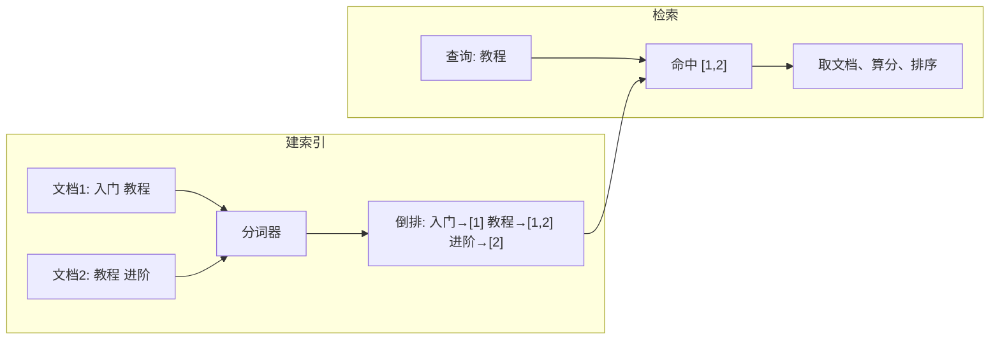

# 📗 Elasticsearch 学习与实战手册

> 系统学习见下文各章；日常常用 API、DSL 与场景速查见同目录《常用API与使用场景》（如有）。适用版本：**Elasticsearch 7.x / 8.x**（文中以 7.x 为主，8.x 安全与语法有部分差异）。

------

## 第一章：Elasticsearch 概述与基础认知

------

> **本章在整体中解决什么问题**：建立对 **Elasticsearch** 的整体认知——它是什么、解决什么问题、与关系型数据库及 **Lucene** 的关系、核心概念（Index、Document、Mapping、Shard、Replica）与典型应用场景。学完本章后**第二章**会讲**安装、集群与 REST API 入门**；**第三章**会讲**倒排索引与分词**（text/keyword、Analyzer）；**第四章**会讲 **DSL 查询与过滤**，为索引、查询、集群打基础。

------

### 1.1 Elasticsearch 简介

#### （1）定义与定位

**Elasticsearch**（ES）是基于 **Apache Lucene** 的**分布式**搜索与数据分析引擎，提供**近实时**的全文检索、结构化搜索、聚合分析能力。

| 项目 | 说明 |
|------|------|
| **核心能力** | 全文检索、高亮、聚合、近实时、分布式、REST API。 |
| **典型场景** | 站内搜索、日志分析（ELK）、监控指标、全文检索、推荐与画像。 |
| **与 Lucene** | Lucene 是单机检索引擎；ES 在其之上做分布式、REST、集群与易用封装。 |

> 💬 **一句话**：ES 解决**海量数据的检索与聚合**问题，适合「搜索 + 分析」场景，而非替代关系型数据库做强事务与复杂关联。

#### （2）为什么需要 Elasticsearch

- **关系型数据库**：擅长事务、关联、强一致；**LIKE '%xxx%'** 全表扫描，大数据量下检索慢、难以做相关性排序与高亮。
- **ES**：基于**倒排索引**，全文检索快、支持分词与相关性打分；**分布式**横向扩展；**聚合**做统计、多维分析；适合日志、搜索、监控等**读多写多、检索为主**的场景。

------

### 1.2 与关系型数据库的对比

| 概念 | 关系型（如 MySQL） | Elasticsearch |
|------|---------------------|---------------|
| **数据组织** | 库 → 表 → 行 → 列 | 索引（Index）→ 文档（Document）→ 字段（Field） |
| **Schema** | 强 Schema，先定义表结构 | 可动态映射（Dynamic Mapping），也可显式定义 Mapping |
| **查询** | SQL | REST API + **DSL**（JSON 查询体） |
| **事务** | 强 ACID | 无跨文档事务，单文档操作可保证 |
| **典型用途** | 业务主库、事务、关联 | 搜索、日志、聚合、分析 |

> 💡 **重点**：ES 不是要替代 MySQL，而是**互补**——业务数据存 MySQL，需要**检索、聚合、日志**时同步或导入 ES，由 ES 提供搜索与分析能力。

------

### 1.3 核心概念速览

| 概念 | 说明 |
|------|------|
| **Index（索引）** | 类似「数据库」，是一类文档的集合；名称小写。 |
| **Document（文档）** | 一条 JSON 记录，相当于「行」；有唯一 _id。 |
| **Mapping（映射）** | 字段类型与分词方式，类似「表结构」。 |
| **Shard（分片）** | 索引被拆成多个分片，分布在不同节点，实现水平扩展。 |
| **Replica（副本）** | 分片的副本，提高可用性与读吞吐。 |

> 🔹 **注意**：7.x 起 **Type（类型）** 已废弃，一个索引默认只对应一种「文档结构」，用 **_doc** 作为固定类型名；8.x 中 Type 已移除。

------

### 1.4 典型应用场景

| 场景 | 说明 |
|------|------|
| **站内搜索** | 商品、文章、订单等全文检索、筛选、排序、高亮。 |
| **日志与监控（ELK）** | Logstash/Filebeat 采集日志写入 ES，Kibana 查询与可视化。 |
| **指标分析** | 时序或事件数据聚合（如 PV/UV、分布、趋势）。 |
| **推荐与画像** | 基于标签、行为的检索与聚合，支撑推荐、画像分析。 |

------

## ✅ 本章小结

| 知识点 | 面试关键词 | 实际应用 |
|--------|------------|----------|
| **ES 定义** | 基于 Lucene、分布式、全文检索与聚合 | 理解 ES 的定位 |
| **与 MySQL** | 互补、索引≈库、文档≈行、DSL 非 SQL | 选型与架构设计 |
| **核心概念** | Index、Document、Mapping、Shard、Replica | 建模与集群理解 |
| **场景** | 站内搜索、ELK、监控、推荐 | 项目落地表述 |

------

**学习要点**：

- Elasticsearch 是基于 Lucene 的分布式搜索与分析引擎，解决海量数据的检索与聚合，与 MySQL 互补而非替代。
- 掌握 Index、Document、Mapping、分片与副本的概念；7.x 起 Type 废弃。
- 能说清 ES 在站内搜索、ELK、监控等场景中的作用。

------

## 🎯 面试常见追问

| 面试官提问 | 回答思路 |
|------------|----------|
| Elasticsearch 是什么？和 MySQL 有什么区别？ | ES 是基于 Lucene 的分布式搜索/分析引擎，擅长全文检索与聚合；MySQL 擅长事务与关联。ES 用索引+文档+DSL，MySQL 用表+行+SQL；二者互补，业务存 MySQL、检索分析用 ES。 |
| 为什么用 ES 做搜索而不用 MySQL LIKE？ | LIKE '%xxx%' 无法走索引、全表扫描，大数据量下慢；ES 用倒排索引与分词，支持相关性排序、高亮、聚合，且可分布式扩展。 |
| ES 的核心概念有哪些？ | Index（索引）、Document（文档）、Mapping（映射）、Shard（分片）、Replica（副本）；7.x 起 Type 废弃。 |

------

### 常见坑与注意点

| 现象 / 易错点 | 原因 | 怎么改 / 怎么记 |
|---------------|------|-----------------|
| 用 ES 替代 MySQL 做业务主库 | ES 无跨文档事务、无强一致 | ES 与 MySQL **互补**：业务主数据与事务放 MySQL，检索、聚合、日志用 ES，通过同步/双写接入。 |
| 索引名用大写或特殊字符 | ES 索引名必须小写、部分字符受限 | 索引名只用**小写、数字、下划线、连字符**；否则创建失败。 |
| 7.x/8.x 还写 Type | 7.x 起 Type 废弃，8.x 已移除 | 统一用 **_doc** 作为类型；Mapping 只写 **properties**，不要再写 type 名。 |

------

### 与前后章的衔接

- **下一章**：第二章 **安装、集群与 REST API 入门** 讲单节点/集群安装、健康检查、索引与文档的增删改查；**第三章**在此基础上讲**倒排索引与分词**（text/keyword、Analyzer），是写对 Mapping 与 DSL 的前提。

------

## 第二章：安装、集群与 REST API 入门

------

> **本章在整体中解决什么问题**：第一章讲了 ES 的定位与核心概念；本章落实**环境与上手**——ES 的安装方式、单节点与集群概念、**REST API** 的常用操作（索引管理、文档增删改查、简单 _search）。掌握后**第三章**的倒排索引与分词、**第四章**的 DSL 查询才会在真实索引上练手；面试问「如何验证集群健康」「单节点怎么启」也能答。

------

### 2.1 安装与启动

#### （1）方式概览

| 方式 | 说明 |
|------|------|
| **官网二进制包** | 解压即用，Linux/Mac 常见；**elasticsearch** 脚本启动。 |
| **Docker** | `docker run -d -p 9200:9200 -e "discovery.type=single-node" elasticsearch:7.x` 单节点。 |
| **Kibana** | 可选，与 ES 同版本，提供 Dev Tools（控制台）与可视化。 |

> 单机测试可用 **discovery.type=single-node**；集群需配置 **cluster.name**、**node.name** 与 **network.host** 等。

#### （2）安装后验证

安装并启动后，建议按顺序做以下验证：

| 步骤 | 命令/地址 | 说明 |
|------|-----------|------|
| 1. 节点信息 | `GET http://localhost:9200` 或 `curl localhost:9200` | 返回集群名、版本号等 JSON，确认进程正常。 |
| 2. 集群健康 | `GET http://localhost:9200/_cluster/health` | 返回 **status**（green/yellow/red）、节点数、分片信息；单节点通常为 yellow（无副本）。 |
| 3. 写入与查询 | 用下方 2.3 的 REST 示例创建索引、写入文档、再 GET 文档 | 确认读写与 REST 接口可用。 |

> 💡 **Kibana**：同版本安装 Kibana 后，在 **Dev Tools** 中可直接执行上述 GET/PUT/POST，无需 curl。

#### （3）常见安装与运行问题

| 现象 | 可能原因 | 排查与处理 |
|------|----------|------------|
| **启动失败 / 闪退** | JVM 内存不足（默认堆较大） | 修改 **jvm.options** 或环境变量 **ES_JAVA_OPTS=-Xms512m -Xmx512m** 降低堆内存。 |
| **无法访问 9200** | 绑定到 127.0.0.1 或防火墙 | 单机可设 **network.host: 0.0.0.0**（注意安全）；检查防火墙与安全组。 |
| **单节点报错 "master not discovered"** | 未配置单节点模式 | 启动参数或配置中加 **discovery.type: single-node**。 |
| **索引名包含大写或非法字符** | ES 索引名必须小写、部分字符受限 | 索引名只用小写、数字、下划线、连字符。 |

------

### 2.2 集群与节点概念

- **节点（Node）**：一个 ES 实例；**集群（Cluster）**：多节点组成，共享同一 **cluster.name**。
- **主节点（Master）**：负责集群元数据与分片分配；**数据节点（Data）**：存储数据与执行查询；**协调节点（Coordinating）**：接收请求并转发。
- **分片**：索引拆成多个主分片（Primary Shard）与副本分片（Replica），分布在不同节点，实现水平扩展与高可用。

------

### 2.3 REST API 入门

| 操作 | 方法 | 示例路径/说明 |
|------|------|----------------|
| 查看集群健康 | GET | `/_cluster/health` |
| 创建索引 | PUT | `/索引名` |
| 查看索引 | GET | `/索引名`、`/索引名/_mapping` |
| 写入文档 | PUT/POST | `PUT /索引名/_doc/id` 或 `POST /索引名/_doc`（自动生成 id） |
| 查询文档 | GET | `GET /索引名/_doc/id` |
| 删除文档 | DELETE | `DELETE /索引名/_doc/id` |
| 搜索 | GET/POST | `GET /索引名/_search`，请求体为 DSL |

示例：创建索引并写入一条文档：

```bash
# 创建索引（可带 mapping）
PUT /my_index
{
  "mappings": {
    "properties": {
      "title": { "type": "text", "analyzer": "ik_max_word" },
      "price": { "type": "double" }
    }
  }
}

# 写入文档
PUT /my_index/_doc/1
{
  "title": "Elasticsearch 入门",
  "price": 99.9
}

# 根据 id 查询文档
GET /my_index/_doc/1

# 简单搜索（请求体为 DSL，match_all 表示查全部）
GET /my_index/_search
{
  "query": { "match_all": {} },
  "size": 10
}

# 删除文档
DELETE /my_index/_doc/1

# 删除索引
DELETE /my_index
```

> 🔹 **注意**：索引名必须**小写**；参与 **terms 聚合、排序**的字段需为 **keyword** 或显式指定 `.keyword`，否则 text 字段会报错或行为不符合预期（见第三、五章）。

------

## ✅ 本章小结

| 知识点 | 面试关键词 | 实际应用 |
|--------|------------|----------|
| **安装与验证** | 9200、_cluster/health、single-node | 本地环境与健康检查 |
| **集群** | 节点、Master/Data、分片与副本 | 理解分布式 |
| **REST API** | 索引 CRUD、文档 PUT/GET/DELETE、_search | 调试与脚本 |

------

**学习要点**：单机用 single-node；安装后通过 9200 与 _cluster/health 验证；REST 用索引名 + _doc + _search 做增删改查与搜索。

------

## 🎯 面试常见追问

| 面试官提问 | 回答思路 |
|------------|----------|
| ES 单节点如何启动？ | 加 **discovery.type=single-node**，避免选主失败；Docker 可用 `-e "discovery.type=single-node"`。 |
| 如何检查 ES 是否正常？ | 访问 **GET /_cluster/health** 看 status（green/yellow/red）与节点数；GET 9200 看版本与集群名。 |

------

### 常见坑与注意点

| 现象 / 易错点 | 原因 | 怎么改 / 怎么记 |
|---------------|------|-----------------|
| 单节点启动报错 "master not discovered" | 未配置单节点模式，在找其它节点 | 启动参数或配置中加 **discovery.type: single-node**；Docker 用 `-e "discovery.type=single-node"`。 |
| 9200 无法访问 / 绑定到 127.0.0.1 | 默认只监听本机或防火墙拦截 | 单机测试可设 **network.host: 0.0.0.0**（生产注意安全）；检查防火墙与安全组。 |
| 聚合或排序 text 字段报错 / 行为异常 | text 会分词，不适合聚合与排序 | 参与 **terms 聚合、排序**的字段用 **keyword** 或 **字段.keyword**；Mapping 中可为同一字段建 text + keyword 子字段。 |

------

### 与前后章的衔接

- **上一章**：第一章是 ES 定位与概念；本章是**环境与 REST 入门**，能建索引、写文档、做简单搜索。
- **下一章**：第三章 **倒排索引与分词** 讲为何检索快、text/keyword 区别、Analyzer，是正确设计 Mapping 与写 DSL 的基础。

------

## 第三章：倒排索引与分词

------

> 本章说明**倒排索引**原理、**分词器**（Analyzer）与 **Mapping** 中 text/keyword 的区别，为正确建索引与写 DSL 打基础。

------

### 3.1 倒排索引

- **正排**：文档 id → 文档内容（如 MySQL 一行）。
- **倒排**：**词项（Term）→ 文档 id 列表**；检索时先查词项得到文档 id 列表，再取文档、算分、排序。
- **全文检索**依赖倒排；**keyword** 不分词，整段作为一词项，适合精确匹配、聚合、排序。

**倒排索引流程简图（面试可画）**：



------

### 3.2 分词与 Analyzer

| 概念 | 说明 |
|------|------|
| **Analyzer** | 由 Character Filters + Tokenizer + Token Filters 组成，将文本拆成词项。 |
| **内置** | standard、simple、whitespace 等；中文常用 **ik_max_word**（需安装 ik 插件）。 |
| **Mapping 中** | **text** 类型默认会分词，用于全文检索；**keyword** 不分词，用于精确值、聚合、排序。 |

> 💡 **重点**：建索引时 **text** 字段会经过分词写入倒排；**keyword** 存原值；同一字段可同时建 **text + keyword** 子字段（如 `title` 用 text 检索，`title.keyword` 用 keyword 聚合/排序）。

------

### 3.3 Mapping 常用类型

| 类型 | 说明 |
|------|------|
| **text** | 全文，分词，不参与聚合/排序（通常用 .keyword 子字段）。 |
| **keyword** | 不分词，适合精确匹配、聚合、排序。 |
| **long / integer / short** | 数值。 |
| **date** | 日期，可指定 format。 |
| **boolean** | 布尔。 |
| **nested** | 嵌套对象，保持子对象独立，便于嵌套查询。 |

------

## ✅ 本章小结

| 知识点 | 面试关键词 | 实际应用 |
|--------|------------|----------|
| **倒排索引** | 词项 → 文档 id 列表、全文检索基础 | 理解为何检索快 |
| **分词** | Analyzer、text 分词 keyword 不分词 | Mapping 设计 |
| **text vs keyword** | 全文用 text、精确/聚合用 keyword | 字段类型选型 |

------

**学习要点**：倒排是「词→文档」的映射；text 分词、keyword 不分词；中文检索常用 ik 分词器。

------

## 🎯 面试常见追问

| 面试官提问 | 回答思路 |
|------------|----------|
| 什么是倒排索引？ | 词项到文档 id 的映射；检索时先查词项得到文档列表，再取文档、算分；是全文检索的基础。 |
| text 和 keyword 区别？ | text 会分词，用于全文检索；keyword 不分词，用于精确匹配、聚合、排序；同一字段可同时保留 text + keyword。 |

### 常见坑与注意点

| 现象 / 易错点 | 原因 | 怎么改 / 怎么记 |
|---------------|------|-----------------|
| 聚合/排序报错 "Fielddata is disabled" 或要求 keyword | text 字段默认不建 doc_values，不能做 terms 聚合或排序 | 参与**聚合、排序**的字段用 **keyword** 或 **字段.keyword**；若只有 text，Mapping 里为该字段加 **fields.keyword** 子字段。 |
| 精确匹配搜不到（如 status=on_sale） | 用 **match** 查 keyword 字段，match 会分词，keyword 不分词导致行为不符 | 精确匹配用 **term** 查 **keyword** 或 `.keyword`；match 用于**全文**（text）检索。 |
| 中文分词效果差 | 默认 standard 对中文按字或单字分，无语义 | 安装 **ik** 插件，Mapping 里 **analyzer: ik_max_word**（建索引）、**search_analyzer** 可按需；或其它中文分词器。 |

### 与前后章的衔接

- **上一章**：第二章为安装与 REST API 入门；本章是**检索为何快、Mapping 如何设计**——倒排与分词。
- **下一章**：第四章 **DSL 查询与过滤** 会用到 text/keyword、match/term，本章的 Mapping 设计直接决定 DSL 能否正确工作。

------

## 第四章：DSL 查询与过滤

------

> 本章说明 **Query DSL** 的结构、**全文检索**（match/match_phrase）与**精确/范围**（term/range）、**bool 组合**与**高亮**，便于写搜索条件。

------

### 4.1 DSL 结构概览

- 查询写在 **query** 里；**filter** 不参与算分，可缓存，适合条件过滤；常用 **bool** 组合 **must**（必须）、**should**（或）、**must_not**（必须不）、**filter**（过滤不参与打分）。

------

### 4.2 常用查询类型

| 类型 | 说明 | 典型用法 |
|------|------|----------|
| **match** | 全文检索，分词后匹配 | 用户输入关键词搜索 |
| **match_phrase** | 短语匹配，词序一致 | 精确短语 |
| **term** | 精确匹配（不分词） | 状态、枚举、keyword 字段 |
| **range** | 范围 | 价格、时间区间 |
| **bool** | 组合 must/should/filter/must_not | 多条件搜索 |

示例：多条件搜索（关键词 + 价格区间 + 状态）：

```json
GET /my_index/_search
{
  "query": {
    "bool": {
      "must": [
        { "match": { "title": "入门" } }
      ],
      "filter": [
        { "range": { "price": { "gte": 10, "lte": 100 } } },
        { "term": { "status": "on_sale" } }
      ]
    }
  },
  "highlight": {
    "fields": { "title": {} }
  }
}
```

------

### 4.3 排序、分页与高亮

- **sort**：按字段排序，text 需用 **keyword** 子字段或 **fielddata**（不推荐大 text 开 fielddata）。
- **from/size**：分页；深分页用 **search_after** 或 **scroll** 更合适，避免大 offset。
- **highlight**：指定高亮字段，返回结果中带高亮片段。

### DSL 常见错误 vs 正确示例

| 场景 | 错误写法 / 现象 | 正确写法 / 做法 |
|------|-----------------|-----------------|
| **排序用 text 字段** | `"sort": [{ "title": "asc" }]` 报错或要求 keyword | 排序用 **keyword**：`"sort": [{ "title.keyword": "asc" }]`，或 Mapping 里该字段为 keyword。 |
| **精确筛选用 match** | `"match": { "status": "on_sale" }` 可能行为不符（若 status 为 keyword，match 也会当一段去匹配，建议统一用 term） | 精确条件用 **term**：`"term": { "status": "on_sale" }`，且字段为 keyword。 |
| **深分页大 from** | `"from": 10000, "size": 10` 协调节点要拉取各分片前 10010 条再合并，内存与延迟暴增 | 用 **search_after**（上一页最后一条的 sort 值）或 **scroll**（游标）；限制业务最大深度或改用游标导出。 |
| **terms 聚合用 text** | `"terms": { "field": "title" }` 报错 Fielddata disabled 或结果不符合预期 | **terms** 用 **keyword**：`"terms": { "field": "title.keyword" }`，或单独 keyword 字段。 |

### 常见坑与注意点

| 现象 / 易错点 | 原因 | 怎么改 / 怎么记 |
|---------------|------|-----------------|
| 筛选条件参与算分拖慢查询 | 不需要打分的条件用了 must | 仅做过滤的用 **filter**，不参与算分、可缓存；must 用于需要影响相关性的条件。 |
| 高亮结果为空或字段不对 | 高亮字段与查询字段不一致，或未分词 | **highlight.fields** 指定与检索一致的字段（text）；keyword 高亮通常为整段匹配。 |
| 深分页导致 OOM 或超时 | from+size 深时每个分片都要取 from+size 条，协调节点合并 | 业务限制最大页数；导出/滚屏用 **search_after** 或 **scroll**，避免大 from。 |

### 与前后章的衔接

- **上一章**：第三章倒排与分词、text/keyword；本章是**如何写 DSL** 做检索与过滤。
- **下一章**：第五章 **聚合** 在 query 结果上做分组与统计，同样依赖 keyword/date 等字段类型。

------

## ✅ 本章小结

| 知识点 | 面试关键词 | 实际应用 |
|--------|------------|----------|
| **DSL** | query、bool、must/filter | 写搜索条件 |
| **match vs term** | 全文 vs 精确、分词 vs 不分词 | 选对查询类型 |
| **高亮与分页** | highlight、from/size、深分页 search_after | 前端展示与性能 |

------

**学习要点**：bool 组合多条件；过滤用 filter 不参与打分；深分页避免大 from，用 search_after 或 scroll。

------

## 第五章：聚合（Aggregation）

------

> 本章说明**桶聚合**（terms、date_histogram）、**指标聚合**（sum、avg、min、max）、以及聚合与查询的结合，便于做统计与多维分析。

------

### 5.1 聚合类型概览

| 类型 | 说明 | 示例 |
|------|------|------|
| **桶聚合** | 按某维度分组 | terms（按字段值）、date_histogram（按时间间隔） |
| **指标聚合** | 对数值做统计 | sum、avg、min、max、value_count |
| **嵌套** | 桶内再聚合成子聚合 | 按类目分桶后对价格求 avg |

------

### 5.2 示例

#### （1）桶聚合 + 子指标：按状态分桶并求均价

```json
GET /my_index/_search
{
  "size": 0,
  "aggs": {
    "by_status": {
      "terms": { "field": "status" },
      "aggs": {
        "avg_price": { "avg": { "field": "price" } }
      }
    }
  }
}
```

#### （2）按时间分桶：date_histogram

按时间间隔（如按天、按小时）分桶，适合趋势、报表：

```json
GET /logs/_search
{
  "size": 0,
  "aggs": {
    "by_day": {
      "date_histogram": {
        "field": "createTime",
        "calendar_interval": "day",
        "format": "yyyy-MM-dd"
      },
      "aggs": {
        "total_count": { "value_count": { "field": "_id" } }
      }
    }
  }
}
```

- **calendar_interval**：day、week、month、hour 等；**field** 需为 **date** 类型。

#### （3）纯指标聚合：全局 sum / avg

不分组，只对符合 query 的文档做数值统计：

```json
GET /my_index/_search
{
  "size": 0,
  "aggs": {
    "total_sales": { "sum": { "field": "amount" } },
    "avg_price": { "avg": { "field": "price" } }
  }
}
```

#### （4）聚合与 query 结合：先过滤再聚合

只对满足条件的文档做聚合（如「仅统计 status=paid 的订单金额总和」）：

```json
GET /orders/_search
{
  "size": 0,
  "query": {
    "term": { "status": "paid" }
  },
  "aggs": {
    "total_amount": { "sum": { "field": "amount" } }
  }
}
```

> 🔹 **注意**：参与 **terms** 的字段通常为 **keyword** 或数值；**text** 需用 **field** 指定为 `.keyword`。**size=0** 表示不返回命中文档，只返回聚合结果，可减少网络与解析开销。

------

## ✅ 本章小结

| 知识点 | 面试关键词 | 实际应用 |
|--------|------------|----------|
| **桶聚合** | terms、date_histogram | 分组统计、时间趋势 |
| **指标聚合** | sum、avg、min、max、value_count | 数值统计 |
| **嵌套** | aggs 内再 aggs | 多维分析 |
| **与 query** | query 先过滤，aggs 对结果聚合 | 条件统计 |

------

**学习要点**：聚合与 query 可同请求，先过滤再聚合；size=0 只返回聚合；terms 用 keyword，date_histogram 用 date 字段。

------

## 🎯 面试常见追问

| 面试官提问 | 回答思路 |
|------------|----------|
| 聚合和查询有什么区别？ | 查询（query）用来**筛选**文档；聚合（aggs）在筛选结果上做**分组或统计**；二者可同请求，先 query 再 aggs。 |
| 为什么聚合时 terms 要用 keyword？ | text 会分词，一个文档对应多个词项，terms 按词项分桶会拆散文档；keyword 是完整值，按字段值分桶才符合业务语义。 |
| size=0 在聚合请求里有什么用？ | 不返回命中的文档列表，只返回聚合结果，节省带宽与解析时间，聚合场景下常用。 |

------

## 第六章：Java 客户端与 Spring 整合

------

> 本章说明 **RestHighLevelClient**（7.x）与 **Elasticsearch Java API Client**（8.x）、以及 **Spring Data Elasticsearch** 的常见用法，便于在项目中集成。

------

### 6.1 客户端选型

| 客户端 | 说明 |
|------|------|
| **RestHighLevelClient** | 7.x 官方高级 REST 客户端，8.x 已标记废弃，仍可用。 |
| **Elasticsearch Java API Client** | 8.x 推荐，强类型、与 8.x 安全特性配套。 |
| **Spring Data Elasticsearch** | 基于上述客户端封装，Repository 接口、**ElasticsearchRestTemplate**，与 Spring 生态集成。 |

------

### 6.2 Spring Data Elasticsearch 要点

- **@Document(indexName = "xxx")** 标注实体；**@Field(type = FieldType.Text)** 等指定类型。
- **ElasticsearchRepository&lt;T, ID&gt;** 提供 save、findById、search 等；复杂查询用 **NativeSearchQuery** 或 **QueryBuilders** 构造 DSL。
- 配置：**spring.elasticsearch.uris**、用户名密码（8.x 常用 API Key）；与 Spring Boot 版本、ES 版本需兼容。

------

## ✅ 本章小结

| 知识点 | 面试关键词 | 实际应用 |
|--------|------------|----------|
| **客户端** | RestHighLevelClient、Java API Client、Spring Data | 项目选型 |
| **Spring 整合** | @Document、Repository、RestTemplate | 增删改查与搜索 |

------

**学习要点**：7.x 多用 RestHighLevelClient 或 Spring Data；8.x 推荐新 Java API Client；Spring Data 简化 CRUD，复杂 DSL 用 Query 构造。

### 常见坑与注意点

| 现象 / 易错点 | 原因 | 怎么改 / 怎么记 |
|---------------|------|-----------------|
| Spring Boot 与 ES 版本不兼容 | 依赖与 ES 服务端版本不匹配，报错或行为异常 | 对照 **Spring Data Elasticsearch 与 ES 兼容矩阵** 选版本；Spring Boot 2.7 常用 ES 7.x，Boot 3 对应 8.x。 |
| 连接 8.x 仍用 7.x 的默认配置 | 8.x 默认开启安全、HTTPS，且认证方式有变 | 8.x 使用 **API Key** 或配置 **username/password**；确认 **spring.elasticsearch.uris** 与协议（http/https）一致。 |
| 实体字段未加 @Field 导致 Mapping 不符合预期 | 动态映射可能把字符串推成 keyword 或 text，与检索/聚合需求不符 | 关键字段显式 **@Field(type=FieldType.Text)** 或 **Keyword**，并指定 analyzer；与第三章 Mapping 设计一致。 |

### 与前后章的衔接

- **上一章**：第五章聚合；本章是**在 Java/Spring 里怎么调 ES**。
- **下一章**：第七章 **集群、分片与高可用** 讲分片副本、健康状态与脑裂，与生产部署相关。

------

## 第七章：集群、分片与高可用

------

> 本章说明**分片与副本**、**主分片与副本分片**的分配、**集群健康**（green/yellow/red）、以及**脑裂**与避免方式，便于理解分布式与面试回答。

------

### 7.1 分片与副本

- **主分片（Primary Shard）**：索引创建时指定数量，之后不可改（重建索引可改）。
- **副本分片（Replica）**：每个主分片可有 0 个或多个副本，用于高可用与读负载；副本数可动态调整。
- 写请求写主分片，主再同步到副本；读请求可由主或副本承担。

------

### 7.2 集群健康

| 状态 | 说明 |
|------|------|
| **green** | 主分片与副本均分配成功。 |
| **yellow** | 主分片全部分配，部分副本未分配（如单节点时副本无法分配）。 |
| **red** | 有主分片未分配，数据不完整。 |

------

### 7.3 脑裂与避免

- **脑裂**：网络分区导致多个节点都认为自己是 Master，集群分裂。
- **避免**：**discovery.zen.minimum_master_nodes**（7.x）设为 **(节点数/2)+1**；8.x 采用新集群协调，配置方式有变，思路仍是「多数派选举」。

### 常见坑与注意点

| 现象 / 易错点 | 原因 | 怎么改 / 怎么记 |
|---------------|------|-----------------|
| 单节点长期 yellow | 有副本但只有 1 个节点，副本无法分配（主与副本不能在同一节点） | 单节点可把副本数设为 **0**（index 设置 number_of_replicas: 0）；多节点后再调回。 |
| 主分片数建好后想改 | 索引一旦创建，**主分片数不可变** | 只能通过 **Reindex** 到新索引（新索引设好主分片数）；规划时按数据量与增长预留主分片数。 |
| 脑裂导致双主、数据分歧 | 网络分区后两边的节点都选自己为 Master | 7.x 设 **minimum_master_nodes = (节点数/2)+1**；多机房部署时保证「多数派」在同一分区，或使用单主 + 明确仲裁。 |

------

## ✅ 本章小结

| 知识点 | 面试关键词 | 实际应用 |
|--------|------------|----------|
| **分片与副本** | 主分片数不可变、副本可调、读写分工 | 容量与高可用规划 |
| **健康状态** | green/yellow/red | 监控与排错 |
| **脑裂** | 多数派、minimum_master_nodes | 集群稳定性 |

------

**学习要点**：主分片数创建后不可改；副本提高可用性与读能力；脑裂通过多数派选举与合理配置避免。

------

## 🎯 面试常见追问

| 面试官提问 | 回答思路 |
|------------|----------|
| ES 如何实现高可用？ | 分片有多副本，分布在不同节点；主分片故障时副本提升为主；写主同步副本，读可走副本。 |
| 为什么主分片数创建后不能改？ | 路由与文档 id 绑定到分片 id，改分片数会破坏路由规则；要改需 reindex 到新索引。 |
| 脑裂是什么？怎么避免？ | 网络分区导致多 Master；通过多数派选举（如 minimum_master_nodes）保证同一时刻只有一个 Master。 |

------

## 第八章：性能与优化

------

> 本章简要说明**写入优化**（批量、刷新策略）、**查询优化**（避免深分页、合理用 filter）、**分片与副本**规划、以及**监控**要点。

------

### 8.1 写入优化

| 手段 | 说明 |
|------|------|
| **批量** | Bulk API 批量写入，减少请求次数。 |
| **刷新** | 默认 1s 刷新一次使文档可搜；写入量大时可适当调大 **refresh_interval** 或临时关闭刷新，写完再恢复。 |
| **副本** | 写入时可设 **replica=0** 先写主，写完再恢复副本数，减少写放大。 |

------

### 8.2 查询优化

| 手段 | 说明 |
|------|------|
| **filter 缓存** | 纯过滤用 **filter** 不参与算分，可被缓存。 |
| **深分页** | 避免大 from；用 **search_after** 或 **scroll**。 |
| **只取必要字段** | **_source** 过滤或 **stored_fields** 减少网络与解析。 |
| **分片数** | 分片过多会增加协调与合并开销；单分片建议 10GB～50GB 量级，结合节点数规划。 |

------

### 8.3 监控

- **集群健康**：`/_cluster/health`；**节点与索引统计**：`/_nodes/stats`、`/_cat/indices`；**慢查询**：开启慢日志，分析耗时请求。

### 常见坑与注意点

| 现象 / 易错点 | 原因 | 怎么改 / 怎么记 |
|---------------|------|-----------------|
| 分片数设得过多 | 每个分片有开销，协调与合并成本高；小索引分片过多浪费 | 单分片建议 **10GB～50GB** 量级；小索引少分片（如 1～3）；结合节点数，避免分片数远大于节点数。 |
| 写入吞吐上不去 | 单条写入、refresh 过于频繁、副本同步拖慢 | 用 **Bulk** 批量写；写入期可临时 **增大 refresh_interval** 或设 **index.refresh_interval: -1**，写完再恢复。 |
| 慢查询未发现 | 未开慢日志或阈值过大 | 开启 **慢查询日志**，设合理阈值（如 1s）；用 **Profile API** 或 Kibana 看耗时阶段，优化 DSL 与分片。 |

------

## ✅ 本章小结

| 知识点 | 面试关键词 | 实际应用 |
|--------|------------|----------|
| **写入** | Bulk、refresh_interval、副本数 | 写入吞吐 |
| **查询** | filter、深分页、_source | 延迟与稳定性 |
| **分片规划** | 分片大小与数量、节点数 | 容量与性能 |

------

**学习要点**：写入用 Bulk、合理设 refresh；查询善用 filter、避免深分页；分片数不是越多越好，需结合数据量与节点数。

------

## 第九章：实战与项目应用

------

> 本章汇总**数据同步**（MySQL→ES）、**站内搜索**、**ELK 日志**等典型落地方式，以及与项目（如黑马点评、苍穹外卖）的结合思路。

------

### 9.1 数据同步

| 方式 | 说明 |
|------|------|
| **双写** | 应用写 MySQL 同时写 ES；实现简单，可能不一致，需补偿或对账。 |
| **Canal / Debezium** | 基于 binlog 订阅 MySQL 变更，异步写入 ES；解耦、最终一致。 |
| **Logstash** | 定时或基于 JDBC 从 DB 拉取写入 ES；适合离线/批量。 |

------

### 9.2 站内搜索

- 商品/文章等建索引，**Mapping** 设计 text/keyword、分词；前端关键词走 **match/match_phrase**，筛选条件走 **filter**；分页用 **from/size** 或 **search_after**；高亮用 **highlight**。
- 项目示例：黑马点评/苍穹外卖中「搜索店铺/商品」可接 ES，MySQL 存业务主数据，ES 做检索与简单聚合。

------

### 9.3 ELK 与日志

- **Elasticsearch** 存日志；**Logstash / Filebeat** 采集；**Kibana** 查询与看板；日志索引常按天/周建，配合 **ILM**（索引生命周期）做冷热与删除。

------

## ✅ 本章小结

| 知识点 | 面试关键词 | 实际应用 |
|--------|------------|----------|
| **同步** | 双写、Canal、Logstash | MySQL 与 ES 一致 |
| **站内搜索** | Mapping、DSL、高亮、分页 | 业务检索功能 |
| **ELK** | 采集、存储、Kibana | 日志与监控 |

------

**学习要点**：业务数据可 MySQL+ES 双写或 binlog 同步；站内搜索按检索与筛选设计 Mapping 与 DSL；ELK 负责日志采集、存储与可视化。

### 常见坑与注意点

| 现象 / 易错点 | 原因 | 怎么改 / 怎么记 |
|---------------|------|-----------------|
| 双写导致 MySQL 与 ES 不一致 | 先写 ES 再写 MySQL 失败，或只写了一边 | **先写 MySQL 再写 ES**；ES 写失败要有重试或补偿（如 MQ、定时对账）；关键业务优先 **Canal 等 binlog 同步** 保证最终一致。 |
| Canal 延迟或丢数据 | 网络、位点未持久化、表无主键等 | 保证表有**主键**；Canal 位点持久化与监控；重要业务可双写 + Canal 双保险，或对账任务兜底。 |
| 日志索引爆满、集群红 | 日志按单一大索引写、未按天/周拆分、未做 ILM | 日志索引**按天/周**建（如 logs-2025-03-06）；配合 **ILM** 做热温冷与删除；控制单分片大小与副本数。 |

------

## 第十章：面试题与总结

------

> 本章汇总高频面试题与回答要点，便于考前速记；细节见各章。

------

### 10.1 高频题汇总

| 问题 | 要点 |
|------|------|
| ES 是什么？和 MySQL 区别？ | 基于 Lucene 的分布式搜索/分析引擎；MySQL 事务与关联，ES 检索与聚合；互补使用。 |
| 倒排索引是什么？ | 词项→文档 id 列表；全文检索基础；text 分词建倒排，keyword 不分词。 |
| text 和 keyword 区别？ | text 分词用于全文检索；keyword 不分词用于精确、聚合、排序。 |
| 如何保证高可用？ | 分片多副本、分布多节点；主挂掉副本提升；读写分离（读可走副本）。 |
| 深分页怎么处理？ | 避免大 from；用 search_after 或 scroll。 |
| 数据如何从 MySQL 同步到 ES？ | 双写、Canal/Debezium 订阅 binlog、Logstash JDBC 等；结合一致性要求选型。 |

------

### 10.2 学习闭环

- **原理**：倒排索引、分词、分片与副本、集群健康与脑裂。
- **操作**：REST API、DSL 查询与聚合、Mapping 设计。
- **实战**：Spring 整合、数据同步、站内搜索、ELK。
- **面试**：能说清 ES 定位、与 MySQL 关系、核心概念、高可用与优化、项目中的用法。

------

## ✅ 本章小结

| 知识点 | 面试关键词 | 实际应用 |
|--------|------------|----------|
| **面试** | 原理、DSL、高可用、同步、优化 | 口述与答题 |
| **闭环** | 原理→操作→实战→面试 | 系统复习 |

------

**学习要点**：ES 解决检索与聚合，与 MySQL 互补；掌握倒排、text/keyword、分片副本、DSL 与聚合；能结合项目说清同步方式与搜索设计。

------

## 🎯 面试常见追问

| 面试官提问 | 回答思路 |
|------------|----------|
| 你在项目里怎么用 ES？ | 若做站内搜索：MySQL 存主数据，ES 存可搜字段，双写或 Canal 同步；DSL 做关键词+筛选+分页+高亮。若做日志：ELK，Filebeat 采集写 ES，Kibana 查。 |
| ES 和 MySQL 如何配合？ | 业务与事务在 MySQL；检索、聚合、日志在 ES；通过双写或 binlog 同步保证数据到 ES，查询走 ES。 |

### 追问延伸至第 X 章

| 面试追问点 | 延伸章节 |
|------------|----------|
| ES 是什么、和 MySQL 区别、核心概念 | 第一章 概述与基础认知 |
| 安装、单节点、集群健康、REST 入门 | 第二章 安装与 REST API |
| 倒排索引、分词、text/keyword、Mapping | 第三章 倒排索引与分词 |
| DSL、match/term、bool、深分页、高亮 | 第四章 DSL 查询与过滤 |
| 聚合 terms/date_histogram、与 query 结合 | 第五章 聚合 |
| Java/Spring 整合、客户端选型 | 第六章 Java 客户端与 Spring |
| 分片与副本、green/yellow/red、脑裂 | 第七章 集群与高可用 |
| 写入/查询优化、Bulk、refresh、分片规划 | 第八章 性能与优化 |
| 数据同步、站内搜索、ELK | 第九章 实战与项目应用 |

------

## 📎 附录

| 内容 | 说明 |
|------|------|
| **常用 API 与 DSL** | 见同目录《常用API与使用场景》（如有）。 |
| **版本** | 7.x/8.x 语法与安全配置有差异，以官方文档为准。 |
| **面试速查** | 第一、三、七、十章及各章「面试常见追问」。 |

------
