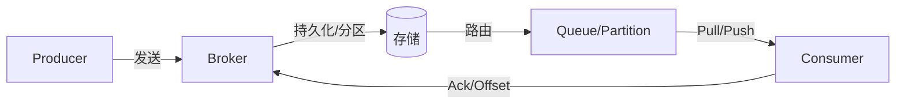

# 📗 消息队列学习与实战手册

> 系统学习见下文各章；日常常用模型、API 与场景速查见同目录《常用API与使用场景》。

------

## 第一章：消息队列基础概念与发展

------

> **本章在整体中解决什么问题**：建立对**消息队列（MQ）**的整体认知——设计初衷、核心价值（**解耦、异步、削峰**）、常见场景、优缺点及主流实现对比。学完本章后**第二章**会讲**消息模型**（点对点/发布订阅）、**投递语义**（最多/至少/精确一次）与**顺序、幂等**；**第三章**会讲**生产、存储与消费流程**及 Push/Pull、重试与死信，为具体学 Kafka、RabbitMQ、RocketMQ 打基础。

------

### 1.1 MQ 的起源与定义

#### （1）起源背景

随着架构从**单体 → 分布式 → 微服务**演进，系统间通信从同步调用（HTTP/RPC）转向**异步解耦**。分布式环境下典型问题如下：

| 问题 | 说明 |
|------|------|
| **系统强耦合** | A 调 B 接口，B 不可用则 A 阻塞甚至雪崩。 |
| **流量洪峰** | 秒杀、大促瞬时流量打爆数据库。 |
| **响应延迟高** | 短信、邮件、日志等耗时操作拖慢主流程。 |
| **数据丢失风险** | 异步调用失败后难以追踪与补偿。 |

**消息队列（Message Queue, MQ）** 应运而生：在系统间引入**消息中间件**，实现**异步发送、存储、转发与消费**，从而解耦、削峰、提升可靠性。

#### （2）MQ 的定义

> 💬 **一句话**：MQ 是一种**异步通信机制**——**生产者**发消息到 **Broker**，Broker 存储并转发，**消费者**异步拉取或接收并处理。

| 角色 | 说明 |
|------|------|
| **Producer（生产者）** | 产生并发送消息的系统或模块。 |
| **Broker** | 消息服务端，负责存储、路由、持久化等。 |
| **Consumer（消费者）** | 订阅并消费消息的系统或模块。 |

------

### 1.2 为什么需要消息队列（解耦、异步、削峰）

#### （1）系统解耦（Decoupling）

**问题**：下单后需通知库存、物流、积分等；若直接同步调用，任一方异常或变更都会影响主流程。

**MQ 方案**：订单系统只把「订单消息」投递到 MQ；库存、物流、积分各自作为消费者订阅，独立消费。任一消费者故障或扩容，不影响其它方。

```
Producer(订单) → MQ → [库存、物流、积分] 各自消费
```

| 对比 | 直接调用 | MQ 解耦 |
|------|----------|---------|
| 依赖 | 强依赖下游可用性 | 只依赖 MQ，下游可独立扩展与故障隔离 |
| 扩展 | 新增下游需改调用方 | 新增消费者即可订阅同一 Topic/Queue |

#### （2）异步处理（Asynchronous）

**问题**：下单接口内包含发短信、发邮件、更新积分等，同步执行导致接口响应慢。

**MQ 方案**：主流程写库成功后**发消息到 MQ 即返回**；短信、邮件、积分由消费者异步处理，用户无需等待。

| 对比 | 同步 | 异步 + MQ |
|------|------|-----------|
| 响应时间 | 所有步骤耗时相加 | 仅主流程耗时 |
| 吞吐 | 受最慢步骤限制 | 主流程与耗时任务并行 |

#### （3）流量削峰（Peak Shaving）

**问题**：秒杀等场景瞬时 QPS 极高，直接打数据库会压垮。

**MQ 方案**：请求先写入 MQ 排队，下游按自身处理能力从 MQ 拉取消费，形成**缓冲层**，实现削峰填谷。

> 💡 **重点**：MQ 不消除流量，而是把「瞬时高峰」摊平为「持续可处理的流量」，保护后端系统。

------

### 1.3 常见应用场景与优缺点

#### （1）常见应用场景

| 场景 | 说明 | 示例 |
|------|------|------|
| **异步处理** | 耗时任务异步化，提高接口响应 | 下单后异步发短信、邮件、更新积分 |
| **系统解耦** | 服务间通过 MQ 通信，避免强依赖 | 用户注册 → 触发积分、消息推送 |
| **流量削峰** | 吸收高峰请求，平滑流量 | 秒杀、抢购 |
| **日志收集** | 异步收集日志写入 ELK/HDFS | 日志聚合、监控 |
| **分布式事务/最终一致** | 跨系统数据最终一致 | 支付成功 → 订单状态同步 |
| **消息广播** | 一对多通知 | 配置变更、缓存失效广播 |

#### （2）优点与引入代价

| 优点 | 说明 |
|------|------|
| **解耦** | 模块独立部署、扩展、故障隔离 |
| **异步** | 提升响应与吞吐 |
| **削峰** | 保护后端，避免瞬时压垮 |
| **可靠** | 持久化、确认机制，减少丢消息 |

| 代价/风险 | 说明 | 应对思路 |
|------------|------|----------|
| **系统复杂度** | 多组件、部署与监控成本 | 监控、告警、可视化 |
| **一致性** | 异步可能丢、重复、乱序 | 事务消息、幂等、顺序设计 |
| **消息堆积与延迟** | 消费慢于生产 | 扩容消费者、限流、监控堆积 |
| **运维成本** | Broker 状态、堆积、重试 | Dashboard、Prometheus 等 |

------

### 1.4 主流消息队列对比与选型

#### （1）RabbitMQ、Kafka、RocketMQ、ActiveMQ 对比

| 特性 | RabbitMQ | Kafka | RocketMQ | ActiveMQ |
|------|-----------|--------|-----------|-----------|
| **语言** | Erlang | Java/Scala | Java | Java |
| **定位** | 通用消息队列、低延迟 | 高吞吐、日志流、大数据 | 企业级、电商/金融 | 传统消息系统 |
| **性能** | 万级 QPS | 百万级 QPS | 十万级 QPS | 较低 |
| **持久化** | 可选 | 默认持久化、顺序写 | 默认 CommitLog | 可持久化 |
| **事务消息** | 支持 | 0.11+ 支持 | 支持（半消息） | 支持 |
| **顺序消息** | 单队列有序 | 分区内有序 | 强顺序支持 | 支持 |
| **消费模式** | Push | Pull | Pull | Push |
| **典型场景** | 实时通知、短任务 | 日志、流处理、大数据 | 电商、订单、事务 | 传统/测试 |

#### （2）选型建议

| 场景 | 推荐 | 理由 |
|------|------|------|
| 电商订单、支付、事务 | RocketMQ | 事务消息、顺序保证好 |
| 日志采集、监控、流处理 | Kafka | 吞吐高、生态成熟 |
| 实时通知、消息广播 | RabbitMQ | 延迟低、路由灵活 |
| 简单异步解耦 | RabbitMQ / RocketMQ | 易用、稳定 |
| 历史系统兼容 | ActiveMQ | 老系统支持多 |

------

### 1.5 实战延伸（项目中的用法）

| 项目类型 | 常见用法 |
|----------|----------|
| **黑马点评等** | 可用 **Redis Stream + 消费组** 作轻量 MQ：异步秒杀下单、订单补偿、防重复与超卖。 |
| **苍穹外卖等** | **RabbitMQ**：订单超时取消、接单通知、短信/推送异步化。 |

> 🔹 **注意**：Redis Stream 适合轻量、非大规模堆积场景；需事务、强顺序、高可用时仍选 RocketMQ/Kafka 等。

------

## ✅ 本章小结

| 知识点 | 面试关键词 | 实际应用 |
|--------|------------|----------|
| **MQ 定义** | 异步通信、Producer-Broker-Consumer | 理解 MQ 在架构中的角色 |
| **三大价值** | 解耦、异步、削峰 | 说明为什么引入 MQ |
| **应用场景** | 异步处理、解耦、削峰、日志、最终一致 | 结合业务举例 |
| **优缺点** | 复杂度、一致性、堆积、运维 | 说明引入代价与应对 |
| **选型** | Kafka 吞吐/日志、RabbitMQ 延迟/路由、RocketMQ 事务/顺序 | 按场景选型 |

------

**学习要点**：

- MQ 的本质是**异步通信中间件**，解决解耦、异步、削峰三大类问题。
- 能说清**直接调用 vs MQ 解耦**、**同步 vs 异步**、**削峰**的含义与典型场景。
- 了解 RabbitMQ、Kafka、RocketMQ 的定位与选型场景；Redis Stream 可作为轻量替代。

------

## 🎯 面试常见追问

| 面试官提问 | 回答思路 |
|------------|----------|
| MQ 的作用是什么？ | 解耦、异步、削峰；提高系统可用性、响应速度与可扩展性。 |
| 为什么能削峰？ | 请求先进入 MQ 排队，下游按能力消费，把瞬时高峰摊成平稳流量，保护数据库等后端。 |
| MQ 会带来哪些问题？ | 系统复杂度、消息丢失/重复/乱序、堆积与延迟、运维与监控成本；需幂等、顺序设计、监控。 |
| MQ 选型怎么选？ | 看场景：Kafka 日志/流处理/高吞吐；RabbitMQ 低延迟/复杂路由；RocketMQ 电商/事务/顺序。 |
| MQ 和 Redis Stream 区别？ | Redis Stream 轻量、适合小规模；不支持分布式事务、大规模堆积与完整 MQ 生态，复杂场景用专业 MQ。 |

------

### 常见坑与注意点

| 现象 / 易错点 | 原因 | 怎么改 / 怎么记 |
|---------------|------|-----------------|
| 一上来就选型 Kafka/RocketMQ 不知道区别 | 只记名字不理解定位 | **Kafka**：日志/流处理/高吞吐；**RabbitMQ**：低延迟/复杂路由；**RocketMQ**：电商/事务/顺序；先定场景再选型。 |
| 引入 MQ 后出现消息丢失或重复 | 未考虑投递语义与幂等 | 第二章会讲**投递语义**（至少一次 + 持久化+确认）；消费端必须做**幂等**（唯一 ID、去重表）。 |
| 把 Redis 当 MQ 用在大规模/强一致场景 | Redis List/Stream 非专业 MQ | 轻量异步用 Redis Stream 可；需事务消息、高可用、大规模堆积时用 RocketMQ/Kafka。 |

------

### 与前后章的衔接

- **下一章**：第二章 **消息模型与核心机制** 讲 P2P/发布订阅、Topic/Queue、投递语义（最多/至少/精确一次）、顺序与幂等，是理解「消息如何被投递与消费」的基础；**第三章**在此基础上讲**生产→存储→消费**的完整流程。

------

## 第二章：消息模型与核心机制

------

> **本章在整体中解决什么问题**：第一章讲了 MQ 的价值与选型；本章落实**消息如何被组织与投递**——**点对点**与**发布订阅**两种模型、Topic/Queue/Offset 等基本要素、**投递语义**（At most/least/exactly once）以及**顺序与幂等**设计。掌握后**第三章**的「生产、存储与消费流程」、重试与死信才会对上号；实际用 Kafka/RabbitMQ/RocketMQ 时也会反复用到「同 key 同分区」「消费端幂等」。

------

### 2.1 消息模型

#### （1）点对点（P2P / Queue）

- **一条消息只被一个消费者消费**，消费后通常从队列移除或标记已消费。
- 多个消费者时，**竞争消费**（如轮询、负载均衡），每条消息只被其中一个拿到。

#### （2）发布订阅（Pub/Sub / Topic）

- **一条消息可被多个订阅者消费**；Topic 下可有多个**消费者组**或**订阅者**，每组/每人拿到一份消息副本。
- Kafka 的 Consumer Group、RocketMQ 的消费者组、RabbitMQ 的多个 Queue 绑定同一 Exchange 均属此类。

| 模型 | 消息去向 | 典型实现 |
|------|----------|----------|
| **P2P** | 单消费者 | RabbitMQ Queue、RocketMQ 集群消费（同组内竞争） |
| **Pub/Sub** | 多订阅者各一份 | Kafka Topic + 多 Group；RocketMQ 广播；RabbitMQ Fanout/Topic |

------

### 2.2 基本要素

| 要素 | 说明 |
|------|------|
| **Producer / Consumer** | 生产者、消费者。 |
| **Broker** | 服务端，存储与转发消息。 |
| **Topic / Queue** | Kafka/RocketMQ 用 Topic（下分 Partition/Queue）；RabbitMQ 用 Queue；表示消息的逻辑分类。 |
| **Partition / Queue** | 分区或队列，用于并行与顺序控制；同分区内可保证顺序。 |
| **Offset** | 消费位移，表示消费进度；Kafka 由消费者提交 Offset。 |
| **Message** | 消息体，通常含 header（属性、key）与 body（ payload）。 |

------

### 2.3 投递语义（Delivery Semantic）

| 语义 | 含义 | 可能问题 | 常见做法 |
|------|------|----------|----------|
| **At most once** | 最多一次 | 可能丢消息 | 少用，除非可接受丢失 |
| **At least once** | 至少一次 | 可能重复消费 | **最常用**：先处理再 Ack/提交 Offset；配合**幂等** |
| **Exactly once** | 精确一次 | 实现复杂 | 需幂等 + 事务或幂等 + 去重，Kafka 等有部分支持 |

> 💡 **重点**：生产实践中常用 **At least once + 消费端幂等**（唯一业务 ID、去重表、状态机）保证结果正确。

------

### 2.4 顺序与幂等

#### （1）顺序

- **同分区/同队列内** 一般 FIFO；要保证「某业务键」顺序，需将该键路由到**同一分区/队列**（如 Kafka 的 key、RocketMQ 的 MessageQueue 选择）。
- 多分区多消费者时，只能保证**局部有序**（同一 key 有序），全局有序通常要单分区，牺牲吞吐。

#### （2）幂等

- 因 **At least once、重试、Rebalance** 等，同一条消息可能被消费多次；业务上需**幂等**：多次执行结果一致。
- 手段：**唯一业务 ID**（如订单号）+ 去重表或状态判断；或**状态机**（已处理则跳过）。

------

## ✅ 本章小结

| 知识点 | 面试关键词 | 实际应用 |
|--------|------------|----------|
| **消息模型** | P2P 单消费者、Pub/Sub 多订阅者 | 理解 Topic/Queue 与消费关系 |
| **投递语义** | At most/least/exactly once；At least + 幂等 | 说明如何保证不丢、不重 |
| **顺序** | 同分区/同 key 有序 | 设计顺序消息 |
| **幂等** | 唯一 ID、去重表、状态机 | 消费端防重复 |

------

**学习要点**：

- 点对点与发布订阅的区别；Topic/Queue、Offset 等基本概念。
- 常用 At least once + 消费端幂等；顺序依赖同分区/同队列与业务 key 路由。
- 重复消费不可避免时，幂等设计是必备手段。

------

## 🎯 面试常见追问

| 面试官提问 | 回答思路 |
|------------|----------|
| 如何保证消息不丢失？ | 生产端确认+重试、Broker 持久化+多副本、消费端处理完再 Ack；三者结合。 |
| 如何保证不重复消费？ | At least once 下会重复；通过幂等（唯一业务 ID、去重表、状态判断）保证多次执行结果一致。 |
| 如何保证顺序？ | 同业务 key 路由到同一分区/队列，单线程或局部有序消费；全局有序需单分区。 |

------

### 常见坑与注意点

| 现象 / 易错点 | 原因 | 怎么改 / 怎么记 |
|---------------|------|-----------------|
| 消息重复消费导致业务重复扣款/重复发券 | 采用 At least once 且消费端未做幂等 | 消费逻辑必须**幂等**：唯一业务 ID + 去重表或「已处理则跳过」；不能依赖「只消费一次」假设。 |
| 顺序消息乱序 | 同业务 key 未路由到同一分区/队列，或多线程乱序消费 | **同 key 同分区**（Kafka 的 key、RocketMQ 的 MessageQueue 选择）；消费端同 key 单线程或串行。 |
| 混淆「最多/至少/精确一次」 | 没区分生产者与消费者语义 | **At least once** 最常用：先处理再 Ack，允许重复，靠幂等兜底；Exactly once 需幂等+事务或生态支持。 |

------

### 与前后章的衔接

- **上一章**：第一章是 MQ 价值与选型；本章是**消息模型与投递语义**的抽象，不区分具体 MQ 实现。
- **下一章**：第三章 **生产、存储与消费流程** 会讲发送→Broker 存储→消费与确认、Push/Pull、重试与死信，对应各 MQ 的通用流程。

------

## 第三章：生产、存储与消费流程

------

> 本章从流程角度说明**生产发送、Broker 存储与分发、消费与确认**，以及 Push/Pull、重试与死信等机制；对应各 MQ 的通用原理。

------

**生产→存储→消费流程简图（面试可画）**：



### 3.1 生产流程

#### （1）发送方式

| 方式 | 说明 | 适用 |
|------|------|------|
| **同步发送** | 等 Broker 确认后再返回 | 强一致性、关键消息 |
| **异步发送** | 回调中处理确认/失败 | 高吞吐、可接受延迟确认 |
| **单向发送** | 发完即返回，不关心结果 | 日志等可丢场景 |

#### （2）可靠发送

- 开启**确认机制**（如 RabbitMQ Publisher Confirm、Kafka acks=all）。
- **重试**：发送失败或超时重试；注意重复发送导致的重复消息，需配合幂等。
- 关键业务可**落库 + 定时补偿**：先写本地表再发 MQ，失败由定时任务补发。

------

### 3.2 存储与分发

- Broker 将消息写入**持久化日志**（如 Kafka 的 Log、RocketMQ 的 CommitLog），按 **Partition/Queue** 路由。
- **分区与副本**：多分区并行与负载均衡；多副本保证高可用（Leader/Follower、ISR 等）。
- 消费者按 **Offset**（拉取）或 **Ack**（推送）获取消息并提交进度。

------

### 3.3 消费流程

#### （1）Push 与 Pull

| 模式 | 说明 | 代表 |
|------|------|------|
| **Push** | Broker 主动推给消费者 | RabbitMQ |
| **Pull** | 消费者轮询拉取 | Kafka、RocketMQ |

Pull 便于消费者按自身能力控制速率，避免推爆；Push 实现简单、延迟低。

#### （2）消费确认与 Offset

- **Ack**：消费成功后确认，Broker 才认为该消息已消费（或提交 Offset）；**先处理再 Ack** 可减少丢失，但可能重复。
- **重试与死信**：消费失败可 Nack/Requeue 或进入重试队列，超过次数进入**死信队列（DLQ）**，便于人工或定时扫描处理。
- **延迟消息**：RocketMQ 延时等级、RabbitMQ TTL+DLQ 等，用于订单超时关单等场景。

------

## ✅ 本章小结

| 知识点 | 面试关键词 | 实际应用 |
|--------|------------|----------|
| **生产** | 同步/异步/单向、确认、重试 | 可靠发送与性能权衡 |
| **存储** | 日志、分区、副本 | 理解 Broker 存储与高可用 |
| **消费** | Push/Pull、Ack、Offset、DLQ | 消费可靠性与失败处理 |

------

**学习要点**：生产端确认+重试、Broker 持久化+副本、消费端先处理再 Ack；失败进重试与 DLQ；延迟消息用于超时关单等。

### 常见坑与注意点

| 现象 / 易错点 | 原因 | 怎么改 / 怎么记 |
|---------------|------|-----------------|
| 先 Ack 再处理业务导致丢消息 | 业务处理失败时消息已被确认，Broker 认为已消费 | **先业务处理成功再 Ack/提交 Offset**；失败则 Nack 或重试，避免先 Ack。 |
| 未开生产者确认就当「已发送」 | 网络或 Broker 异常时消息未落盘就返回成功 | 开启 **Publisher Confirm**（RabbitMQ）或 **acks=all**（Kafka）；关键消息可落库+定时补偿。 |
| 死信队列无人消费或未监控 | DLQ 堆积后未处理，业务漏单或重复 | 对 **DLQ 单独消费**或定时扫描；监控 DLQ 数量并告警，避免静默堆积。 |

### 与前后章的衔接

- **上一章**：第二章消息模型与投递语义；本章是**生产、存储、消费**的完整流程。
- **下一章**：第四章 **Kafka**、第五章 **RabbitMQ**、第六章 **RocketMQ** 分别展开具体实现。

------

## 第四章：Kafka 原理与实战

------

> 本章简要说明 Kafka 的架构（Topic、Partition、Consumer Group）、存储与消费机制、高可用与常用优化；适用于日志、流处理、大数据场景。

------

### 4.1 架构概要

| 概念 | 说明 |
|------|------|
| **Topic** | 逻辑分类，下分多个 **Partition**。 |
| **Partition** | 每条消息落一个分区；分区内顺序写、有序。 |
| **Producer** | 可指定 key 做分区路由（同 key 同分区）。 |
| **Consumer Group** | 组内消费者分摊分区，每条消息只被组内一消费者消费。 |
| **Broker** | 存日志与副本，Leader/Follower、**ISR**（In-Sync Replicas）保证可用性。 |

------

### 4.2 发送、acks 与存储

- **Producer** 发送时可指定 **key**，同 key 会路由到**同一分区**，保证该 key 下消息顺序。
- **acks**：**0** 不等待；**1** 等 Leader 落盘；**all**（或 -1）等 **Leader + ISR 内所有副本**落盘，最可靠但延迟略高，生产建议 **acks=all** 减少丢失。
- 分区内**顺序写**日志，分段（Segment）与索引，**零拷贝**与页缓存提升吞吐；消息在分区内**有序**，全局不保证有序。

------

### 4.3 消费与 Rebalance

- **Offset** 由消费者提交（新版可存 Broker）；消费模型为 **Pull**，消费者主动拉取。
- **Rebalance**：当**消费者数变化**（加入/退出组）或**分区数变化**时，组内分区会重新分配；Rebalance 期间该组**短暂不可消费**，因此尽量**避免频繁启停消费者**，可适当增加 **session.timeout.ms** 减少误判下线。
- 同组内**一个分区只被一个消费者**消费；若分区数大于消费者数，部分消费者会多管几个分区。

------

### 4.4 高可用与优化

- **Leader/Follower** 副本；**ISR**（In-Sync Replicas）为与 Leader 同步的副本集合；Leader 挂掉从 **ISR 选举**新 Leader，未在 ISR 中的副本不参与选举。
- 调优：**batch.size**、**buffer**、压缩、**分区数**（并行度与负载均衡）、消费者并发；监控**堆积、延迟、TPS**。

------

### 4.5 与 Spring 整合要点

- **spring-kafka**：**KafkaTemplate** 发送，`send(topic, data)` 或 `send(topic, key, data)` 便于按 key 分区；消费端 **@KafkaListener(topics = "xxx", groupId = "yyy")**，方法参数可为消息体或 **ConsumerRecord**。
- 配置 **bootstrap-servers**、**acks**（建议 all）；消费者可配置 **enable-auto-commit**、**auto-offset-reset**（earliest/latest）等。

------

## ✅ 本章小结

| 知识点 | 面试关键词 | 实际应用 |
|--------|------------|----------|
| **架构** | Topic、Partition、Consumer Group、Broker | 理解 Kafka 模型 |
| **发送** | key 分区、acks=all | 顺序与可靠 |
| **存储与消费** | 顺序写、零拷贝、Offset、Rebalance | 高性能与消费进度 |
| **高可用** | 副本、ISR、Leader 选举 | 不丢与高可用 |

------

**学习要点**：同 key 同分区保证顺序；acks=all 保证写入副本；理解 Rebalance 触发条件与影响；Spring 用 KafkaTemplate + @KafkaListener。

------

## 🎯 面试常见追问

| 面试官提问 | 回答思路 |
|------------|----------|
| Kafka 如何保证顺序？ | 分区内有序；同 key 会进同一分区，因此对同一业务键（如订单 id）指定 key 即可保证该键下顺序消费。 |
| acks 0/1/all 区别？ | 0 不等待；1 等 Leader 写成功；all 等 Leader + ISR 副本都写成功，最可靠，生产常用 all。 |
| Rebalance 什么时候发生？ | 消费者加入/退出组、分区数变化时，会重新分配分区；期间组内短暂停消费，故避免频繁扩缩消费者。 |

### Kafka 常见错误 vs 正确示例

| 场景 | 错误写法 / 现象 | 正确写法 / 做法 |
|------|-----------------|-----------------|
| **生产 acks=0 或 1** | 追求吞吐不等待副本，Leader 宕机或未同步则丢消息 | 生产关键消息用 **acks=all**（或 -1），等 ISR 内副本都落盘；可接受丢的日志场景再用 acks=1。 |
| **顺序消息未指定 key** | 同业务多条消息被散到不同分区，消费乱序 | **同业务 key 指定相同 key**（如 orderId），保证同 key 进同一分区，分区内有序。 |
| **消费端自动提交且先提交再处理** | 处理失败但 Offset 已提交，消息丢失 | **先处理再提交 Offset**；或关闭自动提交，手动在业务成功后 **commitSync/commitAsync**。 |
| **单消费者组内消费者数大于分区数** | 多出的消费者永远拿不到分区，空跑 | 消费者数 ≤ 分区数即可；扩容消费能力时**同时增加分区数**（需提前规划，分区数只能增不能减）。 |

### 常见坑与注意点

| 现象 / 易错点 | 原因 | 怎么改 / 怎么记 |
|---------------|------|-----------------|
| Rebalance 频繁、消费停顿 | 消费者启停频繁或 session.timeout 过短 | 避免频繁重启消费者；适当调大 **session.timeout.ms**；保证消费逻辑在 timeout 内能完成或快速失败。 |
| 堆积持续增长 | 消费速度跟不上生产，或单条处理太慢 | 扩容**消费者**（不超过分区数）；提高**并发**或**批量拉取**；排查慢逻辑、DB 与下游瓶颈。 |
| auto.offset.reset 用错导致漏读或重复读 | earliest 从最早读、latest 从最新读，新组默认 latest | 新业务组若要从头消费设 **earliest**；一般用 **latest** 避免启动时扫历史；理解「新组」与「已有 offset」区别。 |

### 与前后章的衔接

- **上一章**：第三章通用流程；本章是 **Kafka** 的架构、acks、Rebalance 与 Spring 整合。
- **下一章**：第五章 **RabbitMQ**（Exchange/Queue/DLQ）、第六章 **RocketMQ**（事务/顺序/延时）。

------

## 第五章：RabbitMQ 原理与实战

------

> 本章说明 RabbitMQ 的 **Exchange-Queue-Binding** 模型、Exchange 类型、可靠投递与 Spring 整合；适合业务解耦、任务异步、延迟场景。

------

### 5.1 架构与路由

- **Producer** 发到 **Exchange**，经 **Binding**（路由规则）到 **Queue**，**Consumer** 从 Queue 消费。
- **Exchange 类型**：**Direct**（路由键精确匹配）、**Topic**（模式匹配）、**Fanout**（广播）、**Headers**（头匹配）。

| 类型 | 说明 |
|------|------|
| Direct | 根据 routing key 精确匹配到 Queue。 |
| Topic | routing key 按模式（如 `user.#`）匹配。 |
| Fanout | 忽略 key，广播到所有绑定 Queue。 |

------

### 5.2 可靠性与扩展

- **Publisher Confirm**：发布确认，确保消息到 Broker；开启后生产者可收到 ack/nack。
- **Consumer Ack**：**手动 Ack** 更可靠，处理完再 Ack，避免未处理完就 ack 导致丢失；失败可 **Nack** 并 Requeue 或投递到 **DLQ**。
- **死信队列（DLQ）**：接收被 nack、TTL 过期、队列超长等消息；**延迟队列**可用 **TTL + DLQ**（消息先发到带 TTL 的队列，过期后转 DLQ，消费者只消费 DLQ）或官方**延迟插件**实现。

------

### 5.3 Spring 整合与完整示例

**（1）声明 Exchange、Queue、Binding**

```java
@Configuration
public class RabbitConfig {
    @Bean
    public DirectExchange orderExchange() {
        return new DirectExchange("order.exchange", true, false);
    }
    @Bean
    public Queue orderQueue() {
        return QueueBuilder.durable("order.queue").build();
    }
    @Bean
    public Binding orderBinding() {
        return BindingBuilder.bind(orderQueue()).to(orderExchange()).with("order.create");
    }
}
```

**（2）发送与消费**

- **发送**：注入 **RabbitTemplate**，`rabbitTemplate.convertAndSend("order.exchange", "order.create", message)`。
- **消费**：`@RabbitListener(queues = "order.queue")` 标注方法，参数为消息体；**手动 ack** 时需配置 `acknowledgeMode=MANUAL`，在方法内调用 `channel.basicAck(tag, false)`。

**（3）TTL + DLQ 实现延迟思路**

- 创建**业务队列**（如 `order.delay.queue`）并设置 **TTL**（如 30 分钟）、**死信交换机**（x-dead-letter-exchange）和**死信路由键**（x-dead-letter-routing-key）指向真正被消费的队列。
- 订单创建时发到 `order.delay.queue`，消息 30 分钟后过期进入 DLQ，消费者只监听 DLQ，到点关单；或使用 **rabbitmq_delayed_message_exchange** 插件直接发延迟消息。

------

## ✅ 本章小结

| 知识点 | 面试关键词 | 实际应用 |
|--------|------------|----------|
| **模型** | Exchange、Binding、Queue；Direct/Topic/Fanout | 路由与广播 |
| **可靠** | Confirm、手动 Ack、DLQ、TTL+DLQ 延迟 | 不丢与失败处理、订单超时 |
| **Spring** | RabbitTemplate、@RabbitListener、声明 Bean | 项目整合 |

------

**学习要点**：理解 Exchange-Queue-Binding 与三种 Exchange 类型；可靠投递用 Confirm + 手动 Ack；延迟队列用 TTL+DLQ 或插件；Spring 中声明 Exchange/Queue/Binding 后发收消息。

------

## 🎯 面试常见追问

| 面试官提问 | 回答思路 |
|------------|----------|
| RabbitMQ 几种 Exchange 区别？ | Direct 按 routing key 精确匹配；Topic 按模式（如 user.#）；Fanout 广播到所有绑定队列；Headers 按消息头匹配。 |
| 如何保证消息不丢？ | 生产者开 Publisher Confirm；Broker 持久化；消费者开手动 Ack，处理完再 Ack，失败 Nack 或进 DLQ。 |
| 延迟队列怎么实现？ | TTL + 死信：消息先到带 TTL 的队列，过期后进入死信队列，消费者只消费死信队列即「延迟」收到；或使用延迟插件。 |

### 常见坑与注意点

| 现象 / 易错点 | 原因 | 怎么改 / 怎么记 |
|---------------|------|-----------------|
| 消息发出去但队列没收到 | Exchange 与 Queue 未 Binding，或 routing key 不匹配 | 先**声明 Exchange、Queue、Binding**（Spring 里 @Bean 或 @RabbitListener 里声明）；确认 routing key 与 Binding 的 key 一致。 |
| 自动 Ack 导致消息丢失 | 消费者处理中异常退出，消息已被 ack 且不会重发 | 关键业务用**手动 Ack**：处理成功再 `channel.basicAck`；失败 `basicNack` 并 Requeue 或进 DLQ。 |
| 延迟队列用 TTL 时同队列多条消息表现异常 |  RabbitMQ 只检查队头消息是否过期，队头未过期会阻塞后面 | 每条延迟时间不同时**每条消息单独一个队列**（或用延迟插件 **rabbitmq_delayed_message_exchange**）避免队头阻塞。 |

### 与前后章的衔接

- **上一章**：第四章 Kafka；本章是 **RabbitMQ** 的 Exchange-Queue-Binding 与可靠投递、延迟。
- **下一章**：第六章 **RocketMQ** 讲 NameServer、事务消息、顺序与延时。

------

## 第六章：RocketMQ 原理与实战

------

> 本章说明 RocketMQ 的 **NameServer、Broker、Topic/Queue**、CommitLog 与 ConsumeQueue，以及顺序消息、事务消息、延时消息；适合电商、订单、削峰。

------

### 6.1 架构概要

- **NameServer**：路由发现，无状态；**Broker**：存消息，Topic 下多 **Queue**。
- **CommitLog**：顺序写所有消息；**ConsumeQueue**：按队列建索引，消费时按队列读。
- **顺序消息**：同 Queue 内有序；**事务消息**：半消息 + 本地事务 + 提交/回滚，支持回查；**延时消息**：固定等级延迟投递。

------

### 6.2 消费与高可用

- **集群消费**：同组负载均衡，每条消息只被组内一人消费；**广播消费**：每人一份。
- 主从同步、**Dledger** 等保证高可用；**Spring Boot** 用 **RocketMQTemplate** 发送、**@RocketMQMessageListener** 消费。

### 常见坑与注意点

| 现象 / 易错点 | 原因 | 怎么改 / 怎么记 |
|---------------|------|-----------------|
| 顺序消息乱序 | 未指定 MessageQueue 或选队策略导致同业务 key 进不同队列 | **顺序消息**发送时用 **MessageQueueSelector** 按业务 key（如 orderId）选**同一队列**；消费端该 key **单线程/串行**消费。 |
| 事务消息未处理回查 | 本地事务执行慢或回查接口未实现，半消息一直悬而未决 | 实现 **TransactionListener** 的 **checkLocalTransaction** 回查；本地事务尽量快，回查幂等返回最终状态。 |
| 延时消息等级与业务预期不符 | 只支持固定等级（1s 5s 10s 30s 1m 等），不能任意时长 | 选**最接近的等级**；需精确时长可用**定时消息**（RocketMQ 5.x）或**数据库+定时任务**扫表。 |

### 与前后章的衔接

- **上一章**：第五章 RabbitMQ；本章是 **RocketMQ** 的架构、顺序/事务/延时与 Spring 整合。
- **下一章**：第七章 **可靠性与一致性** 汇总防丢、幂等、重试与 DLQ。

------

## ✅ 本章小结

| 知识点 | 面试关键词 | 实际应用 |
|--------|------------|----------|
| **架构** | NameServer、Broker、CommitLog、ConsumeQueue | 理解存储与消费索引 |
| **特性** | 顺序、事务消息、延时消息 | 电商、订单、超时关单 |
| **Spring** | RocketMQTemplate、@RocketMQMessageListener | 项目整合 |

------

## 第七章：可靠性与一致性保障

------

> 本章汇总**防丢失、幂等与事务、重试与死信**的通用思路；与第二、三章呼应，便于面试与落地。

------

### 7.1 防丢失

| 环节 | 措施 |
|------|------|
| **生产端** | 开启确认（Confirm/acks）、重试、关键消息落库补偿。 |
| **Broker** | 持久化、多副本、同步刷盘（视场景）。 |
| **消费端** | **先业务处理再 Ack**，避免先 Ack 后业务失败导致丢消息。 |

------

### 7.2 幂等与事务

- **幂等**：唯一业务 ID + 去重表或状态判断，重复消费结果一致。
- **事务消息**：RocketMQ 半消息 → 本地事务 → 提交/回滚，回查机制保证最终一致；适用于跨系统一致性场景。

------

### 7.3 重试与死信

- 消费失败可 **Nack/Requeue** 或进**重试队列**，超过次数进 **DLQ**；定时扫描 DLQ 或告警人工处理。
- **延迟消息**用于订单超时关单、定时任务等。

### 常见坑与注意点

| 现象 / 易错点 | 原因 | 怎么改 / 怎么记 |
|---------------|------|-----------------|
| 只保证一端导致仍丢或仍重 | 只做生产确认或只做消费 Ack，另一端未配合 | **全链路**：生产确认+重试、Broker 持久化+副本、**消费先处理再 Ack**；缺一都可能丢。 |
| 事务消息与本地事务顺序反了 | 先提交本地再发 MQ，本地成功 MQ 失败则不一致 | 用 **RocketMQ 事务消息**：先发半消息 → 执行本地事务 → 再提交/回滚消息；或**本地表+定时补偿**。 |
| 重试无限导致 DLQ 爆满或雪崩 | 失败一直 Requeue，拖垮 Broker 或消费者 | 设置**最大重试次数**，超次进 DLQ；DLQ 单独消费或告警，避免无限重试。 |

------

## ✅ 本章小结

| 知识点 | 面试关键词 | 实际应用 |
|--------|------------|----------|
| **防丢失** | 生产确认+重试、Broker 持久化+副本、消费后 Ack | 全链路可靠 |
| **幂等与事务** | 唯一 ID、去重；半消息、回查 | 不重、跨系统一致 |
| **重试与 DLQ** | 重试次数、死信队列、延迟消息 | 失败处理与超时场景 |

------

## 第八章：高可用与性能优化

------

> 本章简要说明**多副本、分区/消费组扩展**与**生产/Broker/消费**侧的常见性能手段及监控要点。

------

### 8.1 高可用

- **多副本**：Kafka ISR、RocketMQ 主从、RabbitMQ 镜像队列；避免单点。
- **分区/队列**与**消费组**水平扩展；Broker 与消费者均可扩容。

------

### 8.2 性能与监控

| 方面 | 建议 |
|------|------|
| **生产** | 批量发送、压缩、异步发送。 |
| **Broker** | 异步刷盘、零拷贝、合理分区数。 |
| **消费** | 提高并发、批量拉取。 |
| **监控** | 堆积量、消费延迟、TPS、错误率、DLQ 数量。 |

### 常见坑与注意点

| 现象 / 易错点 | 原因 | 怎么改 / 怎么记 |
|---------------|------|-----------------|
| 单点 Broker 宕机即不可用 | 未做多副本或集群 | 生产至少**多副本**（Kafka ISR、RocketMQ 主从、RabbitMQ 镜像）；多节点部署，避免单机单实例。 |
| 分区数/消费者数规划不当 | 分区过多协调开销大、过少并行度不足 | 分区数结合**目标吞吐与消费者数**；消费者数不超过分区数；扩容时分区数可增（Kafka 不可减）。 |
| 无监控堆积与延迟 | 等到业务报错才发现积压 | 监控**堆积量、消费延迟、TPS、错误率、DLQ**；设告警阈值，早发现早扩容或优化。 |

------

## ✅ 本章小结

| 知识点 | 面试关键词 | 实际应用 |
|--------|------------|----------|
| **高可用** | 副本、ISR、主从、镜像队列 | 无单点、故障转移 |
| **性能** | 批量、压缩、异步、分区与并发 | 吞吐与延迟平衡 |
| **监控** | 堆积、延迟、TPS、DLQ | 运维与告警 |

------

## 第九章：项目实战与企业应用

------

> 本章把前面各章串成**秒杀、订单通知、超时关单**等实战套路，以及通用解耦/异步/削峰模式；与第一、二、七章呼应。

------

### 9.1 典型场景

| 场景 | 实现要点 |
|------|----------|
| **秒杀** | 请求入 MQ 削峰，消费者扣减库存与下单；可用 Redis Stream 或 RocketMQ；**幂等**用订单号/唯一 ID。 |
| **订单通知** | 订单状态变更发 MQ，物流/短信等异步消费；解耦主流程与下游。 |
| **超时关单** | **延迟消息**（RocketMQ 延时等级、RabbitMQ TTL+DLQ）或定时任务扫库；消费者关单并释放库存。 |

------

### 9.2 通用模式

- **解耦**：订单与库存/积分/短信通过 MQ 解耦。
- **异步**：写库后发 MQ 再返回，提高响应。
- **削峰**：秒杀请求先入 MQ，下游按能力消费。
- **Spring Boot** 整合见各 MQ 官方 Starter 与同目录《常用API与使用场景》。

### 常见坑与注意点

| 现象 / 易错点 | 原因 | 怎么改 / 怎么记 |
|---------------|------|-----------------|
| 秒杀只削峰未做幂等 | 同用户重复点击或重复消费导致重复下单/超卖 | 消费端**幂等**：订单号/请求 ID 去重；库存用 **Redis+Lua** 或 DB 乐观锁，防止超卖。 |
| 超时关单只依赖 MQ 延迟 | 消费者挂了或堆积，关单延迟甚至漏关 | **延迟消息 + 定时任务扫库**双保险：MQ 到点关单为主，定时任务扫「待支付超时」兜底。 |
| 项目里说不清「用 MQ 解决了什么」 | 只记得解耦/异步/削峰，没有具体业务对应 | 准备 1～2 个**具体场景**：如「下单后发 MQ，库存/积分异步消费」「秒杀请求入 MQ 削峰，消费者限流下单」；对应解耦、异步、削峰。 |

------

## ✅ 本章小结

| 知识点 | 面试关键词 | 实际应用 |
|--------|------------|----------|
| **秒杀** | MQ 削峰、消费者下单、幂等 | 高并发下单 |
| **订单与超时** | 状态变更发 MQ、延迟消息关单 | 解耦与超时处理 |
| **通用** | 解耦、异步、削峰、幂等 | 项目设计 |

------

## 第十章：面试高频题与扩展

------

> 本章以「问题 → 要点」形式汇总全手册高频题，便于考前速记；细节见对应章节。

------

### 10.1 流程与选型

| 问题 | 要点 |
|------|------|
| 为什么用 MQ？ | 解耦、异步、削峰；提高响应与可扩展性。 |
| MQ 带来的问题？ | 复杂度、一致性、重复、顺序、堆积、运维。 |
| 选型？ | Kafka 日志/流处理/高吞吐；RabbitMQ 复杂路由/低延迟；RocketMQ 电商/事务/顺序。 |

------

### 10.2 可靠与一致性

| 问题 | 要点 |
|------|------|
| 如何不丢？ | 生产确认+重试、Broker 持久化+副本、消费后 Ack。 |
| 如何不重复？ | At least once + 消费端幂等（唯一 ID、去重）。 |
| 如何顺序？ | 同业务 key 路由同分区/队列，单线程或局部有序消费。 |
| 延时消息？ | RocketMQ 延时等级、RabbitMQ TTL+DLQ、Kafka 时间戳+定时拉取。 |

------

### 10.3 运维与故障

| 问题 | 要点 |
|------|------|
| 消息积压？ | 扩容消费者、提高并发、排查慢消费与阻塞；必要时降级或限流。 |
| 常见错误？ | 连接失败、超时、堆积、重复消费、顺序错乱；查配置、网络、消费逻辑与幂等。 |

### 追问延伸至第 X 章

| 面试追问点 | 延伸章节 |
|------------|----------|
| 为什么用 MQ、解耦/异步/削峰、选型 | 第一章 基础概念与发展 |
| 消息模型、投递语义、顺序与幂等 | 第二章 消息模型与核心机制 |
| 生产/存储/消费流程、Push/Pull、DLQ | 第三章 生产、存储与消费流程 |
| Kafka 架构、acks、Rebalance、Spring | 第四章 Kafka 原理与实战 |
| RabbitMQ Exchange/Queue、Confirm、DLQ、延迟 | 第五章 RabbitMQ 原理与实战 |
| RocketMQ 架构、顺序/事务/延时、Spring | 第六章 RocketMQ 原理与实战 |
| 防丢失、幂等、事务消息、重试与 DLQ | 第七章 可靠性与一致性保障 |
| 高可用、性能优化、监控 | 第八章 高可用与性能优化 |
| 秒杀、订单通知、超时关单、项目落地 | 第九章 项目实战与企业应用 |

------

## 📎 附录

| 内容 | 说明 |
|------|------|
| **常用 API 与配置** | 见同目录《常用API与使用场景》。 |
| **启动与部署** | 各 MQ 官方文档；Docker 一键部署常用。 |
| **Spring Boot 整合** | 依赖 + 配置 + 发送/监听示例见《常用API与使用场景》。 |
| **面试速查** | 解耦/异步/削峰、不丢/不重/顺序、选型与项目落地见第一、二、七、十章。 |

------
