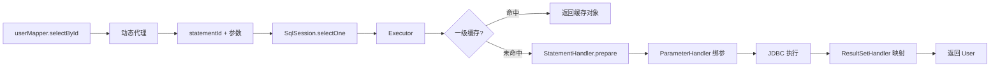

# 📘《MyBatis 学习与实战手册》

> 系统学习见下文各章；日常常用 API、XML 标签与场景速查见同目录《常用API与使用场景》。

------

# 🧩 第一章：MyBatis 概述与核心思想

------

> **本章在整体中解决什么问题**：建立对 MyBatis 的「第一印象」——为什么不用裸 JDBC、什么是半自动 ORM、核心组件与一次调用的链路是什么。学完本章再学**第二章**会理解 SqlSession、Executor、Mapper 代理等组件如何协作；**第四章 Mapper 与 XML** 会具体写 SQL 与映射，本章只建立「接口 + XML 分离」的认知。

------

## 1.1 为什么需要 MyBatis：从 JDBC 说起

### 原始 JDBC 的困境

JDBC 是 Java 访问数据库的标准 API，但直接使用会带来大量重复与繁琐：

1. **SQL 与业务代码混在一起**：修改 SQL 要改 Java 代码，难以维护；
2. **参数绑定手写**：`ps.setInt(1, id)`、`ps.setString(2, name)` 逐个设置；
3. **结果映射繁琐**：`rs.getInt("id")`、`rs.getString("name")` 逐个取值，再塞进对象；
4. **资源管理易错**：Connection、Statement、ResultSet 都要手动关闭，稍有不慎就会泄漏。

**典型 JDBC 代码**：

```java
Connection conn = DriverManager.getConnection(url, user, pwd);
PreparedStatement ps = conn.prepareStatement("SELECT * FROM user WHERE id = ?");
ps.setInt(1, 1);
ResultSet rs = ps.executeQuery();
User user = new User();
while (rs.next()) {
    user.setId(rs.getInt("id"));
    user.setName(rs.getString("name"));
}
rs.close(); ps.close(); conn.close();
```

一次简单查询就要写十几行，且 90% 是样板代码。当业务复杂、表多、关联多时，这种写法会迅速膨胀。

------

### ORM 的诞生：用对象操纵数据库

> **一句话**：**ORM（Object-Relational Mapping，对象关系映射）** 用**面向对象的方式**操作数据库——表对应类、行对应对象、列对应属性，查出来直接是对象，不再手写 `ResultSet.getXXX()`。
> **为什么**：JDBC 结果集是「列名+值」，业务要的是「User 对象」；ORM 在中间做**结果映射**，减少重复代码和出错率。
> **类比**：JDBC 像自己从快递箱里一件件掏（按列取）；ORM 像快递直接按「订单」（对象）打包好送到手。

**ORM** 的核心思想是：**用面向对象的方式操作关系型数据库**。

| 数据库概念 | Java 概念 |
|------------|-----------|
| 表（table） | 类（class） |
| 行（row） | 对象（object） |
| 列（column） | 属性（field） |

ORM 让开发者不再写 `ResultSet.getXXX()`，而是直接拿到 `User` 对象；不再写 `ps.setXXX()`，而是传入对象即可。但不同 ORM 对 SQL 的控制程度不同。

------

## 1.2 三种持久层方案：JDBC、MyBatis、Hibernate

| 方案 | SQL 控制 | 学习成本 | 适用场景 | 代表 |
|------|----------|----------|----------|------|
| **原始 JDBC** | 完全手写 | 低 | 极简单、特殊场景 | JDBC |
| **半自动 ORM** | 手写 SQL，自动映射 | 中 | 复杂业务、需 SQL 优化 | **MyBatis** |
| **全自动 ORM** | 自动生成 SQL | 高 | 快速开发、模型稳定 | Hibernate、JPA |

**MyBatis 的定位**：介于 JDBC 与 Hibernate 之间。SQL 由开发者编写，但参数绑定、结果映射、连接管理由框架完成。

> 💡 **一句话**：MyBatis 是「你写 SQL，我帮你做映射」的**半自动** ORM 框架。
> **为什么叫半自动**：**全自动**（如 Hibernate）连 SQL 都自动生成，灵活度低、复杂查询难控；**半自动**（MyBatis）SQL 自己写，框架只负责**参数绑定 + 结果封装 + 连接管理**，既保留 SQL 可控又省掉 JDBC 样板代码。

------

## 1.3 MyBatis 的诞生与演进

- **2002 年**：iBATIS 诞生，Apache 孵化；
- **2010 年**：迁移到 Google Code，更名为 MyBatis；
- **2013 年**：迁移到 GitHub，持续维护至今；
- **当前**：与 Spring Boot 深度整合，成为国内 Java 后端最主流的持久层框架之一。

**设计目标**：减少 JDBC 样板代码、提供灵活 SQL 配置、让开发者专注 SQL 优化、保留面向对象映射。

------

## 1.4 核心设计思想

### （1）配置驱动

SQL、映射规则、缓存策略等均通过 XML 或注解配置，与 Java 代码分离。修改 SQL 无需改 Java，便于维护与版本管理。

### （2）映射思想

Java 对象属性 ↔ 数据库列 的双向映射。框架负责 `ResultSet` → 对象、对象 → `PreparedStatement` 的转换，开发者只需定义映射关系。

### （3）动态 SQL

通过 `<if>`、`<foreach>`、`<where>` 等标签，根据条件动态拼接 SQL，避免手写字符串拼接带来的错误与注入风险。

### （4）分层架构

通过 Executor、StatementHandler、ResultSetHandler，ParameterHandler 等抽象层解耦执行过程，便于扩展与插件开发。

### （5）插件扩展

提供 Interceptor 拦截器机制，可在执行 SQL 前后插入自定义逻辑（如分页、日志、脱敏）。

------

## 1.5 核心组件与执行流程

```
┌─────────────────────────────────────────────────────────────────┐
│  Configuration（配置中心）                                        │
│  管理 MappedStatement、类型别名、缓存等                            │
└────────────────────────────┬────────────────────────────────────┘
                             │
                             ▼
┌─────────────────────────────────────────────────────────────────┐
│  SqlSessionFactory（会话工厂）                                    │
│  根据配置创建 SqlSession                                          │
└────────────────────────────┬────────────────────────────────────┘
                             │
                             ▼
┌─────────────────────────────────────────────────────────────────┐
│  SqlSession（会话）                                               │
│  封装 CRUD、事务，内部持有 Executor                                │
└────────────────────────────┬────────────────────────────────────┘
                             │
                             ▼
┌─────────────────────────────────────────────────────────────────┐
│  Executor → StatementHandler → JDBC → ResultSetHandler            │
│  执行 SQL、绑定参数、封装结果                                      │
└─────────────────────────────────────────────────────────────────┘
```

**执行链路**：Mapper 接口（JDK 动态代理）→ SqlSession → Executor → StatementHandler → JDBC → ResultSetHandler → 返回 Java 对象。

> 🎯 **面试怎么说**：一次 Mapper 调用的大致流程是——**Mapper 接口没有实现类**，由 MyBatis 用 **JDK 动态代理** 生成实现；代理里根据「接口全限定名 + 方法名」找到对应的 **MappedStatement**，再调用 **SqlSession** 的 selectOne/selectList 等；SqlSession 内部交给 **Executor** 执行，**StatementHandler** 与 JDBC 交互，**ResultSetHandler** 把 ResultSet 封装成 Java 对象返回。**数据形态变化**：方法入参（如 Long id）→ 代理转成 statementId + 参数 → Executor 查缓存或执行 → PreparedStatement 绑定参数 → 执行 SQL → ResultSet → ResultSetHandler 转成 User 对象 → 返回给业务。

------

## 1.6 与 Spring Boot 的整合

Spring Boot 通过 `mybatis-spring-boot-starter` 自动装配：

- **SqlSessionFactory**：根据 `spring.datasource` 自动创建；
- **Mapper 扫描**：`@MapperScan` 扫描接口，JDK 动态代理生成实现类；
- **SqlSessionTemplate**：替代手动 SqlSession，与 Spring 事务联动；
- **事务**：由 Spring 管理，同一事务内复用同一 Connection。

开发者只需定义 Mapper 接口 + XML，注入即可使用，无需关心连接、事务、会话生命周期。

------

## 1.7 一个完整的 MyBatis 示例

**UserMapper.xml**：

```xml
<mapper namespace="com.example.mapper.UserMapper">
    <select id="selectById" resultType="User">
        SELECT * FROM tb_user WHERE id = #{id}
    </select>
</mapper>
```

**UserMapper.java**：

```java
@Mapper
public interface UserMapper {
    User selectById(Long id);
}
```

**业务调用**：

```java
User user = userMapper.selectById(1L);
```

> MyBatis 自动完成：SQL 映射、参数绑定、结果封装、异常处理与资源释放。开发者只需写 SQL 和接口定义。

------

## 1.8 MyBatis 与 Hibernate 如何选？

| 维度 | MyBatis | Hibernate / JPA |
|------|---------|-----------------|
| SQL 控制 | 手写，灵活可控 | 自动生成，难以微调 |
| 学习曲线 | 平缓 | 较陡 |
| 复杂查询 | 手写 SQL，易优化 | HQL/JPQL，需熟悉 |
| 适用场景 | 电商、点评、复杂业务 | 简单 CRUD、快速原型 |

**实际选型**：对 SQL 要求高、需要精细优化的项目 → MyBatis；数据模型稳定、以 CRUD 为主 → JPA/Hibernate。

------

## 1.9 面试高频题

**Q1：MyBatis 是什么？与 JDBC 的区别？**

> MyBatis 是半自动 ORM 框架，用于简化 JDBC 操作。相比 JDBC，MyBatis 将 SQL 配置与 Java 代码分离，通过 XML 或注解管理 SQL，自动完成参数绑定与结果映射，提高开发效率与可维护性。

**Q2：为什么叫“半自动”ORM？**

> SQL 由开发者编写，但参数绑定、结果映射、连接管理由框架自动完成。与 Hibernate 全自动（连 SQL 都自动生成）不同，MyBatis 保留了对 SQL 的完全控制权。

**Q3：MyBatis 的核心执行流程？**

> 1. 加载配置，创建 SqlSessionFactory；2. 获取 SqlSession；3. Mapper 接口通过 JDK 动态代理调用 SqlSession；4. Executor 执行 SQL；5. ResultSetHandler 封装结果；6. 返回 Java 对象。

------

## 1.10 常见坑与应对

| 问题 | 原因 | 应对 |
|------|------|------|
| XML 找不到 | mapper 路径配置错误 | 检查 `mapper-locations` 或 `@MapperScan` |
| 参数取不到 | 多参未用 `@Param` | 多参必须 `@Param("name")` |
| 多表查询报错 | resultMap 映射不全 | 明确 `association`、`collection` 映射 |
| 事务不生效 | 手动管理 SqlSession | 交由 Spring 管理，用 `@Transactional` |
| SQL 慢 | 无索引、未缓存 | 检查执行计划、索引、开启缓存 |

------

### 与前后章的衔接

- **与第 2 章**：第二章讲 **SqlSessionFactory、SqlSession、Executor、StatementHandler** 及 **Mapper 动态代理** 的协作，是「一次调用到底怎么从接口走到 JDBC」的完整拆解；本章的「执行链路」会在第二章细化到各组件。
- **与第 4 章**：**Mapper 映射文件**（XML 的 `<select>`、`#{}`、`${}`、resultMap、动态 SQL）是日常写 SQL 的主战场，本章的「接口 + XML」会在第四章展开；第四章的 `#{}`/`${}`、多参 `@Param` 与本章的 ParameterHandler、MappedStatement 对应。

------

**本章小结**：MyBatis 是“映射驱动 + SQL 控制”的轻量 ORM 框架。它以 XML/注解为核心，完成对象与 SQL 的解耦，保留 SQL 的灵活性，同时自动完成对象封装，是企业级 Java 后端最主流的持久层框架之一。

------

# 🌱 第二章：MyBatis 核心组件与架构设计

------

> **本章在整体中解决什么问题**：第一章建立了「半自动 ORM、接口+XML、执行链路」的认知，本章**拆解这条链路里的每个组件**——SqlSessionFactory、SqlSession、Executor、StatementHandler、Mapper 动态代理——各自干什么、谁调谁。搞清这些后，**第三章配置**、**第四章 Mapper 与 XML**、**第五章缓存**都会更好理解；面试问「一次 Mapper 调用怎么走的」也能按组件答。

------

## 2.1 四层架构概览

MyBatis 采用分层设计，从外到内依次为：

| 层级 | 职责 | 代表组件 |
|------|------|----------|
| **接口层** | 供业务调用，定义数据访问契约 | Mapper 接口 |
| **会话层** | 封装 CRUD、事务，管理一次请求的生命周期 | SqlSession |
| **映射层** | Mapper 与 XML 的绑定、参数与结果映射 | MappedStatement、ParameterHandler、ResultSetHandler |
| **执行层** | 与 JDBC 交互，真正执行 SQL | Executor、StatementHandler |

**调用关系**：业务 → Mapper（代理）→ SqlSession → Executor → StatementHandler → JDBC → ResultSetHandler → 返回对象。

------

## 2.2 核心组件详解

### （1）SqlSessionFactory

**职责**：根据配置构建 `Configuration`，负责创建 `SqlSession`。全局单例，应用启动时创建一次，整个生命周期内复用。

**创建方式**：

```java
// 原生方式
InputStream in = Resources.getResourceAsStream("mybatis-config.xml");
SqlSessionFactory factory = new SqlSessionFactoryBuilder().build(in);

// Spring 方式：SqlSessionFactoryBean 注入 DataSource、configLocation、mapperLocations 等
```

---

### （2）SqlSession

**职责**：封装 `selectOne`、`selectList`、`insert`、`update`、`delete`、`commit`、`rollback` 等操作，内部持有 `Executor`。一次请求或事务内使用，用毕需关闭以释放连接。

**注意**：SqlSession 非线程安全，不要作为共享变量。与 Spring 整合后由 `SqlSessionTemplate` 管理，通常每事务一个。

---

### （3）Executor

**职责**：执行 SQL 的核心，负责缓存、事务、与 StatementHandler 的协调。

| 类型 | 行为 | 适用场景 |
|------|------|----------|
| **SimpleExecutor** | 每次执行新建 Statement，用完即关 | 默认，通用 |
| **ReuseExecutor** | 复用同 SQL 的 PreparedStatement | 同 SQL 多次执行 |
| **BatchExecutor** | 攒一批 SQL 后统一提交 | 大批量 insert/update |

通过 `factory.openSession(ExecutorType.BATCH)` 可指定使用 BatchExecutor。

---

### （4）StatementHandler

**职责**：封装 `PreparedStatement` 的创建、参数绑定（`ParameterHandler`）、执行、结果处理（`ResultSetHandler`）。是 MyBatis 与 JDBC 的桥梁。

---

### （5）Mapper 接口与动态代理

**Mapper 接口没有实现类**，MyBatis 通过 **JDK 动态代理** 生成实现。代理内部：

1. 根据接口全限定名 + 方法名，拼出 `statementId`（如 `com.example.mapper.UserMapper.selectById`）；
2. 从 `Configuration` 中获取对应的 `MappedStatement`；
3. 根据方法返回值类型，调用 `SqlSession.selectOne`、`selectList`、`insert` 等；
4. 将参数传递给 `SqlSession`，由框架完成参数绑定与结果映射。

> 💡 因此，Mapper 方法名、参数、返回值类型必须与 XML 中定义的 `id`、`parameterType`、`resultType` 对应。

------

## 2.3 执行流程详解

**执行流程简图**：



**各阶段数据形态**：

| 阶段 | 输入 | 输出 |
|------|------|------|
| Mapper 代理 | 方法调用 + 入参（如 1L） | statementId（如 UserMapper.selectById）+ 参数对象 |
| SqlSession | statementId + 参数 | 调用 Executor.query/update |
| Executor | statementId + 参数 | 一级缓存命中则直接返回；否则交给 StatementHandler |
| StatementHandler | MappedStatement + 参数 | PreparedStatement（已绑参） |
| ResultSetHandler | ResultSet | User 对象（或 List） |

---

以 `userMapper.selectById(1)` 为例，完整链路如下：

```
1. 业务调用 userMapper.selectById(1)
        ↓
2. 动态代理拦截，statementId = "UserMapper.selectById"
        ↓
3. SqlSession.selectOne(statementId, 1)
        ↓
4. Executor.query() → 查一级缓存（若有）→ 未命中则继续
        ↓
5. StatementHandler.prepare() 预编译 SQL
        ↓
6. ParameterHandler.setParameters() 绑定参数
        ↓
7. StatementHandler.query() 执行 SQL
        ↓
8. ResultSetHandler.handleResultSets() 封装 ResultSet 为 User 对象
        ↓
9. 返回 User 给业务层
```

**关键点**：`MappedStatement` 是 SQL 配置的运行时表示，包含 SQL 文本、参数映射、结果映射、缓存配置等，是连接 XML 与执行的纽带。

> 🎯 **面试怎么说**：从「userMapper.selectById(1)」说起——**Mapper 没有实现类**，是 **JDK 动态代理**；代理里用 **namespace + 方法名** 得到 statementId，从 **Configuration** 里拿到 **MappedStatement**，再调 **SqlSession.selectOne**；SqlSession 交给 **Executor**（先看一级缓存），没有则 **StatementHandler** 预编译 SQL、**ParameterHandler** 绑参、执行、**ResultSetHandler** 把 ResultSet 转成 User，返回。

------

### 错误写法 vs 正确写法（参数与 SQL 安全）

```xml
<!-- ❌ 多参未用 @Param：XML 里用 #{id} #{name} 会取不到或报错 -->
<select id="find" resultType="User">
  SELECT * FROM user WHERE id = #{id} AND name = #{name}
</select>
```
```java
// 对应接口：多参必须 @Param，否则 MyBatis 无法和 XML 里的名字对应
User find(@Param("id") Long id, @Param("name") String name);  // ✅
```

```xml
<!-- ❌ ${} 直接拼接，存在 SQL 注入风险；且无法防重复、类型不安全 -->
<select id="orderBy" resultType="User">
  SELECT * FROM user ORDER BY ${orderColumn}
</select>
```
```xml
<!-- ✅ 排序字段等必须用 ${} 时，只接受白名单或枚举，绝不接受用户直接输入；普通参数用 #{} 预编译 -->
<select id="selectById" resultType="User">
  SELECT * FROM user WHERE id = #{id}
</select>
```

------

## 2.4 与 Spring 整合后的变化

| 组件 | 原生 MyBatis | 与 Spring 整合后 |
|------|--------------|------------------|
| **SqlSession** | 手动 `openSession()`、`close()` | `SqlSessionTemplate` 替代，与事务联动，自动管理 |
| **Mapper 注册** | XML 中 `<mappers>` 或代码注册 | `@MapperScan` 扫描包，注册为 Spring Bean |
| **事务** | 手动 `commit`/`rollback` | `@Transactional`，由 `DataSourceTransactionManager` 管理 |
| **Connection** | 每 SqlSession 独立获取 | 同一事务内复用同一 Connection（通过 `TransactionSynchronizationManager`） |

**SqlSessionTemplate**：线程安全，内部通过 `SqlSessionHolder` 与当前事务绑定。同一事务内多次调用 Mapper，复用同一 SqlSession，一级缓存因此生效。

------

## 2.5 面试要点

**Q：Mapper 接口没有实现类，如何工作？**

> 通过 JDK 动态代理生成实现类。代理根据方法名与参数定位 `MappedStatement`，调用 `SqlSession` 的 `selectOne`、`selectList` 等方法执行。

**Q：Executor 有哪几种？区别是什么？**

> SimpleExecutor 每次新建 Statement；ReuseExecutor 复用同 SQL 的 PreparedStatement；BatchExecutor 批量提交，适合大批量操作。

**Q：SqlSession 是线程安全的吗？**

> 否。不要作为共享变量。与 Spring 整合后，`SqlSessionTemplate` 是线程安全的，内部通过 ThreadLocal 绑定当前事务的 SqlSession。

------

**本章小结**：MyBatis 通过四层架构（接口→会话→映射→执行）解耦职责。SqlSessionFactory 创建 SqlSession，Executor 执行 SQL，StatementHandler 与 JDBC 交互，ResultSetHandler 封装结果。Mapper 接口通过 JDK 动态代理调用 SqlSession，与 Spring 整合后由 SqlSessionTemplate 管理会话与事务。

------

### 与前后章的衔接

- **上一章**：第一章讲了 MyBatis 是什么、执行链路概览；本章是这条链路的**组件级拆解**（谁创建谁、谁调谁）。
- **下一章**：第三章讲 **mybatis-config.xml** 与 Spring Boot 下的配置方式，会用到本章的 SqlSessionFactory、Mapper 注册等概念；**第四章** 的 Mapper XML 里 `#{}`、`@Param`、resultMap 与本章的 ParameterHandler、ResultSetHandler、MappedStatement 一一对应。

------

# 🌱 第三章：MyBatis 配置文件详解

------

> 本章介绍 MyBatis 的全局配置，包括 `mybatis-config.xml` 结构与 Spring Boot 下的替代方式。与 Spring Boot 整合后，多数配置可在 `application.yml` 完成，无需单独 XML。

------

## 3.1 配置文件结构

`<configuration>` 为根元素，子元素有固定顺序（MyBatis 解析时按序读取）：

| 顺序 | 标签 | 说明 |
|------|------|------|
| 1 | properties | 外部属性文件，可用 `${key}` 引用 |
| 2 | settings | 全局行为配置 |
| 3 | typeAliases | 类型别名 |
| 4 | typeHandlers | 类型处理器 |
| 5 | objectFactory | 对象工厂（少用） |
| 6 | plugins | 插件 |
| 7 | environments | 环境与数据源 |
| 8 | databaseIdProvider | 多数据库支持 |
| 9 | mappers | Mapper 注册 |

**完整示例**：

```xml
<?xml version="1.0" encoding="UTF-8"?>
<configuration>
    <properties resource="db.properties"/>
    <settings>
        <setting name="mapUnderscoreToCamelCase" value="true"/>
        <setting name="logImpl" value="SLF4J"/>
    </settings>
    <typeAliases>
        <package name="com.example.entity"/>
    </typeAliases>
    <environments default="dev">
        <environment id="dev">
            <transactionManager type="JDBC"/>
            <dataSource type="POOLED">
                <property name="driver" value="${jdbc.driver}"/>
                <property name="url" value="${jdbc.url}"/>
                <property name="username" value="${jdbc.username}"/>
                <property name="password" value="${jdbc.password}"/>
            </dataSource>
        </environment>
    </environments>
    <mappers>
        <package name="com.example.mapper"/>
    </mappers>
</configuration>
```

------

## 3.2 环境与数据源（environments）

`<environments>` 可配置多环境（dev/test/prod），通过 `default` 指定默认环境。

**transactionManager**：
- `JDBC`：使用 JDBC 的 commit/rollback，由 MyBatis 管理事务；
- `MANAGED`：不管理事务，交由容器（如 Spring）管理。

**dataSource**：
- `POOLED`：使用连接池（推荐）；
- `UNPOOLED`：每次新建连接；
- `JNDI`：从 JNDI 获取数据源。

**与 Spring 整合后**：数据源由 Spring 管理，`environments` 通常省略，MyBatis 使用 Spring 注入的 DataSource。

------

## 3.3 映射器注册（mappers）

`<mappers>` 用于注册 Mapper XML 或接口，三种方式：

| 方式 | 示例 | 说明 |
|------|------|------|
| resource | `<mapper resource="mapper/UserMapper.xml"/>` | 按 classpath 资源路径加载 XML |
| class | `<mapper class="com.example.mapper.UserMapper"/>` | 按接口类加载，需同路径 XML 或注解 SQL |
| package | `<package name="com.example.mapper"/>` | 扫描包下所有 Mapper 接口 |

**XML 与接口的对应**：`namespace` 必须为接口全限定名；XML 文件名建议与接口同名（如 `UserMapper.xml` 对应 `UserMapper.java`），放在 `resources/mapper/` 下。

------

## 3.4 类型别名与处理器

### （1）typeAliases

为实体类起短别名，XML 中写 `resultType="User"` 而非 `com.example.entity.User`。

```xml
<!-- 单个指定 -->
<typeAliases>
    <typeAlias type="com.example.entity.User" alias="User"/>
</typeAliases>

<!-- 包扫描：包下所有类，别名为类名（首字母小写） -->
<typeAliases>
    <package name="com.example.entity"/>
</typeAliases>
```

### （2）typeHandlers

自定义 JDBC 类型 ↔ Java 类型的转换，如枚举、JSON、`LocalDateTime` 等。实现 `TypeHandler<T>`，重写 `setParameter`、`getResult`，在 `mybatis-config.xml` 或 `@MappedTypes` 中注册。

------

## 3.5 全局设置（settings）

| 配置项 | 说明 | 常用值 |
|--------|------|--------|
| **cacheEnabled** | 二级缓存开关 | true（默认） |
| **lazyLoadingEnabled** | 延迟加载 | false |
| **mapUnderscoreToCamelCase** | 下划线列名转驼峰 | true（推荐） |
| **logImpl** | 日志实现 | SLF4J、LOG4J2 |
| **defaultStatementTimeout** | 默认 SQL 超时秒数 | 可选 |
| **useGeneratedKeys** | 插入后返回自增主键 | true |
| **defaultExecutorType** | 默认执行器类型 | SIMPLE、REUSE、BATCH |

------

## 3.6 Spring Boot 下的配置方式

与 Spring Boot 整合后，多数配置可在 `application.yml` 完成，无需 `mybatis-config.xml`：

```yaml
mybatis:
  mapper-locations: classpath:mapper/*.xml
  type-aliases-package: com.example.entity
  configuration:
    map-underscore-to-camel-case: true
    log-impl: org.apache.ibatis.logging.slf4j.Slf4jImpl
    cache-enabled: true
  # 若有 mybatis-config.xml，可指定：
  # config-location: classpath:mybatis-config.xml
```

**@MapperScan**：在启动类或配置类上添加 `@MapperScan("com.example.mapper")`，扫描 Mapper 接口并注册为 Bean。

------

## 3.7 面试要点

**Q：Spring Boot 下还需要 mybatis-config.xml 吗？**

> 通常不需要。`mybatis.mapper-locations`、`mybatis.type-aliases-package`、`mybatis.configuration.*` 等可在 application.yml 配置。只有复杂配置（如多环境、自定义 typeHandler）才保留 XML。

**Q：mapper-locations 与 @MapperScan 的关系？**

> `@MapperScan` 扫描 Mapper 接口并注册；`mapper-locations` 指定 XML 路径。两者配合：接口由 @MapperScan 发现，XML 由 mapper-locations 加载，通过 namespace 绑定。

------

**本章小结**：MyBatis 全局配置通过 `mybatis-config.xml` 的 `configuration` 完成，包含 environments、mappers、typeAliases、settings 等。与 Spring Boot 整合后，多数配置可在 application.yml 完成，通过 @MapperScan 扫描 Mapper，通过 mapper-locations 加载 XML。

------

# 🌱 第四章：Mapper 映射文件详解

------

> 本章介绍 Mapper XML 的结构、参数与结果映射、动态 SQL、多表关联等核心用法。XML 是 MyBatis 定义 SQL 的主要方式，与 Mapper 接口通过 `namespace` 和 `id` 绑定。

------

## 4.1 基本结构

根元素 `<mapper namespace="Mapper 接口全限定名">`，`namespace` 必须与 Mapper 接口的包名+类名完全一致。内部为 `<select>`、`<insert>`、`<update>`、`<delete>`，`id` 对应接口方法名。

```xml
<?xml version="1.0" encoding="UTF-8"?>
<!DOCTYPE mapper PUBLIC "-//mybatis.org//DTD Mapper 3.0//EN" "http://mybatis.org/dtd/mybatis-3-mapper.dtd">
<mapper namespace="com.example.mapper.UserMapper">
    <select id="selectById" resultType="User">
        SELECT * FROM user WHERE id = #{id}
    </select>
    <insert id="insert" useGeneratedKeys="true" keyProperty="id">
        INSERT INTO user (name, age) VALUES (#{name}, #{age})
    </insert>
    <update id="updateById">
        UPDATE user SET name = #{name} WHERE id = #{id}
    </update>
    <delete id="deleteById">
        DELETE FROM user WHERE id = #{id}
    </delete>
</mapper>
```

**要点**：`id` 与接口方法名一致；`resultType` 指定返回类型；`useGeneratedKeys` 与 `keyProperty` 配合可返回自增主键。

------

## 4.2 参数与结果

### （1）参数：parameterType 与 @Param

**单参**：可省略 `parameterType`，直接 `#{任意名}` 或 `#{param1}` 引用。

**多参**：必须用 `@Param("name")` 标注，否则 XML 中取不到；或传入 Map，用 `#{key}` 引用。

```java
// 接口
List<User> listByCondition(@Param("name") String name, @Param("status") Integer status);
```

```xml
<select id="listByCondition" resultType="User">
    SELECT * FROM user WHERE name = #{name} AND status = #{status}
</select>
```

### （2）结果：resultType 与 resultMap

**resultType**：单表实体类，列名与属性一致（或开启 `mapUnderscoreToCamelCase`）时直接指定类名。返回集合时写元素类型，如 `resultType="User"`。

**resultMap**：复杂映射、列名与属性不一致、嵌套对象、集合时使用。自定义 `<resultMap>` 定义 `column` 与 `property` 的对应关系。

### （3）#{} 与 ${}

| 语法 | 行为 | 安全性 | 适用场景 |
|------|------|--------|----------|
| **#{}** | 预编译占位符 `?`，参数绑定 | 防 SQL 注入 | 值、条件（推荐） |
| **${}** | 字符串替换，直接拼入 SQL | 有注入风险 | 表名、列名等非用户输入 |

**示例**：`ORDER BY ${orderBy}` 用于动态排序字段（需白名单校验）；`SELECT * FROM ${tableName}` 用于动态表名（慎用）。

### #{} 与 ${} 错误 vs 正确示例

| 场景 | 错误写法 / 现象 | 正确写法 / 做法 |
|------|-----------------|-----------------|
| **条件值用 ${}** | `WHERE name = '${name}'`，用户传 `' OR '1'='1` 导致注入 | 条件值一律用 **#{}**：`WHERE name = #{name}`，预编译占位符防注入。 |
| **ORDER BY 用 #{}** | `ORDER BY #{column}` 会变成 `ORDER BY 'name'`（带引号），语法错误 | 排序字段用 **${}** 且**只接受白名单**：如 `ORDER BY ${orderColumn}`，orderColumn 仅允许 `id`、`name` 等枚举，绝不接受前端直接传参。 |
| **IN 列表用 ${}** | `WHERE id IN (${ids})`，ids 为字符串拼接，注入与错误格式风险 | 用 **#{} + foreach**：`<foreach collection="ids" item="id">#{id}</foreach>`，每个元素预编译。 |
| **表名/列名动态** | 用户输入直接 `${tableName}` 严重注入 | 表名/列名若必须动态，只从**白名单或枚举**取值，或代码里校验后再传入。 |

------

## 4.3 动态 SQL

| 标签 | 作用 |
|------|------|
| `<if test="条件">` | 条件成立时拼接内容 |
| `<choose>/<when>/<otherwise>` | 多分支，类似 switch |
| `<foreach collection="list" item="item">` | 遍历集合，常用于 IN 或批量插入 |
| `<where>` | 自动去掉首尾 AND/OR，避免 `WHERE AND` 语法错误 |
| `<trim>` | 自定义前后缀的去除与添加 |
| `<set>` | 用于 UPDATE，自动去掉末尾逗号 |

**多条件查询**：

```xml
<select id="listByCondition" resultType="User">
    SELECT * FROM user
    <where>
        <if test="name != null and name != ''">AND name LIKE CONCAT('%', #{name}, '%')</if>
        <if test="status != null">AND status = #{status}</if>
    </where>
</select>
```

**多分支**：

```xml
<select id="listByStatus" resultType="User">
    SELECT * FROM user
    <where>
        <choose>
            <when test="status == 1">AND status = 1</when>
            <when test="status == 2">AND status = 2</when>
            <otherwise>AND status IN (1, 2)</otherwise>
        </choose>
    </where>
</select>
```

**IN 查询与批量插入**：

```xml
<select id="selectByIds" resultType="User">
    SELECT * FROM user WHERE id IN
    <foreach collection="ids" item="id" open="(" separator="," close=")">
        #{id}
    </foreach>
</select>

<insert id="batchInsert">
    INSERT INTO user (name, age) VALUES
    <foreach collection="list" item="u" separator=",">
        (#{u.name}, #{u.age})
    </foreach>
</insert>
```

**动态 UPDATE**：

```xml
<update id="updateSelective">
    UPDATE user
    <set>
        <if test="name != null">name = #{name},</if>
        <if test="age != null">age = #{age},</if>
    </set>
    WHERE id = #{id}
</update>
```

------

## 4.4 多表关联

### （1）一对一：association

```xml
<resultMap id="UserWithDept" type="User">
    <id property="id" column="id"/>
    <result property="name" column="name"/>
    <association property="dept" javaType="Dept">
        <id property="id" column="dept_id"/>
        <result property="name" column="dept_name"/>
    </association>
</resultMap>
```

联查时需在 SQL 中 JOIN 并取别名，`column` 与联查结果列对应。

### （2）一对多：collection

```xml
<resultMap id="OrderWithDetails" type="Order">
    <id property="id" column="id"/>
    <result property="orderNo" column="order_no"/>
    <collection property="details" ofType="OrderDetail">
        <id property="id" column="detail_id"/>
        <result property="productName" column="product_name"/>
    </collection>
</resultMap>
```

### （3）子查询：select 属性

`association` 或 `collection` 可指定 `select="namespace.id"`，调用另一条 SQL 做子查询。会产生 N+1 问题：主查询 1 次 + 每个关联 N 次。可配合 `fetchType="lazy"` 懒加载，或改用联查 + resultMap 一次性查出。

------

## 4.5 常见用法与注意点

- **自增主键**：`useGeneratedKeys="true" keyProperty="id"` 插入后自动回填主键；
- **列名与属性**：开启 `mapUnderscoreToCamelCase` 可自动映射 `user_name` → `userName`；
- **`<where>`**：自动去掉开头的 AND/OR，子元素全不满足时不会生成 `WHERE`；
- **`<foreach>`**：`collection` 可为 list、array、Map 的 key，需与参数类型对应。

------

## 4.6 面试要点

**Q：#{} 与 ${} 的区别？**

> `#{}` 预编译占位符，防注入；`${}` 字符串替换，有注入风险。`#{}` 用于值，`${}` 仅用于表名、列名等非用户输入。

**Q：多参如何传递？**

> 必须用 `@Param("name")` 标注，或传入 Map。否则 XML 中无法通过名称获取参数。

**Q：resultType 与 resultMap 何时用？**

> 单表、列名与属性一致时用 resultType；复杂映射、嵌套、集合、列名不一致时用 resultMap。

------

**本章小结**：Mapper XML 通过 `namespace` 与接口绑定，`id` 对应方法名。参数用 `#{}` 或 `@Param`，结果用 `resultType` 或 `resultMap`。动态 SQL 通过 `<if>`、`<where>`、`<foreach>` 等标签实现；多表关联用 `association`、`collection`，注意 N+1 问题。

------

# 🌱 第五章：MyBatis 运行机制与缓存

------

> 本章深入 MyBatis 的执行机制、缓存、延迟加载与日志。理解这些有助于排查问题、优化性能，也是面试高频考点。

------

## 5.1 SqlSession 与 Executor

### （1）SqlSession

由 `SqlSessionFactory.openSession()` 创建，内部持有 `Executor` 和 `Configuration`。每次执行时，根据 statementId 从 `Configuration` 获取 `MappedStatement`，交给 `Executor` 执行。

**非线程安全**：不要作为共享变量。与 Spring 整合后由 `SqlSessionTemplate` 管理，通常每事务一个。

### （2）Executor 三种实现

| 类型 | 行为 | 适用场景 |
|------|------|----------|
| **SimpleExecutor** | 每次执行新建 Statement，用完关闭 | 默认，通用 |
| **ReuseExecutor** | 复用同 SQL 的 PreparedStatement | 同 SQL 多次执行 |
| **BatchExecutor** | 攒一批 SQL 后统一 `executeBatch()` | 大批量 insert/update |

**指定 BatchExecutor**：`factory.openSession(ExecutorType.BATCH)`。批量插入时，循环调用 `mapper.insert(entity)`，最后 `sqlSession.flushStatements()` 统一提交，减少网络往返。

------

## 5.2 一级缓存

**作用域**：SqlSession 级别，默认开启。

**存储**：`BaseExecutor` 中的 `localCache`（HashMap），key 为 statementId + SQL + 参数等。

**命中条件**：同一 SqlSession、相同 SQL、相同参数、相同 MappedStatement。

**失效时机**：`commit`、`rollback`、任意 `update`/`insert`/`delete`、手动 `clearCache()`。

**Spring 整合**：`SqlSessionTemplate` 通常每事务一个 SqlSession，事务结束即关闭，一级缓存生命周期短，对跨请求无影响。同一事务内多次相同查询会命中缓存。

**一级缓存小示例**（同一事务内两次相同查询，第二次命中缓存）：

```java
@Transactional
public void demo() {
    User u1 = userMapper.selectById(1L);  // 查 DB
    User u2 = userMapper.selectById(1L);  // 同一 SqlSession、同 SQL 同参数 → 走一级缓存，不查 DB
    // u1、u2 为同一对象引用（默认）
}
```

------

## 5.3 二级缓存

**作用域**：Mapper 级别，需在 XML 中 `<cache/>` 或 `<cache-ref namespace=""/>` 显式开启。

**存储**：默认 `PerpetualCache`（HashMap），可配置 `eviction`（LRU/FIFO 等）、`flushInterval`（毫秒）、`size`（最多缓存对象数）。

**写入时机**：事务**提交后**，查询结果才会放入二级缓存。未提交事务内的查询不会写入。

**注意**：
- 实体类需实现 `Serializable`；
- 多表更新时，需保证相关 Mapper 的缓存正确失效；
- 分布式多实例下，单机二级缓存会不一致，通常关闭或改用 Redis 实现 Cache 接口。

------

## 5.4 延迟加载

关联对象配置 `fetchType="lazy"` 时，只有**访问该关联属性**才会触发子查询。底层通过 CGLIB 代理或 `ResultLoader` 实现。

**配置**：`lazyLoadingEnabled=true`（settings）；`fetchType="lazy"`（association/collection）。

**注意**：懒加载时 SqlSession 必须未关闭，否则会报错。Spring 整合下需在事务内访问关联属性，事务结束后 SqlSession 关闭，懒加载会失败。

### 缓存失效一览表

| 缓存 | 何时失效 |
|------|----------|
| **一级缓存** | `commit`、`rollback`、任意本 SqlSession 的 `update`/`insert`/`delete`、`sqlSession.clearCache()`。 |
| **二级缓存** | 同 Mapper 的任意 `update`/`insert`/`delete` 会清空**该 Mapper** 的二级缓存；其他 Mapper 的二级缓存**不会**自动失效（多表关联时可能脏读，需显式 flushCache 或关闭二级缓存）。 |

------

## 5.5 日志与调试

**配置日志**：`logImpl` 指定 SLF4J、LOG4J2 等；Spring Boot 下 `logging.level.xxx.mapper=DEBUG` 可打印 SQL 与参数。

**输出内容**：执行的 SQL、参数绑定结果、影响行数等，便于调试与性能分析。

------

## 5.6 面试要点

**Q：一级缓存与二级缓存的区别？**

> 一级缓存 SqlSession 级别、默认开启；二级缓存 Mapper 级别、需配置、跨 Session。一级缓存在事务内生效，二级缓存在事务提交后写入，跨请求可共享。

**Q：什么操作会清空一级缓存？**

> commit、rollback、任意 update/insert/delete、手动 clearCache()。

**Q：为什么 Spring 整合下一级缓存似乎“没用”？**

> 每事务一个 SqlSession，事务结束即关闭，缓存随之失效。但同一事务内多次相同查询仍会命中，可减少重复查询。

------

**本章小结**：MyBatis 通过 Executor 执行 SQL，支持 Simple、Reuse、Batch 三种模式。一级缓存默认开启，SqlSession 级别；二级缓存需配置，Mapper 级别，事务提交后写入。延迟加载通过 fetchType="lazy" 实现，需在事务内访问。配置 logImpl 或 logging.level 可打印 SQL 便于调试。

------

# 🌱 第六章：动态 SQL 深入与性能优化

------

> 本章深入动态 SQL 的 OGNL 解析、批量与分页的多种实现方式，以及性能优化建议。第四章已介绍基本标签用法，本章侧重原理与实战优化。

------

## 6.1 动态 SQL 原理

### （1）OGNL 解析

`<if test="...">`、`<when test="...">` 中的 `test` 由 **OGNL**（Object-Graph Navigation Language）解析。可直接写：

- **属性名**：对应参数对象的 getter，如 `name`、`status`；
- **比较**：`==`、`!=`、`>`、`<`、`>=`、`<=`；
- **逻辑**：`and`、`or`、`not`；
- **字符串**：`name != null and name != ''`、`status == 1`。

**注意**：字符串判空常用 `name != null and name != ''`；数字可直接 `status != null`。

### （2）`<where>` 与 `<trim>`

**`<where>`**：自动去掉子元素开头的 AND/OR；若所有子元素都不满足，不会生成 `WHERE`，避免 `WHERE AND` 语法错误。

**`<trim>`**：可自定义前后缀。`prefixOverrides` 去掉前缀，`suffixOverrides` 去掉后缀。`<where>` 等价于 `<trim prefix="WHERE" prefixOverrides="AND |OR ">`。

### （3）`<foreach>` 的 collection

`collection` 可为：`list`、`array`、Map 的 `key`/`value`。若参数为 `@Param("ids") List<Long> ids`，则写 `collection="ids"`；若参数为单个 `List` 无 @Param，则写 `collection="list"`。

------

## 6.2 批量操作

### （1）`<foreach>` 拼接 VALUES

适合数据量较小（如几百条），一条 SQL 插入多行：

```xml
<insert id="batchInsert">
    INSERT INTO user (name, age) VALUES
    <foreach collection="list" item="u" separator=",">
        (#{u.name}, #{u.age})
    </foreach>
</insert>
```

**注意**：单条 SQL 过长可能触发数据库或驱动限制，可分批（如每批 500 条）调用。

### （2）BatchExecutor 批量提交

适合大批量（如上万条），减少网络往返：

```java
SqlSession session = factory.openSession(ExecutorType.BATCH);
UserMapper mapper = session.getMapper(UserMapper.class);
for (User u : list) {
    mapper.insert(u);
}
session.flushStatements();
session.commit();
session.close();
```

循环调用 `insert`，由 BatchExecutor 攒批，`flushStatements()` 统一提交。

------

## 6.3 分页

### （1）手写 LIMIT

```xml
<select id="listByPage" resultType="User">
    SELECT * FROM user LIMIT #{offset}, #{limit}
</select>
```

需额外写 count 查询获取总数。`offset` 大时性能差（如 `LIMIT 100000, 10` 会扫描 100010 行），可改用游标或延迟关联优化。

### （2）PageHelper 插件

引入 `pagehelper-spring-boot-starter`，查询前调用：

```java
PageHelper.startPage(pageNum, pageSize);
List<User> list = userMapper.selectAll();
PageInfo<User> pageInfo = new PageInfo<>(list);
```

PageHelper 会改写下一次查询的 SQL，自动加上 `LIMIT`，并执行 count 查询。注意：`startPage` 只对**紧邻的下一次**查询生效。

------

## 6.4 性能优化建议

| 维度 | 建议 |
|------|------|
| **SQL 安全** | 避免 `${}` 拼接用户输入，防注入且无法利用预编译缓存 |
| **缓存** | 合理使用二级缓存，注意多表更新时的失效范围 |
| **批量** | 大批量用 BatchExecutor，避免循环单条 insert |
| **分页** | 深分页用游标或延迟关联，避免 `LIMIT offset, limit` 大 offset |
| **N+1** | 多表联查优先联查或懒加载，避免循环子查询 |
| **索引** | 慢 SQL 结合执行计划、索引优化 |
| **连接池** | 合理配置连接池大小，避免连接耗尽 |

------

## 6.5 面试要点

**Q：动态 SQL 如何实现？**

> 基于 OGNL 解析 `test` 条件，在内存中拼接出最终 SQL。`<where>`、`<trim>` 等负责去掉多余 AND/OR。

**Q：`<foreach>` 与 BatchExecutor 批量插入的区别？**

> `<foreach>` 拼成一条 SQL 的多行 VALUES，适合小批量；BatchExecutor 攒多条 SQL 后 `executeBatch()`，适合大批量，减少网络往返。

**Q：深分页如何优化？**

> `LIMIT 100000, 10` 会扫描大量行。可改用游标（基于上次最大 id）、延迟关联（先查 id 再查详情），或搜索引擎（Elasticsearch）做分页。

------

**本章小结**：动态 SQL 由 OGNL 解析 test 条件，`<where>`、`<trim>` 处理前后缀。批量插入可用 `<foreach>` 或 BatchExecutor；分页可手写 LIMIT 或 PageHelper。性能优化需从 SQL 安全、缓存、批量、分页、N+1、索引等多维度考虑。

------

# 🌱 第七章：MyBatis 缓存机制详解

------

> 第五章已介绍一级、二级缓存的基本概念，本章深入二级缓存的配置、执行顺序、自定义实现与分布式场景。缓存是 MyBatis 性能优化的重要手段，也是面试高频考点。

------

## 7.1 缓存执行顺序

MyBatis 查询时的缓存查找顺序：

```
1. 查二级缓存（若开启）
2. 未命中 → 查一级缓存
3. 未命中 → 查数据库
4. 查询结果放入一级缓存
5. 事务提交后，一级缓存内容写入二级缓存
```

**要点**：二级缓存在一级缓存之前；一级缓存是 Session 级，二级缓存是 Mapper 级，跨 Session 共享。

------

## 7.2 二级缓存配置详解

### （1）`<cache>` 标签

在 Mapper XML 的根元素下添加 `<cache/>` 即可开启该 Mapper 的二级缓存。可配置属性：

```xml
<cache eviction="LRU" flushInterval="60000" size="512" readOnly="true"/>
```

| 属性 | 说明 | 常用值 |
|------|------|--------|
| **eviction** | 淘汰策略 | LRU（最近最少使用）、FIFO、SOFT、WEAK |
| **flushInterval** | 刷新间隔（毫秒） | 如 60000 表示 60 秒清空一次 |
| **size** | 最多缓存对象数 | 默认 1024 |
| **readOnly** | 是否只读 | true 返回同一对象引用，false 反序列化副本 |

### （2）`<cache-ref>`

若多个 Mapper 共享同一份缓存（如 UserMapper 与 UserDetailMapper 关联紧密），可用 `cache-ref` 引用：

```xml
<cache-ref namespace="com.example.mapper.UserMapper"/>
```

### （3）单条语句禁用缓存

`useCache="false"` 可让某条 select 不写入二级缓存；`flushCache="true"` 可让某条语句执行前清空缓存。

------

## 7.3 缓存失效与注意事项

**一级缓存失效**：`commit`、`rollback`、任意 `update`/`insert`/`delete`、`clearCache()`。

**二级缓存失效**：同 Mapper 的 `update`/`insert`/`delete` 会清空该 Mapper 的二级缓存。**多表场景**：UserMapper 更新后，OrderMapper 的缓存不会自动失效，若 Order 关联 User，可能读到脏数据。需在相关 Mapper 的增删改上显式 `flushCache="true"`，或关闭二级缓存。

**实体类**：二级缓存需序列化，实体类必须实现 `Serializable`。

------

## 7.4 自定义 Cache 实现（Redis）

实现 MyBatis 的 `Cache` 接口，可改用 Redis 等作为二级缓存存储，实现多实例共享：

```java
public class RedisCache implements Cache {
    private final String id;
    private final RedisTemplate<String, Object> redisTemplate;

    @Override
    public void putObject(Object key, Object value) {
        redisTemplate.opsForValue().set(key.toString(), value, 1, TimeUnit.HOURS);
    }

    @Override
    public Object getObject(Object key) {
        return redisTemplate.opsForValue().get(key.toString());
    }
    // ... 其他方法
}
```

在 `<cache type="com.example.RedisCache"/>` 中指定。需自行处理序列化、key 设计、失效策略等。

------

## 7.5 分布式场景与选型

**单机二级缓存**：多实例部署时各自维护，无法共享，易脏读。

**选型建议**：

| 场景 | 建议 |
|------|------|
| 单实例 | 可开启二级缓存，注意多表失效 |
| 多实例 | 关闭二级缓存，或实现 Redis 等分布式 Cache |
| 高并发读 | 业务层用 Redis 做查询缓存，与 MyBatis 解耦，由业务控制粒度与失效 |

------

## 7.6 面试要点

**Q：一级和二级缓存的执行顺序？**

> 先查二级缓存，再查一级缓存，再查数据库。结果先放一级缓存，事务提交后写入二级缓存。

**Q：为什么实体类要 Serializable？**

> 二级缓存可能将对象序列化后存储（如跨 Session、分布式），反序列化需要实体类支持。

**Q：多表更新时二级缓存如何保证一致性？**

> 同 Mapper 的增删改会清空该 Mapper 缓存；关联 Mapper 需显式 flushCache 或关闭二级缓存。复杂场景常用业务层 Redis 替代。

------

**本章小结**：MyBatis 缓存执行顺序为二级 → 一级 → 数据库。二级缓存通过 `<cache>` 配置，可指定 eviction、flushInterval 等；多表场景需注意失效范围。分布式下可自定义 Cache 实现 Redis 存储，或关闭二级缓存改用业务层缓存。

------

# 🌱 第八章：MyBatis 与 Spring/Spring Boot 整合

------

> 本章介绍 MyBatis 与 Spring 的整合方式，包括核心组件、Spring Boot 自动装配、多数据源与事务管理。整合后，SqlSession、事务、Mapper 注册均由 Spring 管理，开发者只需关注 Mapper 与 SQL。

------

## 8.1 MyBatis-Spring 核心组件

### （1）SqlSessionFactoryBean

实现 `FactoryBean<SqlSessionFactory>`，Spring 容器启动时创建 `SqlSessionFactory`。需注入 `DataSource`，可指定：

- **configLocation**：mybatis-config.xml 路径；
- **mapperLocations**：Mapper XML 路径，如 `classpath:mapper/*.xml`；
- **typeAliasesPackage**：实体类包，用于类型别名；
- **configuration**：内联配置，覆盖 XML 中的 settings。

### （2）SqlSessionTemplate

替代手动 `SqlSession`，**线程安全**。内部通过 `SqlSessionHolder` 与当前事务绑定，同一事务内复用同一 SqlSession。事务结束自动关闭，无需手动 `close()`。

### （3）Mapper 注册

- **MapperFactoryBean**：为单个 Mapper 接口创建实现，需逐个配置；
- **MapperScannerConfigurer**：扫描指定包，为每个 Mapper 接口创建 `MapperFactoryBean`；
- **@MapperScan**：注解方式，在配置类或启动类上指定包路径，等价于 `MapperScannerConfigurer`。

注入的 Mapper 实际为 **JDK 动态代理** 生成的实现，内部调用 `SqlSessionTemplate` 执行 SQL。

------

## 8.2 Spring Boot 自动装配

引入 `mybatis-spring-boot-starter` 后，根据 `spring.datasource` 自动配置 `SqlSessionFactory` 和 `SqlSessionTemplate`。

**依赖**：

```xml
<dependency>
    <groupId>org.mybatis.spring.boot</groupId>
    <artifactId>mybatis-spring-boot-starter</artifactId>
    <version>2.3.x</version>
</dependency>
```

**application.yml 配置**：

```yaml
spring:
  datasource:
    url: jdbc:mysql://localhost:3306/db
    username: root
    password: xxx
    driver-class-name: com.mysql.cj.jdbc.Driver

mybatis:
  mapper-locations: classpath:mapper/*.xml
  type-aliases-package: com.example.entity
  configuration:
    map-underscore-to-camel-case: true
    log-impl: org.apache.ibatis.logging.slf4j.Slf4jImpl
  # 若有 mybatis-config.xml：config-location: classpath:mybatis-config.xml
```

**@MapperScan**：在启动类或配置类上添加 `@MapperScan("com.example.mapper")`，扫描 Mapper 接口并注册为 Bean。

------

## 8.3 多数据源

多数据源需手动配置多份 `DataSource`、`SqlSessionFactory`、`TransactionManager`。

**步骤**：

1. 定义多份 `DataSource`（如 `@Bean("primaryDataSource")`、`@Bean("secondaryDataSource")`）；
2. 为每个数据源创建独立的 `SqlSessionFactory`，指定不同的 `mapperLocations` 或 Mapper 包；
3. 主库的 `DataSource` 和 `SqlSessionFactory` 加 `@Primary`；
4. 配置多个 `DataSourceTransactionManager`，`@Transactional(transactionManager = "secondaryTxManager")` 指定使用哪个；
5. 不同 Mapper 包注入不同的 `SqlSessionFactory`，或使用 `AbstractRoutingDataSource` + 注解/ThreadLocal 动态切换数据源。

**注意**：Mapper 与 SqlSessionFactory 的绑定在扫描时确定，不同 Mapper 包需对应不同 Factory。

### 多数据源常见坑

| 现象 / 易错点 | 原因 | 怎么改 / 怎么记 |
|---------------|------|-----------------|
| 多数据源下事务不生效或用了错的数据源 | 未指定 transactionManager，默认用 @Primary | 在需要走从库的方法上 **@Transactional(transactionManager = "secondaryTxManager")**，否则用主库的 TransactionManager。 |
| 某 Mapper 打到主库/从库不符合预期 | Mapper 与 SqlSessionFactory 在 @MapperScan 时按包绑定，未区分 | 主从 Mapper 放**不同包**，分别指定不同的 **SqlSessionFactory**（如 @MapperScan(basePackages = "com.xx.primary", sqlSessionFactoryRef = "primarySqlSessionFactory")）。 |
| 动态切换数据源时拿到错误连接 | AbstractRoutingDataSource 的 key 未在请求开始时设置，或 ThreadLocal 未清理 | 在 Filter/Interceptor 里根据注解或 Header 设置 **DataSourceKey**，请求结束在 **afterCompletion** 里 **remove**，避免线程复用时串库。 |

------

## 8.4 事务

`@Transactional` 由 Spring 的 `DataSourceTransactionManager` 管理。同一事务内，MyBatis 通过 `SqlSessionTemplate` 获取当前事务的 `Connection`，提交/回滚由 Spring 统一处理。

**传播行为**：`REQUIRES_NEW` 会开启新事务，使用新的 Connection，一级缓存不共享。`PROPAGATION_REQUIRED`（默认）加入当前事务，复用同一 Connection。

**多数据源**：`@Transactional(transactionManager = "xxx")` 指定事务管理器，否则使用 `@Primary` 的。

------

## 8.5 面试要点

**Q：MyBatis 与 Spring 整合后，SqlSession 如何管理？**

> 由 `SqlSessionTemplate` 管理，线程安全，与 Spring 事务联动。同一事务内复用同一 SqlSession，事务结束自动关闭。

**Q：Mapper 接口如何被 Spring 管理？**

> `@MapperScan` 扫描包，为每个 Mapper 接口创建 `MapperFactoryBean`，注入时返回 JDK 动态代理生成的实现。

**Q：多数据源如何配置？**

> 多份 DataSource、多份 SqlSessionFactory、多份 TransactionManager；不同 Mapper 包绑定不同 Factory，或使用 AbstractRoutingDataSource 动态切换。

------

**本章小结**：MyBatis-Spring 通过 SqlSessionFactoryBean、SqlSessionTemplate、@MapperScan 完成整合。Spring Boot 下自动装配，配置 mapper-locations、type-aliases-package 即可。多数据源需手动配置多份组件；事务由 Spring 管理，注意传播行为与多数据源时的事务管理器指定。

------

# 🌱 第九章：插件与拦截器机制

------

> 本章介绍 MyBatis 的插件（Interceptor）机制，可在不修改源码的情况下增强 Executor、StatementHandler 等四大对象的行为。分页、慢 SQL 统计、SQL 改写等均基于此实现，是 MyBatis 扩展的核心方式。

------

## 9.1 插件原理

### （1）Interceptor 接口

实现 `Interceptor` 接口，重写 `intercept` 方法。在目标方法执行前后插入自定义逻辑，通过 `invocation.proceed()` 调用原方法。

### （2）@Intercepts 与 @Signature

`@Intercepts` 指定要拦截的方法，`@Signature` 定义拦截点：

- **type**：四大对象之一（Executor、StatementHandler、ParameterHandler、ResultSetHandler）；
- **method**：方法名；
- **args**：方法参数类型，用于匹配重载方法。

### （3）Plugin.wrap 与责任链

`Plugin.wrap(target, this)` 根据 `@Intercepts` 判断是否拦截该对象，若匹配则生成代理。多个插件按配置顺序依次包装，形成责任链。执行时：插件1 前置 → 插件2 前置 → ... → 目标方法 → ... → 插件2 后置 → 插件1 后置。

------

## 9.2 四大对象

| 对象 | 职责 | 可拦截方法 |
|------|------|------------|
| **Executor** | 执行 SQL、管理缓存 | query、update、commit、rollback 等 |
| **StatementHandler** | 预编译 SQL、绑定参数、执行 | prepare、parameterize、query、update 等 |
| **ParameterHandler** | 参数绑定 | setParameters |
| **ResultSetHandler** | 结果集映射 | handleResultSets |

**执行顺序**：Executor → StatementHandler → ParameterHandler（参数）→ JDBC 执行 → ResultSetHandler（结果）。

------

## 9.3 拦截点与典型用法

| 对象 | 典型用途 |
|------|----------|
| **Executor** | 分页（改写 SQL）、缓存、慢 SQL 统计 |
| **StatementHandler** | 改写 SQL（如分页 LIMIT）、参数打印、SQL 加密 |
| **ResultSetHandler** | 结果集脱敏、解密 |
| **ParameterHandler** | 参数加密、脱敏 |

**分页插件**（如 PageHelper）：多在 `Executor.query` 前拦截，根据 `RowBounds` 或 ThreadLocal 中的分页参数，改写 SQL 加入 `LIMIT offset, limit`，并执行 count 查询。

------

## 9.4 自定义插件示例

**SQL 日志插件**：拦截 `Executor.query`，打印 statementId 与耗时。

```java
@Intercepts({
    @Signature(type = Executor.class, method = "query",
        args = {MappedStatement.class, Object.class, RowBounds.class, ResultHandler.class})
})
public class SqlLogPlugin implements Interceptor {
    @Override
    public Object intercept(Invocation invocation) throws Throwable {
        MappedStatement ms = (MappedStatement) invocation.getArgs()[0];
        long start = System.currentTimeMillis();
        Object result = invocation.proceed();
        long cost = System.currentTimeMillis() - start;
        System.out.println("SQL: " + ms.getId() + ", 耗时: " + cost + "ms");
        return result;
    }

    @Override
    public Object plugin(Object target) {
        return Plugin.wrap(target, this);
    }
}
```

**注册**：在 `mybatis-config.xml` 的 `<plugins>` 中 `<plugin interceptor="com.example.SqlLogPlugin"/>`，或 Spring Boot 下注册为 Bean（MyBatis 会自动扫描 Interceptor 类型的 Bean）。

------

## 9.5 常用插件

| 插件 | 功能 |
|------|------|
| **PageHelper** | 物理分页，`PageHelper.startPage()` 后下一次查询自动分页 |
| **MyBatis-Plus** | 分页、乐观锁、逻辑删除、多租户等 |
| **P6Spy** | SQL 日志、耗时统计、替换 JDBC 驱动 |

**注意**：多个插件时执行顺序由配置顺序决定，需注意兼容性。如 PageHelper 与自定义插件同时存在时，谁先执行取决于配置顺序。

### 插件常见坑

| 现象 / 易错点 | 原因 | 怎么改 / 怎么记 |
|---------------|------|-----------------|
| 插件不生效 | 未在 mybatis-config 或 Spring 中注册，或 @Intercepts 的 Signature 方法/参数类型不对 | 在 **plugins** 里注册 Interceptor Bean；**@Intercepts** 的 **type、method、args** 须与目标方法签名一致（如 Executor 的 query 有 4 个参数）。 |
| 多个插件顺序不符合预期 | 插件按配置顺序依次 wrap，先配置的先执行前置、后执行后置 | 调整 **plugins** 数组顺序；需先执行的插件（如分页改写 SQL）放前面。 |
| 拦截后修改了 BoundSql 但 SQL 未变 | 只改了 BoundSql 对象引用，Executor/StatementHandler 仍持有旧引用 | 通过 **MetaObject** 或 **反射** 把 **StatementHandler** 内部的 **BoundSql** 替换成新对象，或使用 **Plugin.invokeTarget** 前重新 set 到 target。 |

------

## 9.6 面试要点

**Q：MyBatis 插件原理？**

> 实现 Interceptor 接口，用 @Intercepts 指定拦截的四大对象及方法。通过 Plugin.wrap 生成代理，多个插件形成责任链，在目标方法前后增强。

**Q：可拦截哪些对象？**

> Executor、StatementHandler、ParameterHandler、ResultSetHandler。分页插件多在 Executor.query 或 StatementHandler.prepare 改写 SQL。

**Q：如何实现分页插件？**

> 拦截 Executor.query，根据分页参数改写 SQL 加入 LIMIT，并执行 count 查询封装分页结果。

------

**本章小结**：MyBatis 插件基于 Interceptor 接口，可拦截四大对象。通过 @Intercepts、@Signature 指定拦截点，Plugin.wrap 生成代理。分页、慢 SQL、脱敏等均可通过插件实现。常用插件有 PageHelper、MyBatis-Plus、P6Spy。

------

# 🌱 第十章：MyBatis-Plus 框架实战

------

> MyBatis-Plus 在 MyBatis 基础上提供增强能力，减少 XML 与样板代码。本章介绍其核心能力与使用方式，详细用法见《MyBatis-Plus 学习笔记》及本目录《常用API与使用场景》。

------

## 10.1 概述

**MyBatis-Plus**（简称 MP）是 MyBatis 的增强工具，在保留 MyBatis 灵活性的前提下，提供：

| 能力 | 说明 |
|------|------|
| **BaseMapper** | 通用 CRUD，继承即拥有 insert、selectById、updateById 等 |
| **Wrapper** | 条件构造器，链式调用 eq、like、in、orderBy 等 |
| **分页插件** | 物理分页，自动 count |
| **乐观锁** | 基于版本号防并发更新覆盖 |
| **逻辑删除** | 删除变更新，查询自动过滤已删除 |
| **自动填充** | 创建时间、更新时间等自动赋值 |
| **代码生成器** | 根据表结构生成实体、Mapper、Service |

------

## 10.2 BaseMapper 与实体注解

### （1）BaseMapper

继承 `BaseMapper<T>` 即拥有单表 CRUD，无需写 XML：

```java
public interface UserMapper extends BaseMapper<User> { }

// 使用
userMapper.insert(user);
userMapper.selectById(1L);
userMapper.updateById(user);
userMapper.deleteById(1L);
userMapper.selectList(null);  // 查询全部
```

### （2）实体注解

| 注解 | 说明 |
|------|------|
| **@TableName** | 表名，默认类名转下划线 |
| **@TableId** | 主键，可指定类型（AUTO/INPUT/ASSIGN_ID） |
| **@TableField** | 字段映射，`exist=false` 表示非表字段 |
| **@TableLogic** | 逻辑删除字段，删除时变更新，查询自动加条件 |

```java
@TableName("tb_user")
public class User {
    @TableId(type = IdType.AUTO)
    private Long id;
    private String name;
    @TableLogic
    private Integer deleted;
}
```

------

## 10.3 Wrapper 条件构造

**QueryWrapper**、**LambdaQueryWrapper**（类型安全）构造条件：

```java
// 条件查询
QueryWrapper<User> qw = new QueryWrapper<>();
qw.eq("status", 1).like("name", "张").orderByDesc("create_time");
List<User> list = userMapper.selectList(qw);

// Lambda 方式，避免硬编码列名
LambdaQueryWrapper<User> lqw = new LambdaQueryWrapper<>();
lqw.eq(User::getStatus, 1).like(User::getName, "张");
```

**UpdateWrapper**：构造更新条件，支持 `set`、`eq` 等。

------

## 10.4 分页与乐观锁

**分页**：配置 `PaginationInnerInterceptor` 后，使用 `Page` 即可：

```java
Page<User> page = new Page<>(1, 10);
userMapper.selectPage(page, queryWrapper);
// page.getRecords() 数据，page.getTotal() 总数
```

**乐观锁**：实体加 `@Version` 字段，配置 `OptimisticLockerInnerInterceptor`，更新时自动带 `version` 条件，失败则影响行数为 0。

------

## 10.5 与 MyBatis 的关系

- **兼容**：MP 基于 MyBatis，XML 与注解可混用；
- **分工**：简单 CRUD 用 BaseMapper + Wrapper；复杂 SQL、多表联查仍写 XML；
- **依赖**：引入 `mybatis-plus-boot-starter` 会传递 MyBatis 依赖，无需单独引入 MyBatis。

------

## 10.6 面试要点

**Q：MyBatis-Plus 与 MyBatis 的区别？**

> MP 是 MyBatis 的增强工具，提供 BaseMapper、Wrapper、分页、乐观锁、逻辑删除等，减少 XML。复杂 SQL 仍用 MyBatis 的 XML。

**Q：逻辑删除如何实现？**

> 实体字段加 @TableLogic，删除时变 UPDATE 设置该字段；查询时自动加 `WHERE deleted=0` 条件。

------

**本章小结**：MyBatis-Plus 通过 BaseMapper、Wrapper、注解、插件等增强 MyBatis，减少样板代码。简单 CRUD 用 Plus，复杂 SQL 用 XML，二者可混用。详见《MyBatis-Plus 学习笔记》。

------

# 🌱 第十一章：MyBatis 项目实战案例

------

> 本章以黑马点评、苍穹外卖等典型项目为例，说明 MyBatis 在实战中的用法与设计思路。涵盖缓存策略、多表关联、事务、定时任务等常见场景。

------

## 11.1 黑马点评

### （1）缓存与 DB 分工

- **热点数据**（店铺、商品、秒杀库存等）用 Redis 缓存，减轻 DB 压力；
- **DB 层**：MyBatis 负责持久化，查询、更新、插入均通过 Mapper；
- **缓存更新**：先更新 DB，再删除 Redis 对应 key（Cache Aside 模式），避免脏读。若先删缓存再更新 DB，可能产生短暂不一致。

### （2）多条件查询

- 使用动态 SQL（`<if>`、`<where>`）拼接条件，避免手写字符串；
- 简单列表与分页可配合 MyBatis-Plus 的 `BaseMapper` 与 `Page`，减少 XML。

### （3）秒杀与库存

- 库存扣减需 `@Transactional` 保证原子性；
- 高并发下可配合 Redis 预减库存 + 异步下单，或数据库乐观锁（version 字段）。

------

## 11.2 苍穹外卖

### （1）订单模块设计

- **订单主表**：订单号、用户、金额、状态、时间等；
- **订单明细表**：商品、数量、单价，与主表一对多；
- **状态流转**：待支付 → 已支付 → 配送中 → 已完成；超时未支付自动关单。

### （2）多表关联

- **联查**：`resultMap` 的 `association`、`collection` 一次性查出订单与明细；
- **分步查询**：主表查完后，`select` 子查询查明细，可配合 `fetchType="lazy"` 懒加载，避免 N+1。

### （3）事务与定时任务

- **下单**：`@Transactional` 保证订单主表、明细表、库存扣减的一致性，任一步失败则回滚；
- **定时任务**：`@Scheduled` 调用 Mapper 做超时关单、统计报表、对账等。

------

## 11.3 分布式与缓存

### （1）多实例下的二级缓存

- 单机二级缓存在多实例部署时各自维护，无法共享，易脏读；
- **建议**：关闭 MyBatis 二级缓存，或实现 Redis 等分布式 Cache 接口。

### （2）业务层 Redis 缓存

- 查询时先查 Redis，未命中再查 DB 并回填 Redis；
- 写操作（增删改）后主动失效相关 key，与 MyBatis 解耦；
- 由业务控制缓存粒度、key 设计、过期时间、失效策略，比 MyBatis 二级缓存更灵活。

------

## 11.4 通用实战要点

| 场景 | 建议 |
|------|------|
| **缓存** | 热点数据用 Redis，写后失效；MyBatis 二级缓存在多实例下慎用 |
| **事务** | 多表操作用 `@Transactional`，注意传播行为 |
| **批量** | 大批量用 BatchExecutor 或 `<foreach>` 分批 |
| **分页** | 深分页用游标或延迟关联，避免大 offset |
| **N+1** | 多表联查优先联查或懒加载 |

------

## 11.5 面试要点

**Q：项目中 MyBatis 与 Redis 如何配合？**

> 热点数据用 Redis 缓存，DB 用 MyBatis。Cache Aside：先更新 DB，再删 Redis key。业务层控制缓存粒度与失效。

**Q：多表操作如何保证一致性？**

> 用 `@Transactional` 保证同一事务内多表操作的原子性。注意传播行为，避免新事务导致不同 Connection。

------

**本章小结**：实战中 MyBatis 常与 Redis 配合，热点数据缓存、写后失效。多表关联用 resultMap 或分步查询；事务保证一致性；定时任务调用 Mapper 做批处理。多实例下关闭或改造二级缓存，业务层 Redis 更灵活。

------

# 🌱 第十二章：MyBatis 面试高频题

------

> 本章汇总 MyBatis 面试常见问题与回答要点，便于考前速记。各章已有详细展开，此处做精简归纳。

------

## 12.1 概念与对比

| 问题 | 回答要点 |
|------|----------|
| MyBatis 是什么？与 JDBC 区别？ | 半自动 ORM 框架。封装连接、结果映射，SQL 可配置在 XML/注解，支持动态 SQL、缓存、与 Spring 事务整合。 |
| 为什么叫“半自动”？ | SQL 手写，参数绑定与结果映射自动完成。与 Hibernate 全自动（连 SQL 都自动生成）不同。 |
| MyBatis 与 Hibernate 区别？ | MyBatis 手写 SQL、灵活可控；Hibernate 自动生成 SQL、学习曲线陡。复杂业务、需 SQL 优化选 MyBatis。 |

------

## 12.2 执行流程与原理

| 问题 | 回答要点 |
|------|----------|
| 执行流程？ | Mapper 代理 → SqlSession → Executor → StatementHandler → JDBC → ResultSetHandler 映射。 |
| Mapper 无实现类如何工作？ | JDK 动态代理，根据方法名与参数找到 MappedStatement，调用 SqlSession 的 selectOne/insert 等。 |
| 与 Spring 事务？ | SqlSessionTemplate 绑定当前事务的 Connection，提交/回滚由 Spring 控制。同一事务内复用同一 SqlSession。 |

------

## 12.3 缓存与动态 SQL

| 问题 | 回答要点 |
|------|----------|
| 一级 vs 二级缓存？ | 一级 Session 级、默认开；二级 Mapper 级、需配置、跨 Session。执行顺序：二级 → 一级 → 数据库。 |
| 什么操作清空一级缓存？ | commit、rollback、任意 update/insert/delete、手动 clearCache()。 |
| 动态 SQL 如何实现？ | OGNL 解析 `<if>`、`<foreach>` 等 test 条件，在内存中拼接最终 SQL。 |

------

## 12.4 插件与扩展

| 问题 | 回答要点 |
|------|----------|
| 插件原理？ | 实现 Interceptor，@Intercepts 指定四大对象及方法，Plugin.wrap 生成代理，责任链包装。 |
| 可拦截哪些对象？ | Executor、StatementHandler、ParameterHandler、ResultSetHandler。分页插件多在 Executor.query 改写 SQL。 |

------

## 12.5 速记口诀

> **流程**：代理 → Session → Executor → StatementHandler → JDBC → ResultSetHandler  
> **缓存**：一级 Session 默认开，二级 Mapper 需配置，先二级再一级再 DB  
> **参数**：多参 @Param，#{} 防注入，${} 慎用  
> **插件**：四大对象，责任链，分页改 SQL  

------

# 🌱 第十三章：常见问题与调试技巧

------

> 本章汇总 MyBatis 使用中的常见问题、排查思路与调试方法，便于快速定位与解决。

------

## 13.1 参数与结果问题

| 问题 | 原因 | 解决 |
|------|------|------|
| 多参取不到 | 未用 @Param | 多参必须 `@Param("name")` 标注 |
| 参数为 null | 参数名与 XML 不一致 | 检查 @Param 名称与 #{name} 对应 |
| 列名与属性不一致 | 未映射 | 开启 `mapUnderscoreToCamelCase` 或使用 resultMap |
| 集合、嵌套对象映射失败 | resultMap 配置不全 | 用 `<collection>`、`<association>` 明确映射 |

**#{} 与 ${}**：`#{}` 预编译防注入；`${}` 字符串拼接，仅用于表名、列名等非用户输入，慎用。

------

## 13.2 日志与调试

**打印 SQL 与参数**：

```yaml
logging:
  level:
    com.example.mapper: DEBUG
```

或 `mybatis.configuration.log-impl: org.apache.ibatis.logging.slf4j.Slf4jImpl`。

**输出内容**：执行的 SQL、参数绑定结果、影响行数，便于排查 SQL 错误与性能问题。

------

## 13.3 事务与性能

| 问题 | 原因 | 解决 |
|------|------|------|
| 事务不生效 | 未加 @Transactional 或传播行为不当 | 多表操作用 @Transactional，注意传播行为 |
| 一级缓存“无效” | 每事务一个 SqlSession，事务结束即关 | 同一事务内多次相同查询仍会命中 |
| 懒加载报错 | SqlSession 已关闭 | 在事务内访问关联属性，或改用联查 |
| 慢 SQL | 无索引、大 offset、N+1 | 执行计划、索引、分页优化、联查或懒加载 |

------

## 13.4 常见报错速查

| 报错/现象 | 可能原因 | 排查方向 |
|-----------|----------|----------|
| BindingException | Mapper 方法找不到对应 SQL | 检查 namespace、id、mapper-locations |
| Invalid bound statement | XML 未加载或 namespace 错误 | 检查 mapper-locations、@MapperScan |
| 参数取不到 | 多参未 @Param | 加 @Param |
| 二级缓存序列化错误 | 实体未 Serializable | 实现 Serializable |

------

# 🌱 第十四章：附录

------

## 14.1 文档索引

| 内容 | 位置 |
|------|------|
| **常用配置与 XML 片段** | 同目录《常用API与使用场景》 |
| **动态 SQL 示例** | `<where>`+`<if>`、`<foreach>` in、批量 insert 等见《常用API与使用场景》 |
| **MyBatis-Plus 详解** | 《MyBatis-Plus 学习笔记》 |

------

## 14.2 插件与依赖

| 插件 | 用途 |
|------|------|
| **PageHelper** | 物理分页 |
| **MyBatis-Plus** | 分页、乐观锁、逻辑删除、BaseMapper |
| **P6Spy** | SQL 日志与耗时 |

------

## 14.3 调优要点

- **缓存**：一级默认开；二级多实例慎用；业务层 Redis 更灵活
- **批量**：BatchExecutor 或 `<foreach>` 分批
- **分页**：深分页用游标或延迟关联
- **SQL**：避免 `${}` 拼接用户输入；结合索引与执行计划优化
- **N+1**：联查或懒加载

------

## 14.4 面试速查

执行流程、缓存、动态 SQL、代理、插件、与 Spring 事务等，见**第十二章**表格。

------

