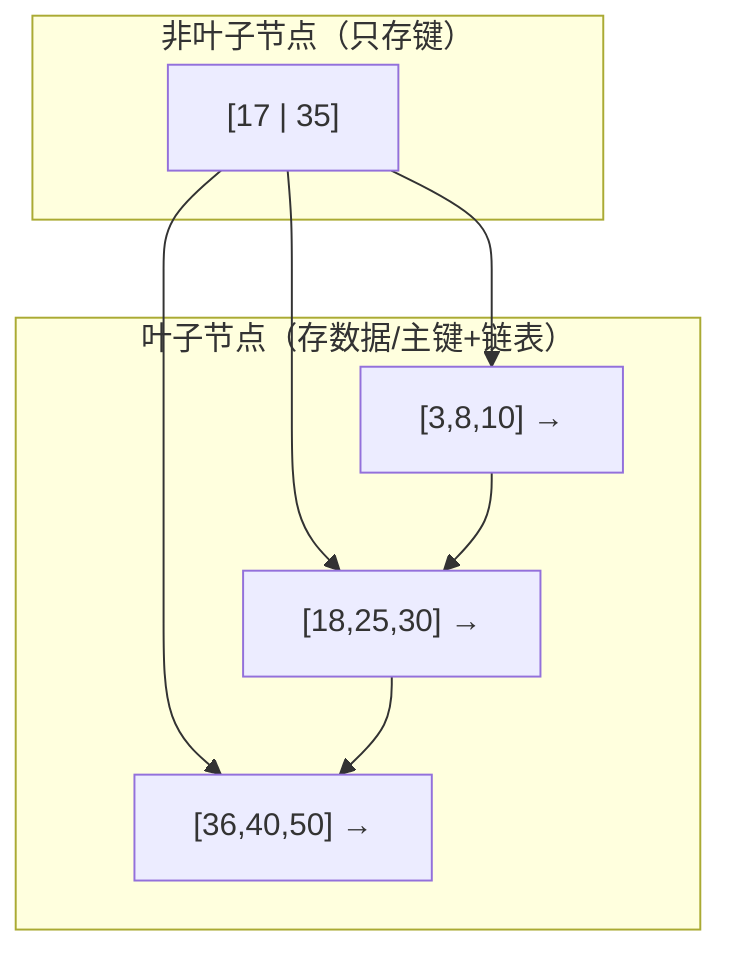
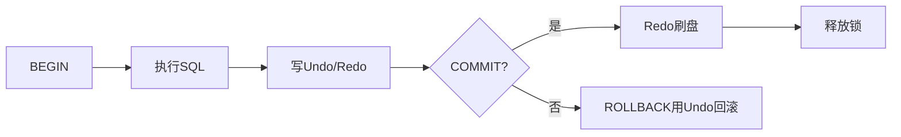
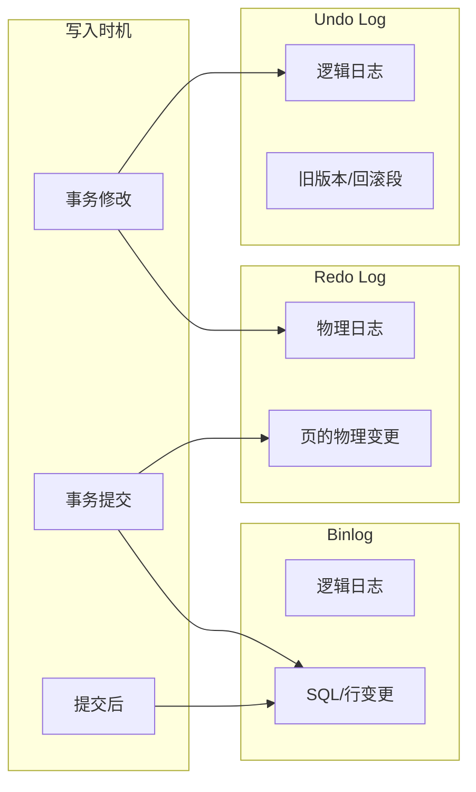

# 🧭 MySQL 学习与实战手册

> 系统学习见下文各章；日常常用 SQL、命令与场景速查见同目录《常用SQL与使用场景》。

------

## 第一章：MySQL 基础概念与环境搭建

------

> **本章在整体中解决什么问题**：建立对 MySQL 的「第一印象」——什么是数据库与 DBMS、关系型与非关系型的区别、**MySQL 三层架构与一条 SQL 如何执行**、如何安装与验证。学完本章再学**第二章**会动手写 DDL/DML/DQL；**第三章索引**会用到「执行流程」里的优化器与引擎；**第四章事务**会用到 Server 层与引擎层的事务与锁。

------

## 1. 数据库基本概念

### 1.1 三个关键词：Database / DBMS / SQL

> **一句话**：**Database** 是「按结构存好的数据集合」；**DBMS** 是「管这些数据的软件」（如 MySQL）；**SQL** 是「对 DBMS 发指令的标准语言」。
> **为什么分这三者**：数据要持久化、多用户共享、保证一致，就要有专门软件（DBMS）来管理；大家用同一套语言（SQL）才能跨库、跨产品协作。
> **类比**：Database 像仓库里的货，DBMS 像仓库管理系统（入库、出库、盘点），SQL 像你给系统下的「查库存、下单」的指令。

- **Database（数据库）**：按照特定结构组织、长期存储的有序数据集合。
- **DBMS（数据库管理系统）**：管理数据库的软件，如 **MySQL / PostgreSQL / Oracle**。提供存储、查询、并发控制、恢复等能力。
- **SQL（结构化查询语言）**：操作关系型数据库的标准语言，分为：
  - **DDL**：定义结构（`CREATE / ALTER / DROP`）
  - **DML**：增删改（`INSERT / UPDATE / DELETE`）
  - **DQL**：查询（`SELECT`）
  - **DCL**：权限（`GRANT / REVOKE`）
  - **TCL**：事务（`COMMIT / ROLLBACK / SAVEPOINT`）

### 1.2 关系型 vs 非关系型

| 对比项   | 关系型（RDBMS）             | 非关系型（NoSQL）            |
| -------- | --------------------------- | ---------------------------- |
| 数据模型 | 表-行-列，强 Schema         | Key-Value / 文档 / 列族 / 图 |
| 查询语言 | 标准 SQL                    | 非标准，API/DSL              |
| 事务     | 强事务（ACID）              | 一般弱事务/最终一致          |
| 典型场景 | 业务系统、强一致            | 高并发、海量缓存、大文本     |
| 代表     | MySQL / PostgreSQL / Oracle | Redis / MongoDB / Cassandra  |

### 1.3 常见数据库对比

| 产品           | 免费 | 生态 | 事务 | 特长                     | 典型使用               |
| -------------- | ---- | ---- | ---- | ------------------------ | ---------------------- |
| **MySQL**      | ✅    | 最广 | ✅    | Web/OLTP、读多写多       | 互联网主流、微服务后台 |
| **PostgreSQL** | ✅    | 强   | ✅    | 标准性/复杂查询/扩展性强 | 数据分析 + OLTP        |
| **Oracle**     | ❌    | 商业 | ✅    | 企业级稳健/特性全面      | 金融、电信、核心系统   |
| **MongoDB**    | ✅    | 强   | 弱   | 文档型、灵活 Schema      | 日志、内容管理         |

------

## 2. MySQL 架构介绍

### 2.1 三层架构

1. **客户端层（Client Layer）**：各种连接器与协议（JDBC、ODBC、MySQL Shell、`mysql` 命令行）。
2. **Server 层（SQL 层）**：认证、权限、SQL 解析、查询优化、执行器、插件体系（UDF、Audit、复制等）。
3. **存储引擎层（Engine 层）**：InnoDB（默认）、MyISAM、Memory 等，通过 **Handler API** 与 Server 层解耦。

> 注意：**Query Cache** 在 MySQL 8.0 已移除；主流仅使用 **InnoDB**。

### 2.2 SQL 执行主流程

1. **连接与鉴权**：握手、认证、权限校验（用户/库/表/列/视图）。
2. **解析（Parser）**：
   - 词法/语法分析生成 **AST**（抽象语法树）；
   - 预处理器做语义校验（表/列是否存在、权限、别名解析）。
3. **优化（Optimizer）**：
   - **基于代价（CBO）**：利用统计信息选择最优访问路径与 Join 顺序；
   - 选择索引（范围匹配、覆盖索引、回表）、Join 算法（Nested Loop / Block Nested Loop / Hash Join 8.0+）。
4. **执行（Executor）**：
   - 按执行计划调用引擎接口（`handler`）逐行读写；
   - 事务与锁控制、MVCC 可见性；返回结果给客户端。

### 2.3 核心组件速记

- **Connector**：连接器/协议封装（支持 SSL、压缩、KeepAlive）。
- **Parser/Preprocessor**：语法树 + 语义校验。
- **Optimizer**：基于代价的优化器（统计信息、等价变换、Join 重排）。
- **Executor**：驱动执行，向引擎发起`read_row`/`index_read`等调用。
- **存储引擎（InnoDB）**：Buffer Pool、Redo/Undo、两阶段提交、行锁、MVCC。

------

## 3. MySQL 安装与配置

> 推荐版本：**MySQL 8.0+**。字符集使用 **utf8mb4**（完整支持 Emoji）。

### 3.1 Windows 安装（两种主流）

**方式 A：MSI 安装包（适合初学者）**

1. 下载：MySQL Community (MSI Installer)。
2. 选择 **Server only** 或 **Developer Default**。
3. 设置 root 密码、端口（默认 `3306`）、服务名（如 `MySQL80`）。
4. 完成后用 **MySQL Workbench** / `mysql.exe` 连接测试。

**方式 B：ZIP 免安装包（便携/自定义）**

1. 解压到如 `D:\mysql-8.0.x`。

2. 初始化数据目录：

   ```powershell
   cd D:\mysql-8.0.x\bin
   .\mysqld --initialize --console
   ```

   记录控制台输出的 **临时 root 密码**。

3. 安装服务并启动：

   ```powershell
   .\mysqld --install MySQL80 --defaults-file="D:\mysql-8.0.x\my.ini"
   net start MySQL80
   ```

4. 首次登录并修改密码：

   ```powershell
   .\mysql -uroot -p
   ALTER USER 'root'@'localhost' IDENTIFIED BY 'NewStrong#Pass123';
   ```

> Windows 常见问题：端口被占用（改 `my.ini` 端口或释放 3306）、权限不足（以管理员运行 PowerShell）。

### 3.2 Linux 安装（生产更常见）

**方式 A：APT（Debian/Ubuntu）**

```bash
sudo apt update
sudo apt install mysql-server -y
sudo systemctl enable --now mysql
sudo mysql_secure_installation   # 安全向导：root密码/移除匿名用户/禁远程root等
```

**方式 B：YUM/DNF（CentOS/RHEL/AlmaLinux）**

```bash
sudo dnf install @mysql -y   # 或使用官方 Yum Repo 安装社区版
sudo systemctl enable --now mysqld
sudo grep 'temporary password' /var/log/mysqld.log   # 查临时root密码（若需要）
sudo mysql_secure_installation
```

**方式 C：官方二进制包（自定义路径/版本）**

```bash
# 1) 创建用户和目录
sudo useradd -r -s /sbin/nologin mysql
sudo mkdir -p /data/mysql/{data,log,tmp}
sudo chown -R mysql:mysql /data/mysql

# 2) 初始化（切换到解压目录的bin下）
sudo ./mysqld --initialize --user=mysql --datadir=/data/mysql/data

# 3) 配置 systemd 并启动（见下文 my.cnf 示例）
sudo systemctl enable --now mysqld
```

> Linux 常见问题：`SELinux`/`AppArmor` 限制、`/etc/my.cnf` 路径冲突、权限/属主错误导致启动失败（看 `log_error`）。

### 3.3 MySQL Shell 与命令行工具

- **mysql（经典 CLI）**：最常用命令行客户端。

  ```bash
  mysql -h127.0.0.1 -P3306 -uroot -p
  ```

  常用选项：
   `-e "SQL语句"`（一次性执行）、`--pager`（分页器）、`--table/--raw`（输出格式）。

- **MySQL Shell（`mysqlsh`）**：支持 **SQL / JavaScript / Python** 三种模式，适合自动化与 InnoDB Cluster/复制管理。

  ```bash
  mysqlsh root@localhost:3306 --sql
  \sql    # 切换 SQL
  \js     # 切换 JavaScript
  \py     # 切换 Python
  ```

- **Workbench**：图形化管理，适合初学/可视化 ER、慢 SQL 分析。

### 3.4 配置文件 `my.cnf` / `my.ini` 详解（关键项）

> **文件位置**
>  Linux：`/etc/my.cnf` 或 `/etc/mysql/my.cnf`；
>  Windows：安装目录下 `my.ini`；
>  也可通过 `--defaults-file=/path/to/my.cnf` 指定。

**A. 通用开发环境示例（小内存/单机）**

```ini
[client]
default_character_set = utf8mb4

[mysql]
prompt="\\u@\\h (\\d)> "
pager = less -SFX

[mysqld]
# 基础
user = mysql
port = 3306
bind-address = 0.0.0.0
basedir = /usr/local/mysql
datadir = /data/mysql/data
tmpdir  = /data/mysql/tmp
socket  = /var/lib/mysql/mysql.sock
pid-file = /var/run/mysqld/mysqld.pid

# 字符集与排序规则
character_set_server = utf8mb4
collation_server     = utf8mb4_0900_ai_ci

# SQL 模式（开发期可适度放宽，生产更严格）
sql_mode = STRICT_TRANS_TABLES,ERROR_FOR_DIVISION_BY_ZERO,NO_ENGINE_SUBSTITUTION

# InnoDB 关键参数
default_storage_engine = InnoDB
innodb_buffer_pool_size = 1G
innodb_log_file_size    = 256M
innodb_flush_log_at_trx_commit = 1      # 1最安全、写入最频繁；开发可设2提升性能
innodb_flush_method = O_DIRECT
innodb_file_per_table = 1

# 连接与超时
max_connections = 300
wait_timeout = 28800
interactive_timeout = 28800

# 慢日志（强烈建议开启以定位慢SQL）
slow_query_log = 1
slow_query_log_file = /data/mysql/log/slow.log
long_query_time = 1
log_queries_not_using_indexes = 0

# 错误日志
log_error = /data/mysql/log/error.log

# 二进制日志（主从/恢复需要；只读实例可关闭）
server_id = 1
log_bin = /data/mysql/log/binlog
binlog_format = ROW
sync_binlog = 1                 # 1最安全；开发可设0提升TPS
expire_logs_days = 7            # 或 binlog_expire_logs_seconds

# GTID（主从/高可用建议开启）
gtid_mode = ON
enforce_gtid_consistency = ON

# 时间与校时
default_time_zone = "+08:00"
```

**B. 生产环境要点（在以上基础上）**

- **内存**：`innodb_buffer_pool_size ≈ 60%~70%` 物理内存；
- **日志可靠性**：`innodb_flush_log_at_trx_commit=1`，`sync_binlog=1`；
- **安全**：限制 `bind-address`、最小权限账户、禁用远程 root；
- **审计**：开启慢日志、定期归档；必要时引入审计插件；
- **备份**：物理备份（XtraBackup）+ 逻辑备份（mysqldump）；
- **监控**：Prometheus + Exporter，监控 QPS/延迟/命中率/锁等待。

> **字符集**务必统一为 **utf8mb4**，否则 Emoji/多语言可能乱码。

### 3.5 启动与连接测试

**启动 / 停止 / 状态**

```bash
# Linux systemd
sudo systemctl start mysqld
sudo systemctl stop mysqld
sudo systemctl status mysqld

# Windows
net start MySQL80
net stop MySQL80
```

**首次安全配置**

```bash
# Linux 一键安全向导
sudo mysql_secure_installation
# 包含：设置 root 密码、移除匿名用户、禁远程 root、删除 test 库、重载权限表
```

**登录与基础连通性**

```bash
mysql -h127.0.0.1 -P3306 -uroot -p

-- 连接后测试
SELECT VERSION();
SHOW VARIABLES LIKE 'character_set_server';
SHOW VARIABLES LIKE 'collation_server';
SHOW DATABASES;
CREATE DATABASE demo DEFAULT CHARACTER SET utf8mb4;
USE demo;
CREATE TABLE t1(id INT PRIMARY KEY, name VARCHAR(50));
INSERT INTO t1 VALUES(1,'你好👋');
SELECT * FROM t1;
```

**远程连接（常见问题）**

```sql
-- 创建仅具备最小权限的远程用户
CREATE USER 'appuser'@'10.0.%' IDENTIFIED BY 'Strong#Pass123';
GRANT SELECT,INSERT,UPDATE,DELETE ON demo.* TO 'appuser'@'10.0.%';
FLUSH PRIVILEGES;

-- 如果被防火墙/安全组拦截：放行 3306 端口
```

**常见异常排查**

- **无法启动**：查看 `log_error`，检查 `datadir`、权限属主、端口冲突。

- **中文乱码**：确保客户端/服务端/连接层三处统一 `utf8mb4`：

  ```ini
  [client] default_character_set=utf8mb4
  [mysqld] character_set_server=utf8mb4
  [mysql]  default_character_set=utf8mb4
  ```

- **远程连不上**：检查 `bind-address`、用户授权、网络ACL/防火墙。

------

## 4. 小结与实践建议

- **第一步**：安装 8.0，统一字符集 utf8mb4，开启慢日志。
- **第二步**：用 `mysql`/`mysqlsh` 连接，跑一遍建库建表 CRUD。
- **第三步**：按示例配置 `my.cnf`，理解每个参数的意图并记录。
- **第四步**：在你项目（黑马点评/苍穹外卖）上跑 **Explain** 与慢日志，形成你自己的经验表。

------

### 常见坑与注意点

| 现象 / 易错点 | 原因 | 怎么改 / 怎么记 |
|---------------|------|-----------------|
| 装完 MySQL 连不上或密码错 | 未记录初始化临时密码、或未改 root 密码 | Windows ZIP 安装后看控制台**临时 root 密码**；首次登录用 `ALTER USER` 改密。 |
| 字符集乱码或 Emoji 存不进去 | 用了 utf8（最多 3 字节）而非 **utf8mb4** | 库/表/连接统一用 **utf8mb4**；`my.ini` / `my.cnf` 与建库建表都指定。 |
| 不知道 SQL 在哪儿执行的 | 未建立「连接→解析→优化→执行→引擎」的流程感 | 记住：**Server 层**解析与优化，**引擎层**（如 InnoDB）真正读数据；索引、事务在引擎层。 |

------

### 与前后章的衔接

- **下一章**：第二章 **SQL 语言基础**（DDL/DML/DQL/DCL）是写表结构、写数据、写查询的主战场，本章的「SQL 分类」会在第二章展开成可执行语句。
- **第三、四章**：**索引**与**事务**会反复用到本章的「SQL 执行流程」与「Server 层 + 引擎层」划分；面试问「一条 SQL 怎么执行」可从这里答到优化器、再延伸到索引与锁。

------

# 第二章：SQL 语言基础

------

> **本章在整体中解决什么问题**：第一章建立了「数据库、MySQL 架构、SQL 是什么」的认知，本章**动手写 SQL**——DDL 建表改表、DML 增删改、DQL 查询、DCL 权限。学完本章才能在建好的表上做**第三章索引**的创建与优化、**第四章事务**的 BEGIN/COMMIT 实践；后续慢查询、主从、备份都会用到这些语句。

------

## 1. SQL 分类概述

SQL（Structured Query Language，结构化查询语言）是所有关系型数据库的通用语言。
 根据用途，可以分为五大类（四类为主）：

| 类型    | 全称                         | 功能                | 示例                              |
| ------- | ---------------------------- | ------------------- | --------------------------------- |
| **DDL** | Data Definition Language     | 定义/修改数据库结构 | `CREATE`, `ALTER`, `DROP`         |
| **DML** | Data Manipulation Language   | 增删改表中数据      | `INSERT`, `UPDATE`, `DELETE`      |
| **DQL** | Data Query Language          | 查询数据            | `SELECT`                          |
| **DCL** | Data Control Language        | 控制权限            | `GRANT`, `REVOKE`                 |
| **TCL** | Transaction Control Language | 事务控制            | `COMMIT`, `ROLLBACK`, `SAVEPOINT` |

------

## 2. DDL：定义与修改表结构

### 2.1 创建/删除数据库

```sql
-- 创建数据库
CREATE DATABASE school CHARACTER SET utf8mb4 COLLATE utf8mb4_general_ci;

-- 查看所有数据库
SHOW DATABASES;

-- 删除数据库
DROP DATABASE IF EXISTS school;

-- 使用数据库
USE school;
```

> ✅ **注意**：生产环境删除数据库前必须备份；可通过 `mysqldump` 导出。

------

### 2.2 创建表

```sql
CREATE TABLE student (
    id INT PRIMARY KEY AUTO_INCREMENT COMMENT '学生编号',
    name VARCHAR(50) NOT NULL COMMENT '学生姓名',
    gender ENUM('男','女') DEFAULT '男' COMMENT '性别',	# ENUM枚举类型，定义包含固定值的列表
    age TINYINT CHECK (age BETWEEN 0 AND 100) COMMENT '年龄',	# check限制列取值范围
    email VARCHAR(100) UNIQUE COMMENT '邮箱',
    class_id INT COMMENT '班级编号',
    create_time DATETIME DEFAULT CURRENT_TIMESTAMP,
    FOREIGN KEY (class_id) REFERENCES class(id)		# 外键约束的定义，建立表之间的关系
) ENGINE=InnoDB DEFAULT CHARSET=utf8mb4;
```

#### 主要数据类型分类

| 类型   | 示例                                | 描述                  |
| ------ | ----------------------------------- | --------------------- |
| 数值型 | INT, TINYINT, BIGINT, DECIMAL(10,2) | 整数与小数            |
| 字符型 | CHAR(10), VARCHAR(255), TEXT        | 固定 / 可变长度字符串 |
| 时间型 | DATE, TIME, DATETIME, TIMESTAMP     | 日期与时间            |
| 枚举型 | ENUM('A','B','C')                   | 预定义的可选值集合    |
| 布尔型 | BOOLEAN (实质是 TINYINT(1))         | 0/1 表示 true/false   |

------

### 2.3 修改表结构

```sql
-- 添加字段
ALTER TABLE student ADD COLUMN phone VARCHAR(20);

-- 修改字段类型或默认值
ALTER TABLE student MODIFY COLUMN age SMALLINT DEFAULT 18;

-- 修改字段名
ALTER TABLE student CHANGE COLUMN phone mobile VARCHAR(20);

-- 删除字段
ALTER TABLE student DROP COLUMN mobile;

-- 添加主键或外键
ALTER TABLE student ADD CONSTRAINT（约束） pk_id PRIMARY KEY (id);
ALTER TABLE student ADD CONSTRAINT fk_class FOREIGN KEY (class_id) REFERENCES class(id);
```

------

### 2.4 删除表

```sql
DROP TABLE IF EXISTS student;
```

> ⚠️ 删除表时会清除所有数据结构与记录，无法恢复。

------

### 2.5 约束类型总结

| 约束类型        | 含义                           | 示例                                          |
| --------------- | ------------------------------ | --------------------------------------------- |
| **PRIMARY KEY** | 唯一标识一行记录               | `id INT PRIMARY KEY`                          |
| **FOREIGN KEY** | 维护表之间引用完整性           | `FOREIGN KEY (class_id) REFERENCES class(id)` |
| **UNIQUE**      | 保证字段唯一                   | `email VARCHAR(100) UNIQUE`                   |
| **NOT NULL**    | 不允许为空                     | `name VARCHAR(50) NOT NULL`                   |
| **DEFAULT**     | 设置默认值                     | `gender ENUM('男','女') DEFAULT '男'`         |
| **CHECK**       | 限定取值范围（MySQL 8.0+有效） | `CHECK (age BETWEEN 0 AND 120)`               |

> ✅ 建议：业务主键用 **自增主键** 或 **雪花算法ID**；
>  逻辑唯一性用 **UNIQUE约束**。

------

## 3. DML：数据操作语言

### 3.1 插入数据（INSERT）

```sql
-- 单条插入
INSERT INTO student (name, gender, age, email) VALUES ('张三', '男', 20, 'zhangsan@example.com');

-- 多条插入
INSERT INTO student (name, gender, age, email)
VALUES 
('李四', '男', 22, 'lisi@example.com'),
('王五', '女', 19, 'wangwu@example.com');

-- 插入部分列
INSERT INTO student (name, age) VALUES ('赵六', 21);
```

> ✅ **注意**：未写入的列若有 `DEFAULT` 值或 `AUTO_INCREMENT`，会自动填充。

------

### 3.2 更新数据（UPDATE）

```sql
-- 修改单条
UPDATE student SET age = 23 WHERE id = 2;

-- 修改多条
UPDATE student SET class_id = 3 WHERE gender = '女';

-- 安全更新模式
SET SQL_SAFE_UPDATES = 0; -- 允许无 WHERE 更新（慎用）
```

------

### 3.3 删除数据（DELETE）

```sql
-- 删除单条
DELETE FROM student WHERE id = 3;

-- 删除所有数据（但保留表结构）
DELETE FROM student;

-- 更快清空表
TRUNCATE TABLE student;
```

> ⚠️ `DELETE` 可回滚；`TRUNCATE` 不可回滚、重置自增 ID。

------

### 3.4 批量插入与事务操作

```sql
START TRANSACTION;

INSERT INTO account (user, balance) VALUES ('A', 1000);
INSERT INTO account (user, balance) VALUES ('B', 1000);

UPDATE account SET balance = balance - 200 WHERE user = 'A';
UPDATE account SET balance = balance + 200 WHERE user = 'B';

COMMIT;
-- 若出错则 ROLLBACK 回滚
```

> ✅ MySQL 默认 autocommit=1，每条语句自动提交。事务需 `START TRANSACTION;` 开始。

------

### 3.5 自增字段与主键设计

```sql
CREATE TABLE orders (
    order_id BIGINT PRIMARY KEY AUTO_INCREMENT,
    order_no VARCHAR(32) UNIQUE,
    user_id INT,
    total DECIMAL(10,2),	# 小数，数字最多10 位，小数位2位
    create_time DATETIME DEFAULT CURRENT_TIMESTAMP
);
```

**设计建议：**

- 业务主键（`order_no`）可由应用生成（如雪花算法）。
- 数据库主键用于索引（AUTO_INCREMENT 或 BIGINT）。
- 分布式场景避免多库自增冲突 → 建议使用 UUID 或雪花ID。

------

## 4. DQL：数据查询语言

### 4.1 SELECT 基础语法

```sql
SELECT [DISTINCT] column_list	# DISTINCT去重复
FROM table_name
[WHERE conditions]
[GROUP BY column_list]	# 分组查询
[HAVING group_conditions]	# HAVING对分组后的结果进行筛选
[ORDER BY column_list ASC|DESC]		# ORDER BY 对查询结果进行排序
[LIMIT offset, count];	# LIMIT限制返回条数，offset起始偏移量，count返回条数
```

------

### 4.2 WHERE 条件过滤

```sql
-- 比较运算
SELECT * FROM student WHERE age >= 18;

-- 模糊匹配
SELECT * FROM student WHERE name LIKE '张%';

-- 多值匹配
SELECT * FROM student WHERE class_id IN (1, 2, 3);

-- 范围查询
SELECT * FROM student WHERE age BETWEEN 18 AND 25;

-- 逻辑组合
SELECT * FROM student WHERE gender='女' AND age<22;
```

> ✅ `LIKE` 通配符：`%` 任意字符数；`_` 单个字符。

------

### 4.3 排序与分页

```sql
-- 按年龄降序
SELECT * FROM student ORDER BY age DESC;

-- 按性别升序、年龄降序
SELECT * FROM student ORDER BY gender ASC, age DESC;

-- 分页查询：跳过前20条，取10条
SELECT * FROM student ORDER BY id LIMIT 20, 10;
```

> ✅ `LIMIT offset, count` 性能优化：建议使用索引或子查询防止深分页慢。

------

### 4.4 聚合与分组

```sql
-- 聚合函数
SELECT COUNT(*) AS 总人数, AVG(age) AS 平均年龄 FROM student;	# AS,as当作，作为；COUNT统计数据表的所有条数，所有字段为空也统计

-- 按性别分组统计
SELECT gender, COUNT(*) AS 人数, AVG(age) AS 平均年龄
FROM student
GROUP BY gender;

-- 分组后过滤（HAVING）
SELECT gender, COUNT(*) AS 人数
FROM student
GROUP BY gender
HAVING COUNT(*) > 2;
```

> ✅ `WHERE` 作用于行过滤；`HAVING` 作用于分组后过滤。

------

### 4.5 去重查询

```sql
SELECT DISTINCT gender FROM student;
```

> ✅ DISTINCT 作用于后面所有字段的组合结果。

------

### 4.6 子查询（Subquery）

```sql
-- 标量子查询
SELECT * FROM student WHERE class_id = (SELECT id FROM class WHERE name='软件1班');

-- 列子查询
SELECT name FROM student WHERE id IN (SELECT student_id FROM score WHERE subject='数学');

-- 表子查询，JOIN默认内连接
SELECT s.name, t.total 
FROM student s
JOIN (SELECT student_id, SUM(score) AS total FROM score GROUP BY student_id) t	# 子查询先执行，算出总分存入临时表，命名为t
ON s.id = t.student_id;	# ON指定连接条件
```

> ✅ 子查询结果可作为虚拟表、条件或计算字段使用。

------

### 4.7 联合查询（UNION）

```sql
SELECT name, '男生' AS type FROM student WHERE gender='男'
UNION
SELECT name, '女生' FROM student WHERE gender='女';
```

> - `UNION` 默认去重；
> - 使用 `UNION ALL` 保留重复。

------

### 4.8 集合运算（MySQL 8.0.31+）

```sql
SELECT id FROM classA
INTERSECT
SELECT id FROM classB;   -- 取交集

SELECT id FROM classA
EXCEPT
SELECT id FROM classB;   -- 取差集
```

> ⚠️ MySQL 8.0.31 以前不支持 `INTERSECT`、`EXCEPT`，可用 `JOIN` 或 `NOT IN` 替代。

------

## 5. DCL：权限与用户管理

### 5.1 创建与删除用户

```sql
-- 创建用户
CREATE USER 'app_user'@'localhost' IDENTIFIED BY 'Passw0rd!';

-- 创建远程用户
CREATE USER 'app_user'@'%' IDENTIFIED BY 'Passw0rd!';

-- 删除用户
DROP USER 'app_user'@'%';
```

------

### 5.2 授权与收回权限

```sql
-- 授权：仅对特定数据库表
GRANT SELECT, INSERT, UPDATE ON school.student TO 'app_user'@'%';

-- 授权所有权限（开发环境可用，生产禁用）
GRANT ALL PRIVILEGES ON *.* TO 'admin'@'%' WITH GRANT OPTION;

-- 撤销权限
REVOKE UPDATE ON school.student FROM 'app_user'@'%';

-- 刷新权限表
FLUSH PRIVILEGES;
```

------

### 5.3 查看当前权限

```sql
SHOW GRANTS FOR CURRENT_USER;
SHOW GRANTS FOR 'app_user'@'%';
```

------

### 5.4 常见权限类别

| 权限                              | 说明                |
| --------------------------------- | ------------------- |
| SELECT / INSERT / UPDATE / DELETE | 数据表读写          |
| CREATE / DROP / ALTER             | 定义结构            |
| INDEX                             | 创建或删除索引      |
| GRANT OPTION                      | 允许继续授权        |
| SUPER / PROCESS / RELOAD          | 管理类权限（仅DBA） |
| ALL PRIVILEGES                    | 所有权限            |

------

### 5.5 实战建议

- 应用层用户仅授予 **最小必要权限**；
- 禁止 root 远程登录；
- 按项目或服务划分独立账号；
- 定期审计 `mysql.user` 表，清理无效用户。

------

## ✅ 小结与实战建议

| 学习点 | 建议                                              |
| ------ | ------------------------------------------------- |
| DDL    | 多实践 ALTER/CREATE，理解字段类型与约束           |
| DML    | 结合事务使用，掌握 DELETE vs TRUNCATE 区别        |
| DQL    | 掌握 WHERE + GROUP BY + HAVING + LIMIT 的组合使用 |
| DCL    | 学会用户权限分级与安全策略                        |

**实战练习建议：**

1. 为项目数据库编写完整的建表语句；
2. 用 SQL 完成复杂查询（如：查询平均分高于班级平均的学生）；
3. 使用 GRANT 为项目账户分配最小权限；
4. 练习 Explain 分析 SQL 查询性能（下一章将讲）。

------

### 常见坑与注意点

| 现象 / 易错点 | 原因 | 怎么改 / 怎么记 |
|---------------|------|-----------------|
| DELETE 删全表很慢或锁表 | 逐行删除、写 binlog、可能触发锁与等待 | 清空表且不需可回滚时用 **TRUNCATE TABLE**（DDL，快且重置自增）；注意 TRUNCATE 不能带 WHERE。 |
| 条件写错导致全表更新/删除 | 忘记写 WHERE 或 WHERE 条件恒真（如 `id = id`） | **UPDATE/DELETE 前先 SELECT 同条件**确认行数；生产可用事务 + 先查后改。 |
| 字符串/数字比较隐式转换导致索引失效 | 如 `WHERE phone = 13800138000`（phone 为 varchar） | 条件与列类型一致：**phone = '13800138000'**；第三章会讲索引与类型匹配。 |

### 索引失效：错误 vs 正确示例（为第三章铺垫）

| 场景 | 错误写法 / 现象 | 正确写法 / 做法 |
|------|-----------------|-----------------|
| **条件列用函数** | `WHERE YEAR(create_time)=2024`，索引失效 | 范围写常量：**WHERE create_time >= '2024-01-01' AND create_time < '2025-01-01'**，便于走索引。 |
| **LIKE 左模糊** | `WHERE name LIKE '%张'`，无法用 name 索引 | 尽量**右模糊**：**LIKE '张%'**；必须左模糊时考虑全文索引或 ES。 |
| **隐式类型转换** | `WHERE phone = 13800138000`（phone 为 varchar） | **WHERE phone = '13800138000'**，类型与列一致，避免对列做函数。 |
| **联合索引跳过最左列** | 索引 (a,b,c)，写 `WHERE b=2 AND c=3` | 条件包含**最左列**：**WHERE a=1 AND b=2 AND c=3**，或至少 **WHERE a=1**。 |

------

### 与前后章的衔接

- **上一章**：第一章讲了 MySQL 架构与 SQL 执行流程；本章是**具体写 DDL/DML/DQL/DCL**，在「执行器」里跑的就是这些语句。
- **下一章**：第三章 **索引与查询优化** 会讲如何给表加索引、如何用 Explain 看 DQL 是否走索引，本章的建表与 SELECT 是索引优化的前提。

------

# 第三章：索引（Index）与查询优化

------

## 1. 索引基本概念

### 1.1 索引的定义与作用

> **索引（Index）** 是帮助 MySQL **高效获取数据** 的一种数据结构，
>  类似于书的“目录”，可显著提升查询性能。

**主要作用：**

- 提高数据检索效率（避免全表扫描）；
- 加快排序、分组、连接；
- 减少磁盘 I/O 操作。

**代价：**

- 建立索引会占用存储空间；
- 增删改操作需维护索引，性能略降；
- 索引过多会降低写性能。

------

### 1.2 索引分类

| 索引类型                    | 说明                                   | 示例                                  |
| --------------------------- | -------------------------------------- | ------------------------------------- |
| **主键索引（PRIMARY KEY）** | 唯一且非空；表中只能有一个             | `id INT PRIMARY KEY`                  |
| **唯一索引（UNIQUE）**      | 不允许重复，但可为空                   | `email VARCHAR(50) UNIQUE`            |
| **普通索引（INDEX）**       | 可重复值                               | `INDEX idx_name(name)`                |
| **全文索引（FULLTEXT）**    | 用于文本搜索（仅 CHAR、VARCHAR、TEXT） | `FULLTEXT INDEX idx_content(content)` |
| **联合索引（Composite）**   | 多列组合索引                           | `INDEX idx_user_age(name, age)`       |

------

### 1.3 索引的优缺点总结

| 优点                 | 缺点               |
| -------------------- | ------------------ |
| 提高查询速度         | 插入/更新/删除变慢 |
| 降低排序与分组代价   | 占用磁盘空间       |
| 约束唯一性（UNIQUE） | 不适合频繁变动的列 |

> ✅ 建议：读多写少的字段建立索引，频繁更新的字段谨慎添加。

------

## 2. 索引底层原理

### 2.1 索引的存储结构：B+ 树

**B+树特点：**

1. 所有数据都存储在叶子节点；
2. 叶子节点之间通过链表相连（方便范围查询）；
3. 非叶子节点只存储索引键，不存储数据；
4. 树高一般为 2~4 层（百万级数据只需 3~4 次磁盘 I/O）。

**B+树 vs B树对比：**

| 项目     | B树      | B+树             |
| -------- | -------- | ---------------- |
| 数据存储 | 各层节点 | 仅叶子节点       |
| 范围查询 | 需遍历树 | 叶子链表直接扫描 |
| I/O次数  | 较多     | 更少（高效）     |
| 应用     | 文件系统 | 数据库索引       |

**B+ 树简图（面试可画）**：



📘 **示意图：**

```
        [17|35]
       /    |    \
 [3,8,10] [18,25,30] [36,40,50]
```

- 查询键 `25`：
  1. 17 < 25 ≤ 35 → 进入中间节点；
  2. 在叶子节点 `[18,25,30]` 查找到；
  3. 一次磁盘 I/O 完成。

------

### 2.2 聚簇索引（Clustered Index）

> InnoDB 的主键索引是 **聚簇索引**。

- 数据与主键索引 **存储在同一个 B+树**；
- 叶子节点存放 **完整行数据**；
- 每张表只能有一个聚簇索引（一般为主键）；
- 若无主键，InnoDB 会自动选一个唯一非空索引或隐藏 row_id。

📘 **示意图：**

```
[主键值] → [整行记录数据]
```

------

### 2.3 非聚簇索引（辅助索引 / Secondary Index）

- 索引的叶子节点存放的是 **主键值**；
- 查询时需“回表”：通过主键再次查询聚簇索引。

📘 **示意图：**

```
[索引列值] → [主键值] → [整行数据]
```

**示例：**

```sql
SELECT * FROM user WHERE name = 'Tom';
```

- `idx_name` 为普通索引；
- 查询到 `name='Tom'` 对应主键；
- 再根据主键去聚簇索引取整行。

> ✅ “回表”开销高 → 若 SELECT 字段都在索引中，可用 **覆盖索引** 优化。

------

### 2.4 覆盖索引（Covering Index）

> 查询所需字段 **全部包含在索引中**，无需回表。

```sql
SELECT name, age FROM user WHERE name = 'Tom';
```

若联合索引 `(name, age)` 存在，则可直接返回结果，无需访问表数据。

**优势：**

- 少一次磁盘 I/O；
- 显著提升查询性能。

------

### 2.5 前缀索引（Prefix Index）

> 对长字符串字段，只索引前 N 个字符。

```sql
CREATE INDEX idx_email_prefix ON user(email(10));
```

**优点**：节省空间。
 **缺点**：不能用于 ORDER BY、GROUP BY，且选择性降低。

------

### 2.6 最左前缀原则（联合索引核心）

```sql
CREATE INDEX idx_user (name, age, city);
```

索引生效的组合为：
 ✅ `(name)`、`(name, age)`、`(name, age, city)`
 ❌ `(age)`、`(city)`、`(age, city)`

> **规律：** 从左向右连续匹配，若中间断开则后续失效。

**示例：**

```sql
WHERE name='Tom' AND age=20    → ✅ 用索引
WHERE age=20 AND city='BJ'     → ❌ 不用索引
WHERE name LIKE 'T%'           → ✅ 用索引
WHERE name LIKE '%T%'          → ❌ 前缀不匹配
```

------

### 2.7 索引失效的常见原因

| 原因                      | 示例                                | 说明                         |
| ------------------------- | ----------------------------------- | ---------------------------- |
| ① 使用函数或表达式        | `WHERE YEAR(create_time)=2024`      | 函数导致索引失效             |
| ② LIKE 以 `%` 开头        | `LIKE '%abc'`                       | 破坏前缀匹配                 |
| ③ 隐式类型转换            | `WHERE phone=13800138000`           | 若字段为字符串类型则转换失效 |
| ④ OR 条件中含非索引列     | `WHERE name='Tom' OR age=20`        | 部分字段无索引               |
| ⑤ !=、<>、IS NULL、NOT IN | `WHERE age<>18`                     | 索引利用率低                 |
| ⑥ 组合索引未遵循最左前缀  | `(name, age)` → `WHERE age=20` 无效 |                              |
| ⑦ 数据量太小              | 优化器判断全表扫描更快              |                              |

### 索引失效一览表（速查）

| 原因 | 典型写法 | 建议 |
|------|----------|------|
| 对索引列用函数/表达式 | `YEAR(create_time)=2024`、`id+1=10` | 条件侧改为常量或范围，避免对列运算 |
| LIKE 左模糊 | `LIKE '%abc'`、`LIKE '%a%'` | 尽量 `LIKE 'a%'`；必要时全文/ES |
| 隐式类型转换 | 列 varchar，条件写数字 | 条件与列类型一致，如 `phone='138...'` |
| OR 一侧无索引 | `name='Tom' OR age=20` 且 age 无索引 | 为常用条件列建索引，或改写为 UNION |
| 联合索引未走最左 | `(a,b,c)` 下只写 `WHERE b=? AND c=?` | 条件包含最左列 a |
| !=、<>、NOT IN、IS NOT NULL | 部分场景优化器弃用索引 | 尽量用范围或 IN；结合 EXPLAIN 看 |

------

## 3. 索引创建与优化

### 3.1 索引创建语法

```sql
-- 创建索引
CREATE INDEX idx_user_name ON user(name);

-- 创建唯一索引
CREATE UNIQUE INDEX idx_user_email ON user(email);

-- 通过 ALTER TABLE 添加索引
ALTER TABLE user ADD INDEX idx_user_city(city);

-- 删除索引
DROP INDEX idx_user_name ON user;
```

> ✅ 命名规范：`idx_表名_字段名`（普通索引）、`uk_表名_字段名`（唯一索引）

------

### 3.2 何时建索引

✅ **适合建索引的列：**

- WHERE、JOIN、ORDER BY、GROUP BY 中频繁出现的列；
- 区分度高（唯一性强）的列；
- 外键列；
- 长字符串字段使用前缀索引。

🚫 **不适合建索引的列：**

- 小表（全表扫描更快）；
- 频繁更新的列；
- 区分度低的列（如性别、状态）；
- 函数、计算字段。

------

### 3.3 组合索引优化策略

- 把 **区分度高的列放在最左边**；
- 常见过滤条件优先；
- 避免创建重复或重叠索引；
- 注意多列顺序：`(a,b)` ≠ `(b,a)`；
- 查询条件应与索引顺序一致。

**示例优化：**

```sql
CREATE INDEX idx_user_name_age ON user(name, age);
SELECT * FROM user WHERE name='Tom' AND age=20;  -- 完全匹配
```

------

## 4. 查询优化

### 4.1 EXPLAIN：执行计划分析

```sql
EXPLAIN SELECT * FROM user WHERE name='Tom';
```

| 字段              | 含义                                                         |
| ----------------- | ------------------------------------------------------------ |
| **id**            | 查询的执行顺序（越大优先执行）                               |
| **select_type**   | 查询类型（SIMPLE / PRIMARY / SUBQUERY / DERIVED）            |
| **table**         | 当前操作的表名                                               |
| **type**          | 连接类型，**性能从好到差**：`system > const > eq_ref > ref > range > index > ALL` |
| **possible_keys** | 可使用的索引                                                 |
| **key**           | 实际使用的索引                                               |
| **key_len**       | 使用索引长度（字节）                                         |
| **rows**          | 预估扫描行数                                                 |
| **Extra**         | 额外信息，如 Using index、Using filesort、Using temporary    |

**示例：**

```sql
EXPLAIN SELECT * FROM student WHERE gender='女' AND age>18;
```

输出：

```
type=range, key=idx_gender_age, rows=120, Extra=Using index condition
```

说明：

- 使用范围索引；
- 扫描120行；
- 命中索引条件。

------

### 4.2 SQL 优化步骤（实战流程）

| 步骤                   | 说明                                  |
| ---------------------- | ------------------------------------- |
| ① **开启慢查询日志**   | `long_query_time=1`，收集慢 SQL       |
| ② **分析执行计划**     | 使用 `EXPLAIN` 确认索引是否命中       |
| ③ **查看索引使用情况** | `SHOW INDEX FROM table_name;`         |
| ④ **统计列选择性**     | `SELECT COUNT(DISTINCT col)/COUNT(*)` |
| ⑤ **调整语句结构**     | 避免函数、OR、%前缀；改写为范围或JOIN |
| ⑥ **优化分页**         | `LIMIT offset, size` 改为索引分页     |
| ⑦ **优化子查询**       | 改 JOIN / 临时表；使用 EXISTS 替代 IN |
| ⑧ **定期更新统计信息** | `ANALYZE TABLE table_name;`           |

------

### 4.3 常见性能瓶颈与解决方案

| 场景    | 原因              | 优化方案                              |
| ------- | ----------------- | ------------------------------------- |
| 查询慢  | 无索引 / 索引失效 | 建立合适索引，避免函数、模糊匹配      |
| 排序慢  | 未命中索引        | 为 ORDER BY 字段建索引；避免 filesort |
| 分页慢  | LIMIT 偏移量大    | 使用索引分页或子查询优化              |
| JOIN 慢 | JOIN 字段无索引   | 双表 JOIN 字段都需建索引              |
| 更新慢  | 索引太多          | 删除冗余索引；批量写入禁用索引        |
| I/O 高  | 大量全表扫描      | 检查 SQL + EXPLAIN 优化               |

**分页优化示例：**

```sql
-- 慢：OFFSET 100000 需扫描十万行
SELECT * FROM order LIMIT 100000, 20;

-- 优化：基于索引分页
SELECT * FROM order WHERE id > 100000 LIMIT 20;
```

------

### 4.4 优化综合案例

**问题：**

```sql
SELECT * FROM order WHERE user_id=101 AND status=1 ORDER BY create_time DESC;
```

**优化前：**

- 未建索引 → type=ALL，全表扫描。

**优化后：**

```sql
CREATE INDEX idx_user_status_time ON order(user_id, status, create_time DESC);
```

再执行 `EXPLAIN`：

```
type=range, key=idx_user_status_time, rows=50, Extra=Using index; Using where
```

✅ 查询性能提升百倍以上。

------

## ✅ 本章小结

| 主题     | 要点                                       |
| -------- | ------------------------------------------ |
| 索引结构 | MySQL 使用 B+树结构存储                    |
| 聚簇索引 | 主键索引包含完整数据                       |
| 覆盖索引 | 查询字段全部在索引中，无需回表             |
| 最左前缀 | 组合索引遵循从左到右匹配                   |
| 索引失效 | 函数、模糊匹配、类型转换等                 |
| 优化工具 | `EXPLAIN`、慢查询日志、`ANALYZE TABLE`     |
| 调优思路 | 先建索引 → 看执行计划 → 改写SQL → 分页优化 |

------

# 第四章：事务（Transaction）与锁机制

------

> **本章在整体中解决什么问题**：前面章节会写 SQL、建索引；本章讲 **事务 ACID**、**隔离级别**、**锁（行锁/间隙锁/Next-Key）**、**MVCC 与 Read View**，以及**死锁排查**。为**第六章日志**（Undo/Redo）打基础；面试必问「事务隔离」「如何避免死锁」。

------

## 1. 事务基础

### 1.1 ACID 四大特性

- **Atomicity 原子性**：事务中的操作要么全部成功、要么全部回滚。
   *实现关键*：**Undo Log**（回滚日志）。
- **Consistency 一致性**：事务前后，数据满足所有约束与不变量（主外键、唯一性、业务约束等）。
   *实现关键*：约束 + 触发器 + 日志 + 隔离机制。
- **Isolation 隔离性**：并发事务互不干扰。
   *实现关键*：**锁**与**MVCC**。
- **Durability 持久性**：提交的数据不会丢失。
   *实现关键*：**Redo Log**（重做日志） + 刷盘策略。

> InnoDB 使用 **“写前日志（WAL）”**：先写日志再落盘，异常重启通过 Redo 恢复已提交事务，通过 Undo 回滚未提交事务。

### 1.2 基本指令与用法

```sql
-- 关闭自动提交（会话级）
SET autocommit = 0;

-- 显式开始
START TRANSACTION;  -- 或 BEGIN;

-- 正常提交
COMMIT;

-- 出错回滚
ROLLBACK;

-- 设置保存点
SAVEPOINT sp1;

-- 回滚到保存点（不结束事务）
ROLLBACK TO sp1;

-- 释放保存点
RELEASE SAVEPOINT sp1;

-- 恢复自动提交
SET autocommit = 1;
```

**示例（转账）：**

```sql
START TRANSACTION;
UPDATE account SET balance = balance - 200 WHERE user_id = 1;
UPDATE account SET balance = balance + 200 WHERE user_id = 2;
COMMIT;
```

> 建议：**将业务操作封装在事务中**，遇异常时回滚，保证原子性。

**事务执行步骤（面试可答）**：① BEGIN/START TRANSACTION → ② 执行 DML（读/写）→ ③ 引擎层写 **Undo Log**（便于回滚）、写 **Redo Log**（便于崩溃恢复）→ ④ COMMIT 时 Redo 刷盘、释放锁；若 ROLLBACK 则用 Undo 回滚。

**事务流程简图**：



------

## 2. 并发问题与隔离级别

### 2.1 三类典型并发异常

- **脏读 Dirty Read**：读到**未提交**的数据。
- **不可重复读 Non-repeatable Read**：同一事务内两次读取**同一行**，结果不同（因为别的事务修改并提交了该行）。
- **幻读 Phantom**：同一事务内两次读取**同一范围**，第二次出现“新插入的行”（行数变化）。

### 2.2 四种隔离级别（从低到高）

| 隔离级别             | 可能问题               | InnoDB 默认  | 备注                           |
| -------------------- | ---------------------- | ------------ | ------------------------------ |
| **READ UNCOMMITTED** | 脏读、不可重复读、幻读 | 否           | 几乎不用                       |
| **READ COMMITTED**   | 不可重复读、幻读       | Oracle 默认  | 每次读取生成新快照             |
| **REPEATABLE READ**  | 幻读（被锁定读可避免） | ✅ MySQL 默认 | InnoDB 用 MVCC + Next-Key 防幻 |
| **SERIALIZABLE**     | 无并发问题             | 否           | 最强隔离，代价高，基本串行化   |

**设置隔离级别：**

```sql
-- 会话级
SET SESSION TRANSACTION ISOLATION LEVEL REPEATABLE READ;
-- 全局级（重启或新连接生效）
SET GLOBAL TRANSACTION ISOLATION LEVEL READ COMMITTED;
```

**要点**：

- InnoDB 在 **REPEATABLE READ** 下，使用 **一致性读（MVCC）** 让同一事务多次查询同一数据**可重复**；
- 对“范围 + 当前读（锁定读）”采用 **Next-Key 锁（行锁 + 间隙锁）** 避免幻读。

------

## 3. 锁机制（Locking）

### 3.1 锁的粒度与类型

- **表锁（Table Lock）**：一次锁住整张表，开销小、并发低（MyISAM 依赖多）。
- **行锁（Row Lock）**：仅锁住命中的行，开销大、并发高（InnoDB 依赖）。
- **意向锁（Intention Lock）**：表级锁，表明事务“打算”在某些行上加 S/X 锁。用于**行锁与表锁的兼容性判断**，避免大范围扫描。

### 3.2 锁的语义

- **S 锁（共享锁 / 读锁）**：允许其他会话加 S，不允许加 X。
- **X 锁（排他锁 / 写锁）**：独占，阻止其他 S/X。
- **IS/IX/SIX（意向锁）**：表级，配合行级 S/X 使用。

**兼容性速记：**

- S 与 S 兼容；S 与 X 不兼容；X 与任何锁不兼容。
- IS 与 IS/IX 兼容；IX 与 IX 兼容；SIX 与 S/IS 兼容性受限。

### 3.3 InnoDB 的行级锁细分

- **Record Lock（记录锁）**：锁住某条索引记录。
- **Gap Lock（间隙锁）**：锁住两个索引记录之间的“间隙”，防止插入。
- **Next-Key Lock**：Record Lock + Gap Lock，锁住**开区间 + 右闭区间**的范围；用于避免幻读。

> 间隙锁与 Next-Key 锁在 **REPEATABLE READ** 隔离下的**当前读**场景生效（如 `SELECT ... FOR UPDATE` / `UPDATE` / `DELETE`）。

### 3.4 锁定读（当前读）与快照读

- **快照读（一致性读）**：普通 `SELECT`，不加锁，读到的是**历史版本**（由 MVCC 提供）。

- **当前读（锁定读）**：

  ```sql
  SELECT ... FOR UPDATE;        -- X 锁，阻塞其他写与锁定读
  SELECT ... LOCK IN SHARE MODE;-- S 锁（8.0 等价 FOR SHARE）
  UPDATE ...; DELETE ...;       -- 隐式当前读，加行/间隙/Next-Key 锁
  ```

  当前读会读取**最新版本**并加锁，保证对该记录/范围的互斥访问。

### 3.5 双会话演示（行锁与阻塞）

**会话A：**

```sql
SET autocommit = 0;
SELECT * FROM user WHERE id = 100 FOR UPDATE;  -- 对 id=100 加 X 锁
-- 处理业务...
```

**会话B（此时执行）：**

```sql
UPDATE user SET name='Tom' WHERE id = 100;     -- 阻塞，等待会话A释放
```

**会话A：**

```sql
COMMIT;  -- 释放锁
```

会话B随后继续执行并成功更新。

### 3.6 死锁（Deadlock）检测与排查

**死锁产生**：两个（或以上）事务互相持有对方需要的锁并等待，形成环路。
 **表现**：其中一个事务被回滚，返回 `ER_LOCK_DEADLOCK`。

**快速排查：**

```sql
-- 方式1：经典引擎状态（最常用）
SHOW ENGINE INNODB STATUS\G

-- 方式2（MySQL 8.0）：性能视图
SELECT * FROM performance_schema.data_locks\G
SELECT * FROM performance_schema.data_lock_waits\G

-- 方式3（5.7 老方法）：信息视图（8.0 多已废弃）
SELECT * FROM information_schema.innodb_trx;
SELECT * FROM information_schema.innodb_locks;
SELECT * FROM information_schema.innodb_lock_waits;
```

**关键参数：**

```ini
innodb_deadlock_detect = ON             # 默认开启死锁检测
innodb_lock_wait_timeout = 50           # 超时回滚（秒）
```

**避免死锁的实践：**

- 访问**相同表/相同行**时，**固定顺序**访问；
- 尽量将大事务拆小，减少持锁时间；
- 索引设计合理，避免无索引导致大范围锁；
- 只锁需要的范围（精确 where 条件 + 命中索引）；
- 对热点更新采用**队列/分片/重试**策略。

------

## 4. MVCC（多版本并发控制）

### 4.1 核心目的

在不加锁的前提下，为读操作提供**一致性视图**，从而提高并发性能。
 InnoDB 通过 **Undo Log（回滚日志）** 保存历史版本，并为事务创建 **Read View（读视图）** 判断可见性。

### 4.2 Read View（读视图）要点

当事务在 **RC/RC（读提交/可重复读）** 下执行普通 `SELECT` 时，会生成 Read View（RR 下在事务第一次读时生成，之后复用；RC 下每次读都会新生成）。
 读视图包含：

- 生成时刻**活跃事务ID列表**（m_ids）
- 最小活跃事务ID（min_trx_id）
- 最大已分配事务ID（max_trx_id，或称 up_limit_id）
- 当前读视图创建者事务ID（creator_trx_id）

**可见性判断（简化版）**：

- 版本的 `trx_id < min_trx_id` → 一定可见（在快照生成前已提交）。
- 版本的 `trx_id ≥ max_trx_id` → 一定不可见（快照后开启的事务）。
- 若 `trx_id` 介于两者之间：
  - 若 `trx_id` 不在活跃列表 → 可见（已提交），
  - 否则不可见（“还在进行”的事务）。

### 4.3 Undo Log 与“快照读”

- **Undo Log** 保存被修改行的**旧版本**（逻辑回滚信息），用于回滚和构造历史视图；
- 普通 `SELECT`（快照读）通过沿着 Undo 链找到**在当前读视图可见**的版本。
- 后台 **Purge 线程** 在确认历史版本对任何活跃读视图都不可见后，清理旧版本。

### 4.4 当前读 vs 快照读

- **快照读**：`SELECT ...`（不带锁定），读**历史版本**（高并发、低阻塞）。
- **当前读**：`SELECT ... FOR UPDATE / FOR SHARE`、`UPDATE`、`DELETE`，读**最新版本并加锁**（保证修改安全）。

**幻读与 MVCC：**

- 在 **RR** 下，普通 `SELECT` 的快照读在同一事务内多次执行，读到的是**同一快照**，避免了“不可重复读”；
- 对“范围 + 写操作/锁定读”，InnoDB 使用 **Next-Key 锁** 防止其他事务插入“幻影行”，从而避免**幻读**。

------

## 5. 实战与最佳实践

### 5.1 常用诊断命令清单

```sql
-- 观察隔离级别
SHOW VARIABLES LIKE 'transaction_isolation';

-- 在线查看锁
SELECT * FROM performance_schema.data_locks\G;
SELECT * FROM performance_schema.data_lock_waits\G;

-- 经典引擎状态（含最近一次死锁信息）
SHOW ENGINE INNODB STATUS\G;

-- 查看当前事务
SELECT * FROM information_schema.innodb_trx;
```

### 5.2 常见问题与解决

| 症状            | 可能原因              | 解决思路                                              |
| --------------- | --------------------- | ----------------------------------------------------- |
| 更新阻塞        | 对同一行/范围加了锁   | 用 `SELECT ... FOR UPDATE` 保证顺序；缩小范围；加索引 |
| 大量锁等待      | 无索引导致范围锁扩大  | 索引覆盖 WHERE；避免函数；拆页                        |
| 幻读/范围写冲突 | 未用锁定读            | 改 `SELECT ... FOR UPDATE`；调整隔离级别              |
| 死锁            | 访问顺序不一致/大事务 | 固定顺序；拆小事务；重试机制                          |
| 脏读（少见）    | 级别过低              | 使用 RC/RR；默认 RR 足够                              |

### 5.3 事务边界与代码规范（建议）

- 业务层**明确事务边界**：进入点开始、异常统一回滚、正常统一提交；
- 避免**跨远程调用**的长事务；
- **先读后写**、**先唯一检查再变更**，并使用 **唯一索引** 做最终兜底；
- 高并发热点写：引入**排队/异步/分片**；
- 幂等设计：利用 **唯一键** + **去重表** + **业务幂等码**；
- 设置合理超时：`innodb_lock_wait_timeout`、应用侧重试。

## 6. 章节小结（会背就能用）

- **ACID**：Undo（原子性）、Redo（持久性），隔离靠锁+MVCC。
- **隔离级别**：MySQL 默认 **RR**；RC 每次读新快照；RR + Next-Key 能防幻。
- **锁**：行锁为主、配意向锁；当前读加锁，快照读不加锁。
- **死锁**：必考，`SHOW ENGINE INNODB STATUS\G` + 固定访问顺序 + 拆小事务。
- **MVCC**：Read View + Undo Log；快照读看历史版本，当前读看最新版本并加锁。

### 常见坑与注意点

| 现象 / 易错点 | 原因 | 怎么改 / 怎么记 |
|---------------|------|-----------------|
| 更新/删除阻塞很久 | 同一行被其他事务锁定（FOR UPDATE 或未提交） | 缩小事务范围、固定加锁顺序；用 **SHOW ENGINE INNODB STATUS** 或 **data_lock_waits** 查谁在等谁。 |
| 无索引更新导致锁全表 | WHERE 条件未命中索引，行锁升级为表锁或大范围锁 | 为 WHERE 条件列建索引；避免对无索引列做范围更新。 |
| 死锁后只重试一次就放弃 | 死锁时 InnoDB 回滚其一，业务未重试 | 捕获 **死锁异常**（如 ER_LOCK_DEADLOCK），**有限次数重试**；并检查访问顺序、拆小事务。 |
| 长事务不提交占满 Undo | 长事务导致 Undo 无法 purge，空间与版本链膨胀 | 避免跨 RPC/HTTP 的长事务；设置 **innodb_lock_wait_timeout**；监控长事务并告警。 |

------

# 第五章：存储引擎详解

------

## 1. 常见存储引擎概览

MySQL 的一大特色是**可插拔存储引擎架构**。
 不同引擎负责**数据存储与索引管理**，开发者可按场景选择。

### 1.1 存储引擎概念

- 每个表可以指定一个存储引擎（如 InnoDB、MyISAM）。
- 存储引擎决定：
  - 数据与索引的**物理存储结构**
  - **锁机制**（行锁/表锁）
  - 是否支持 **事务、外键、崩溃恢复**
  - **并发与缓存策略**

```sql
-- 查看可用引擎
SHOW ENGINES;

-- 查看表的存储引擎
SHOW TABLE STATUS LIKE 'student'\G

-- 修改表的存储引擎
ALTER TABLE student ENGINE = InnoDB;
```

------

### 1.2 InnoDB 引擎（默认）

> ⭐ 现代 MySQL 的核心引擎，支持事务、行级锁、MVCC。

| 特性     | 说明                                        |
| -------- | ------------------------------------------- |
| 事务支持 | 完整 ACID（支持 COMMIT / ROLLBACK）         |
| 锁机制   | 行级锁 + 间隙锁 + 意向锁（高并发）          |
| 并发控制 | MVCC，多版本并发控制                        |
| 外键     | ✅ 支持                                      |
| 缓冲机制 | Buffer Pool 缓存索引页与数据页              |
| 崩溃恢复 | Redo Log + DoubleWrite                      |
| 存储文件 | `.ibd`（每表独立）、`ibdata1`（系统表空间） |

**适用场景：**

- 在线交易系统（OLTP）
- 秒杀、订单、支付、库存等强一致场景
- 频繁读写 + 并发高的业务表

------

### 1.3 MyISAM 引擎

> 🚫 不支持事务，仅支持表级锁。

| 特性     | 说明                                             |
| -------- | ------------------------------------------------ |
| 事务支持 | ❌ 无                                             |
| 锁机制   | 表级锁（读写互斥）                               |
| 外键     | ❌ 无                                             |
| 并发性能 | 读多写少场景较快                                 |
| 存储文件 | `.frm`（表结构）+ `.MYD`（数据）+ `.MYI`（索引） |

**适用场景：**

- 日志、报表、只读统计系统
- 无需事务的中小型数据仓库

> ⚠️ 缺点：崩溃后易损坏；恢复慢。MySQL 5.7+ 已逐步弱化支持。

------

### 1.4 Memory 引擎（原名 Heap）

> 所有数据存储在内存中，速度极快，但断电即失。

| 特性     | 说明                          |
| -------- | ----------------------------- |
| 存储位置 | 内存                          |
| 锁类型   | 表锁                          |
| 事务     | ❌                             |
| 持久性   | ❌ 数据丢失                    |
| 存储限制 | 由 `max_heap_table_size` 控制 |
| 文件结构 | 仅 `.frm`                     |

**典型应用：**

- 临时缓存表
- 会话或排名计算
- 存储中间结果（如排序、哈希聚合）

------

### 1.5 Archive 引擎

> 仅支持 **INSERT** 与 **SELECT**，数据压缩率高，用于归档。

| 特性     | 说明                 |
| -------- | -------------------- |
| 事务     | ❌                    |
| 索引     | 仅支持自动生成的主键 |
| 压缩     | ✅ zlib 压缩存储      |
| 适用场景 | 日志归档、审计数据   |

------

### 1.6 CSV 引擎

> 每个表对应一个 CSV 文件，可直接与外部系统共享。

| 特性 | 说明                           |
| ---- | ------------------------------ |
| 文件 | `.csv`（逗号分隔）、`.frm`     |
| 事务 | ❌                              |
| 锁   | 表锁                           |
| 优点 | 可与外部数据交换（Excel、ETL） |
| 缺点 | 无索引、性能差                 |

------

### ✅ 小结：常见引擎对比表

| 功能     | InnoDB | MyISAM | Memory   | Archive | CSV      |
| -------- | ------ | ------ | -------- | ------- | -------- |
| 事务     | ✅      | ❌      | ❌        | ❌       | ❌        |
| 行锁     | ✅      | ❌      | ❌        | ❌       | ❌        |
| 外键     | ✅      | ❌      | ❌        | ❌       | ❌        |
| 持久性   | ✅      | ✅      | ❌        | ✅       | ✅        |
| 并发性能 | 高     | 中     | 高       | 低      | 低       |
| 存储位置 | 磁盘   | 磁盘   | 内存     | 磁盘    | 磁盘     |
| 使用场景 | 业务表 | 报表   | 临时计算 | 归档    | 数据交换 |

------

## 2. InnoDB 体系结构

InnoDB 是 MySQL 的核心存储引擎，它通过**缓存机制、日志系统、后台线程**等保证性能与一致性。

------

### 2.1 内部结构总览

```
+-----------------------------------------------+
|                 InnoDB 引擎层                  |
+-----------------------------------------------+
| Background Threads （后台线程）                  |
| Buffer Pool / Log Buffer / Adaptive Hash Index |
| Change Buffer / Double Write Buffer            |
| Redo Log / Undo Log / Data Files               |
+-----------------------------------------------+
```

------

### 2.2 缓冲池（Buffer Pool）

> 用于缓存**数据页（Data Page）**与**索引页（Index Page）**，减少磁盘I/O。

- 默认页大小：**16KB**
- 参数：`innodb_buffer_pool_size`（一般设为内存的 60~70%）
- 缓存内容包括：
  - 数据页（索引+行数据）
  - Undo 页（旧版本）
  - 插入缓冲、锁信息、自适应哈希索引等
- 替换算法：LRU（最近最少使用）

**命中率查看：**

```sql
SHOW ENGINE INNODB STATUS\G
SHOW STATUS LIKE 'Innodb_buffer_pool%';
```

**优化建议：**

- 大表系统应保证命中率 > 95%
- 合理调大 `innodb_buffer_pool_size`
- 若内存足够，可使用多个 Buffer Pool 实例（`innodb_buffer_pool_instances`）

------

### 2.3 Redo Log（重做日志）

> 保障**事务的持久性（Durability）**。

**存储路径：**

```
ib_logfile0, ib_logfile1 ...
```

**作用：**

- 记录**数据页修改后的物理变化**；
- 异常宕机后通过 Redo Log **恢复已提交事务**。

**写入过程：**

1. 修改内存中的 Buffer Pool；
2. 生成 Redo 记录写入 Log Buffer；
3. 定期或事务提交时刷盘；
4. 崩溃时，用 Redo 重新应用到数据页。

**核心参数：**

```ini
innodb_log_file_size = 256M
innodb_log_files_in_group = 2
innodb_flush_log_at_trx_commit = 1   # 1=最安全，0/2=提升性能
```

**工作模式：**

| 值   | 含义                        | 性能/安全 |
| ---- | --------------------------- | --------- |
| 0    | 每秒写磁盘一次（不安全）    | ⚡ 快      |
| 1    | 每次事务提交写磁盘          | ✅ 最安全  |
| 2    | 每次提交写OS缓存，每秒fsync | ⚖️ 折中    |

------

### 2.4 Undo Log（回滚日志）

> 保障**原子性（Atomicity）**，并为 MVCC 提供历史版本。

**作用：**

- 保存修改前的旧值；
- 事务回滚时用于恢复；
- 快照读通过 Undo 读取历史版本。

**存储位置：**

- Undo Log 存在 Undo 表空间文件（8.0 后独立管理，`.ibd` 文件）。

**清理机制：**

- 事务提交后，Undo 不立即删除；
- 后台 **Purge 线程** 判断无活跃 Read View 后清理。

------

### 2.5 Double Write Buffer（双写缓冲）

> 防止 **部分写失效（Partial Page Write）**。

**问题背景：**

- 数据页 16KB，而磁盘块 4KB；
- 系统崩溃时可能只写入部分页，造成页损坏。

**解决方案：**

- InnoDB 先将数据页写入 **Double Write Buffer**（系统表空间中一块连续空间）；
- 确认完整后，再写入数据文件；
- 崩溃时通过该缓冲区重放恢复。

**优点：**

- 保证数据页完整性；
- 对性能影响极小。

------

### 2.6 自适应哈希索引（AHI）

> Adaptive Hash Index：InnoDB 自动在热点页上建立哈希索引，提高查找速度。

**触发机制：**

- 某 B+ 树页被频繁访问；
- 访问模式符合“等值查找”；
- InnoDB 自动在内存中建立哈希索引。

**特点：**

- 存储在 Buffer Pool；

- 自动管理（无需手动创建）；

- 提高热点查询性能；

- 可通过参数关闭：

  ```ini
  innodb_adaptive_hash_index = 0
  ```

------

## 3. 事务日志机制

### 3.1 Redo Log：持久性保证

**职责：**

- 记录对数据页的**物理修改**；
- 保证崩溃后**已提交事务可重放**；
- 属于 InnoDB 层。

**数据流示意：**

```
修改操作
   ↓
写入 Buffer Pool
   ↓
写 Redo Log Buffer
   ↓
定期 flush 到 ib_logfile
   ↓
后台 checkpoint 将脏页刷回磁盘
```

**写前日志原则（WAL）：**

> **先写日志，再写数据。**
>  确保崩溃恢复时有日志依据。

------

### 3.2 Undo Log：原子性与 MVCC 支撑

**主要功能：**

1. **事务回滚**：撤销未提交的修改；
2. **MVCC 支撑**：为快照读提供旧版本数据。

**记录内容：**

- 表名、页号、字段偏移；
- 旧值内容；
- 事务 ID（trx_id）。

**示意：**

```
UPDATE t SET age = 25 WHERE id = 1;
→ Undo Log 记录：旧值 age=20
```

**回滚流程：**

- 事务回滚时，从 Undo 反向执行；
- 清理后由 Purge 线程回收空间。

------

### 3.3 Redo 与 Undo 的协作（两阶段提交）

> MySQL 采用“两阶段提交”保证**事务一致性**。

**流程：**

1. 写入 Undo Log（记录旧值，准备回滚）；
2. 写入 Redo Log（记录新值，标记为“prepare”状态）；
3. 写入 Binlog（记录逻辑操作，用于主从复制）；
4. 提交事务 → Redo 状态变为“commit”。

**崩溃恢复：**

- 若崩溃时 Redo 为 “prepare” 状态 → 检查 Binlog；
  - 若 Binlog 存在该事务 → Redo 提交；
  - 若 Binlog 无该事务 → Redo 回滚；
- 保证 **事务的原子性与主从一致性**。

📘 **核心结论：**

> Redo 确保“已提交事务不丢”；
>  Undo 确保“未提交事务可回滚”。

------

### 3.4 Binlog（服务器层日志）拓展

> 不属于 InnoDB，但与 Redo 配合非常关键。

| 日志类型 | 所在层    | 作用                 |
| -------- | --------- | -------------------- |
| Redo Log | InnoDB 层 | 崩溃恢复（物理日志） |
| Undo Log | InnoDB 层 | 回滚与 MVCC          |
| Binlog   | Server 层 | 主从复制 / 逻辑恢复  |

------

## ✅ 本章小结

| 模块             | 功能           | 核心点                                 |
| ---------------- | -------------- | -------------------------------------- |
| **InnoDB**       | 默认事务引擎   | 行锁 + MVCC + Redo/Undo + Double Write |
| **Buffer Pool**  | 缓存数据页     | 提高性能，减少磁盘I/O                  |
| **Redo Log**     | 保证持久性     | 写前日志，崩溃恢复                     |
| **Undo Log**     | 保证原子性     | 回滚与快照读                           |
| **Double Write** | 防止部分页写入 | 确保页完整性                           |
| **AHI**          | 自动哈希加速   | 提升热点查询性能                       |
| **引擎选择**     | InnoDB 首选    | MyISAM 仅用于特定只读场景              |

------

## 💡 实战建议

- 业务系统默认使用 **InnoDB**；

- 调大 `innodb_buffer_pool_size`（约物理内存的 70%）；

- 将 `innodb_flush_log_at_trx_commit=1` 改为 `2` 以兼顾性能；

- 定期执行：

  ```sql
  FLUSH LOGS;
  OPTIMIZE TABLE table_name;
  ANALYZE TABLE table_name;
  ```

- 使用监控视图追踪性能：

  ```sql
  SHOW ENGINE INNODB STATUS\G;
  SHOW STATUS LIKE 'Innodb_%';
  ```

------

# 第六章：MySQL 日志系统（Log System）

------

## 1. 常见日志类型概览

MySQL 的日志系统包括多种用途不同的日志文件，用于**错误记录、查询审计、性能分析、数据恢复和复制**等。

| 日志类型                 | 功能                               | 默认位置                     |
| ------------------------ | ---------------------------------- | ---------------------------- |
| **Error Log**            | 记录 MySQL 启动、关闭、运行错误    | 数据目录（`.err` 文件）      |
| **General Log**          | 记录所有连接与执行语句（审计日志） | 可自定义路径                 |
| **Slow Query Log**       | 记录执行时间超阈值的慢 SQL         | 可自定义路径                 |
| **Binary Log（binlog）** | 记录所有数据库更改事件（逻辑日志） | 数据目录下 `.000001`         |
| **Redo Log**             | InnoDB 层物理日志，保证持久性      | `ib_logfile0`、`ib_logfile1` |
| **Undo Log**             | InnoDB 层回滚日志，保证原子性      | Undo 表空间                  |
| **Relay Log**            | 从库复制用日志                     | 从库数据目录                 |

> ⚙️ Redo / Undo 属于 InnoDB 引擎层；
>  Error / General / Slow / Binary 属于 Server 层。

------

## 2. Error Log（错误日志）

### 2.1 作用

- 记录服务器启动与关闭信息；
- 报错原因（端口占用、权限错误、磁盘满、InnoDB 崩溃等）；
- 诊断死锁与崩溃；
- 必开日志。

### 2.2 查看与配置

```ini
[mysqld]
log_error = /var/log/mysql/error.log
```

### 2.3 常见信息示例

```
2025-10-28T08:05:16.435836Z 0 [System] mysqld: ready for connections.
2025-10-28T08:15:20.789812Z 1 [ERROR] [InnoDB] Table 'shop.orders' doesn't exist in engine
2025-10-28T08:17:54.237671Z 2 [Warning] Aborted connection 45 to db: 'test' user: 'root' host: 'localhost'
```

**定位思路：**

- 启动失败 → 检查 error.log；
- InnoDB 表损坏 → 关键行含 “InnoDB: Error number…”；
- 权限或网络问题 → `[Warning] Aborted connection`。

------

## 3. General Log（通用日志）

### 3.1 作用

> 用于记录客户端的**所有连接请求与执行 SQL**，主要用于调试或审计。

### 3.2 开启方式

```ini
[mysqld]
general_log = 1
general_log_file = /var/log/mysql/general.log
```

或在线动态开启：

```sql
SET GLOBAL general_log = 1;
SET GLOBAL general_log_file = '/var/log/mysql/general.log';
```

### 3.3 查看内容

```
2025-10-28T10:22:01 3 Query   SELECT * FROM user WHERE id=1;
2025-10-28T10:22:05 4 Query   UPDATE user SET name='Tom' WHERE id=1;
```

> ⚠️ 注意：General Log 对性能影响大，只在调试或短期审计时开启。

------

## 4. Slow Query Log（慢查询日志）

### 4.1 作用

> 用于记录执行时间超过指定阈值的 SQL，帮助定位性能瓶颈。

### 4.2 开启方式

```ini
[mysqld]
slow_query_log = 1
slow_query_log_file = /var/log/mysql/slow.log
long_query_time = 1         # 超过1秒的查询记录
log_queries_not_using_indexes = 1
```

动态开启：

```sql
SET GLOBAL slow_query_log = ON;
SET GLOBAL long_query_time = 2;
```

### 4.3 示例内容

```
# Time: 2025-10-28T10:35:23
# User@Host: root[root] @ localhost []
# Query_time: 3.025 Lock_time: 0.000 Rows_sent: 10 Rows_examined: 200000
SELECT * FROM order WHERE status='PAID';
```

### 4.4 分析工具

```bash
mysqldumpslow /var/log/mysql/slow.log     # 按平均执行时间排序
pt-query-digest /var/log/mysql/slow.log   # 更详细统计（Percona 工具）
```

**优化方向：**

- 检查是否走索引；
- 避免 SELECT *；
- 优化 JOIN / 子查询；
- 统计执行计划（`EXPLAIN`）。

------

## 5. Binary Log（binlog）详解

### 5.1 概念

> Binlog（Binary Log）是 **MySQL 服务器层日志**，记录所有对数据库的修改操作（逻辑日志），不记录 SELECT。

**主要作用：**

1. **数据恢复（Point-in-Time Recovery）**：结合 `mysqldump` 实现“恢复到某一时间点”；
2. **主从复制（Replication）**：主库将 binlog 事件发送到从库，实现数据同步；
3. **审计与回放**：用于追溯操作、构建增量数据。

------

### 5.2 配置与查看

**配置：**

```ini
[mysqld]
server_id = 1
log_bin = /var/lib/mysql/mysql-bin
binlog_format = ROW
expire_logs_days = 7
sync_binlog = 1
```

**查看状态：**

```sql
SHOW VARIABLES LIKE 'log_bin';
SHOW MASTER STATUS;          -- 当前 binlog 文件与位置
SHOW BINARY LOGS;            -- 所有日志文件
SHOW BINLOG EVENTS IN 'mysql-bin.000003' LIMIT 5;
```

**删除旧日志：**

```sql
PURGE BINARY LOGS TO 'mysql-bin.000010';
PURGE BINARY LOGS BEFORE '2025-10-20 00:00:00';
```

> ✅ 建议开启 `expire_logs_days` 自动清理，防止磁盘被占满。

------

### 5.3 Binlog 写入流程（两阶段提交）

MySQL 在事务提交时需要同时写入：

- **InnoDB Redo Log**（保证事务持久性）
- **Binlog**（保证复制与恢复）

**流程图：**

```
事务开始
  ↓
写 Undo Log（可回滚）
  ↓
写 Redo Log（prepare 状态）
  ↓
写 Binlog（逻辑操作）
  ↓
提交事务 → Redo 标记 commit
```

**崩溃恢复逻辑：**

- 若 Redo 为 prepare，但 Binlog 存在 → 事务提交；
- 若 Binlog 不存在 → 事务回滚。

> ✅ 确保主从复制与事务一致性。

------

### 5.4 Binlog 格式类型（重点）

| 格式          | 说明                                           | 优缺点                                                   |
| ------------- | ---------------------------------------------- | -------------------------------------------------------- |
| **STATEMENT** | 记录执行的 SQL 语句                            | 日志小，但存在副作用问题（非确定性函数如 NOW()、RAND()） |
| **ROW**       | 记录每行数据的变化                             | 精确可靠，适合主从复制，但日志体积大                     |
| **MIXED**     | 混合模式（默认优先 statement，复杂语句转 row） | 兼顾性能与准确性                                         |

**查看当前格式：**

```sql
SHOW VARIABLES LIKE 'binlog_format';
```

**切换格式：**

```sql
SET GLOBAL binlog_format = 'ROW';
```

**实战建议：**

- 线上系统使用 **ROW 模式**，主从一致性最佳；
- 若日志爆炸增长，可考虑 MIXED 模式。

------

### 5.5 Binlog 恢复与回放（PITR）

**恢复操作步骤：**

1. 使用 `mysqldump` 做基线备份；
2. 查找需要恢复的时间点或位置；
3. 使用 `mysqlbinlog` 提取增量 SQL。

**命令示例：**

```bash
# 提取指定时间段的操作
mysqlbinlog --start-datetime="2025-10-28 10:00:00" \
            --stop-datetime="2025-10-28 11:00:00" \
            /var/lib/mysql/mysql-bin.000005 > recovery.sql

# 回放恢复
mysql -u root -p < recovery.sql
```

------

### 5.6 主从复制中的作用

在主从架构中，binlog 扮演关键角色：

**工作机制：**

1. 主库（Master）写入 binlog；
2. 从库（Slave）I/O 线程拉取主库 binlog；
3. Relay Log 保存副本；
4. SQL 线程重放 Relay Log 实现数据同步。

📘 **图示：**

```
Client → Master → Binlog → I/O Thread → Relay Log → SQL Thread → Slave Data
```

> Binlog 是**复制链路中唯一可信的数据源**。

------

### 5.7 Binlog 日志文件管理

- 日志文件命名规则：`mysql-bin.000001`、`mysql-bin.000002` …
- 每个文件大小受 `max_binlog_size` 控制（默认 1GB）。
- 相关系统表：`mysql.slave_relay_log_info`、`mysql.slave_master_info`。

**查看当前日志文件：**

```sql
SHOW MASTER STATUS;
```

**清理策略：**

```sql
PURGE BINARY LOGS BEFORE DATE_SUB(NOW(), INTERVAL 7 DAY);
```

------

## 6.1 Redo Log（重做日志）

### 6.1.1 作用

- **Redo Log** 是 **InnoDB 引擎层** 的物理日志，用于保证事务的持久性。它记录了对数据库的数据修改操作（即修改数据页的操作）。如果发生崩溃，InnoDB 可以通过 Redo Log 来恢复数据到崩溃前的状态。
- **确保持久性（Durability）**：当一个事务提交时，InnoDB 会将事务修改的操作写入 Redo Log 中，这保证了即使在崩溃后，提交的事务也能恢复。
- **日志文件**：默认的日志文件是 `ib_logfile0` 和 `ib_logfile1`，它们通常保存在 MySQL 数据目录下。

### 6.1.2 配置与查看

```ini
[mysqld]
innodb_log_file_size = 256M      # 控制每个 redo log 文件的大小
innodb_log_files_in_group = 2    # 控制 redo log 文件的数量（默认为2个）
innodb_flush_log_at_trx_commit = 1  # 控制日志写入的方式
```

**查看状态：**

```sql
SHOW VARIABLES LIKE 'innodb_log_file_size';
SHOW VARIABLES LIKE 'innodb_flush_log_at_trx_commit';
```

### 6.1.3 工作原理

Redo Log 采用**循环写入**的方式，当一个日志文件写满后，InnoDB 会将新日志写入下一个文件。每次提交事务时，InnoDB 都会在内存中记录该事务的修改操作，并在后台将这些操作写入 Redo Log 文件。

**崩溃恢复过程：**

1. 检查 Redo Log 中的日志，找到最近提交的事务；
2. 将 Redo Log 中的修改操作“重做”到数据库中，确保数据的一致性。

**redo / undo / binlog 形态与时机简图**：



| 日志 | 层级 | 形态 | 主要时机 |
|------|------|------|----------|
| **Redo** | InnoDB 引擎 | 物理（数据页变更） | 事务修改时写 redo buffer，**COMMIT 时刷盘**（innodb_flush_log_at_trx_commit） |
| **Undo** | InnoDB 引擎 | 逻辑（旧值/回滚信息） | **修改前**先写 Undo，用于回滚与 MVCC |
| **Binlog** | Server 层 | 逻辑（事件/SQL 或行） | **事务提交后**按顺序写入；主从复制与 PITR 依赖 |

------

## 6.2 Undo Log（回滚日志）

### 6.2.1 作用

- **Undo Log** 是 **InnoDB 引擎层** 的日志，用于事务的**回滚**和**多版本并发控制（MVCC）**。Undo Log 记录了事务开始时的数据状态，它的作用是提供事务回滚时的数据恢复。
- **保证原子性（Atomicity）**：当一个事务被回滚时，Undo Log 会被用来撤销事务对数据的修改。Undo Log 还用于支持 **快照读（Snapshot Read）**，使得事务能够读取到未提交事务的版本数据。
- **存储位置**：Undo Log 存储在一个名为 Undo 表空间的文件中，通常是在 `ibdata1` 文件中，或者在独立的 Undo 表空间文件中。

### 6.2.2 配置与查看

```ini
[mysqld]
innodb_undo_tablespaces = 1  # 可以设置多个 Undo 表空间
innodb_undo_log_truncate = 1 # 启用 Undo 日志的自动截断
```

**查看状态：**

```sql
SHOW VARIABLES LIKE 'innodb_undo_tablespaces';
```

### 6.2.3 工作原理

- 每当事务修改数据时，InnoDB 会首先在 Undo Log 中记录旧的版本。若事务需要回滚，Undo Log 会用来恢复数据到原始状态。
- Undo Log 与 Redo Log 相比，Undo Log 是**逆向记录**的，记录的是事务修改前的数据。

------

## 6.3 Relay Log（中继日志）

### 6.3.1 作用

- **Relay Log** 是 **从库** 在 MySQL 主从复制架构中使用的日志，用于记录从主库复制过来的 **Binlog（Binary Log）** 内容。
- **作用**：从库通过读取 Relay Log 中的事件，来更新本地数据库，使得从库保持与主库同步。
- **存储位置**：Relay Log 存储在从库的数据目录中，文件名通常为 `relay-log.000001`、`relay-log.000002` 等。

### 6.3.2 配置与查看

```ini
[mysqld]
relay_log = /var/lib/mysql/relay-log
relay_log_index = /var/lib/mysql/relay-log.index  # 存储中继日志文件的索引
```

**查看状态：**

```sql
SHOW SLAVE STATUS\G      # 查看从库的复制状态及 Relay Log 信息
SHOW VARIABLES LIKE 'relay_log';
```

### 6.3.3 工作原理

- 主库将 Binlog 写入自己的日志文件后，通过 I/O 线程将其传送给从库；
- 从库接收主库传送过来的 Binlog 事件，并将这些事件写入到自己的 Relay Log 文件中；
- 从库的 SQL 线程读取 Relay Log 中的事件并应用到本地数据库，完成数据同步。

**常见问题：**

- **Relay Log 文件过大**：当主从同步中断，Relay Log 可能会变得非常大。此时可以通过 `RESET SLAVE` 或清理过期的 Relay Log 来释放空间。

------

## ✅ 本章小结

| 日志类型           | 主要功能                 | 使用建议                      |
| ------------------ | ------------------------ | ----------------------------- |
| **Error Log**      | 启动、运行错误、崩溃信息 | 永久开启，监控报警            |
| **General Log**    | 全量 SQL 审计            | 临时调试或审计使用            |
| **Slow Query Log** | 识别慢 SQL，性能优化     | 持续开启，long_query_time=1~2 |
| **Binary Log**     | 主从复制、数据恢复       | 必开，binlog_format=ROW       |
| **Redo Log**       | InnoDB 事务持久性        | 引擎层日志                    |
| **Undo Log**       | 事务回滚、MVCC           | 引擎层日志                    |

------

## 💡 实战建议

1. **生产环境建议配置**

   ```ini
   [mysqld]
   log_error = /var/log/mysql/error.log
   slow_query_log = 1
   slow_query_log_file = /var/log/mysql/slow.log
   long_query_time = 1
   log_bin = /var/lib/mysql/mysql-bin
   binlog_format = ROW
   expire_logs_days = 7
   sync_binlog = 1
   ```

2. **性能调优方向**

   - 长期分析慢日志（`pt-query-digest`）；
   - 定期清理 Binlog；
   - 禁止长期开启 General Log；
   - 确保 Binlog 与 Redo 日志协同（`sync_binlog=1`）。

3. **日志查看常用命令**

   ```sql
   SHOW VARIABLES LIKE 'log_%';
   SHOW MASTER STATUS;
   SHOW BINLOG EVENTS;
   SHOW ENGINE INNODB STATUS\G;
   ```

------

# 第七章：主从复制与读写分离

------

## 一、复制原理（Replication Mechanism）

MySQL 主从复制是指：
 **主库（Master）** 的数据更改通过日志同步机制，实时复制到 **从库（Slave）**，从而实现**读写分离、高可用与备份容灾**。

------

### 1.1 核心组成

复制系统主要由三部分线程与两个日志文件组成：

📘 **结构示意图**

```
                Master                        Slave
+--------------------------------+     +----------------------------------+
| Binlog                         |     | Relay Log                        |
| (记录变更事件)                 |     | (主库Binlog的副本)              |
+---------------+----------------+     +---------------+------------------+
                |                                      |
          dump_thread (主库)                     IO_thread (从库)
                |                                      |
                +------------→ 网络传输 →---------------+
                                                    |
                                               SQL_thread
                                                    |
                                             执行重放事件
```

------

### 1.2 工作流程详解

1. **主库 (Master)**
   - 事务提交后写入 **binlog（二进制日志）**；
   - binlog 中记录了所有对数据库产生更改的事件（INSERT、UPDATE、DELETE）。
2. **从库 I/O 线程 (Slave I/O Thread)**
   - 连接主库，向主库请求新的 binlog；
   - 接收 binlog 内容，保存为本地 **Relay Log（中继日志）**。
3. **从库 SQL 线程 (Slave SQL Thread)**
   - 读取 relay log；
   - 顺序执行其中的事件，实现数据重放；
   - 最终从库数据与主库保持一致。

------

### 1.3 日志文件说明

| 日志类型           | 说明                                                |
| ------------------ | --------------------------------------------------- |
| **binlog**         | 主库生成的日志文件                                  |
| **relay log**      | 从库保存的主库 binlog 副本                          |
| **master.info**    | 主库连接信息（主机名、用户名、binlog 文件名、位置） |
| **relay-log.info** | 从库 relay log 文件与位置                           |

------

### 1.4 同步执行流程（以一次 UPDATE 为例）

```
① 主库执行 SQL → 写入 binlog
② 从库 I/O 线程从主库拉取 binlog
③ binlog 写入从库 relay log
④ 从库 SQL 线程读取 relay log 并执行
⑤ 数据同步完成
```

> ⚙️ 注意：复制默认是**单线程顺序执行**，高版本（MySQL 5.7+）支持 **多线程复制（Parallel Replication）** 提升性能。

------

## 二、复制类型（Replication Types）

MySQL 复制机制根据**主从之间的确认时机**，可分为三种模式。

------

### 2.1 异步复制（Asynchronous Replication）

- **主库提交事务后立即返回成功**；
- 从库异步拉取 binlog；
- 若主库崩溃，部分事务可能未传至从库，存在数据丢失风险。

📘 **特点：**

- 默认模式（性能最佳）；
- 存在“主从延迟”；
- 常用于非强一致的读写分离场景。

📘 **数据安全性：★★☆☆☆**
 📘 **性能：★★★★★**

------

### 2.2 半同步复制（Semi-Synchronous Replication）

- 主库提交事务时，**至少等待一个从库确认已接收 binlog（写入 relay log）**后再返回成功；
- 若超时未确认，自动退回异步模式。

📘 **特点：**

- 提高数据可靠性；
- 性能略低于异步；
- 需安装 `rpl_semi_sync_master` 和 `rpl_semi_sync_slave` 插件。

📘 **数据安全性：★★★★☆**
 📘 **性能：★★★★☆**

**主库配置示例：**

```ini
[mysqld]
plugin_load_add = rpl_semi_sync_master=semisync_master.so
rpl_semi_sync_master_enabled = 1
rpl_semi_sync_master_timeout = 1000   # 1秒超时
```

**从库配置：**

```ini
[mysqld]
plugin_load_add = rpl_semi_sync_slave=semisync_slave.so
rpl_semi_sync_slave_enabled = 1
```

------

### 2.3 延迟复制（Delayed Replication）

- 从库**延迟一定时间**（如 10 分钟）应用主库变更；
- 防止误操作、批量删除等灾难性事件波及所有节点。

**配置示例：**

```sql
CHANGE MASTER TO MASTER_DELAY = 600;  -- 延迟600秒
```

📘 **数据安全性：★★★★★（容灾）**
 📘 **性能：★★★☆☆**
 📘 **适用场景：** 异地灾备、审计、备份。

------

### 2.4 多线程复制（Parallel Replication）

MySQL 5.7+ 支持并行复制（按库 / 按事务组执行）：

```ini
slave_parallel_type = LOGICAL_CLOCK
slave_parallel_workers = 8   # 并行线程数
```

> ⚙️ 减少主从延迟（对多库或独立事务效果显著）。

------

## 三、主从复制搭建示例

> 🧩 适用于 MySQL 8.0，两台主机：
>  Master（192.168.10.10），Slave（192.168.10.11）

------

### 3.1 主库配置（Master）

`/etc/my.cnf`：

```ini
[mysqld]
server_id = 1
log_bin = /var/lib/mysql/mysql-bin
binlog_format = ROW
sync_binlog = 1
```

授权复制账号：

```sql
CREATE USER 'repl'@'192.168.10.%' IDENTIFIED BY 'ReplPass123';
GRANT REPLICATION SLAVE ON *.* TO 'repl'@'192.168.10.%';
FLUSH PRIVILEGES;
SHOW MASTER STATUS;   -- 记录 File 和 Position
```

------

### 3.2 从库配置（Slave）

`/etc/my.cnf`：

```ini
[mysqld]
server_id = 2
relay_log = /var/lib/mysql/relay-log
read_only = 1
```

连接主库：

```sql
CHANGE MASTER TO
MASTER_HOST='192.168.10.10',
MASTER_USER='repl',
MASTER_PASSWORD='ReplPass123',
MASTER_LOG_FILE='mysql-bin.000001',
MASTER_LOG_POS=120;

START SLAVE;
SHOW SLAVE STATUS\G;
```

关键字段：

- `Slave_IO_Running: Yes`
- `Slave_SQL_Running: Yes`
   表示复制正常。

------

### 3.3 常用运维命令

```sql
STOP SLAVE;            -- 暂停复制
START SLAVE;           -- 启动复制
RESET SLAVE;           -- 清除复制信息
SHOW SLAVE STATUS\G;   -- 查看状态
```

监控字段：

- `Seconds_Behind_Master`：从库延迟时间；
- `Last_Error`：最后一次复制错误信息。

------

## 四、读写分离设计（Read/Write Splitting）

在主从架构中，一般设计为：

- **主库（Master）**：处理写操作（INSERT、UPDATE、DELETE）
- **从库（Slave）**：处理读操作（SELECT）

📘 **目标：**

1. 提高系统读性能；
2. 降低主库压力；
3. 实现水平扩展。

------

### 4.1 方案一：中间件层实现（推荐）

#### ✅ MyCat（开源中间件）

- Java 编写的 MySQL 协议代理层；
- 支持分库分表、读写分离；
- 应用只需连接 MyCat，无需感知多库。

**核心配置：**

```xml
<dataHost name="localhost1" balance="3" writeType="0">
    <heartbeat>select 1</heartbeat>
    <writeHost host="master1" url="192.168.10.10:3306" user="root" password="123456">
        <readHost host="slave1" url="192.168.10.11:3306" user="root" password="123456"/>
    </writeHost>
</dataHost>
```

📘 **balance 参数说明：**

| 值   | 含义                 |
| ---- | -------------------- |
| 0    | 所有读请求都发往主库 |
| 1    | 读请求随机分发从库   |
| 3    | 所有从库负载均衡     |

> ⚙️ MyCat 适合中小企业读写分离、分库分表一体化解决方案。

------

#### ✅ ProxySQL（高性能中间件）

- C++ 实现，性能优于 MyCat；
- 支持规则路由、连接池、自动故障切换；
- 动态修改配置，无需重启。

**优势：**

- 支持多主架构；
- 提供 SQL 级别读写路由策略；
- 与 MySQL 官方强兼容。

------

### 4.2 方案二：应用层动态数据源（Spring + MyBatis）

**思路：**

- 在应用中维护两个 `DataSource`；
- 根据 SQL 类型（读/写）动态切换数据源；
- 可使用 AOP 或注解方式实现。

**示例实现：**

```java
// 1. 自定义注解
@Target(ElementType.METHOD)
@Retention(RetentionPolicy.RUNTIME)
public @interface DataSource {
    String value() default "master";
}

// 2. 数据源上下文
public class DataSourceContextHolder {
    private static final ThreadLocal<String> contextHolder = new ThreadLocal<>();
    public static void set(String ds) { contextHolder.set(ds); }
    public static String get() { return contextHolder.get(); }
    public static void clear() { contextHolder.remove(); }
}

// 3. AOP 切面控制
@Aspect
@Component
public class DataSourceAspect {
    @Before("@annotation(ds)")
    public void beforeSwitch(DataSource ds) {
        DataSourceContextHolder.set(ds.value());
    }
    @After("@annotation(ds)")
    public void afterSwitch(DataSource ds) {
        DataSourceContextHolder.clear();
    }
}

// 4. Service 层使用
@Service
public class UserService {
    @DataSource("slave")
    public List<User> getUsers() { return userMapper.selectAll(); }

    @DataSource("master")
    public void saveUser(User user) { userMapper.insert(user); }
}
```

📘 **优点：**

- 无需中间件，灵活可控；
- 易集成 Spring 事务；
- 适合轻量级项目（如 黑马点评、苍穹外卖）。

📘 **缺点：**

- 手动维护数据源逻辑；
- 无自动故障转移；
- 从库延迟可能导致读写不一致。

------

### 4.3 主从延迟问题与应对

| 场景           | 问题           | 解决方案                                       |
| -------------- | -------------- | ---------------------------------------------- |
| 写后立即读     | 从库尚未同步   | 强制走主库（写后读策略）                       |
| 大事务复制延迟 | Relay Log 堆积 | 开启并行复制（slave_parallel_workers）         |
| 网络不稳定     | I/O 延迟       | 配置半同步复制或延迟容忍策略                   |
| 从库过多       | 复制压力大     | 中间层做 Binlog 分发（如 Kafka Binlog Stream） |

------

## 五、综合架构示意图

```
                +-------------------+
                |     应用服务层     |
                | (Spring/MyBatis)  |
                +--------+----------+
                         |
                读请求 ↓ | ↑ 写请求
                         |
               +----------+-----------+
               |     MyCat / ProxySQL |
               +----------+-----------+
                     |         |
               [ Master ]   [ Slave1 ]
                    |          |
                    |          +-- 读
                    +-- 写
```

------

## ✅ 本章小结

| 模块           | 关键点                                                       |
| -------------- | ------------------------------------------------------------ |
| **复制原理**   | binlog → relay log → SQL thread 重放                         |
| **复制类型**   | 异步（默认）、半同步（数据安全）、延迟复制（容灾）           |
| **读写分离**   | 主写从读，降低主库压力                                       |
| **中间件方案** | MyCat / ProxySQL 提供透明代理                                |
| **应用层方案** | Spring + 动态数据源灵活实现                                  |
| **关键监控**   | `Seconds_Behind_Master`、`Slave_IO_Running`、`Slave_SQL_Running` |
| **常见问题**   | 主从延迟、写后读不一致、故障切换机制                         |

------

## 💡 实战建议

1. **生产部署建议**
   - 主库：`log_bin` 开启、`sync_binlog=1`
   - 从库：`read_only=1`、`relay_log_purge=ON`
   - 定期监控延迟与磁盘空间
   - 使用半同步或 GTID 模式提升一致性
2. **Spring 实战（黑马点评 / 苍穹外卖）**
   - 商户下单、更新库存 → 走主库；
   - 门店展示、列表查询 → 走从库；
   - 使用 AOP 注解实现读写分离；
   - 对强一致读（下单后立即查看订单）→ 强制使用主库。

------

# 第八章：备份与恢复（Backup & Recovery）

------

## 一、备份的重要性

数据库是系统的核心资产。
 无论是误删、硬件故障、系统崩溃还是攻击入侵，**可恢复的备份**都是保障业务连续性的最后防线。

📘 **备份目标：**

- 防止数据丢失
- 实现快速恢复
- 支持时间点恢复（PITR）
- 支持迁移、测试环境构建

------

## 二、备份类型

### 2.1 按备份内容划分

| 类型         | 工具                        | 特点                           | 适用场景               |
| ------------ | --------------------------- | ------------------------------ | ---------------------- |
| **逻辑备份** | `mysqldump`、`mysqlpump`    | 导出 SQL 语句，跨平台、体积小  | 小中型数据库、表级备份 |
| **物理备份** | `xtrabackup`、`mysqlbackup` | 直接复制数据文件（.ibd、.frm） | 大型数据库、全量热备   |

------

### 2.2 按时间与方式划分

| 分类                                | 说明                         | 优缺点                    |
| ----------------------------------- | ---------------------------- | ------------------------- |
| **全量备份（Full Backup）**         | 备份整个数据库               | 恢复快，空间占用大        |
| **增量备份（Incremental Backup）**  | 只备份上次备份后变化的数据   | 节省空间，恢复稍复杂      |
| **差异备份（Differential Backup）** | 相对于上次全备的所有变化     | 恢复比增量快但比全备慢    |
| **在线备份（Hot Backup）**          | 不锁表、业务不中断           | 支持 InnoDB（xtrabackup） |
| **离线备份（Cold Backup）**         | 停止数据库后直接复制数据文件 | 简单安全，但需停机        |

------

### 2.3 备份策略建议

- **生产库建议：**
  - 每日全量 + 每小时增量；
  - 关键业务：binlog 持续开启；
  - 定期校验备份有效性；
  - 异地保存（云盘/对象存储）。

------

## 三、逻辑备份（mysqldump）

### 3.1 基本语法

```bash
mysqldump -h127.0.0.1 -P3306 -uroot -p \
--databases school > school_backup.sql
```

### 3.2 常用参数说明

| 参数                    | 说明                                 |
| ----------------------- | ------------------------------------ |
| `--all-databases`       | 备份所有数据库                       |
| `--databases db1 db2`   | 指定数据库                           |
| `--tables`              | 指定表                               |
| `--single-transaction`  | 一致性快照（InnoDB）                 |
| `--master-data=2`       | 记录 binlog 文件与位置（主从恢复用） |
| `--routines --triggers` | 同时导出存储过程、触发器             |
| `--where="条件"`        | 按条件导出数据                       |
| `--compact`             | 精简 SQL 输出                        |
| `--set-gtid-purged=OFF` | 避免 GTID 冲突（MySQL 8.0）          |

------

### 3.3 导出示例

**导出单库：**

```bash
mysqldump -uroot -p shop > shop.sql
```

**导出单表：**

```bash
mysqldump -uroot -p shop orders > orders.sql
```

**导出多库：**

```bash
mysqldump -uroot -p --databases shop userdb > multi.sql
```

**带结构不带数据：**

```bash
mysqldump -uroot -p -d shop > shop_schema.sql
```

**只导出数据不带结构：**

```bash
mysqldump -uroot -p -t shop > shop_data.sql
```

------

### 3.4 恢复逻辑备份

```bash
mysql -uroot -p < shop_backup.sql
```

或进入 mysql 客户端后：

```sql
SOURCE /backup/shop_backup.sql;
```

**校验备份文件：**

```bash
grep -i "error" shop_backup.sql
head -n 20 shop_backup.sql
```

------

### 3.5 优点与局限

| 优点             | 缺点                |
| ---------------- | ------------------- |
| 可跨平台、跨版本 | 导出慢、文件大      |
| SQL 文本易编辑   | 不适合超大数据库    |
| 支持单表恢复     | 需手动恢复索引/权限 |

------

## 四、物理备份（xtrabackup）

### 4.1 简介

**Percona XtraBackup** 是 InnoDB 专用的热备工具，支持：

- **在线备份**（不锁表）；
- **增量备份**；
- **压缩、加密**；
- **并发备份**。

------

### 4.2 基础命令

**全量备份：**

```bash
xtrabackup --backup --target-dir=/backup/full --user=root --password=123456
```

**增量备份：**

```bash
xtrabackup --backup --target-dir=/backup/inc1 \
--incremental-basedir=/backup/full --user=root --password=123456
```

**准备（合并日志）：**

```bash
xtrabackup --prepare --target-dir=/backup/full
```

**恢复到目标目录：**

```bash
xtrabackup --copy-back --target-dir=/backup/full
```

**权限修复：**

```bash
chown -R mysql:mysql /var/lib/mysql
```

------

### 4.3 在线备份与离线备份对比

| 对比项   | 在线备份       | 离线备份           |
| -------- | -------------- | ------------------ |
| 是否停机 | ❌ 不停机       | ✅ 停机             |
| 一致性   | 使用事务快照   | 文件完全一致       |
| 性能影响 | 较小           | 无影响             |
| 工具     | xtrabackup     | tar / cp           |
| 适用场景 | 高可用业务系统 | 小型数据库或维护期 |

------

### 4.4 XtraBackup 优势总结

- 支持 **InnoDB 热备**；
- 支持 **增量/差异备份**；
- 备份期间事务正常进行；
- 结合 binlog 可实现任意时间点恢复。

------

## 五、数据恢复（Data Recovery）

### 5.1 基于备份恢复

#### 逻辑备份恢复（mysqldump）

```bash
mysql -uroot -p < /backup/shop_backup.sql
```

#### 物理备份恢复（xtrabackup）

```bash
xtrabackup --prepare --target-dir=/backup/full
xtrabackup --copy-back --target-dir=/backup/full
chown -R mysql:mysql /var/lib/mysql
```

------

### 5.2 基于 binlog 的时间点恢复（PITR）

当误删数据时，可通过 **全量备份 + binlog** 实现“恢复到指定时间点”。

📘 **恢复思路：**

```
1️⃣ 从最近一次全量备份恢复数据库；
2️⃣ 使用 mysqlbinlog 提取目标时间段的 binlog；
3️⃣ 回放提取的 SQL 实现时间点恢复。
```

#### 示例：

假设：

- 删除操作发生在 `2025-10-28 14:30:00`
- 最近一次全量备份时间：`2025-10-28 00:00:00`

步骤：

```bash
# 1. 恢复备份
mysql < /backup/full_backup.sql

# 2. 查看当前 binlog 文件
SHOW BINARY LOGS;

# 3. 导出删除前的 binlog 操作
mysqlbinlog --start-datetime="2025-10-28 00:00:00" \
            --stop-datetime="2025-10-28 14:29:59" \
            /var/lib/mysql/mysql-bin.000003 > recover.sql

# 4. 执行恢复
mysql -uroot -p < recover.sql
```

📘 **结果：**
 数据库状态被还原到删除前的时间点。

------

### 5.3 恢复事务提交前状态

若事务执行但尚未提交，可：

- 使用 **ROLLBACK** 手动回滚（在同一事务中）；
- 或依赖 **Undo Log** 自动回滚；
- 若事务已提交，则需通过 **binlog 回放到前一位置** 来恢复。

示例：

```sql
START TRANSACTION;
DELETE FROM user WHERE id=100;
-- 发现误删
ROLLBACK;   -- 撤销删除
```

> ⚙️ Undo Log 仅保存未提交事务的旧版本；提交后则只能通过 binlog 恢复。

------

### 5.4 恢复注意事项

| 项目 | 建议                                                         |
| ---- | ------------------------------------------------------------ |
| 1️⃣    | 恢复前先备份当前数据（防止二次误操作）                       |
| 2️⃣    | 校验 binlog 完整性（`mysqlbinlog --verify-binlog-checksum`） |
| 3️⃣    | 恢复后执行 `CHECK TABLE`、`ANALYZE TABLE` 验证一致性         |
| 4️⃣    | 测试环境验证恢复流程后再应用生产环境                         |

------

## 六、企业级备份策略实践

| 目标           | 实现方案                     |
| -------------- | ---------------------------- |
| **实时增量**   | 开启 binlog 并定时转储       |
| **每日全备**   | mysqldump + 压缩上传对象存储 |
| **小时级增量** | xtrabackup 增量模式          |
| **异地容灾**   | 异地存储备份文件（OSS / S3） |
| **自动化调度** | 使用 crontab 或 Python 脚本  |
| **恢复演练**   | 每季度至少验证一次恢复可行性 |

📘 **备份脚本示例：**

```bash
#!/bin/bash
DATE=$(date +%F_%H-%M)
mysqldump -uroot -p123456 --all-databases > /backup/full_$DATE.sql
tar czf /backup/full_$DATE.tar.gz /backup/full_$DATE.sql
find /backup -type f -mtime +7 -delete
```

------

## 七、备份与恢复流程总览

```
                +----------------------------+
                |        业务系统运行        |
                +------------+---------------+
                             |
                             | 定期任务 (crontab)
                             ↓
            +----------------+----------------+
            |                备份系统         |
            | mysqldump / xtrabackup / binlog |
            +----------------+----------------+
                             |
                             | 数据误删 / 故障
                             ↓
                +-----------------------------+
                |           恢复系统          |
                | 恢复全量 + binlog 回放 (PITR) |
                +-----------------------------+
```

------

## ✅ 本章小结

| 模块          | 关键内容                    | 工具                                |
| ------------- | --------------------------- | ----------------------------------- |
| **逻辑备份**  | 导出 SQL 文本，跨平台、可读 | `mysqldump`                         |
| **物理备份**  | 文件级热备，适合大数据量    | `xtrabackup`                        |
| **在线备份**  | 不停机，性能高              | xtrabackup、MySQL Enterprise Backup |
| **离线备份**  | 停机复制文件，简单可靠      | tar / cp                            |
| **恢复机制**  | 全量 + binlog 增量          | `mysqlbinlog`                       |
| **PITR 恢复** | 按时间点精确恢复            | `mysqlbinlog --start/stop`          |
| **事务恢复**  | Undo Log + ROLLBACK         | 自动或手动                          |

------

## 💡 实战建议

1. **备份文件检查**

   ```bash
   grep -i "error" *.sql
   head -n 20 *.sql
   ```

2. **脚本自动化**

   - 使用 crontab + mysqldump 定时任务；
   - 将日志重定向保存。

3. **安全加固**

   - 备份文件需加密；
   - 严格权限控制；
   - 异地冗余存储。

4. **PITR 常用命令组合**

   ```bash
   mysqlbinlog --start-datetime="..." --stop-datetime="..." binlog.000003 | mysql -u root -p
   ```

5. **恢复演练**

   - 定期在测试环境验证恢复完整性；
   - 记录恢复步骤文档。

------

# 第九章：MySQL 性能调优（Performance Tuning）

------

## 一、性能优化的三层结构

优化 MySQL 的核心是“三层调优法”：

```
硬件层（服务器资源） ↓
数据库层（参数与架构） ↓
SQL层（索引与语句）
```

每层都影响性能，应从**系统瓶颈**逐层分析与改进。

------

## 二、硬件与系统层优化（System-Level Optimization）

MySQL 性能首先受制于服务器硬件和操作系统。
 目标：提升 CPU、内存、I/O 与网络的整体吞吐能力。

------

### 2.1 内存优化

| 项目            | 调优方向                                                   |
| --------------- | ---------------------------------------------------------- |
| **内存大小**    | 推荐数据库内存 ≥ 数据集大小的 1.5 倍                       |
| **Buffer Pool** | `innodb_buffer_pool_size` 设置为物理内存的 60%~70%         |
| **临时表缓存**  | 调整 `tmp_table_size` 与 `max_heap_table_size`（默认 16M） |
| **连接缓存**    | 根据并发调整 `max_connections` 与 `thread_cache_size`      |

**示例：**

```ini
[mysqld]
innodb_buffer_pool_size = 8G
tmp_table_size = 64M
max_heap_table_size = 64M
max_connections = 500
thread_cache_size = 64
```

------

### 2.2 CPU 优化

- **多核利用：**

  - MySQL 8.0 能并行执行查询与复制线程；

  - 启用多线程复制：

    ```ini
    slave_parallel_workers = 8
    ```

- **绑定 NUMA：**
   关闭 NUMA 自动分配：

  ```bash
  numactl --interleave=all mysqld_safe &
  ```

- **避免 CPU 争用：**

  - 单实例独享核心；
  - 禁止与其他高负载服务（如 Redis、Nginx）共用同机。

------

### 2.3 I/O 优化

- **存储设备：**

  - 推荐使用 **NVMe / SSD**；
  - 启用写缓存（Write-Back）。

- **文件系统选择：**

  - 优先使用 **XFS** 或 **EXT4**；

  - 禁用 `atime`（避免频繁更新时间）：

    ```
    mount -o noatime,nodiratime /dev/sda1 /data
    ```

- **InnoDB 相关参数：**

  ```ini
  innodb_flush_log_at_trx_commit = 2   # 提高写性能
  innodb_io_capacity = 2000            # I/O 吞吐能力
  innodb_flush_neighbors = 0           # SSD 推荐关闭邻页刷新
  ```

------

### 2.4 操作系统优化

| 优化项       | 建议                                                         |
| ------------ | ------------------------------------------------------------ |
| 文件描述符   | `ulimit -n 65535`                                            |
| 交换分区     | 禁用 swap 或设置 swappiness=0                                |
| I/O 调度策略 | SSD 设备建议 `noop` 或 `deadline`                            |
| 时钟同步     | 使用 `chronyd` 确保主从时间一致                              |
| 网络         | 调整 `net.core.somaxconn`、`net.ipv4.tcp_tw_reuse` 提升连接性能 |

------

## 三、数据库层优化（Database-Level Optimization）

MySQL 的运行参数直接决定其内核行为，是性能调优的关键。

------

### 3.1 参数调优核心项

| 参数名                                   | 说明              | 调优建议               |
| ---------------------------------------- | ----------------- | ---------------------- |
| `innodb_buffer_pool_size`                | 缓冲池大小        | 占物理内存的 60%~70%   |
| `innodb_log_file_size`                   | Redo Log 文件大小 | 512MB~1GB              |
| `innodb_flush_log_at_trx_commit`         | 日志刷新策略      | 1=最安全，2=高性能     |
| `innodb_io_capacity`                     | 磁盘IO能力        | SSD设为2000~4000       |
| `innodb_thread_concurrency`              | 并发线程上限      | 自动调整或8~32         |
| `max_connections`                        | 最大连接数        | 300~500 常规系统足够   |
| `query_cache_size`                       | 查询缓存          | 8.0 已废弃，不建议开启 |
| `tmp_table_size` / `max_heap_table_size` | 内存临时表大小    | 32M~128M               |
| `table_open_cache`                       | 表缓存            | 512~2048               |

**查看当前配置：**

```sql
SHOW VARIABLES LIKE 'innodb%';
SHOW VARIABLES LIKE 'max_connections';
```

------

### 3.2 慢查询日志分析

#### 1️⃣ 开启慢查询日志

```ini
[mysqld]
slow_query_log = 1
slow_query_log_file = /var/log/mysql/slow.log
long_query_time = 1       # 超过1秒的SQL记录
log_queries_not_using_indexes = 1
```

#### 2️⃣ 动态开启

```sql
SET GLOBAL slow_query_log = ON;
SET GLOBAL long_query_time = 1;
```

#### 3️⃣ 分析工具

```bash
mysqldumpslow /var/log/mysql/slow.log
pt-query-digest /var/log/mysql/slow.log   # Percona工具
```

#### 4️⃣ 常见指标

| 指标          | 含义         |
| ------------- | ------------ |
| Query_time    | 执行耗时     |
| Lock_time     | 等锁耗时     |
| Rows_examined | 扫描行数     |
| Rows_sent     | 返回结果行数 |

------

### 3.3 索引与缓存优化

- **命中率查看：**

  ```sql
  SHOW STATUS LIKE 'Innodb_buffer_pool_read%';
  ```

- **计算命中率：**

  ```
  命中率 = 1 - (Innodb_buffer_pool_reads / Innodb_buffer_pool_read_requests)
  ```

  理想命中率应 > 95%。

- **合理建立索引：**

  - 高频查询列；
  - WHERE / JOIN / ORDER BY 涉及字段；
  - 避免冗余索引；
  - 复合索引遵守 **最左前缀原则**。

------

## 四、SQL 调优案例（Query-Level Optimization）

SQL 优化是性能提升的“最后一公里”。
 优化顺序：**索引 → SQL 重写 → 分页优化 → 架构改造**

------

### 4.1 常见慢 SQL 分析思路

1️⃣ 使用 `EXPLAIN` 查看执行计划
 2️⃣ 分析扫描行数、索引使用情况
 3️⃣ 判断是否使用文件排序 / 临时表
 4️⃣ 优化索引或重写 SQL

**示例：**

```sql
EXPLAIN SELECT * FROM order WHERE user_id=100 AND status='PAID';
```

返回结果字段：

| 字段        | 含义                                                       |
| ----------- | ---------------------------------------------------------- |
| id          | 查询顺序标识                                               |
| select_type | 查询类型（SIMPLE、SUBQUERY）                               |
| table       | 访问表                                                     |
| type        | 访问方式（ALL、INDEX、RANGE、REF、EQ_REF、CONST）          |
| key         | 实际使用索引                                               |
| rows        | 预估扫描行数                                               |
| Extra       | 额外信息（Using index / Using filesort / Using temporary） |

📘 **重点：**

- 优先避免 `type = ALL`（全表扫描）；
- 优化目标是让 `type` 至少为 `range` 或更优；
- `Extra` 出现 “Using filesort” 或 “Using temporary” 表示可优化。

------

### 4.2 案例一：索引优化

**原SQL：**

```sql
SELECT * FROM employee WHERE department='IT' AND age=30;
```

**分析：**

- 单列索引 department；
- 条件 age=30 无索引；
- 实际执行：department 命中索引后再过滤 age。

**优化：**

```sql
ALTER TABLE employee ADD INDEX idx_dep_age(department, age);
```

**效果：**

- 命中联合索引；
- 由 “range + ref” 提升为 “const”；
- 查询时间缩短 80%。

------

### 4.3 案例二：分页优化

**原SQL：**

```sql
SELECT * FROM orders ORDER BY id LIMIT 100000, 10;
```

> ⚠️ 问题：深度分页扫描前10万行，效率极低。

**优化方案：**

1️⃣ **子查询定位：**

```sql
SELECT * FROM orders 
WHERE id > (SELECT id FROM orders ORDER BY id LIMIT 100000, 1)
ORDER BY id LIMIT 10;
```

2️⃣ **基于索引分页（记住上次ID）**

```sql
SELECT * FROM orders 
WHERE id > 500000 ORDER BY id LIMIT 10;
```

3️⃣ **缓存页数据（Redis）**

- 将热门页缓存到 Redis；
- 减少数据库分页压力。

------

### 4.4 案例三：JOIN 优化

**原SQL：**

```sql
SELECT u.name, o.amount
FROM user u
JOIN orders o ON u.id = o.user_id
WHERE o.status='PAID';
```

**优化思路：**
 1️⃣ JOIN 字段需建立索引；
 2️⃣ 过滤条件应尽量放在驱动表；
 3️⃣ 使用 **小表驱动大表**；
 4️⃣ 确保字段类型一致（避免隐式转换）。

**优化后：**

```sql
ALTER TABLE orders ADD INDEX idx_status_user(status, user_id);

SELECT u.name, o.amount
FROM orders o
JOIN user u ON o.user_id = u.id
WHERE o.status='PAID';
```

------

### 4.5 案例四：COUNT 优化

**原SQL：**

```sql
SELECT COUNT(*) FROM orders WHERE status='PAID';
```

**优化方案：**

- 使用**覆盖索引**：

  ```sql
  CREATE INDEX idx_status ON orders(status);
  ```

- 或建立汇总表 / 缓存：

  - 订单状态统计表；
  - Redis 计数器（异步更新）。

------

### 4.6 案例五：OR 优化

**原SQL：**

```sql
SELECT * FROM product WHERE category_id=1 OR price<100;
```

**问题：**

- OR 导致索引失效，MySQL 扫描全表。

**优化：**

```sql
SELECT * FROM product WHERE category_id=1
UNION
SELECT * FROM product WHERE price<100;
```

> 使用 `UNION` 分别走两个索引，效率提升显著。

------

### 4.7 SQL 优化 checklist

| 问题              | 优化方法                                |
| ----------------- | --------------------------------------- |
| SELECT *          | 仅取所需列                              |
| 大量 LIKE '%xxx%' | 改用全文索引或倒排索引（ElasticSearch） |
| 频繁 ORDER BY     | 添加索引支持排序列                      |
| 子查询嵌套        | 改用 JOIN 或临时表                      |
| COUNT 大表        | 使用缓存或近似计数                      |
| IN 子查询         | 改为 JOIN 或 EXISTS                     |
| 数据倾斜          | 水平分表或使用分区表                    |

------

## 五、性能监控与诊断工具

### 5.1 内置命令

```sql
SHOW STATUS LIKE 'Threads%';
SHOW STATUS LIKE 'Innodb_buffer_pool_read%';
SHOW PROCESSLIST;  -- 查看当前连接
SHOW ENGINE INNODB STATUS\G;  -- 查看锁与事务状态
```

### 5.2 第三方工具

| 工具                           | 功能                                   |
| ------------------------------ | -------------------------------------- |
| **pt-query-digest**            | 分析慢查询日志                         |
| **MySQLTuner.pl**              | 自动检测性能瓶颈                       |
| **Percona PMM**                | 图形化性能监控（Prometheus + Grafana） |
| **Navicat / DBeaver Profiler** | 可视化执行计划分析                     |

------

## 六、系统调优建议总结

| 层级         | 优化方向               | 关键手段                         |
| ------------ | ---------------------- | -------------------------------- |
| **硬件层**   | 提升 I/O 与内存        | SSD、RAID10、内存 ≥ 数据集       |
| **系统层**   | 优化文件系统与内核参数 | XFS、noatime、ulimit、NUMA       |
| **数据库层** | 参数调优与缓存配置     | buffer pool、log flush、并发参数 |
| **SQL 层**   | 优化语句与索引         | EXPLAIN、覆盖索引、分页优化      |
| **应用层**   | 缓存与连接池           | Redis、C3P0、HikariCP            |
| **监控层**   | 持续分析与告警         | PMM、慢查询日志                  |

------

## ✅ 本章小结

| 维度          | 核心要点                          |
| ------------- | --------------------------------- |
| **硬件层**    | 内存充足、SSD 优先、文件系统优化  |
| **系统层**    | 合理线程与文件句柄，优化 I/O 调度 |
| **数据库层**  | buffer pool 调大、慢日志常开      |
| **SQL层**     | 避免全表扫描，善用 EXPLAIN        |
| **分页优化**  | 子查询定位 + 索引分页             |
| **JOIN 优化** | 小表驱动大表、字段类型一致        |
| **持续监控**  | 慢查询 + 指标分析 + 定期优化      |

------

## 💡 实战建议

1. **性能优化的黄金三问：**
   - 有没有走索引？
   - 有没有扫描太多行？
   - 有没有锁等待或临时表？
2. **项目经验总结（黑马点评 / 苍穹外卖）**
   - 使用慢查询日志定位高耗时 SQL；
   - 为商户查询、订单分页建立联合索引；
   - 在统计模块使用 Redis 缓存 COUNT 结果；
   - 对订单明细表按时间分区，提升查询速度；
   - 在高并发场景下使用 **连接池 + 缓存 + 异步写入**。

### 常见坑与注意点

| 现象 / 易错点 | 原因 | 怎么改 / 怎么记 |
|---------------|------|-----------------|
| 调大 buffer_pool 后 OOM 或 swap | 未留足 OS 与连接内存，总内存超物理内存 | **buffer_pool ≈ 物理内存 60%~70%**，预留连接、排序、临时表等；监控 swap。 |
| 慢查询日志暴涨占满磁盘 | 未做轮转或 long_query_time 过小 | 配置 **log_rotate** 或 cron 切割；long_query_time 按业务设（如 1s）；定期归档。 |
| EXPLAIN 显示走索引仍慢 | 回表多、filesort、临时表或锁等待 | 看 **rows / Extra**；考虑覆盖索引、减少 ORDER BY 无索引列；查 **data_lock_waits** 排除锁。 |
| 分页深页极慢（LIMIT 大偏移） | 需扫描并丢弃前面所有行 | **子查询 + 主键定位** 或 **延迟关联**；业务上限制深度或改用游标/ID 分段。 |
| 只看 QPS 忽略 TPS 与锁 | 高 QPS 可能大量是简单读，写与锁才是瓶颈 | 监控 **TPS、锁等待、长事务**；优化热点更新与事务粒度。 |

**与前后章**：上一章为第八章备份与恢复；下一章为第十章高级特性与实战（分区与分库分表）。索引与事务细节见第三、四章；日志与主从见第六、七章。

------

# 第十章：高级特性与实战（Advanced Features & Practice）

------

## 一、分区表与分库分表

> 在面对**大数据量、高并发场景**时，单表性能下降、磁盘 I/O 过高、查询延迟增加，必须采用**分区或分库分表**策略。

------

### 1.1 分区表（Partition Table）

#### 📘 定义

分区是指：将同一张表的数据，**按照规则存储到不同的物理文件（分区）中**，逻辑上仍是一张表。

> 应用场景：
>
> - 大表（千万级以上）
> - 按时间或范围查询明显的场景（如订单、日志、交易记录）

------

### 1.2 分区类型与语法

#### ① RANGE 分区（范围分区）

按字段数值范围划分（最常用）。

```sql
CREATE TABLE orders (
    id BIGINT PRIMARY KEY,
    order_date DATE
)
PARTITION BY RANGE (YEAR(order_date)) (
    PARTITION p2023 VALUES LESS THAN (2024),
    PARTITION p2024 VALUES LESS THAN (2025),
    PARTITION pmax VALUES LESS THAN MAXVALUE
);
```

✅ 优点：支持基于时间的查询与归档（如按年或月查询）。
 ⚠️ 注意：不能使用非整型表达式进行范围判断。

------

#### ② HASH 分区

按字段哈希值取模分区。

```sql
CREATE TABLE user_info (
    id BIGINT PRIMARY KEY,
    name VARCHAR(50)
)
PARTITION BY HASH(id) PARTITIONS 8;
```

适用于：数据分布均匀的高并发场景（如用户表）。

------

#### ③ LIST 分区（枚举分区）

按具体的离散值划分。

```sql
CREATE TABLE region_data (
    id INT,
    province VARCHAR(20)
)
PARTITION BY LIST COLUMNS(province) (
    PARTITION p_north VALUES IN ('北京', '天津', '河北'),
    PARTITION p_south VALUES IN ('广东', '广西'),
    PARTITION p_others VALUES IN (DEFAULT)
);
```

------

#### ④ KEY 分区（自动哈希）

系统根据主键或唯一键自动哈希分区。

```sql
CREATE TABLE product (
    id BIGINT PRIMARY KEY,
    category VARCHAR(20)
)
PARTITION BY KEY(id) PARTITIONS 4;
```

------

#### ⑤ 分区维护操作

| 操作         | 命令                                                         |
| ------------ | ------------------------------------------------------------ |
| 查看分区信息 | `SHOW CREATE TABLE orders;`                                  |
| 新增分区     | `ALTER TABLE orders ADD PARTITION (PARTITION p2025 VALUES LESS THAN (2026));` |
| 删除分区     | `ALTER TABLE orders DROP PARTITION p2023;`                   |
| 合并分区     | `ALTER TABLE orders REORGANIZE PARTITION ...;`               |

------

#### ✅ 分区表优缺点总结

| 优点                           | 缺点             |
| ------------------------------ | ---------------- |
| 提升查询与删除效率（分区裁剪） | 不支持外键       |
| 支持并行扫描与快速归档         | 分区键不可更新   |
| 单表逻辑结构清晰               | 分区过多管理复杂 |

------

### 1.3 分库分表（Sharding）

当单表分区仍无法满足性能要求，可采用 **分库分表（Sharding）** 技术。

#### 📘 核心目标

- **分库**：按业务模块或用户范围拆分数据库；
- **分表**：按数据范围或哈希规则拆分同一表；
- **分片键（Sharding Key）**：用于确定数据存放位置的字段。

------

#### 1️⃣ 垂直分库

- 按**业务模块**拆分：用户、订单、商品分不同库；
- 优点：业务边界清晰；
- 缺点：跨库 JOIN 较复杂。

```
user_db   → 用户信息
order_db  → 订单信息
product_db → 商品信息
```

------

#### 2️⃣ 水平分表

- 按**数据规则（ID/时间）**拆分；
- 每张表结构一致。

```sql
order_0
order_1
order_2
...
```

拆分规则示例：

```sql
order_{user_id % 4}
```

优点：单表更小、查询更快；
 缺点：查询需根据分片键路由。

------

### 1.4 分库分表中间件

#### ✅ ShardingSphere（Apache）

- 支持分库分表、读写分离；
- 支持分布式事务（Seata）；
- 无需修改应用 SQL。

**配置示例（YAML）：**

```yaml
dataSources:
  ds0: !!org.apache.shardingsphere.driver.api.yaml.YamlDataSource
    url: jdbc:mysql://localhost:3306/order_0
  ds1: !!org.apache.shardingsphere.driver.api.yaml.YamlDataSource
    url: jdbc:mysql://localhost:3307/order_1

rules:
  - !SHARDING
    tables:
      orders:
        actualDataNodes: ds${0..1}.orders_${0..1}
        tableStrategy:
          standard:
            shardingColumn: user_id
            shardingAlgorithmName: mod2
```

------

#### ✅ MyCat

- Java 开源数据库中间件；
- 支持分片、读写分离、分布式事务；
- 配置简单，适合中小企业系统。

------

#### ⚙️ 分片键设计原则

- 选择查询频率高且能均匀分布的字段（如 user_id）；
- 避免基于时间分片导致热点；
- 保证事务内操作落在同一分片（减少分布式事务）。

------

## 二、视图、存储过程与触发器

### 2.1 视图（VIEW）

#### 📘 概念

视图是虚拟表，不存储数据，只保存查询逻辑。

**创建：**

```sql
CREATE VIEW active_users AS
SELECT id, name, last_login
FROM user
WHERE status='ACTIVE';
```

**使用：**

```sql
SELECT * FROM active_users WHERE last_login > '2025-10-01';
```

**优点：**

- 封装复杂查询逻辑；
- 提高代码复用性与安全性（限制字段访问）；
- 在 ORM 框架中简化多表关联。

**注意事项：**

- 不建议嵌套多层视图；
- 更新视图需确保底层表可更新。

------

### 2.2 存储过程（Stored Procedure）

#### 📘 概念

存储过程是一组预编译 SQL 语句的集合，可带参数调用。

**创建示例：**

```sql
DELIMITER //
CREATE PROCEDURE add_order(IN userId INT, IN total DECIMAL(10,2))
BEGIN
  INSERT INTO orders(user_id, total, status, create_time)
  VALUES(userId, total, 'UNPAID', NOW());
END //
DELIMITER ;
```

**调用：**

```sql
CALL add_order(1001, 259.00);
```

**优点：**

- 减少网络往返；
- 提高执行效率；
- 封装复杂逻辑。

**缺点：**

- 不易维护；
- 移植性差（不同数据库语法差异大）；
- 调试不便，企业多用在报表/批处理场景。

------

### 2.3 触发器（Trigger）

#### 📘 概念

触发器是一种自动执行的事件响应机制。
 当表中发生 **INSERT / UPDATE / DELETE** 操作时自动触发。

**示例：**

```sql
CREATE TRIGGER trg_after_insert_order
AFTER INSERT ON orders
FOR EACH ROW
BEGIN
  INSERT INTO order_log(order_id, action, action_time)
  VALUES (NEW.id, 'INSERT', NOW());
END;
```

**用途：**

- 审计日志；
- 数据自动同步；
- 保证业务一致性（如库存扣减）。

**注意事项：**

- 过多触发器会影响性能；
- 触发器内不要调用外部 I/O；
- 避免递归触发。

------

### ✅ 实战应用场景（项目中）

| 功能模块 | 使用特性 | 场景说明               |
| -------- | -------- | ---------------------- |
| 黑马点评 | 视图     | 封装店铺与评价关联查询 |
| 苍穹外卖 | 存储过程 | 批量更新订单状态任务   |
| 数据同步 | 触发器   | 自动写入日志表、统计表 |

------

## 三、JSON 与全文检索

### 3.1 JSON 数据类型

MySQL 5.7+ 原生支持 **JSON 类型**，可存储结构化数据。

**定义：**

```sql
CREATE TABLE user_profile (
    id INT PRIMARY KEY,
    info JSON
);
```

**插入数据：**

```sql
INSERT INTO user_profile VALUES
(1, '{"age": 25, "tags": ["vip", "active"], "address": {"city": "XiAn"}}');
```

------

### 3.2 JSON 函数操作

| 函数                             | 说明     | 示例                                                         |
| -------------------------------- | -------- | ------------------------------------------------------------ |
| `JSON_EXTRACT(json, path)`       | 提取字段 | `SELECT JSON_EXTRACT(info, '$.age') FROM user_profile;`      |
| `->`、`->>`                      | 简写访问 | `SELECT info->>'$.address.city' FROM user_profile;`          |
| `JSON_SET(json, path, value)`    | 修改字段 | `UPDATE user_profile SET info = JSON_SET(info, '$.age', 26);` |
| `JSON_REMOVE(json, path)`        | 删除字段 | `UPDATE user_profile SET info = JSON_REMOVE(info, '$.tags');` |
| `JSON_CONTAINS(json, val, path)` | 判断包含 | `WHERE JSON_CONTAINS(info->'$.tags', '"vip"');`              |

📘 **索引优化：**
 MySQL 8.0 支持 **虚拟列 + 索引** 提升 JSON 查询性能：

```sql
ALTER TABLE user_profile
ADD COLUMN city VARCHAR(50) GENERATED ALWAYS AS (info->>'$.address.city') STORED,
ADD INDEX idx_city(city);
```

------

### 3.3 FULLTEXT 全文检索

#### 📘 定义

全文索引（FULLTEXT）用于对文本内容（CHAR、VARCHAR、TEXT）进行分词匹配搜索。

**创建全文索引：**

```sql
CREATE TABLE article (
  id INT PRIMARY KEY,
  title VARCHAR(255),
  content TEXT,
  FULLTEXT INDEX ft_content(content)
) ENGINE=InnoDB;
```

**查询示例：**

```sql
SELECT * FROM article
WHERE MATCH(content) AGAINST('Java 开发' IN NATURAL LANGUAGE MODE);
```

#### 模式说明：

| 模式                       | 说明                    |
| -------------------------- | ----------------------- |
| `IN NATURAL LANGUAGE MODE` | 默认自然语言匹配        |
| `IN BOOLEAN MODE`          | 带逻辑操作符（+、-、*） |
| `WITH QUERY EXPANSION`     | 自动扩展同义词          |

------

#### 🔍 示例：布尔模式搜索

```sql
SELECT * FROM article
WHERE MATCH(content) AGAINST('+Java -Python' IN BOOLEAN MODE);
```

表示：必须包含“Java”，且不能包含“Python”。

------

#### 📘 优缺点对比

| 优点        | 缺点                          |
| ----------- | ----------------------------- |
| 原生、轻量  | 不支持模糊匹配（like '%xx%'） |
| 实时更新    | 分词算法简单（英文效果好）    |
| 支持 InnoDB | 中文分词需插件（如 Ngram）    |

------

#### 📘 项目实战：黑马点评搜索优化

在点评项目中可使用：

- **MySQL 全文索引**：轻量模糊搜索；
- **Elasticsearch**：大规模文本检索（分词+相关度排序）。

------

## ✅ 本章小结

| 模块         | 内容概要                                        |
| ------------ | ----------------------------------------------- |
| **分区表**   | RANGE、HASH、LIST、KEY 分区，提高查询与归档效率 |
| **分库分表** | 水平 / 垂直拆分，解决大表性能瓶颈               |
| **视图**     | 封装复杂 SQL，提高安全性                        |
| **存储过程** | 封装业务逻辑，减少网络交互                      |
| **触发器**   | 自动执行，维护数据一致性                        |
| **JSON**     | 存储灵活结构化数据，支持函数查询                |
| **全文索引** | 对文本字段实现快速搜索，适合轻量搜索场景        |

------

## 💡 实战建议

| 场景           | 推荐方案                      |
| -------------- | ----------------------------- |
| 大表按时间归档 | RANGE 分区或时间分表          |
| 分布式大数据   | ShardingSphere + 读写分离     |
| 报表聚合       | 使用视图简化 SQL              |
| 审计日志       | 使用触发器自动记录            |
| 配置存储       | JSON 字段灵活扩展             |
| 搜索功能       | FULLTEXT 或引入 Elasticsearch |

------

# 第十一章：安全与权限管理（Security & Access Control）

------

## 一、安全体系概览

MySQL 安全体系由三层组成：

```
1️⃣ 连接安全（Connection Security）—— 用户身份认证、SSL/TLS 加密
2️⃣ 权限安全（Privilege Security）—— 授权与访问控制
3️⃣ 数据安全（Data Security）—— 数据加密、脱敏与审计追踪
```

**核心目标：**

- 防止未授权访问
- 最小化权限范围
- 保证数据在传输和存储过程中的安全
- 支撑审计与合规要求（如 GDPR、等保 2.0）

------

## 二、用户权限控制（User and Privilege Management）

------

### 2.1 用户管理基础

#### 创建用户

```sql
CREATE USER 'app_user'@'localhost' IDENTIFIED BY 'StrongPass!123';
CREATE USER 'readonly'@'%' IDENTIFIED BY 'Readonly@123';
```

> ⚙️ 说明：
>
> - `'user'@'host'`：指定用户名和允许登录的主机；
> - `%` 表示任意主机（生产中不推荐）；
> - 用户信息保存在 `mysql.user` 表。

------

#### 查看用户与权限

```sql
SELECT user, host, plugin, authentication_string FROM mysql.user;
SHOW GRANTS FOR 'app_user'@'localhost';
```

#### 删除用户

```sql
DROP USER 'test'@'%';
```

------

### 2.2 授权与回收权限

#### 授权语法

```sql
GRANT 权限列表 ON 数据库.表 TO '用户名'@'主机';
```

**示例：**

```sql
GRANT SELECT, INSERT, UPDATE ON shop.* TO 'app_user'@'%';
GRANT ALL PRIVILEGES ON *.* TO 'admin'@'localhost' WITH GRANT OPTION;
```

| 关键选项            | 说明                     |
| ------------------- | ------------------------ |
| `ALL PRIVILEGES`    | 授予所有权限             |
| `WITH GRANT OPTION` | 允许用户再授权他人       |
| `ON *.*`            | 对所有库的所有表授予权限 |
| `ON db.table`       | 对指定表授权             |

------

#### 回收权限

```sql
REVOKE UPDATE, DELETE ON shop.* FROM 'app_user'@'%';
```

#### 刷新权限

```sql
FLUSH PRIVILEGES;
```

------

### 2.3 权限粒度层次

MySQL 权限分为五个层次（从高到低）：

| 层次       | 示例                                 | 存储表               |
| ---------- | ------------------------------------ | -------------------- |
| 全局权限   | `GRANT ALL ON *.*`                   | `mysql.user`         |
| 数据库级   | `GRANT SELECT ON db.*`               | `mysql.db`           |
| 表级       | `GRANT INSERT ON db.table`           | `mysql.tables_priv`  |
| 列级       | `GRANT SELECT (col1,col2)`           | `mysql.columns_priv` |
| 存储程序级 | `GRANT EXECUTE ON PROCEDURE db.proc` | `mysql.procs_priv`   |

------

### 2.4 最小权限原则（Least Privilege Principle）

安全设计中应遵循：

- 用户仅拥有完成工作所需的最少权限；
- 应用层账户与管理层账户分离；
- 禁止直接使用 root 用户连接应用；
- 生产库与测试库分权、分库管理。

**企业实践示例：**

| 角色          | 权限                               |
| ------------- | ---------------------------------- |
| `app_user`    | SELECT, INSERT, UPDATE（应用业务） |
| `backup_user` | LOCK TABLES, SELECT（备份）        |
| `admin`       | ALL PRIVILEGES（DBA）              |

------

### 2.5 密码策略与认证插件

#### 查看密码策略

```sql
SHOW VARIABLES LIKE 'validate_password%';
```

| 参数                                   | 说明                          | 默认值 |
| -------------------------------------- | ----------------------------- | ------ |
| `validate_password.policy`             | 密码强度（LOW/MEDIUM/STRONG） | MEDIUM |
| `validate_password.length`             | 最小长度                      | 8      |
| `validate_password.mixed_case_count`   | 大小写字母要求                | 1      |
| `validate_password.number_count`       | 数字要求                      | 1      |
| `validate_password.special_char_count` | 特殊符号要求                  | 1      |

#### 修改策略

```sql
SET GLOBAL validate_password.policy = 'STRONG';
SET GLOBAL validate_password.length = 12;
```

------

#### 修改密码

```sql
ALTER USER 'app_user'@'%' IDENTIFIED BY 'NewPass@2025';
```

#### 强制密码过期

```sql
ALTER USER 'app_user'@'%' PASSWORD EXPIRE;
```

#### 密码加密插件

| 插件名                  | 说明                                |
| ----------------------- | ----------------------------------- |
| `mysql_native_password` | 旧版加密算法（SHA1）                |
| `caching_sha2_password` | MySQL 8.0 默认算法（SHA256 + 缓存） |
| `sha256_password`       | 高强度加密，支持 SSL 验证           |

**修改认证插件：**

```sql
ALTER USER 'root'@'localhost' IDENTIFIED WITH sha256_password BY 'Strong@Pass123';
```

------

## 三、数据加密与审计（Data Security & Auditing）

------

### 3.1 SSL/TLS 加密传输

#### 📘 原理

- 默认情况下 MySQL 客户端与服务器之间使用明文通信；
- 开启 SSL/TLS 后，所有数据通过加密隧道传输；
- 防止中间人攻击（MITM）与敏感信息泄露。

------

#### 1️⃣ 生成证书与密钥（示例）

```bash
# 生成CA根证书
openssl genrsa 2048 > ca-key.pem
openssl req -new -x509 -days 365 -key ca-key.pem -out ca.pem

# 生成服务器证书
openssl req -newkey rsa:2048 -days 365 -nodes -keyout server-key.pem -out server-req.pem
openssl x509 -req -in server-req.pem -CA ca.pem -CAkey ca-key.pem -set_serial 01 -out server-cert.pem

# 生成客户端证书
openssl req -newkey rsa:2048 -days 365 -nodes -keyout client-key.pem -out client-req.pem
openssl x509 -req -in client-req.pem -CA ca.pem -CAkey ca-key.pem -set_serial 02 -out client-cert.pem
```

------

#### 2️⃣ 配置 MySQL 启用 SSL

在 `my.cnf` 中加入：

```ini
[mysqld]
ssl-ca=/etc/mysql/ssl/ca.pem
ssl-cert=/etc/mysql/ssl/server-cert.pem
ssl-key=/etc/mysql/ssl/server-key.pem
```

------

#### 3️⃣ 强制用户使用 SSL 登录

```sql
CREATE USER 'secure_user'@'%' IDENTIFIED BY 'StrongPass!123' REQUIRE SSL;
```

#### 4️⃣ 客户端验证连接

```bash
mysql -u secure_user -p --ssl-ca=ca.pem --ssl-cert=client-cert.pem --ssl-key=client-key.pem
```

#### 5️⃣ 查看 SSL 状态

```sql
SHOW STATUS LIKE 'Ssl_version';
```

------

### 3.2 数据加密（Transparent Data Encryption, TDE）

#### 📘 概念

TDE 用于加密磁盘上数据文件（Data-at-Rest Encryption），防止数据库文件被非法读取。

**MySQL 8.0 原生支持 InnoDB 表空间加密：**

```ini
[mysqld]
early-plugin-load = keyring_file.so
keyring_file_data = /var/lib/mysql-keyring/keyring
innodb_encrypt_tables = ON
innodb_encryption_threads = 4
```

- **Keyring 插件**：负责管理加密密钥；
- **加密算法**：AES256；
- **支持在线加密表空间**。

------

### 3.3 数据脱敏（Data Masking）

> 在开发或分析场景中，需要隐藏用户敏感信息（如身份证、手机号、邮箱）。

**脱敏方式示例：**

| 字段   | 原始值                                      | 脱敏规则     | 脱敏后           |
| ------ | ------------------------------------------- | ------------ | ---------------- |
| 手机号 | 13812345678                                 | 中间四位隐藏 | 138****5678      |
| 身份证 | 610102200010102030                          | 隐藏中间10位 | 6101********2030 |
| 邮箱   | [user@example.com](mailto:user@example.com) | 前缀隐藏     | u***@example.com |

**SQL 实现示例：**

```sql
SELECT CONCAT(LEFT(phone,3),'****',RIGHT(phone,4)) AS safe_phone FROM users;
```

> 企业级方案：可使用 MySQL 数据脱敏插件、或外部系统（如阿里云 DMS、ShardingSphere Masking Rule）。

------

### 3.4 审计日志（Audit Log）

#### 📘 作用

记录用户行为（登录、查询、修改），满足合规与安全审计要求。

#### 1️⃣ 启用审计插件

```sql
INSTALL PLUGIN audit_log SONAME 'audit_log.so';
SHOW PLUGINS LIKE 'audit_log';
```

#### 2️⃣ 配置参数

```ini
[mysqld]
audit_log_policy = ALL
audit_log_format = JSON
audit_log_file = /var/log/mysql/audit.log
```

#### 3️⃣ 审计内容示例（JSON 格式）

```json
{
  "timestamp": "2025-10-28T14:23:11",
  "user": "root@localhost",
  "query": "DROP TABLE test;",
  "status": "0",
  "connection_id": "123"
}
```

#### 4️⃣ 审计策略选项

| 选项      | 说明            |
| --------- | --------------- |
| `ALL`     | 记录所有操作    |
| `LOGINS`  | 仅记录登录事件  |
| `QUERIES` | 仅记录 SQL 执行 |
| `NONE`    | 禁用审计        |

------

## 四、安全最佳实践与加固策略

| 类别         | 建议                                         |
| ------------ | -------------------------------------------- |
| **账号管理** | 禁止 root 远程登录；分角色分权限；强密码策略 |
| **权限控制** | 严格最小化授权；定期回收过期账号             |
| **网络安全** | 限制端口访问（3306）；开启防火墙；启用 SSL   |
| **数据加密** | 开启 TDE；传输层 SSL；敏感字段加密存储       |
| **操作审计** | 启用审计插件；记录 DDL/DML 操作              |
| **备份安全** | 备份文件加密；异地冗余存储                   |
| **系统监控** | 定期扫描用户表与权限；监控异常登录行为       |

------

## 五、项目实战应用示例

| 项目模块 | 安全措施 | 说明                                                 |
| -------- | -------- | ---------------------------------------------------- |
| 用户登录 | 权限分离 | `user_service` 与 `admin_service` 使用不同数据库账户 |
| 后台管理 | 审计日志 | 使用 `audit_log` 记录管理员操作                      |
| 支付订单 | SSL/TLS  | 确保交易数据加密传输                                 |
| 用户隐私 | 数据脱敏 | 手机号与邮箱前端展示脱敏后数据                       |
| 异地容灾 | 加密备份 | 使用加密压缩备份文件传输至异地服务器                 |

------

## ✅ 本章小结

| 模块           | 内容概要                                       |
| -------------- | ---------------------------------------------- |
| **用户与权限** | 用户创建、授权、撤销、最小权限原则             |
| **密码安全**   | 强密码策略 + 加密认证插件                      |
| **传输加密**   | SSL/TLS 防止中间人攻击                         |
| **数据加密**   | TDE 加密表空间，保护静态数据                   |
| **数据脱敏**   | 屏蔽敏感信息展示                               |
| **审计日志**   | 记录操作行为，追溯溯源                         |
| **最佳实践**   | 禁止 root 外网、强制 SSL、定期审计、权限最小化 |

------

## 💡 实战建议

1. **严格分离权限**
   - root：仅限本地；
   - admin：DDL、DCL 权限；
   - app：仅 CRUD；
   - backup：SELECT + LOCK TABLES。
2. **开启加密传输与审计**
   - `REQUIRE SSL` 强制安全连接；
   - 启用 `audit_log` 插件追踪操作。
3. **定期巡检与安全报告**
   - 扫描弱口令与空密码；
   - 检查 `mysql.user` 与 `SHOW GRANTS`；
   - 每季度导出审计日志。

------

# 第十二章：面试与项目实战（Interview & Real-World Practice）

------

## 一、高频面试题汇总（必背核心）

> 🔥 高频考点 = 原理 + 优化思路 + 实战理解
>  面试官常从 “底层实现 → 调优经验 → 项目场景” 三步深入。

------

### 1.1 MySQL 执行流程（必背原理题）

#### 📘 问题

> MySQL 执行一条 SQL 查询语句的完整流程是什么？

#### ✅ 标准回答

**执行流程：**

```
客户端 → 连接器 → 查询缓存（8.0移除）→ 解析器 → 优化器 → 执行器 → 存储引擎
```

**详细过程：**

1. **连接器（Connector）**：验证用户名和密码，建立连接；
2. **查询缓存（8.0 已废弃）**：命中缓存直接返回；
3. **解析器（Parser）**：词法与语法分析，生成语法树；
4. **优化器（Optimizer）**：选择索引、JOIN顺序等；
5. **执行器（Executor）**：调度存储引擎 API 获取数据；
6. **存储引擎层（Engine）**：如 InnoDB，负责存取磁盘页。

**面试扩展：**

- MySQL Server 层不直接存储数据；
- SQL 优化在优化器阶段完成；
- 执行计划查看命令：`EXPLAIN SELECT ...;`

------

### 1.2 索引底层与优化策略

#### 📘 问题

> 为什么 MySQL 使用 B+ 树，而不是 B 树或哈希？

#### ✅ 回答要点

- **B+ 树特性：**
  - 所有数据都存放在叶子节点；
  - 叶子节点通过指针相连，支持区间查询；
  - 非叶节点只存索引键，便于高扇出、IO 次数少；
- **相比哈希索引：**
  - 哈希只支持等值查找，不支持范围；
  - B+ 树支持排序、范围、LIKE 前缀匹配；
- **相比 B 树：**
  - B 树每层存数据，查询路径更长，缓存命中率更低。

#### ✅ 最左前缀原则

- 联合索引 `(a,b,c)` 可用于：
  - WHERE a=1;
  - WHERE a=1 AND b=2;
  - WHERE a=1 AND b=2 AND c=3;
- 但不能用于：`WHERE b=2 AND c=3;`

------

### 1.3 事务隔离与锁机制

#### 📘 问题

> MySQL 支持哪些事务隔离级别？InnoDB 是如何实现的？

#### ✅ 回答结构

| 隔离级别                | 现象                   | 实现机制                 |
| ----------------------- | ---------------------- | ------------------------ |
| READ UNCOMMITTED        | 脏读                   | 不加锁，读取未提交版本   |
| READ COMMITTED          | 不可重复读             | 每次读取生成新 Read View |
| REPEATABLE READ（默认） | 幻读（通过间隙锁避免） | MVCC + Gap Lock          |
| SERIALIZABLE            | 串行执行               | 加锁实现全隔离           |

**InnoDB 实现核心：**

- **Undo Log**：保存旧版本；
- **Read View**：控制可见性；
- **Gap Lock**：防止幻读；
- **当前读 vs 快照读**：
  - 快照读：普通 `SELECT`；
  - 当前读：`SELECT ... FOR UPDATE`。

------

### 1.4 慢查询优化案例

#### 📘 问题

> 遇到慢 SQL，如何排查与优化？

#### ✅ 思路步骤

1. **开启慢查询日志**

   ```ini
   slow_query_log = 1
   long_query_time = 1
   ```

2. **分析 SQL**

   - `EXPLAIN` 查看执行计划；
   - 判断是否走索引；

3. **分析慢日志**

   - 使用 `pt-query-digest` 聚合统计；

4. **优化方向**

   - 建立合适索引；
   - 避免 SELECT *；
   - 减少 JOIN 层级；
   - 分页优化（子查询或 ID 记忆）。

#### ✅ 案例

```sql
SELECT * FROM order WHERE user_id=1 AND status='PAID';
```

→ 优化：

```sql
CREATE INDEX idx_user_status(user_id, status);
```

------

### 1.5 主从复制与读写分离

#### 📘 问题

> MySQL 主从复制是如何实现的？如何做读写分离？

#### ✅ 标准回答

**复制原理：**

1. 主库记录变更到 `binlog`；
2. 从库 I/O 线程读取并写入 `relay log`；
3. 从库 SQL 线程重放 `relay log`。

**读写分离实现：**

- 写操作 → 主库；
- 读操作 → 从库；
- 借助中间件：
  - MyCat、ShardingSphere、ProxySQL；
  - 或 Spring 动态数据源。

**一致性问题：**

- 异步复制下可能读到旧数据；
- 可使用延迟读、半同步复制或强制主读。

------

## 二、项目实践案例（Project Practice）

------

### 2.1 黑马点评：缓存与数据库一致性

#### 📘 问题

> 项目中 Redis 缓存与数据库如何保证一致性？

#### ✅ 实战方案

| 问题           | 方案                          |
| -------------- | ----------------------------- |
| 缓存穿透       | 布隆过滤器（BloomFilter）     |
| 缓存击穿       | 设置互斥锁（Redis SETNX）     |
| 缓存雪崩       | 过期时间随机化                |
| 缓存与DB一致性 | **先更新数据库 → 再删除缓存** |
| 异步重建缓存   | 使用 Redis Stream + 消费者组  |

**代码简例：**

```java
@Transactional
public void updateShop(Shop shop) {
    shopMapper.updateById(shop);
    redisTemplate.delete(CACHE_SHOP_KEY + shop.getId());
}
```

**为什么先删缓存而不是更新缓存？**

- 因为更新操作的顺序更可控；
- 先删缓存可避免“脏数据长时间存在”；
- 再由异步线程自动重建热点缓存。

------

### 2.2 苍穹外卖：订单状态与事务一致性

#### 📘 场景

订单从「待支付 → 已支付 → 派送中 → 已完成」状态变化，涉及多表更新。

#### ✅ 方案

1. **使用 Spring 事务管理**

   ```java
   @Transactional
   public void updateOrderStatus(Long orderId, Integer status) {
       orderMapper.updateStatus(orderId, status);
       orderLogService.save(orderId, status);
   }
   ```

2. **防止超时订单**

   - 定时任务（Spring Task）+ Redis 分布式锁；
   - 检测超过 15 分钟未支付的订单自动关闭。

3. **消息通知**

   - 使用 WebSocket 推送商户；
   - 或 Redis Stream 实现异步消息队列。

------

### 2.3 SpringBoot + MyBatis + MySQL 性能优化

| 优化点           | 实现方案                                             |
| ---------------- | ---------------------------------------------------- |
| **数据库连接池** | 使用 HikariCP，配置合理的最大连接数与超时            |
| **SQL 缓存**     | 使用 MyBatis 一级缓存 / Redis 二级缓存               |
| **索引优化**     | 定期分析执行计划与慢日志                             |
| **分页查询**     | 使用 `LIMIT + 子查询` 或缓存页结果                   |
| **批量操作**     | `INSERT INTO ... VALUES(),(),()`；MyBatis 批处理模式 |
| **主从架构**     | 主写从读，提高吞吐                                   |
| **监控与告警**   | 集成 Prometheus + Grafana，监控慢查询与 QPS          |

------

## 三、常见问题排查（Troubleshooting）

------

### 3.1 死锁排查思路

#### 📘 问题

> 事务死锁出现的原因？如何排查？

#### ✅ 原因

- 不同事务操作相同资源但锁顺序不同；
- 大事务持锁时间过长；
- 不合理的索引导致锁范围扩大；
- 使用 SELECT ... FOR UPDATE 时范围交叉。

#### ✅ 排查步骤

1. 查看死锁日志：

   ```sql
   SHOW ENGINE INNODB STATUS\G;
   ```

2. 查看最近锁等待情况：

   ```sql
   SELECT * FROM information_schema.innodb_trx\G;
   SELECT * FROM performance_schema.data_locks\G;
   ```

3. 优化方式：

   - 减少锁持有时间；
   - 控制事务粒度；
   - 加索引减少扫描；
   - 保持固定的加锁顺序。

#### ✅ 经验口诀

> “先锁小表，再锁大表；
>  先锁主表，再锁从表；
>  固定顺序，事务短平。”

------

### 3.2 SQL 卡顿分析

#### 📘 常见原因

| 类别            | 示例                                   |
| --------------- | -------------------------------------- |
| **SQL语句问题** | 未加索引、JOIN 过多、ORDER BY filesort |
| **锁竞争**      | 行锁冲突、Gap Lock 导致阻塞            |
| **I/O瓶颈**     | Buffer Pool 太小、磁盘延迟高           |
| **连接池耗尽**  | 未释放连接、过多长事务                 |

#### ✅ 排查命令

```sql
SHOW PROCESSLIST;
SHOW ENGINE INNODB STATUS\G;
SHOW GLOBAL STATUS LIKE 'Threads%';
EXPLAIN SELECT ...
```

#### ✅ 优化措施

- 使用 `LIMIT` 分页；
- 添加合适索引；
- 避免隐式类型转换；
- 监控 QPS / TPS 与活跃连接。

------

### 3.3 表空间膨胀与碎片整理

#### 📘 原因

- DELETE 操作后空间未及时回收；
- VARCHAR 长字段反复更新；
- InnoDB 文件自增但不缩减。

#### ✅ 检查表空间

```sql
SHOW TABLE STATUS LIKE 'orders'\G;
```

查看 `Data_length` 与 `Data_free`。

#### ✅ 优化方式

1. **在线重建表**

   ```sql
   OPTIMIZE TABLE orders;
   ```

2. **导出重建**

   ```bash
   mysqldump db orders > orders.sql
   DROP TABLE orders;
   SOURCE orders.sql;
   ```

3. **调整表结构**

   - 使用合适的数据类型；
   - 定期归档历史数据。

------

## ✅ 面试总结框架

| 模块         | 面试官常问                     | 标准回答结构                      |
| ------------ | ------------------------------ | --------------------------------- |
| **执行流程** | SQL 从解析到执行的过程         | 连接器 → 解析器 → 优化器 → 执行器 |
| **索引原理** | 为什么用 B+ 树？最左匹配原则？ | 支持范围、排序、减少IO            |
| **事务机制** | ACID、MVCC、隔离级别           | Undo、Redo、Gap Lock              |
| **锁与死锁** | 怎么排查死锁？                 | SHOW ENGINE INNODB STATUS         |
| **主从复制** | binlog 与 relay log            | 异步/半同步复制机制               |
| **性能优化** | SQL 优化流程？                 | EXPLAIN、索引、缓存、分页优化     |
| **项目实践** | 如何保证缓存一致性？           | 先更新数据库再删缓存 + 异步重建   |

------

## 💡 实战经验总结（黑马点评 & 苍穹外卖）

| 模块               | 问题                         | 解决方案                                    |
| ------------------ | ---------------------------- | ------------------------------------------- |
| **高并发缓存穿透** | 查询不存在数据反复打到数据库 | 使用布隆过滤器拦截                          |
| **缓存击穿**       | 热点数据失效瞬间高并发请求   | 加互斥锁或逻辑过期                          |
| **订单超时**       | 用户下单后未支付             | Spring Task 定时扫描 + Redis 锁             |
| **数据库压力**     | 并发过高、慢查询多           | 建立复合索引 + Redis 缓存层                 |
| **数据一致性**     | 缓存与数据库                 | 延时双删策略 + 异步重建                     |
| **分布式事务**     | 订单与库存                   | 本地消息表 + RocketMQ/Stream 实现最终一致性 |
| **SQL 优化**       | 分页慢                       | 子查询分页 + ID 记忆分页                    |
| **死锁问题**       | 不同事务锁顺序不同           | 统一加锁顺序 + 降级为乐观锁                 |

------

## ✅ 最终复盘：MySQL 学习闭环

| 层次   | 关键词                         | 工具/方法                    |
| ------ | ------------------------------ | ---------------------------- |
| 理论层 | 架构 / 索引 / 事务 / 锁        | 执行流程图、B+ 树结构        |
| 实战层 | 缓存一致性 / 读写分离 / 优化   | Redis + MyBatis + 慢日志分析 |
| 调优层 | SQL 优化 / 参数调优 / 日志分析 | EXPLAIN、pt-query-digest     |
| 安全层 | 权限 / 加密 / 审计             | SSL + validate_password      |
| 面试层 | 高频问答 / 项目场景            | 标准模板 + 自我总结          |

------

## 🧠 面试速记模板

> **面试官：** 你对 MySQL 的理解主要集中在哪几个方面？
>  **我：** 我从四个维度去掌握 MySQL：
>  1️⃣ 架构原理（Server 层 + 存储引擎层）；
>  2️⃣ 性能优化（索引、SQL、缓存）；
>  3️⃣ 事务与锁机制（MVCC、ACID）；
>  4️⃣ 项目实战（Redis 缓存一致性、读写分离、慢查询分析）。
>  在项目中我主要结合 Redis 与 Spring 事务机制解决缓存与数据库一致性问题。

------

### 追问延伸至第 X 章

| 面试追问点 | 延伸章节 |
|------------|----------|
| SQL 执行流程、连接器/解析器/优化器 | 第一章 架构与执行流程 |
| 索引类型、B+ 树、最左前缀、索引失效 | 第二、三章 SQL 与索引 |
| 事务 ACID、隔离级别、MVCC、死锁 | 第四章 事务与锁 |
| Redo/Undo/Binlog 区别与主从 | 第六、七章 日志与主从复制 |
| 慢 SQL 优化、EXPLAIN、分页优化 | 第九章 性能调优 |
| 分区、分库分表、缓存一致性实战 | 第十、十二章 高级特性与实战 |

------

# 📘 附录（Appendix）

------

## 一、MySQL 常用命令速查表（Cheat Sheet）

| 分类                | 命令                                                         | 说明                      |
| ------------------- | ------------------------------------------------------------ | ------------------------- |
| **连接与登录**      | `mysql -u root -p`                                           | 登录 MySQL                |
|                     | `mysql -h 127.0.0.1 -P 3306 -u root -p`                      | 远程连接                  |
|                     | `exit` 或 `\q`                                               | 退出客户端                |
| **数据库操作**      | `SHOW DATABASES;`                                            | 查看所有数据库            |
|                     | `CREATE DATABASE shop CHARACTER SET utf8mb4;`                | 创建数据库                |
|                     | `USE shop;`                                                  | 选择数据库                |
|                     | `DROP DATABASE test;`                                        | 删除数据库                |
| **表操作（DDL）**   | `SHOW TABLES;`                                               | 查看所有表                |
|                     | `DESCRIBE user;` 或 `DESC user;`                             | 查看表结构                |
|                     | `CREATE TABLE user (id INT PRIMARY KEY, name VARCHAR(20));`  | 创建表                    |
|                     | `ALTER TABLE user ADD age INT;`                              | 修改表结构                |
|                     | `DROP TABLE user;`                                           | 删除表                    |
| **数据操作（DML）** | `INSERT INTO user VALUES (1, 'Tom');`                        | 插入数据                  |
|                     | `UPDATE user SET name='Jack' WHERE id=1;`                    | 更新数据                  |
|                     | `DELETE FROM user WHERE id=1;`                               | 删除数据                  |
| **数据查询（DQL）** | `SELECT * FROM user;`                                        | 基础查询                  |
|                     | `SELECT name, age FROM user WHERE age>20 ORDER BY age DESC LIMIT 10;` | 条件查询                  |
|                     | `SELECT COUNT(*), AVG(age) FROM user;`                       | 聚合函数                  |
|                     | `SELECT DISTINCT city FROM user;`                            | 去重查询                  |
|                     | `SELECT * FROM a JOIN b ON a.id=b.id;`                       | 联表查询                  |
| **索引与约束**      | `SHOW INDEX FROM user;`                                      | 查看索引                  |
|                     | `CREATE INDEX idx_name ON user(name);`                       | 创建索引                  |
|                     | `ALTER TABLE user DROP INDEX idx_name;`                      | 删除索引                  |
| **事务控制**        | `START TRANSACTION;`                                         | 开始事务                  |
|                     | `COMMIT;`                                                    | 提交事务                  |
|                     | `ROLLBACK;`                                                  | 回滚事务                  |
|                     | `SAVEPOINT sp1;`                                             | 创建保存点                |
| **用户与权限**      | `CREATE USER 'app'@'%' IDENTIFIED BY '123456';`              | 创建用户                  |
|                     | `GRANT SELECT, INSERT ON shop.* TO 'app'@'%';`               | 授权                      |
|                     | `REVOKE UPDATE ON shop.* FROM 'app'@'%';`                    | 撤销权限                  |
|                     | `SHOW GRANTS FOR 'app'@'%';`                                 | 查看权限                  |
| **日志与状态**      | `SHOW PROCESSLIST;`                                          | 查看当前连接              |
|                     | `SHOW STATUS LIKE 'Threads%';`                               | 查看线程状态              |
|                     | `SHOW VARIABLES LIKE 'innodb%';`                             | 查看参数                  |
|                     | `SHOW ENGINE INNODB STATUS\G;`                               | 查看事务与锁信息          |
| **备份与恢复**      | `mysqldump -u root -p shop > shop.sql`                       | 导出备份                  |
|                     | `mysql -u root -p shop < shop.sql`                           | 导入恢复                  |
| **性能分析**        | `EXPLAIN SELECT * FROM user;`                                | 查看执行计划              |
|                     | `SHOW PROFILES;`                                             | 查看语句耗时（MySQL 5.x） |
| **主从复制**        | `SHOW MASTER STATUS;`                                        | 查看主库日志              |
|                     | `SHOW SLAVE STATUS\G;`                                       | 查看从库状态              |
| **系统操作**        | `service mysql start/stop/status`                            | 启动/停止 MySQL           |
|                     | `systemctl restart mysql`                                    | 重启服务                  |

------

## 二、MySQL 配置文件模板（my.cnf）

> 推荐配置：中小型企业级应用通用模板（兼顾性能与安全）

```ini
[mysqld]
# 基本配置
port = 3306
user = mysql
basedir = /usr/local/mysql
datadir = /var/lib/mysql
socket = /tmp/mysql.sock
pid-file = /var/run/mysqld/mysqld.pid
character-set-server = utf8mb4
collation-server = utf8mb4_unicode_ci
skip-name-resolve = 1

# 连接管理
max_connections = 500
wait_timeout = 600
interactive_timeout = 600
max_allowed_packet = 64M

# 缓冲与缓存
innodb_buffer_pool_size = 8G
innodb_log_file_size = 1G
innodb_log_buffer_size = 256M
innodb_flush_log_at_trx_commit = 1
innodb_flush_method = O_DIRECT

# 临时与排序
tmp_table_size = 64M
max_heap_table_size = 64M
sort_buffer_size = 8M
join_buffer_size = 8M

# 日志设置
log_error = /var/log/mysql/error.log
slow_query_log = 1
slow_query_log_file = /var/log/mysql/slow.log
long_query_time = 1
log_bin = /var/lib/mysql/mysql-bin
binlog_format = ROW
expire_logs_days = 7
sync_binlog = 1

# 主从复制（如需）
server-id = 1
relay-log = /var/lib/mysql/relay-bin
read-only = 0

# 安全设置
secure-file-priv = /var/lib/mysql-files
validate_password.policy = MEDIUM
validate_password.length = 8

# 性能优化
innodb_io_capacity = 2000
innodb_flush_neighbors = 0
table_open_cache = 2048
query_cache_type = 0
performance_schema = 1

[client]
default-character-set = utf8mb4
```

------

## 三、EXPLAIN 字段解释表（执行计划分析）

| 字段名            | 含义                                                         | 优化方向                       |
| ----------------- | ------------------------------------------------------------ | ------------------------------ |
| **id**            | 查询的标识序号，越大优先级越高                               | 确定查询执行顺序               |
| **select_type**   | 查询类型（SIMPLE、PRIMARY、SUBQUERY）                        | 尽量减少嵌套                   |
| **table**         | 当前访问的表                                                 | 关注驱动表                     |
| **partitions**    | 使用的分区信息                                               | 确认是否命中正确分区           |
| **type**          | 连接类型，性能由高到低：`system > const > eq_ref > ref > range > index > ALL` | 避免出现 ALL（全表扫描）       |
| **possible_keys** | 可选索引                                                     | 确认索引是否可用               |
| **key**           | 实际使用的索引                                               | 若为空说明未命中索引           |
| **key_len**       | 索引长度                                                     | 长度越短性能越好               |
| **ref**           | 使用索引的列或常量                                           | 验证连接方式                   |
| **rows**          | 预估扫描行数                                                 | 越少越优                       |
| **filtered**      | 过滤率百分比                                                 | 越高越好（过滤越精准）         |
| **Extra**         | 额外信息，如 `Using index`、`Using filesort`、`Using temporary` | 出现 filesort/temporary 需优化 |

### 📘 优化技巧总结

| 情况               | 优化方向                      |
| ------------------ | ----------------------------- |
| type = ALL         | 添加合适索引                  |
| Extra 含 filesort  | 为 ORDER BY 字段建立索引      |
| Extra 含 temporary | 避免复杂 GROUP BY，可用派生表 |
| key 为空           | 检查索引设计或类型转换        |
| rows 很大          | 拆分查询、使用 LIMIT 优化     |

------

## 四、MySQL 面试答题模板整理（Interview Templates）

### 1️⃣ **MySQL 执行流程**

> **问题：** 说一下 MySQL 执行一条 SQL 的完整流程？
>  **答题模板：**
>
> - 分为 **连接器 → 解析器 → 优化器 → 执行器 → 存储引擎** 五步；
> - 连接器验证身份；
> - 解析器生成语法树；
> - 优化器选择最优索引；
> - 执行器调用存储引擎接口；
> - 存储引擎从数据页读取返回结果。

------

### 2️⃣ **索引原理与优化**

> **问题：** 讲一下 B+ 树索引的结构？为什么不是哈希？
>  **答题模板：**
>
> - B+ 树：所有数据存在叶子节点，叶子节点有链表；
> - 非叶节点仅保存索引键，提高扇出；
> - 支持范围、排序、前缀匹配；
> - 哈希索引仅支持等值查找；
> - 重点掌握：最左前缀、覆盖索引、索引下推。

------

### 3️⃣ **事务隔离级别**

> **问题：** InnoDB 如何实现 REPEATABLE READ？
>  **答题模板：**
>
> - 通过 **MVCC + Undo Log + Read View**；
> - 快照读使用历史版本；
> - 当前读加锁防止幻读；
> - Gap Lock（间隙锁）实现范围保护。

------

### 4️⃣ **缓存与数据库一致性**

> **问题：** Redis 与 MySQL 如何保证一致性？
>  **答题模板：**
>
> - **写策略：** 先更新数据库，再删除缓存；
> - **异步重建：** 通过消息队列或 Redis Stream；
> - **防击穿：** 加互斥锁；
> - **防雪崩：** 随机过期时间。

------

### 5️⃣ **慢查询优化思路**

> **问题：** 遇到慢 SQL 怎么优化？
>  **答题模板：**
>
> - 第一步：开启慢查询日志；
> - 第二步：EXPLAIN 分析执行计划；
> - 第三步：检查索引、filesort、临时表；
> - 第四步：重写 SQL 或加复合索引；
> - 第五步：定期优化表碎片与参数。

------

### 6️⃣ **主从复制原理**

> **问题：** MySQL 主从复制原理是什么？
>  **答题模板：**
>
> - 主库写入 binlog；
> - 从库 I/O 线程拉取，写入 relay log；
> - SQL 线程重放实现同步；
> - 异步复制会延迟，半同步保证可靠性；
> - 应用层实现读写分离。

------

### 7️⃣ **死锁排查**

> **问题：** 怎么排查死锁？
>  **答题模板：**
>
> - 查看 `SHOW ENGINE INNODB STATUS\G;`
> - 分析死锁事务 ID；
> - 检查锁范围与顺序；
> - 统一加锁顺序、缩小锁粒度、短事务；
> - 调整索引避免间隙锁。

------

### 8️⃣ **分页优化**

> **问题：** LIMIT 100000,10 为什么很慢？
>  **答题模板：**
>
> - MySQL 扫描前10万行再返回；
> - 解决：用子查询定位或记录上次ID；
> - `SELECT * FROM orders WHERE id > ? LIMIT 10;`

------

### 9️⃣ **项目场景题**

> **问题：** 你在项目中是如何保证订单状态一致性的？
>  **答题模板：**
>
> - 使用 **Spring 事务** 保证多表更新原子性；
> - Redis 分布式锁防止重复提交；
> - Spring Task 定时关闭超时订单；
> - WebSocket 实时推送状态。

------

### 🔟 **性能优化全局思维**

> **问题：** 你做过哪些 MySQL 优化？
>  **答题模板：**
>
> - 参数层面：调大 Buffer Pool；
> - SQL 层面：使用 EXPLAIN 优化索引；
> - 架构层面：主从复制 + 读写分离；
> - 应用层面：缓存、批量写、分页优化；
> - 安全层面：启用 SSL 与最小权限策略。

------

## ✅ 附录总结

| 模块               | 用途                      |
| ------------------ | ------------------------- |
| **常用命令速查表** | 运维与开发日常命令汇总    |
| **配置文件模板**   | 快速构建高性能 MySQL 实例 |
| **EXPLAIN 字段表** | SQL 优化必备参考          |
| **面试模板整理**   | 高频面试题标准化回答结构  |

------

💡 **实战建议：**

- 面试前 30 分钟复习本附录；
- 面试中回答逻辑要有“三层结构”：
   **原理 → 实现机制 → 项目实践**；
- 项目结合你简历（黑马点评、苍穹外卖）举例，更显真实与落地性。

------

