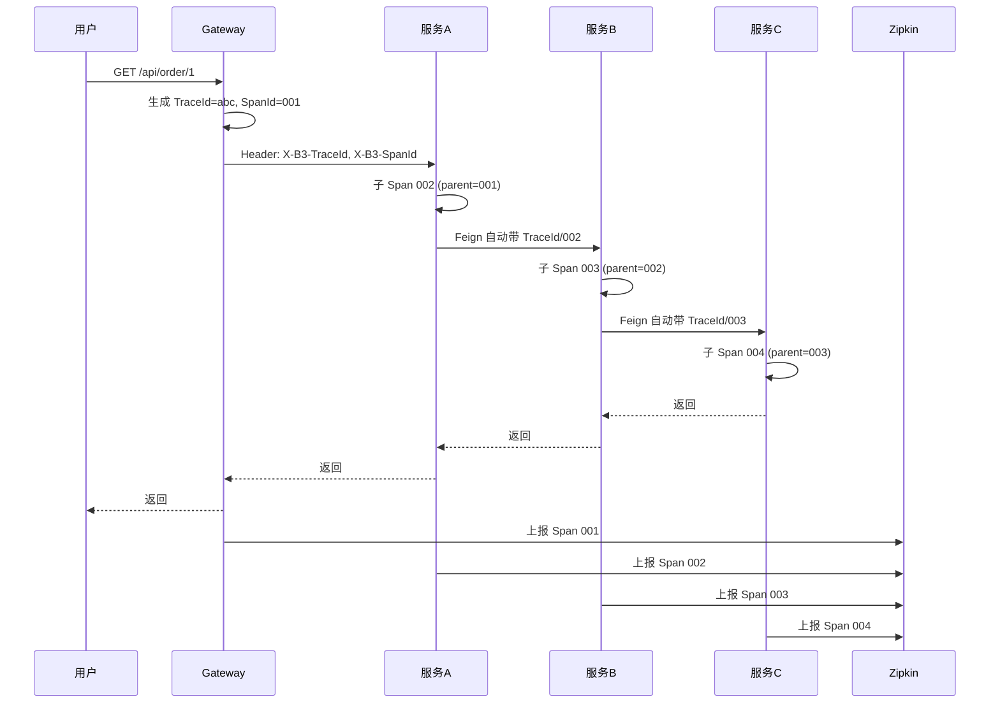

# 📘《Spring Cloud 学习与实战手册》

系统梳理 Spring Cloud 微服务架构核心组件：服务注册与发现、负载均衡、服务调用、熔断限流、配置中心、API 网关与链路追踪，便于系统学习与面试速查。前置建议掌握 **Spring Boot** 与 **RESTful** 基础。

> **版本说明**：本笔记以 **Spring Boot 2.7.x + Spring Cloud 2021.x**（以及 **Spring Boot 3.x + Spring Cloud 2022.x/2023.x** 的差异）为基准。Eureka 2.x 已进入维护模式，生产选型可优先考虑 **Nacos**、**Consul** 等；**Hystrix** 已停更，熔断推荐 **Resilience4j** 或 **Sentinel**。

------

# 🌱 第一章：Spring Cloud 概述

------

> **本章在整体中解决什么问题**：建立微服务与 Spring Cloud 的整体认知——**微服务**是什么、**Spring Cloud** 解决什么、核心组件有哪些（注册发现、负载均衡、Feign、熔断、配置中心、网关、链路追踪）。学完本章后**第二章**讲**服务注册与发现**（Eureka/Nacos）；**第三章**讲**负载均衡与服务调用**（LoadBalancer、OpenFeign）；后续章节依次展开熔断、配置中心、网关等。

------

## 1️⃣ 微服务与 Spring Cloud

### （1）微服务简述

**微服务**（Microservices）是一种架构风格：将单体应用拆成多个**小服务**，每个服务独立部署、独立扩展、用轻量级通信（如 HTTP/RPC）协作，通常配合**服务注册与发现**、**负载均衡**、**配置中心**、**网关**等基础设施。

> 💡 **重点**：微服务解决的是**扩展性、技术异构、团队自治**等问题，同时带来分布式事务、运维与链路追踪等新挑战。

### （2）Spring Cloud 是什么

**Spring Cloud** 是一套基于 **Spring Boot** 的**微服务开发工具集**，提供注册发现、负载均衡、声明式调用、熔断限流、配置中心、网关、链路追踪等能力，多数能力通过**集成第三方或社区组件**实现，并统一配置与编程模型。

| 维度 | 说明 |
| --- | --- |
| 与 Spring Boot 关系 | 基于 Boot 的自动配置与 starter，每个组件对应若干 starter |
| 版本对应 | Spring Cloud 与 Boot 有严格版本对应（见附录），不能混用不兼容版本 |
| 组件选型 | 注册中心可用 Eureka、Nacos、Consul；熔断可用 Resilience4j、Sentinel 等 |

------

## 2️⃣ 核心组件一览

| 组件 | 作用 | 常见实现 |
| --- | --- | --- |
| **服务注册与发现** | 服务实例注册与拉取，供调用方发现 | Eureka、Nacos、Consul |
| **负载均衡** | 在多个实例间分配请求 | Spring Cloud LoadBalancer（替代 Ribbon）、Ribbon（维护模式） |
| **服务调用** | 声明式 HTTP 客户端，基于接口 | OpenFeign |
| **熔断与限流** | 故障隔离、降级、限流 | Resilience4j、Sentinel（Hystrix 已停更） |
| **配置中心** | 集中管理配置、动态刷新 | Spring Cloud Config、Nacos Config |
| **API 网关** | 统一入口、路由、鉴权、限流 | Spring Cloud Gateway（Zuul 1.x 已停更） |
| **链路追踪** | 请求在各服务间的调用链与耗时 | Micrometer Tracing + Zipkin / Sleuth、SkyWalking |

------

## 3️⃣ 整体架构示意

```
                    ┌─────────────────┐
                    │   API Gateway   │  (路由、鉴权、限流)
                    └────────┬────────┘
                             │
         ┌───────────────────┼───────────────────┐
         ▼                   ▼                   ▼
   ┌──────────┐       ┌──────────┐       ┌──────────┐
   │ Service A│       │ Service B│       │ Service C│
   └────┬─────┘       └────┬─────┘       └────┬─────┘
        │                   │                   │
        └───────────────────┼───────────────────┘
                             │
              ┌──────────────┼──────────────┐
              ▼              ▼              ▼
       ┌────────────┐ ┌────────────┐ ┌────────────┐
       │  Registry  │ │   Config   │ │  Tracing   │
       │ (Eureka/   │ │  Center   │ │ (Zipkin等) │
       │  Nacos)    │ │            │ │            │
       └────────────┘ └────────────┘ └────────────┘
```

------

# ✅ 本章小结

| 知识点 | 面试关键词 | 实际应用 |
| ------ | ---------- | -------- |
| 微服务 | 拆分、独立部署、服务间通信 | 何时拆微服务、与单体对比 |
| Spring Cloud 定位 | 微服务工具集、基于 Boot、组件选型 | 技术选型、版本对应 |
| 核心组件 | 注册发现、负载均衡、Feign、熔断、配置中心、网关、链路追踪 | 能画出架构图并说出每块作用 |

------

**学习要点**：

- 能一句话说清微服务与 Spring Cloud 的定位；能列举 5～7 个核心组件及各自职责。
- 记住 Spring Cloud 与 Spring Boot 版本必须对应，不能随意组合。
- 知道 Eureka 2、Ribbon、Zuul 1、Hystrix 的现状（维护/停更），以及推荐替代（Nacos、LoadBalancer、Gateway、Resilience4j/Sentinel）。

------

### 常见坑与注意点

| 现象 / 易错点 | 原因 | 怎么改 / 怎么记 |
|---------------|------|-----------------|
| 引入 Spring Cloud 后启动报错 / 找不到 Bean | Boot 与 Cloud 版本不对应 | 查 [Spring Cloud 与 Boot 版本对应表](https://spring.io/projects/spring-cloud)，用 **BOM** 或 **spring-cloud-dependencies** 统一管理版本。 |
| 新项目该选 Eureka 还是 Nacos？ | Eureka 已维护模式，部分组件停更 | **新项目**优先 Nacos（注册+配置、AP/CP、生态活跃）；老项目延续 Eureka 可维护，面试要能对比二者。 |
| 说不清微服务和单体的取舍 | 只记概念不理解场景 | **微服务**：多团队、多技术栈、需独立扩缩容时合适；**单体**：人少、业务稳定、先跑通再拆更稳妥。 |

------

### 与前后章的衔接

- **下一章**：第二章 **服务注册与发现** 讲注册中心、Eureka/Nacos、提供者注册与消费者拉取，是「服务如何被找到」的基础；**第三章**在此基础上讲 **LoadBalancer + OpenFeign** 如何按服务名调用。

------

# 🌱 第二章：服务注册与发现

------

> **本章在整体中解决什么问题**：第一章给出了组件全景；本章落实**服务如何被找到**——提供者如何**注册**、消费者如何**发现**实例、注册中心（Eureka/Nacos）的角色与配置。掌握后**第三章**的 LoadBalancer 与 OpenFeign 才能基于「服务名」选实例并发请求；配置中心、网关等章节也会依赖「服务发现」能力。

------

## 1️⃣ 概念与原理

### （1）为什么需要注册与发现

- 微服务实例会**动态扩缩、下线、换 IP/端口**，调用方无法写死地址。
- **服务注册与发现**：实例启动时向**注册中心**注册自己（服务名、IP、端口、元数据）；调用方通过**服务名**从注册中心拉取实例列表，再配合**负载均衡**发起调用。

### （2）核心角色

| 角色 | 说明 |
| --- | --- |
| **注册中心**（Registry） | 存储服务名 → 实例列表；支持健康检查、剔除故障实例 |
| **服务提供者**（Provider） | 向注册中心注册自己，并定时续约（心跳） |
| **服务消费者**（Consumer） | 从注册中心拉取/订阅实例列表，发起调用 |

------

## 2️⃣ Eureka

### （1）架构简述

- **Eureka Server**：注册中心，维护服务实例表；支持多节点互相注册组成集群（高可用）。
- **Eureka Client**：集成在提供者与消费者中，负责注册、续约、拉取与缓存实例列表。

> 🔹 **注意**：Eureka 2.x 已进入维护模式，新项目可优先考虑 Nacos；老项目仍大量使用，面试常问。

### （2）Eureka Server 依赖与配置

依赖（Spring Boot 2.x + Spring Cloud 2021.x）：

```xml
<dependency>
    <groupId>org.springframework.cloud</groupId>
    <artifactId>spring-cloud-starter-netflix-eureka-server</artifactId>
</dependency>
```

配置示例：

```yaml
server:
  port: 8761
eureka:
  instance:
    hostname: localhost
  client:
    register-with-eureka: false   # 单机时本节点不注册自己
    fetch-registry: false
    service-url:
      defaultZone: http://${eureka.instance.hostname}:${server.port}/eureka/
```

启动类加注解：

```java
@SpringBootApplication
@EnableEurekaServer
public class EurekaServerApplication {
    public static void main(String[] args) {
        SpringApplication.run(EurekaServerApplication.class, args);
    }
}
```

### （3）Eureka Client（服务提供者/消费者）

依赖：

```xml
<dependency>
    <groupId>org.springframework.cloud</groupId>
    <artifactId>spring-cloud-starter-netflix-eureka-client</artifactId>
</dependency>
```

配置：

```yaml
spring:
  application:
    name: my-service   # 服务名，用于发现
eureka:
  client:
    service-url:
      defaultZone: http://localhost:8761/eureka/
  instance:
    prefer-ip-address: true   # 注册时用 IP，便于多机
```

应用启动后会自动注册；消费者通过 **服务名**（如 `my-service`）配合 **LoadBalancer** 或 **Ribbon** 调用。

------

## 3️⃣ Nacos

### （1）Nacos 简介

**Nacos**（Dynamic Naming and Configuration Service）是阿里开源的**注册中心 + 配置中心**，支持 DNS 与 HTTP 服务发现、AP/CP 模式、健康检查、权重与灰度等，社区活跃，生产常用。

### （2）Nacos Server

- 需单独部署 Nacos Server（单机或集群）；从 [Nacos  releases](https://github.com/alibaba/nacos/releases) 下载后执行 `startup.cmd`（Windows）或 `startup.sh`（Linux/Mac）。
- 控制台默认 `http://localhost:8848/nacos`，可查看服务列表与配置。

### （3）Nacos Client 依赖与配置

依赖（Spring Cloud 2021.x 使用 Nacos 2021.x 兼容版本）：

```xml
<dependency>
    <groupId>com.alibaba.cloud</groupId>
    <artifactId>spring-cloud-starter-alibaba-nacos-discovery</artifactId>
</dependency>
```

配置：

```yaml
spring:
  application:
    name: my-service
cloud:
  nacos:
    discovery:
      server-addr: localhost:8848
      namespace: public   # 可选，用于环境隔离
```

服务启动后自动注册到 Nacos；消费者同样依赖 Nacos Discovery，再配合 LoadBalancer/OpenFeign 按服务名调用。

------

## 4️⃣ Eureka 与 Nacos 对比（选型参考）

| 维度 | Eureka | Nacos |
| --- | --- | --- |
| 定位 | 仅注册与发现 | 注册发现 + 配置中心 |
| 一致性 | AP，优先可用性 | 支持 AP/CP 切换 |
| 健康检查 | 客户端心跳 | 支持 TCP/HTTP/MySQL 等 |
| 社区与维护 | 维护模式 | 活跃，国产生态常用 |
| 适用 | 存量 Spring Cloud 项目 | 新项目、需要配置中心时 |

------

# ✅ 本章小结

| 知识点 | 面试关键词 | 实际应用 |
| ------ | ---------- | -------- |
| 注册发现原理 | 注册、续约、拉取、服务名 | 为什么不用写死 IP、实例下线如何感知 |
| Eureka | Server/Client、心跳、CAP 中 AP | 老项目维护、面试原理 |
| Nacos | 注册+配置、AP/CP、健康检查 | 新项目选型、与 Config 二选一或配合 |

------

**学习要点**：

- 能说清「服务提供者注册 + 心跳」「消费者拉取实例列表」的流程。
- 会配 Eureka Server/Client 或 Nacos Discovery，能说出 `spring.application.name` 在发现中的作用。
- 能对比 Eureka 与 Nacos 的差异及选型场景。

------

## 🎯 面试常见追问

| 面试官提问 | 回答思路 |
| ---------- | -------- |
| Eureka 和 Nacos 区别？ | Eureka 仅注册发现、AP；Nacos 还带配置中心、支持 AP/CP、健康检查更丰富；Nacos 社区更活跃，新项目常用。 |
| 注册中心挂了，服务之间还能调用吗？ | 能。客户端会**缓存**已拉取的实例列表，短期内仍可调用；新实例上线或故障剔除会受影响，恢复后拉取即可。 |
| Eureka 如何保证高可用？ | 多节点 Eureka Server 互相注册成集群；Client 配置多个 `defaultZone`；单台挂掉其它节点继续提供服务列表。 |

------

### 常见坑与注意点

| 现象 / 易错点 | 原因 | 怎么改 / 怎么记 |
|---------------|------|-----------------|
| 服务已启动但注册中心看不到 / 消费者调不到 | 客户端未连上注册中心或 `spring.application.name` 不一致 | 检查 **eureka.client.service-url** 或 **nacos.discovery.server-addr**；调用方用的**服务名**必须与提供者 **spring.application.name** 一致。 |
| Eureka 单机时报错或重复注册 | 单机 Server 也把自己当 Client 注册 | 单机时在 Server 配置 **register-with-eureka: false**、**fetch-registry: false**，避免自注册。 |
| Nacos 连接失败 / 命名空间乱 | 地址错或未指定 namespace | 确认 **server-addr**、端口 8848；多环境用 **namespace** 隔离，public 为默认。 |

------

### 与前后章的衔接

- **上一章**：第一章是组件总览；本章是**注册与发现**的落地（Eureka/Nacos）。
- **下一章**：第三章 **负载均衡与服务调用** 在「已有实例列表」的前提下，用 LoadBalancer 选实例、用 OpenFeign 发 HTTP 请求，完成从服务名到调用的闭环。

------

# 🌱 第三章：负载均衡与服务调用

本章掌握从「服务名 → 选实例 → 发请求」的完整链路：**Spring Cloud LoadBalancer** 与 **OpenFeign**。

------

## 1️⃣ 负载均衡

### （1）为什么需要负载均衡

- 一个服务名对应**多个实例**，每次调用需在实例中**选一个**（轮询、随机、权重等），避免单点过载。

### （2）Spring Cloud LoadBalancer

- **Ribbon** 已进入维护模式，**Spring Cloud LoadBalancer** 是官方替代，与 **Spring Cloud 2020 及以后** 默认集成。
- 配合 **RestTemplate** 或 **OpenFeign**：在 RestTemplate 上加 `@LoadBalanced`，或 Feign 默认集成，即可用 **服务名** 代替 host:port 发起调用。

RestTemplate 示例：

```java
@Configuration
public class RestConfig {
    @Bean
    @LoadBalanced
    public RestTemplate restTemplate() {
        return new RestTemplate();
    }
}

// 使用：用服务名代替 IP:端口
String url = "http://my-service/hello";
String result = restTemplate.getForObject(url, String.class);
```

------

## 2️⃣ OpenFeign

### （1）概念

**OpenFeign** 是**声明式 HTTP 客户端**：通过**接口 + 注解**定义请求，由 Feign 在运行时生成实现，完成**服务名解析、负载均衡、发 HTTP 请求**。与注册中心、LoadBalancer 配合即可「写接口调远程服务」。

### （2）依赖与启用

依赖：

```xml
<dependency>
    <groupId>org.springframework.cloud</groupId>
    <artifactId>spring-cloud-starter-openfeign</artifactId>
</dependency>
```

启动类：

```java
@SpringBootApplication
@EnableFeignClients
public class ConsumerApplication {
    public static void main(String[] args) {
        SpringApplication.run(ConsumerApplication.class, args);
    }
}
```

### （3）定义 Feign 接口

```java
@FeignClient(name = "my-service")   // 服务名，对应注册中心里的名称
public interface HelloClient {
    @GetMapping("/hello")
    String hello();

    @GetMapping("/user/{id}")
    User getUser(@PathVariable("id") Long id);

    @PostMapping("/user")
    Long createUser(@RequestBody User user);
}
```

- **name**：注册中心中的服务名，Feign 会通过 LoadBalancer 解析为具体实例并负载均衡。
- 方法上的注解与 **Spring MVC** 一致（`@GetMapping`、`@PathVariable`、`@RequestBody` 等）。

### （4）超时与日志（可选）

```yaml
feign:
  client:
    config:
      default:
        connectTimeout: 3000
        readTimeout: 5000
  compression:
    request:
      enabled: true
```

日志（调试时开启，生产慎用全量 body）：

```java
@Configuration
public class FeignConfig {
    @Bean
    Logger.Level feignLoggerLevel() {
        return Logger.Level.FULL;
    }
}
```

```yaml
logging:
  level:
    your.package.HelloClient: DEBUG
```

------

## 3️⃣ 常见问题与注意点

| 问题 | 原因 | 做法 |
| --- | --- | --- |
| 调不通、UnknownHostException | 未接注册中心或 LoadBalancer 未生效 | 确保有 discovery 依赖、OpenFeign 会默认用 LoadBalancer |
| 超时 | 默认较短或下游慢 | 配置 `connectTimeout`/`readTimeout` 或使用 Resilience4j 超时 |
| 传递请求头/链路 ID | 需要透传 Header | 写 `RequestInterceptor`，从当前请求取 Header 放入 Feign 请求 |

------

# ✅ 本章小结

| 知识点 | 面试关键词 | 实际应用 |
| ------ | ---------- | -------- |
| 负载均衡 | LoadBalancer、Ribbon 替代、服务名解析 | 多实例间选一台、与注册中心配合 |
| OpenFeign | 声明式、@FeignClient、服务名 | 服务间 HTTP 调用、超时与日志配置 |
| 调用链路 | 注册中心 → 实例列表 → LoadBalancer → Feign 发请求 | 排查「调的是哪台机器」 |

------

**学习要点**：

- 能说清「服务名 → 注册中心取实例列表 → LoadBalancer 选实例 → 发 HTTP」的流程。
- 会写一个 `@FeignClient` 接口并配置超时；知道 Feign 与 RestTemplate + `@LoadBalanced` 的适用场景（Feign 更声明式、易维护）。

------

## 🎯 面试常见追问

| 面试官提问 | 回答思路 |
| ---------- | -------- |
| Ribbon 和 LoadBalancer 什么关系？ | Ribbon 已维护模式，LoadBalancer 是官方替代，从 2020 起默认集成；都是客户端负载均衡，按服务名选实例。 |
| Feign 和 RestTemplate 区别？ | Feign 声明式、接口+注解、可读性好、易统一配置；RestTemplate 手写 URL、灵活但啰嗦。Feign 底层也可用 RestTemplate。 |
| Feign 如何做负载均衡？ | Feign 集成了 LoadBalancer，根据 @FeignClient 的 name 从注册中心取实例列表，每次请求由 LoadBalancer 选一个实例再发 HTTP。 |

------

# 🌱 第四章：服务熔断与限流

本章理解**熔断、降级、限流**的目的，以及 **Resilience4j**、**Sentinel** 的用法与选型。

------

## 1️⃣ 为什么需要熔断与限流

### （1）问题场景

- **雪崩**：A 调 B，B 调 C；C 慢或挂掉导致 B 线程堵满，进而 A 也堵满，故障扩散。
- **熔断**：当失败/慢调用达到一定条件，**熔断器打开**，后续请求直接走降级逻辑（或快速失败），不再压垮下游，等恢复后再逐步放行。
- **限流**：控制 QPS 或并发数，防止上游把下游打挂。

### （2）熔断器三状态与时序

熔断器有三种状态，按**时间与统计结果**在状态间切换：

| 状态 | 含义 | 行为 | 何时进入下一状态 |
|------|------|------|------------------|
| **Closed**（关闭） | 正常放行 | 请求正常调用下游，并统计成功/失败与慢调用 | 失败率或慢调用比例达到阈值 → **Open** |
| **Open**（打开） | 熔断中 | **不再调用下游**，直接走降级（fallback）或快速失败 | 经过 `waitDurationInOpenState`（如 10s）→ **Half-Open** |
| **Half-Open**（半开） | 试探恢复 | 放行**少量请求**（如 1～N 个）到下游，根据结果决定 | 全部成功 → **Closed**；有失败 → 回到 **Open** |

> 💡 **时序简述**：Closed 下统计窗口内失败率超 50% → 进入 Open，后续请求一律降级；等待 10s 后进入 Half-Open，放少量请求试探；若都成功则回到 Closed，否则再次 Open。

------

## 2️⃣ Resilience4j

### （1）简介

**Resilience4j** 是轻量级容错库，提供**熔断（Circuit Breaker）**、**限流（Rate Limiter）**、**重试（Retry）**、**舱壁（Bulkhead）**等，与 Spring Cloud 整合良好，**Hystrix 停更后的推荐替代**。

### （2）依赖与基本配置

依赖：

```xml
<dependency>
    <groupId>org.springframework.cloud</groupId>
    <artifactId>spring-cloud-starter-circuitbreaker-reactor-resilience4j</artifactId>
</dependency>
```

熔断配置示例：

```yaml
resilience4j:
  circuitbreaker:
    instances:
      default:
        registerHealthIndicator: true
        slidingWindowType: COUNT_BASED
        slidingWindowSize: 10
        minimumNumberOfCalls: 5
        failureRateThreshold: 50
        waitDurationInOpenState: 10s
```

- `failureRateThreshold`：失败率超过 50% 熔断打开。
- `waitDurationInOpenState`：打开状态持续 10s 后进入半开。

### （3）与 Feign 的集成步骤

**步骤一**：引入 Feign 与熔断依赖（Spring Cloud 2020+ 默认用 Resilience4j，不再用 Hystrix）：

```xml
<dependency>
    <groupId>org.springframework.cloud</groupId>
    <artifactId>spring-cloud-starter-openfeign</artifactId>
</dependency>
<dependency>
    <groupId>org.springframework.cloud</groupId>
    <artifactId>spring-cloud-starter-circuitbreaker-reactor-resilience4j</artifactId>
</dependency>
```

**步骤二**：在配置中开启 Feign 的熔断：

```yaml
feign:
  circuitbreaker:
    enabled: true
```

**步骤三**：在 `@FeignClient` 上指定 fallback 类（或 fallbackFactory，可拿到异常信息）：

```java
@FeignClient(name = "my-service", fallback = HelloClientFallback.class)
public interface HelloClient {
    @GetMapping("/hello")
    String hello();
}

@Component
public class HelloClientFallback implements HelloClient {
    @Override
    public String hello() {
        return "fallback";
    }
}
```

- 当熔断器为 **Open** 或 **Half-Open 试探失败**、或调用超时/异常时，Feign 会走 **HelloClientFallback**，不再请求下游。

### （4）限流规则配置示例（Resilience4j Rate Limiter）

除熔断外，Resilience4j 支持**限流**（控制每秒/每分钟请求数），例如：

```yaml
resilience4j:
  ratelimiter:
    instances:
      default:
        limitForPeriod: 10        # 每个周期内最多 10 次
        limitRefreshPeriod: 1s    # 周期 1 秒，即 10 QPS
        timeoutDuration: 0        # 获取许可等待时间，0 表示不等待、超限直接失败
```

- 在方法上使用 `@RateLimiter(name = "default", fallbackMethod = "rateLimitFallback")`，超过 10 QPS 的请求会走 fallback；与熔断可同时使用（先限流再熔断，或仅熔断）。

### （5）在代码中使用（非 Feign：注解方式）

在业务方法上用 `@CircuitBreaker`、`@Retry`、`@RateLimiter` 等（需引入对应 AOP 依赖与配置），指定 fallback 方法即可对任意调用做熔断/限流。

------

## 3️⃣ Sentinel

### （1）简介

**Sentinel** 是阿里开源的**流控与熔断**组件，支持**限流、熔断、降级、系统保护**，提供控制台与规则持久化（如 Nacos），功能比 Resilience4j 更丰富，国内使用广泛。

### （2）依赖与配置

依赖：

```xml
<dependency>
    <groupId>com.alibaba.cloud</groupId>
    <artifactId>spring-cloud-starter-alibaba-sentinel</artifactId>
</dependency>
```

配置（对接控制台可选）：

```yaml
spring:
  cloud:
    sentinel:
      transport:
        dashboard: localhost:8080   # Sentinel 控制台
        port: 8719
```

### （3）限流与熔断规则配置示例（控制台或 Nacos）

- **限流规则**：在 Sentinel 控制台为资源名（如 `getUser`）配置 **QPS 限流** 或 **并发线程数限流**。例如 QPS=5 表示每秒超过 5 个请求则触发 blockHandler。
- **熔断规则**：可配**慢调用比例**（如响应时间 >500ms 占比超 50% 则熔断）或**异常比例**（如异常率超 50% 则熔断），并设置熔断时长与最小请求数；效果与 Resilience4j 的 Open → Half-Open → Closed 一致，触发后走 blockHandler。

规则可存在**控制台内存**（重启丢失）或**持久化到 Nacos**（推荐），客户端从 Nacos 拉取规则后生效。

### （4）限流与熔断示例（注解方式）

```java
@SentinelResource(value = "getUser", blockHandler = "handleBlock", fallback = "handleFallback")
public User getUser(Long id) {
    return restTemplate.getForObject("http://user-service/user/" + id, User.class);
}

public User handleBlock(Long id, BlockException ex) {
    return null;   // 被限流/熔断时
}

public User handleFallback(Long id, Throwable t) {
    return null;   // 业务异常/降级
}
```

- **blockHandler**：被**限流**或**熔断**规则触发时调用（如 QPS 超限、熔断打开）。
- **fallback**：业务抛异常或主动降级时调用。

------

## 4️⃣ Resilience4j 与 Sentinel 对比

| 维度 | Resilience4j | Sentinel |
| --- | --- | --- |
| 定位 | 轻量、库级别、易嵌入 | 流控+熔断+控制台+规则持久化 |
| 限流/熔断 | 支持，配置在本地 | 支持，控制台动态配置、可持久化到 Nacos |
| 生态 | Spring Cloud 官方推荐、海外多用 | 阿里系、国内常用 |
| 学习成本 | 相对简单 | 概念稍多，控制台功能强 |

------

# ✅ 本章小结

| 知识点 | 面试关键词 | 实际应用 |
| ------ | ---------- | -------- |
| 熔断与限流目的 | 雪崩、熔断器、降级、限流 | 保护下游、保证可用性 |
| Resilience4j | Circuit Breaker、Rate Limiter、Feign fallback | Spring Cloud 默认熔断方案 |
| Sentinel | 限流、熔断、控制台、规则持久化 | 需要控制台与动态规则时选 Sentinel |

------

**学习要点**：

- 能说清雪崩、熔断（打开/半开/关闭）、降级、限流的含义。
- 会配 Resilience4j 熔断或 Sentinel 限流/熔断，并写一个 fallback。
- 知道 Hystrix 已停更，当前常用 Resilience4j 与 Sentinel。

------

## 🎯 面试常见追问

| 面试官提问 | 回答思路 |
| ---------- | -------- |
| 熔断器几种状态？ | Closed 正常；失败率等达到阈值 → Open 直接降级；等待一段时间 → Half-Open 放少量请求试探，成功则 Closed。 |
| 熔断和限流区别？ | 熔断是「下游故障时不再调用、走降级」；限流是「控制 QPS/并发，防止打挂下游」。可同时使用。 |
| Hystrix 为什么不用了？ | 已停更，官方推荐 Resilience4j；Sentinel 功能更全、有控制台，国内常用。 |

------

### 熔断：错误 vs 正确配置

| 场景 | 错误配置 / 现象 | 正确配置 / 做法 |
|------|-----------------|-----------------|
| **Feign 熔断不生效** | 未开启 Feign 熔断开关，异常直接抛出不走 fallback | 在配置中加 **feign.circuitbreaker.enabled: true**，并引入 **spring-cloud-starter-circuitbreaker-reactor-resilience4j**。 |
| **fallback 类无法注入** | Fallback 类未加 **@Component** 或不在扫描包下，或未实现 Feign 接口 | Fallback 类必须**实现 @FeignClient 的接口**，并加 **@Component** 保证被 Spring 管理。 |
| **Sentinel blockHandler 不生效** | blockHandler 方法签名与资源方法不一致（参数、返回值） | **blockHandler** 方法除最后多一个 **BlockException** 参数外，其余参数与返回值须与资源方法一致；且需在同一类中。 |
| **熔断阈值过严/过松** | 窗口太小或 failureRateThreshold 过高，频繁误熔断或熔断太晚 | **slidingWindowSize**、**minimumNumberOfCalls** 要够统计量；**failureRateThreshold** 按业务定（如 50%）；生产可先放宽观察再调。 |

------

# 🌱 第五章：配置中心

本章掌握**集中管理配置、动态刷新**的思路，以及 **Spring Cloud Config** 与 **Nacos Config** 的用法。

------

## 1️⃣ 为什么需要配置中心

- 配置散落在各服务本地，**改配置要重新发版**；敏感信息写在仓库有风险。
- **配置中心**：配置存于**中心仓库**（Git、Nacos 等），服务启动或定时拉取；支持**动态刷新**（如 `@RefreshScope`），无需重启即可生效（部分配置）。

**配置拉取与刷新流程图**：

```mermaid
flowchart LR
    A[Client 启动] --> B[bootstrap 加载]
    B --> C[向 Config Server / Nacos 拉取]
    C --> D[合并到 Environment]
    D --> E[ApplicationContext 启动]
    E --> F[Bean 使用配置]
    F --> G{动态刷新?}
    G -->|Config| H[调用 /actuator/refresh 或 Bus]
    G -->|Nacos| I[长轮询/推送 收到变更]
    H --> J[@RefreshScope Bean 失效]
    I --> J
    J --> K[下次使用时重建 Bean 注入新配置]
```

------

## 2️⃣ Spring Cloud Config

### （1）架构

- **Config Server**：从 **Git**（或本地、SVN）读取配置文件，通过 HTTP 暴露给客户端。
- **Config Client**：各服务作为 Client，启动时从 Server 拉取配置（按 `spring.application.name`、profile 等），并可配合 `@RefreshScope` 做动态刷新。

### （2）Config Server 依赖与配置

依赖：

```xml
<dependency>
    <groupId>org.springframework.cloud</groupId>
    <artifactId>spring-cloud-config-server</artifactId>
</dependency>
```

配置：

```yaml
spring:
  application:
    name: config-server
  cloud:
    config:
      server:
        git:
          uri: https://github.com/your/repo
          default-label: main
```

启动类：

```java
@SpringBootApplication
@EnableConfigServer
public class ConfigServerApplication {
    public static void main(String[] args) {
        SpringApplication.run(ConfigServerApplication.class, args);
    }
}
```

### （3）Config Client 配置

- 配置**要放在 bootstrap 中**（或 `spring.config.import` 引入），以便在应用启动早期从 Config Server 拉取。

bootstrap.yml：

```yaml
spring:
  application:
    name: my-service
  cloud:
    config:
      uri: http://localhost:8888
      profile: dev
```

拉取规则：`{name}-{profile}.yml`，如 `my-service-dev.yml`。

### （4）动态刷新流程与哪些 Bean 会重建

**刷新流程（Spring Cloud Config + /actuator/refresh）**：

1. 配置在 Git（或 Config Server 源）中变更后，**不会自动**推送到 Client；需要**主动触发**刷新。
2. 调用 Client 的 **POST /actuator/refresh**（需在 `management.endpoints.web.exposure.include` 中暴露 `refresh`），触发一次「刷新」动作。
3. 刷新时，Spring Cloud 会**使所有带 `@RefreshScope` 的 Bean 失效**（从 Scope 缓存中移除），**并不立即重建**。
4. **下次**有请求用到该 Bean 时（如再次调用注入了该 Bean 的 Controller 方法），会**重新创建**该 Bean，此时会重新读取 **Environment** 中的配置（已从 Config Server 拉取到最新），因此拿到的是**新配置**。

**哪些 Bean 会重建**：

| 类型 | 是否参与刷新、是否重建 |
|------|------------------------|
| 带 **@RefreshScope** 的 Bean | **会**：refresh 后失效，下次使用时**重建**并注入新配置。 |
| 普通 **@Component / @Service**（无 @RefreshScope） | **不会**：refresh 不触发其重建，仍用启动时的配置，要生效通常需**重启**。 |
| 配置类上 **@ConfigurationProperties** 且无 @RefreshScope | 若该配置类本身不是 @RefreshScope Bean，则 refresh 不会更新其字段；若希望不重启生效，可把「使用这些属性的 Bean」做成 @RefreshScope，或配合 Nacos 的监听在回调里更新。 |

> 💡 **小结**：只有 **@RefreshScope** 的 Bean 会在 refresh 后「下次使用时」重建；其他 Bean 不会因 refresh 而重建。

### （5）与 Spring Cloud Bus 的配合（可选）

- 当有**多个 Config Client** 时，若每次改完配置都要**逐个**调每个服务的 `/actuator/refresh`，成本高。
- **Spring Cloud Bus**：基于 **消息中间件**（RabbitMQ、Kafka）做**事件广播**。Config Server 或某个 Client 在配置变更后，向 Bus 发一条 **RefreshRemoteApplicationEvent**，**所有订阅了 Bus 的 Client** 都会收到并**各自执行一次 refresh**，从而一次操作、全集群刷新。
- 典型用法：**Git 变更 → Webhook 调 Config Server 的 /actuator/bus-refresh → Bus 广播 → 各 Client 执行 refresh**；只有带 @RefreshScope 的 Bean 仍按「失效后下次使用时重建」的规则生效。

------

## 3️⃣ Nacos Config

### （1）简介

- **Nacos** 同时提供**配置中心**：在 Nacos 控制台创建 **Data ID**（如 `my-service.yaml`）、Group、命名空间，服务依赖 Nacos Config 拉取并监听变更，**自动刷新**，无需调 refresh 端点。

### （2）依赖与配置

依赖：

```xml
<dependency>
    <groupId>com.alibaba.cloud</groupId>
    <artifactId>spring-cloud-starter-alibaba-nacos-config</artifactId>
</dependency>
```

bootstrap.yml：

```yaml
spring:
  application:
    name: my-service
  cloud:
    nacos:
      config:
        server-addr: localhost:8848
        file-extension: yaml
        namespace: public
```

- 拉取规则：默认 `${spring.application.name}.${file-extension}`，即 `my-service.yaml`；可与 `spring.profiles.active` 组合。

### （3）动态刷新（与 Config 的差异）

- Nacos 客户端会**长轮询/监听**配置变更；在控制台或 API 修改配置后，Nacos Server 会**推送**变更到已连接的 Client。
- Client 收到变更后，**更新本地 Environment**，并触发与 Spring Cloud Config 类似的**刷新逻辑**：使带 **@RefreshScope** 的 Bean 失效，**下次使用时重建**并注入新配置。
- **无需**像 Config 那样手动调 `/actuator/refresh`；若仍希望统一用 Bus 做广播，也可在 Nacos 变更回调里发 Bus 事件，但多数场景下 Nacos 自带推送已够用。

------

## 4️⃣ Config 与 Nacos Config 对比

| 维度 | Spring Cloud Config | Nacos Config |
| --- | --- | --- |
| 存储 | 多为 Git | Nacos 内置存储 |
| 动态刷新 | 需 refresh 或 Bus | 监听推送，自动刷新 |
| 与注册中心 | 独立，需单独部署 Server | 与 Nacos Discovery 一体，一次部署 |
| 适用 | 已有 Git 配置流程、偏传统 | 新项目、希望注册+配置一体 |

------

### 常见坑与注意点

| 现象 / 易错点 | 原因 | 怎么改 / 怎么记 |
|---------------|------|-----------------|
| Config Client 启动报错找不到配置 | Config 地址写在 application 里，晚于拉取时机 | Config Server 地址必须写在 **bootstrap.yml**（或 **spring.config.import**），保证在应用上下文创建前拉取。 |
| 改了配置但 Bean 没变 | 未用 @RefreshScope，或 refresh 未触发 | 需要动态生效的 Bean 加 **@RefreshScope**；Config 需调 **/actuator/refresh** 或配 Bus；Nacos 会自动推送，仍只有 @RefreshScope Bean 下次使用时重建。 |
| Nacos 拉取不到配置 / Data ID 不匹配 | Data ID 与 spring.application.name、file-extension、profile 组合规则不符 | 默认 **${spring.application.name}.${file-extension}**（如 my-service.yaml）；带 profile 时为 **my-service-dev.yaml**；控制台 Data ID 与之一致。 |

------

# ✅ 本章小结

| 知识点 | 面试关键词 | 实际应用 |
| ------ | ---------- | -------- |
| 配置中心作用 | 集中管理、动态刷新、安全 | 多环境配置、敏感信息不落库 |
| Config | Config Server + Git、bootstrap、@RefreshScope | 已有 Git 流程时 |
| Nacos Config | Data ID、监听、自动刷新 | 与 Nacos 注册一体、减少组件 |

------

**学习要点**：

- 能说清「配置中心拉取流程」与「动态刷新」的大致实现（拉取/监听 + @RefreshScope）。
- 会配 Config Server/Client 或 Nacos Config，知道 bootstrap 与 `spring.config.import` 的作用。
- 能对比 Config 与 Nacos Config 的差异。

------

## 🎯 面试常见追问

| 面试官提问 | 回答思路 |
| ---------- | -------- |
| 配置中心如何实现动态刷新？ | 拉取或监听配置变更后，对带 @RefreshScope 的 Bean 失效并重建，**下次使用时**才重建并注入新配置；Nacos 通过长轮询/推送通知客户端，Config 需调 /actuator/refresh 或配合 Bus。 |
| 哪些 Bean 会因 refresh 重建？ | 只有带 @RefreshScope 的 Bean；普通 @Component/@Service 不会重建，要生效通常需重启。 |
| Spring Cloud Bus 做什么用？ | 通过消息队列广播「刷新」事件，一次调用（如 /actuator/bus-refresh）让所有订阅的 Config Client 都执行 refresh，避免逐个调每个服务的 refresh。 |
| bootstrap 和 application 加载顺序？ | bootstrap 先于 application；Config Client 需要在 bootstrap 里配 Config Server 地址，才能从远端拉取再合并到 application。 |

------

# 🌱 第六章：API 网关

本章掌握 **Spring Cloud Gateway** 的作用、核心概念与基本配置；Zuul 1.x 已停更，以 Gateway 为主。

------

## 1️⃣ 网关的作用

- **统一入口**：前端/外部只访问网关，由网关**路由**到后端各服务。
- **横切能力**：鉴权、限流、日志、跨域、协议转换等集中在网关，服务只需关心业务。

------

## 2️⃣ Spring Cloud Gateway 核心概念

| 概念 | 说明 |
| --- | --- |
| **Route** | 路由规则：匹配条件（Predicate）+ 目标 URI + 过滤器 |
| **Predicate** | 匹配条件（如 Path、Method、Header） |
| **Filter** | 请求/响应前后执行（鉴权、加 Header、限流等） |

- 请求进入网关 → 按 **Predicate** 匹配到 **Route** → 经过 **Filter**（含全局、路由级）→ 转发到目标服务。

------

## 3️⃣ 依赖与配置

依赖：

```xml
<dependency>
    <groupId>org.springframework.cloud</groupId>
    <artifactId>spring-cloud-starter-gateway</artifactId>
</dependency>
```

> 🔹 **注意**：Gateway 基于 **WebFlux**（响应式），不要和 **spring-boot-starter-web**（Servlet）同工程混用，否则启动冲突。

配置示例：

```yaml
spring:
  cloud:
    gateway:
      routes:
        - id: user-service
          uri: lb://user-service   # lb = 从注册中心负载均衡
          predicates:
            - Path=/api/user/**
        - id: order-service
          uri: lb://order-service
          predicates:
            - Path=/api/order/**
```

- **lb://服务名**：从注册中心解析服务名并做负载均衡；需引入对应注册中心与 LoadBalancer。

------

## 4️⃣ 常用 Predicate 与 Filter

| 类型 | 示例 |
| --- | --- |
| Predicate | `Path=/api/**`、`Method=GET`、`Header=X-Request-Id, \d+` |
| Filter | `AddRequestHeader`、`StripPrefix=1`（去掉路径前缀）、自定义 GlobalFilter |

StripPrefix 示例（把 `/api/user/xxx` 转成 `/xxx` 再转发给 user-service）：

```yaml
- id: user-service
  uri: lb://user-service
  predicates:
    - Path=/api/user/**
  filters:
    - StripPrefix=2   # 去掉前两段 /api/user
```

------

## 5️⃣ 自定义全局过滤器（示例）

```java
@Component
public class AuthGlobalFilter implements GlobalFilter, Ordered {
    @Override
    public Mono<Void> filter(ServerWebExchange exchange, GatewayFilterChain chain) {
        String token = exchange.getRequest().getHeaders().getFirst("Authorization");
        if (token == null || !isValid(token)) {
            exchange.getResponse().setStatusCode(HttpStatus.UNAUTHORIZED);
            return exchange.getResponse().setComplete();
        }
        return chain.filter(exchange);
    }
    @Override
    public int getOrder() {
        return -100;
    }
}
```

------

### 完整示例：路由 + StripPrefix + 鉴权（可运行）

**application.yml**（网关单独应用，不要与 spring-boot-starter-web 同用）：

```yaml
server:
  port: 8080
spring:
  application:
    name: gateway
  cloud:
    gateway:
      routes:
        - id: user-service
          uri: lb://user-service
          predicates:
            - Path=/api/user/**
          filters:
            - StripPrefix=2
        - id: order-service
          uri: lb://order-service
          predicates:
            - Path=/api/order/**
          filters:
            - StripPrefix=2
      default-filters:
        - AddRequestHeader=X-Gateway, true
```

- 请求 **GET /api/user/1** → 匹配 user-service，StripPrefix=2 后转发到 user-service 的 **GET /1**；**lb://** 从注册中心解析 user-service 实例并负载均衡。
- 鉴权：在 **AuthGlobalFilter** 中放行白名单（如 `/api/login`），其余校验 token，无效则 **setStatusCode(401)** 并 **setComplete()**。

------

### 常见坑与注意点

| 现象 / 易错点 | 原因 | 怎么改 / 怎么记 |
|---------------|------|-----------------|
| 启动报错或 Gateway 不生效 | 与 **spring-boot-starter-web** 同工程，Gateway 基于 WebFlux 与 Servlet 冲突 | Gateway 应用**不要**引入 **spring-boot-starter-web**；只引入 **spring-cloud-starter-gateway**。 |
| 路由 404 或 503 | 未接注册中心、lb 无法解析服务名，或目标服务未注册 | 确保引入 **discovery 客户端**（如 Nacos、Eureka）；**uri: lb://服务名** 中的服务名与注册中心一致。 |
| 转发后下游拿不到原始路径/Header | 未透传或 StripPrefix 后路径不对 | 需下游用的路径时，用 **StripPrefix** 控制去掉几段；需透传 Header 时在 Filter 里 **exchange.getRequest().mutate().header(...)** 或用 **AddRequestHeader**。 |

------

# ✅ 本章小结

| 知识点 | 面试关键词 | 实际应用 |
| ------ | ---------- | -------- |
| 网关作用 | 统一入口、路由、鉴权、限流 | 前后端分离、多服务统一出口 |
| Gateway | Route、Predicate、Filter、WebFlux | 替代 Zuul、配置路由与过滤器 |
| lb:// | 从注册中心解析服务名并负载均衡 | 网关转发到微服务 |

------

**学习要点**：

- 能说清网关的职责（路由、鉴权、限流等）；能说出 Route、Predicate、Filter 的含义。
- 会配基于 Path 的路由和 `lb://服务名`；知道不能与 spring-boot-starter-web 同用。
- 能写一个简单的 GlobalFilter（如鉴权、打日志）。

------

## 🎯 面试常见追问

| 面试官提问 | 回答思路 |
| ---------- | -------- |
| Gateway 和 Zuul 区别？ | Zuul 1 基于 Servlet 阻塞；Gateway 基于 WebFlux 非阻塞，性能更好，是当前推荐方案；Zuul 1 已停更。 |
| 网关如何做限流？ | 可用 Gateway 集成 Sentinel、Redis 等限流；或自定义 Filter 里调用限流组件，超过阈值返回 429 或降级。 |

------

# 🌱 第七章：链路追踪

本章建立「分布式链路追踪」的概念，说明 **TraceId/Span 的传递方式**、在 **Feign/Gateway** 中的实际效果、**一次请求的完整链路**示例，以及 **Micrometer+Zipkin 与 SkyWalking** 的对比与选型。

------

## 1️⃣ 为什么需要链路追踪

- 一次请求会经过**网关 → 服务 A → 服务 B → …**，出问题时需要知道**整条调用链**与各环节耗时。
- **链路追踪**：为每次请求生成 **TraceId**（整条链唯一），在各服务间传递；每个服务记录 **Span**（本机一段调用，含父 SpanId），上报到**追踪后端**（如 Zipkin、SkyWalking），即可按 TraceId 拼出**完整调用链与耗时**。

------

## 2️⃣ TraceId 与 Span 的传递方式

### （1）核心概念

| 概念 | 说明 |
|------|------|
| **TraceId** | 一次请求全局唯一，从入口（如 Gateway）生成，贯穿整条调用链。 |
| **SpanId** | 当前节点（或当前调用）的 ID；子调用会带上**父 SpanId**，便于组成树形结构。 |
| **传递方式** | 通过 **HTTP Header** 在服务间透传；常见约定：**X-B3-TraceId**、**X-B3-SpanId**、**X-B3-ParentSpanId**（B3 规范），或 **traceparent**（W3C Trace Context）。 |

### （2）在 Feign 与 Gateway 中的实际效果

- **Gateway**：请求进入时，若没有 TraceId 则**自动生成**，并将 TraceId/SpanId 放入 **Request Header** 传给下游；Gateway 自身也会上报一个 Span（如「gateway」）。
- **OpenFeign**：发起 HTTP 调用时，**自动从当前上下文读取 TraceId/SpanId** 并注入到**请求头**，下游服务收到后继续使用同一 TraceId、新建子 Span，从而形成父子关系。
- **RestTemplate / WebClient**：需配合 **RestTemplateInterceptor** 或 **ExchangeFilterFunction** 手动传递 Header，或使用 **Brave** 等提供的 Instrumentation 自动注入；否则下游可能拿不到 TraceId，链会断。

> 💡 **重点**：只要各服务都集成同一套 Tracing（如 Micrometer Tracing + Brave），**Gateway 与 Feign 会自动透传 Header**，无需业务代码手写；RestTemplate 需额外配置拦截器或换用已集成的客户端。

------

## 3️⃣ 一次请求的完整链路示例

以「用户请求 → Gateway → 服务 A → Feign 调 服务 B → 服务 B 调 服务 C」为例：

1. **用户** 请求 `GET /api/order/1`，到达 **Gateway**。
2. **Gateway** 生成 **TraceId=abc**、**SpanId=001**，将请求转发到 **服务 A**，Header 中带 `X-B3-TraceId: abc, X-B3-SpanId: 001`；Gateway 上报 Span（name=gateway, traceId=abc, spanId=001）。
3. **服务 A** 收到请求，从 Header 中取出 abc/001，创建子 Span（spanId=002, parentSpanId=001）；业务中通过 **Feign** 调用服务 B。
4. **Feign** 发起 HTTP 时自动带上 `X-B3-TraceId: abc, X-B3-SpanId: 002`（或新建子 SpanId 并设 parentSpanId=002）；**服务 B** 收到后继续用 TraceId=abc，创建 Span 003（parent=002）；服务 B 再调服务 C 时同样透传。
5. **服务 C** 处理完毕返回，各层依次返回；每个服务在请求结束时**上报 Span**（含 traceId、spanId、parentSpanId、耗时、标签等）。
6. **Zipkin/SkyWalking** 按 TraceId 聚合所有 Span，得到一条完整链路：Gateway(001) → A(002) → B(003) → C(004)，并可看到每段耗时，便于定位慢在哪一环。

**链路追踪简图**：



------

## 4️⃣ 常见方案与 Spring Cloud 集成

### （1）方案对比

| 方案 | 说明 | 侵入性 | 与 Feign/Gateway |
|------|------|--------|------------------|
| **Micrometer Tracing + Zipkin** | Spring Cloud 2022+ 推荐；TraceId/SpanId 自动传递（Brave），上报 Zipkin；需各服务引入依赖与配置。 | 依赖与配置 | 自动透传 |
| **Sleuth + Zipkin** | 老版本常用，Sleuth 已整合进 Micrometer Tracing。 | 同左 | 自动透传 |
| **SkyWalking** | **Java Agent 无侵入**，不改代码；支持多种中间件与框架，国内常用；TraceId 自有一套传递协议。 | 无代码侵入，仅加 Agent 参数 | Agent 自动注入与传递 |

### （2）Micrometer + Zipkin 与 SkyWalking 对比

| 维度 | Micrometer + Zipkin | SkyWalking |
|------|---------------------|------------|
| **接入方式** | 各服务引入依赖、配置 endpoint | 各进程加 `-javaagent:skywalking-agent.jar`，配置后端地址 |
| **代码侵入** | 需依赖与配置，不侵入业务逻辑 | 无侵入，仅启动参数 |
| **传递协议** | 通常 B3 Header 或 W3C | 自有 Header 或 Agent 注入 |
| **与 Spring Cloud** | 与 Feign/Gateway 等原生集成好 | Agent 对 Spring Cloud、Feign、Gateway 等有支持 |
| **适用** | 希望与 Spring 生态统一、已有 Zipkin | 希望零侵入、多语言/多组件统一追踪 |

### （3）与 Spring Cloud 的集成（Micrometer + Zipkin 示例）

依赖：

```xml
<dependency>
    <groupId>io.micrometer</groupId>
    <artifactId>micrometer-tracing-bridge-brave</artifactId>
</dependency>
<dependency>
    <groupId>io.zipkin.reporter2</groupId>
    <artifactId>zipkin-reporter-brave</artifactId>
</dependency>
```

配置：

```yaml
management:
  tracing:
    sampling:
      probability: 1.0
  zipkin:
    tracing:
      endpoint: http://localhost:9411/api/v2/spans
```

- 各服务（含 Gateway、Feign 调用方、被调方）都加上述依赖与配置后，**TraceId/SpanId 会通过 HTTP Header 自动传递**，在 Zipkin UI 中按 **traceId** 即可查看完整链路与各 Span 耗时。

------

# ✅ 本章小结

| 知识点 | 面试关键词 | 实际应用 |
| ------ | ---------- | -------- |
| 链路追踪目的 | TraceId、Span、调用链、耗时 | 排查跨服务慢请求、定位故障节点 |
| TraceId 传递 | HTTP Header、B3、Feign/Gateway 自动透传 | 保证链不断、能串起整条请求 |
| 完整链路 | Gateway → A → Feign 调 B → B 调 C，各层上报 Span | 口述一次请求的追踪过程 |
| Zipkin vs SkyWalking | 依赖集成 vs Agent 无侵入、协议不同 | 选型与接入方式 |

------

**学习要点**：

- 能说清 TraceId、Span 与「一次请求一条链」的概念；TraceId 经 **HTTP Header** 在服务间透传，Feign/Gateway 集成后**自动透传**。
- 能口述「用户请求 → Gateway → 服务 A → Feign 调 B → B 调 C」时，各层如何生成/传递 TraceId、如何上报 Span，以及在 Zipkin 中如何看到完整链路。
- 知道 Micrometer+Zipkin 与 SkyWalking 的区别：前者需依赖与配置、与 Spring 集成好；后者 Agent 无侵入、多语言统一。

------

## 🎯 面试常见追问

| 面试官提问 | 回答思路 |
| ---------- | -------- |
| TraceId 怎么在服务间传递？ | 通过 HTTP Header（如 X-B3-TraceId、X-B3-SpanId）透传；Gateway 入口生成，Feign 调用时自动带上，下游从 Header 取出并继续传递。 |
| Feign 和 Gateway 需要额外写代码传 TraceId 吗？ | 不需要；集成 Micrometer Tracing（如 Brave）后，Gateway 与 Feign 会自动注入和读取 Header，业务无感。 |
| Zipkin 和 SkyWalking 区别？ | Zipkin 需各服务引入依赖与配置，与 Spring 生态集成好；SkyWalking 通过 Java Agent 无侵入接入，多语言统一，国内常用；按是否希望改代码、是否多语言选型。 |

------

### 常见坑与注意点

| 现象 / 易错点 | 原因 | 怎么改 / 怎么记 |
|---------------|------|-----------------|
| 链断了、TraceId 对不上 | 某服务未集成 Tracing，或用了 RestTemplate 未透传 Header | 各服务都加 **micrometer-tracing-bridge-brave** 等依赖；**RestTemplate** 需配 **RestTemplateInterceptor** 透传 B3 Header，或换用 Feign/WebClient。 |
| Zipkin 里看不到某服务 | 未上报或 endpoint 配错、网络不通 | 确认 **management.zipkin.tracing.endpoint** 正确；Zipkin Server 可访问；**sampling.probability=1.0** 便于调试（生产可调低）。 |
| Gateway/Feign 已集成但下游无 TraceId | 下游未引入 Tracing 依赖，或 Filter 顺序把 Header 覆盖 | 下游同样引入 **micrometer-tracing** 与 **zipkin-reporter**；网关自定义 Filter 不要覆盖 **X-B3-** 或 **traceparent**。 |

------

# 📎 附录

## 1️⃣ Spring Boot 与 Spring Cloud 版本对应（常用）

| Spring Cloud 版本 | Spring Boot 版本 |
| ----------------- | ----------------- |
| 2023.x (Leyton)   | 3.2.x             |
| 2022.x (Kilburn)  | 3.0.x、3.1.x      |
| 2021.x (Jubilee)  | 2.6.x、2.7.x      |
| 2020.x (Ilford)   | 2.4.x、2.5.x      |
| Hoxton            | 2.2.x、2.3.x      |

> 以 [官方文档](https://spring.io/projects/spring-cloud) 为准，选型时严格对应，避免不兼容。

------

## 2️⃣ 组件选型速查

| 能力       | 推荐选型（新项目）     | 备注           |
| ---------- | ---------------------- | -------------- |
| 注册发现   | Nacos、Consul          | Eureka 维护模式 |
| 负载均衡   | Spring Cloud LoadBalancer | Ribbon 维护模式 |
| 服务调用   | OpenFeign              | -              |
| 熔断限流   | Resilience4j、Sentinel | Hystrix 停更   |
| 配置中心   | Nacos Config、Spring Cloud Config | -              |
| 网关       | Spring Cloud Gateway   | Zuul 1 停更    |
| 链路追踪   | Micrometer + Zipkin、SkyWalking | -              |

------

## 3️⃣ 学习建议

- **顺序**：第一章概述 → 第二章注册发现 → 第三章负载均衡与 Feign → 第六章网关（先打通「注册 → 发现 → 调用 → 网关」）→ 第四章熔断 → 第五章配置中心 → 第七章链路追踪。
- **实战**：用 Nacos（或 Eureka）+ OpenFeign + Gateway 搭一个最小调用链：网关 → 服务 A → 服务 B；再为 Feign 配熔断与配置中心拉取。
- **自测**：能否口述「一次 HTTP 请求经过网关到下游服务的完整路径」？能否画出 Spring Cloud 整体架构并标出各组件？

------
