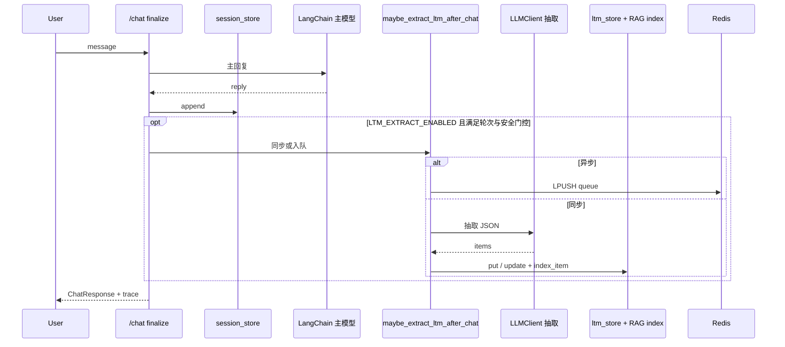

# V1.1 开发文档（隐式 LTM · 去重 · 异步 · 可选 Embedding）

> **版本定位**：在一期～V5 已具备「显式 LTM + STM + RAG 骨架」的基础上，补齐**长期记忆的第二种来源**：从对话中**可选、可关、可观测**地抽取结构化条目写入 LTM，并支持去重合并、撤销、异步队列与可选远程向量。  
> **关联规划**：《V1.1迭代规划.md》《V1.1_JD对齐迭代规划.md》（仓库 `#Personal_Documents/规划/`）。

---

## 1. 目标与边界

### 1.1 要解决什么

| 维度 | 说明 |
|------|------|
| 产品 | 用户「聊久了希望被记住」→ 半自动沉淀 LTM（`source=dialogue_extract`），默认关闭，避免未配置好时多耗 token。 |
| 工程 | 抽取为**独立 LLM 调用**（`LLMClient` / httpx），与主对话 **LangChain 主链**解耦；失败**不**影响 `/chat` 成功返回。 |
| 可控 | 轮次门控、置信度阈值、去重/合并、撤销、配额可选计入。 |
| 可观测 | Trace 步骤 `ltm_extract`；`ChatResponse` 扩展字段；`GET /health` 的 `ltm_extract_enabled`。 |

### 1.2 明确不做（归三期或长期）

- 每句必写 LTM、跨用户写入、关系时间线/纪念日等重产品。  
- Trace/Eval 任务多实例共享存储、pgvector 独立向量库（见《三期迭代规划》）。

---

## 2. 功能清单（对照实现）

### 2.1 P0：最小可用

| 项 | 实现要点 |
|----|----------|
| 总开关 | `LTM_EXTRACT_ENABLED`，默认 `false`；`settings.ltm_extract_enabled`；热配键同名（见 `app/config/hot_config.py`）。 |
| 抽取管线 | `app/memory/ltm_extract.py`：对话摘录 → 抽取 prompt → JSON items → 校验类型/置信度 → `ltm_store.put` + `ltm_retriever.index_item`。 |
| 触发 | 每 **`LTM_EXTRACT_EVERY_N_TURNS`** 条 **assistant** 消息后触发；`<=0` 不按轮次触发。高风险安全模式下跳过抽取。 |
| 失败隔离 | 异常只打日志 + Trace `error`，主回复照常返回。 |
| 单测 | `tests/test_v11_ltm_extract_switch.py`、`tests/test_v11_ltm_extract_pipeline.py` 等。 |

### 2.2 P1：产品化

| 项 | 实现要点 |
|----|----------|
| 去重/合并 | `app/memory/ltm_dedup.py`（`best_match_same_type`）；阈值 `LTM_EXTRACT_DEDUP_*`，过高相似跳过新建，中间区间 `update_item`。 |
| 撤销 | `POST /memory/ltm/undo_extract`（`routes.py`），依据 Trace `decision.ltm_extract_new_ids` 软删/移除本轮**新建** id。 |
| 配额 | `QUOTA_ENABLED` 时 `LTM_EXTRACT_COUNT_TOWARD_QUOTA`、预检与扣减见 `app/quota/limiter.py` 与 `ltm_extract.py`。 |
| 前端提示 | 流式/async pending 时 Web Toast、Trace 轮询等（见《常用命令》§8）。 |

### 2.3 P2：与三期衔接

| 项 | 实现要点 |
|----|----------|
| 异步抽取 | `LTM_EXTRACT_ASYNC=true` 且配置 **`REDIS_URL`**：`app/memory/ltm_extract_async.py` 队列键 **`companion:ltm_extract:queue`**；`app/main.py` lifespan 内 **`ltm_extract_worker_loop`** BRPOP 消费；无 Redis 回退同步。 |
| 远程 Embedding | `RAG_EMBEDDING_API_BASE` / `KEY` / `MODEL`：`app/rag/embedding_provider.py`；失败回退稀疏向量。 |

---

## 3. 主链路数据流（与 `/chat` 的关系）

**接入点**：`app/services/chat_turn.py` 在 STM 写入与收尾阶段调用 `maybe_extract_ltm_after_chat`；流式路径在 `finalize_chat_turn` 中同样处理。

---

## 4. 关键代码与文件

| 路径 | 职责 |
|------|------|
| `app/memory/ltm_extract.py` | 抽取 prompt、解析、校验、写库、索引、Trace 步骤、配额钩子。 |
| `app/memory/ltm_extract_async.py` | Redis 队列、worker 循环、任务 payload 约定。 |
| `app/memory/ltm_dedup.py` | 与近期 LTM 条目的相似度决策（skip / merge / new）。 |
| `app/services/chat_turn.py` | 编排调用抽取、填充响应与 Trace decision。 |
| `app/api/routes.py` | `GET /health` 字段；`POST /memory/ltm/undo_extract`。 |
| `app/api/schemas.py` | `ChatResponse`：`ltm_extract_written` / `updated` / `new_ids` / `async_pending`。 |
| `app/trace/models.py` | `TraceDecision` 中 `ltm_extract_*` 字段。 |
| `app/config/hot_config.py` | 运营热配可改抽取相关开关（白名单字段 + 校验）。 |
| `app/rag/embedding_provider.py` | 可选 OpenAI 兼容 `/embeddings`。 |

---

## 5. 配置说明（`.env`）

完整注释见项目根 **`/.env.example`**（V1.1 段）。常用项：

| 变量 | 含义 |
|------|------|
| `LTM_EXTRACT_ENABLED` | 总开关，默认 false。 |
| `LTM_EXTRACT_EVERY_N_TURNS` | 每 N 条 assistant 后尝试抽取；0 关闭按轮次触发。 |
| `LTM_EXTRACT_MIN_CONFIDENCE` | 单条置信度下限。 |
| `LTM_EXTRACT_MAX_ITEMS` / `LTM_EXTRACT_CHAR_BUDGET` | 单次条数上限与摘录字符预算。 |
| `LTM_EXTRACT_DEDUP_*` | 去重启用与相似度阈值、回溯条数。 |
| `LTM_EXTRACT_COUNT_TOWARD_QUOTA` | 是否计入日字符配额。 |
| `LTM_EXTRACT_ASYNC` | 异步队列（须 `REDIS_URL`）。 |
| `RAG_EMBEDDING_*` | 可选远程向量；留空则用本地稀疏向量。 |

**依赖**：隐式写入进 MySQL 等时需配置 **`DATABASE_URL`**；STM/队列用 **`REDIS_URL`**（与三期文档一致）。

---

## 6. API 与契约

### 6.1 响应扩展（`POST /chat`、`POST /chat/stream` 的 done 体）

- `ltm_extract_written`：本轮新建条数。  
- `ltm_extract_updated`：本轮合并更新条数。  
- `ltm_extract_new_ids`：新建 id 列表，供撤销。  
- `ltm_extract_async_pending`：已入队、后台未完成时为 true（前端可轮询 Trace）。

### 6.2 撤销

- **`POST /memory/ltm/undo_extract`**：body 含 `trace_id`、`user_id`（与隔离策略一致）；服务端根据该 Trace 的 `ltm_extract_new_ids` 删除对应条目（实现细节见 `routes.py`）。

### 6.3 探活

- **`GET /health`**：`ltm_extract_enabled` 与当前 `settings` 一致，便于运维与探针页。

---

## 7. Trace 约定

- 步骤名：**`ltm_extract`**。  
- `output_summary`：建议包含 `written` / `updated` / `skipped_*` 等摘要；异步场景下可能先标记 pending，worker 完成后合并更新 Trace（见异步模块逻辑）。  
- `TraceDecision` 与响应体字段对齐，便于 Web「刷新 Trace」与撤销。

---

## 8. 测试与回归

| 文件 | 覆盖点 |
|------|--------|
| `tests/test_v11_ltm_extract_switch.py` | 开关与 `/health` 可观测性。 |
| `tests/test_v11_ltm_extract_pipeline.py` | mock 抽取、写库/列表。 |
| `tests/test_v11_ltm_extract_async.py` | 异步 + Redis 入队与 pending 响应。 |

**注意**：`tests/conftest.py` 常将 `LTM_EXTRACT_ENABLED` 置为 `false`，避免干扰其它用例；专项测试内再覆盖开启路径。

---

## 9. 验收清单（建议手测）

1. **`LTM_EXTRACT_ENABLED=false`**：多轮对话后 Memory Studio 无新增 `dialogue_extract`（除非显式 POST `/memory/ltm`）。  
2. **`LTM_EXTRACT_ENABLED=true`**：满足 N 轮 assistant 后，LTM 列表出现新行，`source` 为 `dialogue_extract`。  
3. **Trace**：存在 `ltm_extract` 步骤，内容与响应字段一致。  
4. **去重**：重复偏好不无限增殖；相似条目表现为 `ltm_extract_updated` 增加。  
5. **撤销**：`undo_extract` 后新建 id 对应记录不再参与列表/RAG（按实现为准）。  
6. **异步**（可选）：`LTM_EXTRACT_ASYNC=true` + Redis，响应 `ltm_extract_async_pending`，Trace 最终合并。  
7. **配额**（可选）：`QUOTA_ENABLED` + 抽取计入，预算不足时抽取跳过且 Trace 可区分。

---

## 10. 与其它文档索引

| 文档 | 用途 |
|------|------|
| `V1.1迭代规划.md` | 版本边界、待办矩阵、里程碑。 |
| `#Personal_Documents/常用命令.md` §8 | STM/LTM/抽取行为与验证说明。 |
| `README.md` | 启动、LangChain 与 httpx 分工。 |
| `三期迭代规划.md` | 向量库、多实例、Eval 持久化等后续项。 |

---

*文档版本：v1 — 与当前仓库 `app/memory/ltm_extract*.py`、`chat_turn.py`、`routes.py` 对齐；代码变更时请同步更新 §4、§5、§8。*
